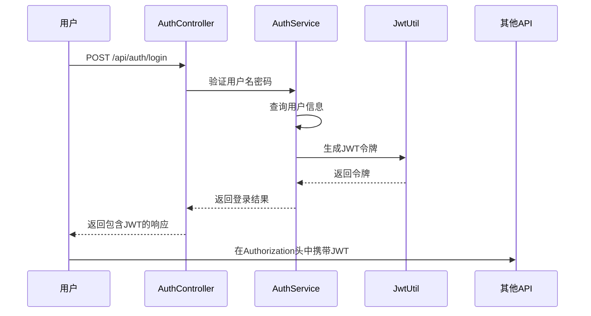
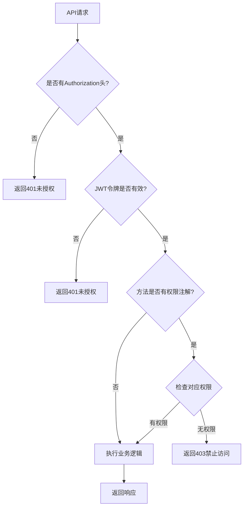
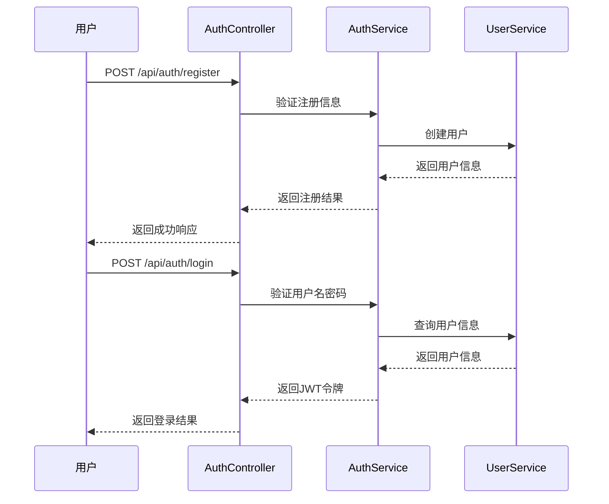
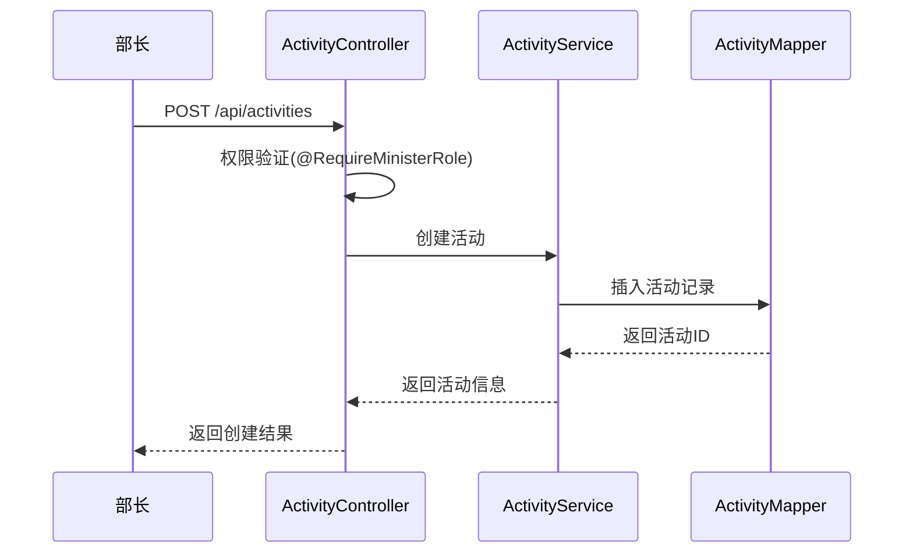
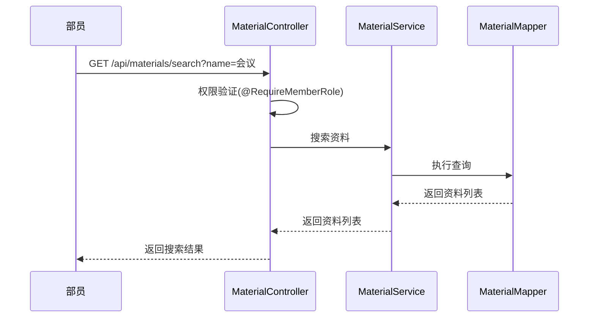
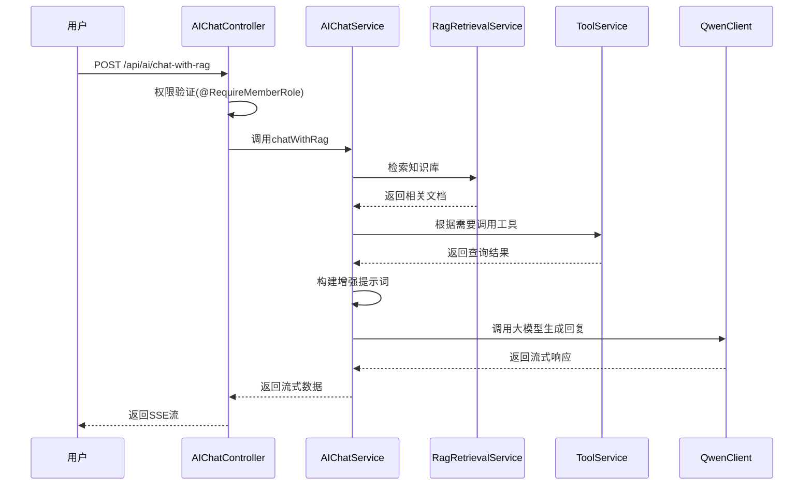

# API参考文档

<cite>
**本文档中引用的文件**   
- [AIChatController.java](file://src/main/java/com/redmoon2333/controller/AIChatController.java)
- [RagChatRequest.java](file://src/main/java/com/redmoon2333/dto/RagChatRequest.java)
- [ChatRequest.java](file://src/main/java/com/redmoon2333/dto/ChatRequest.java)
- [ChatResponse.java](file://src/main/java/com/redmoon2333/dto/ChatResponse.java)
- [AuthController.java](file://src/main/java/com/redmoon2333/controller/AuthController.java)
- [ActivityController.java](file://src/main/java/com/redmoon2333/controller/ActivityController.java)
- [MaterialController.java](file://src/main/java/com/redmoon2333/controller/MaterialController.java)
- [PastActivityController.java](file://src/main/java/com/redmoon2333/controller/PastActivityController.java)
- [UserController.java](file://src/main/java/com/redmoon2333/controller/UserController.java)
- [LoginRequest.java](file://src/main/java/com/redmoon2333/dto/LoginRequest.java)
- [RegisterRequest.java](file://src/main/java/com/redmoon2333/dto/RegisterRequest.java)
- [ActivityRequest.java](file://src/main/java/com/redmoon2333/dto/ActivityRequest.java)
- [ActivityResponse.java](file://src/main/java/com/redmoon2333/dto/ActivityResponse.java)
- [MaterialRequest.java](file://src/main/java/com/redmoon2333/dto/MaterialRequest.java)
- [MaterialResponse.java](file://src/main/java/com/redmoon2333/dto/MaterialResponse.java)
- [PastActivityRequest.java](file://src/main/java/com/redmoon2333/dto/PastActivityRequest.java)
- [PastActivityResponse.java](file://src/main/java/com/redmoon2333/dto/PastActivityResponse.java)
- [ApiResponse.java](file://src/main/java/com/redmoon2333/dto/ApiResponse.java)
- [RequireMemberRole.java](file://src/main/java/com/redmoon2333/annotation/RequireMemberRole.java)
- [RequireMinisterRole.java](file://src/main/java/com/redmoon2333/annotation/RequireMinisterRole.java)
- [PermissionAspect.java](file://src/main/java/com/redmoon2333/aspect/PermissionAspect.java)
- [JwtAuthenticationFilter.java](file://src/main/java/com/redmoon2333/config/JwtAuthenticationFilter.java)
- [AIChatService.java](file://src/main/java/com/redmoon2333/service/AIChatService.java)
- [RagRetrievalService.java](file://src/main/java/com/redmoon2333/service/RagRetrievalService.java)
- [ToolService.java](file://src/main/java/com/redmoon2333/service/ToolService.java)
- [RagConfig.java](file://src/main/java/com/redmoon2333/config/RagConfig.java)
</cite>

## 更新摘要
**已做更改**   
- 在“AI对话相关API”部分新增了 **RAG增强AI流式对话接口** 的详细文档
- 添加了新的请求体结构 `RagChatRequest` 及其参数说明
- 更新了使用示例，包含 `chatWithRag` 接口的 curl 调用示例
- 新增了关于RAG和工具调用功能的典型使用场景说明
- 更新了文档引用文件列表，加入了新增功能相关的源码文件

## 目录
1. [简介](#简介)
2. [认证机制](#认证机制)
3. [API端点详情](#api端点详情)
4. [权限控制](#权限控制)
5. [使用示例](#使用示例)
6. [错误处理](#错误处理)
7. [典型使用场景](#典型使用场景)

## 简介
本API参考文档详细描述了学生会人力资源管理系统的所有公共接口。系统提供用户认证、活动管理、内部资料管理和往届成员查询等核心功能，所有API均遵循RESTful设计原则，使用JSON格式进行数据交换，并通过JWT实现无状态认证。

**本文档中引用的文件**   
- [README.md](file://README.md#L1-L444)

## 认证机制
系统采用JWT（JSON Web Token）进行无状态认证。用户登录成功后，服务器返回包含用户信息的JWT令牌，后续请求需在Authorization头中携带该令牌。

### JWT令牌结构
```json
{
  "userId": 1,
  "username": "admin",
  "roleHistory": "2024级部长,2023级部员",
  "exp": 1727890800
}
```

### 认证流程


**Diagram sources**
- [AuthController.java](file://src/main/java/com/redmoon2333/controller/AuthController.java#L1-L153)
- [JwtAuthenticationFilter.java](file://src/main/java/com/redmoon2333/config/JwtAuthenticationFilter.java#L1-L20)

**本文档中引用的文件**   
- [AuthController.java](file://src/main/java/com/redmoon2333/controller/AuthController.java#L1-L153)
- [JwtAuthenticationFilter.java](file://src/main/java/com/redmoon2333/config/JwtAuthenticationFilter.java#L1-L20)

## API端点详情

### 认证相关API

#### 用户登录
- **HTTP方法**: POST
- **URL路径**: `/api/auth/login`
- **请求头**: Content-Type: application/json
- **请求体结构**: [LoginRequest](file://src/main/java/com/redmoon2333/dto/LoginRequest.java)
- **响应格式**: [ApiResponse](file://src/main/java/com/redmoon2333/dto/ApiResponse.java) 包含JWT令牌和用户信息

```json
{
  "username": "string",
  "password": "string"
}
```

#### 用户注册
- **HTTP方法**: POST
- **URL路径**: `/api/auth/register`
- **请求头**: Content-Type: application/json
- **请求体结构**: [RegisterRequest](file://src/main/java/com/redmoon2333/dto/RegisterRequest.java)
- **响应格式**: [ApiResponse](file://src/main/java/com/redmoon2333/dto/ApiResponse.java) 包含用户信息

```json
{
  "username": "string",
  "password": "string",
  "confirmPassword": "string",
  "activationCode": "string",
  "roleHistory": "string",
  "name": "string"
}
```

#### 获取当前用户信息
- **HTTP方法**: GET
- **URL路径**: `/api/auth/current-user`
- **请求头**: Authorization: Bearer {JWT}
- **响应格式**: [ApiResponse](file://src/main/java/com/redmoon2333/dto/ApiResponse.java) 包含当前用户信息

#### 生成激活码
- **HTTP方法**: POST
- **URL路径**: `/api/auth/generate-code`
- **请求头**: Authorization: Bearer {JWT}
- **请求参数**: expireDays (可选，默认30天)
- **响应格式**: [ApiResponse](file://src/main/java/com/redmoon2333/dto/ApiResponse.java) 包含生成的激活码

**本文档中引用的文件**   
- [AuthController.java](file://src/main/java/com/redmoon2333/controller/AuthController.java#L1-L153)
- [LoginRequest.java](file://src/main/java/com/redmoon2333/dto/LoginRequest.java#L1-L39)
- [RegisterRequest.java](file://src/main/java/com/redmoon2333/dto/RegisterRequest.java#L1-L98)

### 活动管理API

#### 创建活动
- **HTTP方法**: POST
- **URL路径**: `/api/activities`
- **权限要求**: @RequireMinisterRole
- **请求头**: Content-Type: application/json, Authorization: Bearer {JWT}
- **请求体结构**: [ActivityRequest](file://src/main/java/com/redmoon2333/dto/ActivityRequest.java)
- **响应格式**: [ApiResponse](file://src/main/java/com/redmoon2333/dto/ApiResponse.java) 包含创建的活动信息

#### 获取活动列表
- **HTTP方法**: GET
- **URL路径**: `/api/activities`
- **权限要求**: 需认证
- **请求头**: Authorization: Bearer {JWT}
- **响应格式**: [ApiResponse](file://src/main/java/com/redmoon2333/dto/ApiResponse.java) 包含活动列表

#### 获取活动详情
- **HTTP方法**: GET
- **URL路径**: `/api/activities/{id}`
- **权限要求**: 公开
- **响应格式**: [ApiResponse](file://src/main/java/com/redmoon2333/dto/ApiResponse.java) 包含活动详情

#### 更新活动
- **HTTP方法**: PUT
- **URL路径**: `/api/activities/{id}`
- **权限要求**: @RequireMinisterRole
- **请求头**: Content-Type: application/json, Authorization: Bearer {JWT}
- **请求体结构**: [ActivityRequest](file://src/main/java/com/redmoon2333/dto/ActivityRequest.java)
- **响应格式**: [ApiResponse](file://src/main/java/com/redmoon2333/dto/ApiResponse.java) 包含更新后的活动信息

#### 删除活动
- **HTTP方法**: DELETE
- **URL路径**: `/api/activities/{id}`
- **权限要求**: @RequireMinisterRole
- **请求头**: Authorization: Bearer {JWT}
- **响应格式**: [ApiResponse](file://src/main/java/com/redmoon2333/dto/ApiResponse.java)

#### 添加活动图片
- **HTTP方法**: POST
- **URL路径**: `/api/activities/{id}/images`
- **权限要求**: @RequireMinisterRole
- **请求头**: Authorization: Bearer {JWT}
- **请求参数**: file (MultipartFile), description (可选), sortOrder (可选)
- **响应格式**: [ApiResponse](file://src/main/java/com/redmoon2333/dto/ApiResponse.java) 包含图片信息

**本文档中引用的文件**   
- [ActivityController.java](file://src/main/java/com/redmoon2333/controller/ActivityController.java#L1-L322)
- [ActivityRequest.java](file://src/main/java/com/redmoon2333/dto/ActivityRequest.java#L1-L63)
- [ActivityResponse.java](file://src/main/java/com/redmoon2333/dto/ActivityResponse.java#L1-L20)

### 内部资料管理API

#### 上传资料
- **HTTP方法**: POST
- **URL路径**: `/api/materials/upload`
- **权限要求**: @RequireMemberRole
- **请求头**: Authorization: Bearer {JWT}
- **请求参数**: file (MultipartFile), categoryId, subcategoryId, materialName, description (可选)
- **响应格式**: [ApiResponse](file://src/main/java/com/redmoon2333/dto/ApiResponse.java) 包含资料信息

#### 下载资料
- **HTTP方法**: GET
- **URL路径**: `/api/materials/download/{id}`
- **权限要求**: @RequireMemberRole
- **请求头**: Authorization: Bearer {JWT}
- **响应格式**: 文件流

#### 获取资料详情
- **HTTP方法**: GET
- **URL路径**: `/api/materials/{id}`
- **权限要求**: @RequireMemberRole
- **请求头**: Authorization: Bearer {JWT}
- **响应格式**: [ApiResponse](file://src/main/java/com/redmoon2333/dto/ApiResponse.java) 包含资料信息

#### 按分类获取资料
- **HTTP方法**: GET
- **URL路径**: `/api/materials/category/{id}`
- **权限要求**: @RequireMemberRole
- **请求头**: Authorization: Bearer {JWT}
- **响应格式**: [ApiResponse](file://src/main/java/com/redmoon2333/dto/ApiResponse.java) 包含资料列表

#### 搜索资料
- **HTTP方法**: GET
- **URL路径**: `/api/materials/search`
- **权限要求**: @RequireMemberRole
- **请求头**: Authorization: Bearer {JWT}
- **请求参数**: name
- **响应格式**: [ApiResponse](file://src/main/java/com/redmoon2333/dto/ApiResponse.java) 包含匹配的资料列表

#### 创建分类
- **HTTP方法**: POST
- **URL路径**: `/api/materials/category`
- **权限要求**: @RequireMinisterRole
- **请求头**: Content-Type: application/json, Authorization: Bearer {JWT}
- **请求体结构**: [CategoryRequest](file://src/main/java/com/redmoon2333/dto/CategoryRequest.java)
- **响应格式**: [ApiResponse](file://src/main/java/com/redmoon2333/dto/ApiResponse.java) 包含创建的分类信息

**本文档中引用的文件**   
- [MaterialController.java](file://src/main/java/com/redmoon2333/controller/MaterialController.java#L1-L328)
- [MaterialRequest.java](file://src/main/java/com/redmoon2333/dto/MaterialRequest.java#L1-L20)
- [MaterialResponse.java](file://src/main/java/com/redmoon2333/dto/MaterialResponse.java#L1-L25)

### 往届活动管理API

#### 分页查询往届活动
- **HTTP方法**: GET
- **URL路径**: `/api/past-activities`
- **权限要求**: 公开
- **请求参数**: pageNum (默认1), pageSize (默认10), year (可选), title (可选)
- **响应格式**: [ApiResponse](file://src/main/java/com/redmoon2333/dto/ApiResponse.java) 包含分页结果

#### 创建往届活动
- **HTTP方法**: POST
- **URL路径**: `/api/past-activities`
- **权限要求**: @RequireMinisterRole
- **请求头**: Content-Type: application/json, Authorization: Bearer {JWT}
- **请求体结构**: [PastActivityRequest](file://src/main/java/com/redmoon2333/dto/PastActivityRequest.java)
- **响应格式**: [ApiResponse](file://src/main/java/com/redmoon2333/dto/ApiResponse.java) 包含创建的往届活动

#### 更新往届活动
- **HTTP方法**: PUT
- **URL路径**: `/api/past-activities/{id}`
- **权限要求**: @RequireMinisterRole
- **请求头**: Content-Type: application/json, Authorization: Bearer {JWT}
- **请求体结构**: [PastActivityRequest](file://src/main/java/com/redmoon2333/dto/PastActivityRequest.java)
- **响应格式**: [ApiResponse](file://src/main/java/com/redmoon2333/dto/ApiResponse.java) 包含更新后的往届活动

#### 删除往届活动
- **HTTP方法**: DELETE
- **URL路径**: `/api/past-activities/{id}`
- **权限要求**: @RequireMinisterRole
- **请求头**: Authorization: Bearer {JWT}
- **响应格式**: [ApiResponse](file://src/main/java/com/redmoon2333/dto/ApiResponse.java)

**本文档中引用的文件**   
- [PastActivityController.java](file://src/main/java/com/redmoon2333/controller/PastActivityController.java#L1-L134)
- [PastActivityRequest.java](file://src/main/java/com/redmoon2333/dto/PastActivityRequest.java#L1-L25)
- [PastActivityResponse.java](file://src/main/java/com/redmoon2333/dto/PastActivityResponse.java#L1-L30)

### 用户管理API

#### 获取往届部员信息
- **HTTP方法**: GET
- **URL路径**: `/api/users/alumni`
- **权限要求**: 公开
- **响应格式**: [ApiResponse](file://src/main/java/com/redmoon2333/dto/ApiResponse.java) 包含按年份分组的部员信息

#### 根据姓名查找用户
- **HTTP方法**: GET
- **URL路径**: `/api/users/search/name`
- **权限要求**: 需认证
- **请求头**: Authorization: Bearer {JWT}
- **请求参数**: name
- **响应格式**: [ApiResponse](file://src/main/java/com/redmoon2333/dto/ApiResponse.java) 包含匹配的用户列表

#### 根据姓名模糊查找用户
- **HTTP方法**: GET
- **URL路径**: `/api/users/search/name/like`
- **权限要求**: 需认证
- **请求头**: Authorization: Bearer {JWT}
- **请求参数**: name
- **响应格式**: [ApiResponse](file://src/main/java/com/redmoon2333/dto/ApiResponse.java) 包含匹配的用户列表

**本文档中引用的文件**   
- [UserController.java](file://src/main/java/com/redmoon2333/controller/UserController.java#L1-L140)
- [AlumniResponse.java](file://src/main/java/com/redmoon2333/dto/AlumniResponse.java#L1-L20)
- [PublicUserInfo.java](file://src/main/java/com/redmoon2333/dto/PublicUserInfo.java#L1-L15)

### AI对话相关API

#### AI对话接口（带用户记忆）
- **HTTP方法**: POST
- **URL路径**: `/api/ai/chat`
- **权限要求**: @RequireMemberRole
- **请求头**: Content-Type: application/json, Authorization: Bearer {JWT}
- **请求体结构**: [ChatRequest](file://src/main/java/com/redmoon2333/dto/ChatRequest.java)
- **响应格式**: [ApiResponse](file://src/main/java/com/redmoon2333/dto/ApiResponse.java) 包含聊天响应

#### AI流式对话接口（带用户记忆）
- **HTTP方法**: POST
- **URL路径**: `/api/ai/chat-stream`
- **权限要求**: @RequireMemberRole
- **请求头**: Content-Type: application/json, Authorization: Bearer {JWT}, Accept: text/event-stream
- **请求体结构**: [ChatRequest](file://src/main/java/com/redmoon2333/dto/ChatRequest.java)
- **响应格式**: text/event-stream 流式响应

#### 生成活动策划案
- **HTTP方法**: POST
- **URL路径**: `/api/ai/generate-plan`
- **权限要求**: @RequireMemberRole
- **请求头**: Content-Type: application/json, Authorization: Bearer {JWT}
- **请求体结构**: [PlanGeneratorRequest](file://src/main/java/com/redmoon2333/dto/PlanGeneratorRequest.java)
- **响应格式**: [ApiResponse](file://src/main/java/com/redmoon2333/dto/ApiResponse.java) 包含HTML格式的策划案

#### 流式生成活动策划案
- **HTTP方法**: POST
- **URL路径**: `/api/ai/generate-plan-stream`
- **权限要求**: @RequireMemberRole
- **请求头**: Content-Type: application/json, Authorization: Bearer {JWT}, Accept: text/event-stream
- **请求体结构**: [PlanGeneratorRequest](file://src/main/java/com/redmoon2333/dto/PlanGeneratorRequest.java)
- **响应格式**: text/event-stream 流式响应

#### RAG增强AI流式对话接口
- **HTTP方法**: POST
- **URL路径**: `/api/ai/chat-with-rag`
- **权限要求**: @RequireMemberRole
- **请求头**: Content-Type: application/json, Authorization: Bearer {JWT}, Accept: text/event-stream
- **请求体结构**: [RagChatRequest](file://src/main/java/com/redmoon2333/dto/RagChatRequest.java)
- **响应格式**: text/event-stream 流式响应

**请求体参数说明**:
```json
{
  "message": "用户输入的消息",
  "useRAG": true,
  "enableTools": false
}
```

- **message**: 用户输入的文本消息
- **useRAG**: 是否启用RAG检索功能（默认为true）
- **enableTools**: 是否启用工具调用功能（默认为false）

当 `useRAG` 为 true 时，系统会从知识库中检索相关信息来增强AI回复；当 `enableTools` 为 true 时，AI可调用内部工具查询成员信息、往届成员和部门统计。

**本文档中引用的文件**   
- [AIChatController.java](file://src/main/java/com/redmoon2333/controller/AIChatController.java#L23-L277)
- [RagChatRequest.java](file://src/main/java/com/redmoon2333/dto/RagChatRequest.java#L9-L28)
- [AIChatService.java](file://src/main/java/com/redmoon2333/service/AIChatService.java#L25-L436)
- [RagRetrievalService.java](file://src/main/java/com/redmoon2333/service/RagRetrievalService.java#L19-L166)
- [ToolService.java](file://src/main/java/com/redmoon2333/service/ToolService.java#L18-L167)
- [RagConfig.java](file://src/main/java/com/redmoon2333/config/RagConfig.java#L10-L61)

## 权限控制

### 权限注解
系统使用自定义注解实现细粒度的权限控制：

```java
@RequireMemberRole("操作描述")    // 需要部员及以上权限
@RequireMinisterRole("操作描述")  // 需要部长权限
```

### 权限验证流程


**Diagram sources**
- [RequireMemberRole.java](file://src/main/java/com/redmoon2333/annotation/RequireMemberRole.java#L1-L19)
- [RequireMinisterRole.java](file://src/main/java/com/redmoon2333/annotation/RequireMinisterRole.java#L1-L19)
- [PermissionAspect.java](file://src/main/java/com/redmoon2333/aspect/PermissionAspect.java#L1-L57)

**本文档中引用的文件**   
- [RequireMemberRole.java](file://src/main/java/com/redmoon2333/annotation/RequireMemberRole.java#L1-L19)
- [RequireMinisterRole.java](file://src/main/java/com/redmoon2333/annotation/RequireMinisterRole.java#L1-L19)
- [PermissionAspect.java](file://src/main/java/com/redmoon2333/aspect/PermissionAspect.java#L1-L57)

## 使用示例

### 用户注册登录流程
```bash
# 1. 用户注册
curl -X POST http://localhost:8080/api/auth/register \
  -H "Content-Type: application/json" \
  -d '{
    "username": "zhangsan",
    "password": "password123",
    "confirmPassword": "password123",
    "activationCode": "ACT123456",
    "roleHistory": "2023级部员",
    "name": "张三"
  }'

# 2. 用户登录
curl -X POST http://localhost:8080/api/auth/login \
  -H "Content-Type: application/json" \
  -d '{
    "username": "zhangsan",
    "password": "password123"
  }'
```

### 部长创建活动
```bash
# 使用获取的JWT令牌创建活动
curl -X POST http://localhost:8080/api/activities \
  -H "Content-Type: application/json" \
  -H "Authorization: Bearer YOUR_JWT_TOKEN" \
  -d '{
    "activityName": "迎新晚会",
    "background": "欢迎新生加入学生会",
    "significance": "增强团队凝聚力",
    "purpose": "让新生了解学生会",
    "process": "开场-节目表演-互动游戏-结束"
  }'
```

### 部员查询资料
```bash
# 搜索资料
curl -X GET "http://localhost:8080/api/materials/search?name=会议" \
  -H "Authorization: Bearer YOUR_JWT_TOKEN"

# 下载资料
curl -X GET http://localhost:8080/api/materials/download/1 \
  -H "Authorization: Bearer YOUR_JWT_TOKEN" \
  -o "会议纪要.pdf"
```

### RAG增强AI对话
```bash
# 使用RAG增强对话（启用RAG，禁用工具调用）
curl -X POST http://localhost:8080/api/ai/chat-with-rag \
  -H "Content-Type: application/json" \
  -H "Authorization: Bearer YOUR_JWT_TOKEN" \
  -H "Accept: text/event-stream" \
  -d '{
    "message": "请根据知识库内容回答：人力资源中心的成立背景是什么？",
    "useRAG": true,
    "enableTools": false
  }'

# 使用RAG增强对话并启用工具调用
curl -X POST http://localhost:8080/api/ai/chat-with-rag \
  -H "Content-Type: application/json" \
  -H "Authorization: Bearer YOUR_JWT_TOKEN" \
  -H "Accept: text/event-stream" \
  -d '{
    "message": "帮我查一下叫李四的成员信息",
    "useRAG": true,
    "enableTools": true
  }'
```

**本文档中引用的文件**   
- [README.md](file://README.md#L1-L444)
- [AuthController.java](file://src/main/java/com/redmoon2333/controller/AuthController.java#L1-L153)
- [ActivityController.java](file://src/main/java/com/redmoon2333/controller/ActivityController.java#L1-L322)
- [MaterialController.java](file://src/main/java/com/redmoon2333/controller/MaterialController.java#L1-L328)
- [AIChatController.java](file://src/main/java/com/redmoon2333/controller/AIChatController.java#L23-L277)

## 错误处理
所有API使用统一的错误响应格式：

```json
{
  "message": "错误信息",
  "data": null,
  "code": 400
}
```

### 常见错误码
| 错误码 | 说明 |
|-------|------|
| 400 | 请求参数错误 |
| 401 | 未授权或JWT无效 |
| 403 | 权限不足 |
| 404 | 资源不存在 |
| 500 | 系统内部错误 |

**本文档中引用的文件**   
- [ApiResponse.java](file://src/main/java/com/redmoon2333/dto/ApiResponse.java#L1-L62)
- [GlobalExceptionHandler.java](file://src/main/java/com/redmoon2333/exception/GlobalExceptionHandler.java#L1-L20)

## 典型使用场景

### 用户注册登录流程


**Diagram sources**
- [AuthController.java](file://src/main/java/com/redmoon2333/controller/AuthController.java#L1-L153)
- [AuthService.java](file://src/main/java/com/redmoon2333/service/AuthService.java#L1-L20)

### 部长创建活动流程


**Diagram sources**
- [ActivityController.java](file://src/main/java/com/redmoon2333/controller/ActivityController.java#L1-L322)
- [ActivityService.java](file://src/main/java/com/redmoon2333/service/ActivityService.java#L1-L20)

### 部员查询资料流程


**Diagram sources**
- [MaterialController.java](file://src/main/java/com/redmoon2333/controller/MaterialController.java#L1-L328)
- [MaterialService.java](file://src/main/java/com/redmoon2333/service/MaterialService.java#L1-L20)

### RAG增强对话流程


**Diagram sources**
- [AIChatController.java](file://src/main/java/com/redmoon2333/controller/AIChatController.java#L23-L277)
- [AIChatService.java](file://src/main/java/com/redmoon2333/service/AIChatService.java#L25-L436)
- [RagRetrievalService.java](file://src/main/java/com/redmoon2333/service/RagRetrievalService.java#L19-L166)
- [ToolService.java](file://src/main/java/com/redmoon2333/service/ToolService.java#L18-L167)

**本文档中引用的文件**   
- [AuthController.java](file://src/main/java/com/redmoon2333/controller/AuthController.java#L1-L153)
- [ActivityController.java](file://src/main/java/com/redmoon2333/controller/ActivityController.java#L1-L322)
- [MaterialController.java](file://src/main/java/com/redmoon2333/controller/MaterialController.java#L1-L328)
- [PastActivityController.java](file://src/main/java/com/redmoon2333/controller/PastActivityController.java#L1-L134)
- [UserController.java](file://src/main/java/com/redmoon2333/controller/UserController.java#L1-L140)
- [AIChatController.java](file://src/main/java/com/redmoon2333/controller/AIChatController.java#L23-L277)