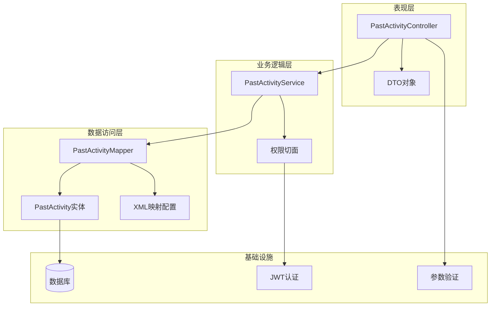
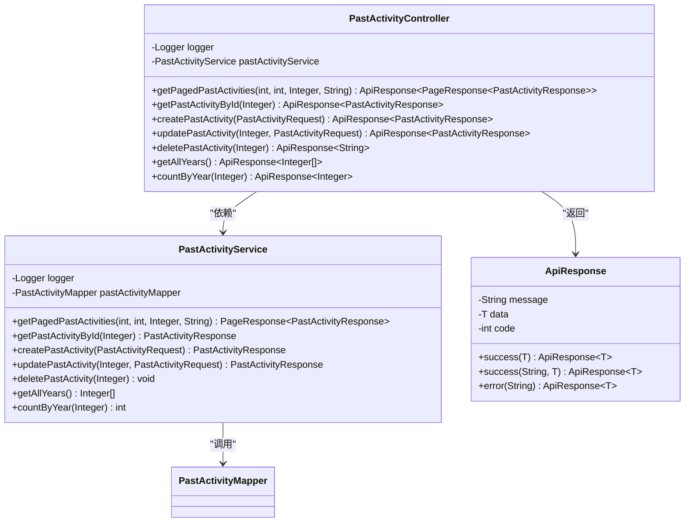
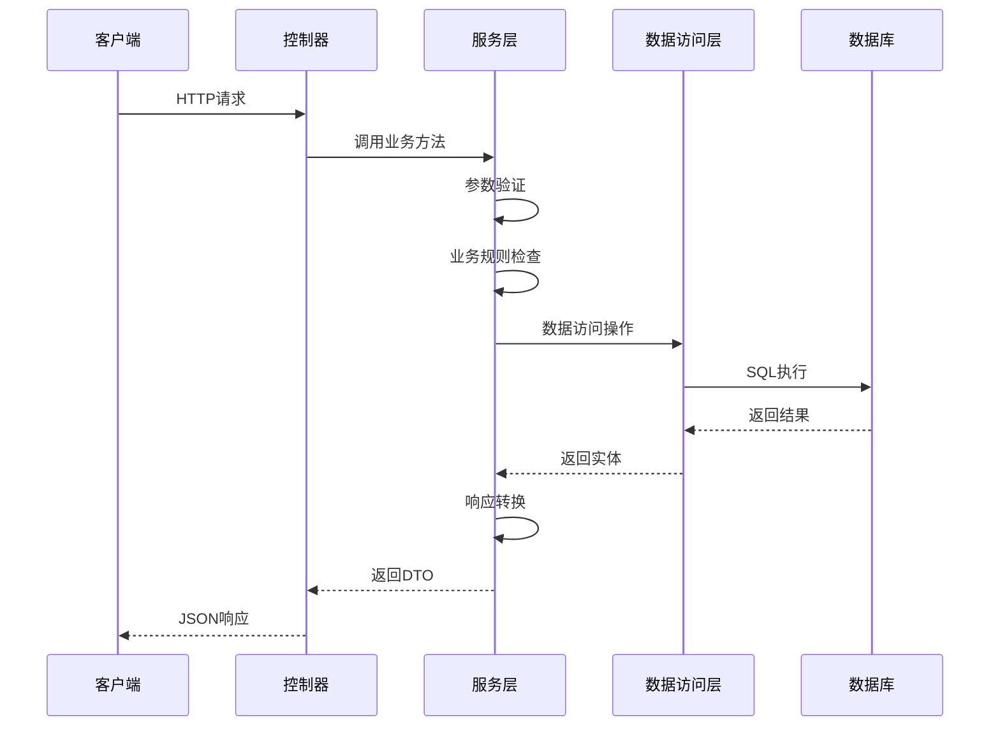
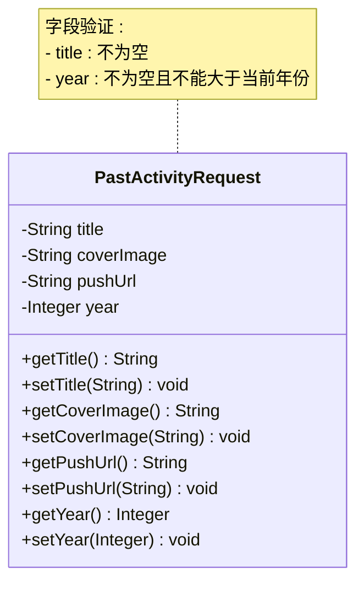
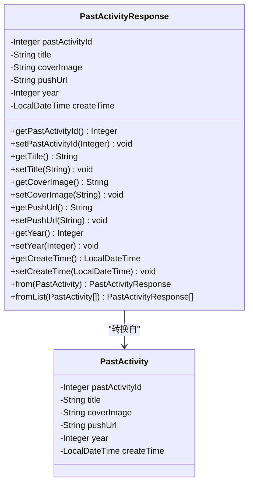
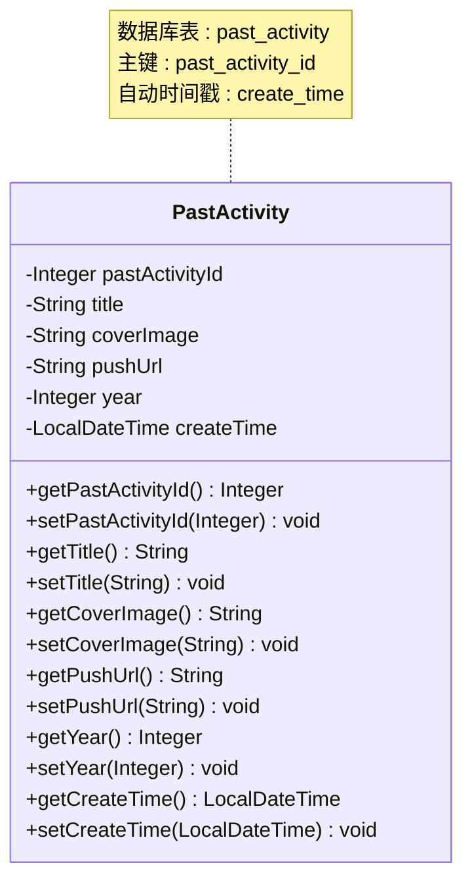
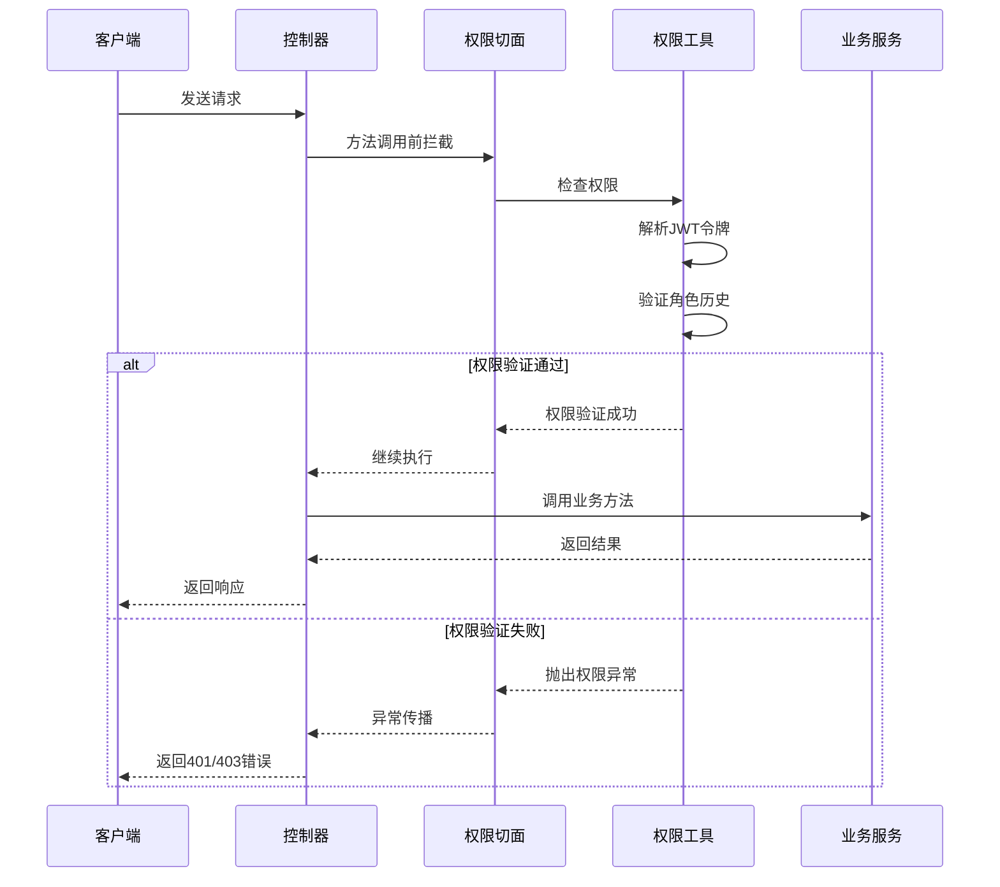
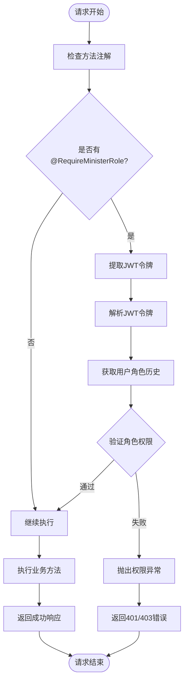
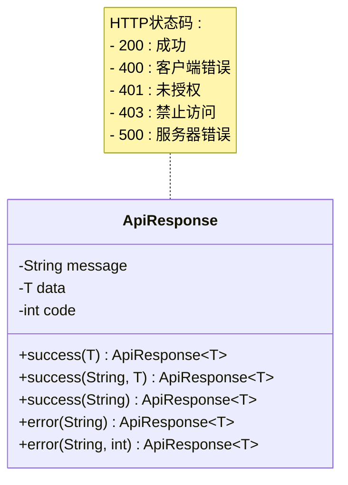
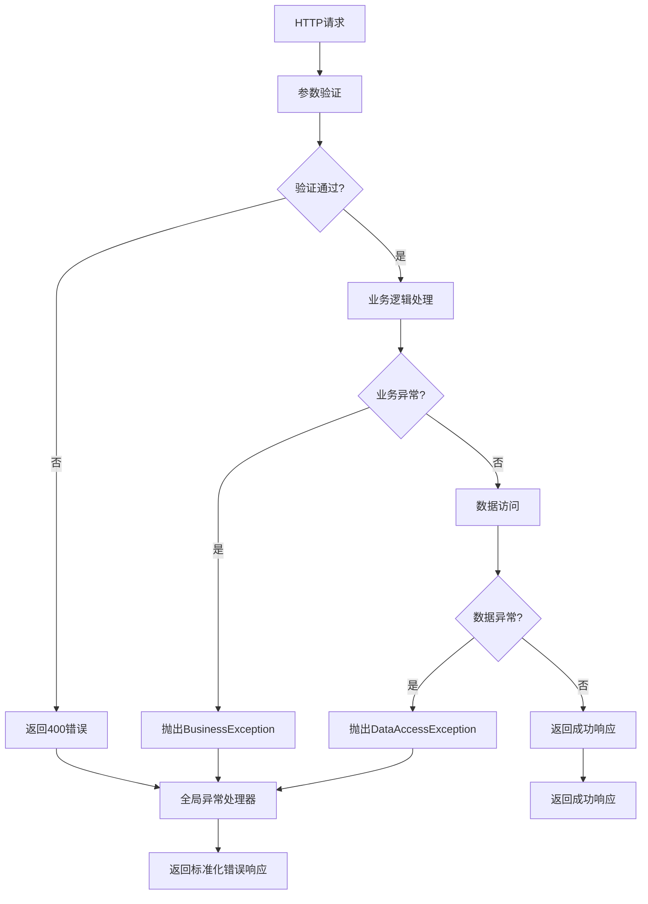

# 往届活动API

<cite>
**本文档引用的文件**
- [PastActivityController.java](file://src/main/java/com/redmoon2333/controller/PastActivityController.java)
- [PastActivityService.java](file://src/main/java/com/redmoon2333/service/PastActivityService.java)
- [PastActivityRequest.java](file://src/main/java/com/redmoon2333/dto/PastActivityRequest.java)
- [PastActivityResponse.java](file://src/main/java/com/redmoon2333/dto/PastActivityResponse.java)
- [PastActivity.java](file://src/main/java/com/redmoon2333/entity/PastActivity.java)
- [PastActivityMapper.java](file://src/main/java/com/redmoon2333/mapper/PastActivityMapper.java)
- [PastActivityMapper.xml](file://src/main/resources/mapper/PastActivityMapper.xml)
- [RequireMinisterRole.java](file://src/main/java/com/redmoon2333/annotation/RequireMinisterRole.java)
- [PermissionAspect.java](file://src/main/java/com/redmoon2333/aspect/PermissionAspect.java)
- [PermissionUtil.java](file://src/main/java/com/redmoon2333/util/PermissionUtil.java)
- [ApiResponse.java](file://src/main/java/com/redmoon2333/dto/ApiResponse.java)
- [PageResponse.java](file://src/main/java/com/redmoon2333/dto/PageResponse.java)
</cite>

## 目录
1. [简介](#简介)
2. [项目架构概览](#项目架构概览)
3. [核心组件分析](#核心组件分析)
4. [API接口详解](#api接口详解)
5. [数据模型](#数据模型)
6. [权限控制机制](#权限控制机制)
7. [错误处理机制](#错误处理机制)
8. [性能考虑](#性能考虑)
9. [故障排除指南](#故障排除指南)
10. [总结](#总结)

## 简介

往届活动API是一个专门用于管理组织历史活动的RESTful API系统。该系统提供了完整的CRUD操作功能，允许管理员创建、查看、更新和删除往届活动记录。所有操作都受到严格的权限控制，确保只有具备部长或副部长权限的用户才能执行敏感操作。

该API系统采用Spring Boot框架构建，使用MyBatis作为ORM工具，实现了分页查询、条件筛选、权限验证等高级功能。系统设计遵循RESTful原则，提供清晰的HTTP状态码和统一的响应格式。

## 项目架构概览

往届活动API采用了典型的三层架构模式，结合Spring Boot的依赖注入和AOP特性，实现了清晰的职责分离和高度的模块化设计。



**图表来源**
- [PastActivityController.java](file://src/main/java/com/redmoon2333/controller/PastActivityController.java#L1-L134)
- [PastActivityService.java](file://src/main/java/com/redmoon2333/service/PastActivityService.java#L1-L305)
- [PastActivityMapper.java](file://src/main/java/com/redmoon2333/mapper/PastActivityMapper.java#L1-L61)

## 核心组件分析

### 控制器层分析

PastActivityController是整个API系统的入口点，负责接收HTTP请求并返回标准化的响应。该控制器使用了Spring MVC的注解驱动方式，提供了完整的RESTful接口。



**图表来源**
- [PastActivityController.java](file://src/main/java/com/redmoon2333/controller/PastActivityController.java#L20-L134)
- [PastActivityService.java](file://src/main/java/com/redmoon2333/service/PastActivityService.java#L25-L305)
- [ApiResponse.java](file://src/main/java/com/redmoon2333/dto/ApiResponse.java#L1-L62)

### 服务层分析

PastActivityService实现了业务逻辑的核心处理，包含了事务管理和异常处理。该服务使用了Spring的声明式事务管理，确保数据的一致性和完整性。



**图表来源**
- [PastActivityController.java](file://src/main/java/com/redmoon2333/controller/PastActivityController.java#L40-L134)
- [PastActivityService.java](file://src/main/java/com/redmoon2333/service/PastActivityService.java#L40-L305)

**章节来源**
- [PastActivityController.java](file://src/main/java/com/redmoon2333/controller/PastActivityController.java#L1-L134)
- [PastActivityService.java](file://src/main/java/com/redmoon2333/service/PastActivityService.java#L1-L305)

## API接口详解

### 1. 分页查询往届活动

**端点**: `GET /api/past-activities`

**功能**: 支持分页查询所有往届活动，可按年份和活动名称进行筛选。

**请求参数**:
- `pageNum` (可选): 页码，默认值为1
- `pageSize` (可选): 每页大小，默认值为10，最大值为100
- `year` (可选): 年份筛选条件
- `title` (可选): 活动名称模糊搜索

**响应格式**:
```json
{
  "message": "操作成功",
  "data": {
    "content": [
      {
        "pastActivityId": 1,
        "title": "2023年度总结大会",
        "coverImage": "https://example.com/images/activity1.jpg",
        "pushUrl": "https://example.com/news/2023-summary",
        "year": 2023,
        "createTime": "2023-01-15T10:30:00"
      }
    ],
    "pageNum": 1,
    "pageSize": 10,
    "total": 25,
    "pages": 3,
    "hasNext": true,
    "hasPrevious": false
  },
  "code": 200
}
```

### 2. 根据ID查询往届活动

**端点**: `GET /api/past-activities/{id}`

**功能**: 根据指定的往届活动ID获取详细的活动信息。

**路径参数**:
- `id`: 往届活动的唯一标识符

**响应格式**:
```json
{
  "message": "操作成功",
  "data": {
    "pastActivityId": 1,
    "title": "2023年度总结大会",
    "coverImage": "https://example.com/images/activity1.jpg",
    "pushUrl": "https://example.com/news/2023-summary",
    "year": 2023,
    "createTime": "2023-01-15T10:30:00"
  },
  "code": 200
}
```

### 3. 创建往届活动

**端点**: `POST /api/past-activities`

**功能**: 创建新的往届活动记录，需要部长或副部长权限。

**请求体**:
```json
{
  "title": "2022年度技术交流会",
  "coverImage": "https://example.com/images/tech-meeting.jpg",
  "pushUrl": "https://example.com/news/2022-tech",
  "year": 2022
}
```

**响应格式**:
```json
{
  "message": "往届活动创建成功",
  "data": {
    "pastActivityId": 2,
    "title": "2022年度技术交流会",
    "coverImage": "https://example.com/images/tech-meeting.jpg",
    "pushUrl": "https://example.com/news/2022-tech",
    "year": 2022,
    "createTime": "2023-01-20T14:45:00"
  },
  "code": 200
}
```

### 4. 更新往届活动

**端点**: `PUT /api/past-activities/{id}`

**功能**: 更新指定往届活动的信息，需要部长或副部长权限。

**路径参数**:
- `id`: 往届活动的唯一标识符

**请求体**:
```json
{
  "title": "2022年度技术交流会（修订版）",
  "coverImage": "https://example.com/images/tech-meeting-updated.jpg",
  "pushUrl": "https://example.com/news/2022-tech-revised",
  "year": 2022
}
```

### 5. 删除往届活动

**端点**: `DELETE /api/past-activities/{id}`

**功能**: 删除指定的往届活动记录，需要部长或副部长权限。

**路径参数**:
- `id`: 往届活动的唯一标识符

**响应格式**:
```json
{
  "message": "往届活动删除成功",
  "data": null,
  "code": 200
}
```

### 6. 获取所有年份列表

**端点**: `GET /api/past-activities/years`

**功能**: 获取所有可用的年份列表，用于前端筛选。

**响应格式**:
```json
{
  "message": "操作成功",
  "data": [2023, 2022, 2021, 2020],
  "code": 200
}
```

### 7. 统计某年活动数量

**端点**: `GET /api/past-activities/years/{year}/count`

**功能**: 统计指定年份的往届活动数量。

**路径参数**:
- `year`: 年份

**响应格式**:
```json
{
  "message": "操作成功",
  "data": 5,
  "code": 200
}
```

**章节来源**
- [PastActivityController.java](file://src/main/java/com/redmoon2333/controller/PastActivityController.java#L30-L134)

## 数据模型

### PastActivityRequest - 请求数据模型

PastActivityRequest是用于创建和更新往届活动的请求数据传输对象，包含了所有必要的验证约束。



**图表来源**
- [PastActivityRequest.java](file://src/main/java/com/redmoon2333/dto/PastActivityRequest.java#L1-L73)

### PastActivityResponse - 响应数据模型

PastActivityResponse是用于返回往届活动信息的响应数据传输对象，包含了所有对外暴露的字段。



**图表来源**
- [PastActivityResponse.java](file://src/main/java/com/redmoon2333/dto/PastActivityResponse.java#L1-L102)
- [PastActivity.java](file://src/main/java/com/redmoon2333/entity/PastActivity.java#L1-L96)

### PastActivity实体模型

PastActivity是持久化到数据库的实体类，包含了所有存储相关的字段和基本操作。



**图表来源**
- [PastActivity.java](file://src/main/java/com/redmoon2333/entity/PastActivity.java#L1-L96)

**章节来源**
- [PastActivityRequest.java](file://src/main/java/com/redmoon2333/dto/PastActivityRequest.java#L1-L73)
- [PastActivityResponse.java](file://src/main/java/com/redmoon2333/dto/PastActivityResponse.java#L1-L102)
- [PastActivity.java](file://src/main/java/com/redmoon2333/entity/PastActivity.java#L1-L96)

## 权限控制机制

### 权限注解系统

系统使用了基于注解的权限控制机制，通过自定义注解和AOP切面实现细粒度的权限验证。



**图表来源**
- [PermissionAspect.java](file://src/main/java/com/redmoon2333/aspect/PermissionAspect.java#L1-L57)
- [PermissionUtil.java](file://src/main/java/com/redmoon2333/util/PermissionUtil.java#L1-L163)

### 权限验证流程

系统实现了两层权限验证机制：

1. **注解级别权限**: 使用`@RequireMinisterRole`注解标记需要部长权限的方法
2. **运行时权限检查**: 通过AOP切面在方法执行前进行权限验证



**图表来源**
- [PermissionAspect.java](file://src/main/java/com/redmoon2333/aspect/PermissionAspect.java#L25-L35)
- [PermissionUtil.java](file://src/main/java/com/redmoon2333/util/PermissionUtil.java#L25-L50)

**章节来源**
- [RequireMinisterRole.java](file://src/main/java/com/redmoon2333/annotation/RequireMinisterRole.java#L1-L19)
- [PermissionAspect.java](file://src/main/java/com/redmoon2333/aspect/PermissionAspect.java#L1-L57)
- [PermissionUtil.java](file://src/main/java/com/redmoon2333/util/PermissionUtil.java#L1-L163)

## 错误处理机制

### 统一响应格式

系统使用统一的ApiResponse格式来封装所有API响应，确保客户端能够一致地处理成功和失败的情况。



**图表来源**
- [ApiResponse.java](file://src/main/java/com/redmoon2333/dto/ApiResponse.java#L1-L62)

### 异常处理策略

系统实现了多层次的异常处理机制：

1. **业务异常**: 由BusinessException抛出，包含具体的错误码和消息
2. **系统异常**: 由系统异常捕获并转换为适当的业务异常
3. **参数验证异常**: 由Spring Validation框架处理



**图表来源**
- [PastActivityService.java](file://src/main/java/com/redmoon2333/service/PastActivityService.java#L40-L100)

**章节来源**
- [ApiResponse.java](file://src/main/java/com/redmoon2333/dto/ApiResponse.java#L1-L62)
- [PastActivityService.java](file://src/main/java/com/redmoon2333/service/PastActivityService.java#L40-L305)

## 性能考虑

### 分页查询优化

系统使用了MyBatis的PageHelper插件实现高效的分页查询，避免全表扫描带来的性能问题。

### 数据库索引建议

为了提高查询性能，建议在以下字段上创建索引：
- `year` 字段：用于年份筛选
- `title` 字段：用于模糊搜索
- `create_time` 字段：用于排序

### 缓存策略

对于频繁查询的年份列表等静态数据，可以考虑引入Redis缓存，减少数据库查询压力。

## 故障排除指南

### 常见问题及解决方案

1. **权限验证失败**
   - 检查JWT令牌是否有效
   - 确认用户角色历史中包含部长或副部长身份
   - 验证请求头中是否包含正确的Authorization字段

2. **分页参数无效**
   - 确保pageNum和pageSize大于0
   - pageSize不能超过100的限制
   - 检查年份参数是否合理（不能大于当前年份）

3. **数据库连接问题**
   - 检查数据库连接配置
   - 确认数据库服务正常运行
   - 验证SQL语句语法正确性

**章节来源**
- [PastActivityService.java](file://src/main/java/com/redmoon2333/service/PastActivityService.java#L40-L100)

## 总结

往届活动API系统是一个功能完善、设计良好的RESTful API，具有以下特点：

1. **完整的CRUD功能**: 提供了创建、读取、更新、删除往届活动的完整操作
2. **严格的权限控制**: 使用注解和AOP实现细粒度的权限验证
3. **统一的响应格式**: 所有API响应都采用标准化的格式
4. **完善的错误处理**: 实现了多层次的异常处理机制
5. **高性能设计**: 支持分页查询和条件筛选，优化了数据库访问性能

该系统适用于组织的历史活动管理需求，能够有效地帮助管理员维护和展示过往的活动记录。通过合理的权限控制和错误处理机制，确保了系统的安全性和稳定性。