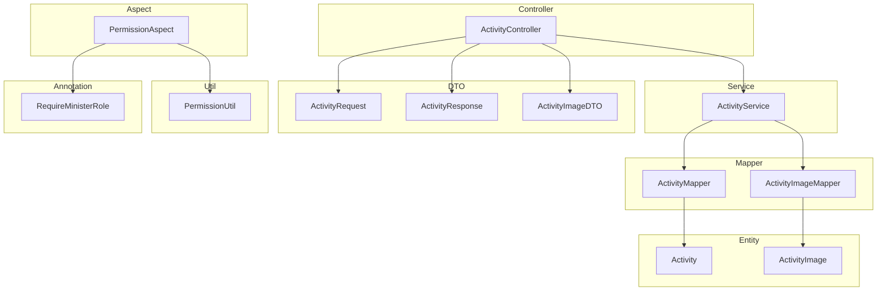
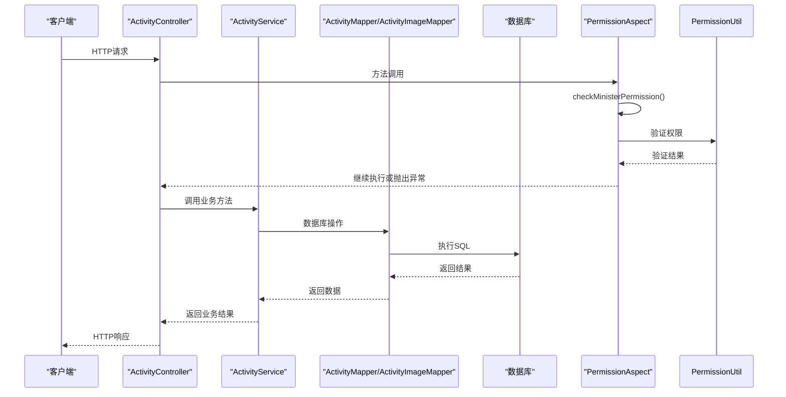
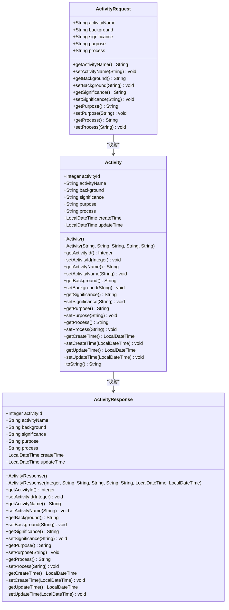
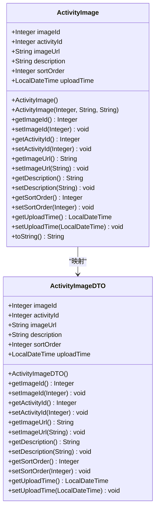
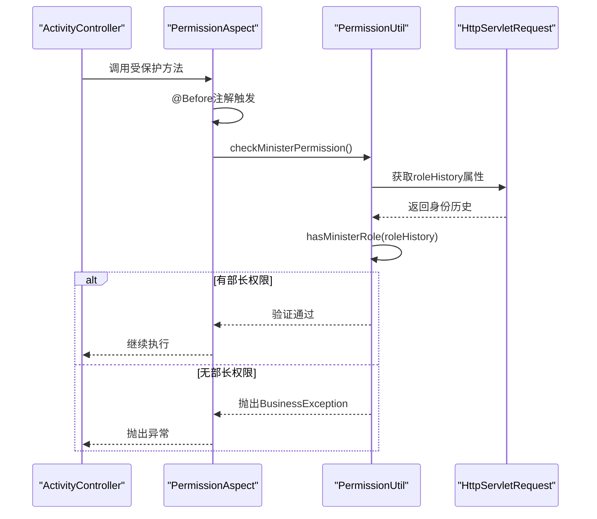
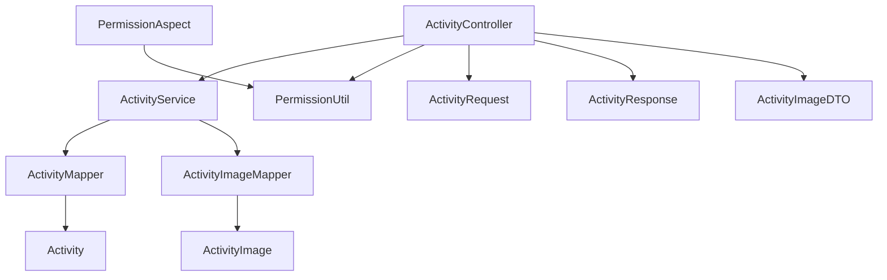

# 活动管理API

<cite>
**本文档中引用的文件**  
- [ActivityController.java](file://src/main/java/com/redmoon2333/controller/ActivityController.java)
- [ActivityService.java](file://src/main/java/com/redmoon2333/service/ActivityService.java)
- [ActivityRequest.java](file://src/main/java/com/redmoon2333/dto/ActivityRequest.java)
- [ActivityResponse.java](file://src/main/java/com/redmoon2333/dto/ActivityResponse.java)
- [ActivityImageDTO.java](file://src/main/java/com/redmoon2333/dto/ActivityImageDTO.java)
- [Activity.java](file://src/main/java/com/redmoon2333/entity/Activity.java)
- [ActivityImage.java](file://src/main/java/com/redmoon2333/entity/ActivityImage.java)
- [RequireMinisterRole.java](file://src/main/java/com/redmoon2333/annotation/RequireMinisterRole.java)
- [PermissionAspect.java](file://src/main/java/com/redmoon2333/aspect/PermissionAspect.java)
- [PermissionUtil.java](file://src/main/java/com/redmoon2333/util/PermissionUtil.java)
</cite>

## 目录
1. [简介](#简介)
2. [项目结构](#项目结构)
3. [核心组件](#核心组件)
4. [架构概览](#架构概览)
5. [详细组件分析](#详细组件分析)
6. [依赖分析](#依赖分析)
7. [性能考虑](#性能考虑)
8. [故障排除指南](#故障排除指南)
9. [结论](#结论)

## 简介
本文档全面介绍了活动管理API，涵盖活动的全生命周期操作（创建、查询、更新、删除）以及活动图片的管理功能。文档详细说明了每个端点的HTTP方法、URL路径、请求参数和请求体结构。明确区分了公开接口（如获取活动详情）和受保护接口（如创建、更新活动），后者通过`@RequireMinisterRole`注解进行权限控制。深入解释了权限控制机制，包括`PermissionAspect`切面如何与`@RequireMinisterRole`注解协同工作，确保只有部长或副部长能执行敏感操作。为活动图片管理（添加、查询、更新、删除图片）提供了专门说明，包括文件上传（MultipartFile）的处理方式和图片排序（sortOrder）功能。提供了完整的请求/响应示例，特别是包含图片URL和描述的复杂对象。说明了`ActivityService`在协调活动和图片数据持久化中的核心作用。包含错误处理策略和性能考虑，例如大量图片加载时的优化建议。

## 项目结构
活动管理API项目采用标准的Spring Boot分层架构，主要分为controller、service、mapper、entity、dto和util等包。controller包包含`ActivityController`，负责处理HTTP请求和响应。service包包含`ActivityService`，实现核心业务逻辑。mapper包包含MyBatis映射器，用于数据库操作。entity包包含JPA实体类，如`Activity`和`ActivityImage`。dto包包含数据传输对象，用于API请求和响应。util包包含工具类，如`PermissionUtil`。annotation和aspect包分别包含自定义注解`@RequireMinisterRole`和权限验证切面`PermissionAspect`。

**Diagram sources**  
- [ActivityController.java](file://src/main/java/com/redmoon2333/controller/ActivityController.java#L1-L318)
- [ActivityService.java](file://src/main/java/com/redmoon2333/service/ActivityService.java#L1-L271)
- [ActivityRequest.java](file://src/main/java/com/redmoon2333/dto/ActivityRequest.java#L1-L62)
- [ActivityResponse.java](file://src/main/java/com/redmoon2333/dto/ActivityResponse.java#L1-L94)
- [ActivityImageDTO.java](file://src/main/java/com/redmoon2333/dto/ActivityImageDTO.java#L1-L62)
- [Activity.java](file://src/main/java/com/redmoon2333/entity/Activity.java#L1-L126)
- [ActivityImage.java](file://src/main/java/com/redmoon2333/entity/ActivityImage.java#L1-L100)
- [RequireMinisterRole.java](file://src/main/java/com/redmoon2333/annotation/RequireMinisterRole.java#L1-L18)
- [PermissionAspect.java](file://src/main/java/com/redmoon2333/aspect/PermissionAspect.java#L1-L39)
- [PermissionUtil.java](file://src/main/java/com/redmoon2333/util/PermissionUtil.java#L1-L116)

**Section sources**  
- [ActivityController.java](file://src/main/java/com/redmoon2333/controller/ActivityController.java#L1-L318)
- [ActivityService.java](file://src/main/java/com/redmoon2333/service/ActivityService.java#L1-L271)

## 核心组件
活动管理API的核心组件包括`ActivityController`、`ActivityService`、`Activity`实体、`ActivityImage`实体以及权限控制相关的`@RequireMinisterRole`注解和`PermissionAspect`切面。`ActivityController`负责处理所有与活动相关的HTTP请求，包括创建、查询、更新、删除活动及其图片。`ActivityService`实现了业务逻辑，协调活动和图片的数据持久化。`Activity`和`ActivityImage`实体类映射数据库表，定义了活动和图片的数据结构。`@RequireMinisterRole`注解用于标记需要部长或副部长权限的方法，`PermissionAspect`切面在方法执行前进行权限验证。

**Section sources**  
- [ActivityController.java](file://src/main/java/com/redmoon2333/controller/ActivityController.java#L1-L318)
- [ActivityService.java](file://src/main/java/com/redmoon2333/service/ActivityService.java#L1-L271)
- [Activity.java](file://src/main/java/com/redmoon2333/entity/Activity.java#L1-L126)
- [ActivityImage.java](file://src/main/java/com/redmoon2333/entity/ActivityImage.java#L1-L100)
- [RequireMinisterRole.java](file://src/main/java/com/redmoon2333/annotation/RequireMinisterRole.java#L1-L18)
- [PermissionAspect.java](file://src/main/java/com/redmoon2333/aspect/PermissionAspect.java#L1-L39)

## 架构概览
活动管理API采用典型的MVC架构，`ActivityController`作为控制器接收HTTP请求，调用`ActivityService`处理业务逻辑，`ActivityService`通过`ActivityMapper`和`ActivityImageMapper`与数据库交互。权限控制通过AOP切面实现，`PermissionAspect`在标记了`@RequireMinisterRole`注解的方法执行前进行权限验证。文件上传功能通过`MultipartFile`实现，图片保存在服务器的uploads目录下，数据库中仅存储图片的相对路径。

**Diagram sources**  
- [ActivityController.java](file://src/main/java/com/redmoon2333/controller/ActivityController.java#L1-L318)
- [ActivityService.java](file://src/main/java/com/redmoon2333/service/ActivityService.java#L1-L271)
- [PermissionAspect.java](file://src/main/java/com/redmoon2333/aspect/PermissionAspect.java#L1-L39)
- [PermissionUtil.java](file://src/main/java/com/redmoon2333/util/PermissionUtil.java#L1-L116)

## 详细组件分析

### 活动管理分析
`ActivityController`提供了完整的活动管理功能，包括创建、查询、更新和删除活动。创建和更新操作使用`@Valid`注解进行请求参数验证，确保数据完整性。所有受保护的操作都使用`@RequireMinisterRole`注解进行权限控制。`ActivityService`实现了业务逻辑，包括检查活动是否存在、设置创建和更新时间、调用Mapper进行数据库操作等。

#### 活动实体类图

**Diagram sources**  
- [Activity.java](file://src/main/java/com/redmoon2333/entity/Activity.java#L1-L126)
- [ActivityRequest.java](file://src/main/java/com/redmoon2333/dto/ActivityRequest.java#L1-L62)
- [ActivityResponse.java](file://src/main/java/com/redmoon2333/dto/ActivityResponse.java#L1-L94)

**Section sources**  
- [ActivityController.java](file://src/main/java/com/redmoon2333/controller/ActivityController.java#L1-L318)
- [ActivityService.java](file://src/main/java/com/redmoon2333/service/ActivityService.java#L1-L271)

### 活动图片管理分析
活动图片管理功能允许为活动添加、查询、更新和删除图片。图片上传通过`MultipartFile`实现，服务器生成唯一文件名并保存到uploads目录，返回相对路径。图片信息（包括URL、描述、排序序号）存储在数据库中。`ActivityImage`实体类与`Activity`通过activityId关联，支持图片排序功能。

#### 活动图片实体类图

**Diagram sources**  
- [ActivityImage.java](file://src/main/java/com/redmoon2333/entity/ActivityImage.java#L1-L100)
- [ActivityImageDTO.java](file://src/main/java/com/redmoon2333/dto/ActivityImageDTO.java#L1-L62)

**Section sources**  
- [ActivityController.java](file://src/main/java/com/redmoon2333/controller/ActivityController.java#L1-L318)
- [ActivityService.java](file://src/main/java/com/redmoon2333/service/ActivityService.java#L1-L271)

### 权限控制分析
权限控制机制通过`@RequireMinisterRole`注解和`PermissionAspect`切面实现。`@RequireMinisterRole`注解标记在需要部长或副部长权限的方法上，`PermissionAspect`切面在方法执行前进行权限验证。`PermissionUtil`工具类从请求中获取用户身份历史，检查是否包含"部长"或"副部长"字样，从而决定是否允许访问。

#### 权限控制序列图

**Diagram sources**  
- [RequireMinisterRole.java](file://src/main/java/com/redmoon2333/annotation/RequireMinisterRole.java#L1-L18)
- [PermissionAspect.java](file://src/main/java/com/redmoon2333/aspect/PermissionAspect.java#L1-L39)
- [PermissionUtil.java](file://src/main/java/com/redmoon2333/util/PermissionUtil.java#L1-L116)

**Section sources**  
- [RequireMinisterRole.java](file://src/main/java/com/redmoon2333/annotation/RequireMinisterRole.java#L1-L18)
- [PermissionAspect.java](file://src/main/java/com/redmoon2333/aspect/PermissionAspect.java#L1-L39)
- [PermissionUtil.java](file://src/main/java/com/redmoon2333/util/PermissionUtil.java#L1-L116)

## 依赖分析
活动管理API的组件之间存在清晰的依赖关系。`ActivityController`依赖`ActivityService`和`PermissionUtil`。`ActivityService`依赖`ActivityMapper`和`ActivityImageMapper`。`PermissionAspect`依赖`PermissionUtil`。`Activity`和`ActivityImage`实体类被Mapper和Service层使用。DTO类被Controller层用于请求和响应的数据传输。

**Diagram sources**  
- [ActivityController.java](file://src/main/java/com/redmoon2333/controller/ActivityController.java#L1-L318)
- [ActivityService.java](file://src/main/java/com/redmoon2333/service/ActivityService.java#L1-L271)
- [PermissionAspect.java](file://src/main/java/com/redmoon2333/aspect/PermissionAspect.java#L1-L39)
- [PermissionUtil.java](file://src/main/java/com/redmoon2333/util/PermissionUtil.java#L1-L116)

**Section sources**  
- [ActivityController.java](file://src/main/java/com/redmoon2333/controller/ActivityController.java#L1-L318)
- [ActivityService.java](file://src/main/java/com/redmoon2333/service/ActivityService.java#L1-L271)

## 性能考虑
在处理大量活动图片时，应考虑以下性能优化建议：1) 实现图片分页加载，避免一次性加载所有图片；2) 使用缓存机制缓存活动和图片列表；3) 对图片进行压缩和格式优化；4) 使用CDN加速图片加载；5) 在数据库查询中使用适当的索引，特别是在activityId和sortOrder字段上。此外，文件上传时应限制文件大小和类型，防止恶意文件上传影响服务器性能。

## 故障排除指南
常见问题及解决方案：1) 权限不足错误：确保用户身份历史包含"部长"或"副部长"；2) 文件上传失败：检查服务器uploads目录权限和磁盘空间；3) 活动不存在错误：确认活动ID正确；4) 数据库连接错误：检查数据库配置和连接状态；5) JWT令牌错误：确保请求携带有效的JWT令牌。日志记录在`ActivityController`和`ActivityService`中详细记录了操作过程，便于问题排查。

**Section sources**  
- [ActivityController.java](file://src/main/java/com/redmoon2333/controller/ActivityController.java#L1-L318)
- [ActivityService.java](file://src/main/java/com/redmoon2333/service/ActivityService.java#L1-L271)
- [PermissionUtil.java](file://src/main/java/com/redmoon2333/util/PermissionUtil.java#L1-L116)

## 结论
活动管理API提供了一套完整的活动全生命周期管理功能，包括创建、查询、更新、删除活动及其图片。通过`@RequireMinisterRole`注解和`PermissionAspect`切面实现了精细的权限控制，确保只有部长或副部长能执行敏感操作。API设计遵循RESTful原则，使用标准的HTTP方法和状态码。`ActivityService`作为核心服务协调数据持久化，确保数据一致性。系统具有良好的扩展性和可维护性，为未来的功能扩展奠定了坚实基础。