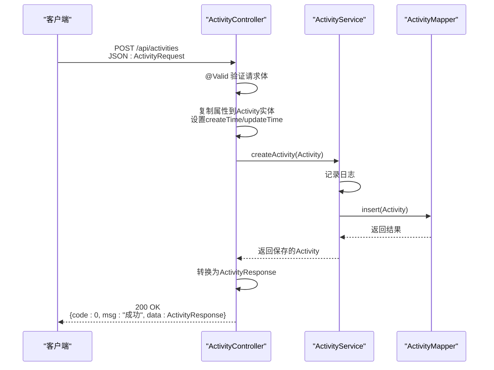
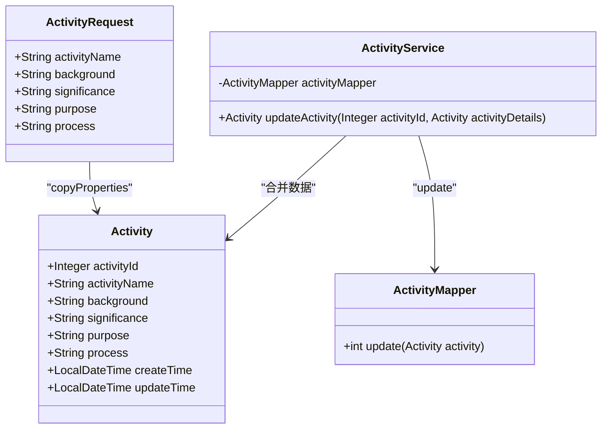
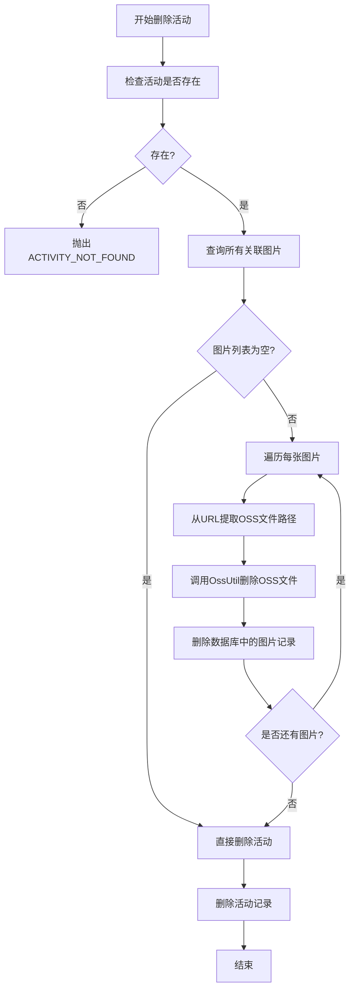
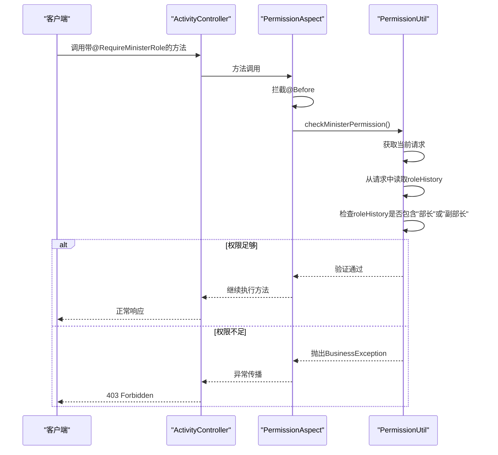

# 活动CRUD操作

<cite>
**本文档中引用的文件**   
- [ActivityController.java](file://src/main/java/com/redmoon2333/controller/ActivityController.java)
- [ActivityService.java](file://src/main/java/com/redmoon2333/service/ActivityService.java)
- [ActivityRequest.java](file://src/main/java/com/redmoon2333/dto/ActivityRequest.java)
- [Activity.java](file://src/main/java/com/redmoon2333/entity/Activity.java)
- [ActivityMapper.java](file://src/main/java/com/redmoon2333/mapper/ActivityMapper.java)
- [ActivityImage.java](file://src/main/java/com/redmoon2333/entity/ActivityImage.java)
- [ActivityImageMapper.java](file://src/main/java/com/redmoon2333/mapper/ActivityImageMapper.java)
- [RequireMinisterRole.java](file://src/main/java/com/redmoon2333/annotation/RequireMinisterRole.java)
- [PermissionAspect.java](file://src/main/java/com/redmoon2333/aspect/PermissionAspect.java)
- [PermissionUtil.java](file://src/main/java/com/redmoon2333/util/PermissionUtil.java)
- [OssUtil.java](file://src/main/java/com/redmoon2333/util/OssUtil.java)
</cite>

## 目录
1. [活动CRUD操作概述](#活动crud操作概述)
2. [创建活动（POST /api/activities）](#创建活动post-apinactivities)
3. [读取活动（GET /api/activities 和 GET /api/activities/{id}）](#读取活动get-apinactivities-和-get-apinactivitiesid)
4. [更新活动（PUT /api/activities/{id}）](#更新活动put-apinactivitiesid)
5. [删除活动（DELETE /api/activities/{id}）](#删除活动delete-apinactivitiesid)
6. [权限控制机制](#权限控制机制)
7. [事务管理与异常处理](#事务管理与异常处理)
8. [接口请求与响应示例](#接口请求与响应示例)

## 活动CRUD操作概述

本节文档详细说明了人力资源官方系统中活动管理模块的完整CRUD（创建、读取、更新、删除）操作流程。系统通过`ActivityController`提供RESTful API接口，实现了对活动信息的全生命周期管理。所有写操作（创建、更新、删除）均受到严格的权限控制，确保只有部长或副部长才能执行。读取操作（获取活动列表和详情）则为公开接口，无需身份验证即可访问。活动数据存储在数据库的`activity`表中，相关的图片资源通过阿里云OSS进行管理，并在删除活动时自动执行级联清理。

**Section sources**
- [ActivityController.java](file://src/main/java/com/redmoon2333/controller/ActivityController.java#L28-L321)

## 创建活动（POST /api/activities）

### ActivityRequest字段验证与用途

`POST /api/activities` 接口用于创建新的活动。该操作要求请求体为`ActivityRequest`对象，并对其进行严格的字段验证。只有通过验证的请求才会被处理。

| 字段名 | 用途 | 验证规则 |
| :--- | :--- | :--- |
| `activityName` | 活动的名称，用于标识和展示 | 必填（`@NotBlank`），长度不超过255个字符（`@Size(max = 255)`） |
| `background` | 活动的背景介绍，说明活动发起的初衷和上下文 | 必填（`@NotBlank`） |
| `significance` | 活动的意义，阐述活动对组织或成员的价值 | 必填（`@NotBlank`） |
| `purpose` | 活动的具体目的，明确活动希望达成的目标 | 必填（`@NotBlank`） |
| `process` | 活动的详细流程，包括时间安排、环节设置等 | 必填（`@NotBlank`） |

在`ActivityController`中，`createActivity`方法接收经过`@Valid`注解验证的`ActivityRequest`对象。验证通过后，控制器会将`ActivityRequest`中的数据复制到`Activity`实体对象中，并设置`createTime`和`updateTime`为当前时间。随后，该实体被传递给`ActivityService`进行持久化。



**Diagram sources**
- [ActivityRequest.java](file://src/main/java/com/redmoon2333/dto/ActivityRequest.java#L0-L62)
- [ActivityController.java](file://src/main/java/com/redmoon2333/controller/ActivityController.java#L28-L61)
- [ActivityService.java](file://src/main/java/com/redmoon2333/service/ActivityService.java#L28-L37)
- [ActivityMapper.java](file://src/main/java/com/redmoon2333/mapper/ActivityMapper.java#L0-L39)

**Section sources**
- [ActivityRequest.java](file://src/main/java/com/redmoon2333/dto/ActivityRequest.java#L0-L62)
- [ActivityController.java](file://src/main/java/com/redmoon2333/controller/ActivityController.java#L28-L61)

## 读取活动（GET /api/activities 和 GET /api/activities/{id}）

### 公开访问特性与响应结构

获取活动信息的接口（`GET /api/activities` 和 `GET /api/activities/{id}`）被设计为公开接口，这意味着任何用户，无论是否登录，都可以访问这些端点来查询活动列表或特定活动的详情。这一设计旨在方便所有成员了解组织的活动动态。

- **`GET /api/activities`**: 返回所有活动的列表，按创建时间倒序排列。响应体是一个包含`ActivityResponse`对象列表的`ApiResponse`。
- **`GET /api/activities/{id}`**: 根据提供的`activityId`返回单个活动的详细信息。如果活动不存在，会抛出`ACTIVITY_NOT_FOUND`业务异常。

`ActivityResponse` DTO包含了活动的所有核心信息，其结构与`Activity`实体类基本一致，但不包含敏感或内部字段。响应通过`ApiResponse`包装，遵循统一的API响应格式。

```mermaid
flowchart TD
A[客户端请求] --> B{请求路径}
B --> |/api/activities| C[调用getAllActivities()]
B --> |/api/activities/{id}| D[调用getActivityById(id)]
C --> E[ActivityService.getAllActivities()]
D --> F[ActivityService.getActivityById(id)]
E --> G[ActivityMapper.selectAll()]
F --> H[ActivityMapper.selectById(id)]
G --> I[返回Activity列表]
H --> J[返回单个Activity]
I --> K[转换为List<ActivityResponse>]
J --> L[转换为ActivityResponse]
K --> M[返回ApiResponse<List<ActivityResponse>>]
L --> N[返回ApiResponse<ActivityResponse>]
M --> O[客户端]
N --> O
```

**Diagram sources**
- [ActivityController.java](file://src/main/java/com/redmoon2333/controller/ActivityController.java#L87-L116)
- [ActivityService.java](file://src/main/java/com/redmoon2333/service/ActivityService.java#L40-L58)
- [ActivityMapper.java](file://src/main/java/com/redmoon2333/mapper/ActivityMapper.java#L0-L39)
- [ActivityResponse.java](file://src/main/java/com/redmoon2333/dto/ActivityResponse.java#L0-L94)

**Section sources**
- [ActivityController.java](file://src/main/java/com/redmoon2333/controller/ActivityController.java#L87-L116)
- [ActivityResponse.java](file://src/main/java/com/redmoon2333/dto/ActivityResponse.java#L0-L94)

## 更新活动（PUT /api/activities/{id}）

### 数据合并逻辑

`PUT /api/activities/{id}` 接口用于更新指定ID的活动信息。其数据合并逻辑如下：

1.  **查找现有实体**：首先，服务层通过`activityMapper.selectById(activityId)`从数据库中查询出当前活动的完整信息。
2.  **属性覆盖**：使用`BeanUtils.copyProperties(activityRequest, existingActivity)`方法，将`ActivityRequest`对象中的所有非空字段值复制到查找到的`existingActivity`实体上。这实现了对`activityName`、`background`、`significance`、`purpose`和`process`等字段的更新。
3.  **更新时间戳**：手动调用`existingActivity.setUpdateTime(LocalDateTime.now())`，确保`updateTime`字段被更新为当前时间。
4.  **持久化**：将修改后的`existingActivity`实体通过`activityMapper.update()`方法写回数据库。

此逻辑确保了只有`ActivityRequest`中提供的字段会被更新，而其他未在请求中提及的字段保持不变。同时，`createTime`字段在更新过程中不会被修改。



**Diagram sources**
- [ActivityRequest.java](file://src/main/java/com/redmoon2333/dto/ActivityRequest.java#L0-L62)
- [Activity.java](file://src/main/java/com/redmoon2333/entity/Activity.java#L0-L126)
- [ActivityService.java](file://src/main/java/com/redmoon2333/service/ActivityService.java#L60-L97)
- [ActivityMapper.java](file://src/main/java/com/redmoon2333/mapper/ActivityMapper.java#L0-L39)

**Section sources**
- [ActivityController.java](file://src/main/java/com/redmoon2333/controller/ActivityController.java#L116-L147)
- [ActivityService.java](file://src/main/java/com/redmoon2333/service/ActivityService.java#L60-L97)

## 删除活动（DELETE /api/activities/{id}）

### 级联处理机制

`DELETE /api/activities/{id}` 接口在删除活动时，会自动执行级联处理，以清理与该活动关联的所有图片资源，防止出现“孤儿”文件。

1.  **检查活动存在性**：首先，通过`activityMapper.selectById(activityId)`确认活动存在。
2.  **查询关联图片**：调用`activityImageMapper.findByActivityId(activityId)`获取该活动下的所有`ActivityImage`记录。
3.  **清理OSS文件**：对于每一条`ActivityImage`记录，从`imageUrl`中提取出OSS上的文件路径（`filePath`），然后通过`OssUtil.deleteFile(filePath)`调用删除OSS上的实际图片文件。
4.  **删除数据库记录**：在OSS文件删除后（或尝试删除后），调用`activityImageMapper.deleteById(imageId)`从数据库中删除对应的图片记录。
5.  **删除活动本身**：最后，调用`activityMapper.deleteById(activityId)`从数据库中删除活动记录。

此过程确保了数据和文件的一致性，实现了真正的“级联删除”。



**Diagram sources**
- [ActivityService.java](file://src/main/java/com/redmoon2333/service/ActivityService.java#L99-L175)
- [ActivityImageMapper.java](file://src/main/java/com/redmoon2333/mapper/ActivityImageMapper.java#L0-L40)
- [OssUtil.java](file://src/main/java/com/redmoon2333/util/OssUtil.java#L0-L210)

**Section sources**
- [ActivityController.java](file://src/main/java/com/redmoon2333/controller/ActivityController.java#L145-L173)
- [ActivityService.java](file://src/main/java/com/redmoon2333/service/ActivityService.java#L99-L175)

## 权限控制机制

### @RequireMinisterRole注解与切面实现

所有对活动的写操作（创建、更新、删除）都受到`@RequireMinisterRole`注解的保护。该注解是一个自定义的运行时注解，标记在`ActivityController`中的相应方法上。

权限验证的逻辑由`PermissionAspect`切面类实现。它使用Spring AOP的`@Before`通知，在被`@RequireMinisterRole`注解的方法执行前进行拦截。

1.  **切面拦截**：当一个被`@RequireMinisterRole`注解的方法被调用时，`PermissionAspect`中的`checkMinisterPermission`方法会被触发。
2.  **调用权限工具**：该方法会调用`PermissionUtil`的`checkMinisterPermission()`方法。
3.  **身份验证**：`PermissionUtil`从当前HTTP请求的上下文中获取`roleHistory`属性。该属性由JWT认证过滤器在用户登录时注入。
4.  **角色检查**：`PermissionUtil`解析`roleHistory`字符串（通常以`&`分隔），检查其中是否包含“部长”或“副部长”字样。如果包含，则验证通过；否则，抛出`UNAUTHORIZED_ACTIVITY_OPERATION`业务异常，阻止方法执行。

这种基于注解和AOP的权限控制方式，实现了业务逻辑与安全逻辑的解耦，使得代码更加清晰和易于维护。



**Diagram sources**
- [RequireMinisterRole.java](file://src/main/java/com/redmoon2333/annotation/RequireMinisterRole.java#L0-L18)
- [PermissionAspect.java](file://src/main/java/com/redmoon2333/aspect/PermissionAspect.java#L0-L56)
- [PermissionUtil.java](file://src/main/java/com/redmoon2333/util/PermissionUtil.java#L0-L162)

**Section sources**
- [ActivityController.java](file://src/main/java/com/redmoon2333/controller/ActivityController.java#L28-L173)
- [RequireMinisterRole.java](file://src/main/java/com/redmoon2333/annotation/RequireMinisterRole.java#L0-L18)
- [PermissionAspect.java](file://src/main/java/com/redmoon2333/aspect/PermissionAspect.java#L0-L56)

## 事务管理与异常处理

### ActivityService中的事务与异常

`ActivityService`类中的方法包含了关键的业务逻辑和异常处理机制。

- **事务管理**：虽然代码中未显式使用`@Transactional`注解，但`ActivityService`中的`createActivity`、`updateActivity`和`deleteActivity`等方法都遵循了“先查后改”的模式，并在单个方法内完成数据库操作。在典型的Spring配置下，这些操作会被包含在同一个数据库事务中，保证了数据的一致性。例如，在`deleteActivity`方法中，删除所有图片记录和删除活动记录的操作是原子性的。
- **异常处理**：
  - **业务异常（BusinessException）**：服务层会主动抛出`BusinessException`，用于处理可预见的业务错误，如`ACTIVITY_NOT_FOUND`、`ACTIVITY_UPDATE_FAILED`等。这些异常会被`GlobalExceptionHandler`捕获，并转换为带有特定错误码的JSON响应。
  - **系统异常**：对于未预期的异常（如数据库连接失败），服务层会将其捕获并包装成`BusinessException`，避免将内部错误细节暴露给客户端。
  - **日志记录**：服务层使用`Logger`对关键操作（如创建、更新、删除）进行详细日志记录，包括操作用户、活动ID、操作结果等，便于问题追踪和审计。

**Section sources**
- [ActivityService.java](file://src/main/java/com/redmoon2333/service/ActivityService.java#L28-L175)
- [exception/BusinessException.java](file://src/main/java/com/redmoon2333/exception/BusinessException.java)
- [exception/ErrorCode.java](file://src/main/java/com/redmoon2333/exception/ErrorCode.java)

## 接口请求与响应示例

### 请求示例

**创建活动 (POST /api/activities)**
```json
{
  "activityName": "年度迎新大会",
  "background": "为新成员提供一个了解组织的平台。",
  "significance": "增强组织凝聚力，促进新老成员交流。",
  "purpose": "介绍组织架构、历史和未来规划。",
  "process": "1. 开场致辞\n2. 组织介绍\n3. 互动环节\n4. 自由交流"
}
```

**更新活动 (PUT /api/activities/1)**
```json
{
  "activityName": "年度迎新大会（更新版）",
  "background": "为新成员提供一个了解组织的平台。",
  "significance": "增强组织凝聚力，促进新老成员交流。",
  "purpose": "介绍组织架构、历史和未来规划，并进行团队建设。",
  "process": "1. 开场致辞\n2. 组织介绍\n3. 团队破冰游戏\n4. 自由交流"
}
```

### 成功响应示例

**创建/更新成功**
```json
{
  "code": 0,
  "msg": "活动创建成功",
  "data": {
    "activityId": 1,
    "activityName": "年度迎新大会",
    "background": "为新成员提供一个了解组织的平台。",
    "significance": "增强组织凝聚力，促进新老成员交流。",
    "purpose": "介绍组织架构、历史和未来规划。",
    "process": "1. 开场致辞\n2. 组织介绍\n3. 互动环节\n4. 自由交流",
    "createTime": "2023-10-27T10:00:00",
    "updateTime": "2023-10-27T10:00:00"
  }
}
```

**获取活动列表成功**
```json
{
  "code": 0,
  "msg": "查询成功",
  "data": [
    {
      "activityId": 1,
      "activityName": "年度迎新大会",
      "createTime": "2023-10-27T10:00:00",
      "updateTime": "2023-10-27T10:00:00"
    }
  ]
}
```

### 失败响应示例

**权限不足**
```json
{
  "code": 10003,
  "msg": "无权执行此活动操作",
  "data": null
}
```

**活动不存在**
```json
{
  "code": 10001,
  "msg": "活动不存在",
  "data": null
}
```

**字段验证失败**
```json
{
  "code": 10000,
  "msg": "活动名称不能为空",
  "data": null
}
```

**Section sources**
- [ActivityController.java](file://src/main/java/com/redmoon2333/controller/ActivityController.java)
- [dto/ApiResponse.java](file://src/main/java/com/redmoon2333/dto/ApiResponse.java)
- [exception/ErrorCode.java](file://src/main/java/com/redmoon2333/exception/ErrorCode.java)