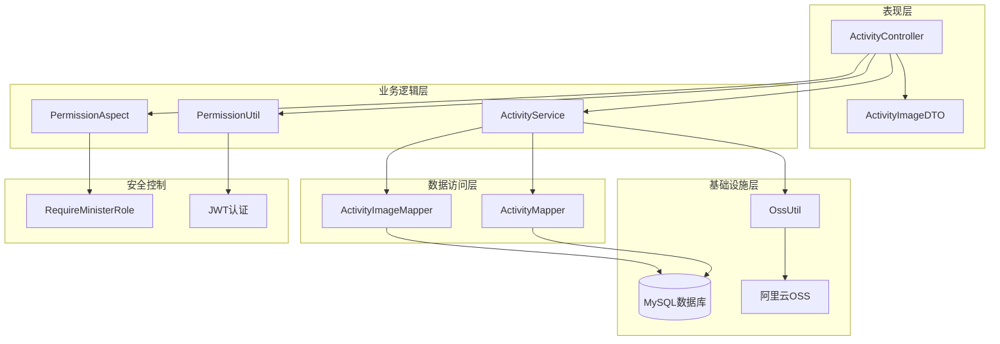
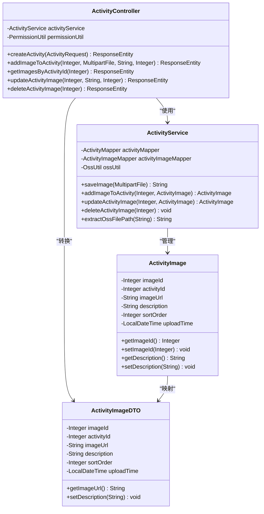
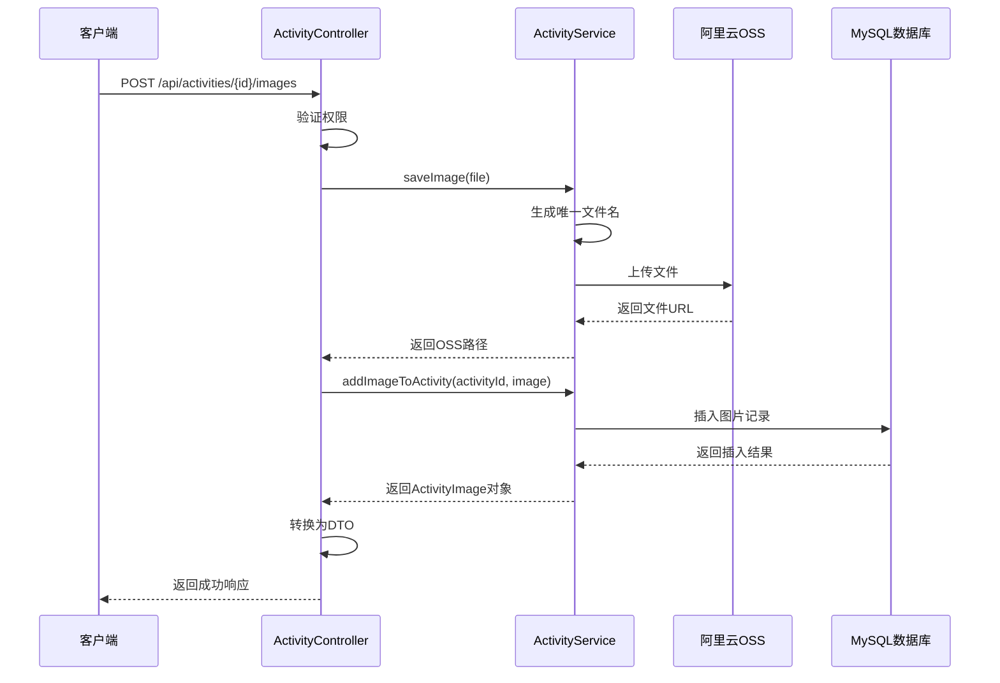
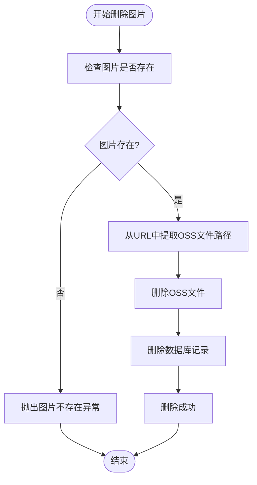
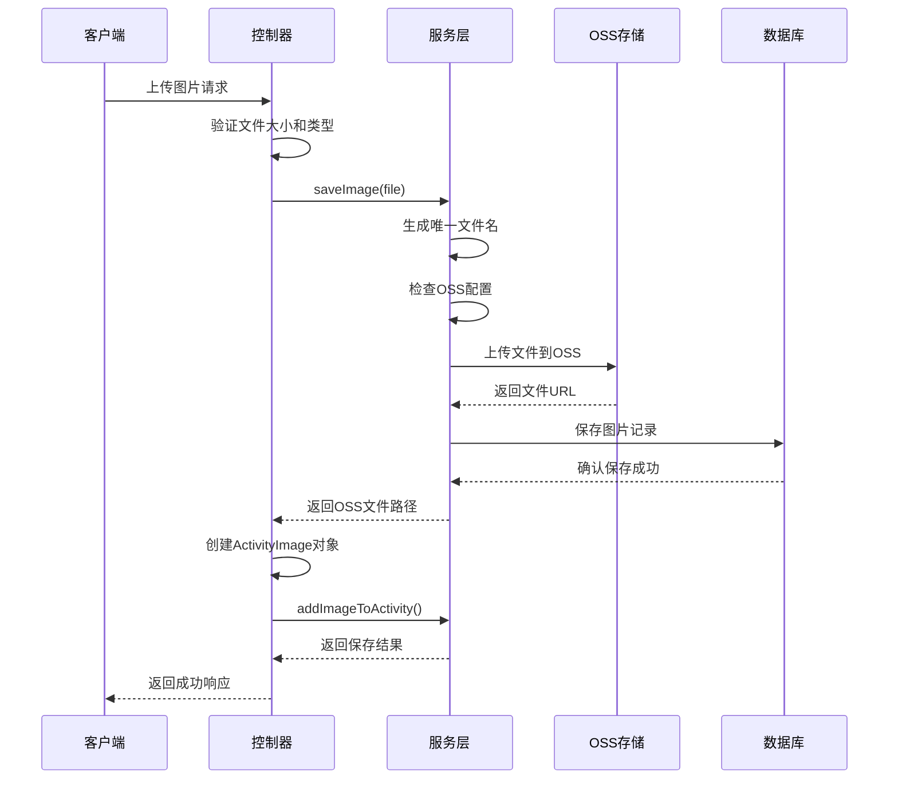
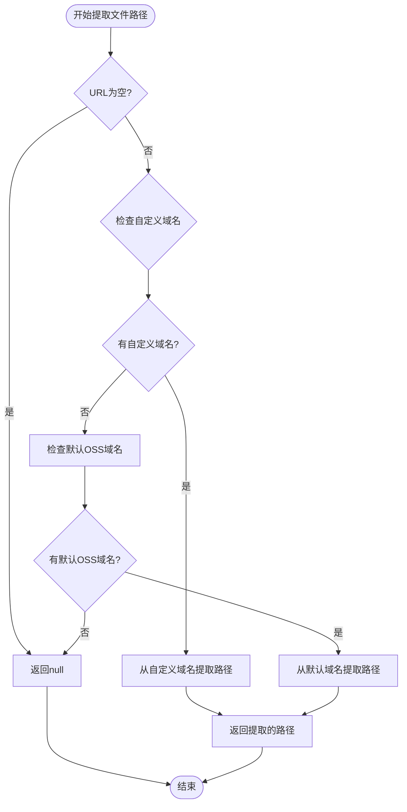
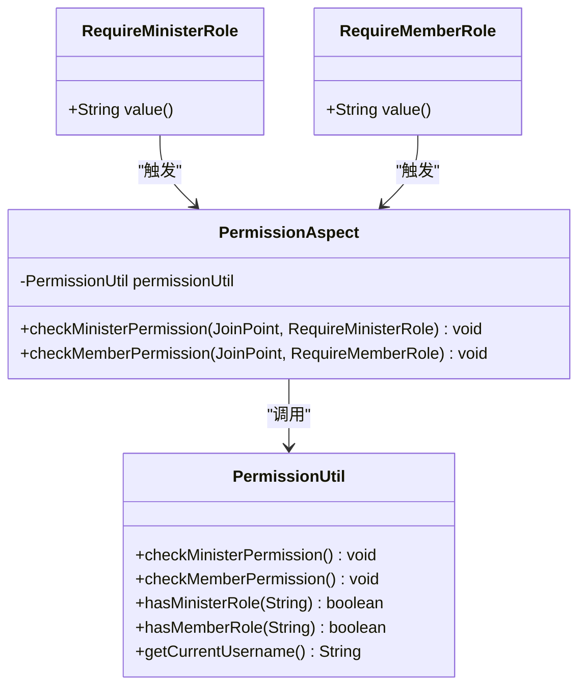
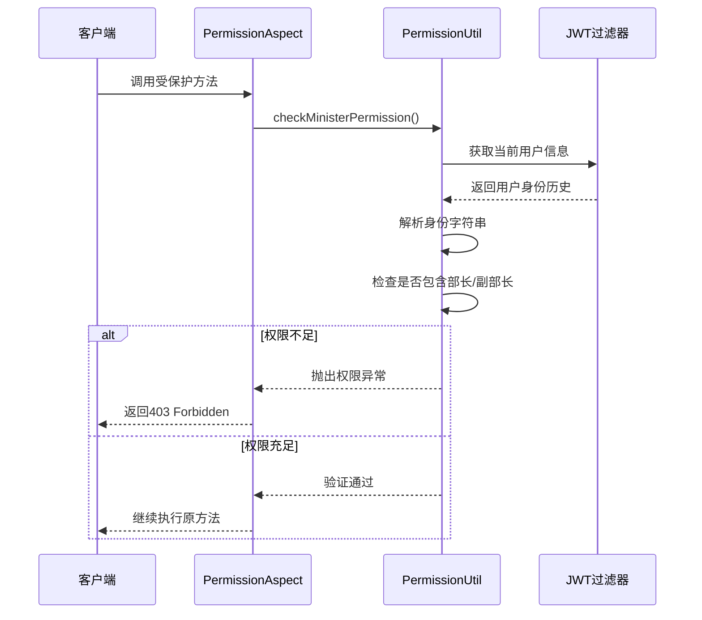

# 活动图片管理API文档

<cite>
**本文档引用的文件**
- [ActivityController.java](file://src/main/java/com/redmoon2333/controller/ActivityController.java)
- [ActivityService.java](file://src/main/java/com/redmoon2333/service/ActivityService.java)
- [OssUtil.java](file://src/main/java/com/redmoon2333/util/OssUtil.java)
- [ActivityImage.java](file://src/main/java/com/redmoon2333/entity/ActivityImage.java)
- [ActivityImageDTO.java](file://src/main/java/com/redmoon2333/dto/ActivityImageDTO.java)
- [ActivityImageMapper.java](file://src/main/java/com/redmoon2333/mapper/ActivityImageMapper.java)
- [PermissionUtil.java](file://src/main/java/com/redmoon2333/util/PermissionUtil.java)
- [PermissionAspect.java](file://src/main/java/com/redmoon2333/aspect/PermissionAspect.java)
- [RequireMinisterRole.java](file://src/main/java/com/redmoon2333/annotation/RequireMinisterRole.java)
- [application.yml](file://src/main/resources/application.yml)
</cite>

## 目录
1. [简介](#简介)
2. [项目架构概览](#项目架构概览)
3. [核心组件分析](#核心组件分析)
4. [API接口详解](#api接口详解)
5. [文件上传机制](#文件上传机制)
6. [OSS存储集成](#oss存储集成)
7. [权限控制机制](#权限控制机制)
8. [错误处理与日志](#错误处理与日志)
9. [使用示例](#使用示例)
10. [性能考虑](#性能考虑)
11. [故障排除指南](#故障排除指南)
12. [总结](#总结)

## 简介

活动图片管理系统是一个基于Spring Boot的企业级应用模块，专门负责管理活动相关的图片资源。该系统提供了完整的图片生命周期管理功能，包括上传、查询、更新和删除操作。系统采用MVC架构模式，集成了阿里云OSS对象存储服务，确保图片资源的安全存储和高效访问。

系统的核心特性包括：
- 基于multipart/form-data的文件上传机制
- 支持图片描述和排序顺序的灵活管理
- 完整的OSS对象存储与数据库记录同步机制
- 基于角色的权限控制系统
- 详细的日志记录和错误处理

## 项目架构概览

活动图片管理系统采用分层架构设计，各组件职责明确，耦合度低，便于维护和扩展。



**图表来源**
- [ActivityController.java](file://src/main/java/com/redmoon2333/controller/ActivityController.java#L1-L322)
- [ActivityService.java](file://src/main/java/com/redmoon2333/service/ActivityService.java#L1-L376)
- [OssUtil.java](file://src/main/java/com/redmoon2333/util/OssUtil.java#L1-L211)

## 核心组件分析

### ActivityController 控制器层

ActivityController是活动图片管理的主要入口点，负责处理HTTP请求和响应。该控制器实现了RESTful API规范，提供了四个主要的图片管理接口。



**图表来源**
- [ActivityController.java](file://src/main/java/com/redmoon2333/controller/ActivityController.java#L30-L322)
- [ActivityService.java](file://src/main/java/com/redmoon2333/service/ActivityService.java#L21-L376)
- [ActivityImage.java](file://src/main/java/com/redmoon2333/entity/ActivityImage.java#L1-L101)
- [ActivityImageDTO.java](file://src/main/java/com/redmoon2333/dto/ActivityImageDTO.java#L1-L63)

**章节来源**
- [ActivityController.java](file://src/main/java/com/redmoon2333/controller/ActivityController.java#L1-L322)
- [ActivityService.java](file://src/main/java/com/redmoon2333/service/ActivityService.java#L1-L376)

### ActivityService 业务逻辑层

ActivityService是系统的核心业务逻辑组件，负责协调各个子系统的工作。它实现了复杂的业务规则，包括文件上传、数据库操作和OSS同步。



**图表来源**
- [ActivityController.java](file://src/main/java/com/redmoon2333/controller/ActivityController.java#L197-L222)
- [ActivityService.java](file://src/main/java/com/redmoon2333/service/ActivityService.java#L168-L236)

**章节来源**
- [ActivityService.java](file://src/main/java/com/redmoon2333/service/ActivityService.java#L1-L376)

## API接口详解

### POST /api/activities/{id}/images - 图片上传接口

该接口负责为指定活动添加图片，支持multipart/form-data格式的文件上传。

#### 请求参数

| 参数名 | 类型 | 必填 | 默认值 | 说明 |
|--------|------|------|--------|------|
| file | MultipartFile | 是 | - | 要上传的图片文件 |
| description | String | 否 | null | 图片描述信息 |
| sortOrder | Integer | 否 | 0 | 图片排序顺序 |

#### 响应格式

```json
{
  "code": 200,
  "message": "图片添加成功",
  "data": {
    "imageId": 1,
    "activityId": 101,
    "imageUrl": "https://bucket-name.oss-cn-hangzhou.aliyuncs.com/uuid.jpg",
    "description": "活动开幕式照片",
    "sortOrder": 0,
    "uploadTime": "2024-01-15T10:30:00"
  }
}
```

#### 实现逻辑

1. **权限验证**: 使用@RequireMinisterRole注解确保只有部长或副部长可以上传图片
2. **文件处理**: 调用OssUtil.saveImage()方法保存文件到OSS
3. **数据库操作**: 创建ActivityImage对象并插入数据库
4. **响应转换**: 将数据库对象转换为ActivityImageDTO返回给客户端

### GET /api/activities/{id}/images - 图片列表查询接口

该接口提供活动关联图片的列表查询功能，无需特殊权限即可访问。

#### 响应格式

```json
{
  "code": 200,
  "message": "查询成功",
  "data": [
    {
      "imageId": 1,
      "activityId": 101,
      "imageUrl": "https://bucket-name.oss-cn-hangzhou.aliyuncs.com/uuid1.jpg",
      "description": "活动开幕式照片",
      "sortOrder": 0,
      "uploadTime": "2024-01-15T10:30:00"
    },
    {
      "imageId": 2,
      "activityId": 101,
      "imageUrl": "https://bucket-name.oss-cn-hangzhou.aliyuncs.com/uuid2.jpg",
      "description": "活动闭幕式照片",
      "sortOrder": 1,
      "uploadTime": "2024-01-15T10:35:00"
    }
  ]
}
```

### PUT /api/activities/images/{imageId} - 图片信息更新接口

该接口允许更新指定图片的描述和排序顺序。

#### 请求参数

| 参数名 | 类型 | 必填 | 默认值 | 说明 |
|--------|------|------|--------|------|
| description | String | 否 | null | 新的图片描述 |
| sortOrder | Integer | 否 | null | 新的排序顺序 |

#### 实现逻辑

1. **权限验证**: 确保只有部长或副部长可以更新图片信息
2. **数据验证**: 检查图片是否存在以及参数的有效性
3. **更新操作**: 在数据库中更新相应的ActivityImage记录
4. **响应返回**: 返回更新后的图片信息

### DELETE /api/activities/images/{imageId} - 图片删除接口

该接口负责删除指定的活动图片，同时清理OSS存储中的文件。

#### 删除流程



**图表来源**
- [ActivityService.java](file://src/main/java/com/redmoon2333/service/ActivityService.java#L319-L372)

**章节来源**
- [ActivityController.java](file://src/main/java/com/redmoon2333/controller/ActivityController.java#L197-L321)

## 文件上传机制

### multipart/form-data 文件上传

系统采用标准的multipart/form-data格式进行文件上传，支持大文件传输和多参数传递。

#### 上传参数详解

1. **file参数**
   - 类型: MultipartFile
   - 必填: 是
   - 作用: 包含要上传的图片文件内容
   - 限制: 最大100MB（由application.yml配置）

2. **description参数**
   - 类型: String
   - 必填: 否
   - 默认值: null
   - 作用: 提供图片的文字描述信息

3. **sortOrder参数**
   - 类型: Integer
   - 必填: 否
   - 默认值: 0
   - 作用: 定义图片在活动中的显示顺序

#### 文件处理流程



**图表来源**
- [ActivityController.java](file://src/main/java/com/redmoon2333/controller/ActivityController.java#L197-L222)
- [ActivityService.java](file://src/main/java/com/redmoon2333/service/ActivityService.java#L168-L236)

**章节来源**
- [ActivityController.java](file://src/main/java/com/redmoon2333/controller/ActivityController.java#L197-L222)
- [ActivityService.java](file://src/main/java/com/redmoon2333/service/ActivityService.java#L168-L236)

## OSS存储集成

### OssUtil 工具类

OssUtil是系统与阿里云OSS服务交互的核心工具类，提供了文件上传、下载和删除功能。

#### OSS配置

系统通过application.yml文件进行OSS配置：

```yaml
aliyun:
  oss:
    endpoint: ${ALIYUN_OSS_ENDPOINT:}
    accessKeyId: ${ALIYUN_OSS_ACCESS_KEY_ID:}
    accessKeySecret: ${ALIYUN_OSS_ACCESS_KEY_SECRET:}
    bucketName: ${ALIYUN_OSS_BUCKET_NAME:}
    domain: ${ALIYUN_OSS_DOMAIN:}
```

#### 文件路径提取机制

OssUtil实现了智能的文件路径提取功能，支持自定义域名和默认OSS域名两种情况：



**图表来源**
- [ActivityService.java](file://src/main/java/com/redmoon2333/service/ActivityService.java#L168-L172)

#### 文件存储路径清理策略

系统实现了完善的文件清理策略，确保OSS存储与数据库记录的一致性：

1. **删除前检查**: 验证图片是否存在
2. **路径提取**: 从完整的OSS URL中提取文件路径
3. **OSS删除**: 调用OssUtil.deleteFile()删除远程文件
4. **数据库清理**: 删除对应的数据库记录
5. **异常处理**: 记录删除失败的日志但不影响整体操作

**章节来源**
- [OssUtil.java](file://src/main/java/com/redmoon2333/util/OssUtil.java#L1-L211)
- [ActivityService.java](file://src/main/java/com/redmoon2333/service/ActivityService.java#L168-L201)

## 权限控制机制

### 基于角色的权限控制

系统实现了细粒度的角色权限控制，确保只有授权用户才能执行特定操作。

#### 权限注解体系



**图表来源**
- [RequireMinisterRole.java](file://src/main/java/com/redmoon2333/annotation/RequireMinisterRole.java#L1-L19)
- [PermissionAspect.java](file://src/main/java/com/redmoon2333/aspect/PermissionAspect.java#L1-L57)
- [PermissionUtil.java](file://src/main/java/com/redmoon2333/util/PermissionUtil.java#L1-L163)

#### 角色权限验证流程



**图表来源**
- [PermissionAspect.java](file://src/main/java/com/redmoon2333/aspect/PermissionAspect.java#L22-L32)
- [PermissionUtil.java](file://src/main/java/com/redmoon2333/util/PermissionUtil.java#L22-L56)

#### 支持的角色类型

1. **部长**: 拥有最高权限，可以执行所有操作
2. **副部长**: 拥有大部分权限，可以管理活动和图片
3. **部员**: 仅能查看活动信息，不能修改

**章节来源**
- [PermissionAspect.java](file://src/main/java/com/redmoon2333/aspect/PermissionAspect.java#L1-L57)
- [PermissionUtil.java](file://src/main/java/com/redmoon2333/util/PermissionUtil.java#L1-L163)

## 错误处理与日志

### 异常处理机制

系统实现了完善的异常处理机制，确保错误能够被正确捕获和处理。

#### 主要异常类型

1. **BusinessException**: 业务异常，包含具体的错误码和消息
2. **IOException**: 文件操作异常
3. **IllegalStateException**: 系统状态异常

#### 日志记录策略

系统采用SLF4J日志框架，实现了分级别的日志记录：

- **INFO级别**: 记录正常操作和重要事件
- **DEBUG级别**: 记录详细的操作过程和调试信息
- **WARN级别**: 记录潜在问题和警告信息
- **ERROR级别**: 记录错误和异常情况

#### 错误响应格式

```json
{
  "code": 400,
  "message": "文件保存失败",
  "data": null
}
```

**章节来源**
- [ActivityController.java](file://src/main/java/com/redmoon2333/controller/ActivityController.java#L222-L248)
- [ActivityService.java](file://src/main/java/com/redmoon2333/service/ActivityService.java#L238-L264)

## 使用示例

### curl命令示例

#### 上传图片

```bash
curl -X POST \
  http://localhost:8080/api/activities/101/images \
  -H "Authorization: Bearer YOUR_JWT_TOKEN" \
  -H "Content-Type: multipart/form-data" \
  -F "file=@/path/to/image.jpg" \
  -F "description=活动开幕式照片" \
  -F "sortOrder=0"
```

#### 查询图片列表

```bash
curl -X GET \
  http://localhost:8080/api/activities/101/images \
  -H "Accept: application/json"
```

#### 更新图片信息

```bash
curl -X PUT \
  http://localhost:8080/api/activities/images/1 \
  -H "Authorization: Bearer YOUR_JWT_TOKEN" \
  -H "Content-Type: application/x-www-form-urlencoded" \
  -d "description=更新后的图片描述" \
  -d "sortOrder=1"
```

#### 删除图片

```bash
curl -X DELETE \
  http://localhost:8080/api/activities/images/1 \
  -H "Authorization: Bearer YOUR_JWT_TOKEN"
```

### ActivityImageDTO 字段说明

| 字段名 | 类型 | 说明 |
|--------|------|------|
| imageId | Integer | 图片唯一标识符 |
| activityId | Integer | 关联的活动ID |
| imageUrl | String | 图片在OSS中的访问URL |
| description | String | 图片描述信息 |
| sortOrder | Integer | 图片排序顺序 |
| uploadTime | LocalDateTime | 图片上传时间 |

### OSS文件URL生成

系统会根据配置自动生成图片的访问URL：

1. **自定义域名**: `https://custom-domain.com/uuid.jpg`
2. **默认OSS域名**: `https://bucket-name.oss-cn-hangzhou.aliyuncs.com/uuid.jpg`

**章节来源**
- [ActivityController.java](file://src/main/java/com/redmoon2333/controller/ActivityController.java#L197-L321)
- [ActivityImageDTO.java](file://src/main/java/com/redmoon2333/dto/ActivityImageDTO.java#L1-L63)

## 性能考虑

### 文件上传优化

1. **并发处理**: 支持多个文件同时上传
2. **内存管理**: 使用流式处理避免大文件占用过多内存
3. **超时控制**: 合理设置上传超时时间

### 数据库性能优化

1. **索引优化**: 在activity_id字段上建立索引
2. **批量操作**: 支持批量删除活动关联的图片
3. **连接池**: 使用数据库连接池提高并发性能

### 缓存策略

虽然当前实现中没有显式的缓存机制，但建议在以下场景中引入缓存：
- 活动基本信息缓存
- 图片列表缓存
- 用户权限信息缓存

## 故障排除指南

### 常见问题及解决方案

#### 1. 文件上传失败

**症状**: 上传图片时返回"文件保存失败"错误

**可能原因**:
- OSS配置不正确
- 文件大小超过限制
- 网络连接问题

**解决方案**:
```bash
# 检查OSS配置
curl -X GET http://localhost:8080/actuator/env | jq '.propertySources[] | select(.name=="applicationConfig: [classpath:/application.yml]")'

# 检查文件大小限制
curl -X GET http://localhost:8080/actuator/configprops | jq '.contexts.application.properties.spring.servlet.multipart'
```

#### 2. 权限验证失败

**症状**: 返回403 Forbidden错误

**可能原因**:
- 用户没有部长权限
- JWT令牌无效
- 身份历史信息缺失

**解决方案**:
```bash
# 检查用户权限
curl -X GET http://localhost:8080/api/users/me \
  -H "Authorization: Bearer YOUR_JWT_TOKEN"

# 验证身份历史
curl -X GET http://localhost:8080/actuator/env | jq '.propertySources[] | select(.name=="request")'
```

#### 3. OSS文件删除失败

**症状**: 删除图片时OSS文件仍然存在

**可能原因**:
- OSS配置错误
- 文件路径提取失败
- 网络连接问题

**解决方案**:
- 检查OSS配置参数
- 验证文件路径提取逻辑
- 手动登录OSS控制台检查文件状态

**章节来源**
- [ActivityService.java](file://src/main/java/com/redmoon2333/service/ActivityService.java#L168-L201)
- [OssUtil.java](file://src/main/java/com/redmoon2333/util/OssUtil.java#L45-L85)

## 总结

活动图片管理系统是一个功能完善、架构清晰的企业级应用模块。系统通过合理的分层设计、完善的权限控制和可靠的OSS集成，为企业的人力资源管理提供了强大的图片管理能力。

### 主要优势

1. **架构清晰**: 采用MVC架构模式，职责分离明确
2. **权限严格**: 基于角色的权限控制，确保数据安全
3. **存储可靠**: 集成阿里云OSS，提供高可用的文件存储
4. **易于扩展**: 模块化设计，便于功能扩展和维护
5. **日志完善**: 详细的日志记录，便于问题排查和监控

### 改进建议

1. **缓存机制**: 引入Redis缓存提高查询性能
2. **异步处理**: 对大文件上传和批量操作采用异步处理
3. **监控告警**: 添加系统监控和告警机制
4. **单元测试**: 补充完整的单元测试覆盖
5. **文档完善**: 进一步完善API文档和使用说明

该系统为人力资源部门的活动管理提供了完整的解决方案，能够有效提升工作效率和用户体验。