# 活动管理API文档

<cite>
**本文档引用的文件**
- [ActivityController.java](file://src/main/java/com/redmoon2333/controller/ActivityController.java)
- [ActivityService.java](file://src/main/java/com/redmoon2333/service/ActivityService.java)
- [ActivityRequest.java](file://src/main/java/com/redmoon2333/dto/ActivityRequest.java)
- [ActivityResponse.java](file://src/main/java/com/redmoon2333/dto/ActivityResponse.java)
- [ActivityImageDTO.java](file://src/main/java/com/redmoon2333/dto/ActivityImageDTO.java)
- [Activity.java](file://src/main/java/com/redmoon2333/entity/Activity.java)
- [ActivityImage.java](file://src/main/java/com/redmoon2333/entity/ActivityImage.java)
- [RequireMinisterRole.java](file://src/main/java/com/redmoon2333/annotation/RequireMinisterRole.java)
- [PermissionAspect.java](file://src/main/java/com/redmoon2333/aspect/PermissionAspect.java)
- [OssConfig.java](file://src/main/java/com/redmoon2333/config/OssConfig.java)
- [application.yml](file://src/main/resources/application.yml)
</cite>

## 目录
1. [简介](#简介)
2. [项目架构概览](#项目架构概览)
3. [核心组件分析](#核心组件分析)
4. [API接口详解](#api接口详解)
5. [数据模型](#数据模型)
6. [权限控制机制](#权限控制机制)
7. [图片管理功能](#图片管理功能)
8. [错误处理](#错误处理)
9. [性能考虑](#性能考虑)
10. [故障排除指南](#故障排除指南)
11. [总结](#总结)

## 简介

活动管理API是一个完整的RESTful API系统，专门用于管理组织内部的活动信息和相关图片资源。该系统提供了完整的CRUD操作功能，支持活动的基本信息管理和图片附件管理，具有完善的权限控制机制和文件存储功能。

系统采用Spring Boot框架构建，使用MySQL作为主数据库，阿里云OSS作为图片存储解决方案。所有写操作都受到严格的权限控制，确保只有部长或副部长级别的用户才能执行修改操作。

## 项目架构概览

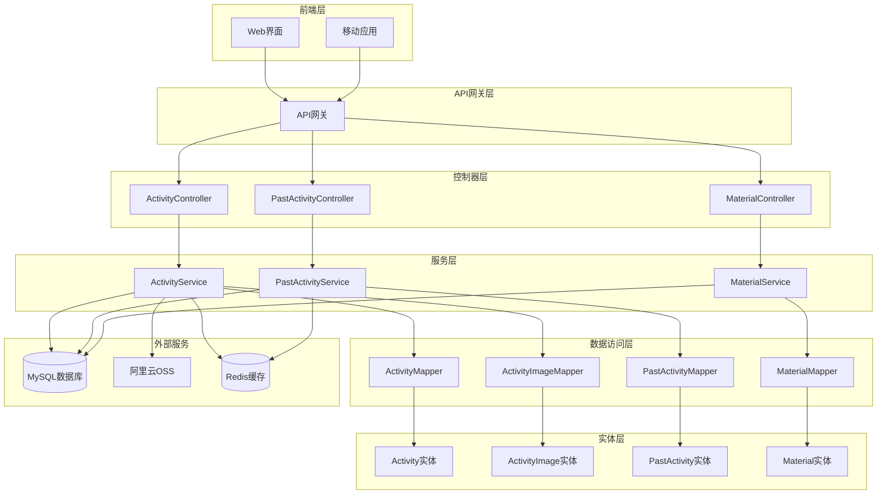

**图表来源**
- [ActivityController.java](file://src/main/java/com/redmoon2333/controller/ActivityController.java#L1-L322)
- [ActivityService.java](file://src/main/java/com/redmoon2333/service/ActivityService.java#L1-L376)

## 核心组件分析

### 控制器层架构

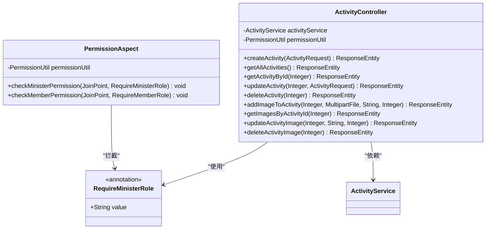

**图表来源**
- [ActivityController.java](file://src/main/java/com/redmoon2333/controller/ActivityController.java#L30-L322)
- [RequireMinisterRole.java](file://src/main/java/com/redmoon2333/annotation/RequireMinisterRole.java#L1-L19)
- [PermissionAspect.java](file://src/main/java/com/redmoon2333/aspect/PermissionAspect.java#L1-L57)

### 服务层设计模式

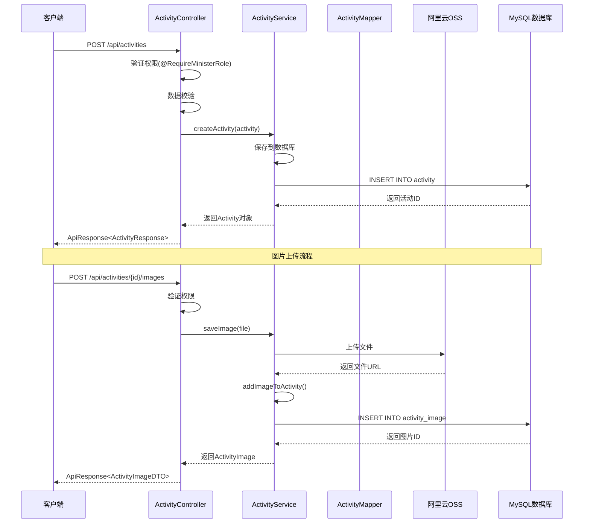

**图表来源**
- [ActivityController.java](file://src/main/java/com/redmoon2333/controller/ActivityController.java#L40-L80)
- [ActivityService.java](file://src/main/java/com/redmoon2333/service/ActivityService.java#L25-L50)

**章节来源**
- [ActivityController.java](file://src/main/java/com/redmoon2333/controller/ActivityController.java#L1-L322)
- [ActivityService.java](file://src/main/java/com/redmoon2333/service/ActivityService.java#L1-L376)

## API接口详解

### 基础活动管理接口

#### 1. 创建活动

**端点**: `POST /api/activities`

**权限要求**: 部长或副部长权限 (`@RequireMinisterRole`)

**请求体**:
```json
{
  "activityName": "年度团建活动",
  "background": "为增强团队凝聚力",
  "significance": "提升员工满意度",
  "purpose": "促进部门间交流",
  "process": "1. 签到\n2. 分组游戏\n3. 总结分享"
}
```

**响应**:
```json
{
  "code": 200,
  "message": "活动创建成功",
  "data": {
    "activityId": 1,
    "activityName": "年度团建活动",
    "background": "为增强团队凝聚力",
    "significance": "提升员工满意度",
    "purpose": "促进部门间交流",
    "process": "1. 签到\n2. 分组游戏\n3. 总结分享",
    "createTime": "2024-01-15 10:30:00",
    "updateTime": "2024-01-15 10:30:00"
  }
}
```

#### 2. 获取所有活动

**端点**: `GET /api/activities`

**权限要求**: 无特殊权限限制

**响应**:
```json
{
  "code": 200,
  "message": "查询成功",
  "data": [
    {
      "activityId": 1,
      "activityName": "年度团建活动",
      "background": "为增强团队凝聚力",
      "significance": "提升员工满意度",
      "purpose": "促进部门间交流",
      "process": "1. 签到\n2. 分组游戏\n3. 总结分享",
      "createTime": "2024-01-15 10:30:00",
      "updateTime": "2024-01-15 10:30:00"
    },
    {
      "activityId": 2,
      "activityName": "技术分享会",
      "background": "提升技术水平",
      "significance": "知识共享",
      "purpose": "技术交流",
      "process": "1. 主题演讲\n2. 互动讨论\n3. 总结反馈",
      "createTime": "2024-01-10 09:00:00",
      "updateTime": "2024-01-10 09:00:00"
    }
  ]
}
```

#### 3. 获取单个活动详情

**端点**: `GET /api/activities/{activityId}`

**权限要求**: 无特殊权限限制

**响应**:
```json
{
  "code": 200,
  "message": "查询成功",
  "data": {
    "activityId": 1,
    "activityName": "年度团建活动",
    "background": "为增强团队凝聚力",
    "significance": "提升员工满意度",
    "purpose": "促进部门间交流",
    "process": "1. 签到\n2. 分组游戏\n3. 总结分享",
    "createTime": "2024-01-15 10:30:00",
    "updateTime": "2024-01-15 10:30:00"
  }
}
```

#### 4. 更新活动信息

**端点**: `PUT /api/activities/{activityId}`

**权限要求**: 部长或副部长权限

**请求体**:
```json
{
  "activityName": "年度团建活动（修订版）",
  "background": "为增强团队凝聚力，特别增加户外拓展环节",
  "significance": "提升员工满意度，培养团队协作能力",
  "purpose": "促进部门间交流，加强团队建设",
  "process": "1. 签到\n2. 户外拓展\n3. 团队游戏\n4. 总结分享"
}
```

**响应**:
```json
{
  "code": 200,
  "message": "活动更新成功",
  "data": {
    "activityId": 1,
    "activityName": "年度团建活动（修订版）",
    "background": "为增强团队凝聚力，特别增加户外拓展环节",
    "significance": "提升员工满意度，培养团队协作能力",
    "purpose": "促进部门间交流，加强团队建设",
    "process": "1. 签到\n2. 户外拓展\n3. 团队游戏\n4. 总结分享",
    "createTime": "2024-01-15 10:30:00",
    "updateTime": "2024-01-15 14:20:00"
  }
}
```

#### 5. 删除活动

**端点**: `DELETE /api/activities/{activityId}`

**权限要求**: 部长或副部长权限

**响应**:
```json
{
  "code": 200,
  "message": "活动删除成功"
}
```

### 图片管理接口

#### 6. 为活动添加图片

**端点**: `POST /api/activities/{activityId}/images`

**权限要求**: 部长或副部长权限

**请求格式**: `multipart/form-data`

**参数**:
- `file`: 图片文件（必填）
- `description`: 图片描述（可选）
- `sortOrder`: 排序顺序（可选，默认值为0）

**请求示例**:
```
POST /api/activities/1/images
Content-Type: multipart/form-data

File: team_photo.jpg
Description: 团队合影
SortOrder: 1
```

**响应**:
```json
{
  "code": 200,
  "message": "图片添加成功",
  "data": {
    "imageId": 1,
    "activityId": 1,
    "imageUrl": "https://your-bucket.oss-cn-hangzhou.aliyuncs.com/uploads/2024/01/15/uuid.jpg",
    "description": "团队合影",
    "sortOrder": 1,
    "uploadTime": "2024-01-15 14:30:00"
  }
}
```

#### 7. 获取活动图片列表

**端点**: `GET /api/activities/{activityId}/images`

**权限要求**: 无特殊权限限制

**响应**:
```json
{
  "code": 200,
  "message": "查询成功",
  "data": [
    {
      "imageId": 1,
      "activityId": 1,
      "imageUrl": "https://your-bucket.oss-cn-hangzhou.aliyuncs.com/uploads/2024/01/15/team_photo.jpg",
      "description": "团队合影",
      "sortOrder": 1,
      "uploadTime": "2024-01-15 14:30:00"
    },
    {
      "imageId": 2,
      "activityId": 1,
      "imageUrl": "https://your-bucket.oss-cn-hangzhou.aliyuncs.com/uploads/2024/01/15/group_photo.jpg",
      "description": "分组活动照片",
      "sortOrder": 2,
      "uploadTime": "2024-01-15 14:35:00"
    }
  ]
}
```

#### 8. 更新活动图片信息

**端点**: `PUT /api/activities/images/{imageId}`

**权限要求**: 部长或副部长权限

**请求参数**:
- `description`: 图片描述（可选）
- `sortOrder`: 排序顺序（可选）

**请求示例**:
```
PUT /api/activities/images/1?description=团队大合照&sortOrder=0
```

**响应**:
```json
{
  "code": 200,
  "message": "图片更新成功",
  "data": {
    "imageId": 1,
    "activityId": 1,
    "imageUrl": "https://your-bucket.oss-cn-hangzhou.aliyuncs.com/uploads/2024/01/15/team_photo.jpg",
    "description": "团队大合照",
    "sortOrder": 0,
    "uploadTime": "2024-01-15 14:30:00"
  }
}
```

#### 9. 删除活动图片

**端点**: `DELETE /api/activities/images/{imageId}`

**权限要求**: 部长或副部长权限

**响应**:
```json
{
  "code": 200,
  "message": "图片删除成功"
}
```

**章节来源**
- [ActivityController.java](file://src/main/java/com/redmoon2333/controller/ActivityController.java#L40-L322)

## 数据模型

### ActivityRequest - 活动创建请求模型

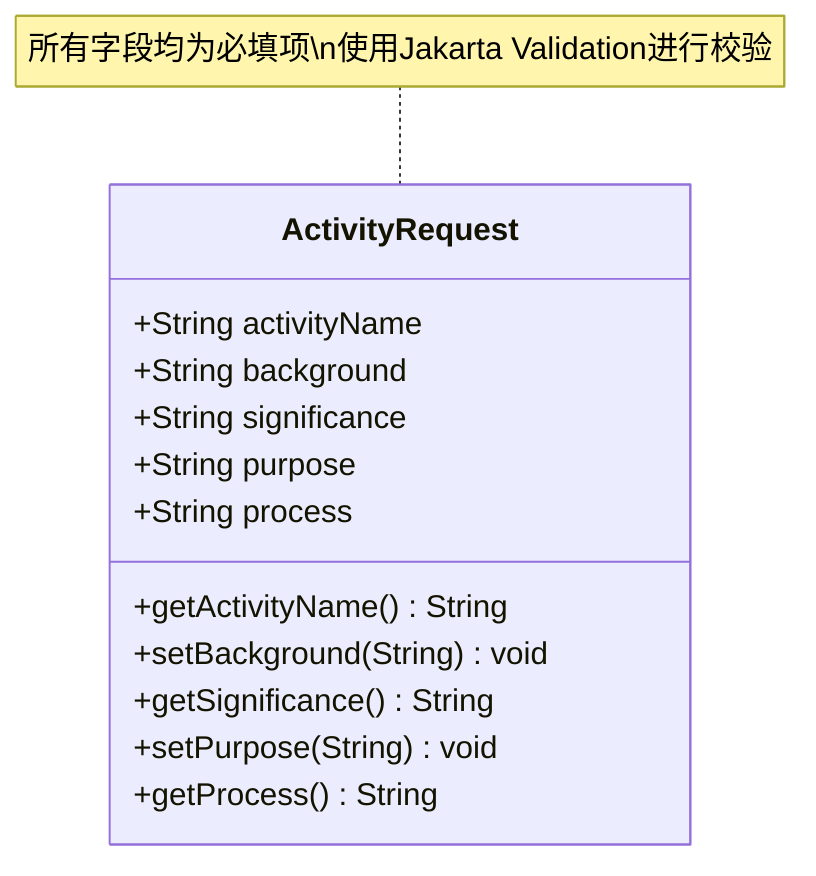

**图表来源**
- [ActivityRequest.java](file://src/main/java/com/redmoon2333/dto/ActivityRequest.java#L1-L63)

### ActivityResponse - 活动响应模型

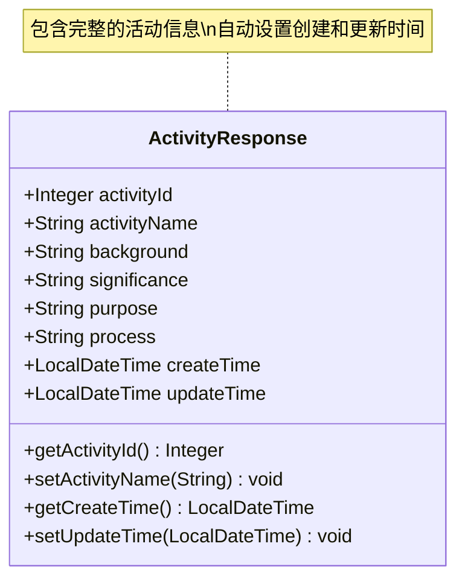

**图表来源**
- [ActivityResponse.java](file://src/main/java/com/redmoon2333/dto/ActivityResponse.java#L1-L95)

### ActivityImageDTO - 图片数据传输对象

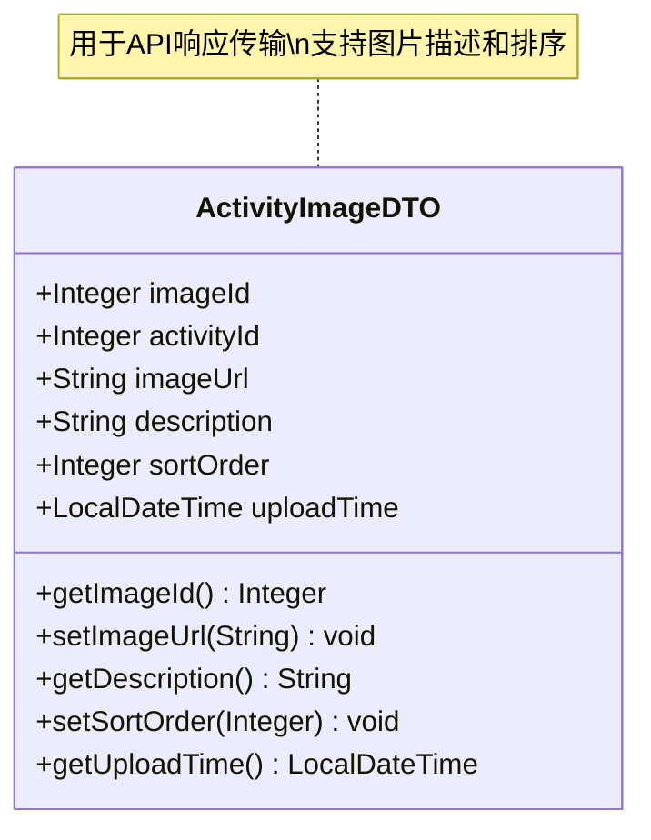

**图表来源**
- [ActivityImageDTO.java](file://src/main/java/com/redmoon2333/dto/ActivityImageDTO.java#L1-L63)

### 实体类关系图

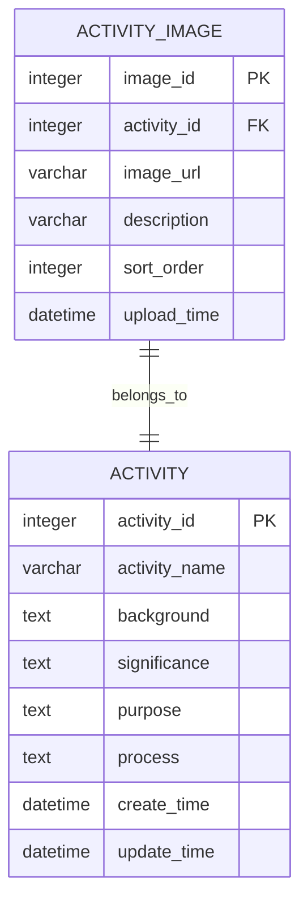

**图表来源**
- [Activity.java](file://src/main/java/com/redmoon2333/entity/Activity.java#L1-L127)
- [ActivityImage.java](file://src/main/java/com/redmoon2333/entity/ActivityImage.java#L1-L101)

**章节来源**
- [ActivityRequest.java](file://src/main/java/com/redmoon2333/dto/ActivityRequest.java#L1-L63)
- [ActivityResponse.java](file://src/main/java/com/redmoon2333/dto/ActivityResponse.java#L1-L95)
- [ActivityImageDTO.java](file://src/main/java/com/redmoon2333/dto/ActivityImageDTO.java#L1-L63)
- [Activity.java](file://src/main/java/com/redmoon2333/entity/Activity.java#L1-L127)
- [ActivityImage.java](file://src/main/java/com/redmoon2333/entity/ActivityImage.java#L1-L101)

## 权限控制机制

### 权限注解系统

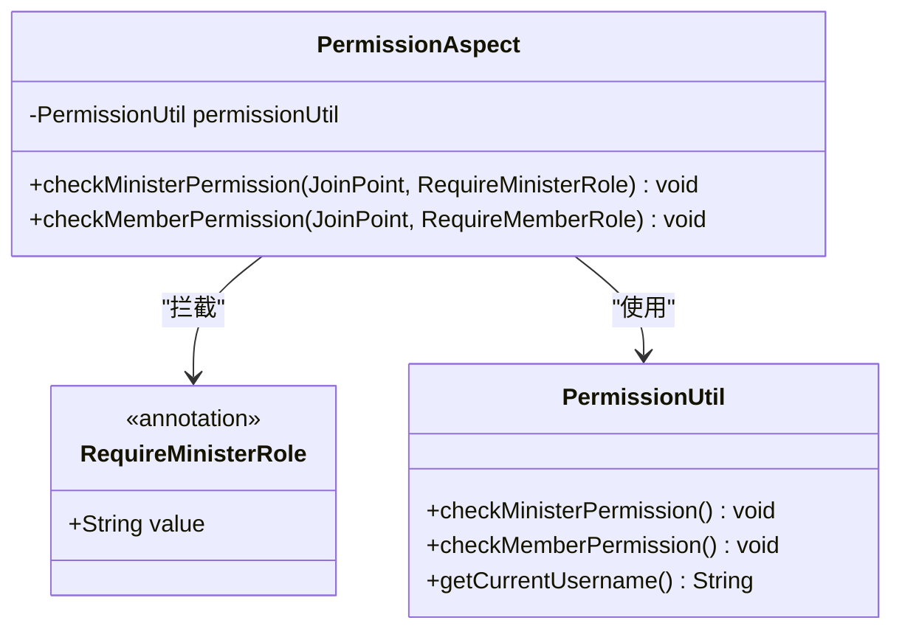

**图表来源**
- [RequireMinisterRole.java](file://src/main/java/com/redmoon2333/annotation/RequireMinisterRole.java#L1-L19)
- [PermissionAspect.java](file://src/main/java/com/redmoon2333/aspect/PermissionAspect.java#L1-L57)

### 权限验证流程

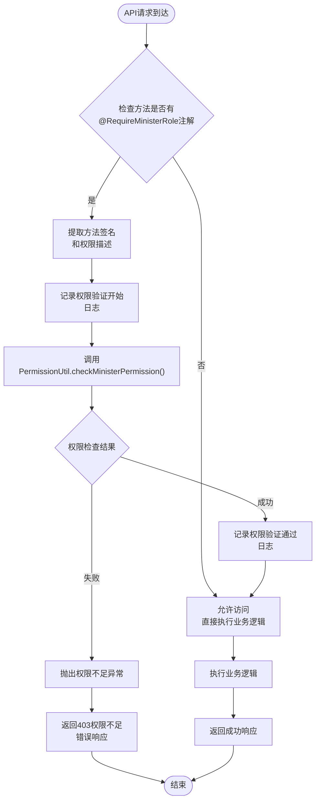

**图表来源**
- [PermissionAspect.java](file://src/main/java/com/redmoon2333/aspect/PermissionAspect.java#L25-L35)

### 权限控制特点

1. **细粒度控制**: 每个写操作都需要特定的权限注解
2. **统一验证**: 通过AOP切面实现统一的权限验证
3. **详细日志**: 记录每次权限验证的详细信息
4. **异常处理**: 统一的权限异常处理机制

**章节来源**
- [RequireMinisterRole.java](file://src/main/java/com/redmoon2333/annotation/RequireMinisterRole.java#L1-L19)
- [PermissionAspect.java](file://src/main/java/com/redmoon2333/aspect/PermissionAspect.java#L1-L57)

## 图片管理功能

### 图片存储架构

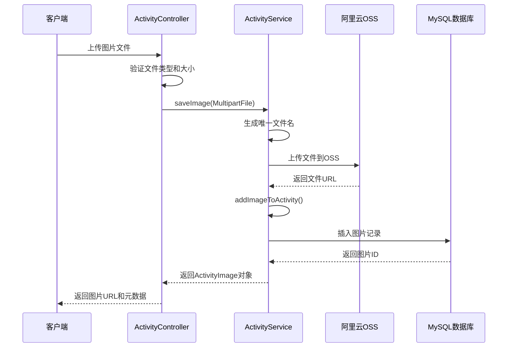

**图表来源**
- [ActivityService.java](file://src/main/java/com/redmoon2333/service/ActivityService.java#L190-L220)

### 图片处理特性

#### 1. 文件上传配置

系统支持最大100MB的单文件上传，总请求大小限制也为100MB。这些配置在`application.yml`中定义：

```yaml
spring:
  servlet:
    multipart:
      max-file-size: 100MB
      max-request-size: 100MB
```

#### 2. OSS集成

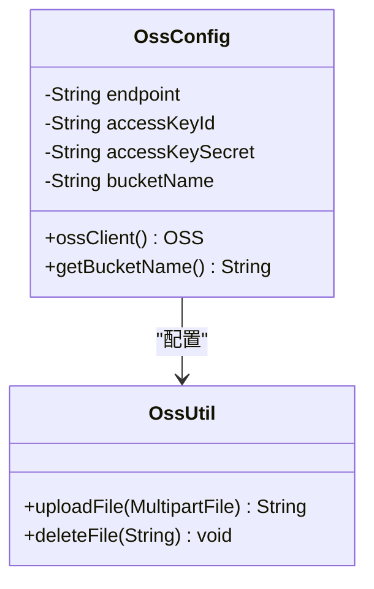

**图表来源**
- [OssConfig.java](file://src/main/java/com/redmoon2333/config/OssConfig.java#L1-L71)

#### 3. 图片排序机制

每个图片都有`sortOrder`字段，用于控制图片在活动页面中的显示顺序。默认值为0，数值越大优先级越高。

#### 4. 图片描述功能

每张图片可以附加描述文字，帮助用户理解图片内容。描述字段是可选的，但推荐填写以提高用户体验。

**章节来源**
- [ActivityService.java](file://src/main/java/com/redmoon2333/service/ActivityService.java#L190-L220)
- [OssConfig.java](file://src/main/java/com/redmoon2333/config/OssConfig.java#L1-L71)
- [application.yml](file://src/main/resources/application.yml#L15-L16)

## 错误处理

### 异常处理机制

系统实现了统一的异常处理机制，通过`BusinessException`类处理各种业务异常情况：

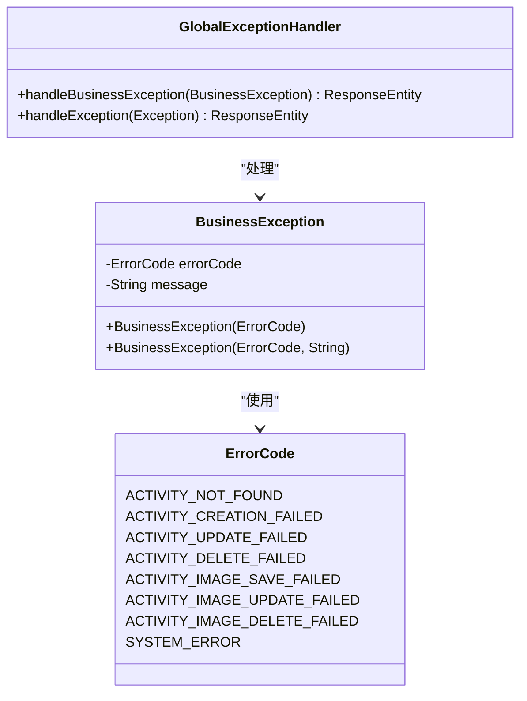

### 常见错误场景

1. **活动不存在**: 当尝试操作不存在的活动时返回`ACTIVITY_NOT_FOUND`
2. **权限不足**: 非部长用户尝试执行写操作时返回权限异常
3. **文件上传失败**: OSS配置错误或文件大小超限时返回相应错误
4. **系统异常**: 数据库连接失败或其他未知错误时返回`SYSTEM_ERROR`

### 错误响应格式

```json
{
  "code": 404,
  "message": "活动不存在",
  "data": null
}
```

**章节来源**
- [ActivityService.java](file://src/main/java/com/redmoon2333/service/ActivityService.java#L50-L100)

## 性能考虑

### 缓存策略

系统使用Redis作为缓存层，主要缓存以下内容：
- 活动基本信息（减少数据库查询）
- 活动图片列表（提升图片加载速度）
- 用户权限信息（减少权限验证开销）

### 数据库优化

1. **索引优化**: 在`activity_id`和`activity_image.activity_id`字段上建立索引
2. **分页查询**: 使用PageHelper插件实现大数据量的分页查询
3. **连接池配置**: 合理配置MySQL连接池参数，提高并发处理能力

### 文件存储优化

1. **CDN加速**: OSS文件可通过CDN加速访问
2. **压缩处理**: 支持图片压缩和格式转换
3. **生命周期管理**: 自动清理过期的临时文件

## 故障排除指南

### 常见问题及解决方案

#### 1. OSS配置问题

**症状**: 图片上传失败，返回"文件上传功能不可用"错误

**原因**: OSS配置不完整或凭证无效

**解决方案**:
```bash
# 检查环境变量配置
echo $ALIYUN_OSS_ENDPOINT
echo $ALIYUN_OSS_ACCESS_KEY_ID
echo $ALIYUN_OSS_ACCESS_KEY_SECRET
echo $ALIYUN_OSS_BUCKET_NAME
```

#### 2. 权限验证失败

**症状**: 写操作返回403权限不足

**原因**: 用户角色不符合部长或副部长要求

**解决方案**: 检查用户角色配置，确保用户具有相应的权限级别

#### 3. 文件大小限制

**症状**: 上传大文件时返回413 Request Entity Too Large

**原因**: 文件大小超过配置限制

**解决方案**: 修改`application.yml`中的文件大小配置，或分割大文件

#### 4. 数据库连接问题

**症状**: 活动查询或保存失败

**原因**: MySQL连接池耗尽或数据库服务异常

**解决方案**: 检查数据库连接池配置，重启数据库服务

### 监控和日志

系统提供了详细的日志记录功能，包括：
- API请求日志
- 权限验证日志
- 数据库操作日志
- OSS文件操作日志

建议定期检查日志文件，及时发现和解决问题。

**章节来源**
- [ActivityService.java](file://src/main/java/com/redmoon2333/service/ActivityService.java#L100-L150)
- [application.yml](file://src/main/resources/application.yml#L1-L62)

## 总结

活动管理API是一个功能完整、架构清晰的RESTful API系统。它提供了：

### 核心功能
1. **完整的CRUD操作**: 支持活动的基本信息管理
2. **图片附件管理**: 提供完整的图片上传、管理和展示功能
3. **权限控制**: 严格的部长权限控制机制
4. **文件存储**: 集成阿里云OSS实现高效的文件存储

### 技术特点
1. **模块化设计**: 清晰的分层架构，便于维护和扩展
2. **统一异常处理**: 完善的错误处理和响应机制
3. **性能优化**: 缓存策略和数据库优化
4. **安全可靠**: 权限验证和日志记录

### 应用场景
- 组织内部活动信息发布平台
- 团队建设活动管理系统
- 企业文化展示平台
- 历史活动资料归档系统

该API系统为企业提供了完整的活动管理解决方案，能够满足日常运营中的各种需求，同时保证了系统的安全性、稳定性和可扩展性。