# 用户管理API

<cite>
**本文档引用的文件**
- [UserController.java](file://src\main\java\com\redmoon2333\controller\UserController.java)
- [UserService.java](file://src\main\java\com\redmoon2333\service\UserService.java)
- [UserMapper.java](file://src\main\java\com\redmoon2333\mapper\UserMapper.java)
- [UserMapper.xml](file://src\main\resources\mapper\UserMapper.xml)
- [User.java](file://src\main\java\com\redmoon2333\entity\User.java)
- [AlumniResponse.java](file://src\main\java\com\redmoon2333\dto\AlumniResponse.java)
- [AlumniMember.java](file://src\main\java\com\redmoon2333\dto\AlumniMember.java)
- [PublicUserInfo.java](file://src\main\java\com\redmoon2333\dto\PublicUserInfo.java)
- [ApiResponse.java](file://src\main\java\com\redmoon2333\dto\ApiResponse.java)
- [SecurityConfig.java](file://src\main\java\com\redmoon2333\config\SecurityConfig.java)
- [ErrorCode.java](file://src\main\java\com\redmoon2333\exception\ErrorCode.java)
- [BusinessException.java](file://src\main\java\com\redmoon2333\exception\BusinessException.java)
- [application.yml](file://src\main\resources\application.yml)
</cite>

## 目录
1. [简介](#简介)
2. [项目架构概览](#项目架构概览)
3. [核心组件分析](#核心组件分析)
4. [API端点详解](#api端点详解)
5. [数据模型说明](#数据模型说明)
6. [业务逻辑分析](#业务逻辑分析)
7. [安全配置](#安全配置)
8. [错误处理机制](#错误处理机制)
9. [性能考虑](#性能考虑)
10. [故障排除指南](#故障排除指南)
11. [总结](#总结)

## 简介

本文档详细介绍了学生会部门官方网站中的用户管理API系统。该系统提供了三个核心用户管理功能：获取往届成员信息、根据姓名精确/模糊查找用户以及调试用的获取所有用户接口。这些API采用RESTful设计风格，支持JSON格式的数据交换，并具有完善的错误处理和日志记录机制。

系统基于Spring Boot框架构建，使用MyBatis作为ORM工具，支持MySQL数据库。所有API都经过严格的安全配置，确保数据访问的安全性和可靠性。

## 项目架构概览

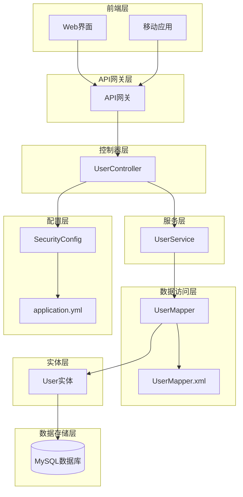

**图表来源**
- [UserController.java](file://src\main\java\com\redmoon2333\controller\UserController.java#L1-L140)
- [UserService.java](file://src\main\java\com\redmoon2333\service\UserService.java#L1-L250)
- [UserMapper.java](file://src\main\java\com\redmoon2333\mapper\UserMapper.java#L1-L78)

## 核心组件分析

### 控制器层 - UserController

UserController是用户管理API的主要入口点，负责处理HTTP请求并返回标准化的API响应。该控制器包含三个主要的API端点：

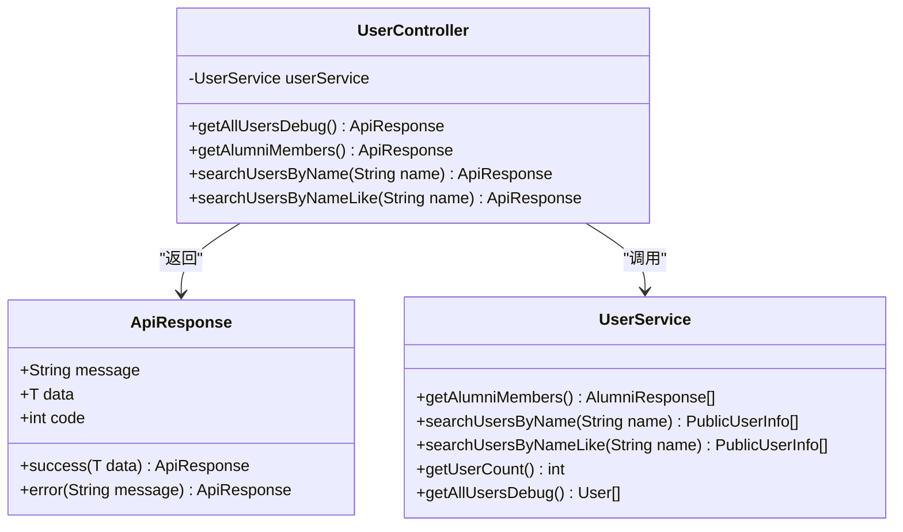

**图表来源**
- [UserController.java](file://src\main\java\com\redmoon2333\controller\UserController.java#L25-L140)
- [UserService.java](file://src\main\java\com\redmoon2333\service\UserService.java#L25-L250)
- [ApiResponse.java](file://src\main\java\com\redmoon2333\dto\ApiResponse.java#L1-L62)

### 服务层 - UserService

UserService是业务逻辑的核心，负责处理复杂的业务规则和数据转换。它包含了以下关键功能：

1. **往届成员信息处理**：从用户的角色历史中提取年度信息并按年份分组
2. **用户搜索功能**：支持精确和模糊的姓名搜索
3. **调试辅助功能**：提供全面的用户数据查询和统计功能

**章节来源**
- [UserService.java](file://src\main\java\com\redmoon2333\service\UserService.java#L25-L250)

### 数据访问层 - UserMapper

UserMapper使用MyBatis框架提供数据访问功能，包含以下核心方法：

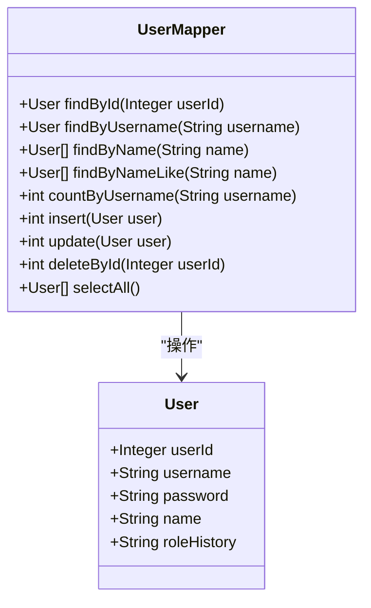

**图表来源**
- [UserMapper.java](file://src\main\java\com\redmoon2333\mapper\UserMapper.java#L15-L77)
- [User.java](file://src\main\java\com\redmoon2333\entity\User.java#L10-L98)

**章节来源**
- [UserMapper.java](file://src\main\java\com\redmoon2333\mapper\UserMapper.java#L1-L78)
- [UserMapper.xml](file://src\main\resources\mapper\UserMapper.xml#L1-L106)

## API端点详解

### 1. 获取往届部员信息 - /api/users/alumni

**HTTP方法**: GET  
**URL**: `/api/users/alumni`  
**权限**: 公开访问  
**功能**: 按年份分组展示所有部员、部长和副部长信息

#### 请求示例
```http
GET /api/users/alumni
Accept: application/json
```

#### 响应数据结构
```json
{
  "message": "查询成功",
  "data": [
    {
      "year": 2024,
      "members": [
        {
          "name": "张三",
          "role": "部长"
        },
        {
          "name": "李四",
          "role": "副部长"
        }
      ]
    },
    {
      "year": 2023,
      "members": [
        {
          "name": "王五",
          "role": "部员"
        }
      ]
    }
  ],
  "code": 200
}
```

#### 业务逻辑说明
系统通过解析用户的角色历史字段（roleHistory）来提取年度信息。角色历史字段采用特定格式存储，如"2024级部长&2023级副部长"。系统使用正则表达式"(\\d{4})级(.+)"来匹配年份和角色信息，并将相同年份的成员归类到同一组中。

**章节来源**
- [UserController.java](file://src\main\java\com\redmoon2333\controller\UserController.java#L60-L75)
- [UserService.java](file://src\main\java\com\redmoon2333\service\UserService.java#L35-L130)

### 2. 根据姓名精确查找用户 - /api/users/search/name

**HTTP方法**: GET  
**URL**: `/api/users/search/name`  
**权限**: 公开访问  
**请求参数**: 
- `name` (必需): 用户姓名

#### 请求示例
```http
GET /api/users/search/name?name=张三
Accept: application/json
```

#### 响应数据结构
```json
{
  "message": "查找成功",
  "data": [
    {
      "name": "张三",
      "roleHistory": "2024级部长&2023级副部长"
    }
  ],
  "code": 200
}
```

#### 业务逻辑说明
该接口执行精确匹配的姓名搜索，只返回完全匹配指定姓名的用户。搜索结果包含用户的姓名和完整角色历史信息。

**章节来源**
- [UserController.java](file://src\main\java\com\redmoon2333\controller\UserController.java#L77-L92)
- [UserService.java](file://src\main\java\com\redmoon2333\service\UserService.java#L132-L145)

### 3. 根据姓名模糊查找用户 - /api/users/search/name/like

**HTTP方法**: GET  
**URL**: `/api/users/search/name/like`  
**权限**: 公开访问  
**请求参数**: 
- `name` (必需): 姓名关键词

#### 请求示例
```http
GET /api/users/search/name/like?name=张
Accept: application/json
```

#### 响应数据结构
```json
{
  "message": "查找成功",
  "data": [
    {
      "name": "张三",
      "roleHistory": "2024级部长"
    },
    {
      "name": "张伟",
      "roleHistory": "2023级部员"
    }
  ],
  "code": 200
}
```

#### 业务逻辑说明
该接口执行模糊匹配的姓名搜索，返回包含指定关键词的所有用户。搜索使用SQL的LIKE语句，支持前缀、后缀和包含匹配。

**章节来源**
- [UserController.java](file://src\main\java\com\redmoon2333\controller\UserController.java#L94-L109)
- [UserService.java](file://src\main\java\com\redmoon2333\service\UserService.java#L147-L160)

### 4. 调试接口 - /api/users/debug/all

**HTTP方法**: GET  
**URL**: `/api/users/debug/all`  
**权限**: 公开访问（仅开发环境）  
**功能**: 获取所有用户信息，用于排查数据库数据问题

#### 请求示例
```http
GET /api/users/debug/all
Accept: application/json
```

#### 响应数据结构
```json
{
  "message": "调试信息获取成功",
  "data": {
    "totalCount": 150,
    "actualUsers": [
      {
        "userId": 1,
        "username": "admin",
        "name": "管理员",
        "roleHistory": "2024级部长"
      }
    ],
    "usersWithRoleHistory": 120
  },
  "code": 200
}
```

#### 业务逻辑说明
该调试接口提供全面的用户数据查询功能，包括：
- 总用户数统计
- 实际查询到的用户列表
- 具有角色历史信息的用户数量统计

**章节来源**
- [UserController.java](file://src\main\java\com\redmoon2333\controller\UserController.java#L30-L58)
- [UserService.java](file://src\main\java\com\redmoon2333\service\UserService.java#L220-L249)

## 数据模型说明

### AlumniResponse - 往届成员响应模型

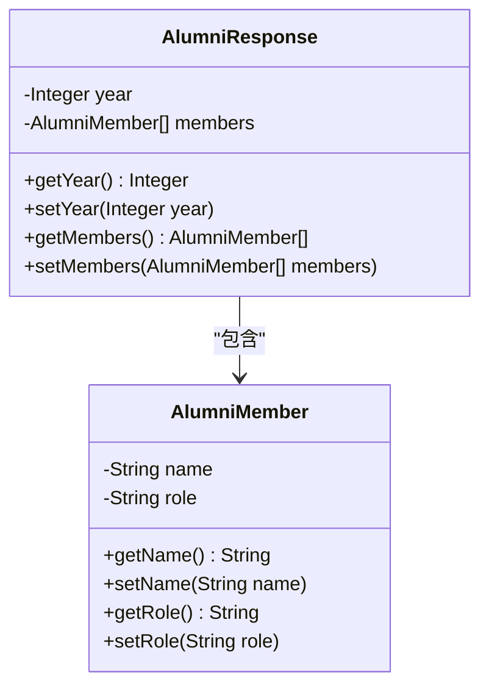

**图表来源**
- [AlumniResponse.java](file://src\main\java\com\redmoon2333\dto\AlumniResponse.java#L1-L31)
- [AlumniMember.java](file://src\main\java\com\redmoon2333\dto\AlumniMember.java#L1-L29)

### PublicUserInfo - 公共用户信息模型

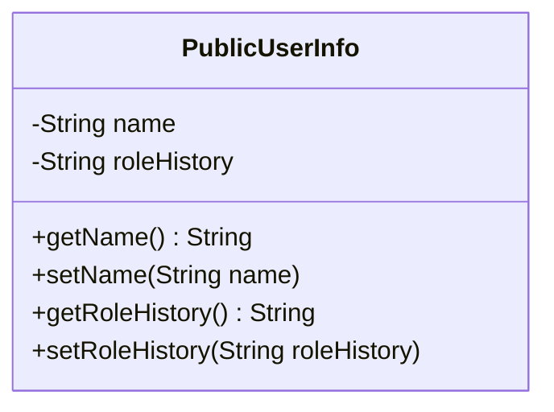

**图表来源**
- [PublicUserInfo.java](file://src\main\java\com\redmoon2333\dto\PublicUserInfo.java#L1-L29)

### User实体模型

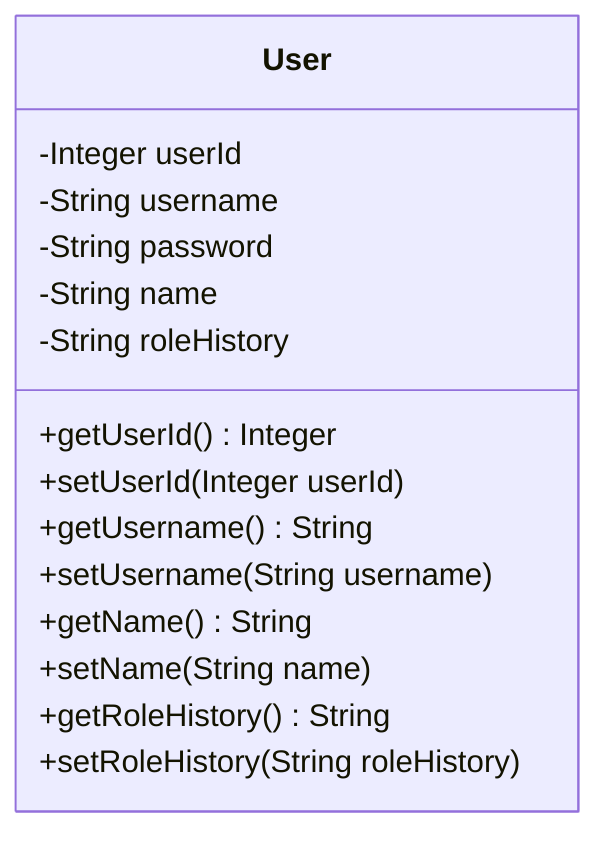

**图表来源**
- [User.java](file://src\main\java\com\redmoon2333\entity\User.java#L10-L98)

**章节来源**
- [AlumniResponse.java](file://src\main\java\com\redmoon2333\dto\AlumniResponse.java#L1-L31)
- [PublicUserInfo.java](file://src\main\java\com\redmoon2333\dto\PublicUserInfo.java#L1-L29)
- [User.java](file://src\main\java\com\redmoon2333\entity\User.java#L1-L99)

## 业务逻辑分析

### 往届成员信息处理流程

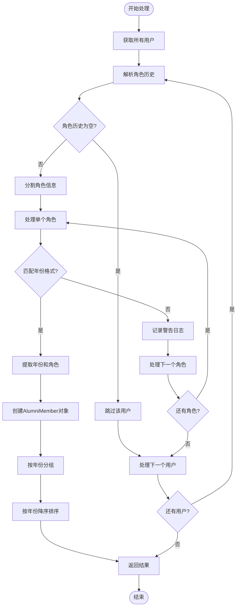

**图表来源**
- [UserService.java](file://src\main\java\com\redmoon2333\service\UserService.java#L35-L130)

### 用户搜索处理流程

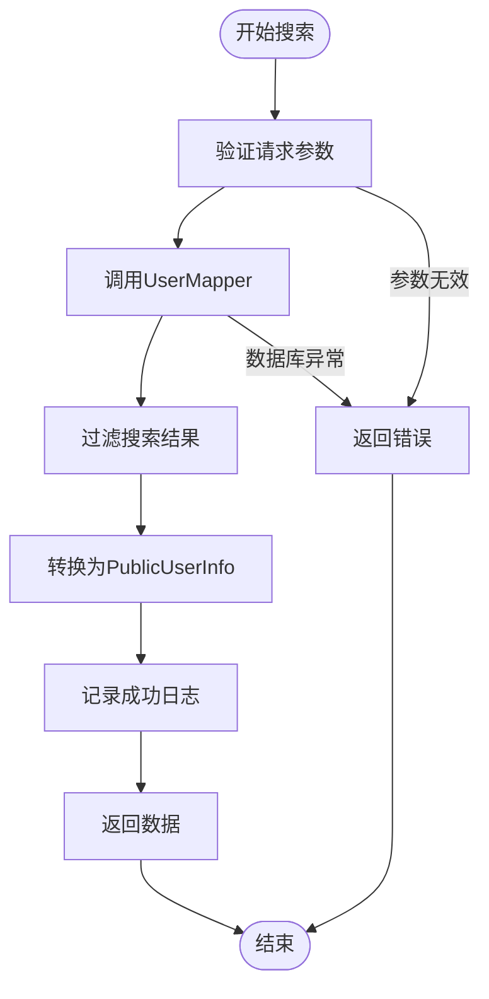

**图表来源**
- [UserService.java](file://src\main\java\com\redmoon2333\service\UserService.java#L132-L160)

**章节来源**
- [UserService.java](file://src\main\java\com\redmoon2333\service\UserService.java#L35-L250)

## 安全配置

### CORS配置

系统配置了严格的CORS策略，允许来自特定开发环境的跨域请求：

```java
// 允许的域名
"http://localhost:3000",
"http://localhost:8081", 
"http://127.0.0.1:3000",
"http://127.0.0.1:8081"

// 允许的HTTP方法
"GET", "POST", "PUT", "DELETE", "OPTIONS", "HEAD"

// 允许发送Cookie等凭据信息
configuration.setAllowCredentials(true)
```

### 请求授权配置

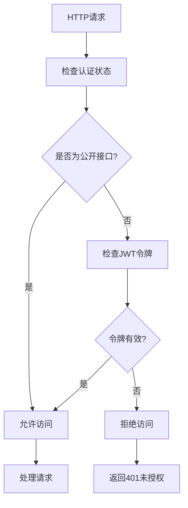

**图表来源**
- [SecurityConfig.java](file://src\main\java\com\redmoon2333\config\SecurityConfig.java#L70-L95)

### 公开API列表

以下API端点被配置为公开访问：
- `/api/users/alumni` - 往届成员信息查询
- `/api/users/search/name/**` - 用户姓名搜索
- `/api/users/debug/**` - 调试接口

**章节来源**
- [SecurityConfig.java](file://src\main\java\com\redmoon2333\config\SecurityConfig.java#L1-L112)

## 错误处理机制

### 异常类型定义

系统定义了完整的错误代码体系：

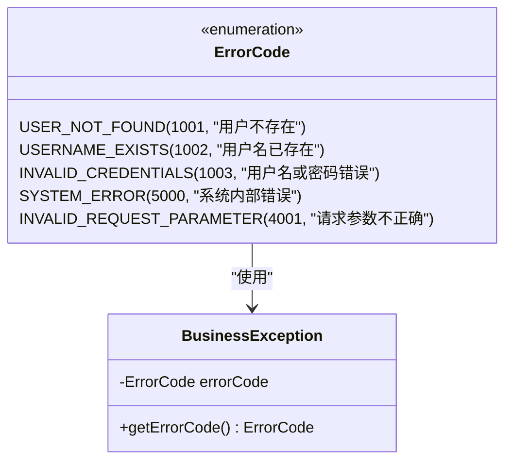

**图表来源**
- [ErrorCode.java](file://src\main\java\com\redmoon2333\exception\ErrorCode.java#L1-L55)
- [BusinessException.java](file://src\main\java\com\redmoon2333\exception\BusinessException.java#L1-L24)

### 错误响应格式

```json
{
  "message": "用户不存在",
  "data": null,
  "code": 1001
}
```

### 错误处理流程

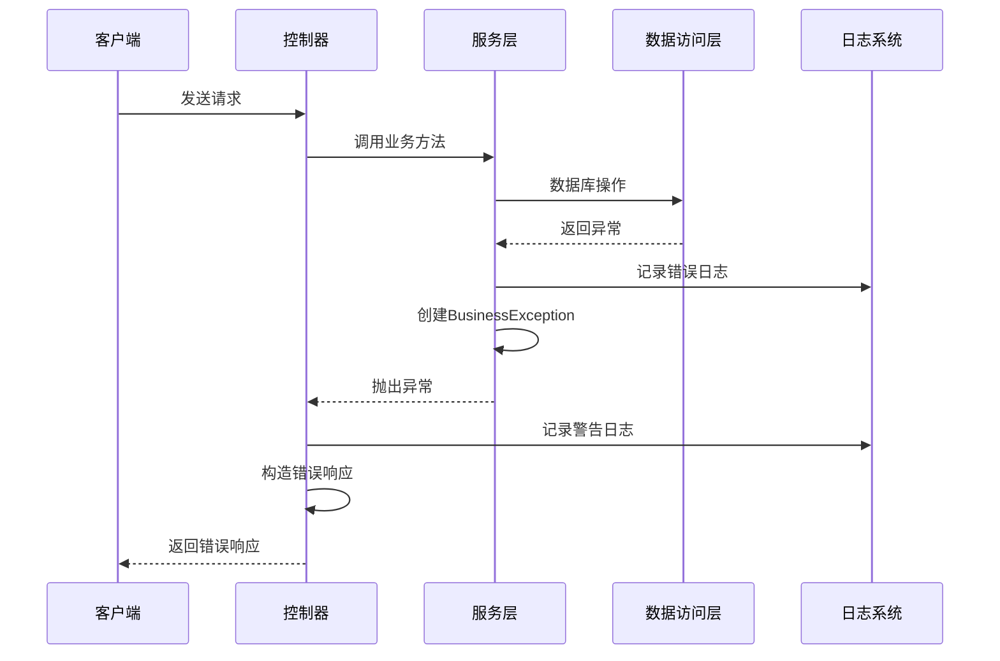

**图表来源**
- [UserController.java](file://src\main\java\com\redmoon2333\controller\UserController.java#L60-L109)
- [UserService.java](file://src\main\java\com\redmoon2333\service\UserService.java#L35-L250)

**章节来源**
- [ErrorCode.java](file://src\main\java\com\redmoon2333\exception\ErrorCode.java#L1-L55)
- [BusinessException.java](file://src\main\java\com\redmoon2333\exception\BusinessException.java#L1-L24)

## 性能考虑

### 数据库查询优化

1. **索引策略**: 用户名字段已建立唯一索引，提高查询效率
2. **查询范围限制**: 模糊查询使用LIKE语句，但避免前缀通配符以支持索引
3. **批量查询**: 调试接口一次性获取所有用户数据，减少多次查询开销

### 缓存策略

虽然当前实现没有显式的缓存机制，但以下方面有助于性能优化：
- 用户数据量相对较小，适合内存处理
- 角色历史解析在内存中完成，避免重复数据库查询
- 日志记录采用异步方式，减少对主流程的影响

### 监控指标

系统配置了详细的日志监控：
```yaml
logging:
  level:
    com.redmoon2333.service.UserService: DEBUG
```

## 故障排除指南

### 常见问题及解决方案

#### 1. 往届成员信息为空
**症状**: `/api/users/alumni` 返回空数组  
**可能原因**:
- 用户角色历史字段为空
- 角色历史格式不符合预期
- 数据库中没有用户记录

**解决方案**:
- 检查数据库中用户的roleHistory字段
- 确认角色历史格式为"年份级角色&年份级角色"
- 使用调试接口查看完整用户数据

#### 2. 用户搜索无结果
**症状**: 搜索接口返回空列表  
**可能原因**:
- 姓名拼写错误
- 数据库中不存在该用户
- 模糊搜索关键词过于宽泛

**解决方案**:
- 使用精确搜索验证用户是否存在
- 检查数据库中用户的name字段值
- 尝试更具体的搜索关键词

#### 3. 调试接口访问失败
**症状**: 无法访问调试接口  
**可能原因**:
- 生产环境中禁用了调试接口
- CORS配置不正确
- 服务器配置问题

**解决方案**:
- 确认当前环境为开发环境
- 检查CORS配置是否允许当前域名
- 查看服务器日志确认具体错误

**章节来源**
- [UserService.java](file://src\main\java\com\redmoon2333\service\UserService.java#L35-L130)
- [UserController.java](file://src\main\java\com\redmoon2333\controller\UserController.java#L30-L58)

## 总结

本文档详细介绍了学生会部门官方网站的用户管理API系统。该系统具有以下特点：

### 主要功能
1. **往届成员管理**: 按年份分组展示部员信息，支持多种角色类型
2. **用户搜索功能**: 支持精确和模糊的姓名搜索
3. **调试辅助**: 提供全面的用户数据查询功能

### 技术优势
- **RESTful设计**: 符合现代API设计规范
- **统一响应格式**: 使用标准化的ApiResponse结构
- **完善错误处理**: 提供详细的错误代码和消息
- **安全配置**: 严格的CORS和权限控制
- **日志记录**: 详细的请求和错误日志

### 使用建议
1. **生产环境**: 仅使用公开的往届成员查询和用户搜索接口
2. **开发环境**: 可使用调试接口进行数据排查
3. **性能优化**: 注意搜索关键词的选择，避免过于宽泛的查询
4. **安全考虑**: 不要在生产环境中暴露调试接口

该API系统为学生会部门官方网站提供了完整的用户管理功能，支持高效的用户信息查询和管理需求。通过合理的架构设计和安全配置，确保了系统的稳定性和安全性。