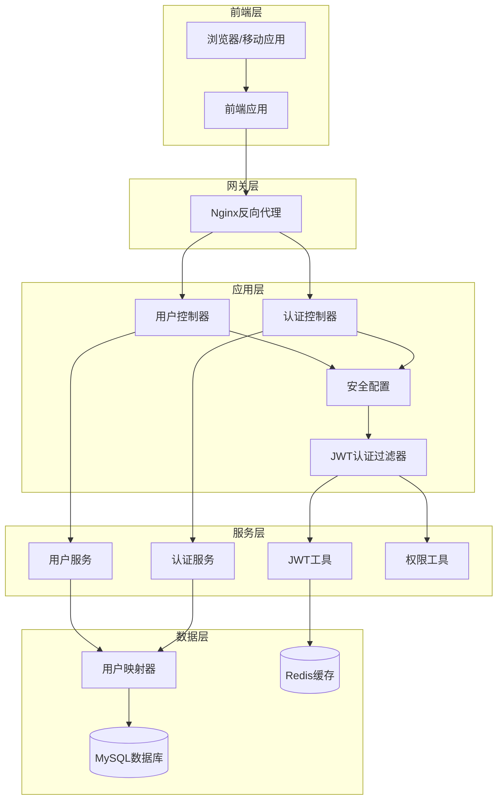
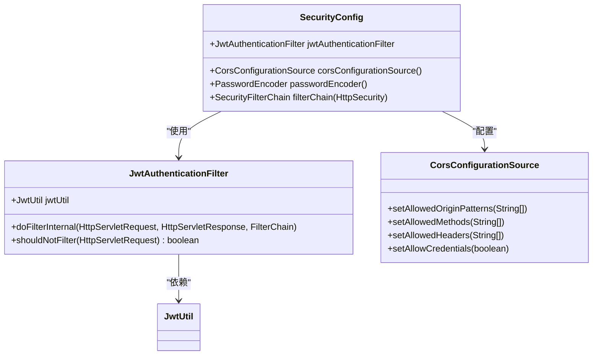
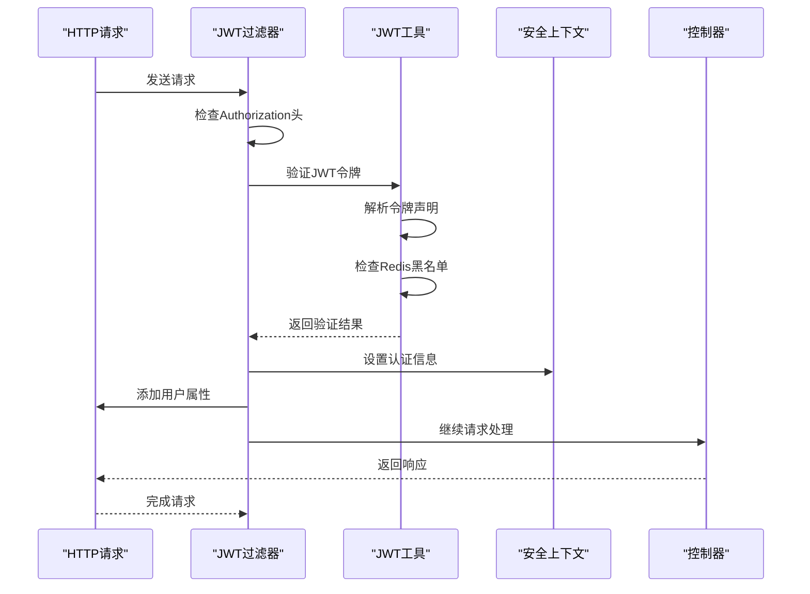
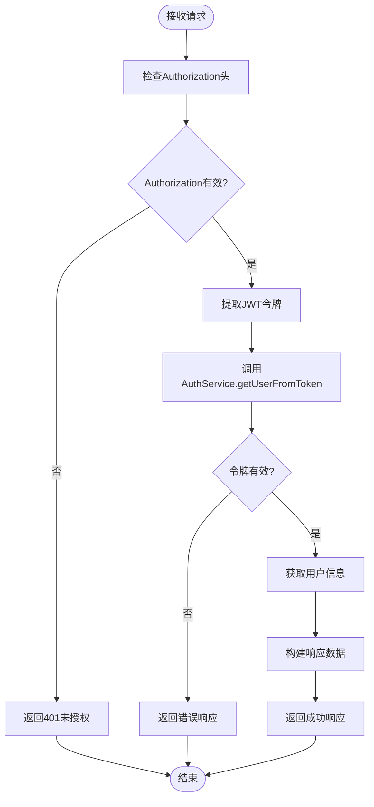
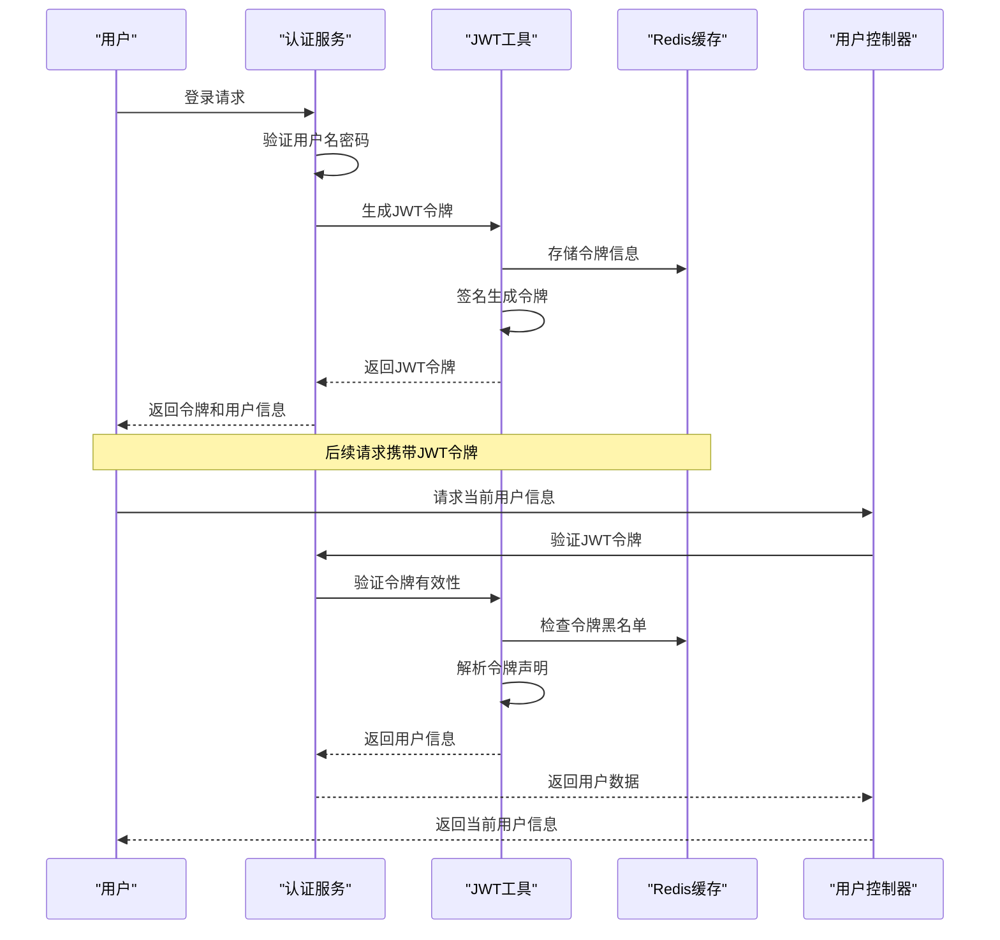
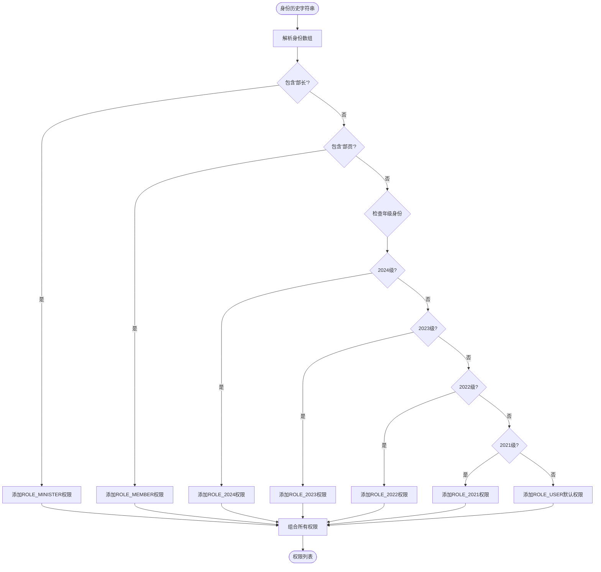
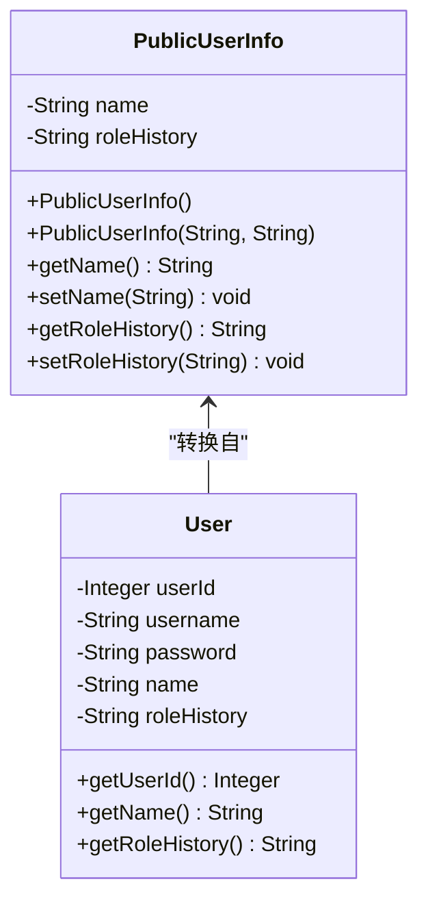

# 当前用户信息API

<cite>
**本文档引用的文件**
- [UserController.java](file://src/main/java/com/redmoon2333/controller/UserController.java)
- [AuthController.java](file://src/main/java/com/redmoon2333/controller/AuthController.java)
- [SecurityConfig.java](file://src/main/java/com/redmoon2333/config/SecurityConfig.java)
- [JwtAuthenticationFilter.java](file://src/main/java/com/redmoon2333/config/JwtAuthenticationFilter.java)
- [JwtUtil.java](file://src/main/java/com/redmoon2333/util/JwtUtil.java)
- [PermissionUtil.java](file://src/main/java/com/redmoon2333/util/PermissionUtil.java)
- [PublicUserInfo.java](file://src/main/java/com/redmoon2333/dto/PublicUserInfo.java)
- [ApiResponse.java](file://src/main/java/com/redmoon2333/dto/ApiResponse.java)
- [AuthService.java](file://src/main/java/com/redmoon2333/service/AuthService.java)
- [UserService.java](file://src/main/java/com/redmoon2333/service/UserService.java)
</cite>

## 目录
1. [简介](#简介)
2. [项目架构概览](#项目架构概览)
3. [核心组件分析](#核心组件分析)
4. [接口实现机制](#接口实现机制)
5. [身份认证流程](#身份认证流程)
6. [数据传输对象](#数据传输对象)
7. [响应示例](#响应示例)
8. [前端集成指南](#前端集成指南)
9. [性能考虑](#性能考虑)
10. [故障排除指南](#故障排除指南)
11. [总结](#总结)

## 简介

当前用户信息查询接口是人力资源管理系统中的核心安全接口之一，负责向客户端提供经过身份验证的当前用户的基本信息。该接口通过JWT令牌进行身份验证，确保只有合法用户能够访问其个人信息，同时实现了完善的安全控制和敏感信息脱敏处理。

该接口主要服务于：
- 用户身份识别和权限验证
- 前端界面的个性化展示
- 系统日志记录和审计追踪
- 用户会话管理和状态维护

## 项目架构概览

系统采用Spring Boot框架构建，遵循RESTful API设计原则，实现了完整的前后端分离架构。



**图表来源**
- [SecurityConfig.java](file://src/main/java/com/redmoon2333/config/SecurityConfig.java#L1-L131)
- [JwtAuthenticationFilter.java](file://src/main/java/com/redmoon2333/config/JwtAuthenticationFilter.java#L1-L140)
- [UserController.java](file://src/main/java/com/redmoon2333/controller/UserController.java#L1-L140)

## 核心组件分析

### SecurityConfig - 安全配置

SecurityConfig类负责配置整个系统的安全策略，包括CORS设置、CSRF防护、会话管理以及请求授权规则。



**图表来源**
- [SecurityConfig.java](file://src/main/java/com/redmoon2333/config/SecurityConfig.java#L20-L131)
- [JwtAuthenticationFilter.java](file://src/main/java/com/redmoon2333/config/JwtAuthenticationFilter.java#L25-L140)

### JwtAuthenticationFilter - JWT认证过滤器

JWT认证过滤器是整个身份验证流程的核心组件，负责拦截所有请求并验证JWT令牌的有效性。



**图表来源**
- [JwtAuthenticationFilter.java](file://src/main/java/com/redmoon2333/config/JwtAuthenticationFilter.java#L35-L100)
- [JwtUtil.java](file://src/main/java/com/redmoon2333/util/JwtUtil.java#L180-L200)

**章节来源**
- [SecurityConfig.java](file://src/main/java/com/redmoon2333/config/SecurityConfig.java#L1-L131)
- [JwtAuthenticationFilter.java](file://src/main/java/com/redmoon2333/config/JwtAuthenticationFilter.java#L1-L140)

## 接口实现机制

### GET /api/users/current端点

当前用户信息查询接口位于UserController中，提供获取当前登录用户基本信息的功能。



**图表来源**
- [AuthController.java](file://src/main/java/com/redmoon2333/controller/AuthController.java#L100-L132)

### 接口特性

1. **身份验证要求**：必须提供有效的Bearer JWT令牌
2. **响应格式**：统一使用ApiResponse包装格式
3. **权限控制**：集成Spring Security权限体系
4. **错误处理**：完善的异常捕获和错误响应机制

**章节来源**
- [UserController.java](file://src/main/java/com/redmoon2333/controller/UserController.java#L21-L140)
- [AuthController.java](file://src/main/java/com/redmoon2333/controller/AuthController.java#L100-L132)

## 身份认证流程

### JWT令牌生成与验证

系统使用JWT（JSON Web Token）进行无状态身份验证，结合Redis缓存实现令牌管理。



**图表来源**
- [AuthService.java](file://src/main/java/com/redmoon2333/service/AuthService.java#L40-L60)
- [JwtUtil.java](file://src/main/java/com/redmoon2333/util/JwtUtil.java#L40-L70)

### 权限级别解析

系统支持多层级的身份权限控制，通过身份历史字符串解析用户的所有历史身份。



**图表来源**
- [JwtAuthenticationFilter.java](file://src/main/java/com/redmoon2333/config/JwtAuthenticationFilter.java#L50-L85)

**章节来源**
- [JwtUtil.java](file://src/main/java/com/redmoon2333/util/JwtUtil.java#L1-L309)
- [JwtAuthenticationFilter.java](file://src/main/java/com/redmoon2333/config/JwtAuthenticationFilter.java#L1-L140)

## 数据传输对象

### PublicUserInfo - 公开用户信息DTO

PublicUserInfo是专门用于对外提供用户信息的数据传输对象，严格遵循最小化原则，只包含公开可见的信息。



**图表来源**
- [PublicUserInfo.java](file://src/main/java/com/redmoon2333/dto/PublicUserInfo.java#L1-L28)

### 敏感信息脱敏策略

系统实现了严格的敏感信息保护机制：

1. **字段限制**：PublicUserInfo只包含姓名和角色历史两个字段
2. **数据脱敏**：不包含密码、邮箱、联系方式等敏感信息
3. **访问控制**：通过权限验证确保只有授权用户才能访问完整信息
4. **传输加密**：所有通信都通过HTTPS协议进行加密传输

**章节来源**
- [PublicUserInfo.java](file://src/main/java/com/redmoon2333/dto/PublicUserInfo.java#L1-L28)
- [UserService.java](file://src/main/java/com/redmoon2333/service/UserService.java#L164-L172)

## 响应示例

### 成功响应格式

当请求携带有效的JWT令牌时，系统将返回当前用户的公开信息：

```json
{
  "message": "操作成功",
  "data": {
    "userId": 123,
    "username": "john_doe",
    "roleHistory": "2024级部长&2023级部员"
  },
  "code": 200
}
```

### 认证失败响应

当请求缺少有效令牌或令牌无效时，系统将返回401未授权状态码：

```json
{
  "message": "请提供有效的Authorization头",
  "data": null,
  "code": 401
}
```

### 错误响应示例

当系统内部发生错误时，将返回相应的错误信息：

```json
{
  "message": "系统内部错误",
  "data": null,
  "code": 500
}
```

**章节来源**
- [ApiResponse.java](file://src/main/java/com/redmoon2333/dto/ApiResponse.java#L1-L62)
- [AuthController.java](file://src/main/java/com/redmoon2333/controller/AuthController.java#L100-L132)

## 前端集成指南

### 前端请求实现

前端应用可以通过以下方式调用当前用户信息接口：

```javascript
// 获取当前用户信息的函数
async function getCurrentUserInfo() {
    try {
        const token = localStorage.getItem('jwt_token');
        if (!token) {
            throw new Error('未找到JWT令牌');
        }
        
        const response = await fetch('/api/users/current-user', {
            method: 'GET',
            headers: {
                'Authorization': `Bearer ${token}`,
                'Content-Type': 'application/json'
            }
        });
        
        const result = await response.json();
        
        if (result.success) {
            // 处理成功响应
            const currentUser = result.data;
            updateUserInterface(currentUser);
            return currentUser;
        } else {
            // 处理错误响应
            throw new Error(result.message);
        }
    } catch (error) {
        console.error('获取当前用户信息失败:', error);
        throw error;
    }
}

// 更新用户界面显示
function updateUserInterface(userInfo) {
    // 提取角色历史并解析
    const roleHistory = userInfo.roleHistory || '';
    const roles = roleHistory.split('&').map(role => role.trim());
    
    // 设置用户身份标识
    document.getElementById('user-role').textContent = roles[0];
    
    // 根据角色显示不同的功能模块
    if (roles.some(role => role.includes('部长'))) {
        showMinisterFeatures();
    } else if (roles.some(role => role.includes('部员'))) {
        showMemberFeatures();
    }
    
    // 显示用户名
    document.getElementById('user-name').textContent = userInfo.name;
}
```

### 前端错误处理

前端应该妥善处理各种错误情况：

```javascript
// 错误处理函数
function handleError(error) {
    if (error.message.includes('401')) {
        // 未授权，跳转到登录页面
        window.location.href = '/login';
    } else if (error.message.includes('403')) {
        // 权限不足，显示提示信息
        showAlert('您没有访问此功能的权限', 'warning');
    } else {
        // 其他错误，显示通用错误信息
        showAlert('系统错误，请稍后重试', 'error');
    }
}
```

### 角色历史解析示例

前端可以从响应中提取和解析用户的角色历史信息：

```javascript
// 解析角色历史并显示用户身份
function parseRoleHistory(roleHistory) {
    if (!roleHistory) return [];
    
    // 分割角色历史字符串
    const roles = roleHistory.split('&').map(role => role.trim());
    
    // 提取每个角色的年级和职位
    return roles.map(role => {
        const parts = role.split('级');
        return {
            grade: parts[0],
            position: parts[1] || '',
            isMinister: role.includes('部长'),
            isMember: role.includes('部员')
        };
    });
}

// 在用户界面中显示角色历史
function displayRoleHistory(userInfo) {
    const roles = parseRoleHistory(userInfo.roleHistory);
    const historyElement = document.getElementById('role-history');
    
    if (roles.length > 0) {
        const html = roles.map(role => 
            `<span class="role-tag ${role.isMinister ? 'minister' : 'member'}">
                ${role.grade}级${role.position}
            </span>`
        ).join('');
        historyElement.innerHTML = html;
    }
}
```

## 性能考虑

### 缓存策略

系统采用了多层次的缓存策略来提升性能：

1. **Redis缓存**：JWT令牌存储和黑名单管理
2. **数据库索引**：用户表建立复合索引优化查询性能
3. **连接池**：数据库连接池配置优化并发访问

### 并发处理

系统支持高并发场景下的用户信息查询：

- **无状态设计**：JWT令牌无需服务器端存储，支持水平扩展
- **异步处理**：非关键业务逻辑采用异步处理模式
- **负载均衡**：支持多实例部署和负载均衡

### 内存优化

- **令牌大小控制**：JWT令牌中只包含必要的声明信息
- **权限缓存**：解析后的权限信息在内存中缓存
- **对象复用**：DTO对象采用轻量级设计减少内存占用

## 故障排除指南

### 常见问题及解决方案

#### 1. 401未授权错误

**症状**：接口返回401状态码，提示"请提供有效的Authorization头"

**可能原因**：
- 请求头中缺少Authorization字段
- Authorization头格式不正确（不是Bearer格式）
- JWT令牌已过期
- 令牌被加入黑名单

**解决步骤**：
```javascript
// 检查请求头格式
const authHeader = request.headers['authorization'];
if (!authHeader || !authHeader.startsWith('Bearer ')) {
    // 修复：确保Authorization头格式正确
    return ApiResponse.error('请提供有效的Authorization头', 401);
}

// 提取并验证令牌
const token = authHeader.substring(7);
if (!jwtUtil.validateToken(token)) {
    // 修复：使用有效的JWT令牌
    return ApiResponse.error('无效的令牌', 401);
}
```

#### 2. 403权限不足

**症状**：接口返回403状态码，提示权限不足

**可能原因**：
- 用户角色不符合接口要求
- 身份历史解析错误
- 权限配置不正确

**解决步骤**：
```javascript
// 检查用户权限
const userRoleHistory = permissionUtil.getCurrentUserRoleHistory();
if (!userRoleHistory || !userRoleHistory.includes('部长')) {
    // 修复：确保用户具有正确的身份
    return ApiResponse.error('权限不足', 403);
}
```

#### 3. 500系统内部错误

**症状**：接口返回500状态码，提示系统内部错误

**可能原因**：
- 数据库连接异常
- Redis缓存不可用
- 业务逻辑异常

**解决步骤**：
```javascript
try {
    // 业务逻辑处理
    const userInfo = userService.getCurrentUser();
    return ApiResponse.success(userInfo);
} catch (error) {
    // 记录详细错误日志
    logger.error('获取当前用户信息失败', error);
    
    // 返回友好的错误信息
    return ApiResponse.error('系统繁忙，请稍后重试', 500);
}
```

### 调试工具

#### 1. 日志监控

启用详细日志记录以便快速定位问题：

```java
// 在JwtAuthenticationFilter中添加调试日志
logger.debug("JWT令牌验证开始，用户: {}, 令牌长度: {}", username, token.length());
logger.debug("身份历史解析结果: {}", roleHistory);
logger.debug("解析后的权限列表: {}", authorities);
```

#### 2. 健康检查

实现系统健康检查接口：

```java
@GetMapping("/health")
public ApiResponse<Map<String, Object>> healthCheck() {
    Map<String, Object> healthInfo = new HashMap<>();
    healthInfo.put("status", "healthy");
    healthInfo.put("timestamp", LocalDateTime.now());
    healthInfo.put("version", "1.0.0");
    
    return ApiResponse.success(healthInfo);
}
```

**章节来源**
- [JwtAuthenticationFilter.java](file://src/main/java/com/redmoon2333/config/JwtAuthenticationFilter.java#L35-L100)
- [PermissionUtil.java](file://src/main/java/com/redmoon2333/util/PermissionUtil.java#L133-L162)

## 总结

当前用户信息查询接口是人力资源管理系统中的重要安全组件，通过JWT令牌认证机制确保了用户身份的安全验证。该接口的设计充分体现了现代Web应用的最佳实践：

### 核心优势

1. **安全性**：采用JWT无状态认证，结合Redis缓存实现高效的令牌管理
2. **灵活性**：支持多层级身份权限控制，适应复杂的组织架构
3. **可扩展性**：模块化设计便于功能扩展和维护
4. **用户体验**：简洁的API设计和完善的错误处理机制

### 技术特点

- **无状态设计**：JWT令牌无需服务器端存储，支持分布式部署
- **权限细化**：支持年级、职位、角色等多维度权限控制
- **数据脱敏**：严格控制敏感信息的暴露范围
- **错误处理**：完善的异常捕获和错误响应机制

### 应用价值

该接口为前端应用提供了可靠的身份验证基础，支持用户界面的个性化展示和权限控制，是构建现代化人力资源管理系统的重要基础设施。

通过本文档的详细说明，开发者可以深入理解当前用户信息查询接口的工作原理，正确集成到前端应用中，并在遇到问题时能够快速定位和解决。系统的安全性和稳定性得到了充分保障，为用户提供可靠的用户体验。