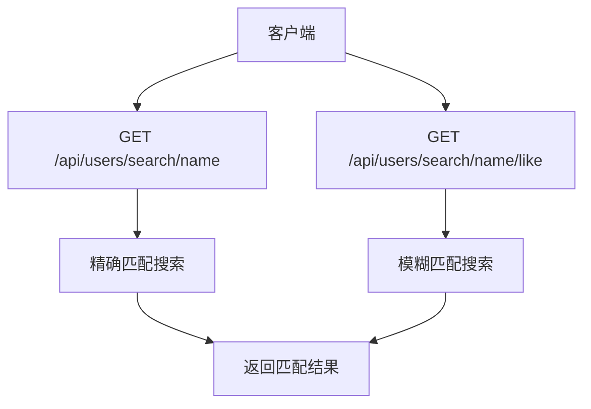
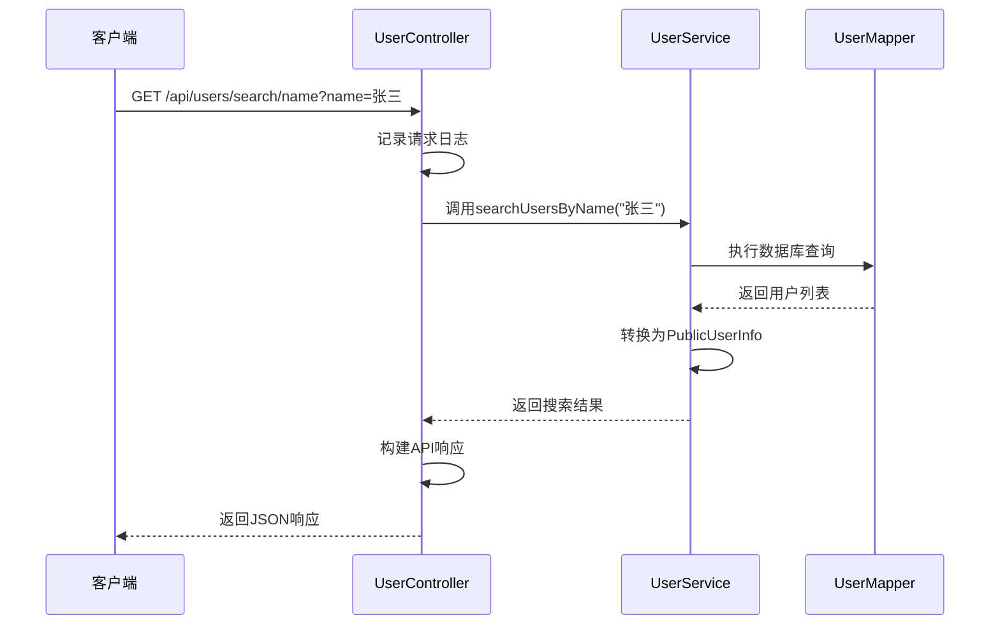
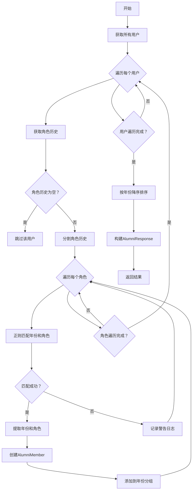
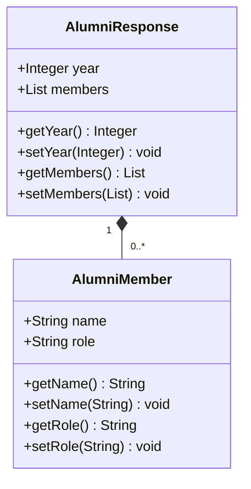

# 往届成员搜索

<cite>
**本文档引用的文件**   
- [UserController.java](file://src/main/java/com/redmoon2333/controller/UserController.java)
- [UserService.java](file://src/main/java/com/redmoon2333/service/UserService.java)
- [UserMapper.xml](file://src/main/resources/mapper/UserMapper.xml)
- [User.java](file://src/main/java/com/redmoon2333/entity/User.java)
- [AlumniResponse.java](file://src/main/java/com/redmoon2333/dto/AlumniResponse.java)
- [AlumniMember.java](file://src/main/java/com/redmoon2333/dto/AlumniMember.java)
- [PublicUserInfo.java](file://src/main/java/com/redmoon2333/dto/PublicUserInfo.java)
- [ApiResponse.java](file://src/main/java/com/redmoon2333/dto/ApiResponse.java)
- [ErrorCode.java](file://src/main/java/com/redmoon2333/exception/ErrorCode.java)
</cite>

## 目录
1. [简介](#简介)
2. [搜索接口设计](#搜索接口设计)
3. [姓名搜索实现机制](#姓名搜索实现机制)
4. [角色历史数据解析算法](#角色历史数据解析算法)
5. [搜索结果数据结构](#搜索结果数据结构)
6. [查询场景示例](#查询场景示例)
7. [HTTP状态码与错误信息](#http状态码与错误信息)
8. [性能优化措施](#性能优化措施)
9. [结论](#结论)

## 简介

往届成员搜索功能是学生会人力资源管理系统中的重要组成部分，旨在为用户提供高效、准确的往届成员信息查询服务。本系统通过分析用户角色历史数据，实现了基于姓名的精确匹配和模糊匹配搜索功能。系统能够从用户的角色历史记录中提取任职信息，按年份分组展示往届成员，并保持与主列表一致的数据结构。该功能特别适用于学生会成员追溯历史任职情况、查找往届负责人等场景。

## 搜索接口设计

系统提供了两个主要的搜索端点，分别支持精确匹配和模糊匹配两种搜索模式：



**接口来源**
- [UserController.java](file://src/main/java/com/redmoon2333/controller/UserController.java#L0-L139)

**接口详情：**

- **精确匹配端点**：`GET /api/users/search/name`
  - 接收`name`查询参数，执行精确匹配搜索
  - 仅返回姓名完全匹配的用户记录
  - 适用于已知完整姓名的精确查找场景

- **模糊匹配端点**：`GET /api/users/search/name/like`
  - 接收`name`查询参数，执行模糊匹配搜索
  - 返回姓名包含查询关键词的所有用户记录
  - 适用于只知道姓名部分信息的搜索场景

两个接口均返回标准化的API响应格式，包含状态信息、消息和数据内容，确保前端处理的一致性。

**接口来源**
- [UserController.java](file://src/main/java/com/redmoon2333/controller/UserController.java#L0-L139)

## 姓名搜索实现机制

姓名搜索功能的实现分为控制器层、服务层和数据访问层三个层次，各层协同工作完成搜索任务。

### 控制器层处理

控制器层负责接收HTTP请求，进行初步验证，并调用服务层方法：



**接口来源**
- [UserController.java](file://src/main/java/com/redmoon2333/controller/UserController.java#L0-L139)

### 服务层逻辑

服务层是姓名搜索的核心处理逻辑所在，主要职责包括：

1. **参数验证**：检查查询参数的有效性
2. **日志记录**：记录搜索操作的详细信息，便于调试和监控
3. **数据转换**：将实体对象转换为不包含敏感信息的传输对象
4. **异常处理**：捕获并处理可能发生的异常，返回友好的错误信息

服务层通过调用数据访问层的方法获取原始数据，然后进行必要的处理和转换，确保返回给控制器的数据符合安全要求。

**接口来源**
- [UserService.java](file://src/main/java/com/redmoon2333/service/UserService.java#L0-L200)

### 数据访问层实现

数据访问层使用MyBatis框架实现数据库操作，通过XML配置文件定义SQL查询语句：

```xml
<!-- 精确匹配查询 -->
<select id="findByName" parameterType="java.lang.String" resultMap="BaseResultMap">
    SELECT
    <include refid="Base_Column_List"/>
    FROM user
    WHERE name = #{name}
</select>

<!-- 模糊匹配查询 -->
<select id="findByNameLike" parameterType="java.lang.String" resultMap="BaseResultMap">
    SELECT
    <include refid="Base_Column_List"/>
    FROM user
    WHERE name LIKE CONCAT('%', #{name}, '%')
</select>
```

精确匹配使用等值比较操作符`=`，而模糊匹配使用`LIKE`操作符配合通配符`%`实现。这种设计确保了两种搜索模式的语义正确性，同时利用了数据库的索引优化能力。

**接口来源**
- [UserMapper.xml](file://src/main/resources/mapper/UserMapper.xml#L0-L105)

## 角色历史数据解析算法

往届成员信息的获取依赖于对用户角色历史数据的解析算法，该算法从用户的`roleHistory`字段中提取任职信息，并按年份进行分组。

### 数据解析流程



**接口来源**
- [UserService.java](file://src/main/java/com/redmoon2333/service/UserService.java#L0-L200)

### 字符串匹配策略

系统使用正则表达式`"(\\d{4})级(.+)"`来解析角色历史数据，该正则表达式能够匹配"年份+级+角色"的格式，例如"2024级部长"、"2023级部员"等。

```java
Pattern rolePattern = Pattern.compile("(\\d{4})级(.+)");
Matcher matcher = rolePattern.matcher(role);
if (matcher.matches()) {
    Integer year = Integer.valueOf(matcher.group(1));
    String roleName = matcher.group(2);
    // 创建部员信息并添加到对应年份分组
}
```

这种正则表达式匹配策略具有以下优点：
- **精确性**：能够准确提取年份和角色信息
- **灵活性**：支持多种角色类型（部长、副部长、部员等）
- **可扩展性**：易于修改以支持新的格式

### 大小写处理与特殊字符过滤

系统在处理角色历史数据时，会自动进行以下处理：

1. **空白字符处理**：使用`trim()`方法去除字符串首尾的空白字符
2. **大小写保持**：保留原始大小写，不进行强制转换
3. **特殊字符过滤**：不进行特殊字符过滤，保持数据原貌

这种处理策略确保了数据的完整性和准确性，同时避免了因字符处理导致的信息丢失。

**接口来源**
- [UserService.java](file://src/main/java/com/redmoon2333/service/UserService.java#L0-L200)

## 搜索结果数据结构

搜索结果采用分层的数据结构设计，确保了数据的组织性和可读性。

### 精确/模糊搜索结果结构

精确和模糊搜索返回`List<PublicUserInfo>`，其中`PublicUserInfo`包含以下字段：
- `name`：用户姓名
- `roleHistory`：角色历史记录

```json
[
  {
    "name": "张三",
    "roleHistory": "2024级部长&2023级部员"
  },
  {
    "name": "李四",
    "roleHistory": "2024级部员"
  }
]
```

### 往届成员分组结构

往届成员搜索返回`List<AlumniResponse>`，采用年份分组结构：



**接口来源**
- [AlumniResponse.java](file://src/main/java/com/redmoon2333/dto/AlumniResponse.java#L0-L30)
- [AlumniMember.java](file://src/main/java/com/redmoon2333/dto/AlumniMember.java#L0-L28)

### 数据结构特点

1. **分层组织**：按年份分组，便于用户浏览和理解
2. **降序排列**：年份按降序排列，最近的年份在前
3. **一致性**：保持与主列表相同的数据结构，便于前端统一处理
4. **完整性**：包含所有相关成员信息，避免多次查询

## 查询场景示例

以下是几种典型的查询场景及其预期结果：

### 全名匹配场景

**请求**：
```
GET /api/users/search/name?name=张三
```

**响应**：
```json
{
  "message": "查找成功",
  "data": [
    {
      "name": "张三",
      "roleHistory": "2024级部长&2023级部员"
    }
  ],
  "code": 200
}
```

此场景适用于已知完整姓名的精确查找，系统返回姓名完全匹配的用户记录。

**接口来源**
- [UserController.java](file://src/main/java/com/redmoon2333/controller/UserController.java#L0-L139)

### 部分名称搜索场景

**请求**：
```
GET /api/users/search/name/like?name=张
```

**响应**：
```json
{
  "message": "查找成功",
  "data": [
    {
      "name": "张三",
      "roleHistory": "2024级部长&2023级部员"
    },
    {
      "name": "张四",
      "roleHistory": "2023级部员"
    }
  ],
  "code": 200
}
```

此场景适用于只知道姓名部分信息的搜索，系统返回所有姓名包含查询关键词的用户记录。

**接口来源**
- [UserController.java](file://src/main/java/com/redmoon2333/controller/UserController.java#L0-L139)

### 无结果情况

**请求**：
```
GET /api/users/search/name?name=不存在的姓名
```

**响应**：
```json
{
  "message": "查找成功",
  "data": [],
  "code": 200
}
```

当搜索无匹配结果时，系统返回空数组而非错误，这符合RESTful API设计的最佳实践，表明查询操作成功执行，只是没有找到匹配的数据。

**接口来源**
- [UserService.java](file://src/main/java/com/redmoon2333/service/UserService.java#L0-L200)

## HTTP状态码与错误信息

系统采用标准化的HTTP状态码和错误信息机制，确保客户端能够正确理解和处理各种响应情况。

### 成功响应

| 状态码 | 含义 | 说明 |
|--------|------|------|
| 200 | OK | 操作成功，返回预期数据 |

成功响应始终包含`code: 200`和`message: "操作成功"`或具体操作描述，数据内容在`data`字段中。

### 客户端错误

| 状态码 | 含义 | 说明 |
|--------|------|------|
| 400 | Bad Request | 请求参数不正确 |

当请求参数无效时，系统返回400状态码，并在响应中包含具体的错误信息，如"请求参数不正确"。

**接口来源**
- [ErrorCode.java](file://src/main/java/com/redmoon2333/exception/ErrorCode.java#L0-L76)

### 服务器错误

| 状态码 | 含义 | 说明 |
|--------|------|------|
| 500 | Internal Server Error | 系统内部错误 |

当发生未预期的服务器端异常时，系统返回500状态码，并记录详细的错误日志，便于问题排查。

### 错误处理机制

系统通过全局异常处理器捕获和处理各种异常，确保返回给客户端的错误信息友好且安全：

```java
} catch (BusinessException e) {
    logger.warn("根据姓名查找用户失败: {}", e.getErrorCode().getMessage(), e);
    return ApiResponse.error(e.getErrorCode().getMessage(), e.getErrorCode().getCode());
} catch (Exception e) {
    logger.error("根据姓名查找用户时发生未预期的异常", e);
    return ApiResponse.error("系统内部错误", 500);
}
```

这种分层的异常处理机制能够区分业务异常和技术异常，提供恰当的错误响应。

**接口来源**
- [UserController.java](file://src/main/java/com/redmoon2333/controller/UserController.java#L0-L139)

## 性能优化措施

系统在设计和实现过程中考虑了多种性能优化措施，确保搜索功能的高效性。

### 数据库索引优化

为提高搜索性能，建议在数据库的`name`字段上创建索引：

```sql
CREATE INDEX idx_user_name ON user(name);
```

此索引能够显著提升精确匹配和模糊匹配查询的性能，特别是当用户数据量较大时。

### 查询性能分析

系统采用以下策略优化查询性能：

1. **分页查询**：虽然当前搜索接口未实现分页，但可以考虑在结果较多时添加分页支持
2. **连接池**：使用HikariCP高性能连接池管理数据库连接
3. **缓存机制**：虽然当前未实现，但可以考虑添加Redis缓存来缓存频繁访问的数据

### 代码层面优化

在代码实现层面，系统采用了以下优化措施：

1. **流式处理**：使用Java 8 Stream API进行数据转换和处理
2. **HashMap优化**：使用HashMap存储年份分组数据，确保O(1)的查找性能
3. **预编译正则**：将正则表达式模式预编译为静态变量，避免重复编译

```java
private static final Pattern rolePattern = Pattern.compile("(\\d{4})级(.+)");
```

这种预编译策略能够提高正则表达式匹配的性能，特别是在处理大量数据时。

**接口来源**
- [UserService.java](file://src/main/java/com/redmoon2333/service/UserService.java#L0-L200)

## 结论

往届成员搜索功能通过精心设计的接口和高效的实现机制，为学生会人力资源管理系统提供了强大的成员信息查询能力。系统支持精确匹配和模糊匹配两种搜索模式，能够满足不同场景下的查询需求。通过解析用户角色历史数据，系统能够按年份分组展示往届成员信息，保持了与主列表一致的数据结构。在性能方面，系统通过数据库索引优化和代码层面的优化措施，确保了搜索操作的高效性。未来可以考虑添加分页支持和缓存机制，进一步提升大规模数据下的查询性能。