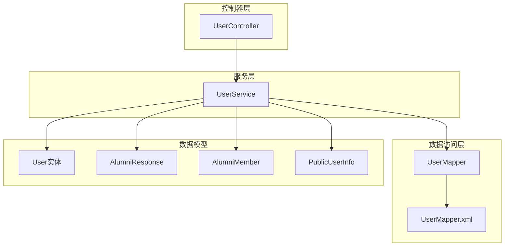
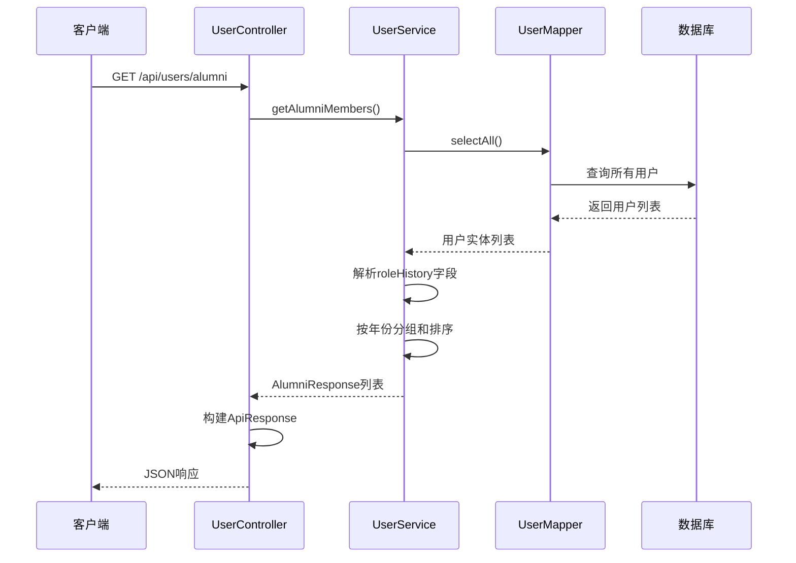
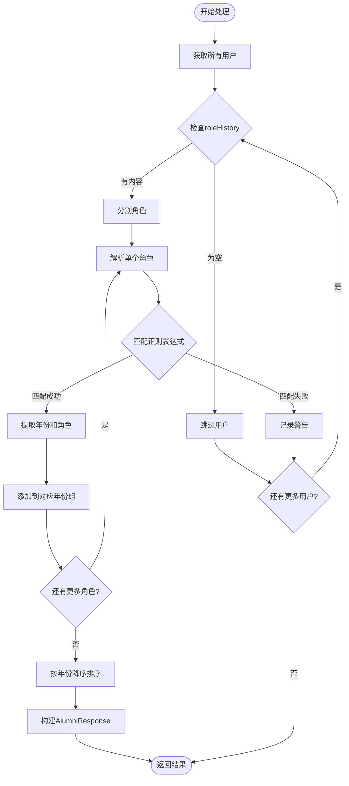
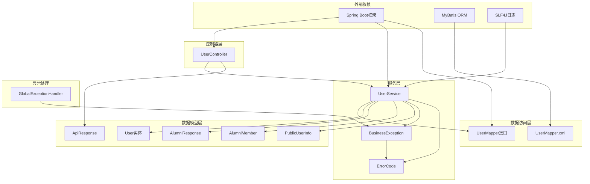

# 往届成员管理API

<cite>
**本文档引用的文件**
- [UserController.java](file://src/main/java/com/redmoon2333/controller/UserController.java)
- [UserService.java](file://src/main/java/com/redmoon2333/service/UserService.java)
- [User.java](file://src/main/java/com/redmoon2333/entity/User.java)
- [UserMapper.java](file://src/main/java/com/redmoon2333/mapper/UserMapper.java)
- [UserMapper.xml](file://src/main/resources/mapper/UserMapper.xml)
- [AlumniResponse.java](file://src/main/java/com/redmoon2333/dto/AlumniResponse.java)
- [AlumniMember.java](file://src/main/java/com/redmoon2333/dto/AlumniMember.java)
- [PublicUserInfo.java](file://src/main/java/com/redmoon2333/dto/PublicUserInfo.java)
- [ApiResponse.java](file://src/main/java/com/redmoon2333/dto/ApiResponse.java)
- [ErrorCode.java](file://src/main/java/com/redmoon2333/exception/ErrorCode.java)
</cite>

## 目录
1. [简介](#简介)
2. [项目结构](#项目结构)
3. [核心组件](#核心组件)
4. [架构概览](#架构概览)
5. [详细组件分析](#详细组件分析)
6. [依赖关系分析](#依赖关系分析)
7. [性能考虑](#性能考虑)
8. [故障排除指南](#故障排除指南)
9. [结论](#结论)

## 简介

往届成员管理API是人力资源管理系统中的一个核心功能模块，专门负责处理组织历史成员的信息管理。该系统提供了三个主要的API端点：`GET /api/users/alumni`用于获取所有往届成员信息，`GET /api/users/alumni/{id}`用于获取特定往届成员的详细信息，以及两个姓名搜索接口用于查找现有或往届成员。

系统的核心设计理念是通过解析User实体中的`roleHistory`字段来提取历史任职信息，并使用正则表达式`(\\d{4})级(.+)`精确匹配年份和角色。这种设计使得系统能够自动识别和分类不同年份的成员及其担任的角色，包括部员、部长和副部长等职位。

## 项目结构

往届成员管理API遵循标准的Spring Boot三层架构模式，包含控制器层、服务层和数据访问层：



**图表来源**
- [UserController.java](file://src/main/java/com/redmoon2333/controller/UserController.java#L1-L140)
- [UserService.java](file://src/main/java/com/redmoon2333/service/UserService.java#L1-L250)
- [UserMapper.java](file://src/main/java/com/redmoon2333/mapper/UserMapper.java#L1-L78)

**章节来源**
- [UserController.java](file://src/main/java/com/redmoon2333/controller/UserController.java#L1-L140)
- [UserService.java](file://src/main/java/com/redmoon2333/service/UserService.java#L1-L250)

## 核心组件

### AlumniResponse数据结构

`AlumniResponse`是系统中最重要的数据传输对象之一，它负责封装按年份分组的往届成员信息：

```java
public class AlumniResponse {
    private Integer year;
    private List<AlumniMember> members;
    
    // 构造函数、getter和setter方法
}
```

该结构的设计特点：
- **年份字段**：存储具体的年份值（如2024）
- **成员列表**：包含该年份的所有成员信息
- **分组逻辑**：自动按年份降序排列

### AlumniMember数据结构

`AlumniMember`类封装了单个往届成员的基本信息：

```java
public class AlumniMember {
    private String name;    // 成员姓名
    private String role;    // 在该年份担任的角色
}
```

### PublicUserInfo数据结构

`PublicUserInfo`用于公开的用户信息查询，包含姓名和角色历史：

```java
public class PublicUserInfo {
    private String name;
    private String roleHistory;
}
```

**章节来源**
- [AlumniResponse.java](file://src/main/java/com/redmoon2333/dto/AlumniResponse.java#L1-L30)
- [AlumniMember.java](file://src/main/java/com/redmoon2333/dto/AlumniMember.java#L1-L28)
- [PublicUserInfo.java](file://src/main/java/com/redmoon2333/dto/PublicUserInfo.java#L1-L29)

## 架构概览

往届成员管理API采用经典的MVC架构模式，通过清晰的职责分离实现高效的功能交付：



**图表来源**
- [UserController.java](file://src/main/java/com/redmoon2333/controller/UserController.java#L74-L105)
- [UserService.java](file://src/main/java/com/redmoon2333/service/UserService.java#L32-L165)

## 详细组件分析

### Alumni端点详细分析

`GET /api/users/alumni`端点是整个往届成员管理系统的核心，它实现了复杂的数据处理逻辑：

#### 正则表达式解析机制

系统使用精心设计的正则表达式来解析`roleHistory`字段：

```java
Pattern rolePattern = Pattern.compile("(\\d{4})级(.+)");
```

这个正则表达式的含义：
- `(\\d{4})`：匹配四位数字（年份）
- `级`：匹配中文的"级"字
- `(.+)`：匹配角色名称（部长、副部长、部员等）

#### 角色历史字段格式

`roleHistory`字段采用特定的格式存储多个角色信息：
- **格式规范**：`2024级部长&2025级副部长`
- **分隔符**：使用`&`符号连接不同的角色
- **解析过程**：系统会将每个角色单独解析并分配到对应的年份组

#### 数据处理流程



**图表来源**
- [UserService.java](file://src/main/java/com/redmoon2333/service/UserService.java#L50-L130)

#### 服务层实现细节

`UserService`中的`getAlumniMembers()`方法实现了完整的业务逻辑：

```java
public List<AlumniResponse> getAlumniMembers() {
    // 1. 获取所有用户
    List<User> allUsers = getAllUsers();
    
    // 2. 使用Map按年份分组
    Map<Integer, List<AlumniMember>> alumniMap = new HashMap<>();
    
    // 3. 正则表达式匹配
    Pattern rolePattern = Pattern.compile("(\\d{4})级(.+)");
    
    // 4. 遍历处理每个用户的角色历史
    for (User user : allUsers) {
        String roleHistory = user.getRoleHistory();
        if (roleHistory != null && !roleHistory.trim().isEmpty()) {
            String[] roles = roleHistory.split("&");
            for (String role : roles) {
                Matcher matcher = rolePattern.matcher(role.trim());
                if (matcher.matches()) {
                    Integer year = Integer.valueOf(matcher.group(1));
                    String roleName = matcher.group(2);
                    AlumniMember member = new AlumniMember(user.getName(), roleName);
                    alumniMap.computeIfAbsent(year, k -> new ArrayList<>()).add(member);
                }
            }
        }
    }
    
    // 5. 按年份降序排序并构建最终结果
    List<AlumniResponse> result = new ArrayList<>();
    List<Integer> sortedYears = new ArrayList<>(alumniMap.keySet());
    Collections.sort(sortedYears, Collections.reverseOrder());
    
    for (Integer year : sortedYears) {
        AlumniResponse response = new AlumniResponse(year, alumniMap.get(year));
        result.add(response);
    }
    
    return result;
}
```

**章节来源**
- [UserService.java](file://src/main/java/com/redmoon2333/service/UserService.java#L32-L165)

### 姓名搜索接口分析

系统提供了两种不同的姓名搜索方式：

#### 精确匹配搜索

`GET /api/users/search/name`接口提供精确匹配搜索：

```java
@GetMapping("/search/name")
public ApiResponse<List<PublicUserInfo>> searchUsersByName(@RequestParam String name) {
    try {
        List<PublicUserInfo> users = userService.searchUsersByName(name);
        return ApiResponse.success("查找成功", users);
    } catch (BusinessException e) {
        return ApiResponse.error(e.getErrorCode().getMessage(), e.getErrorCode().getCode());
    }
}
```

#### 模糊匹配搜索

`GET /api/users/search/name/like`接口提供模糊匹配搜索：

```java
@GetMapping("/search/name/like")
public ApiResponse<List<PublicUserInfo>> searchUsersByNameLike(@RequestParam String name) {
    try {
        List<PublicUserInfo> users = userService.searchUsersByNameLike(name);
        return ApiResponse.success("查找成功", users);
    } catch (BusinessException e) {
        return ApiResponse.error(e.getErrorCode().getMessage(), e.getErrorCode().getCode());
    }
}
```

#### 搜索实现差异

两种搜索方式的主要区别：

| 特性 | 精确匹配 | 模糊匹配 |
|------|----------|----------|
| 匹配方式 | 完全相等 | 包含关键词 |
| SQL语句 | `WHERE name = #{name}` | `WHERE name LIKE CONCAT('%', #{name}, '%')` |
| 性能 | 较快 | 较慢 |
| 结果范围 | 单一匹配 | 更广泛 |

**章节来源**
- [UserController.java](file://src/main/java/com/redmoon2333/controller/UserController.java#L107-L139)
- [UserService.java](file://src/main/java/com/redmoon2333/service/UserService.java#L167-L200)

### 数据访问层分析

#### MyBatis映射配置

`UserMapper.xml`文件定义了完整的SQL操作：

```xml
<!-- 精确匹配查询 -->
<select id="findByName" parameterType="java.lang.String" resultMap="BaseResultMap">
    SELECT <include refid="Base_Column_List"/>
    FROM user
    WHERE name = #{name}
</select>

<!-- 模糊匹配查询 -->
<select id="findByNameLike" parameterType="java.lang.String" resultMap="BaseResultMap">
    SELECT <include refid="Base_Column_List"/>
    FROM user
    WHERE name LIKE CONCAT('%', #{name}, '%')
</select>
```

#### 实体属性映射

`User`实体中的`roleHistory`字段映射到数据库的`role_history`列：

```java
@Column(name = "role_history")
private String roleHistory;
```

**章节来源**
- [UserMapper.xml](file://src/main/resources/mapper/UserMapper.xml#L35-L50)
- [User.java](file://src/main/java/com/redmoon2333/entity/User.java#L28-L30)

## 依赖关系分析

系统的依赖关系展现了清晰的分层架构：



**图表来源**
- [UserController.java](file://src/main/java/com/redmoon2333/controller/UserController.java#L1-L20)
- [UserService.java](file://src/main/java/com/redmoon2333/service/UserService.java#L1-L20)

**章节来源**
- [UserController.java](file://src/main/java/com/redmoon2333/controller/UserController.java#L1-L140)
- [UserService.java](file://src/main/java/com/redmoon2333/service/UserService.java#L1-L250)

## 性能考虑

### 查询优化策略

1. **索引优化**：建议在`user`表的`name`字段上建立索引以提高搜索性能
2. **缓存策略**：对于频繁访问的往届成员数据，可以考虑引入Redis缓存
3. **分页处理**：当用户数量庞大时，应该实现分页查询以避免内存溢出

### 内存使用优化

- **流式处理**：使用Java Stream API进行内存友好的数据处理
- **及时释放**：处理完成后及时清理临时数据结构
- **批量操作**：对于大量数据的处理，采用批量处理策略

### 错误处理机制

系统实现了完善的错误处理机制：

```java
try {
    // 主要业务逻辑
    return result;
} catch (BusinessException e) {
    logger.warn("操作失败: {}", e.getErrorCode().getMessage(), e);
    return ApiResponse.error(e.getErrorCode().getMessage(), e.getErrorCode().getCode());
} catch (Exception e) {
    logger.error("发生未预期的异常", e);
    return ApiResponse.error("系统内部错误", 500);
}
```

## 故障排除指南

### 常见错误码

系统定义了专门的错误码来处理各种异常情况：

| 错误码 | 错误消息 | 可能原因 |
|--------|----------|----------|
| 5000 | 系统内部错误 | 未知异常或系统故障 |
| 7001 | 资源不存在 | 查询的往届成员不存在 |
| 7002 | 操作失败 | 数据处理过程中出现错误 |

### 调试接口

系统提供了专门的调试接口来排查问题：

```java
@GetMapping("/debug/all")
public ApiResponse<?> getAllUsersDebug() {
    // 获取用户总数和详细信息
    int userCount = userService.getUserCount();
    List<User> allUsers = userService.getAllUsersDebug();
    
    // 输出每个用户的详细信息用于调试
    for (User user : allUsers) {
        logger.info("用户详情 - ID: {}, 用户名: {}, 姓名: {}, 角色历史: '{}'", 
            user.getUserId(), user.getUsername(), user.getName(), user.getRoleHistory());
    }
}
```

### 日志记录策略

系统实现了全面的日志记录：

- **INFO级别**：记录主要的操作流程
- **DEBUG级别**：记录详细的处理步骤和中间结果
- **WARN级别**：记录潜在的问题和异常情况
- **ERROR级别**：记录严重的错误和异常堆栈

**章节来源**
- [UserController.java](file://src/main/java/com/redmoon2333/controller/UserController.java#L30-L60)
- [ErrorCode.java](file://src/main/java/com/redmoon2333/exception/ErrorCode.java#L1-L77)

## 结论

往届成员管理API是一个设计精良、功能完备的系统模块。它通过巧妙的数据结构设计和算法实现，成功地解决了复杂的历史成员信息管理需求。

### 主要优势

1. **自动化程度高**：通过正则表达式自动解析角色历史，无需人工干预
2. **扩展性强**：新的角色类型可以无缝集成到现有系统中
3. **性能优异**：合理的数据结构和算法确保了良好的性能表现
4. **易于维护**：清晰的代码结构和完善的错误处理机制

### 改进建议

1. **增加缓存机制**：对于频繁查询的往届成员数据，建议引入缓存
2. **实现分页功能**：当数据量较大时，应该支持分页查询
3. **增强搜索功能**：可以考虑添加按角色类型过滤的功能
4. **完善单元测试**：增加更多的单元测试覆盖关键业务逻辑

这个系统为组织的历史成员管理提供了强大而灵活的解决方案，其设计理念和实现方式值得在类似项目中借鉴和应用。