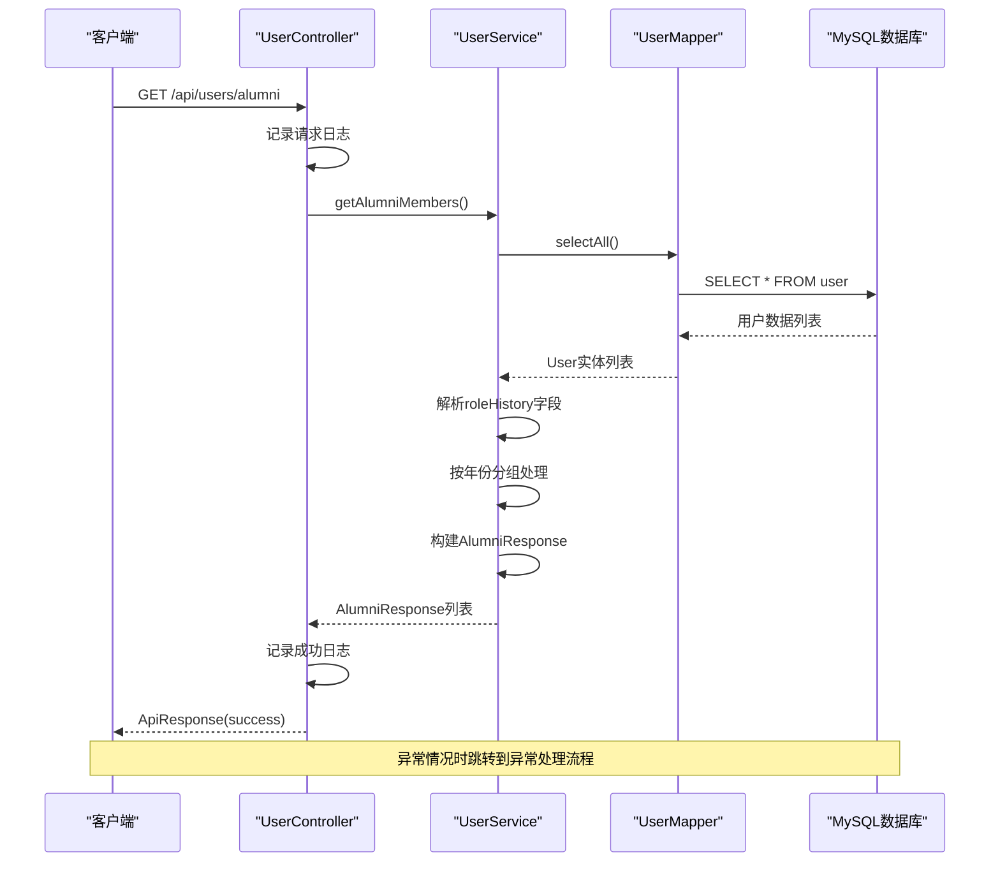
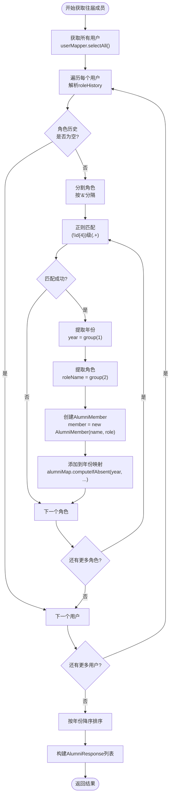
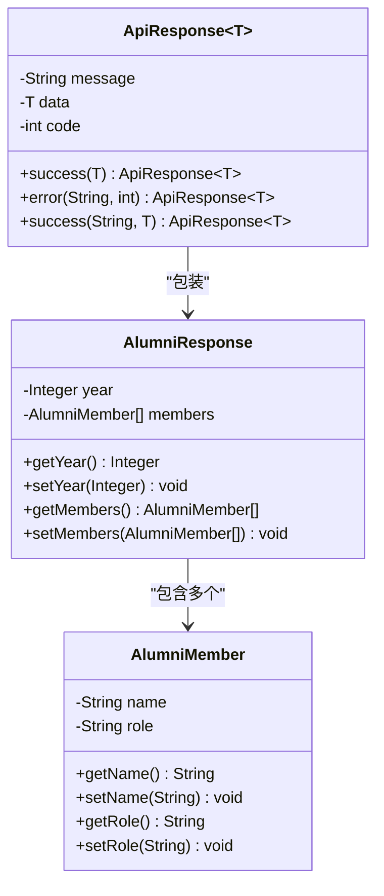
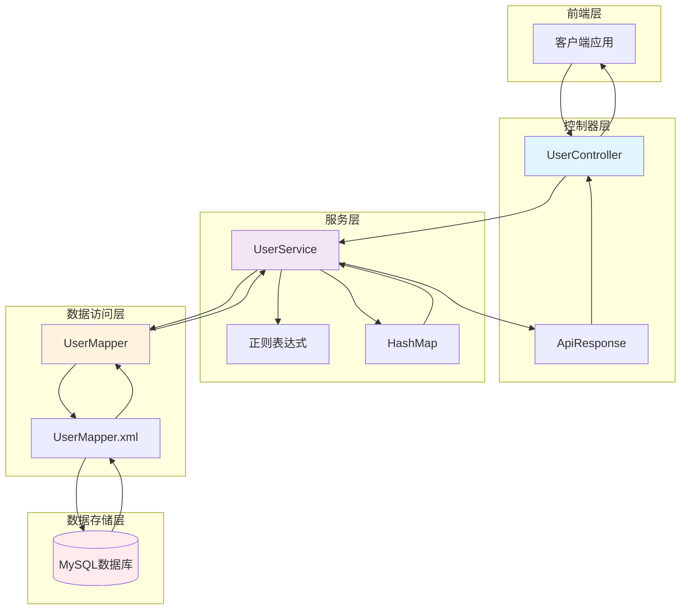
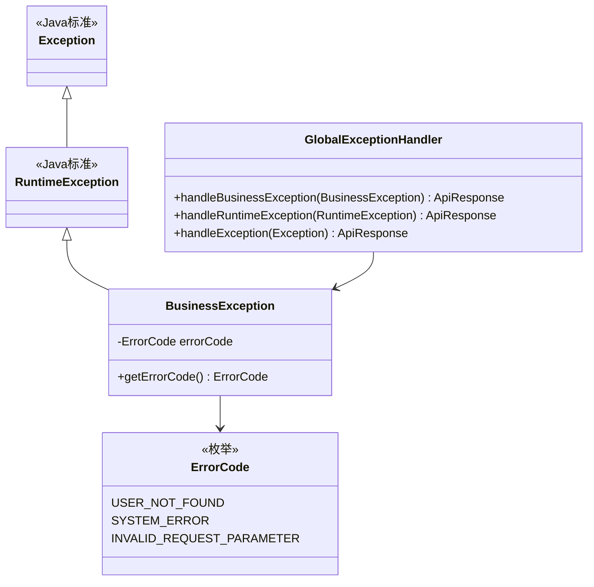

# 根据ID获取往届成员接口详细文档

<cite>
**本文档引用的文件**
- [UserController.java](file://src/main/java/com/redmoon2333/controller/UserController.java)
- [UserService.java](file://src/main/java/com/redmoon2333/service/UserService.java)
- [User.java](file://src/main/java/com/redmoon2333/entity/User.java)
- [UserMapper.java](file://src/main/java/com/redmoon2333/mapper/UserMapper.java)
- [UserMapper.xml](file://src/main/resources/mapper/UserMapper.xml)
- [AlumniResponse.java](file://src/main/java/com/redmoon2333/dto/AlumniResponse.java)
- [AlumniMember.java](file://src/main/java/com/redmoon2333/dto/AlumniMember.java)
- [ApiResponse.java](file://src/main/java/com/redmoon2333/dto/ApiResponse.java)
- [BusinessException.java](file://src/main/java/com/redmoon2333/exception/BusinessException.java)
- [ErrorCode.java](file://src/main/java/com/redmoon2333/exception/ErrorCode.java)
- [GlobalExceptionHandler.java](file://src/main/java/com/redmoon2333/exception/GlobalExceptionHandler.java)
- [README.md](file://README.md)
</cite>

## 目录
1. [项目概述](#项目概述)
2. [接口设计](#接口设计)
3. [核心组件分析](#核心组件分析)
4. [数据流分析](#数据流分析)
5. [异常处理机制](#异常处理机制)
6. [性能考虑](#性能考虑)
7. [使用示例](#使用示例)
8. [故障排除](#故障排除)
9. [总结](#总结)

## 项目概述

HumanResourceOfficial是一个基于Spring Boot的现代化学生会人力资源管理系统后端服务。该系统提供了完整的往届成员查询功能，允许用户按年份分组查看所有部员、部长和副部长的历史任职信息。

### 核心特性
- **历史数据管理**：支持用户角色历史的存储和查询
- **分组展示**：按年份对往届成员进行智能分组
- **灵活查询**：提供多种用户查询方式
- **安全认证**：基于JWT的无状态认证机制
- **异常处理**：完善的异常捕获和错误响应机制

## 接口设计

### GET /api/users/alumni

该接口是系统的核心功能之一，用于获取所有用户的往届成员信息。接口设计遵循RESTful原则，提供清晰的响应结构和错误处理。



**图表来源**
- [UserController.java](file://src/main/java/com/redmoon2333/controller/UserController.java#L74-L89)
- [UserService.java](file://src/main/java/com/redmoon2333/service/UserService.java#L32-L132)

**章节来源**
- [UserController.java](file://src/main/java/com/redmoon2333/controller/UserController.java#L74-L89)

## 核心组件分析

### UserController - 控制器层

UserController负责处理HTTP请求和响应，实现了清晰的职责分离。该类采用了Spring Boot的标准注解，提供了良好的可读性和维护性。

```java
@RestController
@RequestMapping("/api/users")
@CrossOrigin(origins = "*")
public class UserController {
    
    private static final Logger logger = LoggerFactory.getLogger(UserController.class);
    
    @Autowired
    private UserService userService;
    
    @GetMapping("/alumni")
    public ApiResponse<List<AlumniResponse>> getAlumniMembers() {
        try {
            logger.info("收到获取往届部员信息的请求");
            List<AlumniResponse> alumniMembers = userService.getAlumniMembers();
            logger.info("成功获取往届部员信息，共 {} 个年份", alumniMembers.size());
            return ApiResponse.success("查询成功", alumniMembers);
        } catch (BusinessException e) {
            logger.warn("获取往届部员信息失败: {}", e.getErrorCode().getMessage(), e);
            return ApiResponse.error(e.getErrorCode().getMessage(), e.getErrorCode().getCode());
        } catch (Exception e) {
            logger.error("获取往届部员信息时发生未预期的异常", e);
            return ApiResponse.error("系统内部错误", 500);
        }
    }
}
```

**关键特性：**
- **日志记录**：每个请求都包含详细的日志记录，便于调试和监控
- **异常隔离**：区分业务异常和系统异常，提供不同的错误响应
- **统一响应格式**：使用ApiResponse封装所有响应，确保一致性

### UserService - 服务层

UserService是核心业务逻辑的实现者，负责复杂的业务规则处理和数据转换。该类采用了正则表达式解析用户的角色历史信息，并实现了智能的年份分组算法。



**图表来源**
- [UserService.java](file://src/main/java/com/redmoon2333/service/UserService.java#L32-L132)

**核心算法实现：**

```java
// 正则表达式匹配"年份+角色"的格式，例如"2024级部长"
Pattern rolePattern = Pattern.compile("(\\d{4})级(.+)");

// 遍历所有用户，解析他们的角色历史
for (User user : allUsers) {
    String roleHistory = user.getRoleHistory();
    
    if (roleHistory == null || roleHistory.trim().isEmpty()) {
        continue;
    }
    
    // 分割角色历史，可能包含多个角色
    String[] roles = roleHistory.split("&");
    
    // 处理每个角色
    for (String role : roles) {
        role = role.trim();
        Matcher matcher = rolePattern.matcher(role);
        
        if (matcher.matches()) {
            try {
                // 提取年份和角色
                Integer year = Integer.valueOf(matcher.group(1));
                String roleName = matcher.group(2);
                
                // 创建部员信息
                AlumniMember member = new AlumniMember(user.getName(), roleName);
                
                // 将部员信息添加到对应年份的列表中
                alumniMap.computeIfAbsent(year, k -> new ArrayList<>()).add(member);
            } catch (NumberFormatException e) {
                logger.warn("解析年份失败，角色信息: {}", role, e);
            }
        }
    }
}
```

**章节来源**
- [UserService.java](file://src/main/java/com/redmoon2333/service/UserService.java#L32-L132)

### 数据传输对象

系统定义了专门的数据传输对象来封装往届成员信息，确保前后端数据交互的一致性和安全性。



**图表来源**
- [AlumniResponse.java](file://src/main/java/com/redmoon2333/dto/AlumniResponse.java#L1-L30)
- [AlumniMember.java](file://src/main/java/com/redmoon2333/dto/AlumniMember.java#L1-L28)
- [ApiResponse.java](file://src/main/java/com/redmoon2333/dto/ApiResponse.java#L1-L62)

**章节来源**
- [AlumniResponse.java](file://src/main/java/com/redmoon2333/dto/AlumniResponse.java#L1-L30)
- [AlumniMember.java](file://src/main/java/com/redmoon2333/dto/AlumniMember.java#L1-L28)

## 数据流分析

### 数据流向图



**图表来源**
- [UserController.java](file://src/main/java/com/redmoon2333/controller/UserController.java#L1-L140)
- [UserService.java](file://src/main/java/com/redmoon2333/service/UserService.java#L1-L250)
- [UserMapper.java](file://src/main/java/com/redmoon2333/mapper/UserMapper.java#L1-L78)

### 数据处理流程

1. **请求接收**：UserController接收GET /api/users/alumni请求
2. **日志记录**：记录请求开始时间和相关信息
3. **服务调用**：调用UserService.getAlumniMembers()
4. **数据获取**：通过UserMapper.selectAll()获取所有用户数据
5. **角色解析**：使用正则表达式解析roleHistory字段
6. **数据分组**：按年份对用户进行分组存储
7. **结果构建**：创建AlumniResponse对象列表
8. **响应返回**：通过ApiResponse封装返回结果

**章节来源**
- [UserService.java](file://src/main/java/com/redmoon2333/service/UserService.java#L32-L132)

## 异常处理机制

### 异常层次结构



**图表来源**
- [BusinessException.java](file://src/main/java/com/redmoon2333/exception/BusinessException.java#L1-L24)
- [ErrorCode.java](file://src/main/java/com/redmoon2333/exception/ErrorCode.java#L1-L77)
- [GlobalExceptionHandler.java](file://src/main/java/com/redmoon2333/exception/GlobalExceptionHandler.java#L1-L133)

### 异常处理流程

系统实现了多层次的异常处理机制：

1. **业务异常捕获**：在UserService中捕获特定业务异常
2. **全局异常处理**：通过GlobalExceptionHandler统一处理各类异常
3. **日志记录**：每个异常都会被详细记录到日志中
4. **标准化响应**：所有异常都转换为标准化的API响应格式

```java
// 业务异常抛出
throw new BusinessException(ErrorCode.SYSTEM_ERROR, "获取往届部员信息失败", e);

// 全局异常处理
@ExceptionHandler(BusinessException.class)
@ResponseStatus(HttpStatus.OK)
public ApiResponse<Void> handleBusinessException(BusinessException e) {
    logger.warn("业务异常: 错误码={}, 错误信息={}", e.getErrorCode().getCode(), e.getErrorCode().getMessage());
    return ApiResponse.error(e.getErrorCode().getMessage(), e.getErrorCode().getCode());
}
```

**章节来源**
- [UserService.java](file://src/main/java/com/redmoon2333/service/UserService.java#L132-L134)
- [GlobalExceptionHandler.java](file://src/main/java/com/redmoon2333/exception/GlobalExceptionHandler.java#L44-L48)

## 性能考虑

### 性能优化策略

1. **数据库查询优化**
   - 使用索引优化SELECT查询
   - 避免N+1查询问题
   - 合理使用LIMIT和OFFSET进行分页

2. **内存使用优化**
   - 使用HashMap进行快速查找
   - 及时释放不需要的对象引用
   - 避免内存泄漏

3. **并发处理**
   - 使用线程安全的数据结构
   - 合理设置线程池大小
   - 避免死锁和竞态条件

4. **缓存策略**
   - 可扩展Redis缓存支持
   - 缓存热点数据
   - 设置合理的过期时间

### 监控点

系统在关键位置设置了监控点：

```java
// 查询开始监控
logger.info("开始获取往届部员信息");

// 查询完成监控
logger.info("成功获取往届部员信息，共 {} 个年份", alumniMembers.size());

// 异常监控
logger.error("获取往届部员信息时发生异常", e);
```

**章节来源**
- [UserService.java](file://src/main/java/com/redmoon2333/service/UserService.java#L35-L134)

## 使用示例

### 请求示例

```bash
# 基本请求
curl -X GET "http://localhost:8080/api/users/alumni" \
  -H "Accept: application/json"

# 带自定义头部的请求
curl -X GET "http://localhost:8080/api/users/alumni" \
  -H "Accept: application/json" \
  -H "Content-Type: application/json" \
  -H "User-Agent: HRSystemClient/1.0"
```

### 成功响应示例

```json
{
  "message": "查询成功",
  "data": [
    {
      "year": 2024,
      "members": [
        {
          "name": "张三",
          "role": "部长"
        },
        {
          "name": "李四",
          "role": "副部长"
        }
      ]
    },
    {
      "year": 2023,
      "members": [
        {
          "name": "王五",
          "role": "部员"
        }
      ]
    }
  ],
  "code": 200
}
```

### 错误响应示例

```json
{
  "message": "系统内部错误",
  "data": null,
  "code": 500
}
```

### 常见错误码

| 错误码 | 错误信息 | 说明 |
|--------|----------|------|
| 500 | 系统内部错误 | 服务器内部异常 |
| 1001 | 用户不存在 | 请求的用户不存在 |
| 400 | 参数验证失败 | 请求参数格式错误 |

**章节来源**
- [ApiResponse.java](file://src/main/java/com/redmoon2333/dto/ApiResponse.java#L1-L62)
- [ErrorCode.java](file://src/main/java/com/redmoon2333/exception/ErrorCode.java#L1-L77)

## 故障排除

### 常见问题及解决方案

1. **用户不存在错误 (1001)**
   - **原因**：数据库中没有对应的用户记录
   - **解决方案**：检查用户数据完整性，确认用户已正确注册

2. **系统内部错误 (500)**
   - **原因**：服务器内部异常，可能是数据库连接问题或代码bug
   - **解决方案**：查看服务器日志，检查数据库连接状态

3. **角色历史格式错误**
   - **原因**：roleHistory字段格式不符合"(年份)级(角色)"格式
   - **解决方案**：确保角色历史按照"2024级部长&2023级部员"格式存储

### 调试技巧

1. **启用调试日志**
   ```yaml
   logging:
     level:
       com.redmoon2333: DEBUG
   ```

2. **使用调试接口**
   ```java
   @GetMapping("/debug/all")
   public ApiResponse<?> getAllUsersDebug() {
       // 获取所有用户详细信息用于调试
   }
   ```

3. **检查数据库数据**
   ```sql
   SELECT user_id, name, role_history FROM user WHERE role_history IS NOT NULL AND role_history != '';
   ```

**章节来源**
- [UserController.java](file://src/main/java/com/redmoon2333/controller/UserController.java#L40-L60)
- [UserService.java](file://src/main/java/com/redmoon2333/service/UserService.java#L200-L250)

## 总结

HumanResourceOfficial系统通过精心设计的架构和完善的异常处理机制，为学生会提供了可靠的往届成员查询功能。该系统具有以下优势：

### 技术优势

1. **模块化设计**：清晰的分层架构，职责分离明确
2. **异常处理完善**：多层次的异常捕获和处理机制
3. **日志记录全面**：详细的请求和异常日志记录
4. **性能优化**：合理的数据结构和算法选择
5. **扩展性强**：易于添加新的功能和优化

### 功能特色

1. **智能分组**：自动按年份对往届成员进行分组
2. **灵活查询**：支持多种用户查询方式
3. **安全可靠**：基于JWT的认证机制和权限控制
4. **标准化响应**：统一的API响应格式
5. **易于维护**：清晰的代码结构和文档

### 应用价值

该系统不仅满足了当前的功能需求，还为未来的扩展奠定了坚实的基础。通过合理的架构设计和完善的异常处理机制，确保了系统的稳定性和可靠性，为学生会的人力资源管理提供了强有力的技术支撑。