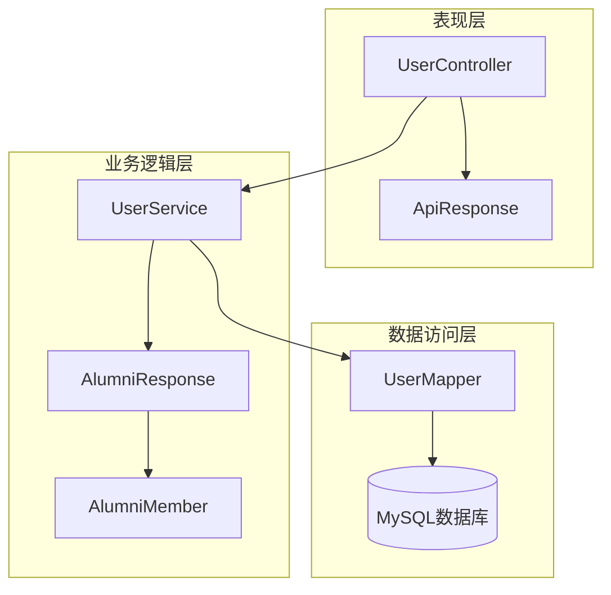
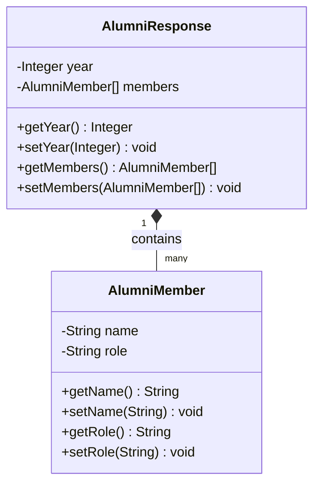
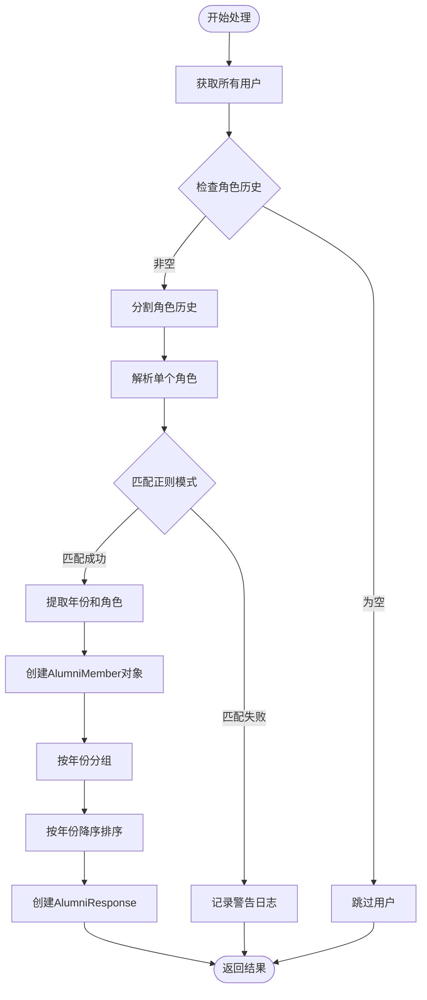
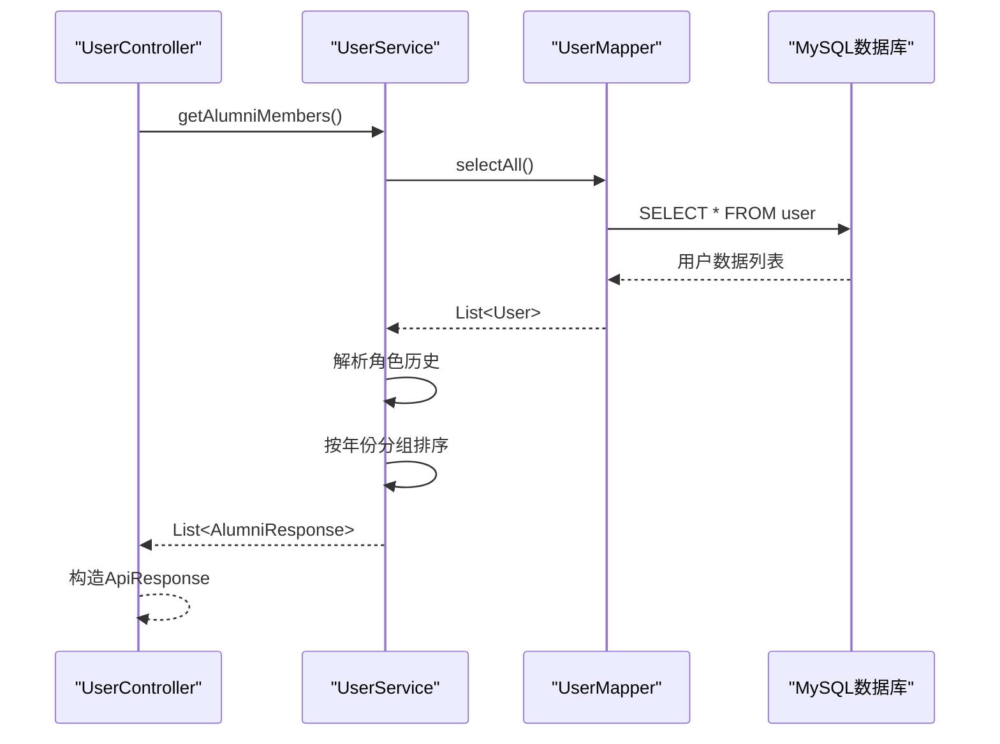

# 获取所有往届成员接口文档

<cite>
**本文档引用的文件**
- [UserController.java](file://src/main/java/com/redmoon2333/controller/UserController.java)
- [UserService.java](file://src/main/java/com/redmoon2333/service/UserService.java)
- [AlumniResponse.java](file://src/main/java/com/redmoon2333/dto/AlumniResponse.java)
- [AlumniMember.java](file://src/main/java/com/redmoon2333/dto/AlumniMember.java)
- [ApiResponse.java](file://src/main/java/com/redmoon2333/dto/ApiResponse.java)
- [User.java](file://src/main/java/com/redmoon2333/entity/User.java)
- [UserMapper.java](file://src/main/java/com/redmoon2333/mapper/UserMapper.java)
- [UserMapper.xml](file://src/main/resources/mapper/UserMapper.xml)
- [application.yml](file://src/main/resources/application.yml)
</cite>

## 目录
1. [简介](#简介)
2. [项目架构概览](#项目架构概览)
3. [核心组件分析](#核心组件分析)
4. [详细组件分析](#详细组件分析)
5. [数据流程分析](#数据流程分析)
6. [请求响应示例](#请求响应示例)
7. [性能考虑](#性能考虑)
8. [故障排除指南](#故障排除指南)
9. [总结](#总结)

## 简介

本文档详细介绍了人力资源管理系统中获取所有往届成员接口的实现机制。该接口通过`GET /api/users/alumni`端点提供服务，能够从数据库中提取所有用户的任职历史信息，并按照年份进行分组展示。系统使用Spring Boot框架构建，采用MyBatis作为ORM工具，实现了完整的数据处理和响应封装流程。

## 项目架构概览

系统采用典型的三层架构设计，包含控制器层、服务层和数据访问层：



**图表来源**
- [UserController.java](file://src/main/java/com/redmoon2333/controller/UserController.java#L1-L140)
- [UserService.java](file://src/main/java/com/redmoon2333/service/UserService.java#L1-L250)

## 核心组件分析

### 控制器层 - UserController

`UserController`负责处理HTTP请求和响应，是系统的入口点。它提供了多个用户相关的API接口，其中`getAlumniMembers()`方法专门处理获取往届成员信息的请求。

```java
@GetMapping("/alumni")
public ApiResponse<List<AlumniResponse>> getAlumniMembers() {
    try {
        logger.info("收到获取往届部员信息的请求");
        List<AlumniResponse> alumniMembers = userService.getAlumniMembers();
        logger.info("成功获取往届部员信息，共 {} 个年份", alumniMembers.size());
        return ApiResponse.success("查询成功", alumniMembers);
    } catch (BusinessException e) {
        logger.warn("获取往届部员信息失败: {}", e.getErrorCode().getMessage(), e);
        return ApiResponse.error(e.getErrorCode().getMessage(), e.getErrorCode().getCode());
    } catch (Exception e) {
        logger.error("获取往届部员信息时发生未预期的异常", e);
        return ApiResponse.error("系统内部错误", 500);
    }
}
```

### 服务层 - UserService

`UserService`是核心业务逻辑处理单元，负责从数据库获取用户数据并进行复杂的业务处理。它使用正则表达式解析用户的角色历史信息，实现按年份分组和排序的功能。

**章节来源**
- [UserController.java](file://src/main/java/com/redmoon2333/controller/UserController.java#L74-L105)
- [UserService.java](file://src/main/java/com/redmoon2333/service/UserService.java#L32-L165)

## 详细组件分析

### AlumniResponse 数据传输对象

`AlumniResponse`是一个关键的数据传输对象，用于封装按年份分组的往届成员信息：



**图表来源**
- [AlumniResponse.java](file://src/main/java/com/redmoon2333/dto/AlumniResponse.java#L1-L30)
- [AlumniMember.java](file://src/main/java/com/redmoon2333/dto/AlumniMember.java#L1-L28)

### 正则表达式解析机制

系统使用正则表达式`(\\d{4})级(.+)`来解析用户角色历史字段中的年份和角色信息：

```java
// 正则表达式匹配"年份+角色"的格式，例如"2024级部长"
Pattern rolePattern = Pattern.compile("(\\d{4})级(.+)");
```

这个正则表达式的含义：
- `(\\d{4})`：匹配4位数字，表示年份
- `级`：匹配中文"级"字
- `(.+)`：匹配任意字符序列，表示角色名称

### 业务逻辑处理流程



**图表来源**
- [UserService.java](file://src/main/java/com/redmoon2333/service/UserService.java#L45-L133)

### 数据库交互层

系统使用MyBatis ORM框架与MySQL数据库交互：



**图表来源**
- [UserService.java](file://src/main/java/com/redmoon2333/service/UserService.java#L38-L42)
- [UserMapper.java](file://src/main/java/com/redmoon2333/mapper/UserMapper.java#L68-L72)

**章节来源**
- [UserService.java](file://src/main/java/com/redmoon2333/service/UserService.java#L32-L165)
- [UserMapper.java](file://src/main/java/com/redmoon2333/mapper/UserMapper.java#L1-L78)

## 数据流程分析

### 完整数据流处理

从数据库查询到最终JSON输出的完整数据流如下：

1. **数据库查询阶段**
   - 使用`UserMapper.selectAll()`获取所有用户记录
   - 查询语句：`SELECT user_id, username, password, name, role_history FROM user`

2. **数据解析阶段**
   - 遍历每个用户，检查`roleHistory`字段
   - 使用正则表达式解析"年份+角色"格式
   - 支持多角色历史（用"&"分隔）

3. **数据组织阶段**
   - 使用`HashMap<Integer, List<AlumniMember>>`按年份分组
   - 使用`Collections.reverseOrder()`实现降序排序
   - 创建`AlumniResponse`对象封装每一年的数据

4. **响应封装阶段**
   - 使用`ApiResponse`统一响应格式
   - 包含状态消息、数据内容和HTTP状态码

### 边界情况处理

系统对多种边界情况进行了妥善处理：

- **空角色历史**：跳过没有角色历史的用户
- **格式错误**：记录警告日志但继续处理其他用户
- **异常处理**：捕获所有异常并返回适当的错误响应
- **空结果**：当没有符合条件的用户时返回空列表

**章节来源**
- [UserService.java](file://src/main/java/com/redmoon2333/service/UserService.java#L45-L133)

## 请求响应示例

### 请求示例

```
GET /api/users/alumni
Host: localhost:8080
Accept: application/json
```

### 响应示例

```json
{
  "message": "查询成功",
  "data": [
    {
      "year": 2024,
      "members": [
        {
          "name": "张三",
          "role": "部长"
        },
        {
          "name": "李四",
          "role": "副部长"
        }
      ]
    },
    {
      "year": 2023,
      "members": [
        {
          "name": "王五",
          "role": "部员"
        }
      ]
    }
  ],
  "code": 200
}
```

### 多角色成员处理

对于具有多个角色历史的用户，系统会分别处理每个角色：

```java
// 示例：用户角色历史："2024级部长&2025级副部长"
String[] roles = roleHistory.split("&"); // ["2024级部长", "2025级副部长"]
for (String role : roles) {
    // 分别解析每个角色
    Matcher matcher = rolePattern.matcher(role);
    if (matcher.matches()) {
        // 处理每个角色
    }
}
```

### 空角色历史处理

当用户没有角色历史时，系统会跳过该用户并记录调试信息：

```java
if (roleHistory == null || roleHistory.trim().isEmpty()) {
    logger.debug("用户 {} 没有角色历史信息", user.getUsername());
    continue;
}
```

**章节来源**
- [UserService.java](file://src/main/java/com/redmoon2333/service/UserService.java#L55-L75)
- [ApiResponse.java](file://src/main/java/com/redmoon2333/dto/ApiResponse.java#L1-L62)

## 性能考虑

### 数据库查询优化

- 使用MyBatis的批量查询减少数据库交互次数
- 只查询必要的字段（user_id, username, name, role_history）
- 利用数据库索引优化查询性能

### 内存使用优化

- 使用流式处理避免大量数据同时加载内存
- 合理使用HashMap进行高效的数据分组
- 及时释放不需要的对象引用

### 日志级别控制

系统配置了适当的日志级别，生产环境只记录INFO级别以上的日志，DEBUG级别的详细信息仅在需要时启用。

## 故障排除指南

### 常见问题及解决方案

1. **接口返回空列表**
   - 检查数据库中是否有用户的角色历史数据
   - 验证`roleHistory`字段是否符合"年份+角色"格式
   - 确认正则表达式匹配规则

2. **解析异常**
   - 检查角色历史字段的格式是否正确
   - 验证正则表达式是否能匹配目标字符串
   - 查看日志中的警告信息

3. **性能问题**
   - 监控数据库查询时间
   - 检查索引是否有效
   - 考虑缓存频繁访问的数据

### 调试接口

系统提供了调试接口帮助排查问题：

```java
@GetMapping("/debug/all")
public ApiResponse<?> getAllUsersDebug() {
    // 获取用户总数和详细信息
    int userCount = userService.getUserCount();
    List<User> allUsers = userService.getAllUsersDebug();
    // 输出每个用户的详细信息
}
```

**章节来源**
- [UserController.java](file://src/main/java/com/redmoon2333/controller/UserController.java#L30-L60)

## 总结

获取所有往届成员接口是一个设计精良的RESTful API，它展示了现代Java Web应用的最佳实践：

1. **清晰的分层架构**：控制器、服务、数据访问层职责分明
2. **完善的错误处理**：多层次的异常捕获和用户友好的错误信息
3. **高效的业务逻辑**：使用正则表达式和HashMap实现复杂的数据处理
4. **良好的可维护性**：模块化设计和详细的日志记录
5. **灵活的扩展性**：支持未来功能的轻松扩展

该接口不仅满足了当前业务需求，还为未来的功能扩展奠定了坚实的基础。通过合理的架构设计和完善的错误处理机制，确保了系统的稳定性和可靠性。