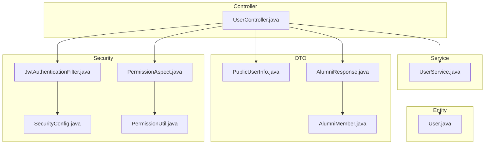
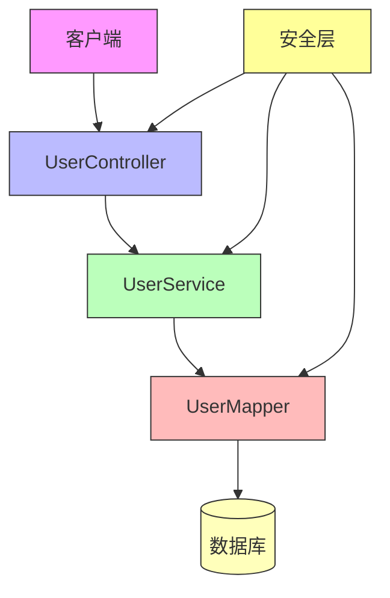
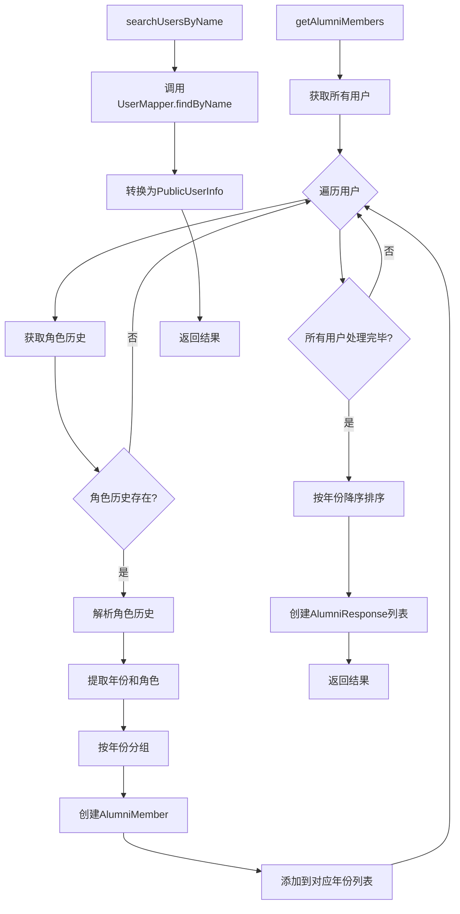
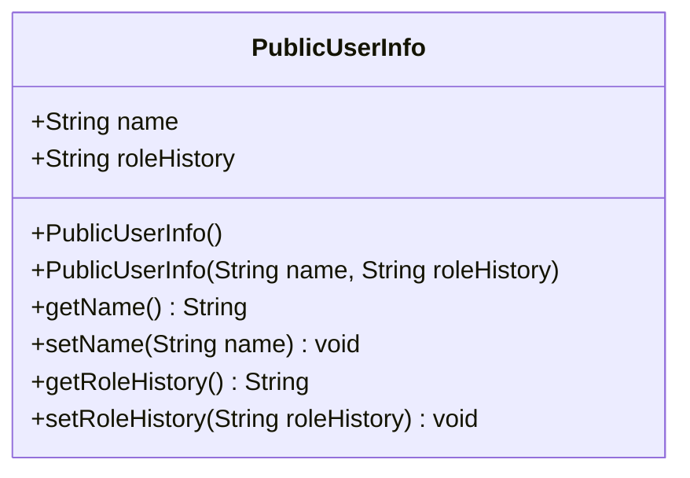
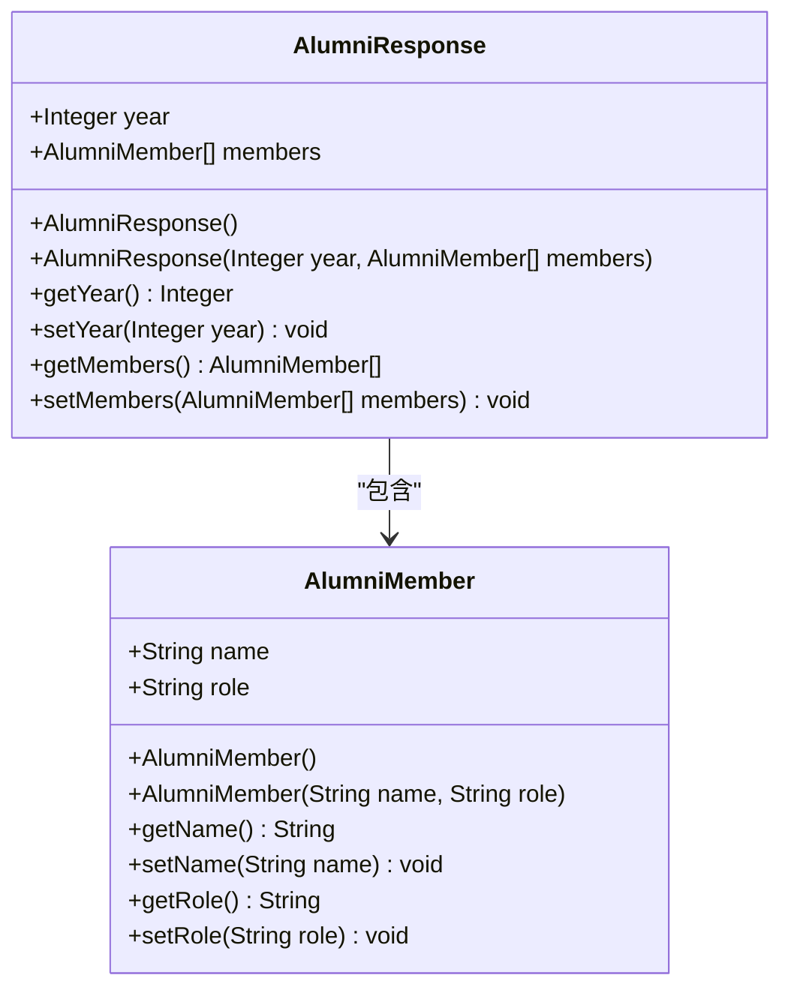
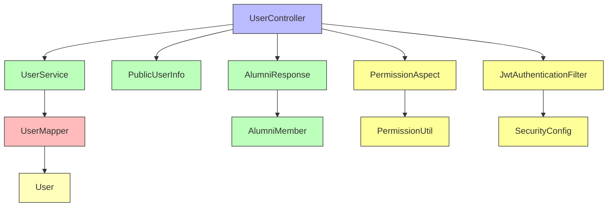

# 用户管理API

<cite>
**本文档中引用的文件**   
- [UserController.java](file://src/main/java/com/redmoon2333/controller/UserController.java)
- [UserService.java](file://src/main/java/com/redmoon2333/service/UserService.java)
- [PublicUserInfo.java](file://src/main/java/com/redmoon2333/dto/PublicUserInfo.java)
- [AlumniResponse.java](file://src/main/java/com/redmoon2333/dto/AlumniResponse.java)
- [AlumniMember.java](file://src/main/java/com/redmoon2333/dto/AlumniMember.java)
- [User.java](file://src/main/java/com/redmoon2333/entity/User.java)
- [JwtAuthenticationFilter.java](file://src/main/java/com/redmoon2333/config/JwtAuthenticationFilter.java)
- [SecurityConfig.java](file://src/main/java/com/redmoon2333/config/SecurityConfig.java)
- [PermissionAspect.java](file://src/main/java/com/redmoon2333/aspect/PermissionAspect.java)
- [PermissionUtil.java](file://src/main/java/com/redmoon2333/util/PermissionUtil.java)
</cite>

## 目录
1. [简介](#简介)
2. [项目结构](#项目结构)
3. [核心组件](#核心组件)
4. [架构概述](#架构概述)
5. [详细组件分析](#详细组件分析)
6. [依赖分析](#依赖分析)
7. [性能考虑](#性能考虑)
8. [故障排除指南](#故障排除指南)
9. [结论](#结论)

## 简介
本文档详细描述了人力资源管理系统中的用户管理API，重点介绍当前用户信息查询和往届成员信息管理功能。文档涵盖 `/api/users` 端点下的三个核心接口：获取当前用户信息（GET /current）、获取所有往届成员信息（GET /alumni）和根据ID获取往届成员信息（GET /alumni/{id}）。详细说明了这些接口的权限控制机制、数据传输对象（DTO）结构、用户信息脱敏策略以及常见使用场景。

## 项目结构
用户管理功能主要分布在控制器、服务、数据传输对象（DTO）和实体层中。控制器层负责处理HTTP请求，服务层实现业务逻辑，DTO层定义数据传输结构，实体层映射数据库表结构。



**Diagram sources**
- [UserController.java](file://src/main/java/com/redmoon2333/controller/UserController.java)
- [UserService.java](file://src/main/java/com/redmoon2333/service/UserService.java)
- [PublicUserInfo.java](file://src/main/java/com/redmoon2333/dto/PublicUserInfo.java)
- [AlumniResponse.java](file://src/main/java/com/redmoon2333/dto/AlumniResponse.java)
- [AlumniMember.java](file://src/main/java/com/redmoon2333/dto/AlumniMember.java)
- [User.java](file://src/main/java/com/redmoon2333/entity/User.java)
- [JwtAuthenticationFilter.java](file://src/main/java/com/redmoon2333/config/JwtAuthenticationFilter.java)
- [SecurityConfig.java](file://src/main/java/com/redmoon2333/config/SecurityConfig.java)
- [PermissionAspect.java](file://src/main/java/com/redmoon2333/aspect/PermissionAspect.java)
- [PermissionUtil.java](file://src/main/java/com/redmoon2333/util/PermissionUtil.java)

**Section sources**
- [UserController.java](file://src/main/java/com/redmoon2333/controller/UserController.java)
- [UserService.java](file://src/main/java/com/redmoon2333/service/UserService.java)
- [PublicUserInfo.java](file://src/main/java/com/redmoon2333/dto/PublicUserInfo.java)
- [AlumniResponse.java](file://src/main/java/com/redmoon2333/dto/AlumniResponse.java)
- [AlumniMember.java](file://src/main/java/com/redmoon2333/dto/AlumniMember.java)
- [User.java](file://src/main/java/com/redmoon2333/entity/User.java)

## 核心组件
用户管理API的核心组件包括UserController、UserService、PublicUserInfo、AlumniResponse和AlumniMember。UserController负责处理HTTP请求和响应，UserService实现业务逻辑，PublicUserInfo和AlumniResponse/AlumniMember定义了数据传输结构。

**Section sources**
- [UserController.java](file://src/main/java/com/redmoon2333/controller/UserController.java)
- [UserService.java](file://src/main/java/com/redmoon2333/service/UserService.java)
- [PublicUserInfo.java](file://src/main/java/com/redmoon2333/dto/PublicUserInfo.java)
- [AlumniResponse.java](file://src/main/java/com/redmoon2333/dto/AlumniResponse.java)
- [AlumniMember.java](file://src/main/java/com/redmoon2333/dto/AlumniMember.java)

## 架构概述
用户管理API采用典型的分层架构，包括控制器层、服务层、数据访问层和安全层。控制器层接收HTTP请求，通过服务层处理业务逻辑，数据访问层与数据库交互，安全层负责身份验证和权限控制。



**Diagram sources**
- [UserController.java](file://src/main/java/com/redmoon2333/controller/UserController.java)
- [UserService.java](file://src/main/java/com/redmoon2333/service/UserService.java)
- [UserMapper.java](file://src/main/java/com/redmoon2333/mapper/UserMapper.java)
- [User.java](file://src/main/java/com/redmoon2333/entity/User.java)

## 详细组件分析
### UserController分析
UserController是用户管理API的入口，负责处理所有与用户相关的HTTP请求。它通过@RequestMapping("/api/users")注解定义了基础路径，并提供了多个端点来满足不同的业务需求。

#### API端点分析
```mermaid
flowchart TD
A[客户端请求] --> B{请求路径}
B --> |/current| C[获取当前用户信息]
B --> |/alumni| D[获取往届成员信息]
B --> |/alumni/{id}| E[根据ID获取往届成员]
B --> |/search/name| F[根据姓名查找用户]
C --> G[验证JWT令牌]
G --> H[返回用户信息]
D --> I[验证部员权限]
I --> J[解析角色历史]
J --> K[按年份分组]
K --> L[返回分页结果]
E --> M[验证部员权限]
M --> N[查询指定ID成员]
N --> O[返回成员信息]
F --> P[验证JWT令牌]
P --> Q[执行姓名匹配]
Q --> R[返回匹配结果]
H --> Z[响应客户端]
L --> Z
O --> Z
R --> Z
```

**Diagram sources**
- [UserController.java](file://src/main/java/com/redmoon2333/controller/UserController.java)
- [UserService.java](file://src/main/java/com/redmoon2333/service/UserService.java)

### UserService分析
UserService是用户管理API的业务逻辑核心，负责实现所有与用户相关的业务功能。它通过@Autowired注入UserMapper来访问数据库，并提供了多个方法来处理不同的业务需求。

#### 业务逻辑分析


**Diagram sources**
- [UserService.java](file://src/main/java/com/redmoon2333/service/UserService.java)
- [UserMapper.java](file://src/main/java/com/redmoon2333/mapper/UserMapper.java)
- [PublicUserInfo.java](file://src/main/java/com/redmoon2333/dto/PublicUserInfo.java)

### DTO结构分析
用户管理API使用数据传输对象（DTO）来定义API的输入和输出结构，确保数据的安全性和一致性。

#### PublicUserInfo类图


**Diagram sources**
- [PublicUserInfo.java](file://src/main/java/com/redmoon2333/dto/PublicUserInfo.java)

#### AlumniResponse类图


**Diagram sources**
- [AlumniResponse.java](file://src/main/java/com/redmoon2333/dto/AlumniResponse.java)
- [AlumniMember.java](file://src/main/java/com/redmoon2333/dto/AlumniMember.java)

## 依赖分析
用户管理API的组件之间存在明确的依赖关系，形成了清晰的调用链。



**Diagram sources**
- [UserController.java](file://src/main/java/com/redmoon2333/controller/UserController.java)
- [UserService.java](file://src/main/java/com/redmoon2333/service/UserService.java)
- [UserMapper.java](file://src/main/java/com/redmoon2333/mapper/UserMapper.java)
- [User.java](file://src/main/java/com/redmoon2333/entity/User.java)
- [PublicUserInfo.java](file://src/main/java/com/redmoon2333/dto/PublicUserInfo.java)
- [AlumniResponse.java](file://src/main/java/com/redmoon2333/dto/AlumniResponse.java)
- [AlumniMember.java](file://src/main/java/com/redmoon2333/dto/AlumniMember.java)
- [JwtAuthenticationFilter.java](file://src/main/java/com/redmoon2333/config/JwtAuthenticationFilter.java)
- [SecurityConfig.java](file://src/main/java/com/redmoon2333/config/SecurityConfig.java)
- [PermissionAspect.java](file://src/main/java/com/redmoon2333/aspect/PermissionAspect.java)
- [PermissionUtil.java](file://src/main/java/com/redmoon2333/util/PermissionUtil.java)

## 性能考虑
用户管理API在设计时考虑了性能优化，特别是在处理大量用户数据时。

1. **缓存策略**：通过Redis缓存JWT令牌和用户信息，减少数据库查询次数。
2. **分页处理**：往届成员信息采用分页方式返回，避免一次性加载过多数据。
3. **索引优化**：在数据库中为常用查询字段（如用户名、姓名）建立索引。
4. **批量处理**：在服务层对用户数据进行批量处理，减少方法调用开销。
5. **连接池**：使用数据库连接池管理数据库连接，提高连接复用率。

## 故障排除指南
### 常见问题及解决方案
1. **无法获取当前用户信息**
   - 检查请求头中是否包含有效的JWT令牌
   - 确认令牌未过期
   - 验证用户是否已正确登录

2. **往届成员信息查询失败**
   - 检查用户是否具有部员及以上权限
   - 确认角色历史字段格式正确（如"2024级部长"）
   - 验证数据库连接是否正常

3. **JWT令牌验证失败**
   - 检查令牌格式是否正确（以"Bearer "开头）
   - 确认密钥配置正确
   - 验证Redis服务是否正常运行

4. **性能问题**
   - 检查Redis缓存是否正常工作
   - 监控数据库查询性能
   - 考虑增加服务器资源或优化查询语句

**Section sources**
- [JwtAuthenticationFilter.java](file://src/main/java/com/redmoon2333/config/JwtAuthenticationFilter.java)
- [SecurityConfig.java](file://src/main/java/com/redmoon2333/config/SecurityConfig.java)
- [PermissionUtil.java](file://src/main/java/com/redmoon2333/util/PermissionUtil.java)

## 结论
用户管理API提供了一套完整的用户信息管理功能，包括当前用户信息查询和往届成员信息管理。通过合理的分层架构和权限控制机制，确保了系统的安全性和可维护性。API设计考虑了性能优化和用户体验，能够满足人力资源管理系统的需求。建议在实际使用中注意权限控制和数据安全，定期监控系统性能，确保服务的稳定运行。