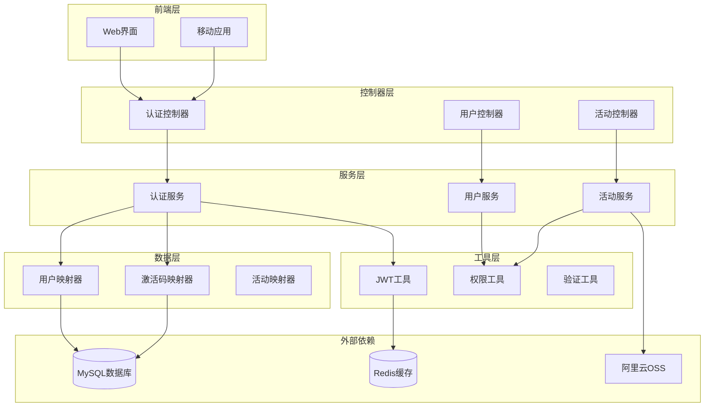
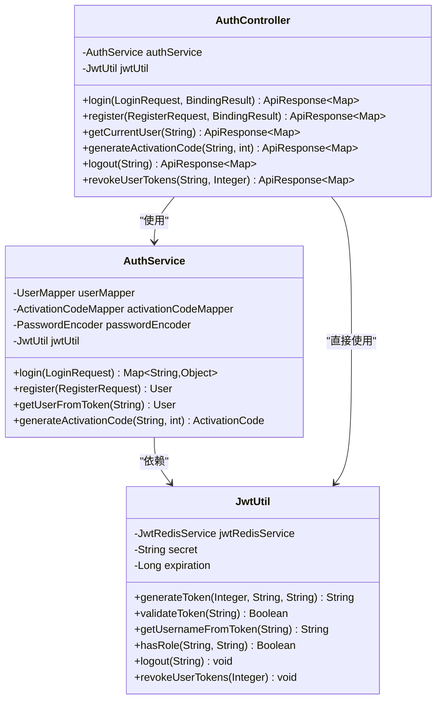
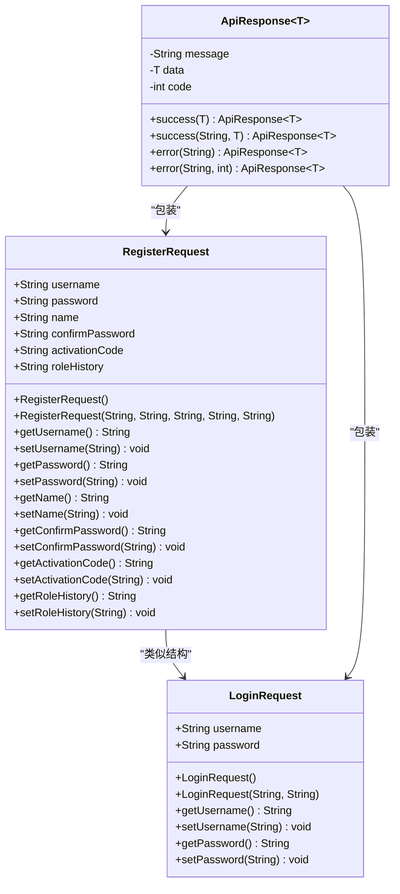
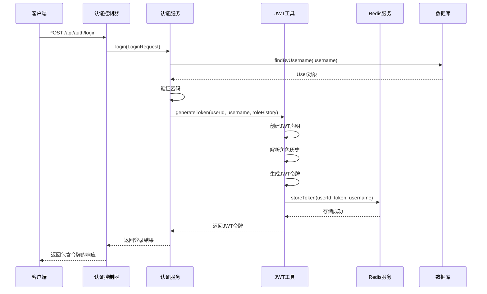
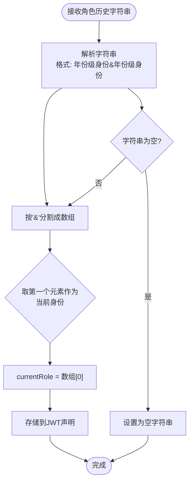
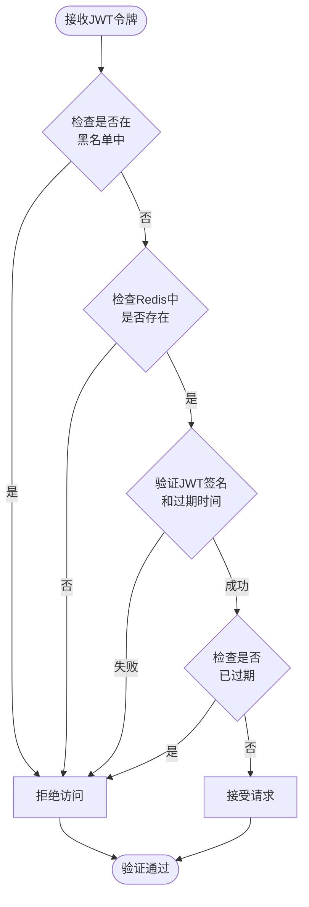
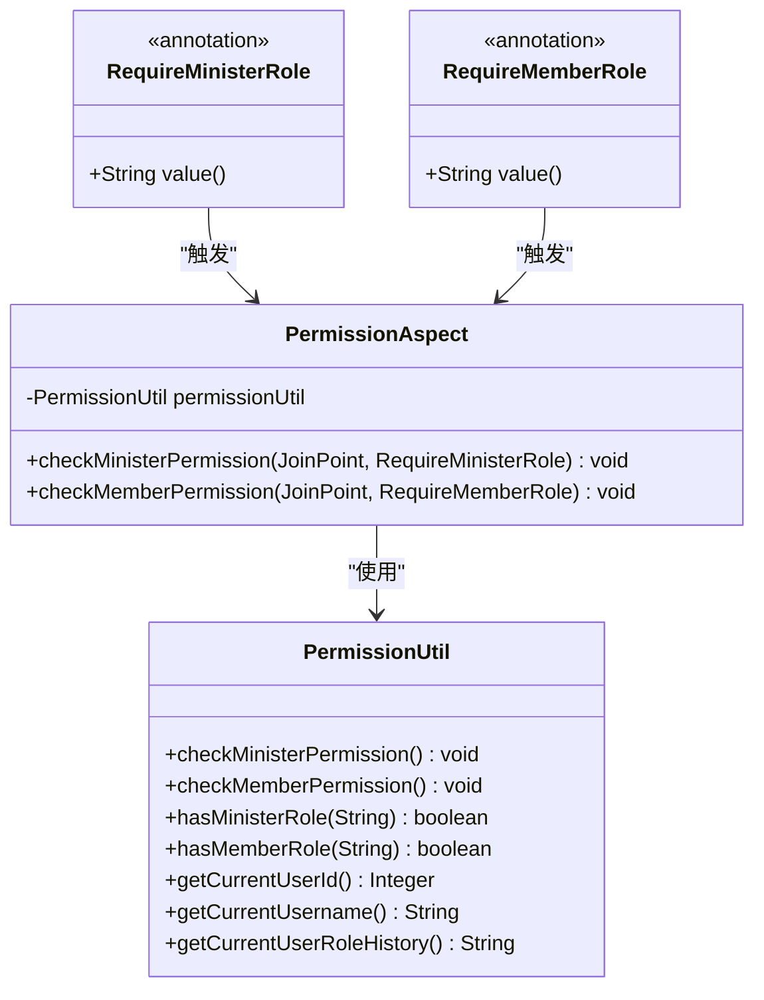
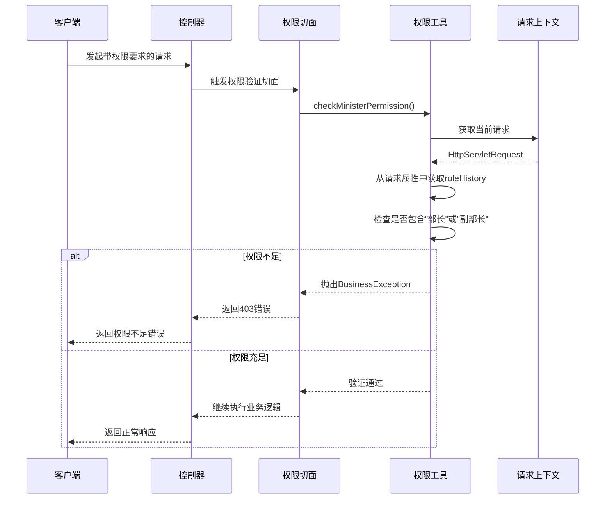
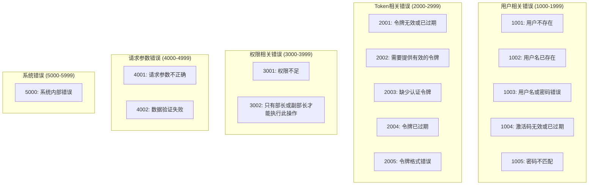
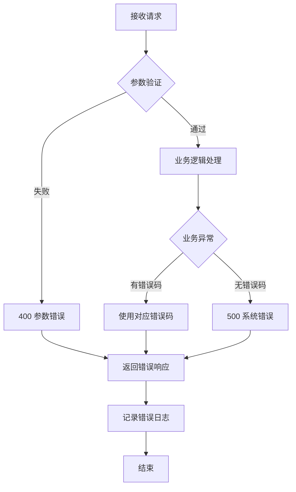

# 认证API文档

<cite>
**本文档中引用的文件**
- [AuthController.java](file://src/main/java/com/redmoon2333/controller/AuthController.java)
- [AuthService.java](file://src/main/java/com/redmoon2333/service/AuthService.java)
- [JwtUtil.java](file://src/main/java/com/redmoon2333/util/JwtUtil.java)
- [LoginRequest.java](file://src/main/java/com/redmoon2333/dto/LoginRequest.java)
- [RegisterRequest.java](file://src/main/java/com/redmoon2333/dto/RegisterRequest.java)
- [ApiResponse.java](file://src/main/java/com/redmoon2333/dto/ApiResponse.java)
- [RequireMinisterRole.java](file://src/main/java/com/redmoon2333/annotation/RequireMinisterRole.java)
- [PermissionAspect.java](file://src/main/java/com/redmoon2333/aspect/PermissionAspect.java)
- [PermissionUtil.java](file://src/main/java/com/redmoon2333/util/PermissionUtil.java)
- [application.yml](file://src/main/resources/application.yml)
- [ErrorCode.java](file://src/main/java/com/redmoon2333/exception/ErrorCode.java)
- [User.java](file://src/main/java/com/redmoon2333/entity/User.java)
</cite>

## 目录
1. [简介](#简介)
2. [项目架构概览](#项目架构概览)
3. [核心认证组件](#核心认证组件)
4. [认证API详细说明](#认证api详细说明)
5. [JWT令牌系统](#jwt令牌系统)
6. [权限控制系统](#权限控制系统)
7. [错误处理机制](#错误处理机制)
8. [安全最佳实践](#安全最佳实践)
9. [完整使用示例](#完整使用示例)
10. [故障排除指南](#故障排除指南)

## 简介

本系统是一个基于Spring Boot的人力资源管理系统，提供了完整的用户认证和授权功能。认证模块采用JWT（JSON Web Token）技术实现无状态认证，支持用户注册、登录、获取当前用户信息、生成激活码等功能。系统通过角色历史（roleHistory）概念实现了灵活的身份管理，并结合AOP切面编程实现了细粒度的权限控制。

## 项目架构概览



**图表来源**
- [AuthController.java](file://src/main/java/com/redmoon2333/controller/AuthController.java#L1-L236)
- [AuthService.java](file://src/main/java/com/redmoon2333/service/AuthService.java#L1-L199)
- [JwtUtil.java](file://src/main/java/com/redmoon2333/util/JwtUtil.java#L1-L309)

## 核心认证组件

### 认证控制器（AuthController）

认证控制器是整个认证系统的入口点，负责处理所有与用户认证相关的HTTP请求。它提供了四个主要的API端点：



**图表来源**
- [AuthController.java](file://src/main/java/com/redmoon2333/controller/AuthController.java#L20-L236)
- [AuthService.java](file://src/main/java/com/redmoon2333/service/AuthService.java#L20-L199)
- [JwtUtil.java](file://src/main/java/com/redmoon2333/util/JwtUtil.java#L15-L309)

### 数据传输对象（DTO）

系统使用专门的数据传输对象来确保请求和响应的数据结构清晰且类型安全：



**图表来源**
- [LoginRequest.java](file://src/main/java/com/redmoon2333/dto/LoginRequest.java#L1-L39)
- [RegisterRequest.java](file://src/main/java/com/redmoon2333/dto/RegisterRequest.java#L1-L98)
- [ApiResponse.java](file://src/main/java/com/redmoon2333/dto/ApiResponse.java#L1-L62)

**章节来源**
- [AuthController.java](file://src/main/java/com/redmoon2333/controller/AuthController.java#L1-L236)
- [AuthService.java](file://src/main/java/com/redmoon2333/service/AuthService.java#L1-L199)
- [LoginRequest.java](file://src/main/java/com/redmoon2333/dto/LoginRequest.java#L1-L39)
- [RegisterRequest.java](file://src/main/java/com/redmoon2333/dto/RegisterRequest.java#L1-L98)
- [ApiResponse.java](file://src/main/java/com/redmoon2333/dto/ApiResponse.java#L1-L62)

## 认证API详细说明

### 1. 用户登录接口

**端点**: `POST /api/auth/login`

**功能**: 验证用户凭据并返回JWT令牌

**请求头**:
- `Content-Type: application/json`

**请求体**:
```json
{
  "username": "string",
  "password": "string"
}
```

**响应格式**:
```json
{
  "message": "登录成功",
  "data": {
    "token": "eyJhbGciOiJIUzI1NiIsInR5cCI6IkpXVCJ9...",
    "user": {
      "userId": 1,
      "username": "admin",
      "name": "张三",
      "roleHistory": "2024级部长&2023级部员"
    },
    "tokenType": "Bearer"
  },
  "code": 200
}
```

**错误响应**:
- `400`: 参数验证失败
- `1003`: 用户名或密码错误

### 2. 用户注册接口

**端点**: `POST /api/auth/register`

**功能**: 创建新用户账户

**请求体**:
```json
{
  "username": "newuser",
  "password": "securepassword123",
  "confirmPassword": "securepassword123",
  "name": "李四",
  "activationCode": "ABCDEF1234567890",
  "roleHistory": "2024级部员"
}
```

**响应格式**:
```json
{
  "message": "注册成功",
  "data": {
    "userId": 2,
    "username": "newuser",
    "roleHistory": "2024级部员",
    "name": "李四",
    "message": "注册成功，请登录"
  },
  "code": 200
}
```

**关键特性**:
- **激活码验证**: 系统会验证提供的激活码是否有效且未被使用
- **角色历史**: 支持多阶段角色记录，格式为"年份级身份&年份级身份"
- **密码确认**: 确保用户输入的密码一致性

### 3. 获取当前用户信息接口

**端点**: `GET /api/auth/current-user`

**功能**: 通过JWT令牌获取当前登录用户的详细信息

**请求头**:
- `Authorization: Bearer <JWT_TOKEN>`

**响应格式**:
```json
{
  "message": "操作成功",
  "data": {
    "userId": 1,
    "username": "admin",
    "roleHistory": "2024级部长&2023级部员"
  },
  "code": 200
}
```

**安全要求**:
- 必须提供有效的Authorization头
- 令牌必须通过JWT验证

### 4. 生成激活码接口

**端点**: `POST /api/auth/generate-code`

**功能**: 为管理员生成新的用户激活码

**请求头**:
- `Authorization: Bearer <JWT_TOKEN>`

**查询参数**:
- `expireDays`: 激活码有效天数（默认30天）

**响应格式**:
```json
{
  "message": "激活码生成成功",
  "data": {
    "code": "ABCDEF1234567890",
    "expireTime": "2024-06-15 14:30:00",
    "message": "激活码生成成功"
  },
  "code": 200
}
```

**权限要求**:
- 只有具有"部长"角色的用户才能访问此接口
- 系统通过检查用户的角色历史字符串中是否包含"部长"关键字来验证权限

### 5. 用户退出登录接口

**端点**: `POST /api/auth/logout`

**功能**: 安全地注销当前用户

**请求头**:
- `Authorization: Bearer <JWT_TOKEN>`

**响应格式**:
```json
{
  "message": "退出登录成功",
  "data": {
    "message": "退出登录成功"
  },
  "code": 200
}
```

**安全机制**:
- 将JWT令牌加入黑名单，防止重复使用
- 实现真正的注销效果而非简单的客户端清除

### 6. 强制用户下线接口

**端点**: `POST /api/auth/revoke-user/{targetUserId}`

**功能**: 管理员强制指定用户下线

**请求头**:
- `Authorization: Bearer <JWT_TOKEN>`

**路径参数**:
- `targetUserId`: 目标用户的ID

**响应格式**:
```json
{
  "message": "操作成功",
  "data": {
    "targetUserId": 3,
    "message": "用户令牌已被撤销，用户已强制下线"
  },
  "code": 200
}
```

**权限要求**:
- 只有具有"部长"角色的用户才能执行此操作
- 系统会验证调用者的权限并拒绝非管理员请求

**章节来源**
- [AuthController.java](file://src/main/java/com/redmoon2333/controller/AuthController.java#L35-L236)
- [AuthService.java](file://src/main/java/com/redmoon2333/service/AuthService.java#L35-L199)

## JWT令牌系统

### 令牌生成流程



**图表来源**
- [AuthService.java](file://src/main/java/com/redmoon2333/service/AuthService.java#L35-L55)
- [JwtUtil.java](file://src/main/java/com/redmoon2333/util/JwtUtil.java#L35-L55)

### 令牌结构

JWT令牌包含以下声明：

```json
{
  "userId": 1,
  "username": "admin",
  "roleHistory": "2024级部长&2023级部员",
  "currentRole": "2024级部长",
  "sub": "admin",
  "iat": 1700000000,
  "exp": 1700007200
}
```

### 角色历史解析

系统通过角色历史字段实现灵活的身份管理：



**图表来源**
- [JwtUtil.java](file://src/main/java/com/redmoon2333/util/JwtUtil.java#L65-L75)

### 令牌验证机制



**图表来源**
- [JwtUtil.java](file://src/main/java/com/redmoon2333/util/JwtUtil.java#L160-L180)

**章节来源**
- [JwtUtil.java](file://src/main/java/com/redmoon2333/util/JwtUtil.java#L1-L309)
- [AuthService.java](file://src/main/java/com/redmoon2333/service/AuthService.java#L45-L55)

## 权限控制系统

### 权限注解系统

系统使用自定义注解实现声明式权限控制：



**图表来源**
- [RequireMinisterRole.java](file://src/main/java/com/redmoon2333/annotation/RequireMinisterRole.java#L1-L19)
- [PermissionAspect.java](file://src/main/java/com/redmoon2333/aspect/PermissionAspect.java#L1-L57)
- [PermissionUtil.java](file://src/main/java/com/redmoon2333/util/PermissionUtil.java#L1-L163)

### 权限验证流程



**图表来源**
- [PermissionAspect.java](file://src/main/java/com/redmoon2333/aspect/PermissionAspect.java#L25-L35)
- [PermissionUtil.java](file://src/main/java/com/redmoon2333/util/PermissionUtil.java#L25-L55)

### 角色权限矩阵

| 角色等级 | 部员权限 | 副部长权限 | 部长权限 |
|---------|---------|-----------|---------|
| 最低权限 | ✓ | ✗ | ✗ |
| 中等权限 | ✓ | ✓ | ✗ |
| 最高权限 | ✓ | ✓ | ✓ |

**章节来源**
- [PermissionAspect.java](file://src/main/java/com/redmoon2333/aspect/PermissionAspect.java#L1-L57)
- [PermissionUtil.java](file://src/main/java/com/redmoon2333/util/PermissionUtil.java#L1-L163)
- [RequireMinisterRole.java](file://src/main/java/com/redmoon2333/annotation/RequireMinisterRole.java#L1-L19)

## 错误处理机制

### 错误代码体系

系统定义了完整的错误代码体系，便于客户端理解和处理各种错误情况：



**图表来源**
- [ErrorCode.java](file://src/main/java/com/redmoon2333/exception/ErrorCode.java#L1-L77)

### 统一错误响应格式

所有API错误都遵循统一的响应格式：

```json
{
  "message": "用户名或密码错误",
  "data": null,
  "code": 1003
}
```

### 错误处理策略



**章节来源**
- [ErrorCode.java](file://src/main/java/com/redmoon2333/exception/ErrorCode.java#L1-L77)
- [AuthController.java](file://src/main/java/com/redmoon2333/controller/AuthController.java#L35-L236)

## 安全最佳实践

### 1. 密码安全

- **密码加密**: 使用Spring Security的PasswordEncoder对密码进行哈希加密
- **密码强度**: 要求密码至少6位，支持复杂密码策略
- **密码确认**: 注册时要求确认密码，避免输入错误

### 2. 令牌安全

- **HTTPS传输**: 所有敏感数据通过HTTPS传输
- **令牌过期**: 默认2小时过期，支持自动刷新
- **黑名单机制**: 支持主动注销和强制下线
- **Redis缓存**: 将令牌存储在Redis中，支持快速验证和黑名单检查

### 3. 输入验证

- **参数校验**: 使用Jakarta Bean Validation进行参数验证
- **SQL注入防护**: 使用MyBatis的参数化查询
- **XSS防护**: 后端严格验证和过滤输入数据

### 4. 权限控制

- **最小权限原则**: 每个接口都有明确的权限要求
- **角色继承**: 支持角色层次结构，部长包含副部长权限
- **动态权限**: 基于用户的角色历史动态计算权限

### 5. 日志监控

- **审计日志**: 记录所有重要操作
- **异常监控**: 自动捕获和记录异常
- **性能监控**: 监控API响应时间和成功率

## 完整使用示例

### 用户注册登录全流程

#### 步骤1: 生成激活码（管理员操作）

```bash
# 假设管理员已登录，获得JWT令牌
export ADMIN_TOKEN="eyJhbGciOiJIUzI1NiIsInR5cCI6IkpXVCJ9..."

# 生成新的激活码
curl -X POST "http://localhost:8080/api/auth/generate-code?expireDays=30" \
  -H "Authorization: Bearer $ADMIN_TOKEN" \
  -H "Content-Type: application/json" \
  -d "{}"

# 响应示例
{
  "message": "激活码生成成功",
  "data": {
    "code": "ABCDEF1234567890",
    "expireTime": "2024-06-15 14:30:00",
    "message": "激活码生成成功"
  },
  "code": 200
}
```

#### 步骤2: 用户注册

```bash
# 使用生成的激活码进行注册
curl -X POST "http://localhost:8080/api/auth/register" \
  -H "Content-Type: application/json" \
  -d '{
    "username": "newuser",
    "password": "securepassword123",
    "confirmPassword": "securepassword123",
    "name": "李四",
    "activationCode": "ABCDEF1234567890",
    "roleHistory": "2024级部员"
  }'

# 响应示例
{
  "message": "注册成功",
  "data": {
    "userId": 2,
    "username": "newuser",
    "roleHistory": "2024级部员",
    "name": "李四",
    "message": "注册成功，请登录"
  },
  "code": 200
}
```

#### 步骤3: 用户登录

```bash
# 使用注册的账号登录
curl -X POST "http://localhost:8080/api/auth/login" \
  -H "Content-Type: application/json" \
  -d '{
    "username": "newuser",
    "password": "securepassword123"
  }'

# 响应示例
{
  "message": "登录成功",
  "data": {
    "token": "eyJhbGciOiJIUzI1NiIsInR5cCI6IkpXVCJ9...",
    "user": {
      "userId": 2,
      "username": "newuser",
      "name": "李四",
      "roleHistory": "2024级部员"
    },
    "tokenType": "Bearer"
  },
  "code": 200
}
```

#### 步骤4: 获取当前用户信息

```bash
# 使用登录获得的令牌获取用户信息
export USER_TOKEN="eyJhbGciOiJIUzI1NiIsInR5cCI6IkpXVCJ9..."

curl -X GET "http://localhost:8080/api/auth/current-user" \
  -H "Authorization: Bearer $USER_TOKEN"

# 响应示例
{
  "message": "操作成功",
  "data": {
    "userId": 2,
    "username": "newuser",
    "roleHistory": "2024级部员"
  },
  "code": 200
}
```

#### 步骤5: 用户退出登录

```bash
# 安全退出登录
curl -X POST "http://localhost:8080/api/auth/logout" \
  -H "Authorization: Bearer $USER_TOKEN"

# 响应示例
{
  "message": "退出登录成功",
  "data": {
    "message": "退出登录成功"
  },
  "code": 200
}
```

### 角色历史示例

#### 部长用户的角色历史

```json
{
  "userId": 1,
  "username": "admin",
  "roleHistory": "2024级部长&2023级副部长&2022级部员"
}
```

在这种情况下：
- **currentRole**: "2024级部长"（取第一个身份）
- **权限范围**: 包含部长、副部长、部员的所有权限

#### 副部长用户的角色历史

```json
{
  "userId": 2,
  "username": "viceadmin",
  "roleHistory": "2024级副部长&2023级部员"
}
```

权限范围: 包含副部长、部员的权限

#### 部员用户的角色历史

```json
{
  "userId": 3,
  "username": "member",
  "roleHistory": "2024级部员"
}
```

权限范围: 仅包含部员权限

## 故障排除指南

### 常见问题及解决方案

#### 1. 登录失败

**问题症状**: 返回"用户名或密码错误"（错误码1003）

**可能原因**:
- 用户名或密码输入错误
- 用户不存在
- 密码加密不匹配

**解决步骤**:
```bash
# 1. 检查用户名和密码是否正确
# 2. 验证用户是否已注册
curl -X GET "http://localhost:8080/api/user/check-username?username=testuser"

# 3. 检查密码加密方式
# 确认使用了正确的PasswordEncoder
```

#### 2. 令牌验证失败

**问题症状**: 返回"令牌无效或已过期"（错误码2001）

**可能原因**:
- 令牌已过期
- 令牌被加入黑名单
- 令牌格式错误

**解决步骤**:
```bash
# 1. 检查令牌是否过期
curl -X GET "http://localhost:8080/api/auth/current-user" \
  -H "Authorization: Bearer $TOKEN"

# 2. 如果令牌过期，尝试刷新
# 3. 如果令牌被加入黑名单，重新登录
```

#### 3. 权限不足

**问题症状**: 返回"权限不足"（错误码3001）或"只有部长或副部长才能执行此操作"（错误码3002）

**可能原因**:
- 用户角色不符合要求
- 角色历史格式错误
- 权限注解配置错误

**解决步骤**:
```bash
# 1. 检查用户的角色历史
curl -X GET "http://localhost:8080/api/auth/current-user" \
  -H "Authorization: Bearer $TOKEN"

# 2. 确认角色历史格式正确
# 格式: "年份级身份&年份级身份"

# 3. 检查权限注解是否正确配置
```

#### 4. 激活码无效

**问题症状**: 返回"激活码无效或已过期"（错误码1004）

**可能原因**:
- 激活码不存在
- 激活码已被使用
- 激活码已过期

**解决步骤**:
```bash
# 1. 检查激活码状态
# 2. 重新生成激活码（需要管理员权限）
# 3. 确保激活码在有效期内
```

### 调试技巧

#### 1. 启用详细日志

在`application.yml`中启用调试日志：

```yaml
logging:
  level:
    com.redmoon2333.service.AuthService: DEBUG
    com.redmoon2333.util.JwtUtil: DEBUG
    com.redmoon2333.aspect.PermissionAspect: DEBUG
```

#### 2. 检查Redis状态

```bash
# 检查Redis连接状态
redis-cli ping

# 检查JWT令牌存储
redis-cli keys "jwt:*"

# 检查黑名单
redis-cli keys "blacklist:*"
```

#### 3. 验证数据库连接

```sql
-- 检查用户表
SELECT * FROM user WHERE username = 'testuser';

-- 检查激活码表
SELECT * FROM activation_code WHERE code = 'ABCDEF1234567890';
```

**章节来源**
- [AuthController.java](file://src/main/java/com/redmoon2333/controller/AuthController.java#L35-L236)
- [AuthService.java](file://src/main/java/com/redmoon2333/service/AuthService.java#L35-L199)
- [JwtUtil.java](file://src/main/java/com/redmoon2333/util/JwtUtil.java#L160-L180)
- [PermissionUtil.java](file://src/main/java/com/redmoon2333/util/PermissionUtil.java#L25-L55)