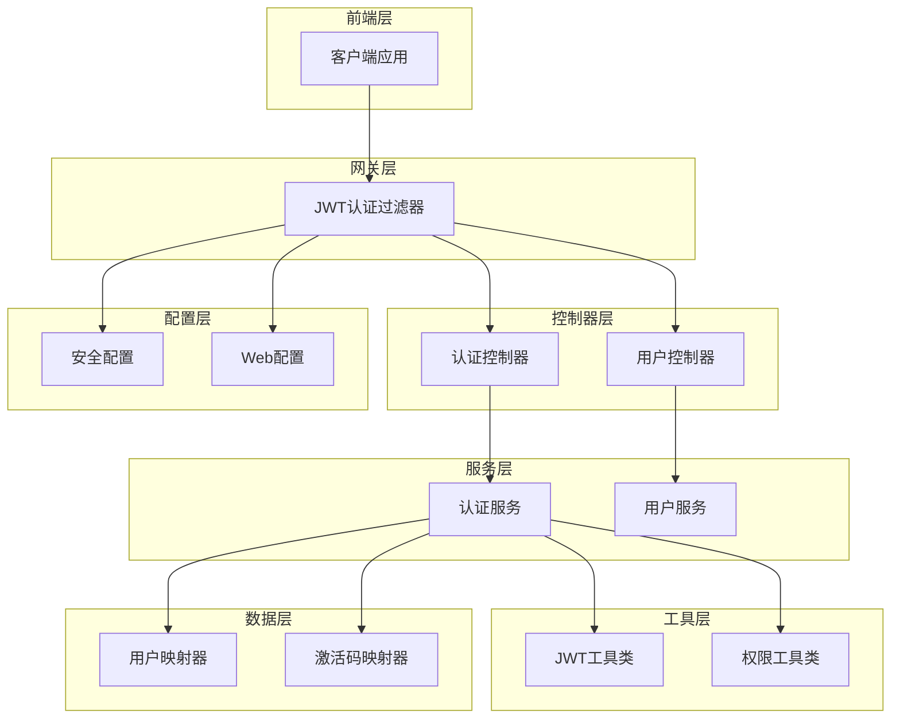
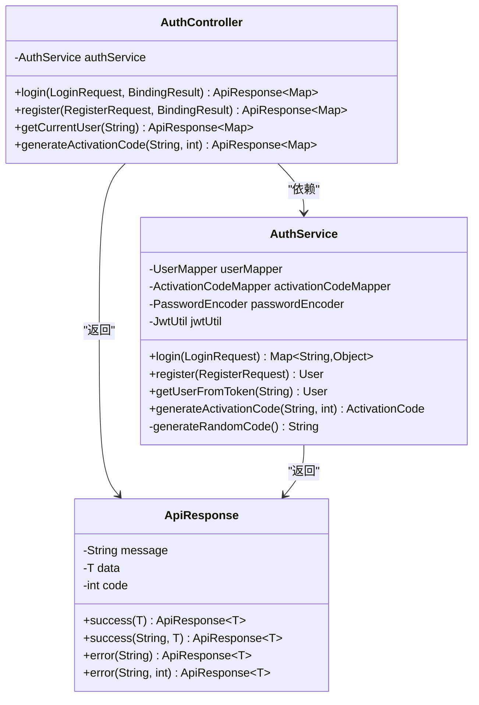
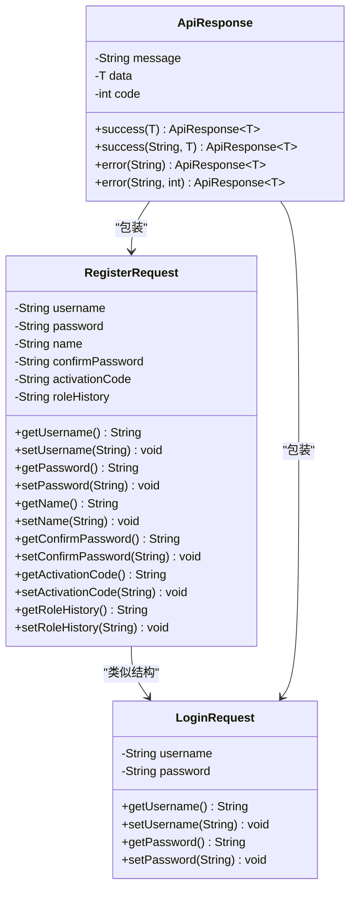
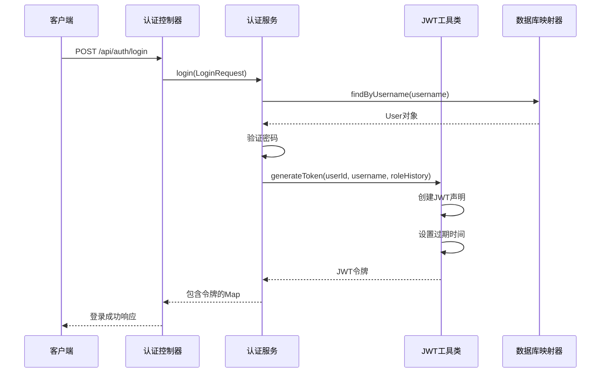
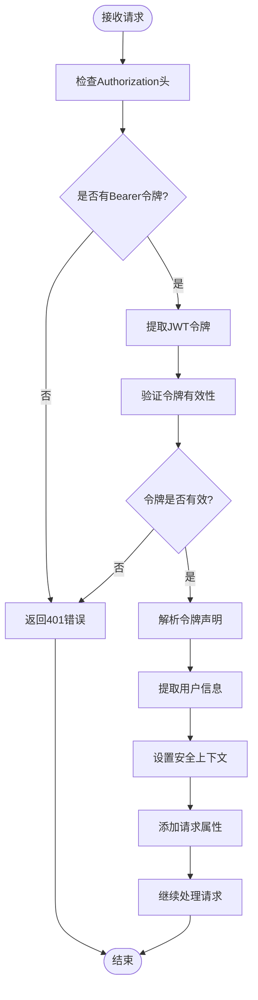
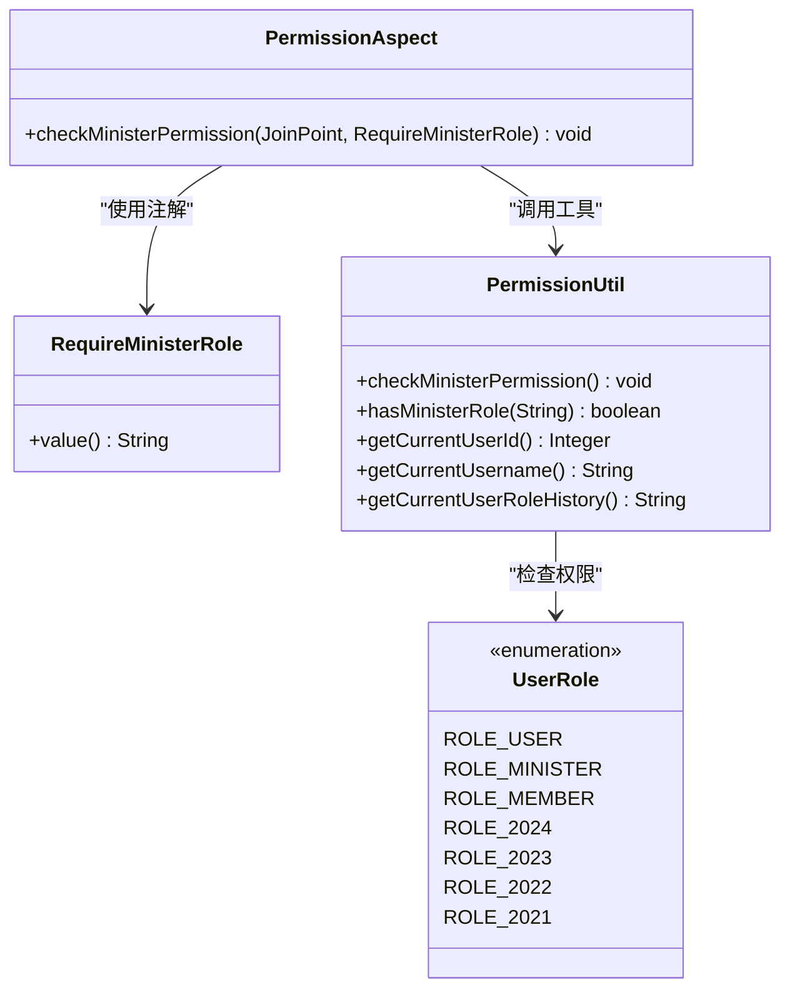
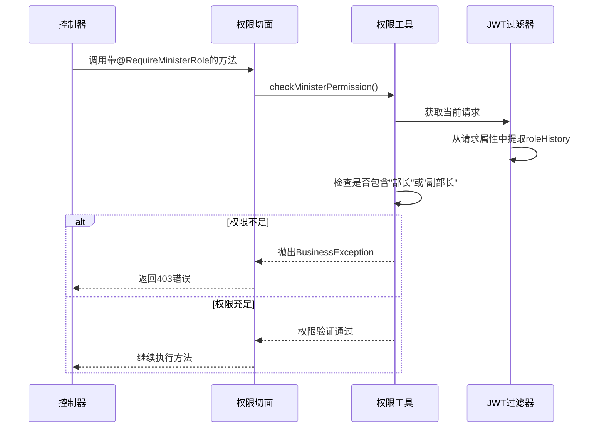
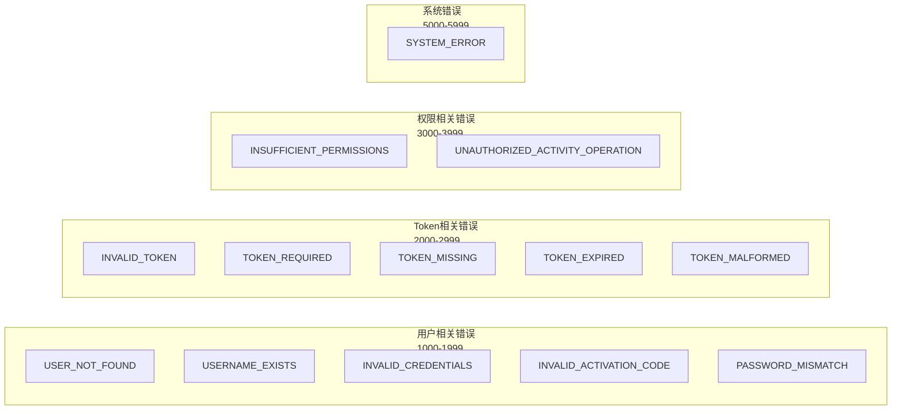
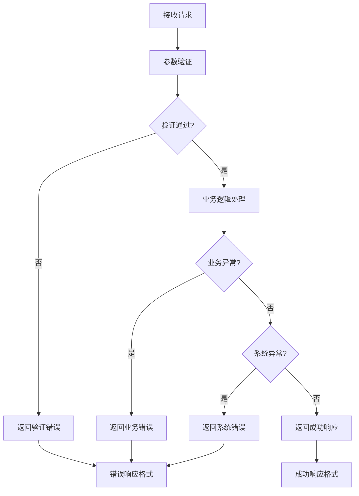

# 认证相关API文档

<cite>
**本文档引用的文件**
- [AuthController.java](file://src/main/java/com/redmoon2333/controller/AuthController.java)
- [AuthService.java](file://src/main/java/com/redmoon2333/service/AuthService.java)
- [LoginRequest.java](file://src/main/java/com/redmoon2333/dto/LoginRequest.java)
- [RegisterRequest.java](file://src/main/java/com/redmoon2333/dto/RegisterRequest.java)
- [ApiResponse.java](file://src/main/java/com/redmoon2333/dto/ApiResponse.java)
- [JwtUtil.java](file://src/main/java/com/redmoon2333/util/JwtUtil.java)
- [RequireMinisterRole.java](file://src/main/java/com/redmoon2333/annotation/RequireMinisterRole.java)
- [PermissionAspect.java](file://src/main/java/com/redmoon2333/aspect/PermissionAspect.java)
- [PermissionUtil.java](file://src/main/java/com/redmoon2333/util/PermissionUtil.java)
- [JwtAuthenticationFilter.java](file://src/main/java/com/redmoon2333/config/JwtAuthenticationFilter.java)
- [ErrorCode.java](file://src/main/java/com/redmoon2333/exception/ErrorCode.java)
</cite>

## 目录
1. [简介](#简介)
2. [项目架构概览](#项目架构概览)
3. [核心组件分析](#核心组件分析)
4. [认证API详细说明](#认证api详细说明)
5. [JWT令牌机制](#jwt令牌机制)
6. [权限控制机制](#权限控制机制)
7. [错误处理体系](#错误处理体系)
8. [常见问题排查](#常见问题排查)
9. [总结](#总结)

## 简介

本文档详细介绍了人力资源管理系统中的认证相关API，涵盖了用户登录、注册、获取当前用户信息以及管理员生成激活码等核心功能。系统采用JWT（JSON Web Token）技术实现无状态认证，并结合Spring AOP实现细粒度的权限控制。

## 项目架构概览



**图表来源**
- [AuthController.java](file://src/main/java/com/redmoon2333/controller/AuthController.java#L1-L153)
- [AuthService.java](file://src/main/java/com/redmoon2333/service/AuthService.java#L1-L199)
- [JwtAuthenticationFilter.java](file://src/main/java/com/redmoon2333/config/JwtAuthenticationFilter.java#L1-L132)

## 核心组件分析

### 认证控制器 (AuthController)

认证控制器是整个认证系统的入口点，负责处理所有与认证相关的HTTP请求。它提供了四个主要的API端点：



**图表来源**
- [AuthController.java](file://src/main/java/com/redmoon2333/controller/AuthController.java#L20-L153)
- [AuthService.java](file://src/main/java/com/redmoon2333/service/AuthService.java#L20-L199)
- [ApiResponse.java](file://src/main/java/com/redmoon2333/dto/ApiResponse.java#L1-L62)

**章节来源**
- [AuthController.java](file://src/main/java/com/redmoon2333/controller/AuthController.java#L1-L153)
- [AuthService.java](file://src/main/java/com/redmoon2333/service/AuthService.java#L1-L199)

### 数据传输对象 (DTO)

系统定义了专门的数据传输对象来确保请求和响应的一致性：



**图表来源**
- [LoginRequest.java](file://src/main/java/com/redmoon2333/dto/LoginRequest.java#L1-L39)
- [RegisterRequest.java](file://src/main/java/com/redmoon2333/dto/RegisterRequest.java#L1-L98)
- [ApiResponse.java](file://src/main/java/com/redmoon2333/dto/ApiResponse.java#L1-L62)

**章节来源**
- [LoginRequest.java](file://src/main/java/com/redmoon2333/dto/LoginRequest.java#L1-L39)
- [RegisterRequest.java](file://src/main/java/com/redmoon2333/dto/RegisterRequest.java#L1-L98)
- [ApiResponse.java](file://src/main/java/com/redmoon2333/dto/ApiResponse.java#L1-L62)

## 认证API详细说明

### 1. 用户登录接口

**端点**: `POST /api/auth/login`

**功能**: 验证用户凭据并返回JWT令牌

**请求头**:
- `Content-Type: application/json`

**请求体**:
```json
{
  "username": "string",
  "password": "string"
}
```

**响应格式**:
```json
{
  "message": "登录成功",
  "data": {
    "token": "eyJhbGciOiJIUzI1NiJ9...",
    "user": {
      "userId": 1,
      "username": "admin",
      "roleHistory": "2024级部长&2023级部员",
      "name": "张三"
    },
    "tokenType": "Bearer"
  },
  "code": 200
}
```

**错误响应**:
```json
{
  "message": "用户名或密码错误",
  "data": null,
  "code": 1003
}
```

**章节来源**
- [AuthController.java](file://src/main/java/com/redmoon2333/controller/AuthController.java#L30-L50)
- [AuthService.java](file://src/main/java/com/redmoon2333/service/AuthService.java#L35-L55)

### 2. 用户注册接口

**端点**: `POST /api/auth/register`

**功能**: 使用激活码创建新用户账户

**请求体**:
```json
{
  "username": "newuser",
  "password": "password123",
  "name": "新用户",
  "confirmPassword": "password123",
  "activationCode": "ABCDEF1234567890",
  "roleHistory": "2024级部员"
}
```

**响应格式**:
```json
{
  "message": "注册成功",
  "data": {
    "userId": 2,
    "username": "newuser",
    "roleHistory": "2024级部员",
    "name": "新用户",
    "message": "注册成功，请登录"
  },
  "code": 200
}
```

**章节来源**
- [AuthController.java](file://src/main/java/com/redmoon2333/controller/AuthController.java#L52-L85)
- [AuthService.java](file://src/main/java/com/redmoon2333/service/AuthService.java#L57-L105)

### 3. 获取当前用户信息接口

**端点**: `GET /api/auth/current-user`

**功能**: 通过JWT令牌获取当前登录用户的详细信息

**请求头**:
- `Authorization: Bearer <JWT_TOKEN>`

**响应格式**:
```json
{
  "message": "操作成功",
  "data": {
    "userId": 1,
    "username": "admin",
    "roleHistory": "2024级部长&2023级部员"
  },
  "code": 200
}
```

**章节来源**
- [AuthController.java](file://src/main/java/com/redmoon2333/controller/AuthController.java#L87-L110)
- [AuthService.java](file://src/main/java/com/redmoon2333/service/AuthService.java#L107-L115)

### 4. 管理员生成激活码接口

**端点**: `POST /api/auth/generate-code`

**功能**: 为部长或副部长生成新的用户激活码

**请求头**:
- `Authorization: Bearer <JWT_TOKEN>`

**请求参数**:
- `expireDays`: 激活码有效期（天），默认30天

**响应格式**:
```json
{
  "message": "激活码生成成功",
  "data": {
    "code": "ABCDEF1234567890",
    "expireTime": "2024-01-15T10:30:00",
    "message": "激活码生成成功"
  },
  "code": 200
}
```

**权限要求**: 需要部长或副部长角色

**章节来源**
- [AuthController.java](file://src/main/java/com/redmoon2333/controller/AuthController.java#L112-L140)
- [AuthService.java](file://src/main/java/com/redmoon2333/service/AuthService.java#L117-L165)

## JWT令牌机制

### 令牌生成流程



**图表来源**
- [AuthService.java](file://src/main/java/com/redmoon2333/service/AuthService.java#L35-L55)
- [JwtUtil.java](file://src/main/java/com/redmoon2333/util/JwtUtil.java#L35-L55)

### 令牌结构

JWT令牌包含以下声明：

```json
{
  "userId": 1,
  "username": "admin",
  "roleHistory": "2024级部长&2023级部员",
  "currentRole": "2024级部长",
  "sub": "admin",
  "iat": 1705123456,
  "exp": 1705127056
}
```

### 令牌验证流程



**图表来源**
- [JwtAuthenticationFilter.java](file://src/main/java/com/redmoon2333/config/JwtAuthenticationFilter.java#L30-L85)
- [JwtUtil.java](file://src/main/java/com/redmoon2333/util/JwtUtil.java#L180-L200)

**章节来源**
- [JwtUtil.java](file://src/main/java/com/redmoon2333/util/JwtUtil.java#L1-L229)
- [JwtAuthenticationFilter.java](file://src/main/java/com/redmoon2333/config/JwtAuthenticationFilter.java#L1-L132)

## 权限控制机制

### 角色权限模型

系统支持多层级的角色权限控制：



**图表来源**
- [PermissionAspect.java](file://src/main/java/com/redmoon2333/aspect/PermissionAspect.java#L1-L40)
- [RequireMinisterRole.java](file://src/main/java/com/redmoon2333/annotation/RequireMinisterRole.java#L1-L19)
- [PermissionUtil.java](file://src/main/java/com/redmoon2333/util/PermissionUtil.java#L1-L117)

### 权限验证流程



**图表来源**
- [PermissionAspect.java](file://src/main/java/com/redmoon2333/aspect/PermissionAspect.java#L25-L35)
- [PermissionUtil.java](file://src/main/java/com/redmoon2333/util/PermissionUtil.java#L25-L50)

**章节来源**
- [PermissionAspect.java](file://src/main/java/com/redmoon2333/aspect/PermissionAspect.java#L1-L40)
- [PermissionUtil.java](file://src/main/java/com/redmoon2333/util/PermissionUtil.java#L1-L117)
- [RequireMinisterRole.java](file://src/main/java/com/redmoon2333/annotation/RequireMinisterRole.java#L1-L19)

## 错误处理体系

### 错误码定义

系统定义了完整的错误码体系，便于统一处理各种异常情况：



**图表来源**
- [ErrorCode.java](file://src/main/java/com/redmoon2333/exception/ErrorCode.java#L1-L55)

### 异常处理流程



**图表来源**
- [AuthController.java](file://src/main/java/com/redmoon2333/controller/AuthController.java#L30-L140)
- [ApiResponse.java](file://src/main/java/com/redmoon2333/dto/ApiResponse.java#L15-L40)

**章节来源**
- [ErrorCode.java](file://src/main/java/com/redmoon2333/exception/ErrorCode.java#L1-L55)

## 常见问题排查

### 登录失败问题

**可能原因**:
1. 用户名或密码错误
2. 用户不存在
3. 密码加密不匹配

**解决方案**:
```bash
# 检查用户名是否存在
curl -X GET "http://localhost:8080/api/users/check-username?username=admin"

# 检查密码加密方式
# 系统使用BCrypt加密，确保密码正确
```

### 令牌过期问题

**可能原因**:
1. JWT令牌过期
2. 服务器时间不同步

**解决方案**:
```javascript
// 自动刷新令牌
const refreshAccessToken = async () => {
  const refreshToken = localStorage.getItem('refreshToken');
  try {
    const response = await axios.post('/api/auth/refresh-token', { refreshToken });
    localStorage.setItem('accessToken', response.data.token);
  } catch (error) {
    console.error('令牌刷新失败:', error);
    // 清除本地存储的令牌
    localStorage.removeItem('accessToken');
    localStorage.removeItem('refreshToken');
  }
};
```

### 权限不足问题

**可能原因**:
1. 用户角色不符合要求
2. 身份历史信息缺失
3. 权限检查逻辑错误

**解决方案**:
```java
// 检查用户是否具有部长权限
public boolean isMinister(String roleHistory) {
    if (roleHistory == null || roleHistory.trim().isEmpty()) {
        return false;
    }
    return roleHistory.contains("部长") || roleHistory.contains("副部长");
}
```

### 激活码生成失败

**可能原因**:
1. 激活码已过期或被使用
2. 数据库连接问题
3. 事务处理异常

**解决方案**:
```sql
-- 检查激活码状态
SELECT * FROM activation_code 
WHERE code = 'ABCDEF1234567890' 
AND status = '未使用' 
AND expire_time > NOW();
```

## 总结

本认证系统采用了现代化的JWT技术实现无状态认证，结合Spring AOP实现了细粒度的权限控制。系统的主要特点包括：

1. **安全性**: 使用JWT令牌确保认证的安全性，支持令牌刷新和自动过期
2. **灵活性**: 支持多种角色权限，可根据身份历史动态分配权限
3. **可扩展性**: 通过注解和切面设计，易于添加新的权限控制规则
4. **易维护性**: 统一的错误处理机制和清晰的API设计

系统适用于需要严格权限控制的人力资源管理场景，能够有效保护敏感数据和关键业务操作。通过合理的错误处理和权限控制，确保了系统的稳定性和安全性。