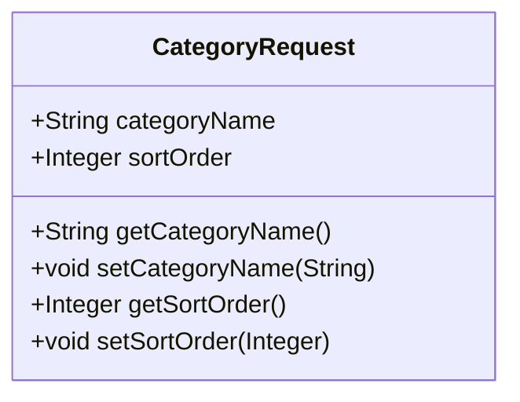
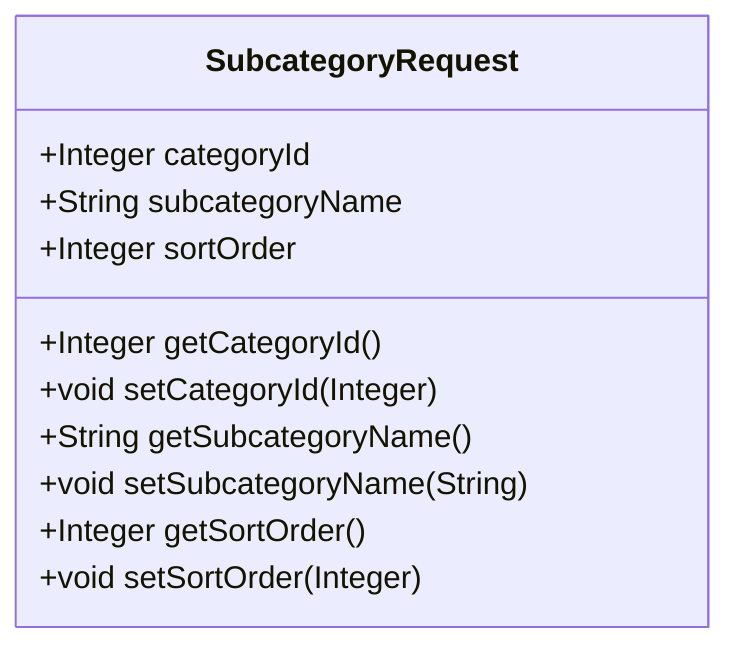
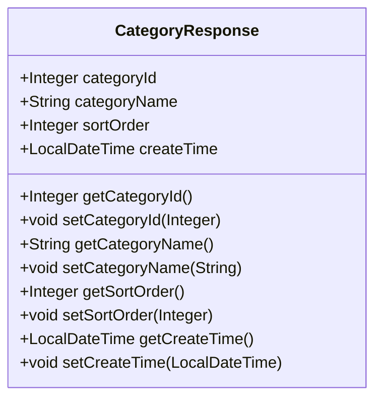
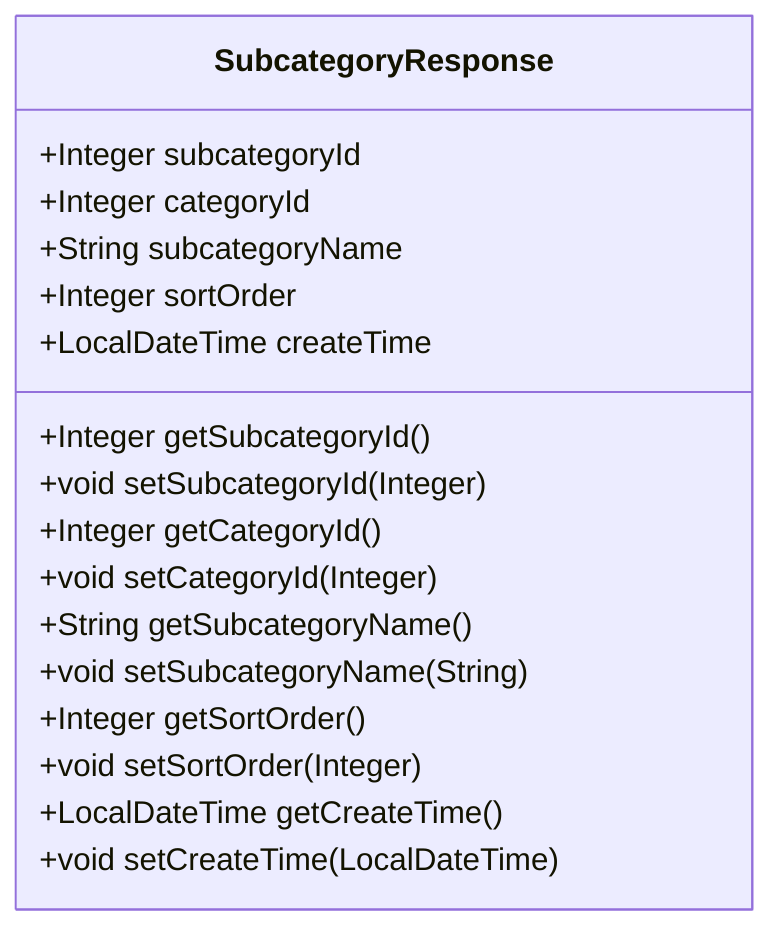
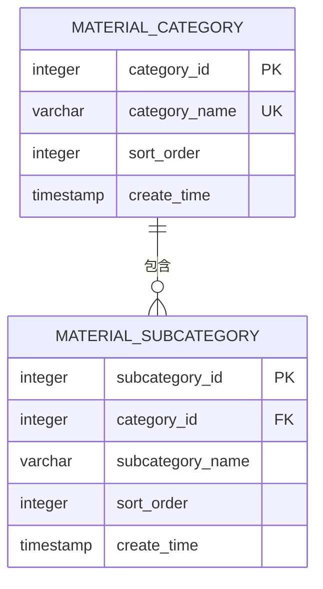
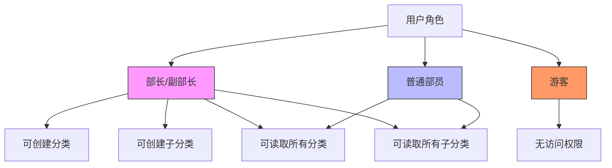
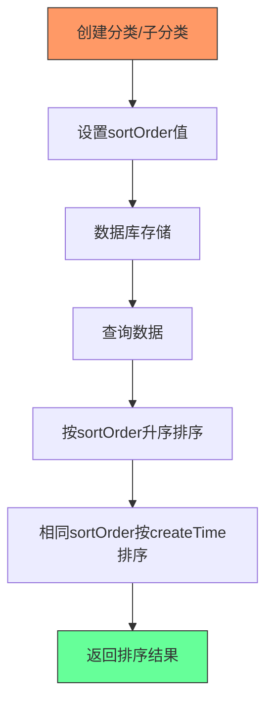
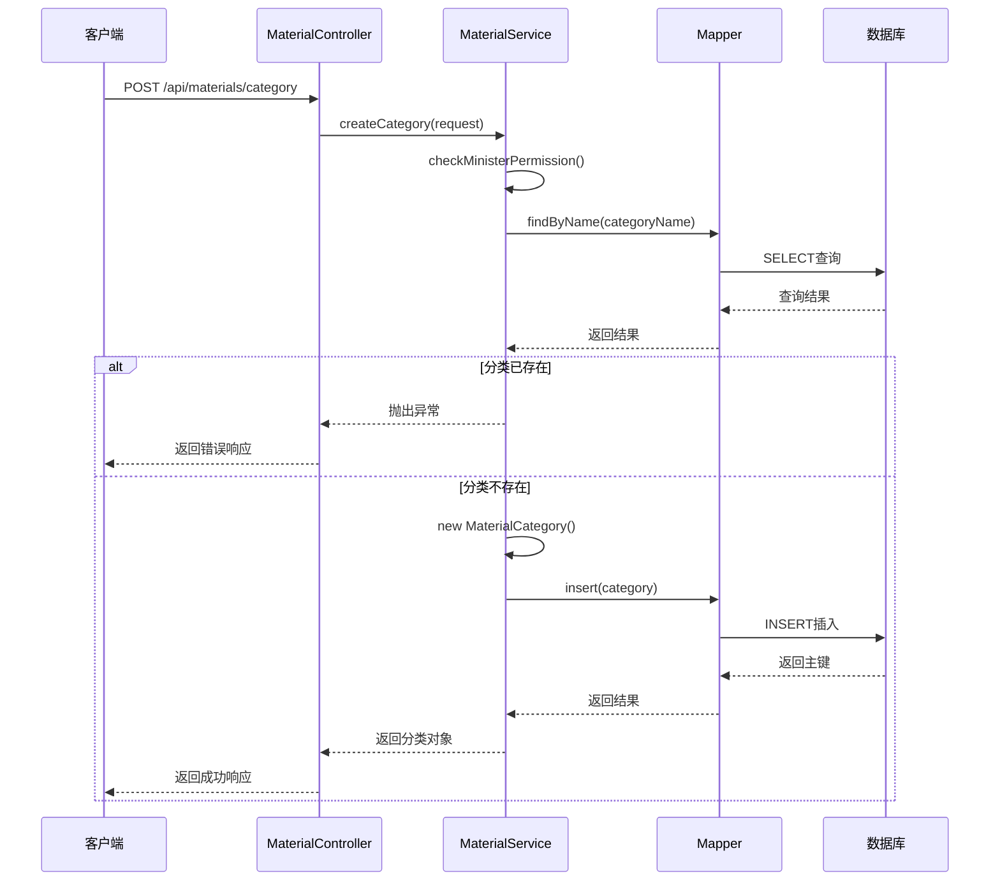

# 分类管理

<cite>
**本文档引用文件**   
- [MaterialController.java](file://src/main/java/com/redmoon2333/controller/MaterialController.java)
- [MaterialService.java](file://src/main/java/com/redmoon2333/service/MaterialService.java)
- [MaterialCategory.java](file://src/main/java/com/redmoon2333/entity/MaterialCategory.java)
- [MaterialSubcategory.java](file://src/main/java/com/redmoon2333/entity/MaterialSubcategory.java)
- [CategoryRequest.java](file://src/main/java/com/redmoon2333/dto/CategoryRequest.java)
- [SubcategoryRequest.java](file://src/main/java/com/redmoon2333/dto/SubcategoryRequest.java)
- [CategoryResponse.java](file://src/main/java/com/redmoon2333/dto/CategoryResponse.java)
- [SubcategoryResponse.java](file://src/main/java/com/redmoon2333/dto/SubcategoryResponse.java)
- [MaterialCategoryMapper.java](file://src/main/java/com/redmoon2333/mapper/MaterialCategoryMapper.java)
- [MaterialSubcategoryMapper.java](file://src/main/java/com/redmoon2333/mapper/MaterialSubcategoryMapper.java)
- [MaterialCategoryMapper.xml](file://src/main/resources/mapper/MaterialCategoryMapper.xml)
- [MaterialSubcategoryMapper.xml](file://src/main/resources/mapper/MaterialSubcategoryMapper.xml)
- [RequireMinisterRole.java](file://src/main/java/com/redmoon2333/annotation/RequireMinisterRole.java)
- [RequireMemberRole.java](file://src/main/java/com/redmoon2333/annotation/RequireMemberRole.java)
- [PermissionAspect.java](file://src/main/java/com/redmoon2333/aspect/PermissionAspect.java)
- [PermissionUtil.java](file://src/main/java/com/redmoon2333/util/PermissionUtil.java)
</cite>

## 目录
1. [简介](#简介)
2. [核心接口说明](#核心接口说明)
3. [数据结构定义](#数据结构定义)
4. [层级关系模型](#层级关系模型)
5. [权限控制机制](#权限控制机制)
6. [排序机制说明](#排序机制说明)
7. [持久化流程](#持久化流程)
8. [异常处理机制](#异常处理机制)
9. [总结](#总结)

## 简介

本系统提供了一套完整的资料分类管理API，支持分类与子分类的创建、查询功能。系统采用层级化的分类结构，通过分类与子分类的两级结构实现资料的有序组织。所有分类相关的操作都受到严格的权限控制，确保数据安全。

## 核心接口说明

### 创建分类（POST /api/materials/category）

用于创建新的资料分类，该接口需要提供分类名称和排序序号。

**权限要求**：仅部长角色可调用  
**请求参数**：
- `categoryName`：分类名称（必填）
- `sortOrder`：排序序号（可选，默认为0）

**Section sources**
- [MaterialController.java](file://src/main/java/com/redmoon2333/controller/MaterialController.java#L250-L262)
- [MaterialService.java](file://src/main/java/com/redmoon2333/service/MaterialService.java#L270-L284)

### 获取所有分类（GET /api/materials/categories）

获取系统中所有的分类信息，返回按排序序号排列的分类列表。

**权限要求**：部员及以上角色可访问  
**返回数据**：分类对象列表，包含分类ID、名称、排序序号和创建时间

**Section sources**
- [MaterialController.java](file://src/main/java/com/redmoon2333/controller/MaterialController.java#L264-L276)
- [MaterialService.java](file://src/main/java/com/redmoon2333/service/MaterialService.java#L305-L315)

### 创建子分类（POST /api/materials/subcategory）

在指定分类下创建子分类，实现资料的精细化管理。

**权限要求**：仅部长角色可调用  
**请求参数**：
- `categoryId`：所属分类ID（必填）
- `subcategoryName`：子分类名称（必填）
- `sortOrder`：排序序号（可选，默认为0）

**Section sources**
- [MaterialController.java](file://src/main/java/com/redmoon2333/controller/MaterialController.java#L278-L290)
- [MaterialService.java](file://src/main/java/com/redmoon2333/service/MaterialService.java#L286-L303)

### 获取某分类下的所有子分类（GET /api/materials/category/{categoryId}/subcategories）

根据分类ID获取该分类下的所有子分类列表。

**权限要求**：部员及以上角色可访问  
**路径参数**：`categoryId` - 分类ID  
**返回数据**：子分类对象列表，包含子分类ID、所属分类ID、名称、排序序号和创建时间

**Section sources**
- [MaterialController.java](file://src/main/java/com/redmoon2333/controller/MaterialController.java#L292-L303)
- [MaterialService.java](file://src/main/java/com/redmoon2333/service/MaterialService.java#L317-L327)

## 数据结构定义

### CategoryRequest（分类请求对象）

用于创建分类时的请求数据结构。



**Diagram sources**
- [CategoryRequest.java](file://src/main/java/com/redmoon2333/dto/CategoryRequest.java#L0-L22)

### SubcategoryRequest（子分类请求对象）

用于创建子分类时的请求数据结构。



**Diagram sources**
- [SubcategoryRequest.java](file://src/main/java/com/redmoon2333/dto/SubcategoryRequest.java#L0-L31)

### CategoryResponse（分类响应对象）

返回分类信息的响应数据结构。



**Diagram sources**
- [CategoryResponse.java](file://src/main/java/com/redmoon2333/dto/CategoryResponse.java#L0-L53)

### SubcategoryResponse（子分类响应对象）

返回子分类信息的响应数据结构。



**Diagram sources**
- [SubcategoryResponse.java](file://src/main/java/com/redmoon2333/dto/SubcategoryResponse.java#L0-L55)

## 层级关系模型

系统采用两级分类结构：分类（Category）和子分类（Subcategory）。这种层级关系模型实现了资料的有序组织和管理。



**Diagram sources**
- [MaterialCategory.java](file://src/main/java/com/redmoon2333/entity/MaterialCategory.java#L0-L79)
- [MaterialSubcategory.java](file://src/main/java/com/redmoon2333/entity/MaterialSubcategory.java#L0-L92)

**模型特点**：
1. **一对多关系**：一个分类可以包含多个子分类
2. **外键约束**：子分类通过`categoryId`字段关联到父分类
3. **命名规范**：分类表名为`material_category`，子分类表名为`material_subcategory`
4. **时间记录**：每个分类和子分类都记录创建时间

## 权限控制机制

系统实现了基于角色的细粒度权限控制，不同接口有不同的权限要求。



**Diagram sources**
- [RequireMinisterRole.java](file://src/main/java/com/redmoon2333/annotation/RequireMinisterRole.java#L0-L18)
- [RequireMemberRole.java](file://src/main/java/com/redmoon2333/annotation/RequireMemberRole.java#L0-L18)
- [PermissionAspect.java](file://src/main/java/com/redmoon2333/aspect/PermissionAspect.java#L0-L56)

**权限差异说明**：
- **部长专属操作**：创建分类和创建子分类接口使用`@RequireMinisterRole`注解保护，仅部长和副部长角色可调用
- **成员可读操作**：获取所有分类和获取子分类接口使用`@RequireMemberRole`注解保护，所有部员及以上角色均可访问
- **实现机制**：通过AOP切面`PermissionAspect`拦截带有权限注解的方法，调用`PermissionUtil`进行实际的权限验证

## 排序机制说明

系统通过`sortOrder`字段实现前端的自定义排序功能，为用户提供灵活的展示顺序控制。



**Diagram sources**
- [MaterialCategoryMapper.xml](file://src/main/resources/mapper/MaterialCategoryMapper.xml#L30-L35)
- [MaterialSubcategoryMapper.xml](file://src/main/resources/mapper/MaterialSubcategoryMapper.xml#L15-L22)

**排序规则**：
1. **主要排序**：首先按`sortOrder`字段升序排列
2. **次要排序**：当`sortOrder`相同时，按`createTime`创建时间升序排列
3. **默认值**：`sortOrder`默认值为0，新创建的分类/子分类若未指定排序序号，则排在前面
4. **灵活性**：管理员可通过调整`sortOrder`值来改变前端展示顺序，无需修改其他数据

## 持久化流程

分类数据的持久化流程涉及控制器、服务层和数据访问层的协同工作。



**Diagram sources**
- [MaterialController.java](file://src/main/java/com/redmoon2333/controller/MaterialController.java#L250-L262)
- [MaterialService.java](file://src/main/java/com/redmoon2333/service/MaterialService.java#L270-L284)
- [MaterialCategoryMapper.java](file://src/main/java/com/redmoon2333/mapper/MaterialCategoryMapper.java#L0-L40)
- [MaterialCategoryMapper.xml](file://src/main/resources/mapper/MaterialCategoryMapper.xml#L50-L59)

**流程步骤**：
1. 客户端发送创建分类请求到`MaterialController`
2. 控制器调用`MaterialService`的`createCategory`方法
3. 服务层首先检查用户权限是否为部长角色
4. 然后通过`MaterialCategoryMapper`查询数据库，检查同名分类是否已存在
5. 如果分类不存在，则创建新的`MaterialCategory`实体对象
6. 调用`insert`方法将数据插入数据库
7. 返回创建成功的分类对象给控制器
8. 控制器封装成API响应返回给客户端

## 异常处理机制

系统实现了完善的异常处理机制，确保数据完整性和用户体验。

```mermaid
flowchart TD
A[创建分类] --> B{分类名是否存在}
B --> |是| C[抛出"该分类已存在"异常]
B --> |否| D[继续创建流程]
E[创建子分类] --> F{分类ID是否存在}
F --> |否| G[抛出"指定的分类不存在"异常]
F --> |是| H{同名子分类是否存在}
H --> |是| I[抛出"已存在同名子分类"异常]
H --> |否| J[继续创建流程]
K[全局异常处理] --> L[GlobalExceptionHandler]
L --> M[记录错误日志]
M --> N[返回标准化错误响应]
style C fill:#f66,stroke:#333
style G fill:#f66,stroke:#333
style I fill:#f66,stroke:#333
style N fill:#6af,stroke:#333
```

**Diagram sources**
- [MaterialService.java](file://src/main/java/com/redmoon2333/service/MaterialService.java#L275-L280)
- [MaterialService.java](file://src/main/java/com/redmoon2333/service/MaterialService.java#L292-L297)
- [MaterialService.java](file://src/main/java/com/redmoon2333/service/MaterialService.java#L299-L301)
- [GlobalExceptionHandler.java](file://src/main/java/com/redmoon2333/exception/GlobalExceptionHandler.java)

**异常类型**：
1. **分类名重复**：在创建分类时，如果数据库中已存在同名分类，系统会抛出"该分类已存在"的异常
2. **分类不存在**：在创建子分类时，如果指定的`categoryId`在数据库中不存在，系统会抛出"指定的分类不存在"的异常
3. **子分类名重复**：在创建子分类时，如果在同一分类下已存在同名字分类，系统会抛出"该分类下已存在同名子分类"的异常
4. **处理机制**：所有异常都会被`GlobalExceptionHandler`捕获，记录详细的错误日志，并返回标准化的错误响应给客户端

## 总结

本分类管理系统提供了一套完整的资料分类管理解决方案，具有以下特点：

1. **清晰的层级结构**：采用分类-子分类的两级结构，便于资料的组织和管理
2. **严格的权限控制**：通过`@RequireMinisterRole`和`@RequireMemberRole`注解实现细粒度的权限管理
3. **灵活的排序机制**：通过`sortOrder`字段支持前端自定义排序，提升用户体验
4. **完善的异常处理**：对各种异常情况进行了充分的处理，确保系统稳定性和数据完整性
5. **规范的API设计**：遵循RESTful原则，提供清晰的接口定义和数据结构

系统通过控制器、服务层和数据访问层的分层架构，实现了业务逻辑与数据访问的分离，保证了代码的可维护性和可扩展性。同时，利用MyBatis的XML映射文件，实现了SQL语句与Java代码的解耦，便于SQL的优化和管理。