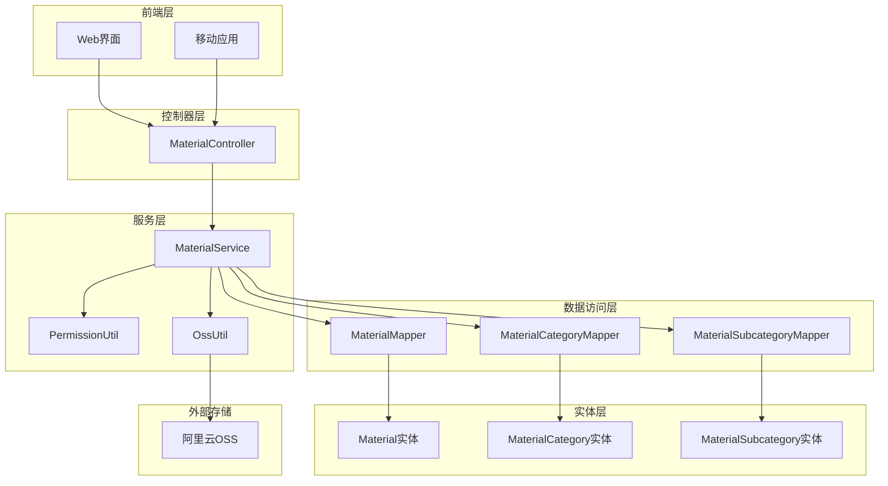
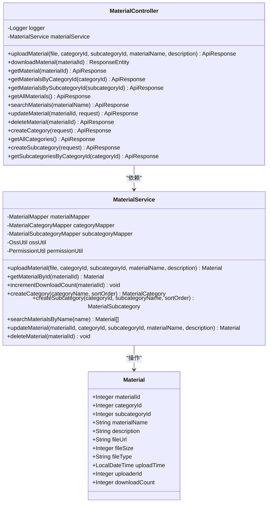
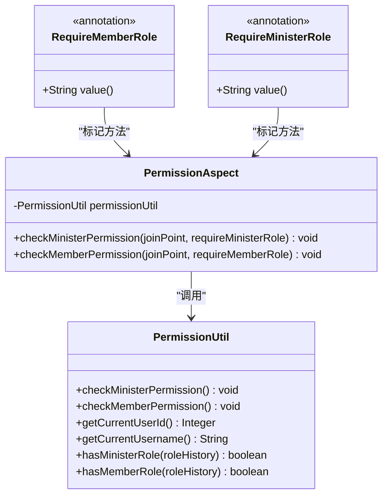
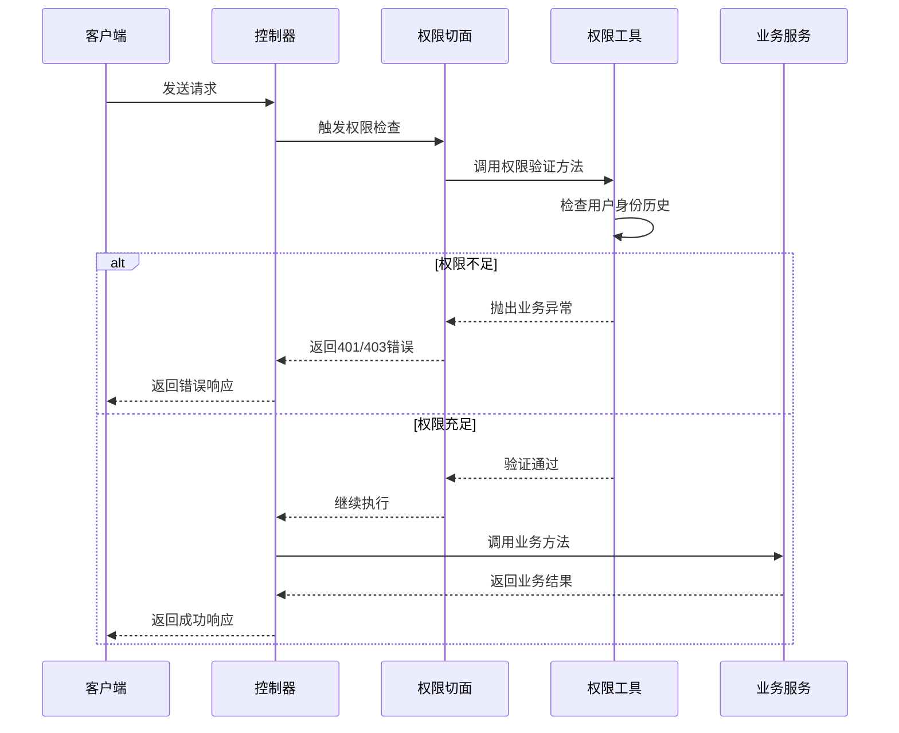
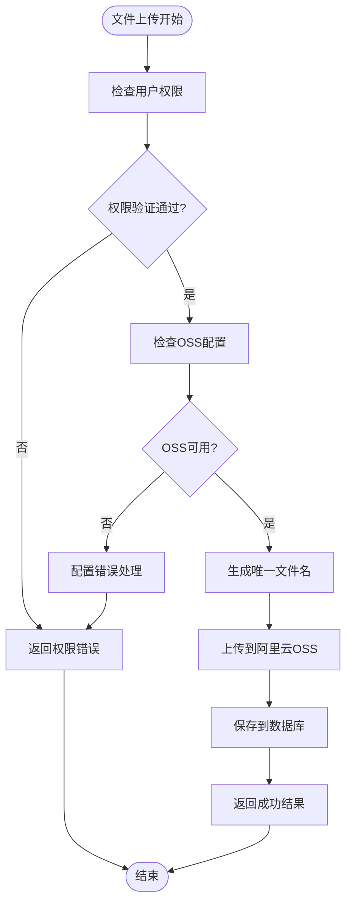
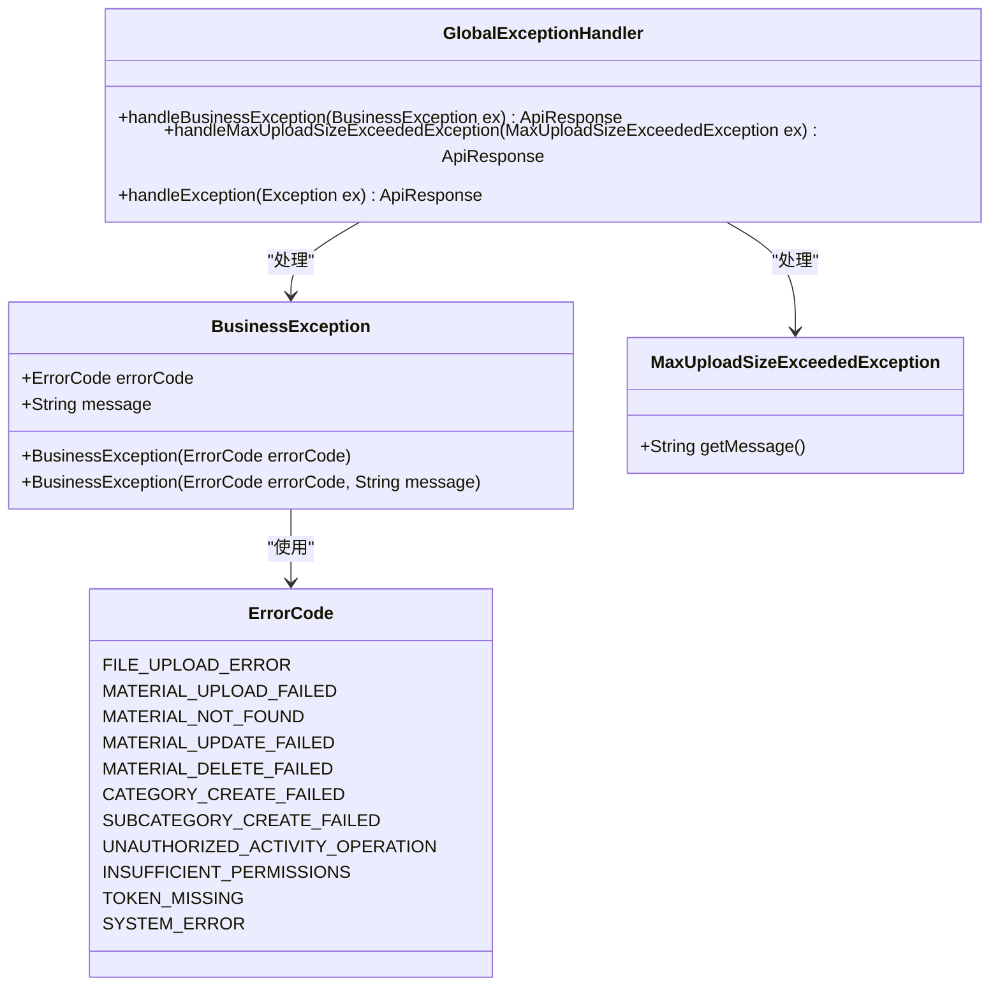

# 资料操作API文档

<cite>
**本文档引用的文件**
- [MaterialController.java](file://src/main/java/com/redmoon2333/controller/MaterialController.java)
- [MaterialService.java](file://src/main/java/com/redmoon2333/service/MaterialService.java)
- [MaterialRequest.java](file://src/main/java/com/redmoon2333/dto/MaterialRequest.java)
- [MaterialResponse.java](file://src/main/java/com/redmoon2333/dto/MaterialResponse.java)
- [Material.java](file://src/main/java/com/redmoon2333/entity/Material.java)
- [MaterialMapper.java](file://src/main/java/com/redmoon2333/mapper/MaterialMapper.java)
- [OssUtil.java](file://src/main/java/com/redmoon2333/util/OssUtil.java)
- [RequireMemberRole.java](file://src/main/java/com/redmoon2333/annotation/RequireMemberRole.java)
- [PermissionAspect.java](file://src/main/java/com/redmoon2333/aspect/PermissionAspect.java)
- [PermissionUtil.java](file://src/main/java/com/redmoon2333/util/PermissionUtil.java)
</cite>

## 目录
1. [简介](#简介)
2. [项目架构概览](#项目架构概览)
3. [核心组件分析](#核心组件分析)
4. [API接口详解](#api接口详解)
5. [权限控制系统](#权限控制系统)
6. [文件上传与存储](#文件上传与存储)
7. [异常处理机制](#异常处理机制)
8. [性能优化建议](#性能优化建议)
9. [故障排除指南](#故障排除指南)
10. [总结](#总结)

## 简介

本文档详细介绍了人力资源管理系统中的资料操作API，涵盖了文件上传、下载、查询、更新和删除等核心功能。该系统采用Spring Boot框架构建，支持阿里云OSS存储，具备完善的权限控制和异常处理机制。

系统主要功能包括：
- 资料文件的上传和管理
- 多维度的资料查询（按ID、分类、子分类、名称搜索）
- 资料信息的增删改查操作
- 中文文件名支持的下载功能
- 基于角色的权限控制

## 项目架构概览



**图表来源**
- [MaterialController.java](file://src/main/java/com/redmoon2333/controller/MaterialController.java#L1-L328)
- [MaterialService.java](file://src/main/java/com/redmoon2333/service/MaterialService.java#L1-L459)

## 核心组件分析

### MaterialController 控制器

MaterialController是资料操作的核心控制器，负责处理所有HTTP请求并与MaterialService交互。



**图表来源**
- [MaterialController.java](file://src/main/java/com/redmoon2333/controller/MaterialController.java#L30-L328)
- [MaterialService.java](file://src/main/java/com/redmoon2333/service/MaterialService.java#L20-L459)
- [Material.java](file://src/main/java/com/redmoon2333/entity/Material.java#L1-L164)

**章节来源**
- [MaterialController.java](file://src/main/java/com/redmoon2333/controller/MaterialController.java#L1-L328)
- [MaterialService.java](file://src/main/java/com/redmoon2333/service/MaterialService.java#L1-L459)

## API接口详解

### 1. 上传资料文件（POST /api/materials/upload）

**接口描述**：上传资料文件，支持MultipartFile格式，最大文件大小限制为100MB。

**请求参数**：
- `file` (MultipartFile): 上传的文件
- `categoryId` (Integer): 分类ID
- `subcategoryId` (Integer): 子分类ID
- `materialName` (String): 资料名称
- `description` (String, 可选): 资料描述

**响应格式**：
```json
{
  "code": 200,
  "message": "成功",
  "data": {
    "materialId": 1,
    "categoryId": 1,
    "subcategoryId": 2,
    "materialName": "年度报告.pdf",
    "description": "2023年公司年度报告",
    "fileUrl": "https://bucket.oss-cn-hangzhou.aliyuncs.com/uploads/materials/uuid.pdf",
    "fileSize": 2048576,
    "fileType": ".pdf",
    "uploadTime": "2023-12-01T10:30:00",
    "uploaderId": 101,
    "downloadCount": 0
  }
}
```

**权限要求**：RequireMemberRole("上传内部资料")

**实现流程**：
1. 验证用户权限（部员及以上）
2. 检查OSS配置是否可用
3. 生成唯一文件名
4. 上传文件到阿里云OSS
5. 保存资料信息到数据库
6. 返回上传结果

### 2. 下载资料文件（GET /api/materials/download/{materialId}）

**接口描述**：下载指定ID的资料文件，返回文件流并设置Content-Disposition响应头以支持中文文件名下载。

**请求参数**：
- `materialId` (Integer): 资料ID（路径参数）

**响应格式**：
- Content-Type: application/octet-stream 或具体文件类型
- Content-Disposition: attachment; filename*=UTF-8''%E5%B9%B4%E5%BA%A6%E6%8A%A5%E5%91%8A.pdf
- 文件流数据

**实现细节**：
```java
// 中文文件名编码示例
String fileName = "年度报告.pdf";
String encodedFileName = URLEncoder.encode(fileName, StandardCharsets.UTF_8);
HttpHeaders headers = new HttpHeaders();
headers.add(HttpHeaders.CONTENT_DISPOSITION, "attachment; filename*=UTF-8''" + encodedFileName);
```

**权限要求**：RequireMemberRole("下载内部资料")

**章节来源**
- [MaterialController.java](file://src/main/java/com/redmoon2333/controller/MaterialController.java#L50-L95)

### 3. 获取资料详情（GET /api/materials/{materialId}）

**接口描述**：获取指定ID的资料详细信息。

**请求参数**：
- `materialId` (Integer): 资料ID（路径参数）

**响应格式**：
```json
{
  "code": 200,
  "message": "成功",
  "data": {
    "materialId": 1,
    "categoryId": 1,
    "subcategoryId": 2,
    "materialName": "年度报告.pdf",
    "description": "2023年公司年度报告",
    "fileUrl": "https://bucket.oss-cn-hangzhou.aliyuncs.com/uploads/materials/uuid.pdf",
    "fileSize": 2048576,
    "fileType": ".pdf",
    "uploadTime": "2023-12-01T10:30:00",
    "uploaderId": 101,
    "downloadCount": 5,
    "categoryName": "财务报告",
    "subcategoryName": "年度报告"
  }
}
```

**权限要求**：RequireMemberRole("查看内部资料详情")

### 4. 获取所有资料（GET /api/materials）

**接口描述**：获取所有资料的列表。

**响应格式**：
```json
{
  "code": 200,
  "message": "成功",
  "data": [
    {
      "materialId": 1,
      "categoryId": 1,
      "subcategoryId": 2,
      "materialName": "年度报告.pdf",
      "description": "2023年公司年度报告",
      "fileUrl": "https://bucket.oss-cn-hangzhou.aliyuncs.com/uploads/materials/uuid.pdf",
      "fileSize": 2048576,
      "fileType": ".pdf",
      "uploadTime": "2023-12-01T10:30:00",
      "uploaderId": 101,
      "downloadCount": 5
    }
  ]
}
```

**权限要求**：RequireMemberRole("查看所有内部资料")

### 5. 按分类查询资料（GET /api/materials/category/{categoryId}）

**接口描述**：根据分类ID获取该分类下的所有资料。

**请求参数**：
- `categoryId` (Integer): 分类ID（路径参数）

**权限要求**：RequireMemberRole("查看分类下的内部资料")

### 6. 按子分类查询资料（GET /api/materials/subcategory/{subcategoryId}）

**接口描述**：根据子分类ID获取该子分类下的所有资料。

**请求参数**：
- `subcategoryId` (Integer): 子分类ID（路径参数）

**权限要求**：RequireMemberRole("查看子分类下的内部资料")

### 7. 模糊搜索资料（GET /api/materials/search?name=xxx）

**接口描述**：根据资料名称进行模糊搜索。

**请求参数**：
- `name` (String): 资料名称关键字（查询参数）

**权限要求**：RequireMemberRole("搜索内部资料")

### 8. 更新资料信息（PUT /api/materials/{materialId}）

**接口描述**：更新指定ID的资料信息。

**请求参数**：
- `materialId` (Integer): 资料ID（路径参数）
- `request` (MaterialRequest): 请求体对象

**MaterialRequest结构**：
```java
public class MaterialRequest {
    private Integer categoryId;
    private Integer subcategoryId;
    private String materialName;
    private String description;
}
```

**权限要求**：RequireMemberRole("更新内部资料信息")

### 9. 删除资料（DELETE /api/materials/{materialId}）

**接口描述**：删除指定ID的资料。

**请求参数**：
- `materialId` (Integer): 资料ID（路径参数）

**权限要求**：RequireMemberRole("删除内部资料")

**章节来源**
- [MaterialController.java](file://src/main/java/com/redmoon2333/controller/MaterialController.java#L97-L328)

## 权限控制系统

### 权限注解体系



**图表来源**
- [RequireMemberRole.java](file://src/main/java/com/redmoon2333/annotation/RequireMemberRole.java#L1-L19)
- [PermissionAspect.java](file://src/main/java/com/redmoon2333/aspect/PermissionAspect.java#L1-L57)
- [PermissionUtil.java](file://src/main/java/com/redmoon2333/util/PermissionUtil.java#L1-L163)

### 权限验证流程



**图表来源**
- [PermissionAspect.java](file://src/main/java/com/redmoon2333/aspect/PermissionAspect.java#L25-L50)
- [PermissionUtil.java](file://src/main/java/com/redmoon2333/util/PermissionUtil.java#L25-L85)

### 角色权限矩阵

| 接口 | 需要部员权限 | 需要部长权限 |
|------|-------------|-------------|
| 上传资料 | ✓ | ✗ |
| 下载资料 | ✓ | ✗ |
| 查看资料详情 | ✓ | ✗ |
| 查看所有资料 | ✓ | ✗ |
| 按分类查询 | ✓ | ✗ |
| 按子分类查询 | ✓ | ✗ |
| 搜索资料 | ✓ | ✗ |
| 更新资料 | ✗ | ✓ |
| 删除资料 | ✗ | ✓ |
| 创建分类 | ✗ | ✓ |
| 创建子分类 | ✗ | ✓ |

**章节来源**
- [PermissionAspect.java](file://src/main/java/com/redmoon2333/aspect/PermissionAspect.java#L1-L57)
- [PermissionUtil.java](file://src/main/java/com/redmoon2333/util/PermissionUtil.java#L1-L163)

## 文件上传与存储

### OSS存储架构



**图表来源**
- [MaterialService.java](file://src/main/java/com/redmoon2333/service/MaterialService.java#L40-L85)
- [OssUtil.java](file://src/main/java/com/redmoon2333/util/OssUtil.java#L60-L120)

### 文件存储策略

1. **文件命名规则**：使用UUID生成唯一文件名，确保文件不重复
2. **存储路径**：统一存储在`uploads/materials/`目录下
3. **文件类型检测**：自动识别文件扩展名并设置正确的Content-Type
4. **文件大小限制**：通过Spring配置限制最大上传大小为100MB

### OSS配置管理

OssUtil类负责管理阿里云OSS连接：

```java
// OSS配置属性
@Value("${aliyun.oss.endpoint:}")
private String endpoint;

@Value("${aliyun.oss.accessKeyId:}")
private String accessKeyId;

@Value("${aliyun.oss.accessKeySecret:}")
private String accessKeySecret;

@Value("${aliyun.oss.bucketName:}")
private String bucketName;

@Value("${aliyun.oss.domain:}")
private String domain;
```

**章节来源**
- [MaterialService.java](file://src/main/java/com/redmoon2333/service/MaterialService.java#L40-L85)
- [OssUtil.java](file://src/main/java/com/redmoon2333/util/OssUtil.java#L1-L211)

## 异常处理机制

### 异常类型与处理



**图表来源**
- [MaterialController.java](file://src/main/java/com/redmoon2333/controller/MaterialController.java#L50-L70)

### 上传异常处理

系统针对文件上传过程中的常见异常提供了专门的处理：

1. **MaxUploadSizeExceededException**：文件大小超过限制（100MB）
2. **IOException**：文件读取或写入异常
3. **BusinessException**：业务逻辑异常

**异常处理示例**：
```java
try {
    Material material = materialService.uploadMaterial(file, categoryId, subcategoryId, materialName, description);
    return ApiResponse.success(new MaterialResponse(material));
} catch (MaxUploadSizeExceededException e) {
    logger.error("文件上传失败: 文件大小超过限制", e);
    return ApiResponse.error("文件大小超过限制，请上传小于100MB的文件", ErrorCode.FILE_UPLOAD_ERROR.getCode());
} catch (IOException e) {
    logger.error("文件上传失败: 文件IO异常", e);
    return ApiResponse.error(ErrorCode.FILE_UPLOAD_ERROR.getMessage(), ErrorCode.FILE_UPLOAD_ERROR.getCode());
}
```

**章节来源**
- [MaterialController.java](file://src/main/java/com/redmoon2333/controller/MaterialController.java#L50-L70)

## 性能优化建议

### 1. 缓存策略
- 对频繁查询的分类信息使用Redis缓存
- 缓存热门资料的元数据信息

### 2. 并发处理
- 使用异步方式处理大文件上传
- 实现批量操作接口减少网络开销

### 3. 存储优化
- 启用OSS CDN加速文件访问
- 实现文件压缩和分片上传

### 4. 数据库优化
- 为常用查询字段添加索引
- 定期清理无用的历史记录

## 故障排除指南

### 常见问题及解决方案

#### 1. 文件上传失败
**症状**：上传文件时返回"文件上传功能不可用"
**原因**：OSS配置缺失或连接失败
**解决**：
- 检查application.yml中的OSS配置项
- 确认阿里云账号权限
- 验证网络连接

#### 2. 下载链接失效
**症状**：下载文件时提示404错误
**原因**：OSS文件被删除或URL过期
**解决**：
- 检查OSS存储桶状态
- 验证文件URL的有效性
- 重新生成下载链接

#### 3. 权限验证失败
**症状**：返回401或403错误
**原因**：用户身份验证或权限不足
**解决**：
- 检查JWT令牌有效性
- 验证用户角色历史
- 确认API权限配置

**章节来源**
- [MaterialService.java](file://src/main/java/com/redmoon2333/service/MaterialService.java#L50-L60)
- [PermissionUtil.java](file://src/main/java/com/redmoon2333/util/PermissionUtil.java#L25-L85)

## 总结

本资料操作API系统提供了完整的文件管理功能，具备以下特点：

1. **完整的功能覆盖**：支持文件的全生命周期管理
2. **安全的权限控制**：基于角色的细粒度权限管理
3. **可靠的存储架构**：集成阿里云OSS提供高可用存储
4. **完善的异常处理**：多层次的异常捕获和处理机制
5. **良好的扩展性**：模块化设计便于功能扩展

系统适用于企业内部资料管理、文档共享、知识库建设等场景，能够有效提升资料管理的效率和安全性。