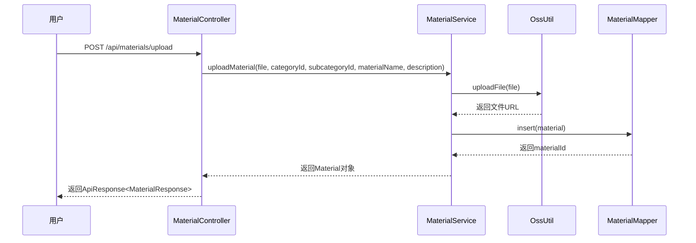
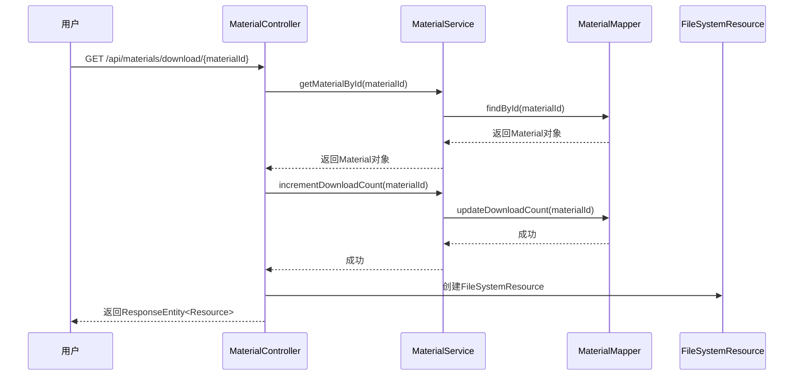
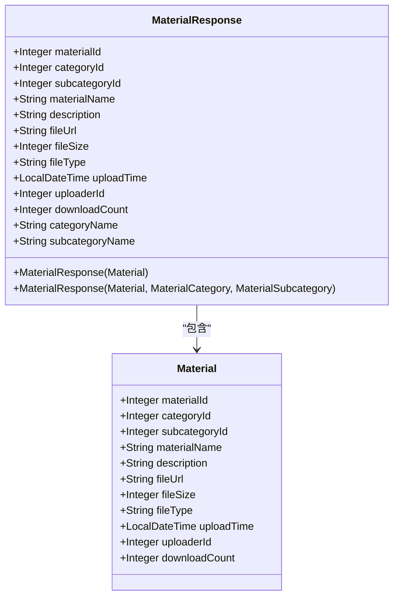
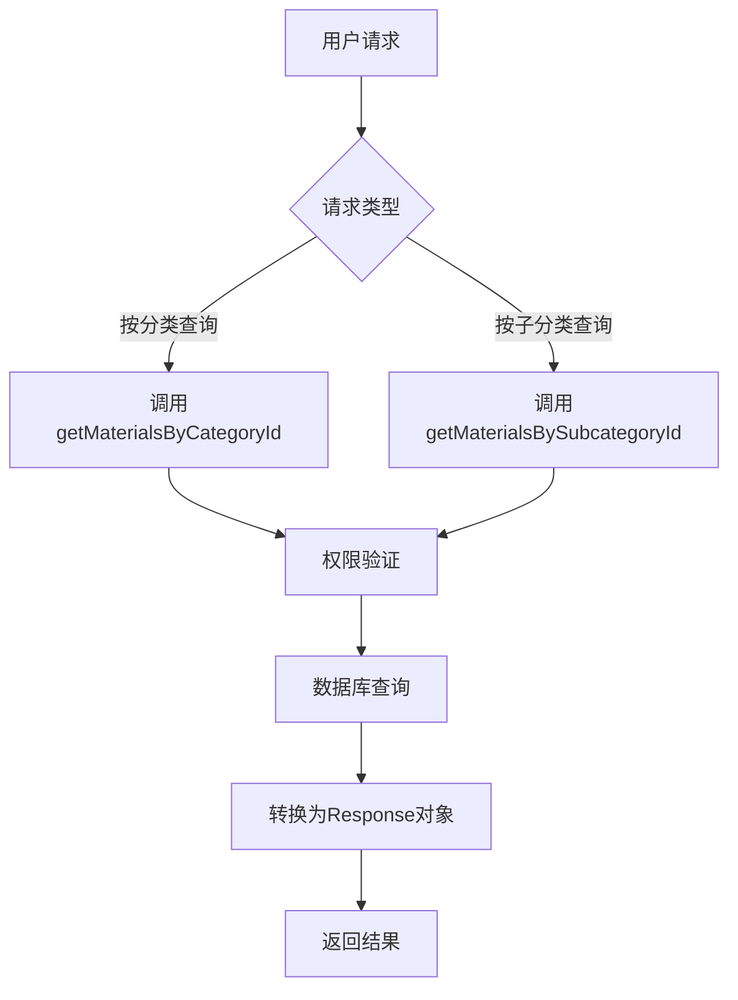
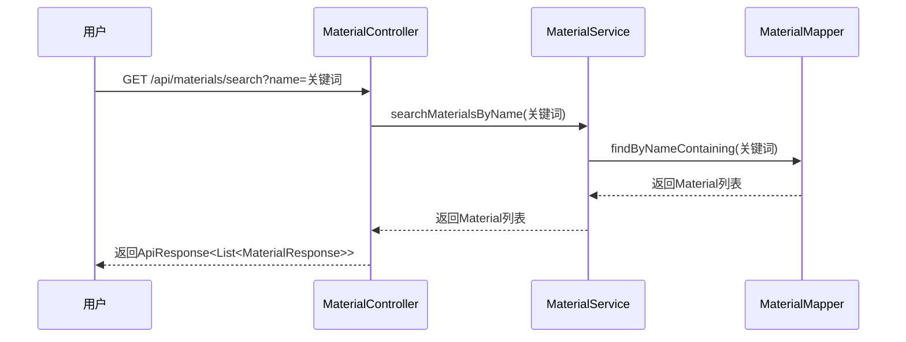
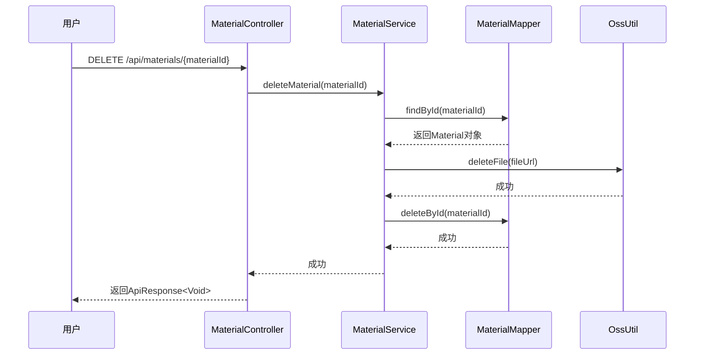
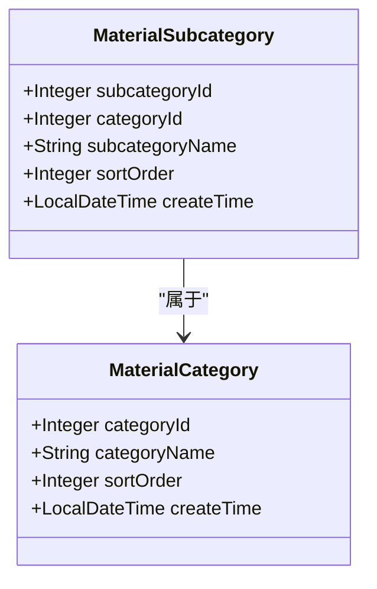
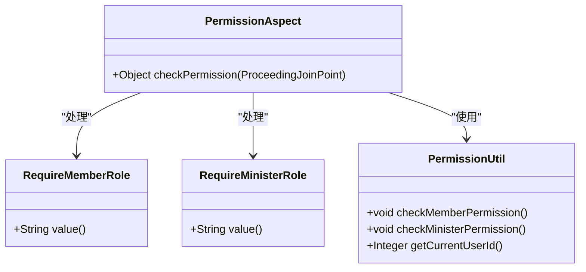

# 资料管理API

<cite>
**本文档中引用的文件**  
- [MaterialController.java](file://src/main/java/com/redmoon2333/controller/MaterialController.java)
- [MaterialService.java](file://src/main/java/com/redmoon2333/service/MaterialService.java)
- [Material.java](file://src/main/java/com/redmoon2333/entity/Material.java)
- [MaterialRequest.java](file://src/main/java/com/redmoon2333/dto/MaterialRequest.java)
- [MaterialResponse.java](file://src/main/java/com/redmoon2333/dto/MaterialResponse.java)
- [RequireMemberRole.java](file://src/main/java/com/redmoon2333/annotation/RequireMemberRole.java)
- [RequireMinisterRole.java](file://src/main/java/com/redmoon2333/annotation/RequireMinisterRole.java)
- [OssUtil.java](file://src/main/java/com/redmoon2333/util/OssUtil.java)
</cite>

## 目录
1. [简介](#简介)
2. [资料管理接口](#资料管理接口)
3. [分类管理接口](#分类管理接口)
4. [权限控制机制](#权限控制机制)
5. [文件上传与下载](#文件上传与下载)
6. [搜索功能](#搜索功能)
7. [错误处理](#错误处理)

## 简介
资料管理API是学生会人力资源管理系统的核心功能之一，提供完整的内部资料数字化管理解决方案。该API支持文件上传、下载、分类管理、信息更新和搜索功能，为学生会成员提供高效便捷的资料共享与管理服务。

系统采用基于角色的权限控制机制，确保资料的安全性和访问的合规性。所有接口均通过JWT进行身份认证，并根据用户角色实施细粒度的权限管理。文件存储采用阿里云OSS服务，确保文件的高可用性和安全性。

**Section sources**
- [MaterialController.java](file://src/main/java/com/redmoon2333/controller/MaterialController.java#L1-L30)
- [README.md](file://README.md#L1-L50)

## 资料管理接口

### 上传资料（POST /upload）
上传资料接口允许用户将文件上传到系统中。接口接收MultipartFile类型的文件参数，并要求提供分类ID、子分类ID、资料名称和可选的描述信息。

文件上传时，系统会自动生成唯一文件名并上传至阿里云OSS，同时在数据库中创建对应的资料记录。上传成功后返回资料的详细信息。



**Diagram sources**
- [MaterialController.java](file://src/main/java/com/redmoon2333/controller/MaterialController.java#L30-L60)
- [MaterialService.java](file://src/main/java/com/redmoon2333/service/MaterialService.java#L50-L100)

**Section sources**
- [MaterialController.java](file://src/main/java/com/redmoon2333/controller/MaterialController.java#L30-L60)
- [MaterialService.java](file://src/main/java/com/redmoon2333/service/MaterialService.java#L50-L100)

### 下载资料（GET /download/{id}）
下载资料接口根据资料ID提供文件下载服务。系统首先验证用户权限，然后从数据库获取资料信息，增加下载次数统计，并返回文件流。

响应头中包含Content-Disposition字段，用于指定文件下载的文件名。系统对中文文件名进行了URL编码处理，确保浏览器能正确显示中文文件名。



**Diagram sources**
- [MaterialController.java](file://src/main/java/com/redmoon2333/controller/MaterialController.java#L65-L95)
- [MaterialService.java](file://src/main/java/com/redmoon2333/service/MaterialService.java#L180-L200)

**Section sources**
- [MaterialController.java](file://src/main/java/com/redmoon2333/controller/MaterialController.java#L65-L95)
- [MaterialService.java](file://src/main/java/com/redmoon2333/service/MaterialService.java#L180-L200)

### 获取资料详情（GET /{id}）
获取资料详情接口返回指定资料的完整信息，包括资料名称、描述、文件大小、上传时间、上传者ID和下载次数等元数据。



**Diagram sources**
- [MaterialResponse.java](file://src/main/java/com/redmoon2333/dto/MaterialResponse.java#L1-L50)
- [Material.java](file://src/main/java/com/redmoon2333/entity/Material.java#L1-L50)

**Section sources**
- [MaterialController.java](file://src/main/java/com/redmoon2333/controller/MaterialController.java#L100-L115)
- [MaterialResponse.java](file://src/main/java/com/redmoon2333/dto/MaterialResponse.java#L1-L50)

### 按分类/子分类查询资料
系统提供按分类ID和子分类ID查询资料的功能。用户可以通过GET /api/materials/category/{categoryId}和GET /api/materials/subcategory/{subcategoryId}接口获取特定分类或子分类下的所有资料。



**Diagram sources**
- [MaterialController.java](file://src/main/java/com/redmoon2333/controller/MaterialController.java#L120-L150)
- [MaterialService.java](file://src/main/java/com/redmoon2333/service/MaterialService.java#L200-L230)

**Section sources**
- [MaterialController.java](file://src/main/java/com/redmoon2333/controller/MaterialController.java#L120-L150)
- [MaterialService.java](file://src/main/java/com/redmoon2333/service/MaterialService.java#L200-L230)

### 获取所有资料
获取所有资料接口返回系统中存储的所有资料列表，便于用户浏览和查找所需资料。

**Section sources**
- [MaterialController.java](file://src/main/java/com/redmoon2333/controller/MaterialController.java#L155-L170)
- [MaterialService.java](file://src/main/java/com/redmoon2333/service/MaterialService.java#L350-L370)

### 模糊搜索资料（GET /search）
模糊搜索接口允许用户根据资料名称进行关键词搜索，系统返回包含搜索关键词的所有资料。



**Diagram sources**
- [MaterialController.java](file://src/main/java/com/redmoon2333/controller/MaterialController.java#L175-L190)
- [MaterialService.java](file://src/main/java/com/redmoon2333/service/MaterialService.java#L375-L390)

**Section sources**
- [MaterialController.java](file://src/main/java/com/redmoon2333/controller/MaterialController.java#L175-L190)
- [MaterialService.java](file://src/main/java/com/redmoon2333/service/MaterialService.java#L375-L390)

### 更新资料信息（PUT /{id}）
更新资料信息接口允许授权用户修改资料的分类、子分类、名称和描述等信息。

**Section sources**
- [MaterialController.java](file://src/main/java/com/redmoon2333/controller/MaterialController.java#L195-L215)
- [MaterialService.java](file://src/main/java/com/redmoon2333/service/MaterialService.java#L320-L340)

### 删除资料（DELETE /{id}）
删除资料接口永久删除指定的资料记录。系统会同时删除OSS中的文件和数据库中的记录。



**Diagram sources**
- [MaterialController.java](file://src/main/java/com/redmoon2333/controller/MaterialController.java#L220-L240)
- [MaterialService.java](file://src/main/java/com/redmoon2333/service/MaterialService.java#L400-L430)

**Section sources**
- [MaterialController.java](file://src/main/java/com/redmoon2333/controller/MaterialController.java#L220-L240)
- [MaterialService.java](file://src/main/java/com/redmoon2333/service/MaterialService.java#L400-L430)

## 分类管理接口

### 创建分类（POST /category）
创建分类接口允许部长或副部长创建新的资料分类。请求需要提供分类名称和可选的排序值。

**Section sources**
- [MaterialController.java](file://src/main/java/com/redmoon2333/controller/MaterialController.java#L245-L265)
- [MaterialService.java](file://src/main/java/com/redmoon2333/service/MaterialService.java#L240-L260)

### 创建子分类（POST /subcategory）
创建子分类接口允许部长或副部长在指定分类下创建子分类。请求需要提供父分类ID、子分类名称和可选的排序值。

**Section sources**
- [MaterialController.java](file://src/main/java/com/redmoon2333/controller/MaterialController.java#L295-L315)
- [MaterialService.java](file://src/main/java/com/redmoon2333/service/MaterialService.java#L270-L290)

### 获取所有分类和子分类
系统提供获取所有分类和子分类的接口，便于前端展示完整的分类结构。



**Diagram sources**
- [MaterialCategory.java](file://src/main/java/com/redmoon2333/entity/MaterialCategory.java#L1-L30)
- [MaterialSubcategory.java](file://src/main/java/com/redmoon2333/entity/MaterialSubcategory.java#L1-L30)

**Section sources**
- [MaterialController.java](file://src/main/java/com/redmoon2333/controller/MaterialController.java#L270-L290)
- [MaterialController.java](file://src/main/java/com/redmoon2333/controller/MaterialController.java#L320-L340)

## 权限控制机制

### @RequireMemberRole和@RequireMinisterRole注解
系统采用自定义注解实现细粒度的权限控制。`@RequireMemberRole`注解要求用户具有部员或更高权限，而`@RequireMinisterRole`注解要求用户具有部长或副部长权限。



**Diagram sources**
- [RequireMemberRole.java](file://src/main/java/com/redmoon2333/annotation/RequireMemberRole.java#L1-L20)
- [RequireMinisterRole.java](file://src/main/java/com/redmoon2333/annotation/RequireMinisterRole.java#L1-L20)
- [PermissionAspect.java](file://src/main/java/com/redmoon2333/aspect/PermissionAspect.java#L1-L50)
- [PermissionUtil.java](file://src/main/java/com/redmoon2333/util/PermissionUtil.java#L1-L50)

**Section sources**
- [RequireMemberRole.java](file://src/main/java/com/redmoon2333/annotation/RequireMemberRole.java#L1-L20)
- [RequireMinisterRole.java](file://src/main/java/com/redmoon2333/annotation/RequireMinisterRole.java#L1-L20)

### 权限控制差异
| 接口 | 权限要求 | 说明 |
|------|--------|------|
| POST /upload | @RequireMemberRole | 部员及以上权限可上传资料 |
| GET /download/{id} | @RequireMemberRole | 部员及以上权限可下载资料 |
| GET /{id} | @RequireMemberRole | 部员及以上权限可查看资料详情 |
| GET /category/{id} | @RequireMemberRole | 部员及以上权限可查看分类资料 |
| GET /subcategory/{id} | @RequireMemberRole | 部员及以上权限可查看子分类资料 |
| GET /search | @RequireMemberRole | 部员及以上权限可搜索资料 |
| PUT /{id} | @RequireMemberRole | 部员及以上权限可更新资料信息 |
| DELETE /{id} | @RequireMemberRole | 部员及以上权限可删除资料 |
| POST /category | @RequireMinisterRole | 仅部长/副部长可创建分类 |
| POST /subcategory | @RequireMinisterRole | 仅部长/副部长可创建子分类 |

**Section sources**
- [MaterialController.java](file://src/main/java/com/redmoon2333/controller/MaterialController.java#L1-L327)

## 文件上传与下载

### MultipartFile参数和文件大小限制
文件上传接口使用Spring的MultipartFile参数接收上传的文件。系统在application.yml中配置了100MB的文件大小限制：

```yaml
spring:
  servlet:
    multipart:
      max-file-size: 100MB
      max-request-size: 100MB
```

当文件大小超过限制时，系统会抛出MaxUploadSizeExceededException异常，并返回相应的错误信息。

**Section sources**
- [MaterialController.java](file://src/main/java/com/redmoon2333/controller/MaterialController.java#L30-L60)
- [application.yml](file://src/main/resources/application.yml#L1-L10)

### 下载接口的Content-Disposition响应头处理
下载接口使用Content-Disposition响应头指定文件下载的文件名。系统对中文文件名进行了UTF-8编码处理，确保浏览器能正确显示中文文件名：

```java
String encodedFileName = URLEncoder.encode(material.getMaterialName(), StandardCharsets.UTF_8);
headers.add(HttpHeaders.CONTENT_DISPOSITION, "attachment; filename*=UTF-8''" + encodedFileName);
```

这种编码方式符合RFC 5987标准，能确保在各种浏览器中正确处理中文文件名。

**Section sources**
- [MaterialController.java](file://src/main/java/com/redmoon2333/controller/MaterialController.java#L75-L90)

## 搜索功能

### 使用场景
搜索功能适用于以下场景：
- 用户忘记资料的具体位置，但记得部分名称
- 需要查找包含特定关键词的资料
- 快速定位相关主题的资料集合

搜索采用模糊匹配方式，只要资料名称中包含搜索关键词即可返回结果。

**Section sources**
- [MaterialController.java](file://src/main/java/com/redmoon2333/controller/MaterialController.java#L175-L190)
- [MaterialService.java](file://src/main/java/com/redmoon2333/service/MaterialService.java#L375-L390)

## 错误处理
系统采用统一的异常处理机制，所有API接口返回标准化的ApiResponse格式。当发生错误时，系统会记录详细的错误日志，并返回相应的错误码和消息。

常见的错误码包括：
- FILE_UPLOAD_ERROR (文件上传失败)
- MATERIAL_NOT_FOUND (资料不存在)
- MATERIAL_QUERY_FAILED (资料查询失败)
- MATERIAL_UPDATE_FAILED (资料更新失败)
- MATERIAL_DELETE_FAILED (资料删除失败)
- CATEGORY_CREATE_FAILED (分类创建失败)
- SUBCATEGORY_CREATE_FAILED (子分类创建失败)

**Section sources**
- [MaterialController.java](file://src/main/java/com/redmoon2333/controller/MaterialController.java#L1-L327)
- [ErrorCode.java](file://src/main/java/com/redmoon2333/exception/ErrorCode.java#L1-L50)
- [GlobalExceptionHandler.java](file://src/main/java/com/redmoon2333/exception/GlobalExceptionHandler.java#L1-L50)