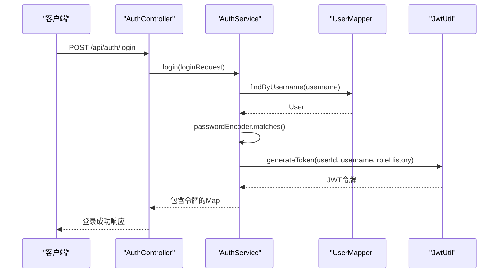
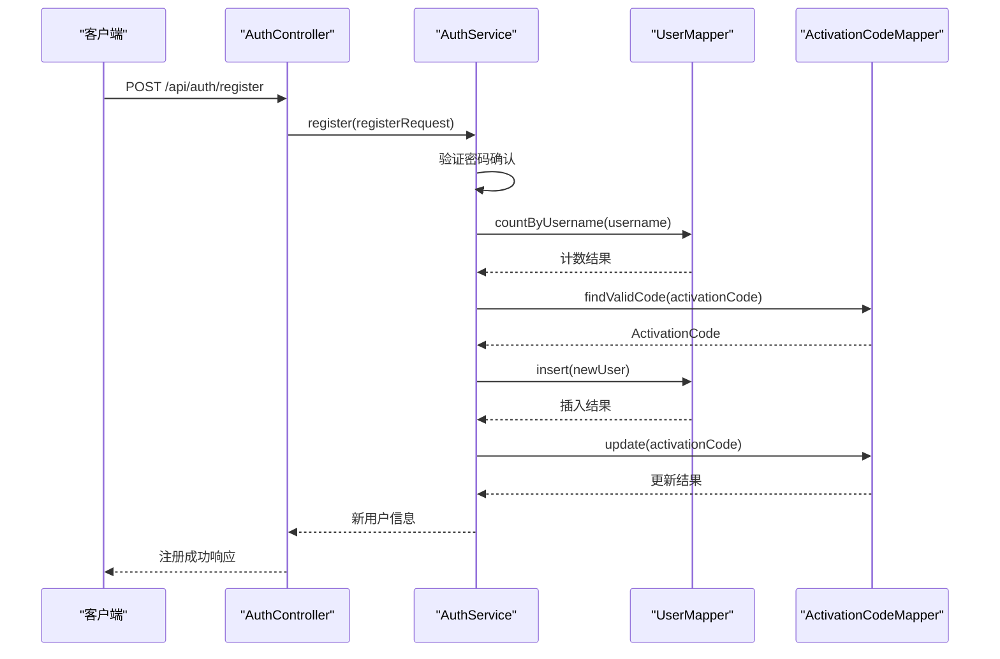
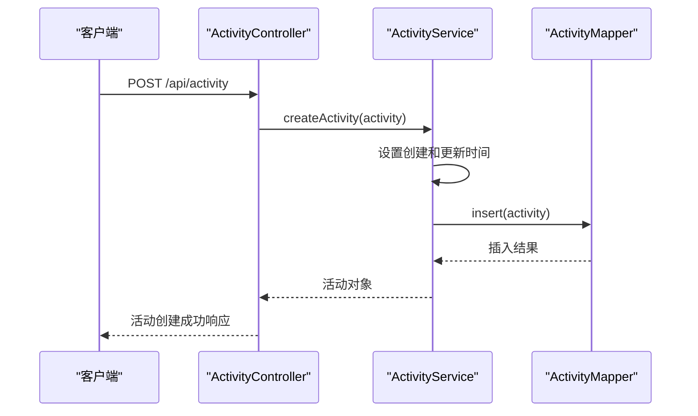

# 业务逻辑层

<cite>
**本文档中引用的文件**  
- [AuthService.java](file://src/main/java/com/redmoon2333/service/AuthService.java)
- [UserService.java](file://src/main/java/com/redmoon2333/service/UserService.java)
- [ActivityService.java](file://src/main/java/com/redmoon2333/service/ActivityService.java)
- [JwtUtil.java](file://src/main/java/com/redmoon2333/util/JwtUtil.java)
- [UserMapper.java](file://src/main/java/com/redmoon2333/mapper/UserMapper.java)
- [ActivityMapper.java](file://src/main/java/com/redmoon2333/mapper/ActivityMapper.java)
- [ActivationCodeMapper.java](file://src/main/java/com/redmoon2333/mapper/ActivationCodeMapper.java)
- [User.java](file://src/main/java/com/redmoon2333/entity/User.java)
- [Activity.java](file://src/main/java/com/redmoon2333/entity/Activity.java)
- [ActivationCode.java](file://src/main/java/com/redmoon2333/entity/ActivationCode.java)
- [LoginRequest.java](file://src/main/java/com/redmoon2333/dto/LoginRequest.java)
- [RegisterRequest.java](file://src/main/java/com/redmoon2333/dto/RegisterRequest.java)
- [AlumniMember.java](file://src/main/java/com/redmoon2333/dto/AlumniMember.java)
- [AlumniResponse.java](file://src/main/java/com/redmoon2333/dto/AlumniResponse.java)
</cite>

## 目录
1. [简介](#简介)
2. [核心服务类职责划分](#核心服务类职责划分)
3. [认证服务实现细节](#认证服务实现细节)
4. [用户服务实现细节](#用户服务实现细节)
5. [活动服务实现细节](#活动服务实现细节)
6. [服务层与数据访问对象的协调机制](#服务层与数据访问对象的协调机制)
7. [关键业务流程序列图](#关键业务流程序列图)
8. [异常处理策略](#异常处理策略)
9. [事务边界管理](#事务边界管理)

## 简介
本项目是一个基于Spring Boot的学生会部门官方网站，实现了用户认证、用户管理和活动管理等核心功能。系统采用分层架构设计，包含控制器层、服务层和数据访问层。本文档深入解析业务逻辑层的实现细节，重点说明AuthService、UserService和ActivityService三个核心服务类的设计原则和实现机制。

## 核心服务类职责划分
系统中的三个核心服务类分别负责不同的业务领域：

- **AuthService**：负责用户认证相关功能，包括登录、注册、JWT令牌生成与验证、激活码管理等
- **UserService**：负责用户信息管理，包括往届成员查询、用户模糊搜索、用户信息获取等
- **ActivityService**：负责活动管理，包括活动的创建、更新、删除、图片管理等功能

每个服务类都遵循单一职责原则，将特定领域的业务逻辑封装在独立的类中，提高了代码的可维护性和可测试性。

**Section sources**
- [AuthService.java](file://src/main/java/com/redmoon2333/service/AuthService.java#L1-L199)
- [UserService.java](file://src/main/java/com/redmoon2333/service/UserService.java#L1-L250)
- [ActivityService.java](file://src/main/java/com/redmoon2333/service/ActivityService.java#L1-L272)

## 认证服务实现细节
AuthService类实现了用户认证的核心功能，包括登录、注册、JWT令牌处理和激活码管理。

### JWT令牌生成与验证逻辑
系统使用JWT（JSON Web Token）实现无状态认证。JwtUtil工具类负责令牌的生成、解析和验证：

- **令牌生成**：`generateToken`方法接收用户ID、用户名和角色历史信息，创建包含这些声明的JWT令牌
- **令牌验证**：`validateToken`方法检查令牌的签名和过期时间，确保令牌的有效性
- **声明提取**：提供多种方法从令牌中提取用户ID、用户名、角色历史等信息

令牌的密钥和过期时间通过配置文件注入，增强了安全性。

### 用户注册激活码机制
用户注册需要有效的激活码，确保只有授权用户才能注册：

- **激活码验证**：注册时检查提供的激活码是否有效（未使用且未过期）
- **激活码状态更新**：成功注册后，将激活码状态更新为"已使用"，并记录使用时间和用户ID
- **权限控制**：只有具有"部长"角色的用户才能生成新的激活码

**Section sources**
- [AuthService.java](file://src/main/java/com/redmoon2333/service/AuthService.java#L1-L199)
- [JwtUtil.java](file://src/main/java/com/redmoon2333/util/JwtUtil.java#L1-L229)

## 用户服务实现细节
UserService类提供了用户信息管理的相关功能。

### 往届成员查询机制
系统通过解析用户的`roleHistory`字段来获取往届成员信息：

- **数据提取**：遍历所有用户，使用正则表达式`(\\d{4})级(.+)`解析角色历史中的年份和角色信息
- **分组处理**：按年份将成员信息分组，每个年份对应一个AlumniResponse对象
- **排序输出**：按年份降序排列，最新的年份排在前面

### 模糊搜索算法
系统提供了两种用户搜索方式：

- **精确搜索**：根据姓名精确匹配用户
- **模糊搜索**：根据姓名关键词进行模糊匹配

两种搜索都通过UserMapper接口委托给数据访问层执行，返回不包含敏感信息的公共用户信息。

**Section sources**
- [UserService.java](file://src/main/java/com/redmoon2333/service/UserService.java#L1-L250)
- [UserMapper.java](file://src/main/java/com/redmoon2333/mapper/UserMapper.java#L1-L78)

## 活动服务实现细节
ActivityService类实现了活动管理的完整生命周期。

### 活动创建与更新流程
- **创建流程**：设置创建时间和更新时间，插入数据库，返回完整的活动对象
- **更新流程**：先检查活动是否存在，然后更新活动信息和更新时间
- **时间戳管理**：自动维护`createTime`和`updateTime`字段，确保数据的时效性

### 图片管理流程
系统支持为活动添加多张图片：

- **图片存储**：使用`saveImage`方法将上传的图片保存到服务器的uploads目录，生成唯一文件名
- **图片关联**：将图片信息（路径、描述、上传时间）与活动ID关联存储
- **图片操作**：支持添加、更新、删除和查询活动图片

删除活动时，会级联删除相关的图片记录，确保数据一致性。

**Section sources**
- [ActivityService.java](file://src/main/java/com/redmoon2333/service/ActivityService.java#L1-L272)
- [ActivityMapper.java](file://src/main/java/com/redmoon2333/mapper/ActivityMapper.java#L1-L40)

## 服务层与数据访问对象的协调机制
服务层通过依赖注入的方式协调多个数据访问对象（Mapper）完成复杂业务操作：

- **依赖注入**：使用`@Autowired`注解自动注入所需的Mapper对象
- **事务管理**：AuthService类使用`@Transactional`注解确保操作的原子性
- **错误处理**：捕获数据访问层的异常，转换为业务异常，提供统一的错误处理机制
- **数据转换**：在服务层进行数据转换，如将User实体转换为PublicUserInfo DTO，避免敏感信息泄露

这种设计模式实现了业务逻辑与数据访问的解耦，提高了代码的可维护性和可测试性。

**Section sources**
- [AuthService.java](file://src/main/java/com/redmoon2333/service/AuthService.java#L1-L199)
- [UserService.java](file://src/main/java/com/redmoon2333/service/UserService.java#L1-L250)
- [ActivityService.java](file://src/main/java/com/redmoon2333/service/ActivityService.java#L1-L272)

## 关键业务流程序列图
以下序列图展示了主要业务流程中Controller→Service→Mapper的调用链。

### 用户登录流程

**Diagram sources**
- [AuthService.java](file://src/main/java/com/redmoon2333/service/AuthService.java#L50-L85)
- [UserMapper.java](file://src/main/java/com/redmoon2333/mapper/UserMapper.java#L15-L20)
- [JwtUtil.java](file://src/main/java/com/redmoon2333/util/JwtUtil.java#L50-L70)

### 用户注册流程

**Diagram sources**
- [AuthService.java](file://src/main/java/com/redmoon2333/service/AuthService.java#L90-L145)
- [UserMapper.java](file://src/main/java/com/redmoon2333/mapper/UserMapper.java#L35-L40)
- [ActivationCodeMapper.java](file://src/main/java/com/redmoon2333/mapper/ActivationCodeMapper.java#L15-L25)

### 活动创建流程

**Diagram sources**
- [ActivityService.java](file://src/main/java/com/redmoon2333/service/ActivityService.java#L10-L30)
- [ActivityMapper.java](file://src/main/java/com/redmoon2333/mapper/ActivityMapper.java#L10-L15)

## 异常处理策略
系统采用分层的异常处理策略：

- **自定义异常**：定义BusinessException和ErrorCode枚举，提供结构化的错误信息
- **全局异常处理**：使用GlobalExceptionHandler统一处理异常，返回标准化的错误响应
- **服务层异常处理**：在服务方法中捕获特定异常，转换为业务异常
- **日志记录**：使用SLF4J记录详细的调试和错误信息，便于问题排查

这种策略确保了错误信息的一致性和可读性，同时提供了足够的调试信息。

**Section sources**
- [AuthService.java](file://src/main/java/com/redmoon2333/service/AuthService.java#L50-L145)
- [UserService.java](file://src/main/java/com/redmoon2333/service/UserService.java#L50-L200)
- [ActivityService.java](file://src/main/java/com/redmoon2333/service/ActivityService.java#L10-L250)
- [GlobalExceptionHandler.java](file://src/main/java/com/redmoon2333/exception/GlobalExceptionHandler.java)

## 事务边界管理
系统通过Spring的声明式事务管理确保数据一致性：

- **事务注解**：AuthService类使用`@Transactional`注解，确保注册等操作的原子性
- **默认传播行为**：使用REQUIRED传播行为，方法在现有事务中运行或创建新事务
- **异常回滚**：运行时异常自动触发事务回滚，确保数据完整性
- **细粒度控制**：在需要的地方可以使用`@Transactional`注解进行更细粒度的事务控制

这种事务管理策略简化了事务处理代码，同时确保了关键业务操作的数据一致性。

**Section sources**
- [AuthService.java](file://src/main/java/com/redmoon2333/service/AuthService.java#L15-L199)
- [TransactionManagementConfiguration.java](file://src/main/java/com/redmoon2333/config/TransactionManagementConfig.java)