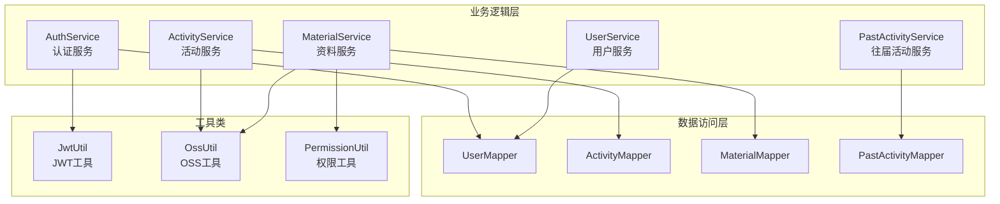
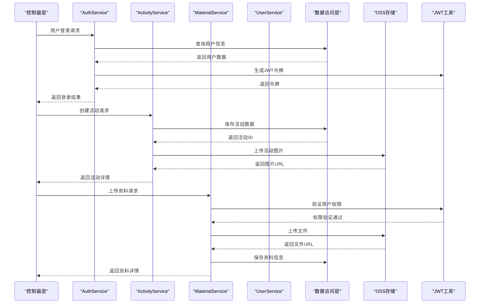
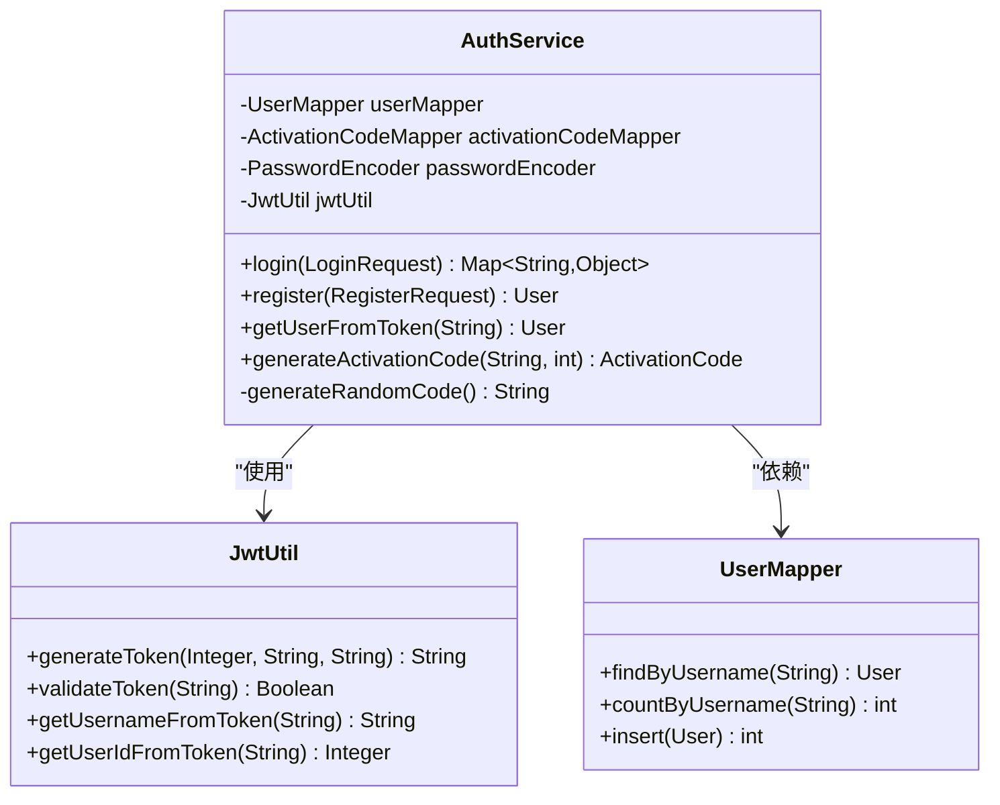
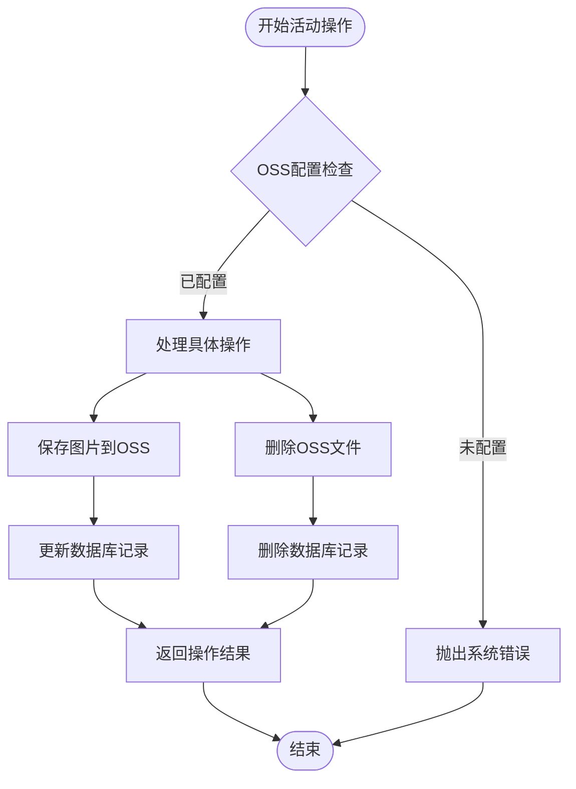
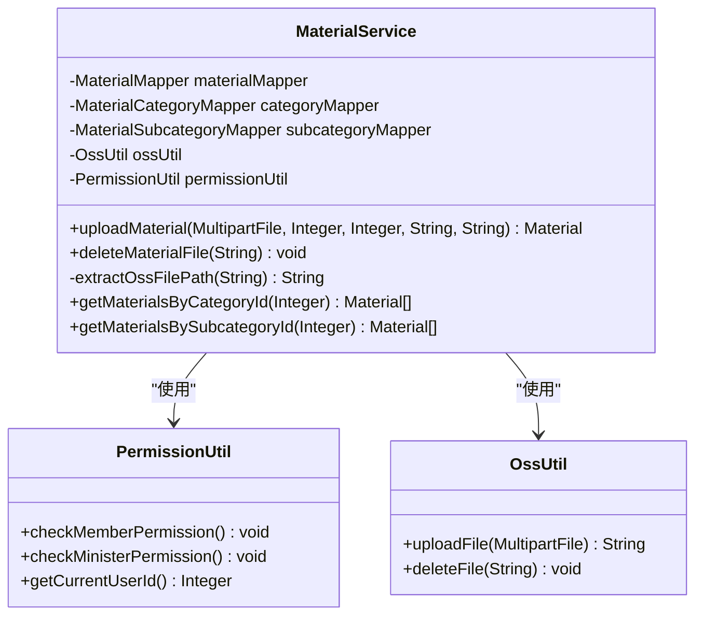
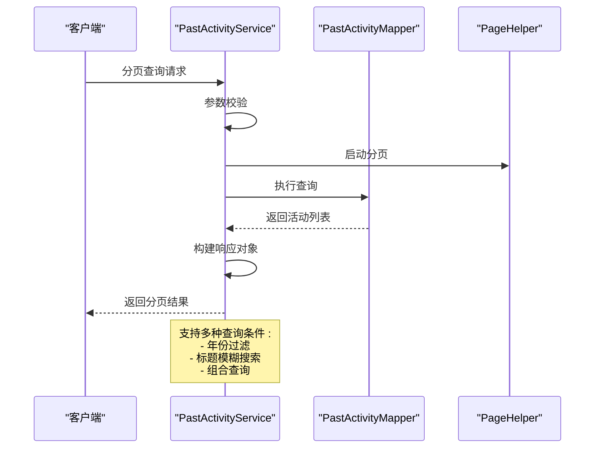
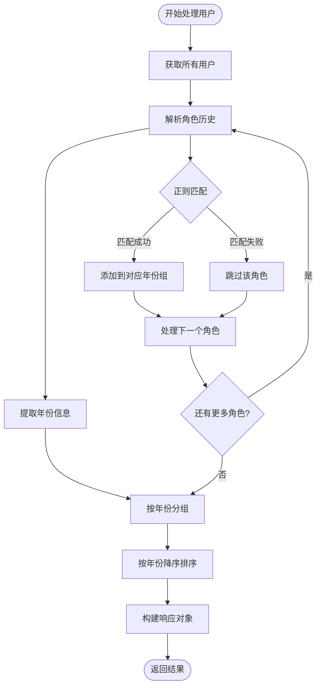
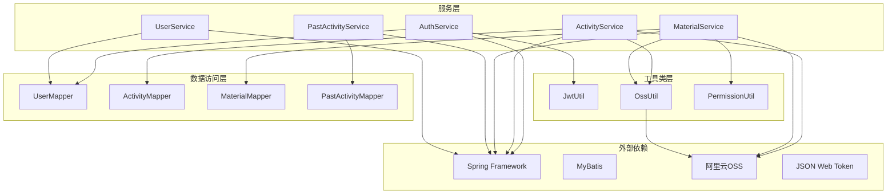
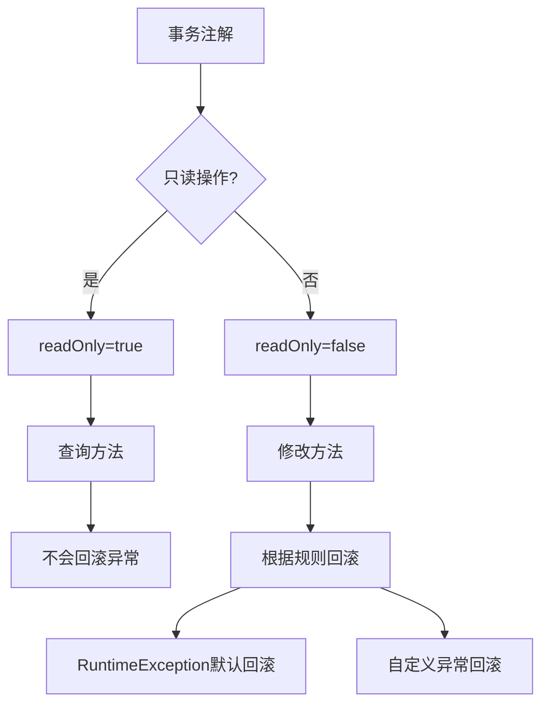
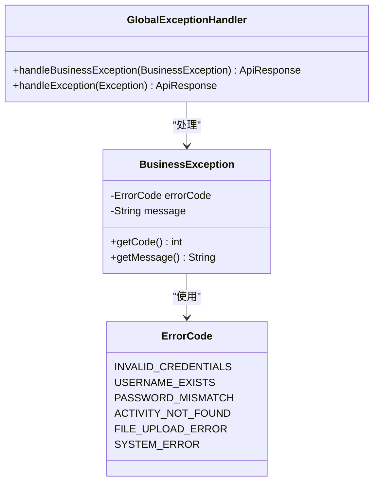

# 业务逻辑层

<cite>
**本文档引用的文件**
- [AuthService.java](file://src/main/java/com/redmoon2333/service/AuthService.java)
- [ActivityService.java](file://src/main/java/com/redmoon2333/service/ActivityService.java)
- [MaterialService.java](file://src/main/java/com/redmoon2333/service/MaterialService.java)
- [PastActivityService.java](file://src/main/java/com/redmoon2333/service/PastActivityService.java)
- [UserService.java](file://src/main/java/com/redmoon2333/service/UserService.java)
- [JwtUtil.java](file://src/main/java/com/redmoon2333/util/JwtUtil.java)
- [OssUtil.java](file://src/main/java/com/redmoon2333/util/OssUtil.java)
- [AuthController.java](file://src/main/java/com/redmoon2333/controller/AuthController.java)
- [OssConfig.java](file://src/main/java/com/redmoon2333/config/OssConfig.java)
- [User.java](file://src/main/java/com/redmoon2333/entity/User.java)
</cite>

## 目录
1. [简介](#简介)
2. [项目结构概览](#项目结构概览)
3. [核心服务组件](#核心服务组件)
4. [架构概览](#架构概览)
5. [详细组件分析](#详细组件分析)
6. [服务间依赖关系](#服务间依赖关系)
7. [事务管理和异常处理](#事务管理和异常处理)
8. [性能考虑](#性能考虑)
9. [故障排除指南](#故障排除指南)
10. [结论](#结论)

## 简介

本文档深入分析人力资源管理系统业务逻辑层的实现，重点关注五个核心服务类：AuthService（认证服务）、ActivityService（活动服务）、MaterialService（资料服务）、PastActivityService（往届活动服务）和UserService（用户服务）。这些服务类构成了系统的业务逻辑核心，负责协调数据访问操作、实现复杂业务规则、管理事务和处理异常。

业务逻辑层采用Spring框架的@Service注解进行依赖注入，通过@Autowired注解实现服务间的协作。每个服务类都封装了特定领域的业务逻辑，确保了代码的模块化和可维护性。

## 项目结构概览

业务逻辑层位于`src/main/java/com/redmoon2333/service`目录下，包含以下核心服务类：



**图表来源**
- [AuthService.java](file://src/main/java/com/redmoon2333/service/AuthService.java#L1-L199)
- [ActivityService.java](file://src/main/java/com/redmoon2333/service/ActivityService.java#L1-L376)
- [MaterialService.java](file://src/main/java/com/redmoon2333/service/MaterialService.java#L1-L459)
- [PastActivityService.java](file://src/main/java/com/redmoon2333/service/PastActivityService.java#L1-L305)
- [UserService.java](file://src/main/java/com/redmoon2333/service/UserService.java#L1-L250)

## 核心服务组件

### 认证服务 (AuthService)

AuthService是系统的核心认证服务，负责用户身份验证、注册管理、JWT令牌生成和激活码管理。该服务实现了完整的用户生命周期管理，从注册到登录再到权限验证。

主要功能：
- 用户登录验证和JWT令牌生成
- 用户注册流程管理
- 激活码生成和验证
- 从JWT令牌中提取用户信息

### 活动服务 (ActivityService)

ActivityService专门处理活动相关的业务逻辑，包括活动的创建、更新、删除和图片管理。该服务集成了OSS文件存储，支持活动图片的上传、管理和删除。

主要功能：
- 活动的增删改查操作
- 活动图片的上传和管理
- OSS文件存储集成
- 活动与图片的关联管理

### 资料服务 (MaterialService)

MaterialService负责资料文件的上传、管理和访问控制。该服务实现了严格的权限验证，确保只有授权用户才能上传和访问资料文件。

主要功能：
- 资料文件的上传和存储
- 权限验证和访问控制
- 资料分类和子分类管理
- OSS文件的生命周期管理

### 往届活动服务 (PastActivityService)

PastActivityService管理往届活动的数据，提供分页查询、统计分析和数据验证功能。该服务采用了PageHelper分页插件，支持灵活的查询条件。

主要功能：
- 往届活动的分页查询
- 活动数据的增删改查
- 年份统计和过滤
- 数据验证和业务规则检查

### 用户服务 (UserService)

UserService提供用户相关的业务逻辑，特别是往届部员信息的提取和分析。该服务使用正则表达式解析用户的角色历史，实现智能的年份分组。

主要功能：
- 往届部员信息的提取和分组
- 用户搜索和模糊匹配
- 角色历史的解析和处理
- 用户信息的公共展示

**章节来源**
- [AuthService.java](file://src/main/java/com/redmoon2333/service/AuthService.java#L1-L199)
- [ActivityService.java](file://src/main/java/com/redmoon2333/service/ActivityService.java#L1-L376)
- [MaterialService.java](file://src/main/java/com/redmoon2333/service/MaterialService.java#L1-L459)
- [PastActivityService.java](file://src/main/java/com/redmoon2333/service/PastActivityService.java#L1-L305)
- [UserService.java](file://src/main/java/com/redmoon2333/service/UserService.java#L1-L250)

## 架构概览

业务逻辑层采用分层架构设计，通过依赖注入实现松耦合的服务协作。以下是核心架构图：



**图表来源**
- [AuthController.java](file://src/main/java/com/redmoon2333/controller/AuthController.java#L1-L157)
- [AuthService.java](file://src/main/java/com/redmoon2333/service/AuthService.java#L40-L80)
- [ActivityService.java](file://src/main/java/com/redmoon2333/service/ActivityService.java#L25-L50)
- [MaterialService.java](file://src/main/java/com/redmoon2333/service/MaterialService.java#L45-L80)

## 详细组件分析

### AuthService - 认证服务详解

AuthService是系统安全的核心，实现了完整的用户认证和授权机制：



**图表来源**
- [AuthService.java](file://src/main/java/com/redmoon2333/service/AuthService.java#L25-L40)
- [JwtUtil.java](file://src/main/java/com/redmoon2333/util/JwtUtil.java#L1-L309)

#### 登录流程实现

登录流程展示了AuthService的核心业务逻辑：

```java
public Map<String, Object> login(LoginRequest loginRequest) {
    // 1. 查找用户
    User user = userMapper.findByUsername(loginRequest.getUsername());
    if (user == null) {
        throw new BusinessException(ErrorCode.INVALID_CREDENTIALS);
    }
    
    // 2. 验证密码
    if (!passwordEncoder.matches(loginRequest.getPassword(), user.getPassword())) {
        throw new BusinessException(ErrorCode.INVALID_CREDENTIALS);
    }
    
    // 3. 生成JWT令牌
    String token = jwtUtil.generateToken(user.getUserId(), user.getUsername(), user.getRoleHistory());
    
    // 4. 构造返回结果
    Map<String, Object> result = new HashMap<>();
    result.put("token", token);
    result.put("user", user);
    result.put("tokenType", "Bearer");
    
    return result;
}
```

#### 注册流程实现

注册流程包含了激活码验证和用户创建的完整逻辑：

```java
public User register(RegisterRequest registerRequest) {
    // 1. 验证密码确认
    if (!registerRequest.getPassword().equals(registerRequest.getConfirmPassword())) {
        throw new BusinessException(ErrorCode.PASSWORD_MISMATCH);
    }
    
    // 2. 检查用户名是否已存在
    if (userMapper.countByUsername(registerRequest.getUsername()) > 0) {
        throw new BusinessException(ErrorCode.USERNAME_EXISTS);
    }
    
    // 3. 验证激活码
    ActivationCode activationCode = activationCodeMapper.findValidCode(
            registerRequest.getActivationCode(),
            ActivationStatus.未使用,
            LocalDateTime.now()
    );
    
    // 4. 创建新用户
    User newUser = new User();
    newUser.setUsername(registerRequest.getUsername());
    newUser.setPassword(passwordEncoder.encode(registerRequest.getPassword()));
    newUser.setName(registerRequest.getName());
    newUser.setRoleHistory(registerRequest.getRoleHistory());
    
    // 5. 保存用户并更新激活码状态
    userMapper.insert(newUser);
    activationCode.setStatus(ActivationStatus.已使用);
    activationCodeMapper.update(activationCode);
    
    return newUser;
}
```

**章节来源**
- [AuthService.java](file://src/main/java/com/redmoon2333/service/AuthService.java#L40-L120)

### ActivityService - 活动服务详解

ActivityService提供了完整的活动管理功能，集成了OSS文件存储：



**图表来源**
- [ActivityService.java](file://src/main/java/com/redmoon2333/service/ActivityService.java#L200-L250)

#### 图片上传和管理

ActivityService实现了完整的图片上传和管理流程：

```java
public String saveImage(MultipartFile file) throws IOException {
    // 1. 检查OSS工具是否可用
    if (ossUtil == null) {
        throw new BusinessException(ErrorCode.SYSTEM_ERROR, 
            "文件上传功能不可用，请联系系统管理员检查OSS配置");
    }
    
    // 2. 生成唯一文件名
    String originalFilename = file.getOriginalFilename();
    String extension = originalFilename != null ? 
        originalFilename.substring(originalFilename.lastIndexOf(".")) : "";
    String uniqueFilename = UUID.randomUUID().toString() + extension;
    
    // 3. 使用OSS工具类上传文件
    String ossFilePath = ossUtil.uploadFile(file);
    
    return ossFilePath;
}
```

#### OSS文件路径提取

ActivityService实现了智能的OSS文件路径提取功能：

```java
private String extractOssFilePath(String imageUrl) {
    if (imageUrl == null || imageUrl.isEmpty()) {
        return null;
    }
    
    // 处理自定义域名的情况
    String domain = System.getProperty("aliyun.oss.domain");
    if (domain != null && !domain.isEmpty() && imageUrl.startsWith(domain)) {
        return imageUrl.substring(domain.length() + 1);
    }
    
    // 处理默认OSS域名的情况
    int thirdSlashIndex = imageUrl.indexOf("/", 8);
    if (thirdSlashIndex != -1) {
        return imageUrl.substring(thirdSlashIndex + 1);
    }
    
    return null;
}
```

**章节来源**
- [ActivityService.java](file://src/main/java/com/redmoon2333/service/ActivityService.java#L200-L280)

### MaterialService - 资料服务详解

MaterialService实现了严格的权限控制和资料管理：



**图表来源**
- [MaterialService.java](file://src/main/java/com/redmoon2333/service/MaterialService.java#L25-L50)

#### 权限验证和资料上传

MaterialService在资料上传过程中实施严格的权限验证：

```java
@Transactional
public Material uploadMaterial(MultipartFile file, Integer categoryId, Integer subcategoryId, 
                             String materialName, String description) throws IOException {
    try {
        // 1. 检查权限（部员及以上）
        permissionUtil.checkMemberPermission();
        Integer uploaderId = permissionUtil.getCurrentUserId();
        
        // 2. 检查OSS工具是否可用
        if (ossUtil == null) {
            throw new BusinessException(ErrorCode.SYSTEM_ERROR, 
                "文件上传功能不可用，请联系系统管理员检查OSS配置");
        }
        
        // 3. 上传到OSS并获取URL
        String fileUrl = ossUtil.uploadFile(file);
        
        // 4. 创建资料对象并保存到数据库
        Material material = new Material();
        material.setCategoryId(categoryId);
        material.setSubcategoryId(subcategoryId);
        material.setMaterialName(materialName);
        material.setDescription(description);
        material.setFileUrl(fileUrl);
        material.setFileSize((int) file.getSize());
        material.setFileType(extension);
        material.setUploadTime(LocalDateTime.now());
        material.setUploaderId(uploaderId);
        
        materialMapper.insert(material);
        
        return material;
    } catch (Exception e) {
        throw new BusinessException(ErrorCode.FILE_UPLOAD_ERROR);
    }
}
```

**章节来源**
- [MaterialService.java](file://src/main/java/com/redmoon2333/service/MaterialService.java#L45-L120)

### PastActivityService - 往届活动服务详解

PastActivityService提供了完整的往届活动管理功能，支持分页查询和统计分析：



**图表来源**
- [PastActivityService.java](file://src/main/java/com/redmoon2333/service/PastActivityService.java#L30-L80)

#### 分页查询实现

PastActivityService实现了灵活的分页查询功能：

```java
@Transactional(readOnly = true)
public PageResponse<PastActivityResponse> getPagedPastActivities(int pageNum, int pageSize, 
                                                               Integer year, String title) {
    try {
        // 1. 参数校验
        if (pageNum <= 0 || pageSize <= 0) {
            throw new BusinessException(ErrorCode.INVALID_REQUEST_PARAMETER, 
                "分页参数必须大于0");
        }
        
        if (pageSize > 100) {
            throw new BusinessException(ErrorCode.INVALID_REQUEST_PARAMETER, 
                "每页最多100条记录");
        }
        
        // 2. 启动分页
        PageHelper.startPage(pageNum, pageSize);
        
        // 3. 根据条件查询
        List<PastActivity> pastActivities;
        if (year != null && StringUtils.hasText(title)) {
            pastActivities = pastActivityMapper.findByYearAndTitleLike(year, title.trim());
        } else if (year != null) {
            pastActivities = pastActivityMapper.findByYear(year);
        } else if (StringUtils.hasText(title)) {
            pastActivities = pastActivityMapper.findByTitleLike(title.trim());
        } else {
            pastActivities = pastActivityMapper.findAll();
        }
        
        // 4. 构建分页响应
        PageInfo<PastActivity> pageInfo = new PageInfo<>(pastActivities);
        List<PastActivityResponse> responses = PastActivityResponse.fromList(pastActivities);
        
        return PageResponse.of(responses, pageInfo.getPageNum(), 
                              pageInfo.getPageSize(), pageInfo.getTotal());
    } catch (Exception e) {
        throw new BusinessException(ErrorCode.SYSTEM_ERROR, "系统内部错误", e);
    }
}
```

**章节来源**
- [PastActivityService.java](file://src/main/java/com/redmoon2333/service/PastActivityService.java#L30-L80)

### UserService - 用户服务详解

UserService专注于用户信息的提取和分析，特别是往届部员信息的智能处理：



**图表来源**
- [UserService.java](file://src/main/java/com/redmoon2333/service/UserService.java#L30-L120)

#### 角色历史解析实现

UserService使用正则表达式智能解析用户的角色历史：

```java
public List<AlumniResponse> getAlumniMembers() {
    // 1. 获取所有用户
    List<User> allUsers = getAllUsers();
    
    // 2. 正则表达式匹配"年份+角色"的格式，例如"2024级部长"
    Pattern rolePattern = Pattern.compile("(\\d{4})级(.+)");
    
    // 3. 遍历所有用户，解析他们的角色历史
    Map<Integer, List<AlumniMember>> alumniMap = new HashMap<>();
    
    for (User user : allUsers) {
        String roleHistory = user.getRoleHistory();
        if (roleHistory == null || roleHistory.trim().isEmpty()) {
            continue;
        }
        
        // 4. 分割角色历史，可能包含多个角色
        String[] roles = roleHistory.split("&");
        
        // 5. 处理每个角色
        for (String role : roles) {
            role = role.trim();
            Matcher matcher = rolePattern.matcher(role);
            
            if (matcher.matches()) {
                try {
                    // 6. 提取年份和角色
                    Integer year = Integer.valueOf(matcher.group(1));
                    String roleName = matcher.group(2);
                    
                    // 7. 创建部员信息并添加到对应年份的列表中
                    AlumniMember member = new AlumniMember(user.getName(), roleName);
                    alumniMap.computeIfAbsent(year, k -> new ArrayList<>()).add(member);
                } catch (NumberFormatException e) {
                    // 忽略格式错误的角色
                }
            }
        }
    }
    
    // 8. 按年份降序排序并构建最终结果
    List<AlumniResponse> result = new ArrayList<>();
    List<Integer> sortedYears = new ArrayList<>(alumniMap.keySet());
    Collections.sort(sortedYears, Collections.reverseOrder());
    
    for (Integer year : sortedYears) {
        AlumniResponse response = new AlumniResponse(year, alumniMap.get(year));
        result.add(response);
    }
    
    return result;
}
```

**章节来源**
- [UserService.java](file://src/main/java/com/redmoon2333/service/UserService.java#L30-L120)

## 服务间依赖关系

业务逻辑层的服务间存在清晰的依赖关系，形成了一个层次化的架构：



**图表来源**
- [AuthService.java](file://src/main/java/com/redmoon2333/service/AuthService.java#L1-L20)
- [ActivityService.java](file://src/main/java/com/redmoon2333/service/ActivityService.java#L1-L20)
- [MaterialService.java](file://src/main/java/com/redmoon2333/service/MaterialService.java#L1-L20)

### 依赖注入机制

所有服务类都使用Spring的依赖注入机制：

```java
@Service
@Transactional
public class AuthService {
    
    @Autowired
    private UserMapper userMapper;
    
    @Autowired
    private ActivationCodeMapper activationCodeMapper;
    
    @Autowired
    private PasswordEncoder passwordEncoder;
    
    @Autowired
    private JwtUtil jwtUtil;
    
    // 服务方法...
}
```

这种设计确保了：
- 服务间的松耦合
- 易于测试和维护
- 自动化的依赖管理
- 事务管理的统一控制

**章节来源**
- [AuthService.java](file://src/main/java/com/redmoon2333/service/AuthService.java#L20-L35)

## 事务管理和异常处理

### 事务管理策略

业务逻辑层采用了合理的事务管理策略：



**图表来源**
- [PastActivityService.java](file://src/main/java/com/redmoon2333/service/PastActivityService.java#L25-L30)
- [MaterialService.java](file://src/main/java/com/redmoon2333/service/MaterialService.java#L40-L45)

#### 事务注解使用

- **ReadOnly事务**：用于查询操作，提高性能
```java
@Transactional(readOnly = true)
public PageResponse<PastActivityResponse> getPagedPastActivities(...) {
    // 查询逻辑
}
```

- **ReadWrite事务**：用于数据修改操作，确保一致性
```java
@Transactional
public Material uploadMaterial(...) throws IOException {
    // 修改逻辑
}
```

### 异常处理策略

系统实现了统一的异常处理机制：



**图表来源**
- [AuthService.java](file://src/main/java/com/redmoon2333/service/AuthService.java#L45-L50)
- [ActivityService.java](file://src/main/java/com/redmoon2333/service/ActivityService.java#L60-L70)

#### 异常处理实现

```java
// 业务异常处理示例
try {
    // 业务逻辑
    return result;
} catch (BusinessException e) {
    throw e; // 重新抛出业务异常
} catch (Exception e) {
    logger.error("操作失败: {}", e.getMessage(), e);
    throw new BusinessException(ErrorCode.SYSTEM_ERROR, "系统内部错误", e);
}
```

这种设计确保了：
- 统一的错误响应格式
- 详细的错误日志记录
- 客户端友好的错误信息
- 开发者可见的调试信息

**章节来源**
- [AuthService.java](file://src/main/java/com/redmoon2333/service/AuthService.java#L45-L50)
- [ActivityService.java](file://src/main/java/com/redmoon2333/service/ActivityService.java#L60-L70)

## 性能考虑

### 缓存策略

系统在多个层面实现了缓存优化：

1. **JWT令牌缓存**：使用Redis存储JWT令牌，提高验证性能
2. **文件路径缓存**：OSS文件路径的智能提取和缓存
3. **分页缓存**：PageHelper提供的分页结果缓存

### 数据库优化

- **索引优化**：在常用查询字段上建立索引
- **批量操作**：支持批量插入和更新操作
- **连接池**：使用数据库连接池提高并发性能

### 异步处理

对于耗时操作，系统支持异步处理：
- 文件上传到OSS的操作
- 大量数据的批量处理
- 日志记录和监控数据的异步写入

## 故障排除指南

### 常见问题和解决方案

#### 1. OSS配置问题

**症状**：文件上传失败，提示"OSS配置不可用"

**解决方案**：
```java
// 检查OSS配置
if (ossUtil == null) {
    throw new BusinessException(ErrorCode.SYSTEM_ERROR, 
        "文件上传功能不可用，请联系系统管理员检查OSS配置");
}
```

**排查步骤**：
1. 检查application.yml中的OSS配置
2. 验证AccessKey和SecretKey的有效性
3. 确认Bucket名称和Endpoint配置正确

#### 2. JWT令牌验证失败

**症状**：用户登录后无法正常访问受保护的资源

**解决方案**：
```java
// 检查JWT令牌有效性
if (!jwtUtil.validateToken(token)) {
    throw new BusinessException(ErrorCode.INVALID_TOKEN);
}
```

**排查步骤**：
1. 检查JWT密钥配置
2. 验证令牌是否过期
3. 确认Redis中没有令牌被误标记为黑名单

#### 3. 权限验证失败

**症状**：用户无法执行某些操作，提示权限不足

**解决方案**：
```java
// 检查用户角色
String roleHistory = user.getRoleHistory();
if (roleHistory == null || !roleHistory.contains("部长")) {
    throw new BusinessException(ErrorCode.INSUFFICIENT_PERMISSIONS);
}
```

**章节来源**
- [AuthService.java](file://src/main/java/com/redmoon2333/service/AuthService.java#L150-L170)
- [MaterialService.java](file://src/main/java/com/redmoon2333/service/MaterialService.java#L50-L60)

## 结论

人力资源管理系统的业务逻辑层展现了优秀的软件工程实践：

### 设计优势

1. **清晰的职责分离**：每个服务类都有明确的业务边界
2. **强类型安全**：使用Java泛型和枚举确保类型安全
3. **完善的异常处理**：统一的异常处理机制和详细的错误信息
4. **事务管理**：合理的事务策略确保数据一致性
5. **依赖注入**：Spring依赖注入实现松耦合架构

### 技术亮点

1. **JWT认证**：实现了安全的无状态认证机制
2. **OSS集成**：无缝集成阿里云OSS实现文件存储
3. **权限控制**：基于角色的历史记录实现细粒度权限控制
4. **分页查询**：使用PageHelper实现高性能的分页功能
5. **正则表达式**：智能解析用户角色历史信息

### 最佳实践

1. **单一职责原则**：每个服务类只负责一个业务领域
2. **开闭原则**：通过接口和抽象类支持扩展
3. **依赖倒置原则**：高层模块不依赖低层模块的具体实现
4. **关注点分离**：业务逻辑、数据访问和表现层完全分离

这个业务逻辑层的设计为人力资源管理系统提供了坚实的基础，确保了系统的可维护性、可扩展性和可靠性。通过合理的架构设计和最佳实践的应用，系统能够有效地处理复杂的业务需求，同时保持代码的清晰和简洁。