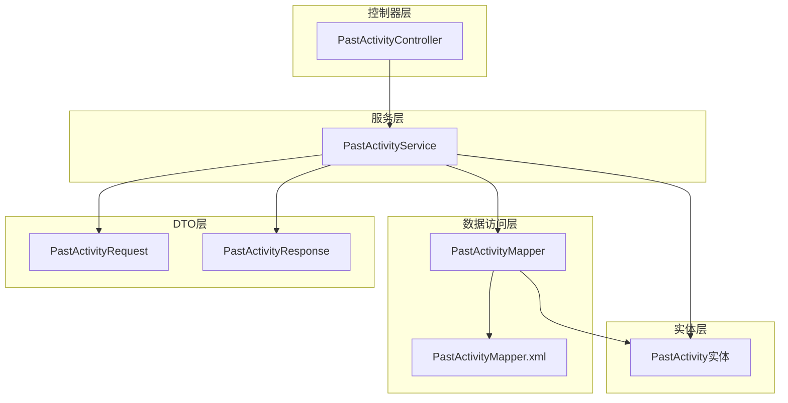
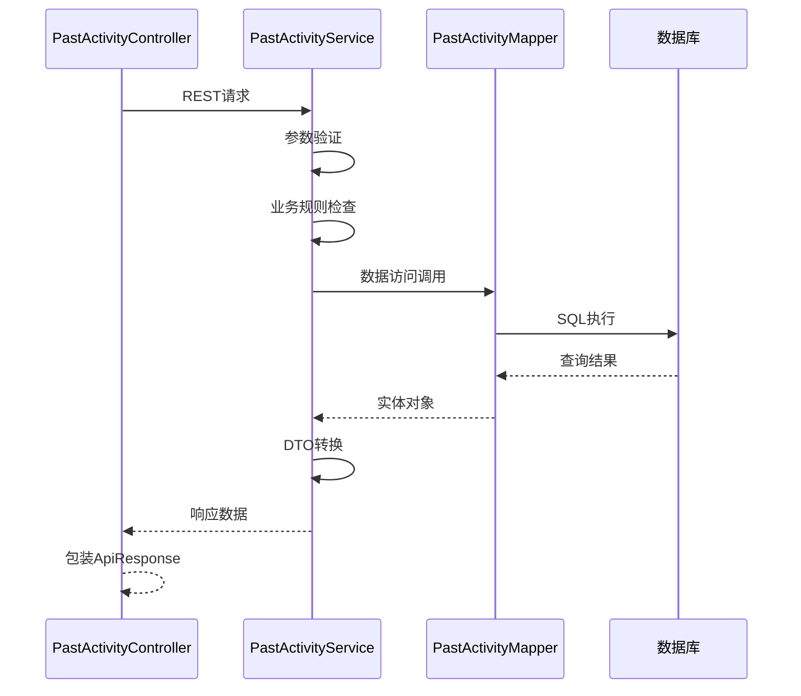
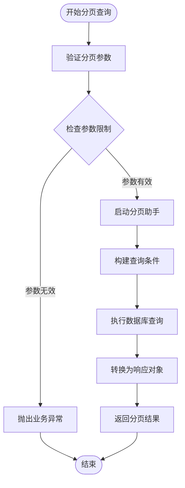
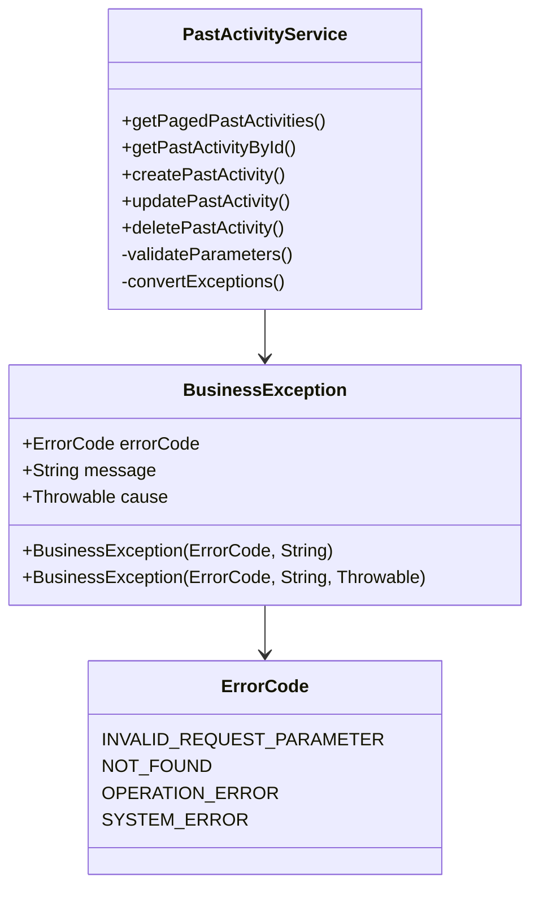
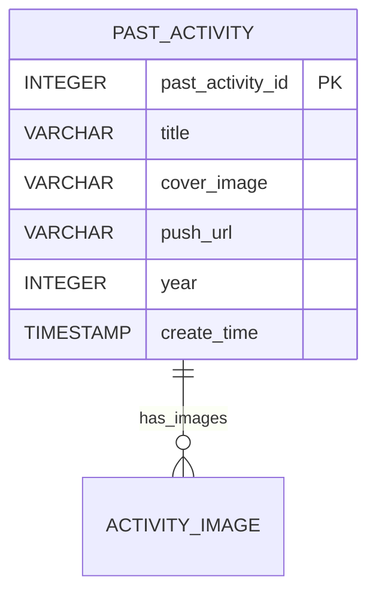
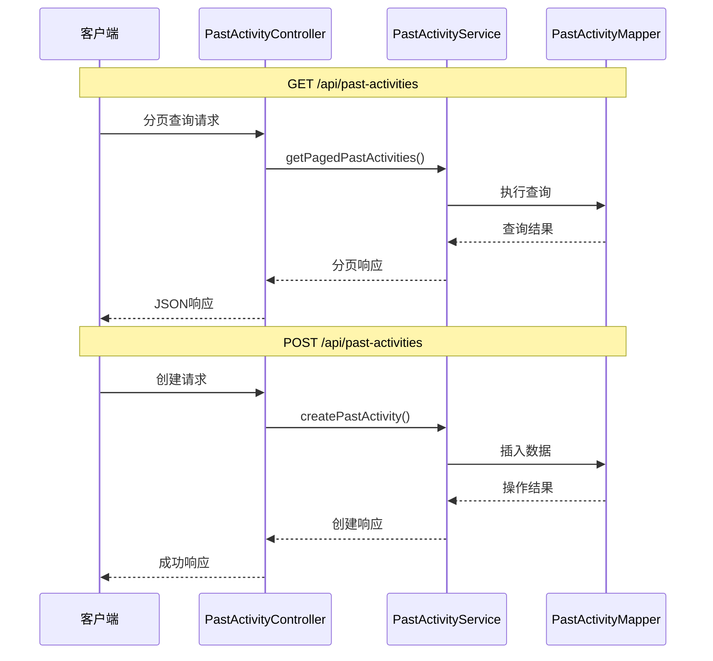
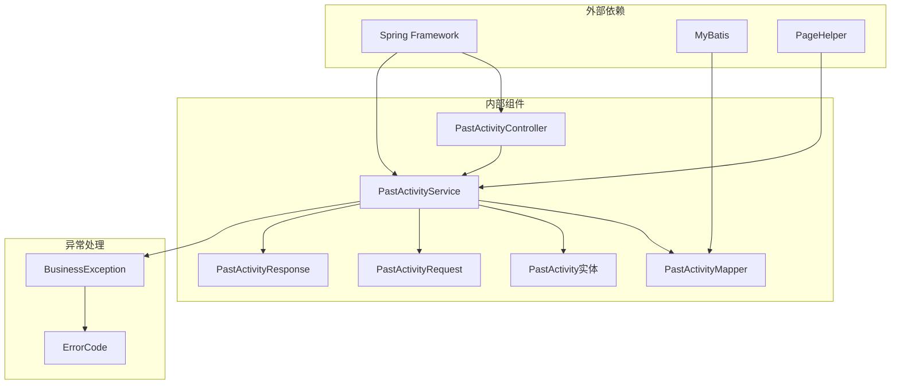

# 往届活动服务

<cite>
**本文档引用的文件**
- [PastActivityService.java](file://src/main/java/com/redmoon2333/service/PastActivityService.java)
- [PastActivityMapper.java](file://src/main/java/com/redmoon2333/mapper/PastActivityMapper.java)
- [PastActivityMapper.xml](file://src/main/resources/mapper/PastActivityMapper.xml)
- [PastActivity.java](file://src/main/java/com/redmoon2333/entity/PastActivity.java)
- [PastActivityRequest.java](file://src/main/java/com/redmoon2333/dto/PastActivityRequest.java)
- [PastActivityResponse.java](file://src/main/java/com/redmoon2333/dto/PastActivityResponse.java)
- [PastActivityController.java](file://src/main/java/com/redmoon2333/controller/PastActivityController.java)
- [ActivityService.java](file://src/main/java/com/redmoon2333/service/ActivityService.java)
</cite>

## 目录
1. [简介](#简介)
2. [项目结构](#项目结构)
3. [核心组件](#核心组件)
4. [架构概览](#架构概览)
5. [详细组件分析](#详细组件分析)
6. [依赖关系分析](#依赖关系分析)
7. [性能考虑](#性能考虑)
8. [故障排除指南](#故障排除指南)
9. [结论](#结论)

## 简介

PastActivityService是人力资源管理系统中专门负责往届活动管理的核心服务组件。该服务专注于历史活动的归档和管理，提供完整的CRUD（创建、读取、更新、删除）功能，同时具备强大的查询能力和数据完整性保障机制。

该服务的设计理念体现了关注点分离的原则，专门处理已经完成的历史活动数据，与正在活跃的活动（由ActivityService管理）形成清晰的功能边界。通过与PastActivityMapper的紧密协作，实现了高效的数据持久化管理。

## 项目结构

PastActivityService在整个系统架构中占据重要位置，作为服务层的核心组件，它连接了控制器层、数据访问层和业务逻辑层：



**图表来源**
- [PastActivityController.java](file://src/main/java/com/redmoon2333/controller/PastActivityController.java#L1-L134)
- [PastActivityService.java](file://src/main/java/com/redmoon2333/service/PastActivityService.java#L1-L305)
- [PastActivityMapper.java](file://src/main/java/com/redmoon2333/mapper/PastActivityMapper.java#L1-L61)

**章节来源**
- [PastActivityService.java](file://src/main/java/com/redmoon2333/service/PastActivityService.java#L1-L305)
- [PastActivityController.java](file://src/main/java/com/redmoon2333/controller/PastActivityController.java#L1-L134)

## 核心组件

PastActivityService提供了六个主要功能模块，每个模块都经过精心设计以确保数据完整性和用户体验：

### CRUD操作模块
- **创建功能**：createPastActivity - 支持完整的往届活动创建流程
- **查询功能**：getPastActivityById 和 getPagedPastActivities - 提供单条查询和分页查询
- **更新功能**：updatePastActivity - 支持部分字段更新
- **删除功能**：deletePastActivity - 安全的删除操作

### 辅助功能模块
- **年份管理**：getAllYears 和 countByYear - 提供年份维度的数据统计
- **业务验证**：内置的年份合理性检查和参数验证

**章节来源**
- [PastActivityService.java](file://src/main/java/com/redmoon2333/service/PastActivityService.java#L40-L305)

## 架构概览

PastActivityService采用经典的三层架构模式，通过Spring框架的依赖注入实现松耦合设计：



**图表来源**
- [PastActivityController.java](file://src/main/java/com/redmoon2333/controller/PastActivityController.java#L30-L134)
- [PastActivityService.java](file://src/main/java/com/redmoon2333/service/PastActivityService.java#L40-L305)

## 详细组件分析

### PastActivityService核心实现

PastActivityService是一个事务性服务，使用Spring的`@Transactional`注解确保数据一致性：

```java
@Service
@Transactional
public class PastActivityService {
    @Autowired
    private PastActivityMapper pastActivityMapper;
}
```

该服务的核心特性包括：

#### 1. 分页查询功能



**图表来源**
- [PastActivityService.java](file://src/main/java/com/redmoon2333/service/PastActivityService.java#L40-L75)

#### 2. 条件查询策略

服务支持灵活的查询条件组合：

- **无条件查询**：查询所有历史活动
- **年份过滤**：按年份筛选历史活动
- **名称模糊搜索**：支持活动标题的模糊匹配
- **组合查询**：年份+标题的联合查询

#### 3. 业务验证机制

每个操作都包含严格的业务验证：

```java
// 年份合理性检查
int currentYear = LocalDateTime.now().getYear();
if (request.getYear() != null && request.getYear() > currentYear) {
    throw new BusinessException(ErrorCode.INVALID_REQUEST_PARAMETER, "年份不能大于当前年份");
}
```

#### 4. 异常处理策略

服务实现了统一的异常处理机制，将不同类型的异常转换为标准化的业务异常：



**图表来源**
- [PastActivityService.java](file://src/main/java/com/redmoon2333/service/PastActivityService.java#L1-L305)

**章节来源**
- [PastActivityService.java](file://src/main/java/com/redmoon2333/service/PastActivityService.java#L40-L305)

### PastActivityMapper数据库交互

PastActivityMapper是数据访问层的核心接口，定义了所有与数据库交互的方法：

```java
@Mapper
public interface PastActivityMapper {
    // 基础CRUD操作
    PastActivity findById(Integer pastActivityId);
    int insert(PastActivity pastActivity);
    int update(PastActivity pastActivity);
    int deleteById(Integer pastActivityId);
    
    // 查询操作
    List<PastActivity> findAll();
    List<PastActivity> findByYear(Integer year);
    List<PastActivity> findByTitleLike(String title);
    List<PastActivity> findByYearAndTitleLike(Integer year, String title);
    
    // 统计操作
    List<Integer> findDistinctYears();
    int countByYear(Integer year);
}
```

#### MyBatis映射配置

数据库操作通过XML配置文件实现，提供了完整的SQL语句：



**图表来源**
- [PastActivityMapper.xml](file://src/main/resources/mapper/PastActivityMapper.xml#L1-L116)

**章节来源**
- [PastActivityMapper.java](file://src/main/java/com/redmoon2333/mapper/PastActivityMapper.java#L1-L61)
- [PastActivityMapper.xml](file://src/main/resources/mapper/PastActivityMapper.xml#L1-L116)

### 数据传输对象（DTO）

#### PastActivityRequest - 请求对象

```java
public class PastActivityRequest {
    @NotBlank(message = "活动标题不能为空")
    private String title;
    
    private String coverImage;
    private String pushUrl;
    
    @NotNull(message = "年份不能为空")
    private Integer year;
}
```

#### PastActivityResponse - 响应对象

```java
public class PastActivityResponse {
    private Integer pastActivityId;
    private String title;
    private String coverImage;
    private String pushUrl;
    private Integer year;
    private LocalDateTime createTime;
    
    // 静态工厂方法
    public static PastActivityResponse from(PastActivity pastActivity) {
        return new PastActivityResponse(pastActivity);
    }
}
```

**章节来源**
- [PastActivityRequest.java](file://src/main/java/com/redmoon2333/dto/PastActivityRequest.java#L1-L73)
- [PastActivityResponse.java](file://src/main/java/com/redmoon2333/dto/PastActivityResponse.java#L1-L102)

### PastActivityController REST接口

PastActivityController提供了完整的REST API接口：



**图表来源**
- [PastActivityController.java](file://src/main/java/com/redmoon2333/controller/PastActivityController.java#L30-L134)

#### 主要API端点

1. **GET /api/past-activities** - 分页查询往届活动
2. **GET /api/past-activities/{id}** - 根据ID查询详细信息
3. **POST /api/past-activities** - 创建新的往届活动
4. **PUT /api/past-activities/{id}** - 更新现有活动
5. **DELETE /api/past-activities/{id}** - 删除往届活动
6. **GET /api/past-activities/years** - 获取所有年份列表
7. **GET /api/past-activities/years/{year}/count** - 统计某年活动数量

**章节来源**
- [PastActivityController.java](file://src/main/java/com/redmoon2333/controller/PastActivityController.java#L30-L134)

## 依赖关系分析

PastActivityService的依赖关系体现了良好的分层架构设计：



**图表来源**
- [PastActivityService.java](file://src/main/java/com/redmoon2333/service/PastActivityService.java#L1-L30)
- [PastActivityController.java](file://src/main/java/com/redmoon2333/controller/PastActivityController.java#L1-L25)

**章节来源**
- [PastActivityService.java](file://src/main/java/com/redmoon2333/service/PastActivityService.java#L1-L305)
- [PastActivityController.java](file://src/main/java/com/redmoon2333/controller/PastActivityController.java#L1-L134)

## 性能考虑

### 分页优化
- 使用PageHelper实现高效的分页查询
- 默认每页10条记录，最大限制100条
- 合理的索引设计支持ORDER BY查询

### 查询优化
- 多条件查询支持灵活组合
- 数据库层面的模糊搜索优化
- 年份字段的索引利用

### 缓存策略
- 适合缓存的场景：年份列表、统计数据
- 不适合缓存的场景：实时查询、频繁更新

## 故障排除指南

### 常见问题及解决方案

#### 1. 分页参数异常
**问题**：页码或每页大小参数无效
**解决方案**：确保参数大于0，每页大小不超过100

#### 2. 年份验证失败
**问题**：创建或更新时年份大于当前年份
**解决方案**：检查系统时间设置，确保年份参数合理

#### 3. 数据库连接异常
**问题**：数据访问层出现连接超时
**解决方案**：检查数据库配置，确认网络连通性

**章节来源**
- [PastActivityService.java](file://src/main/java/com/redmoon2333/service/PastActivityService.java#L40-L305)

## 结论

PastActivityService是一个设计精良、功能完备的服务组件，它在人力资源管理系统中扮演着重要的历史活动管理角色。通过与ActivityService的明确分工，形成了清晰的功能边界，既保证了系统的可维护性，又提高了开发效率。

该服务的主要优势包括：
- **简洁高效的CRUD实现**：遵循标准的CRUD模式，代码结构清晰
- **完善的参数验证**：多层次的验证机制确保数据质量
- **灵活的查询能力**：支持多种查询条件组合
- **强类型的安全性**：通过DTO模式实现类型安全的数据传输
- **统一的异常处理**：标准化的异常处理机制提高系统稳定性

PastActivityService不仅满足了当前的功能需求，还为未来的扩展预留了充足的空间，是整个系统架构中不可或缺的重要组成部分。