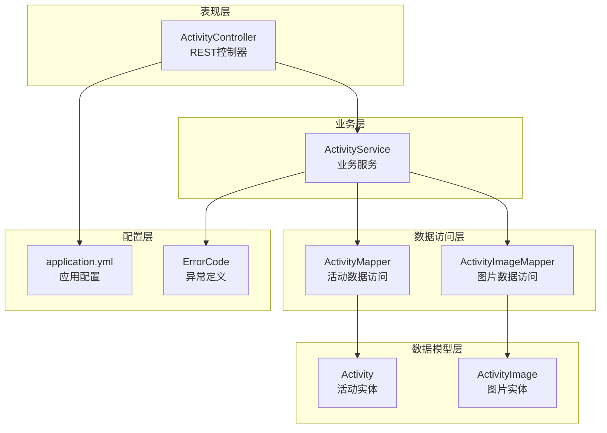
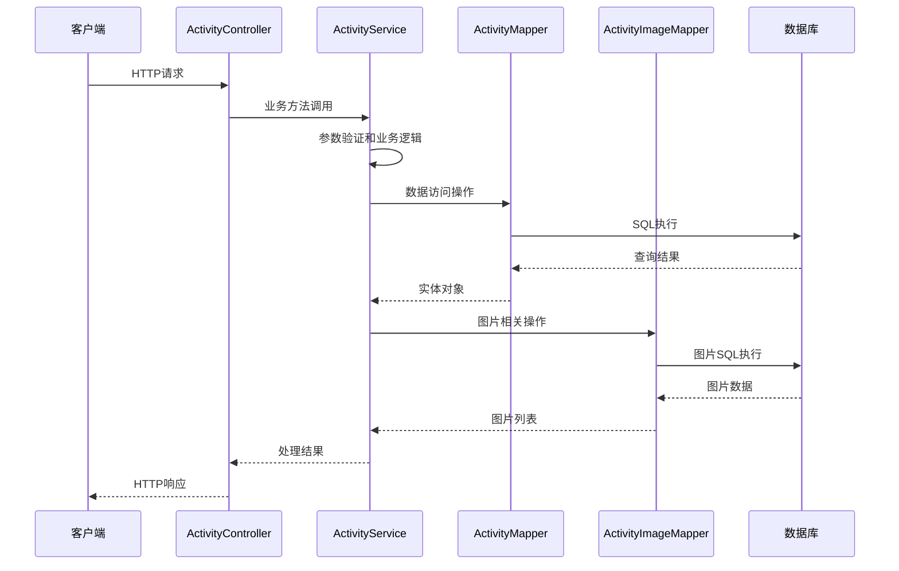
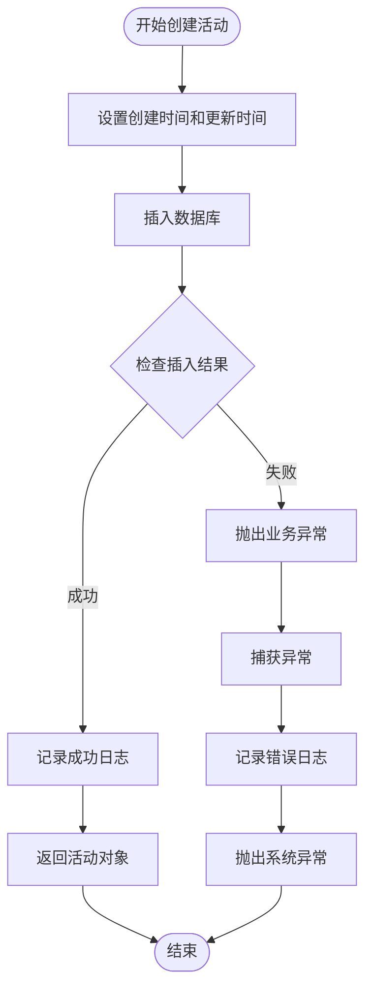
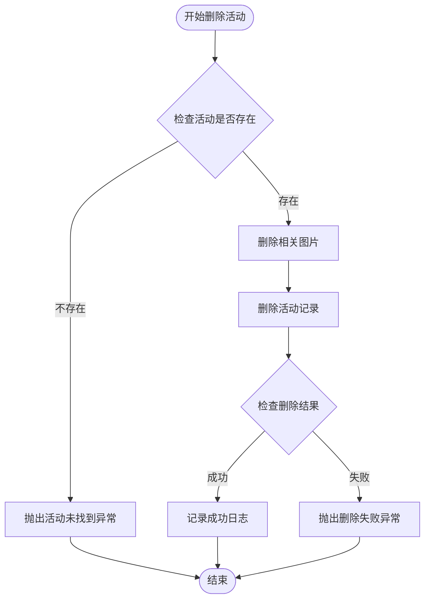
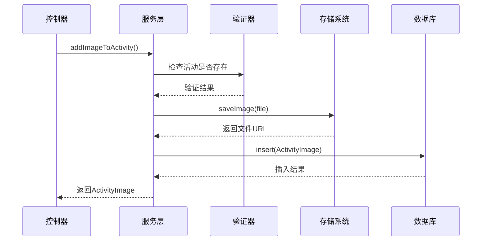
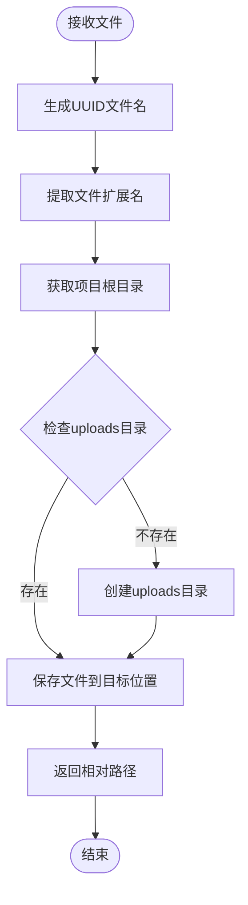
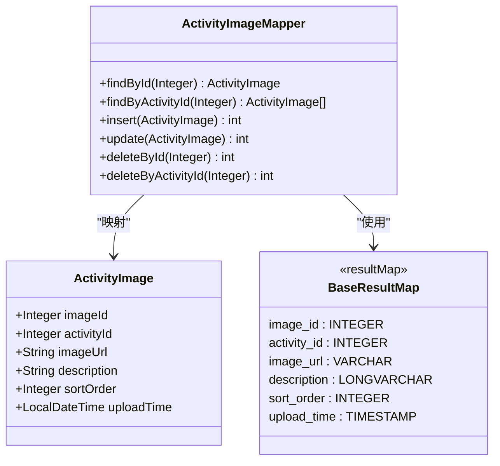
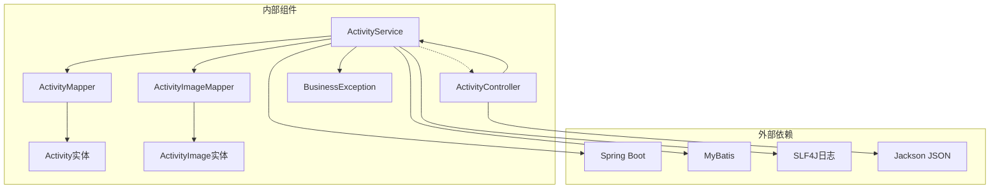
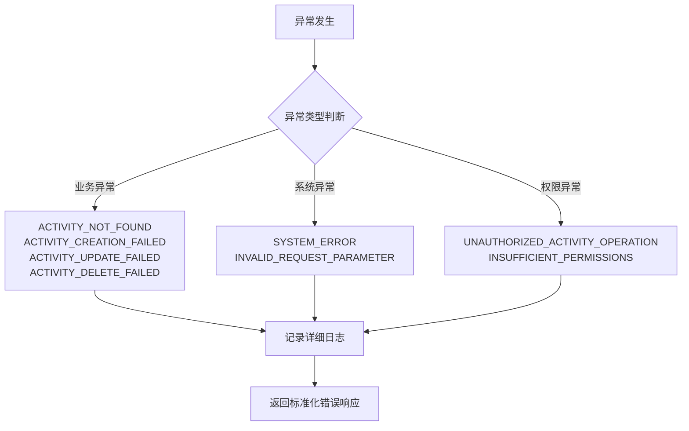

# 活动服务

<cite>
**本文档引用的文件**
- [ActivityService.java](file://src/main/java/com/redmoon2333/service/ActivityService.java)
- [ActivityMapper.java](file://src/main/java/com/redmoon2333/mapper/ActivityMapper.java)
- [ActivityImageMapper.java](file://src/main/java/com/redmoon2333/mapper/ActivityImageMapper.java)
- [Activity.java](file://src/main/java/com/redmoon2333/entity/Activity.java)
- [ActivityImage.java](file://src/main/java/com/redmoon2333/entity/ActivityImage.java)
- [ActivityController.java](file://src/main/java/com/redmoon2333/controller/ActivityController.java)
- [ActivityRequest.java](file://src/main/java/com/redmoon2333/dto/ActivityRequest.java)
- [ActivityResponse.java](file://src/main/java/com/redmoon2333/dto/ActivityResponse.java)
- [BusinessException.java](file://src/main/java/com/redmoon2333/exception/BusinessException.java)
- [ErrorCode.java](file://src/main/java/com/redmoon2333/exception/ErrorCode.java)
- [ActivityImageMapper.xml](file://src/main/resources/mapper/ActivityImageMapper.xml)
- [application.yml](file://src/main/resources/application.yml)
</cite>

## 目录
1. [简介](#简介)
2. [项目结构](#项目结构)
3. [核心组件](#核心组件)
4. [架构概览](#架构概览)
5. [详细组件分析](#详细组件分析)
6. [依赖关系分析](#依赖关系分析)
7. [性能考虑](#性能考虑)
8. [故障排除指南](#故障排除指南)
9. [结论](#结论)

## 简介

ActivityService是人力资源管理系统中负责活动全生命周期管理的核心服务类。该服务实现了完整的CRUD操作体系，包括活动的基本管理（创建、查询、更新、删除）和活动图片的精细化管理。通过Spring Boot框架和MyBatis持久化技术，提供了高效、安全、可扩展的活动管理解决方案。

该服务采用分层架构设计，将业务逻辑与数据访问分离，确保了代码的可维护性和可测试性。通过统一的异常处理机制和详细的日志记录，提供了良好的系统可观测性和错误恢复能力。

## 项目结构

项目采用标准的Maven Java项目结构，遵循分层架构原则：

**图表来源**
- [ActivityController.java](file://src/main/java/com/redmoon2333/controller/ActivityController.java#L1-L319)
- [ActivityService.java](file://src/main/java/com/redmoon2333/service/ActivityService.java#L1-L272)

**章节来源**
- [ActivityController.java](file://src/main/java/com/redmoon2333/controller/ActivityController.java#L1-L50)
- [ActivityService.java](file://src/main/java/com/redmoon2333/service/ActivityService.java#L1-L30)

## 核心组件

ActivityService类作为活动管理的核心组件，包含了以下主要功能模块：

### CRUD操作体系
- **createActivity**: 活动创建操作，包含时间戳设置和异常处理
- **getActivityById**: 活动查询操作，支持单条记录检索
- **updateActivity**: 活动更新操作，包含存在性检查和时间戳更新
- **deleteActivity**: 活动删除操作，包含级联图片删除逻辑

### 图片管理模块
- **addImageToActivity**: 为活动添加图片，包含文件保存和数据库记录
- **getImagesByActivityId**: 获取活动相关图片列表
- **updateActivityImage**: 更新活动图片信息
- **deleteActivityImage**: 删除活动图片

### 文件存储管理
- **saveImage**: 统一的文件保存方法，生成唯一文件名并存储到指定目录

**章节来源**
- [ActivityService.java](file://src/main/java/com/redmoon2333/service/ActivityService.java#L25-L272)

## 架构概览

ActivityService采用了经典的三层架构模式，实现了清晰的职责分离：

**图表来源**
- [ActivityController.java](file://src/main/java/com/redmoon2333/controller/ActivityController.java#L40-L80)
- [ActivityService.java](file://src/main/java/com/redmoon2333/service/ActivityService.java#L30-L60)

## 详细组件分析

### 活动CRUD操作详解

#### createActivity方法分析

createActivity方法实现了活动的完整创建流程：

**图表来源**
- [ActivityService.java](file://src/main/java/com/redmoon2333/service/ActivityService.java#L30-L50)

该方法的关键特性：
- 自动设置创建时间和更新时间为当前时间
- 使用数据库自增主键生成activityId
- 提供详细的日志记录，便于问题追踪
- 统一的异常处理机制，区分业务异常和系统异常

#### deleteActivity方法的级联删除逻辑

deleteActivity方法展示了完整的级联删除策略：

**图表来源**
- [ActivityService.java](file://src/main/java/com/redmoon2333/service/ActivityService.java#L90-L115)

这种设计确保了：
- 数据完整性：活动删除时自动清理相关图片
- 异常安全性：任何一步失败都会阻止后续操作
- 日志审计：每一步操作都有详细的日志记录

**章节来源**
- [ActivityService.java](file://src/main/java/com/redmoon2333/service/ActivityService.java#L30-L115)

### 图片管理模块深度分析

#### addImageToActivity方法实现

addImageToActivity方法展示了完整的图片添加流程：

**图表来源**
- [ActivityService.java](file://src/main/java/com/redmoon2333/service/ActivityService.java#L160-L190)

#### saveImage工具方法的文件存储策略

saveImage方法实现了安全的文件存储机制：

**图表来源**
- [ActivityService.java](file://src/main/java/com/redmoon2333/service/ActivityService.java#L120-L150)

文件存储策略特点：
- **安全性**: 使用UUID避免文件名冲突和路径遍历攻击
- **组织性**: 所有上传文件统一存放在/updates目录
- **可访问性**: 返回相对路径，便于前端直接访问
- **扩展性**: 支持多种文件格式，只需正确设置MIME类型

**章节来源**
- [ActivityService.java](file://src/main/java/com/redmoon2333/service/ActivityService.java#L120-L200)

### 数据访问层集成分析

#### MyBatis映射配置优化

ActivityImageMapper的XML配置展现了MyBatis的强大功能：

**图表来源**
- [ActivityImageMapper.java](file://src/main/java/com/redmoon2333/mapper/ActivityImageMapper.java#L1-L41)
- [ActivityImageMapper.xml](file://src/main/resources/mapper/ActivityImageMapper.xml#L1-L86)

**章节来源**
- [ActivityImageMapper.java](file://src/main/java/com/redmoon2333/mapper/ActivityImageMapper.java#L1-L41)
- [ActivityImageMapper.xml](file://src/main/resources/mapper/ActivityImageMapper.xml#L1-L86)

## 依赖关系分析

ActivityService的依赖关系展现了清晰的分层架构：

**图表来源**
- [ActivityService.java](file://src/main/java/com/redmoon2333/service/ActivityService.java#L1-L20)
- [ActivityController.java](file://src/main/java/com/redmoon2333/controller/ActivityController.java#L1-L30)

**章节来源**
- [ActivityService.java](file://src/main/java/com/redmoon2333/service/ActivityService.java#L1-L20)

## 性能考虑

### 数据库优化策略

1. **索引设计**: ActivityImage表按activity_id建立索引，支持快速查询
2. **批量操作**: deleteByActivityId支持批量删除，减少数据库交互
3. **延迟加载**: 图片列表按sort_order和upload_time排序，支持懒加载

### 缓存策略建议

虽然当前实现没有缓存，但可以考虑以下优化：
- 活动基本信息缓存，减少数据库查询
- 图片URL缓存，提高图片访问速度
- 使用Redis存储热点数据

### 文件存储优化

1. **CDN集成**: 建议将上传的图片部署到CDN，提高访问速度
2. **压缩处理**: 对上传图片进行压缩，减少存储空间
3. **格式限制**: 限制上传文件格式，提高安全性

## 故障排除指南

### 常见异常处理

ActivityService通过ErrorCode枚举定义了详细的错误码：

**图表来源**
- [ErrorCode.java](file://src/main/java/com/redmoon2333/exception/ErrorCode.java#L1-L55)

### 日志审计机制

每个关键操作都包含详细的日志记录：

- **INFO级别**: 操作成功完成，包含操作类型和关键参数
- **DEBUG级别**: 操作过程细节，包含参数值和中间状态
- **WARN级别**: 异常情况，包含警告信息和上下文
- **ERROR级别**: 错误发生，包含堆栈跟踪和详细信息

**章节来源**
- [ActivityService.java](file://src/main/java/com/redmoon2333/service/ActivityService.java#L30-L115)
- [ErrorCode.java](file://src/main/java/com/redmoon2333/exception/ErrorCode.java#L1-L55)

### 安全考虑和最佳实践

#### 文件上传安全

1. **文件类型验证**: 建议在控制器层添加文件类型检查
2. **文件大小限制**: 在application.yml中配置最大文件大小
3. **恶意文件检测**: 集成文件扫描服务检测潜在威胁
4. **访问控制**: 限制对上传文件的直接访问权限

#### 数据库安全

1. **SQL注入防护**: MyBatis自动参数化查询，有效防止SQL注入
2. **连接池配置**: 合理配置数据库连接池参数
3. **事务管理**: 确保级联操作的原子性

#### 权限控制

1. **角色验证**: 使用@RequireMinisterRole注解确保只有部长或副部长能操作
2. **操作审计**: 记录每次操作的用户信息和操作时间
3. **敏感信息保护**: 不在日志中记录敏感字段

## 结论

ActivityService展现了现代Java企业应用开发的最佳实践：

### 技术优势

1. **架构清晰**: 分层架构确保了代码的可维护性和可扩展性
2. **异常处理完善**: 统一的异常处理机制提高了系统的健壮性
3. **日志记录全面**: 详细的日志记录为系统监控和问题排查提供了有力支持
4. **安全性考虑**: 文件存储路径的安全设计和权限控制机制

### 功能完整性

1. **全生命周期管理**: 从活动创建到删除的完整流程覆盖
2. **图片管理精细化**: 支持图片的增删改查和排序功能
3. **文件存储标准化**: 统一的文件命名和存储策略
4. **RESTful API设计**: 符合REST规范的接口设计

### 改进建议

1. **缓存机制**: 引入适当的缓存策略提高性能
2. **异步处理**: 对耗时操作（如文件上传）考虑异步处理
3. **监控告警**: 集成APM工具进行系统监控
4. **单元测试**: 补充完善的单元测试覆盖关键业务逻辑

ActivityService作为人力资源管理系统的核心组件，为活动管理提供了稳定、安全、高效的解决方案。其设计充分体现了软件工程的最佳实践，为后续的功能扩展和系统优化奠定了坚实的基础。