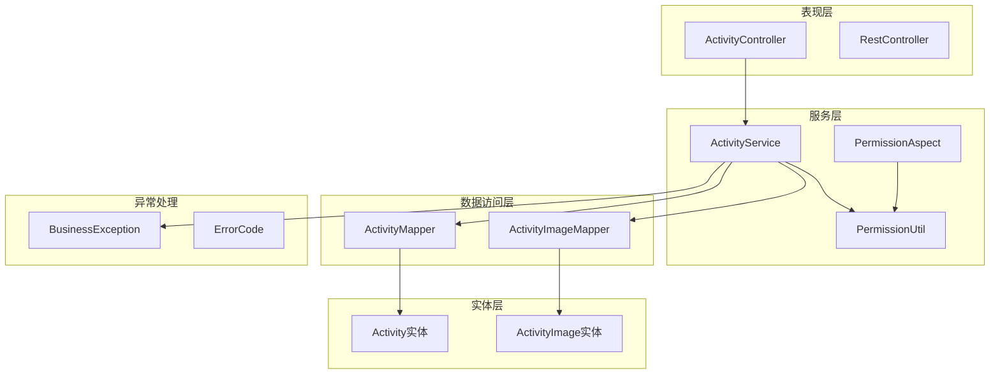
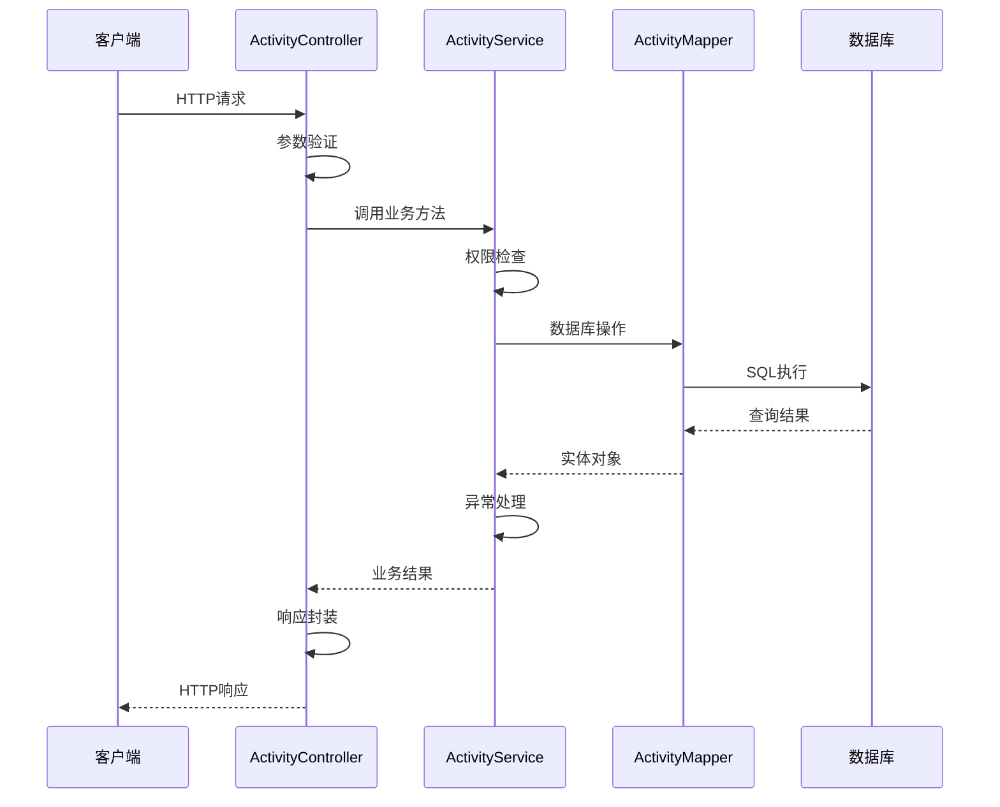
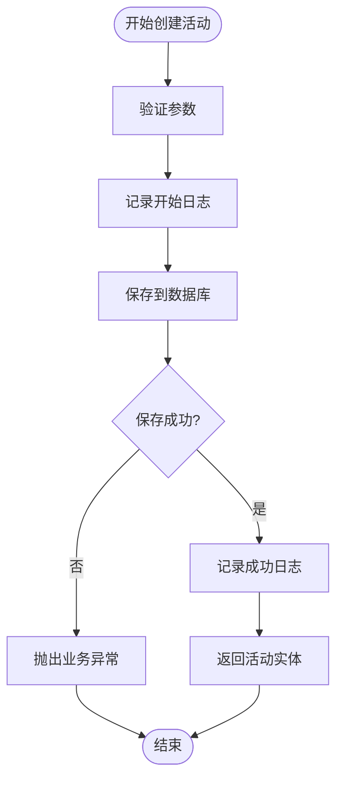
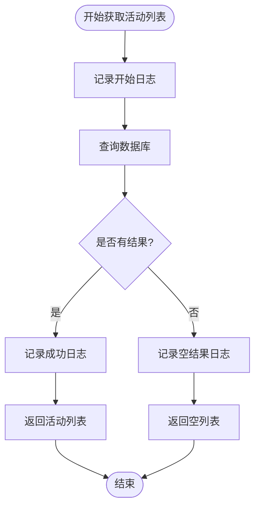
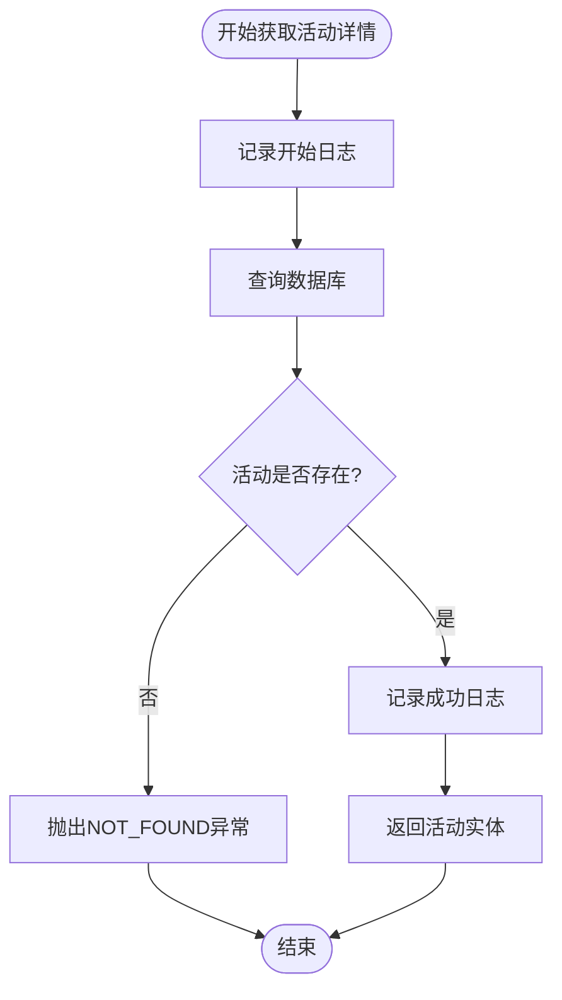
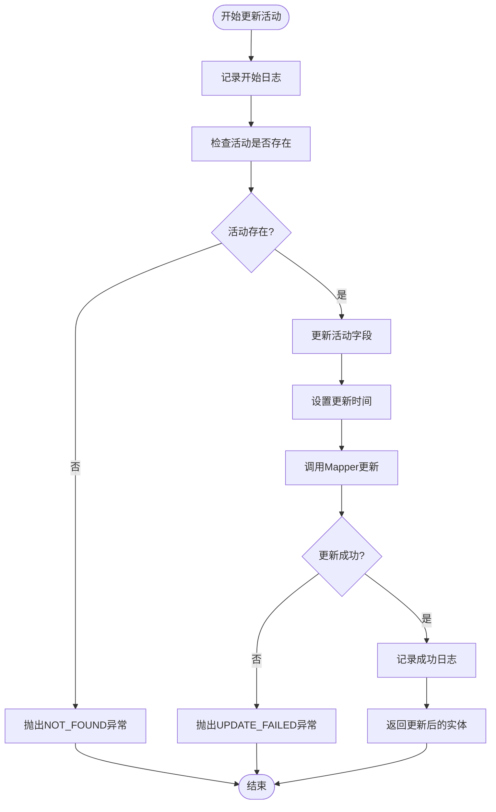
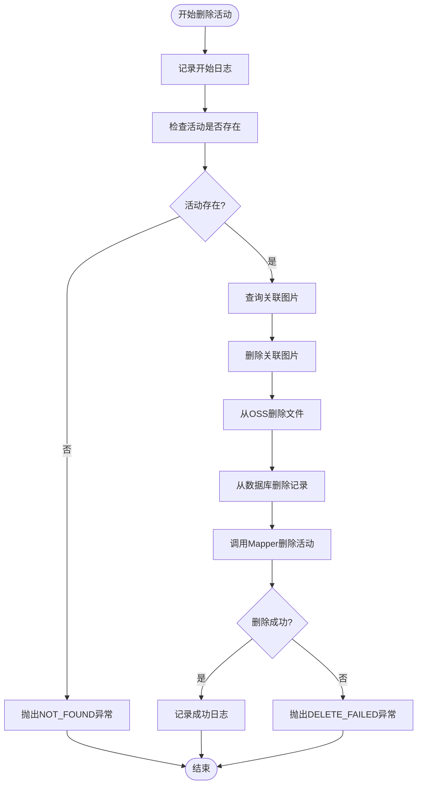
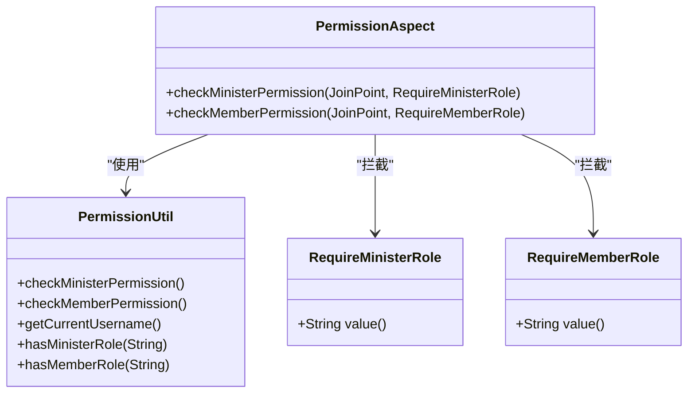

# 活动主体管理

<cite>
**本文档引用的文件**
- [ActivityService.java](file://src/main/java/com/redmoon2333/service/ActivityService.java)
- [ActivityController.java](file://src/main/java/com/redmoon2333/controller/ActivityController.java)
- [Activity.java](file://src/main/java/com/redmoon2333/entity/Activity.java)
- [ActivityRequest.java](file://src/main/java/com/redmoon2333/dto/ActivityRequest.java)
- [ActivityResponse.java](file://src/main/java/com/redmoon2333/dto/ActivityResponse.java)
- [ActivityImage.java](file://src/main/java/com/redmoon2333/entity/ActivityImage.java)
- [ActivityImageDTO.java](file://src/main/java/com/redmoon2333/dto/ActivityImageDTO.java)
- [ActivityMapper.java](file://src/main/java/com/redmoon2333/mapper/ActivityMapper.java)
- [ActivityImageMapper.java](file://src/main/java/com/redmoon2333/mapper/ActivityImageMapper.java)
- [ErrorCode.java](file://src/main/java/com/redmoon2333/exception/ErrorCode.java)
- [BusinessException.java](file://src/main/java/com/redmoon2333/exception/BusinessException.java)
- [PermissionUtil.java](file://src/main/java/com/redmoon2333/util/PermissionUtil.java)
- [PermissionAspect.java](file://src/main/java/com/redmoon2333/aspect/PermissionAspect.java)
- [RequireMinisterRole.java](file://src/main/java/com/redmoon2333/annotation/RequireMinisterRole.java)
</cite>

## 目录
1. [简介](#简介)
2. [项目结构概览](#项目结构概览)
3. [核心组件分析](#核心组件分析)
4. [架构概览](#架构概览)
5. [详细组件分析](#详细组件分析)
6. [依赖关系分析](#依赖关系分析)
7. [性能考虑](#性能考虑)
8. [故障排除指南](#故障排除指南)
9. [结论](#结论)

## 简介

本文档深入分析了Human Resource Official系统中ActivityService活动主体管理模块的核心实现。该模块负责管理组织内部各类活动的生命周期，包括活动的创建、查询、更新、删除等核心业务操作。系统采用Spring Boot框架构建，遵循分层架构设计原则，实现了完整的REST API接口和严格的权限控制机制。

ActivityService作为服务层的核心组件，提供了五个主要的业务方法：`createActivity`、`getAllActivities`、`getActivityById`、`updateActivity`和`deleteActivity`。这些方法不仅处理基本的CRUD操作，还包含了复杂的数据验证、异常处理、日志记录和事务管理等功能。

## 项目结构概览

系统采用标准的MVC架构模式，按照功能模块进行清晰的层次划分：



**图表来源**
- [ActivityController.java](file://src/main/java/com/redmoon2333/controller/ActivityController.java#L1-L322)
- [ActivityService.java](file://src/main/java/com/redmoon2333/service/ActivityService.java#L1-L376)

**章节来源**
- [ActivityController.java](file://src/main/java/com/redmoon2333/controller/ActivityController.java#L1-L50)
- [ActivityService.java](file://src/main/java/com/redmoon2333/service/ActivityService.java#L1-L30)

## 核心组件分析

### Activity实体类

Activity实体类是整个活动管理系统的核心数据模型，定义了活动的基本属性和行为：

```java
@Entity
@Table(name = "activity")
public class Activity {
    @Id
    @GeneratedValue(strategy = GenerationType.IDENTITY)
    @Column(name = "activity_id")
    private Integer activityId;
    
    @Column(name = "activity_name")
    private String activityName;
    
    @Column(name = "background")
    private String background;
    
    @Column(name = "significance")
    private String significance;
    
    @Column(name = "purpose")
    private String purpose;
    
    @Column(name = "process")
    private String process;
    
    @Column(name = "create_time")
    private LocalDateTime createTime;
    
    @Column(name = "update_time")
    private LocalDateTime updateTime;
}
```

该实体类采用了JPA注解，支持与数据库的自动映射。每个活动实例都包含以下关键属性：
- **活动基本信息**：名称、背景、意义、目的、流程
- **时间戳字段**：创建时间和更新时间，用于跟踪活动的生命周期
- **主键标识**：自增的activityId作为数据库记录的唯一标识符

### 数据传输对象（DTO）

系统定义了专门的DTO类来处理不同层次间的数据传输：

#### ActivityRequest - 请求数据对象
```java
public class ActivityRequest {
    @NotBlank(message = "活动名称不能为空")
    @Size(max = 255, message = "活动名称长度不能超过255个字符")
    private String activityName;
    
    @NotBlank(message = "活动背景不能为空")
    private String background;
    
    @NotBlank(message = "活动意义不能为空")
    private String significance;
    
    @NotBlank(message = "活动目的不能为空")
    private String purpose;
    
    @NotBlank(message = "活动流程不能为空")
    private String process;
}
```

#### ActivityResponse - 响应数据对象
```java
public class ActivityResponse {
    private Integer activityId;
    private String activityName;
    private String background;
    private String significance;
    private String purpose;
    private String process;
    private LocalDateTime createTime;
    private LocalDateTime updateTime;
}
```

**章节来源**
- [Activity.java](file://src/main/java/com/redmoon2333/entity/Activity.java#L1-L127)
- [ActivityRequest.java](file://src/main/java/com/redmoon2333/dto/ActivityRequest.java#L1-L63)
- [ActivityResponse.java](file://src/main/java/com/redmoon2333/dto/ActivityResponse.java#L1-L94)

## 架构概览

ActivityService模块采用了经典的分层架构设计，确保了代码的可维护性和扩展性：



**图表来源**
- [ActivityController.java](file://src/main/java/com/redmoon2333/controller/ActivityController.java#L40-L80)
- [ActivityService.java](file://src/main/java/com/redmoon2333/service/ActivityService.java#L30-L60)

## 详细组件分析

### createActivity 方法实现

`createActivity`方法是活动创建的核心入口，实现了完整的数据持久化流程：



**图表来源**
- [ActivityService.java](file://src/main/java/com/redmoon2333/service/ActivityService.java#L28-L37)

该方法的核心实现逻辑如下：

1. **参数验证**：接收Activity实体对象，确保数据完整性
2. **日志记录**：记录活动创建的开始信息，便于后续审计
3. **数据持久化**：通过ActivityMapper的insert方法将活动信息写入数据库
4. **结果处理**：返回已保存的活动实体，其中包含自动生成的activityId

### getAllActivities 方法实现

`getAllActivities`方法提供活动列表查询功能：



**图表来源**
- [ActivityService.java](file://src/main/java/com/redmoon2333/service/ActivityService.java#L40-L50)

该方法的特点：
- **异常处理**：捕获所有异常并转换为BusinessException
- **日志记录**：记录查询结果的数量，便于监控
- **性能优化**：直接返回数据库查询结果，避免不必要的数据转换

### getActivityById 方法实现

`getActivityById`方法实现了单个活动的详细查询：



**图表来源**
- [ActivityService.java](file://src/main/java/com/redmoon2333/service/ActivityService.java#L56-L75)

该方法的关键特性：
- **存在性检查**：先验证活动是否存在，避免无效查询
- **精确异常处理**：针对不同的错误场景抛出相应的业务异常
- **日志追踪**：记录详细的查询信息，支持问题排查

### updateActivity 方法实现

`updateActivity`方法实现了活动信息的更新操作：



**图表来源**
- [ActivityService.java](file://src/main/java/com/redmoon2333/service/ActivityService.java#L77-L112)

该方法的字段级控制机制：
- **选择性更新**：只更新传入的字段，保持其他字段不变
- **时间戳管理**：自动更新updateTime字段，反映最后修改时间
- **原子性操作**：通过数据库事务保证更新操作的原子性

### deleteActivity 方法实现

`deleteActivity`方法是最复杂的操作之一，涉及多表数据的清理：



**图表来源**
- [ActivityService.java](file://src/main/java/com/redmoon2333/service/ActivityService.java#L114-L170)

该方法的清理策略：
- **级联删除**：先删除关联的图片记录，再删除活动本身
- **OSS文件清理**：从阿里云OSS存储中删除对应的图片文件
- **事务一致性**：确保数据库操作和文件删除的一致性

**章节来源**
- [ActivityService.java](file://src/main/java/com/redmoon2333/service/ActivityService.java#L28-L170)

## 权限控制机制

系统实现了基于角色的权限控制机制，确保只有授权用户才能执行特定操作：

### 权限验证切面



**图表来源**
- [PermissionAspect.java](file://src/main/java/com/redmoon2333/aspect/PermissionAspect.java#L1-L57)
- [PermissionUtil.java](file://src/main/java/com/redmoon2333/util/PermissionUtil.java#L1-L163)

### REST接口权限控制

ActivityController中的各个方法都应用了适当的权限注解：

```java
@PostMapping
@RequireMinisterRole("创建活动")
public ResponseEntity<ApiResponse<ActivityResponse>> createActivity(...) {
    // 只有部长或副部长能创建活动
}

@PutMapping("/{activityId}")
@RequireMinisterRole("更新活动")
public ResponseEntity<ApiResponse<ActivityResponse>> updateActivity(...) {
    // 只有部长或副部长能更新活动
}

@DeleteMapping("/{activityId}")
@RequireMinisterRole("删除活动")
public ResponseEntity<ApiResponse<Void>> deleteActivity(...) {
    // 只有部长或副部长能删除活动
}

@GetMapping("/{activityId}")
public ResponseEntity<ApiResponse<ActivityResponse>> getActivityById(...) {
    // 公开接口，无需鉴权
}

@GetMapping
public ResponseEntity<ApiResponse<List<ActivityResponse>>> getAllActivities(...) {
    // 公开接口，无需鉴权
}
```

**章节来源**
- [ActivityController.java](file://src/main/java/com/redmoon2333/controller/ActivityController.java#L40-L200)
- [PermissionAspect.java](file://src/main/java/com/redmoon2333/aspect/PermissionAspect.java#L1-L57)

## 异常处理与日志记录

### BusinessException封装模式

系统采用统一的异常处理机制，通过BusinessException类封装业务异常：

```java
public class BusinessException extends RuntimeException {
    private final ErrorCode errorCode;
    
    public BusinessException(ErrorCode errorCode) {
        super(errorCode.getMessage());
        this.errorCode = errorCode;
    }
    
    public BusinessException(ErrorCode errorCode, String message) {
        super(message);
        this.errorCode = errorCode;
    }
    
    public ErrorCode getErrorCode() {
        return errorCode;
    }
}
```

### 错误码使用规范

ErrorCode枚举定义了完整的错误码体系：

```java
public enum ErrorCode {
    // 活动相关错误 6000-6999
    ACTIVITY_NOT_FOUND(6001, "活动不存在"),
    ACTIVITY_ALREADY_EXISTS(6002, "活动已存在"),
    ACTIVITY_CREATION_FAILED(6003, "活动创建失败"),
    ACTIVITY_UPDATE_FAILED(6004, "活动更新失败"),
    ACTIVITY_DELETE_FAILED(6005, "活动删除失败"),
    ACTIVITY_LIST_FAILED(6006, "活动列表获取失败"),
    ACTIVITY_DETAIL_FAILED(6007, "活动详情获取失败"),
    
    // 活动图片相关错误 6100-6199
    ACTIVITY_IMAGE_SAVE_FAILED(6101, "活动图片保存失败"),
    ACTIVITY_IMAGE_DELETE_FAILED(6102, "活动图片删除失败"),
    ACTIVITY_IMAGE_LIST_FAILED(6103, "活动图片列表获取失败"),
    ACTIVITY_IMAGE_NOT_FOUND(6104, "活动图片不存在"),
    ACTIVITY_IMAGE_UPDATE_FAILED(6105, "活动图片更新失败"),
}
```

### 日志记录策略

每个业务方法都实现了完整的日志记录：

```java
// 创建活动的日志记录
logger.info("开始创建活动: {}", activity.getActivityName());
logger.info("活动创建成功，活动ID: {}", activity.getActivityId());

// 获取活动详情的日志记录  
logger.info("根据ID获取活动详情: ID={}", activityId);
logger.info("成功获取活动详情: ID={}", activityId);

// 更新活动的日志记录
logger.info("开始更新活动: ID={}", activityId);
logger.info("活动更新成功: ID={}", activityId);

// 删除活动的日志记录
logger.info("开始删除活动: ID={}", activityId);
logger.info("活动删除成功: ID={}, 关联图片{}张", activityId, images.size());
```

**章节来源**
- [BusinessException.java](file://src/main/java/com/redmoon2333/exception/BusinessException.java#L1-L24)
- [ErrorCode.java](file://src/main/java/com/redmoon2333/exception/ErrorCode.java#L1-L77)

## 典型使用场景

### 场景一：部长创建活动

```java
// 1. 部长通过POST /api/activities接口提交活动创建请求
@PostMapping
@RequireMinisterRole("创建活动")
public ResponseEntity<ApiResponse<ActivityResponse>> createActivity(@Valid @RequestBody ActivityRequest activityRequest) {
    // 2. 控制器接收请求并验证参数
    Activity activity = new Activity();
    BeanUtils.copyProperties(activityRequest, activity);
    activity.setCreateTime(LocalDateTime.now());
    activity.setUpdateTime(LocalDateTime.now());
    
    // 3. 调用ActivityService.createActivity方法
    Activity savedActivity = activityService.createActivity(activity);
    
    // 4. 返回成功响应
    ActivityResponse response = new ActivityResponse();
    BeanUtils.copyProperties(savedActivity, response);
    return ResponseEntity.ok(ApiResponse.success("活动创建成功", response));
}
```

### 场景二：部员查看活动列表

```java
// 1. 部员通过GET /api/activities接口查询活动列表
@GetMapping
public ResponseEntity<ApiResponse<List<ActivityResponse>>> getAllActivities() {
    // 2. ActivityService.getAllActivities方法执行查询
    List<Activity> activities = activityService.getAllActivities();
    
    // 3. 转换为响应对象列表
    List<ActivityResponse> responseList = activities.stream()
        .map(activity -> {
            ActivityResponse response = new ActivityResponse();
            BeanUtils.copyProperties(activity, response);
            return response;
        })
        .collect(Collectors.toList());
    
    // 4. 返回成功响应
    return ResponseEntity.ok(ApiResponse.success("查询成功", responseList));
}
```

### 场景三：部长更新活动信息

```java
// 1. 部长通过PUT /api/activities/{id}接口提交更新请求
@PutMapping("/{activityId}")
@RequireMinisterRole("更新活动")
public ResponseEntity<ApiResponse<ActivityResponse>> updateActivity(
        @PathVariable Integer activityId, 
        @Valid @RequestBody ActivityRequest activityRequest) {
    
    // 2. 先查询现有活动
    Activity existingActivity = activityService.getActivityById(activityId);
    
    // 3. 更新活动信息
    BeanUtils.copyProperties(activityRequest, existingActivity);
    existingActivity.setUpdateTime(LocalDateTime.now());
    
    // 4. 调用ActivityService.updateActivity方法
    Activity updatedActivity = activityService.updateActivity(activityId, existingActivity);
    
    // 5. 返回更新后的响应
    ActivityResponse response = new ActivityResponse();
    BeanUtils.copyProperties(updatedActivity, response);
    return ResponseEntity.ok(ApiResponse.success("活动更新成功", response));
}
```

## 性能考虑

### 数据库查询优化

1. **索引策略**：activity_id字段作为主键，自动建立索引
2. **查询优化**：selectById方法使用精确匹配查询，避免全表扫描
3. **批量操作**：deleteActivity方法支持批量删除关联图片

### 缓存策略

虽然当前实现没有显式的缓存机制，但可以通过以下方式优化：
- 在ActivityService中引入Redis缓存
- 对频繁查询的活动列表实施缓存
- 缓存活动详情以减少数据库访问

### 并发控制

系统通过以下机制保证并发安全：
- 数据库层面的行级锁
- 业务逻辑中的存在性检查
- 事务管理确保操作原子性

## 故障排除指南

### 常见异常及解决方案

#### 1. ACTIVITY_NOT_FOUND异常
**原因**：尝试操作不存在的活动
**解决方案**：在调用前使用getActivityById方法验证活动存在性

#### 2. ACTIVITY_CREATION_FAILED异常
**原因**：数据库插入失败或违反约束条件
**解决方案**：检查数据库连接状态和字段约束

#### 3. ACTIVITY_UPDATE_FAILED异常
**原因**：更新操作失败或并发冲突
**解决方案**：检查数据完整性和并发控制

#### 4. UNAUTHORIZED_ACTIVITY_OPERATION异常
**原因**：用户权限不足
**解决方案**：确认用户具有部长或副部长身份

### 调试技巧

1. **启用DEBUG日志**：设置日志级别为DEBUG以获取详细信息
2. **检查数据库状态**：验证数据库连接和表结构
3. **验证权限配置**：确认JWT令牌和用户身份信息
4. **监控系统资源**：检查内存和CPU使用情况

**章节来源**
- [ActivityService.java](file://src/main/java/com/redmoon2333/service/ActivityService.java#L56-L170)
- [PermissionUtil.java](file://src/main/java/com/redmoon2333/util/PermissionUtil.java#L20-L80)

## 结论

ActivityService模块展现了现代Java企业应用开发的最佳实践，通过清晰的分层架构、完善的异常处理、严格的权限控制和详尽的日志记录，构建了一个稳定可靠的活动管理平台。

### 主要优势

1. **架构清晰**：采用标准的MVC架构，职责分离明确
2. **异常处理完善**：统一的BusinessException封装，便于错误管理和用户体验
3. **权限控制严格**：基于角色的权限验证，确保系统安全性
4. **日志记录详尽**：完整的操作日志，支持问题追踪和审计
5. **代码质量高**：遵循编码规范，具有良好的可读性和可维护性

### 改进建议

1. **引入缓存机制**：对频繁查询的活动列表实施缓存
2. **增加单元测试**：为关键业务方法编写全面的单元测试
3. **性能监控**：集成APM工具监控系统性能指标
4. **异步处理**：对于耗时操作（如图片上传）考虑异步处理
5. **API版本控制**：为REST接口实施版本控制策略

通过持续的优化和改进，ActivityService模块将继续为组织的人力资源管理提供强有力的技术支撑。