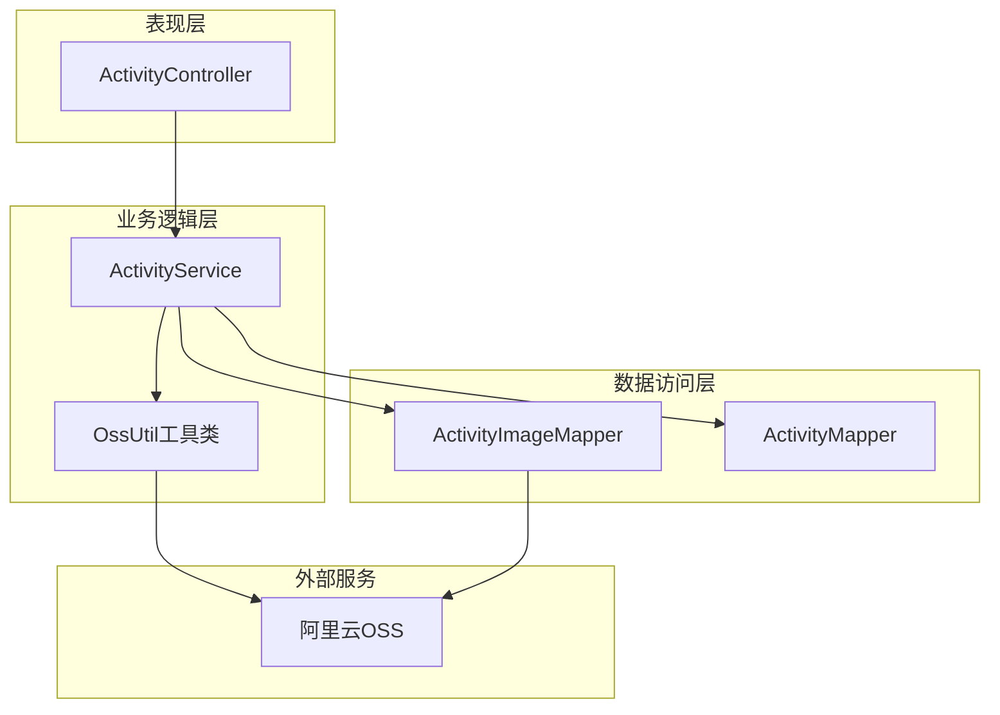
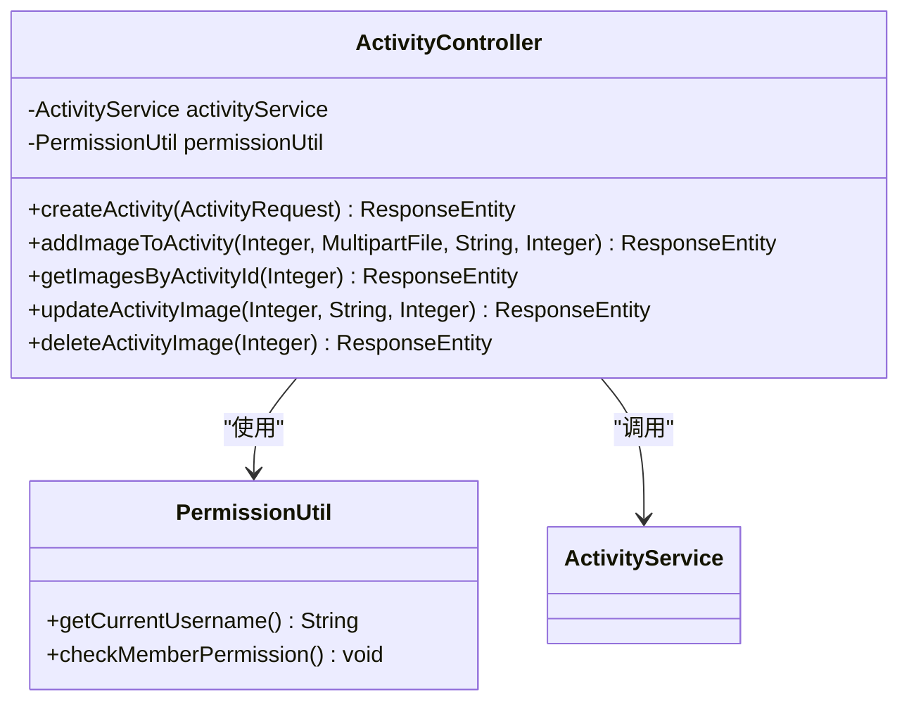
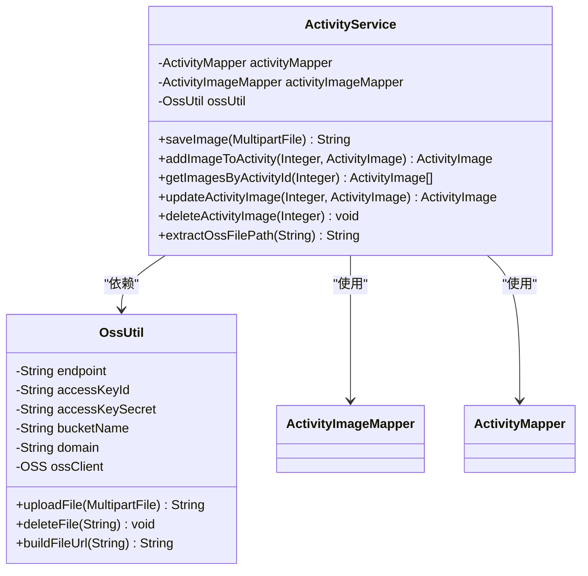
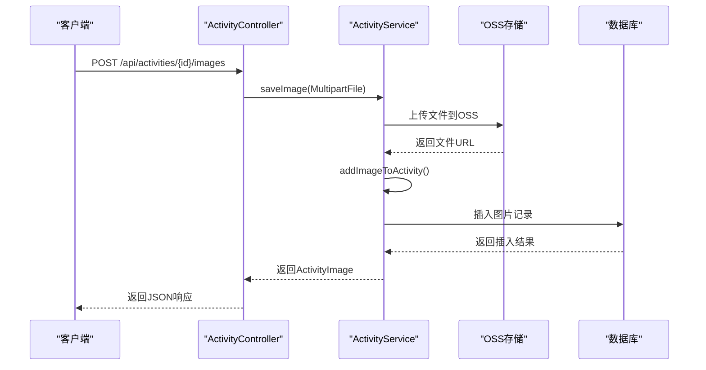
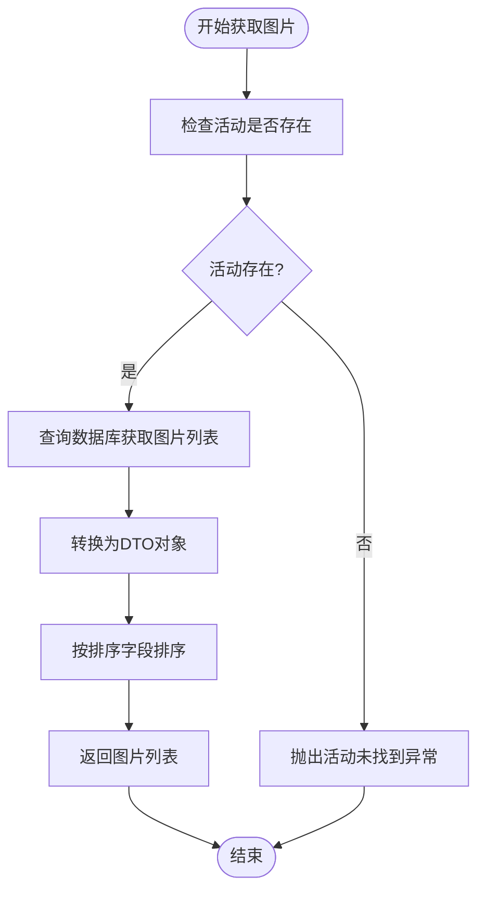
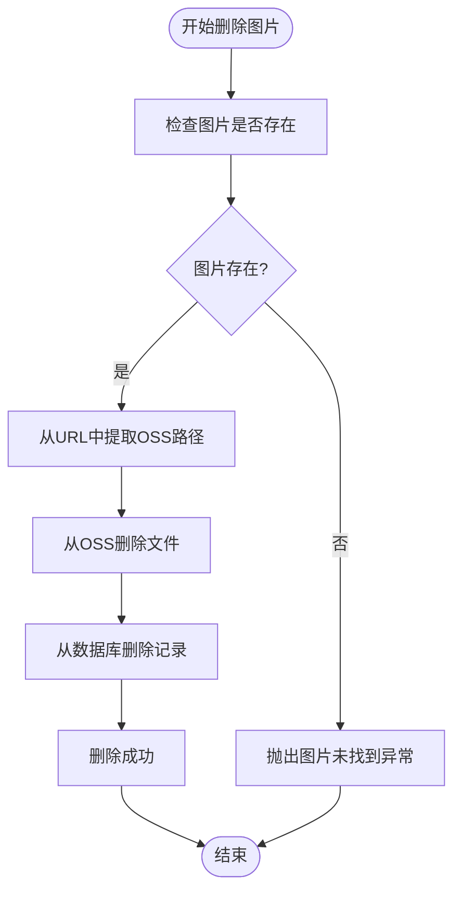
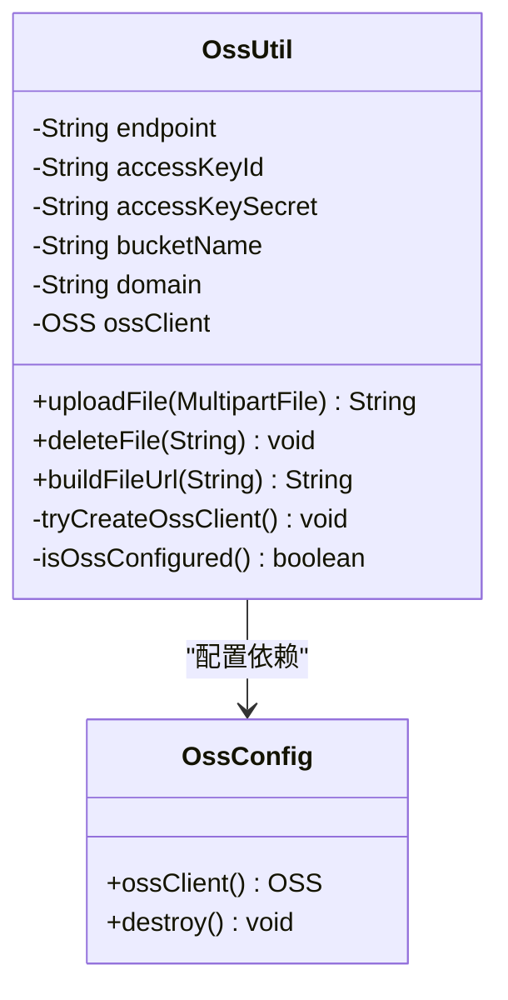
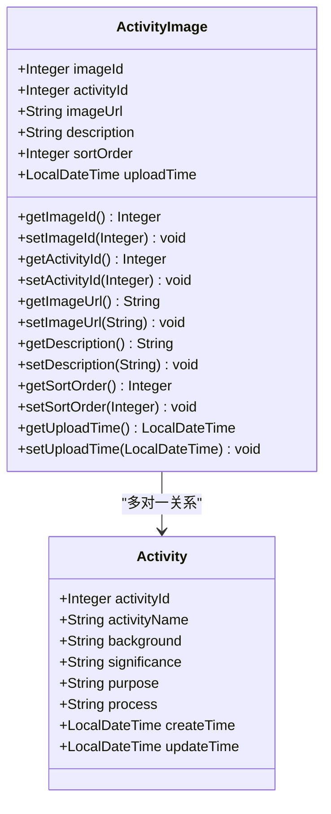

# 活动图片管理系统

<cite>
**本文档引用的文件**
- [ActivityService.java](file://src/main/java/com/redmoon2333/service/ActivityService.java)
- [ActivityController.java](file://src/main/java/com/redmoon2333/controller/ActivityController.java)
- [OssUtil.java](file://src/main/java/com/redmoon2333/util/OssUtil.java)
- [OssConfig.java](file://src/main/java/com/redmoon2333/config/OssConfig.java)
- [ActivityImage.java](file://src/main/java/com/redmoon2333/entity/ActivityImage.java)
- [ActivityImageDTO.java](file://src/main/java/com/redmoon2333/dto/ActivityImageDTO.java)
- [application.yml](file://src/main/resources/application.yml)
</cite>

## 目录
1. [简介](#简介)
2. [项目架构概览](#项目架构概览)
3. [核心组件分析](#核心组件分析)
4. [图片管理功能详解](#图片管理功能详解)
5. [OSS集成机制](#oss集成机制)
6. [数据模型设计](#数据模型设计)
7. [异常处理与容错机制](#异常处理与容错机制)
8. [性能优化建议](#性能优化建议)
9. [故障排除指南](#故障排除指南)
10. [总结](#总结)

## 简介

活动图片管理系统是人力资源官方系统中的重要组成部分，负责处理活动相关的图片上传、存储、管理和展示功能。该系统采用Spring Boot框架构建，集成了阿里云OSS对象存储服务，提供了完整的图片生命周期管理能力。

系统的核心功能包括：
- 活动图片的上传和存储
- 图片文件在OSS中的路径管理
- 数据库中图片记录的关联维护
- 图片的排序和描述管理
- 异常情况下的降级处理

## 项目架构概览

系统采用经典的三层架构模式，包含控制器层、服务层和数据访问层：



**图表来源**
- [ActivityController.java](file://src/main/java/com/redmoon2333/controller/ActivityController.java#L1-L50)
- [ActivityService.java](file://src/main/java/com/redmoon2333/service/ActivityService.java#L1-L50)
- [OssUtil.java](file://src/main/java/com/redmoon2333/util/OssUtil.java#L1-L50)

## 核心组件分析

### ActivityController 控制器层

控制器层负责处理HTTP请求和响应，实现了RESTful API接口：



**图表来源**
- [ActivityController.java](file://src/main/java/com/redmoon2333/controller/ActivityController.java#L30-L50)

### ActivityService 服务层

服务层是核心业务逻辑处理模块，包含了图片管理的主要功能：



**图表来源**
- [ActivityService.java](file://src/main/java/com/redmoon2333/service/ActivityService.java#L20-L40)
- [OssUtil.java](file://src/main/java/com/redmoon2333/util/OssUtil.java#L15-L40)

**章节来源**
- [ActivityController.java](file://src/main/java/com/redmoon2333/controller/ActivityController.java#L1-L322)
- [ActivityService.java](file://src/main/java/com/redmoon2333/service/ActivityService.java#L1-L376)

## 图片管理功能详解

### addImageToActivity 方法详解

`addImageToActivity`方法是图片添加的核心入口，负责处理图片上传的完整流程：



**图表来源**
- [ActivityController.java](file://src/main/java/com/redmoon2333/controller/ActivityController.java#L171-L220)
- [ActivityService.java](file://src/main/java/com/redmoon2333/service/ActivityService.java#L180-L220)

该方法的执行流程如下：

1. **文件验证**：接收MultipartFile参数，验证文件格式和大小
2. **OSS上传**：调用`saveImage()`方法将文件上传到阿里云OSS
3. **数据库操作**：创建ActivityImage对象，设置活动ID、图片URL、描述和排序
4. **自动填充**：设置上传时间和默认排序值（0）
5. **事务管理**：确保数据库操作的原子性

### getImagesByActivityId 方法详解

`getImagesByActivityId`方法负责获取指定活动的所有图片信息：



**图表来源**
- [ActivityService.java](file://src/main/java/com/redmoon2333/service/ActivityService.java#L292-L321)

### updateActivityImage 方法详解

`updateActivityImage`方法支持对现有图片进行更新操作：

- **描述更新**：允许修改图片的描述信息
- **排序更新**：支持调整图片的显示顺序
- **数据库同步**：更新数据库中的对应记录

### deleteActivityImage 方法详解

`deleteActivityImage`方法实现了图片的完全删除：



**图表来源**
- [ActivityService.java](file://src/main/java/com/redmoon2333/service/ActivityService.java#L340-L376)

**章节来源**
- [ActivityService.java](file://src/main/java/com/redmoon2333/service/ActivityService.java#L180-L376)
- [ActivityController.java](file://src/main/java/com/redmoon2333/controller/ActivityController.java#L171-L321)

## OSS集成机制

### OSS文件存储路径生成

系统采用UUID算法生成唯一的文件名，确保文件名的唯一性和安全性：

```java
// 生成唯一文件名
String originalFilename = file.getOriginalFilename();
String extension = originalFilename != null ? 
    originalFilename.substring(originalFilename.lastIndexOf(".")) : "";
String uniqueFilename = UUID.randomUUID().toString() + extension;
```

### extractOssFilePath 解析URL的两种模式

系统支持两种OSS URL解析模式：

1. **自定义域名模式**：
```java
// 处理自定义域名的情况
String domain = System.getProperty("aliyun.oss.domain");
if (domain != null && !domain.isEmpty() && imageUrl.startsWith(domain)) {
    return imageUrl.substring(domain.length() + 1);
}
```

2. **默认OSS域名模式**：
```java
// 处理默认OSS域名的情况
int thirdSlashIndex = imageUrl.indexOf("/", 8);
if (thirdSlashIndex != -1) {
    return imageUrl.substring(thirdSlashIndex + 1);
}
```

### ossUtil上传与删除文件的集成逻辑

OSS工具类提供了完整的文件操作功能：



**图表来源**
- [OssUtil.java](file://src/main/java/com/redmoon2333/util/OssUtil.java#L15-L40)
- [OssConfig.java](file://src/main/java/com/redmoon2333/config/OssConfig.java#L15-L40)

**章节来源**
- [ActivityService.java](file://src/main/java/com/redmoon2333/service/ActivityService.java#L168-L201)
- [OssUtil.java](file://src/main/java/com/redmoon2333/util/OssUtil.java#L54-L138)
- [OssConfig.java](file://src/main/java/com/redmoon2333/config/OssConfig.java#L1-L71)

## 数据模型设计

### ActivityImage 实体类设计

ActivityImage实体类定义了图片记录的数据结构：



**图表来源**
- [ActivityImage.java](file://src/main/java/com/redmoon2333/entity/ActivityImage.java#L8-L50)

### 数据库关联关系维护

系统通过外键约束维护Activity和ActivityImage之间的关联关系：

- **主键**：image_id (自增)
- **外键**：activity_id (指向activity表)
- **索引**：activity_id字段建立索引以提高查询效率

### 排序字段默认值设置

系统在实体类中设置了默认的排序值：

```java
@Column(name = "sort_order")
private Integer sortOrder = 0;
```

这确保了新添加的图片默认排在最后，且可以通过API参数自定义排序。

### 上传时间自动填充

上传时间通过构造函数自动填充：

```java
public ActivityImage() {
    this.uploadTime = LocalDateTime.now();
}
```

**章节来源**
- [ActivityImage.java](file://src/main/java/com/redmoon2333/entity/ActivityImage.java#L1-L101)

## 异常处理与容错机制

### OSS服务不可用时的降级策略

系统实现了多层次的异常处理机制：

1. **配置检查**：在OSS工具类中检查配置完整性
2. **客户端创建**：支持手动创建OSS客户端
3. **降级处理**：当OSS不可用时，提供友好的错误提示

```java
// OSS工具类中的异常处理
if (ossClient == null) {
    tryCreateOssClient();
}

if (ossClient == null) {
    String errorMessage = String.format(
        "OSS客户端未配置或创建失败。配置检查: endpoint=%s, accessKeyId=%s, accessKeySecret=%s, bucketName=%s。",
        endpoint != null ? endpoint : "未配置",
        accessKeyId != null ? maskSensitiveInfo(accessKeyId) : "未配置",
        accessKeySecret != null ? maskSensitiveInfo(accessKeySecret) : "未配置",
        bucketName != null ? bucketName : "未配置"
    );
    throw new IllegalStateException(errorMessage);
}
```

### 图片删除失败的容错机制

系统在删除图片时采用了容错设计：

```java
// 删除OSS上的文件
if (ossUtil != null) {
    try {
        ossUtil.deleteFile(image.getImageUrl());
    } catch (Exception e) {
        logger.warn("删除OSS文件失败: {}", image.getImageUrl(), e);
    }
} else {
    logger.warn("OSS未配置，跳过文件删除: {}", image.getImageUrl());
}
```

这种设计确保即使OSS服务暂时不可用，也不会影响数据库记录的删除操作。

### 级联删除行为

系统实现了完整的级联删除机制：

1. **活动删除**：删除活动时自动删除关联的图片
2. **图片删除**：删除单张图片时同时删除OSS文件和数据库记录
3. **异常恢复**：即使部分删除失败，也会记录日志并继续执行

**章节来源**
- [OssUtil.java](file://src/main/java/com/redmoon2333/util/OssUtil.java#L85-L138)
- [ActivityService.java](file://src/main/java/com/redmoon2333/service/ActivityService.java#L100-L150)

## 性能优化建议

### 批量获取图片

对于需要展示大量图片的场景，建议实现批量获取功能：

```java
// 建议的批量获取方法
public List<ActivityImageDTO> getImagesByActivityIds(List<Integer> activityIds) {
    // 批量查询数据库
    List<ActivityImage> images = activityImageMapper.findByActivityIds(activityIds);
    
    // 使用Map优化排序
    Map<Integer, List<ActivityImage>> groupedImages = images.stream()
        .collect(Collectors.groupingBy(ActivityImage::getActivityId));
    
    // 返回DTO列表
    return convertToDTO(groupedImages);
}
```

### 缓存策略

建议引入Redis缓存机制：

1. **图片列表缓存**：缓存热门活动的图片列表
2. **图片详情缓存**：缓存单张图片的详细信息
3. **配置缓存**：缓存OSS配置信息

### 异步处理

对于大文件上传，可以考虑异步处理：

```java
// 异步上传示例
@Async
public CompletableFuture<String> uploadImageAsync(MultipartFile file) {
    return CompletableFuture.supplyAsync(() -> {
        try {
            return ossUtil.uploadFile(file);
        } catch (IOException e) {
            throw new RuntimeException(e);
        }
    });
}
```

### 分页查询

对于图片较多的活动，建议实现分页查询：

```java
// 分页查询示例
public Page<ActivityImageDTO> getImagesByActivityId(Integer activityId, int page, int size) {
    // 查询总数
    int totalCount = activityImageMapper.countByActivityId(activityId);
    
    // 分页查询
    List<ActivityImage> images = activityImageMapper.findByActivityIdWithPagination(
        activityId, (page - 1) * size, size);
    
    // 转换为DTO
    List<ActivityImageDTO> dtoList = images.stream()
        .map(this::convertToDTO)
        .collect(Collectors.toList());
    
    return new Page<>(dtoList, page, size, totalCount);
}
```

## 故障排除指南

### 常见问题及解决方案

1. **OSS配置错误**
   - 检查application.yml中的OSS配置项
   - 验证环境变量是否正确设置
   - 确认AccessKey和SecretKey的有效性

2. **文件上传失败**
   - 检查文件大小是否超过限制
   - 验证文件格式是否支持
   - 确认OSS存储空间是否充足

3. **图片无法访问**
   - 检查OSS文件权限设置
   - 验证CDN配置是否正确
   - 确认网络连接是否正常

### 日志分析

系统提供了详细的日志记录：

```java
// 关键操作的日志记录
logger.info("用户 {} 成功为活动添加图片: 活动ID={}, 图片ID={}", 
    currentUser, activityId, savedImage.getImageId());
logger.error("用户 {} 为活动添加图片时文件保存失败: 活动ID={}, 错误: {}", 
    currentUser, activityId, e.getMessage(), e);
```

### 监控指标

建议监控以下关键指标：

- OSS上传成功率
- 图片加载响应时间
- 数据库查询性能
- 内存使用情况

**章节来源**
- [ActivityController.java](file://src/main/java/com/redmoon2333/controller/ActivityController.java#L171-L220)
- [ActivityService.java](file://src/main/java/com/redmoon2333/service/ActivityService.java#L180-L220)

## 总结

活动图片管理系统是一个设计完善、功能完整的图片管理解决方案。系统通过合理的架构设计、完善的异常处理机制和灵活的扩展能力，为人力资源官方系统提供了可靠的图片管理服务。

### 主要特点

1. **完整的生命周期管理**：从图片上传到删除的全流程管理
2. **高可靠性的OSS集成**：支持多种域名解析模式和降级处理
3. **灵活的排序机制**：支持图片排序和描述管理
4. **强大的异常处理**：多层次的异常捕获和容错机制
5. **良好的扩展性**：清晰的架构设计便于功能扩展

### 技术亮点

- **UUID文件命名**：确保文件名唯一性和安全性
- **双模式URL解析**：兼容自定义域名和默认OSS域名
- **级联删除设计**：保证数据一致性
- **异步处理支持**：提升系统响应性能
- **缓存友好设计**：便于引入缓存机制

该系统为类似的人力资源管理系统提供了优秀的参考实现，其设计理念和实现方式值得在其他项目中借鉴和应用。