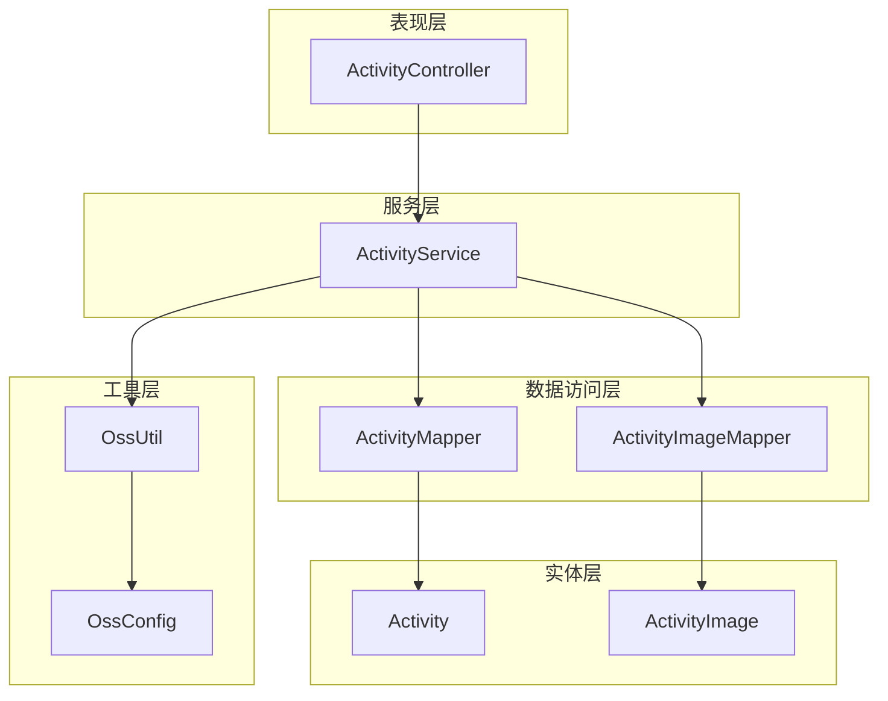
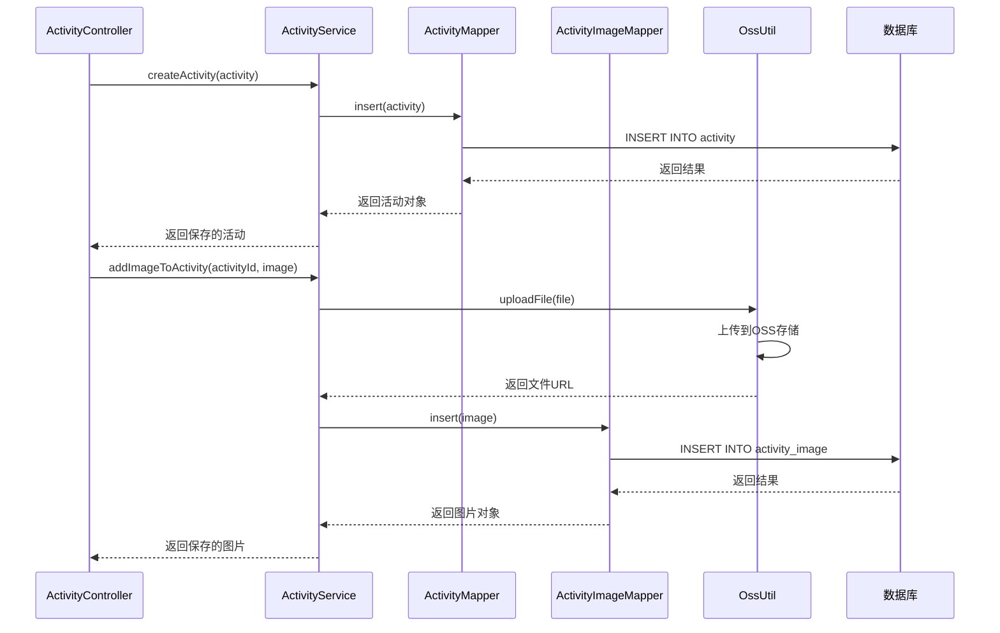
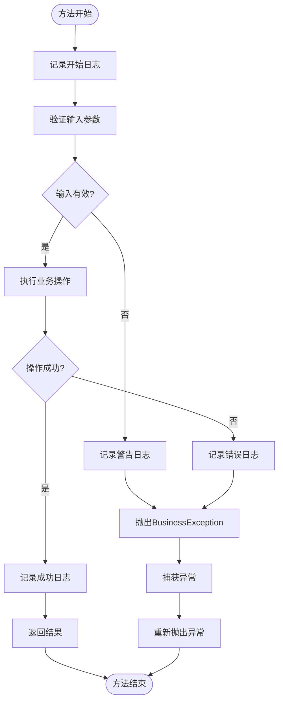
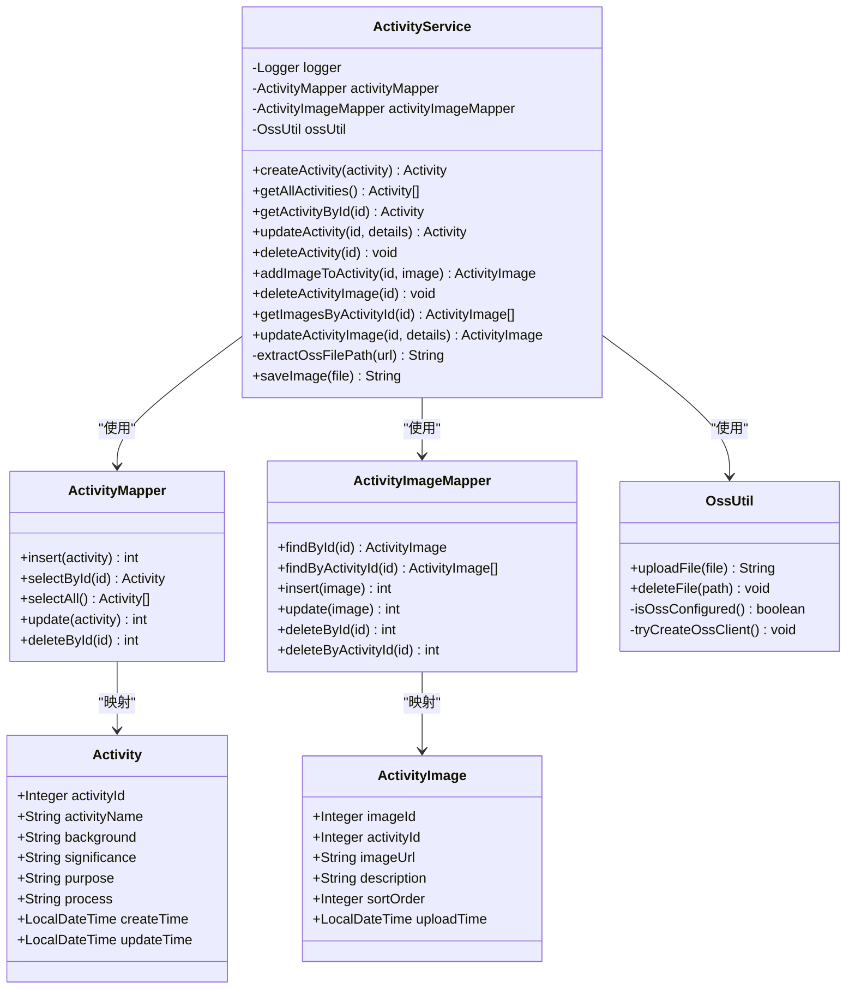

# 活动管理服务

<cite>
**本文档引用的文件**
- [ActivityService.java](file://src/main/java/com/redmoon2333/service/ActivityService.java)
- [Activity.java](file://src/main/java/com/redmoon2333/entity/Activity.java)
- [ActivityImage.java](file://src/main/java/com/redmoon2333/entity/ActivityImage.java)
- [ActivityMapper.java](file://src/main/java/com/redmoon2333/mapper/ActivityMapper.java)
- [ActivityImageMapper.java](file://src/main/java/com/redmoon2333/mapper/ActivityImageMapper.java)
- [ActivityController.java](file://src/main/java/com/redmoon2333/controller/ActivityController.java)
- [OssUtil.java](file://src/main/java/com/redmoon2333/util/OssUtil.java)
- [OssConfig.java](file://src/main/java/com/redmoon2333/config/OssConfig.java)
- [ActivityRequest.java](file://src/main/java/com/redmoon2333/dto/ActivityRequest.java)
- [ActivityResponse.java](file://src/main/java/com/redmoon2333/dto/ActivityResponse.java)
- [ActivityImageDTO.java](file://src/main/java/com/redmoon2333/dto/ActivityImageDTO.java)
- [ErrorCode.java](file://src/main/java/com/redmoon2333/exception/ErrorCode.java)
- [BusinessException.java](file://src/main/java/com/redmoon2333/exception/BusinessException.java)
</cite>

## 目录
1. [简介](#简介)
2. [项目结构概览](#项目结构概览)
3. [核心组件分析](#核心组件分析)
4. [架构概览](#架构概览)
5. [详细组件分析](#详细组件分析)
6. [依赖关系分析](#依赖关系分析)
7. [性能考虑](#性能考虑)
8. [故障排除指南](#故障排除指南)
9. [结论](#结论)

## 简介

ActivityService是人力资源管理系统中负责活动生命周期管理的核心服务类。该服务提供了完整的活动管理功能，包括活动的创建、查询、更新、删除以及图片管理等操作。作为服务层的核心组件，它协调了ActivityMapper和ActivityImageMapper之间的数据操作，并确保了活动与图片数据的一致性。

该服务采用Spring Boot框架开发，集成了MyBatis ORM框架进行数据库操作，并通过阿里云OSS服务实现图片文件的存储和管理。服务层实现了完善的日志记录、异常处理和事务边界控制，确保了系统的稳定性和可维护性。

## 项目结构概览

项目采用标准的MVC架构模式，主要分为以下几个层次：



**图表来源**
- [ActivityController.java](file://src/main/java/com/redmoon2333/controller/ActivityController.java#L1-L322)
- [ActivityService.java](file://src/main/java/com/redmoon2333/service/ActivityService.java#L1-L376)

**章节来源**
- [ActivityController.java](file://src/main/java/com/redmoon2333/controller/ActivityController.java#L1-L50)
- [ActivityService.java](file://src/main/java/com/redmoon2333/service/ActivityService.java#L1-L50)

## 核心组件分析

### ActivityService类概述

ActivityService是一个Spring服务组件，负责处理活动相关的业务逻辑。该类包含了活动的完整生命周期管理功能，包括基本CRUD操作和复杂的图片管理功能。

```java
@Service
public class ActivityService {
    private static final Logger logger = LoggerFactory.getLogger(ActivityService.class);
    
    @Autowired
    private ActivityMapper activityMapper;
    
    @Autowired
    private ActivityImageMapper activityImageMapper;
    
    @Autowired(required = false)
    private OssUtil ossUtil;
}
```

### 主要功能模块

1. **活动基础操作**：createActivity、getAllActivities、getActivityById、updateActivity、deleteActivity
2. **图片管理功能**：addImageToActivity、deleteActivityImage、getImagesByActivityId、updateActivityImage
3. **OSS集成**：文件上传、删除和路径提取
4. **异常处理**：统一的BusinessException封装
5. **日志记录**：完整的操作日志记录

**章节来源**
- [ActivityService.java](file://src/main/java/com/redmoon2333/service/ActivityService.java#L1-L50)

## 架构概览

ActivityService采用了分层架构设计，确保了关注点分离和代码的可维护性：



**图表来源**
- [ActivityController.java](file://src/main/java/com/redmoon2333/controller/ActivityController.java#L40-L80)
- [ActivityService.java](file://src/main/java/com/redmoon2333/service/ActivityService.java#L30-L60)

## 详细组件分析

### 活动创建功能

createActivity方法负责将新的活动信息持久化到数据库中：

```java
public Activity createActivity(Activity activity) {
    logger.info("开始创建活动: {}", activity.getActivityName());
    
    // 保存活动信息到数据库
    activityMapper.insert(activity);
    logger.info("活动创建成功，活动ID: {}", activity.getActivityId());
    
    return activity;
}
```

该方法的执行流程：
1. 记录创建活动的日志
2. 调用ActivityMapper的insert方法
3. 返回创建成功的活动对象

### 活动查询功能

#### getAllActivities方法
```java
public List<Activity> getAllActivities() {
    logger.info("获取所有活动列表");
    try {
        List<Activity> activities = activityMapper.selectAll();
        logger.info("成功获取活动列表，共{}条记录", activities.size());
        return activities;
    } catch (Exception e) {
        logger.error("获取活动列表时发生异常: {}", e.getMessage(), e);
        throw new BusinessException(ErrorCode.ACTIVITY_LIST_FAILED);
    }
}
```

#### getActivityById方法
```java
public Activity getActivityById(Integer activityId) {
    logger.info("根据ID获取活动详情: ID={}", activityId);
    try {
        Activity activity = activityMapper.selectById(activityId);
        if (activity == null) {
            logger.warn("未找到指定活动: ID={}", activityId);
            throw new BusinessException(ErrorCode.ACTIVITY_NOT_FOUND);
        }
        logger.info("成功获取活动详情: ID={}", activityId);
        return activity;
    } catch (BusinessException e) {
        throw e;
    } catch (Exception e) {
        logger.error("获取活动详情时发生异常: ID={}, 错误: {}", activityId, e.getMessage(), e);
        throw new BusinessException(ErrorCode.ACTIVITY_DETAIL_FAILED);
    }
}
```

### 活动更新功能

updateActivity方法实现了活动信息的更新逻辑：

```java
public Activity updateActivity(Integer activityId, Activity activityDetails) {
    logger.info("开始更新活动: ID={}", activityId);
    
    try {
        // 先检查活动是否存在
        Activity existingActivity = activityMapper.selectById(activityId);
        if (existingActivity == null) {
            logger.warn("尝试更新不存在的活动: ID={}", activityId);
            throw new BusinessException(ErrorCode.ACTIVITY_NOT_FOUND);
        }
        
        // 更新活动信息
        existingActivity.setActivityName(activityDetails.getActivityName());
        existingActivity.setBackground(activityDetails.getBackground());
        existingActivity.setSignificance(activityDetails.getSignificance());
        existingActivity.setPurpose(activityDetails.getPurpose());
        existingActivity.setProcess(activityDetails.getProcess());
        existingActivity.setUpdateTime(LocalDateTime.now());
        
        int result = activityMapper.update(existingActivity);
        
        if (result > 0) {
            logger.info("活动更新成功: ID={}", activityId);
            return existingActivity;
        } else {
            logger.error("活动更新失败: ID={}", activityId);
            throw new BusinessException(ErrorCode.ACTIVITY_UPDATE_FAILED);
        }
    } catch (BusinessException e) {
        throw e;
    } catch (Exception e) {
        logger.error("更新活动时发生异常: ID={}, 错误: {}", activityId, e.getMessage(), e);
        throw new BusinessException(ErrorCode.ACTIVITY_UPDATE_FAILED);
    }
}
```

### 活动删除功能

deleteActivity方法实现了级联删除功能，包括OSS文件清理和数据库记录删除：

```java
public void deleteActivity(Integer activityId) {
    logger.info("开始删除活动: ID={}", activityId);
    
    try {
        // 先检查活动是否存在
        Activity existingActivity = activityMapper.selectById(activityId);
        if (existingActivity == null) {
            logger.warn("尝试删除不存在的活动: ID={}", activityId);
            throw new BusinessException(ErrorCode.ACTIVITY_NOT_FOUND);
        }
        
        // 删除关联的图片记录
        List<ActivityImage> images = activityImageMapper.findByActivityId(activityId);
        logger.info("找到{}张关联图片需要删除", images.size());
        
        for (ActivityImage image : images) {
            // 从OSS删除图片文件
            String imageUrl = image.getImageUrl();
            logger.debug("准备删除图片文件: {}", imageUrl);
            
            // 从URL中提取OSS文件路径
            String filePath = extractOssFilePath(imageUrl);
            if (filePath != null) {
                if (ossUtil != null) {
                    try {
                        ossUtil.deleteFile(filePath);
                    } catch (Exception e) {
                        logger.warn("删除OSS文件失败: {}", filePath, e);
                    }
                } else {
                    logger.warn("OSS未配置，跳过文件删除: {}", filePath);
                }
            }
            
            // 删除数据库记录
            activityImageMapper.deleteById(image.getImageId());
        }
        
        // 删除活动
        int result = activityMapper.deleteById(activityId);
        
        if (result > 0) {
            logger.info("活动删除成功: ID={}, 关联图片{}张", activityId, images.size());
        } else {
            logger.error("活动删除失败: ID={}", activityId);
            throw new BusinessException(ErrorCode.ACTIVITY_DELETE_FAILED);
        }
    } catch (BusinessException e) {
        throw e;
    } catch (Exception e) {
        logger.error("删除活动时发生异常: ID={}, 错误: {}", activityId, e.getMessage(), e);
        throw new BusinessException(ErrorCode.ACTIVITY_DELETE_FAILED);
    }
}
```

### OSS文件路径提取功能

extractOssFilePath方法负责从OSS URL中提取文件路径：

```java
private String extractOssFilePath(String imageUrl) {
    if (imageUrl == null || imageUrl.isEmpty()) {
        return null;
    }
    
    // 处理自定义域名的情况
    String domain = System.getProperty("aliyun.oss.domain");
    if (domain != null && !domain.isEmpty() && imageUrl.startsWith(domain)) {
        return imageUrl.substring(domain.length() + 1); // +1 是为了去掉开头的 "/"
    }
    
    // 处理默认OSS域名的情况
    // 格式: https://bucket-name.endpoint/path
    int thirdSlashIndex = imageUrl.indexOf("/", 8); // 跳过 https://
    if (thirdSlashIndex != -1) {
        return imageUrl.substring(thirdSlashIndex + 1);
    }
    
    return null;
}
```

### 图片管理功能

#### addImageToActivity方法
```java
public ActivityImage addImageToActivity(Integer activityId, ActivityImage activityImage) {
    logger.info("为活动添加图片: 活动ID={}, 图片描述={}", activityId, activityImage.getDescription());

    try {
        // 检查活动是否存在
        Activity activity = activityMapper.selectById(activityId);
        if (activity == null) {
            throw new BusinessException(ErrorCode.ACTIVITY_NOT_FOUND);
        }

        // 保存图片到OSS
        activityImage.setUploadTime(LocalDateTime.now());

        // 设置默认排序顺序
        if (activityImage.getSortOrder() == null) {
            activityImage.setSortOrder(0);
        }

        // 插入数据库
        int result = activityImageMapper.insert(activityImage);
        if (result != 1) {
            throw new BusinessException(ErrorCode.ACTIVITY_IMAGE_SAVE_FAILED);
        }

        logger.info("图片添加成功: 图片ID={}, 图片URL={}", activityImage.getImageId(), activityImage.getImageUrl());
        return activityImage;
    } catch (Exception e) {
        logger.error("为活动添加图片时发生异常: 活动ID={}, 错误: {}", activityId, e.getMessage(), e);
        throw new BusinessException(ErrorCode.ACTIVITY_IMAGE_SAVE_FAILED);
    }
}
```

#### deleteActivityImage方法
```java
public void deleteActivityImage(Integer imageId) {
    logger.info("删除活动图片: 图片ID={}", imageId);
    
    try {
        // 检查图片是否存在
        ActivityImage existingImage = activityImageMapper.findById(imageId);
        if (existingImage == null) {
            logger.warn("尝试删除不存在的活动图片: 图片ID={}", imageId);
            throw new BusinessException(ErrorCode.ACTIVITY_IMAGE_NOT_FOUND);
        }
        
        // 从OSS删除图片文件
        String imageUrl = existingImage.getImageUrl();
        String filePath = extractOssFilePath(imageUrl);
        
        if (filePath != null) {
            if (ossUtil != null) {
                try {
                    ossUtil.deleteFile(filePath);
                } catch (Exception e) {
                    logger.warn("删除OSS文件失败: {}", filePath, e);
                }
            } else {
                logger.warn("OSS未配置，跳过文件删除: {}", filePath);
            }
        }
        
        // 删除数据库记录
        int result = activityImageMapper.deleteById(imageId);
        
        if (result > 0) {
            logger.info("活动图片删除成功: 图片ID={}, 文件路径={}", imageId, filePath);
        } else {
            logger.error("活动图片删除失败: 图片ID={}", imageId);
            throw new BusinessException(ErrorCode.ACTIVITY_IMAGE_DELETE_FAILED);
        }
    } catch (BusinessException e) {
        throw e;
    } catch (Exception e) {
        logger.error("删除活动图片时发生异常: 图片ID={}, 错误: {}", imageId, e.getMessage(), e);
        throw new BusinessException(ErrorCode.ACTIVITY_IMAGE_DELETE_FAILED);
    }
}
```

### 异常处理和日志记录

ActivityService实现了统一的异常处理机制：



**图表来源**
- [ActivityService.java](file://src/main/java/com/redmoon2333/service/ActivityService.java#L56-L86)
- [ActivityService.java](file://src/main/java/com/redmoon2333/service/ActivityService.java#L112-L142)

**章节来源**
- [ActivityService.java](file://src/main/java/com/redmoon2333/service/ActivityService.java#L30-L150)
- [ActivityService.java](file://src/main/java/com/redmoon2333/service/ActivityService.java#L150-L250)
- [ActivityService.java](file://src/main/java/com/redmoon2333/service/ActivityService.java#L250-L376)

## 依赖关系分析

ActivityService的依赖关系图展示了其与其他组件的交互：



**图表来源**
- [ActivityService.java](file://src/main/java/com/redmoon2333/service/ActivityService.java#L15-L30)
- [ActivityMapper.java](file://src/main/java/com/redmoon2333/mapper/ActivityMapper.java#L1-L40)
- [ActivityImageMapper.java](file://src/main/java/com/redmoon2333/mapper/ActivityImageMapper.java#L1-L41)

**章节来源**
- [ActivityService.java](file://src/main/java/com/redmoon2333/service/ActivityService.java#L1-L30)
- [ActivityMapper.java](file://src/main/java/com/redmoon2333/mapper/ActivityMapper.java#L1-L40)
- [ActivityImageMapper.java](file://src/main/java/com/redmoon2333/mapper/ActivityImageMapper.java#L1-L41)

## 性能考虑

### 数据库优化

1. **索引策略**：Activity表的activity_id字段和ActivityImage表的activity_id字段都应建立索引
2. **批量操作**：对于大量图片的操作，可以考虑批量处理以减少数据库连接开销
3. **缓存策略**：对于频繁查询的活动列表，可以引入Redis缓存

### OSS性能优化

1. **并发上传**：OssUtil支持并发文件上传，但需要注意OSS的QPS限制
2. **CDN加速**：建议配置CDN来加速图片访问
3. **文件压缩**：可以在上传前对图片进行压缩处理

### 内存管理

1. **大文件处理**：对于大尺寸图片，建议使用流式处理避免内存溢出
2. **连接池**：OSS客户端使用连接池来提高性能

## 故障排除指南

### 常见问题及解决方案

#### 1. OSS配置问题
**症状**：文件上传失败，抛出IllegalStateException异常
**原因**：OSS配置不完整或客户端创建失败
**解决方案**：
- 检查application.yml中的OSS配置项
- 确认accessKeyId和accessKeySecret的有效性
- 验证bucketName的正确性

#### 2. 活动删除失败
**症状**：deleteActivity方法抛出ACTIVITY_DELETE_FAILED异常
**原因**：数据库约束或外键关联问题
**解决方案**：
- 检查ActivityImage表的外键约束
- 确认级联删除配置
- 查看数据库日志获取详细错误信息

#### 3. 图片路径提取失败
**症状**：extractOssFilePath返回null
**原因**：URL格式不符合预期
**解决方案**：
- 检查OSS文件URL的格式
- 验证自定义域名配置
- 确认URL解析逻辑

**章节来源**
- [OssUtil.java](file://src/main/java/com/redmoon2333/util/OssUtil.java#L60-L120)
- [ActivityService.java](file://src/main/java/com/redmoon2333/service/ActivityService.java#L112-L180)

## 结论

ActivityService作为人力资源管理系统的核心服务组件，提供了完整的活动生命周期管理功能。该服务具有以下特点：

### 主要优势

1. **完整的功能覆盖**：涵盖了活动的基础CRUD操作和复杂的图片管理功能
2. **良好的架构设计**：采用分层架构，职责清晰，易于维护
3. **完善的异常处理**：统一的BusinessException封装，便于错误管理和用户体验
4. **强大的日志记录**：详细的日志记录有助于问题排查和系统监控
5. **灵活的OSS集成**：支持多种OSS配置方式，适应不同的部署环境

### 技术亮点

1. **事务一致性**：通过服务层协调多个数据源操作，确保数据一致性
2. **异步处理**：OSS文件操作采用异步处理，提高系统响应速度
3. **配置灵活性**：支持动态配置OSS参数，适应不同的部署需求
4. **扩展性强**：模块化设计便于功能扩展和维护

### 改进建议

1. **缓存优化**：对于频繁查询的活动数据，可以引入缓存机制
2. **批量操作**：增加批量图片处理功能，提高大容量操作效率
3. **监控告警**：增加系统监控和告警机制，及时发现和处理异常
4. **单元测试**：完善单元测试覆盖率，确保代码质量

ActivityService展现了现代Java企业应用开发的最佳实践，通过合理的架构设计和完善的异常处理机制，为企业级应用提供了可靠的服务支撑。