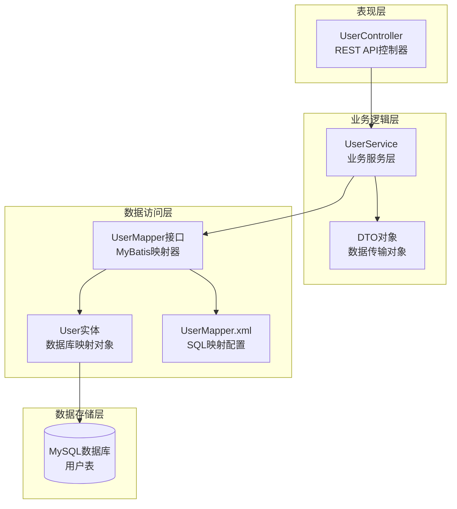
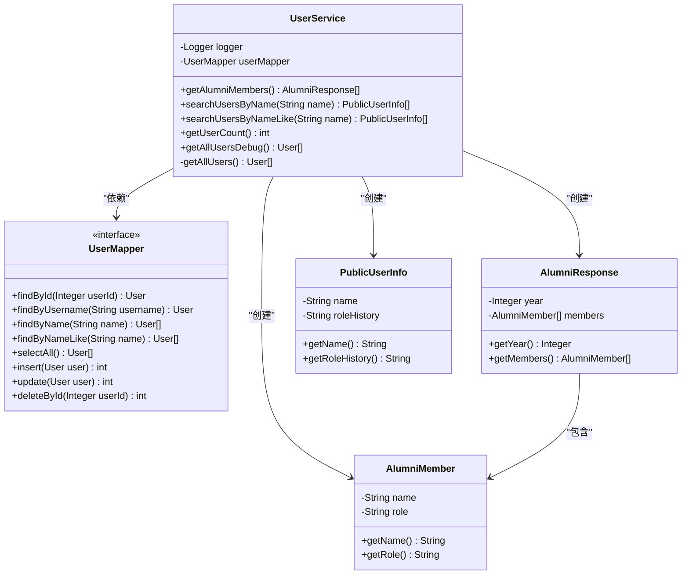
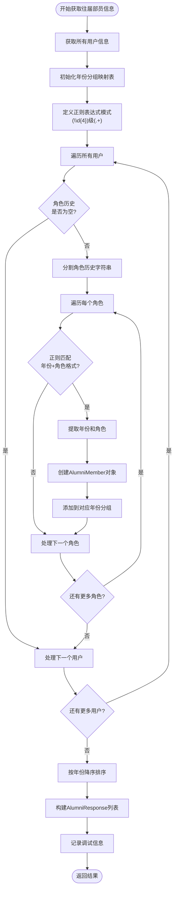
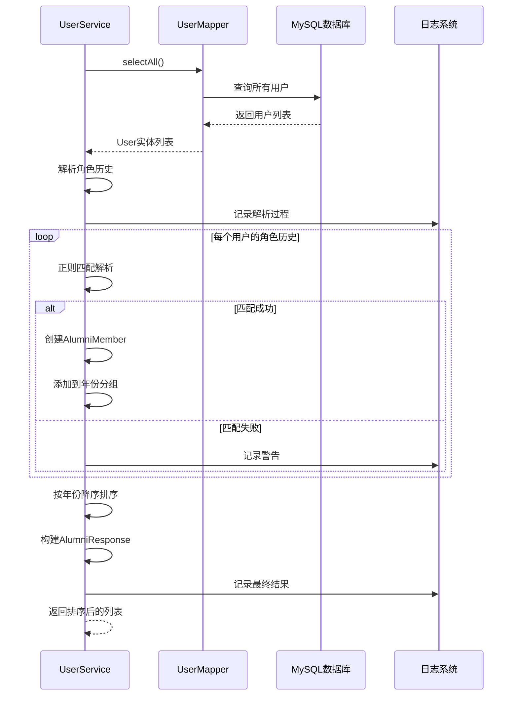
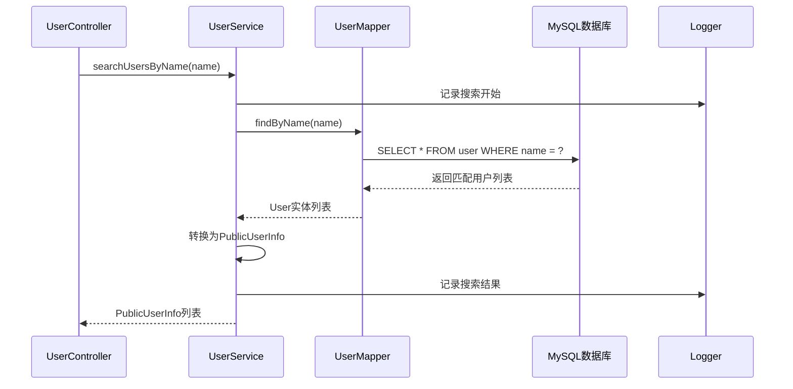
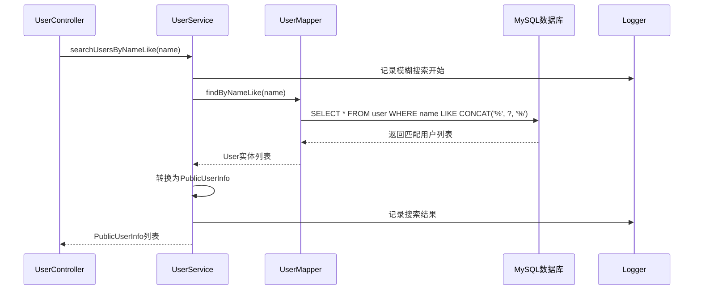
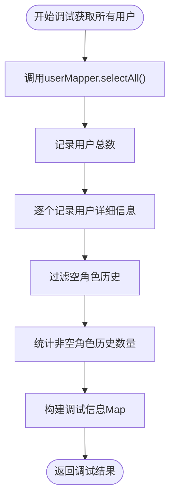
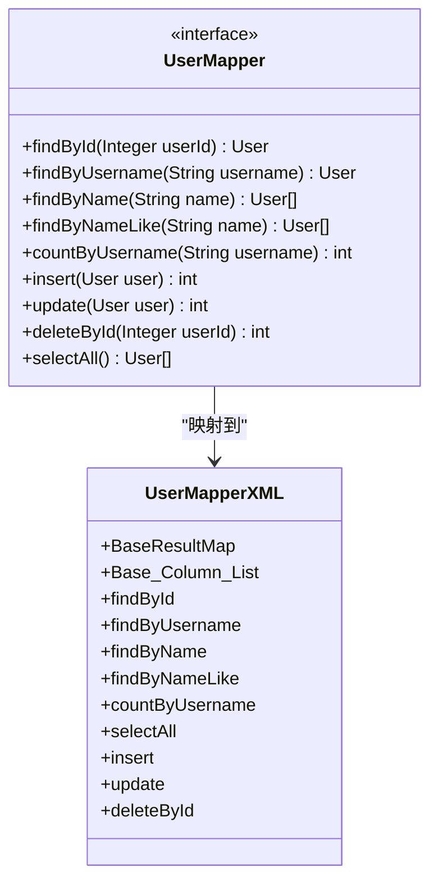

# 用户服务详细分析文档

<cite>
**本文档引用的文件**
- [UserService.java](file://src/main/java/com/redmoon2333/service/UserService.java)
- [UserMapper.java](file://src/main/java/com/redmoon2333/mapper/UserMapper.java)
- [UserMapper.xml](file://src/main/resources/mapper/UserMapper.xml)
- [UserController.java](file://src/main/java/com/redmoon2333/controller/UserController.java)
- [User.java](file://src/main/java/com/redmoon2333/entity/User.java)
- [AlumniMember.java](file://src/main/java/com/redmoon2333/dto/AlumniMember.java)
- [AlumniResponse.java](file://src/main/java/com/redmoon2333/dto/AlumniResponse.java)
- [PublicUserInfo.java](file://src/main/java/com/redmoon2333/dto/PublicUserInfo.java)
- [application.yml](file://src/main/resources/application.yml)
</cite>

## 目录
1. [简介](#简介)
2. [项目架构概览](#项目架构概览)
3. [核心组件分析](#核心组件分析)
4. [往届成员信息提取模块](#往届成员信息提取模块)
5. [用户搜索功能模块](#用户搜索功能模块)
6. [调试接口模块](#调试接口模块)
7. [数据访问层分析](#数据访问层分析)
8. [性能考虑与优化建议](#性能考虑与优化建议)
9. [故障排除指南](#故障排除指南)
10. [总结](#总结)

## 简介

本文档深入分析了人力资源管理系统中UserService类的实现细节，重点关注三个核心功能模块：往届成员信息提取、用户搜索和调试接口。该服务层通过UserMapper实现了复杂的数据查询与转换，展现了Spring Boot框架下企业级应用的最佳实践。

UserService作为业务逻辑的核心组件，承担着处理复杂业务规则、数据验证、转换和持久化的重要职责。通过精心设计的日志记录机制，它不仅提供了强大的调试能力，还确保了系统的可观测性和可维护性。

## 项目架构概览

该系统采用经典的三层架构模式，清晰地分离了表现层、业务逻辑层和数据访问层：



**图表来源**
- [UserController.java](file://src/main/java/com/redmoon2333/controller/UserController.java#L1-L140)
- [UserService.java](file://src/main/java/com/redmoon2333/service/UserService.java#L1-L250)
- [UserMapper.java](file://src/main/java/com/redmoon2333/mapper/UserMapper.java#L1-L78)

## 核心组件分析

### UserService类结构

UserService类采用了标准的Spring服务层设计模式，具有以下特征：



**图表来源**
- [UserService.java](file://src/main/java/com/redmoon2333/service/UserService.java#L20-L250)
- [UserMapper.java](file://src/main/java/com/redmoon2333/mapper/UserMapper.java#L15-L77)
- [AlumniResponse.java](file://src/main/java/com/redmoon2333/dto/AlumniResponse.java#L1-L31)
- [AlumniMember.java](file://src/main/java/com/redmoon2333/dto/AlumniMember.java#L1-L29)
- [PublicUserInfo.java](file://src/main/java/com/redmoon2333/dto/PublicUserInfo.java#L1-L29)

**章节来源**
- [UserService.java](file://src/main/java/com/redmoon2333/service/UserService.java#L1-L250)
- [UserMapper.java](file://src/main/java/com/redmoon2333/mapper/UserMapper.java#L1-L78)

## 往届成员信息提取模块

### 核心算法分析

getAlumniMembers方法是整个系统最复杂的业务逻辑之一，它实现了基于正则表达式的角色历史解析算法：



**图表来源**
- [UserService.java](file://src/main/java/com/redmoon2333/service/UserService.java#L35-L130)

### 正则表达式解析算法

该模块的核心在于使用正则表达式`(\\d{4})级(.+)`来解析用户的角色历史字段：

1. **模式定义**：`(\d{4})级(.+)`
   - `\d{4}`：匹配四位数字（年份）
   - `级`：固定的文字分隔符
   - `(.+)`：匹配角色名称（部长、部员等）

2. **解析流程**：
   - 使用Matcher对象进行模式匹配
   - 提取年份组（group 1）和角色组（group 2）
   - 将解析后的数据组织成AlumniMember对象
   - 按年份建立分组映射

3. **错误处理**：
   - NumberFormatException：处理年份转换异常
   - 通用异常捕获：记录警告日志但不影响整体流程
   - 格式不匹配：跳过不符合规范的角色信息

### 数据转换与排序



**图表来源**
- [UserService.java](file://src/main/java/com/redmoon2333/service/UserService.java#L35-L130)
- [UserMapper.xml](file://src/main/resources/mapper/UserMapper.xml#L40-L50)

**章节来源**
- [UserService.java](file://src/main/java/com/redmoon2333/service/UserService.java#L35-L130)

## 用户搜索功能模块

### 精确搜索与模糊搜索

系统提供了两种不同的用户搜索策略：

#### 精确搜索（searchUsersByName）



**图表来源**
- [UserService.java](file://src/main/java/com/redmoon2333/service/UserService.java#L132-L145)
- [UserMapper.xml](file://src/main/resources/mapper/UserMapper.xml#L45-L50)

#### 模糊搜索（searchUsersByNameLike）



**图表来源**
- [UserService.java](file://src/main/java/com/redmoon2333/service/UserService.java#L147-L160)
- [UserMapper.xml](file://src/main/resources/mapper/UserMapper.xml#L52-L57)

### 敏感信息过滤机制

两个搜索方法都采用了相同的敏感信息过滤策略：

1. **数据脱敏**：只暴露必要的公共信息
2. **DTO转换**：使用PublicUserInfo作为传输对象
3. **字段限制**：仅包含姓名和角色历史信息
4. **安全考虑**：避免泄露密码、用户ID等敏感字段

**章节来源**
- [UserService.java](file://src/main/java/com/redmoon2333/service/UserService.java#L132-L160)
- [UserMapper.java](file://src/main/java/com/redmoon2333/mapper/UserMapper.java#L25-L35)

## 调试接口模块

### 调试方法设计目的

UserService提供了专门的调试接口，主要用于开发和运维阶段的问题排查：

#### getAllUsersDebug方法



**图表来源**
- [UserService.java](file://src/main/java/com/redmoon2333/service/UserService.java#L200-L220)

#### getUserCount方法

这是一个简单的辅助方法，用于快速获取用户总数，便于监控和统计。

### 调试接口的使用场景

1. **数据完整性检查**：验证数据库中用户数据的完整性和一致性
2. **性能监控**：跟踪用户数量变化趋势
3. **问题诊断**：定位特定用户或角色历史数据的问题
4. **开发测试**：在开发环境中验证数据处理逻辑

**章节来源**
- [UserService.java](file://src/main/java/com/redmoon2333/service/UserService.java#L190-L220)
- [UserController.java](file://src/main/java/com/redmoon2333/controller/UserController.java#L30-L60)

## 数据访问层分析

### MyBatis映射器设计

UserMapper接口采用了标准的MyBatis注解方式，提供了完整的CRUD操作：



**图表来源**
- [UserMapper.java](file://src/main/java/com/redmoon2333/mapper/UserMapper.java#L15-L77)
- [UserMapper.xml](file://src/main/resources/mapper/UserMapper.xml#L1-L106)

### SQL查询优化策略

1. **精确查询优化**：
   - 使用索引列进行精确匹配
   - 避免不必要的LIKE操作
   - 减少查询结果集大小

2. **模糊查询优化**：
   - 使用CONCAT函数构建LIKE模式
   - 注意前缀索引的使用限制
   - 考虑全文索引替代方案

3. **批量查询优化**：
   - selectAll方法支持大数据量查询
   - 使用分页插件PageHelper进行性能优化
   - 合理设置查询超时时间

**章节来源**
- [UserMapper.java](file://src/main/java/com/redmoon2333/mapper/UserMapper.java#L1-L78)
- [UserMapper.xml](file://src/main/resources/mapper/UserMapper.xml#L1-L106)

## 性能考虑与优化建议

### 大数据量下的查询优化

针对往届成员信息提取功能，当用户数量达到数千甚至上万时，需要考虑以下优化策略：

1. **索引优化**：
   ```sql
   -- 为常用查询字段创建索引
   CREATE INDEX idx_user_name ON user(name);
   CREATE INDEX idx_user_role_history ON user(role_history);
   ```

2. **分页查询**：
   ```java
   // 使用PageHelper进行分页
   PageHelper.startPage(pageNum, pageSize);
   List<User> users = userMapper.selectAll();
   ```

3. **缓存策略**：
   - 对于不经常变动的用户数据，可以引入Redis缓存
   - 缓存解析后的角色历史数据
   - 设置合理的缓存过期时间

4. **异步处理**：
   - 对于大批量数据处理，考虑使用消息队列
   - 实现后台任务处理往届成员信息更新
   - 提供进度反馈机制

### 内存使用优化

1. **流式处理**：
   ```java
   // 使用流式API减少内存占用
   List<PublicUserInfo> publicUsers = users.stream()
       .map(user -> new PublicUserInfo(user.getName(), user.getRoleHistory()))
       .collect(Collectors.toList());
   ```

2. **及时释放资源**：
   - 在方法结束时清理临时变量
   - 使用try-with-resources管理资源
   - 避免大对象的长期持有

### 并发性能优化

1. **线程安全**：
   - UserService默认是单例模式，注意线程安全
   - 对于共享状态的操作要进行同步控制

2. **连接池配置**：
   ```yaml
   spring:
     datasource:
       hikari:
         maximum-pool-size: 20
         minimum-idle: 5
         idle-timeout: 30000
   ```

## 故障排除指南

### 常见问题诊断

#### 1. 正则表达式匹配失败

**症状**：角色历史无法正确解析，返回空结果

**诊断步骤**：
```java
// 检查角色历史格式
logger.debug("原始角色历史: {}", roleHistory);
logger.debug("正则匹配结果: {}", matcher.matches());
```

**解决方案**：
- 验证数据库中角色历史字段的格式
- 更新正则表达式以支持新的格式
- 添加格式验证和转换逻辑

#### 2. 查询性能问题

**症状**：getAlumniMembers方法执行缓慢

**诊断工具**：
```java
// 启用SQL日志
logging.level.com.redmoon2333.mapper.UserMapper=DEBUG
```

**优化措施**：
- 检查数据库索引是否合理
- 分析慢查询日志
- 考虑数据分区策略

#### 3. 内存溢出问题

**症状**：处理大量用户数据时出现OutOfMemoryError

**解决方案**：
- 实现分批处理机制
- 使用流式处理减少内存占用
- 增加JVM堆内存配置

### 日志分析技巧

系统通过SLF4J提供了完善的日志记录机制：

1. **调试级别日志**：
   ```java
   if (logger.isDebugEnabled()) {
       logger.debug("用户详情 - ID: {}, 用户名: {}, 姓名: {}, 角色历史: {}", 
           user.getUserId(), user.getUsername(), user.getName(), user.getRoleHistory());
   }
   ```

2. **性能监控**：
   ```java
   long startTime = System.currentTimeMillis();
   // 执行业务逻辑
   long duration = System.currentTimeMillis() - startTime;
   logger.info("处理耗时: {} ms", duration);
   ```

**章节来源**
- [UserService.java](file://src/main/java/com/redmoon2333/service/UserService.java#L45-L55)
- [UserService.java](file://src/main/java/com/redmoon2333/service/UserService.java#L100-L110)

## 总结

UserService类作为人力资源管理系统的核心业务组件，展现了优秀的软件工程实践：

### 主要成就

1. **复杂业务逻辑的优雅实现**：通过正则表达式解析算法，成功处理了非结构化的角色历史数据
2. **清晰的分层架构**：严格遵循MVC模式，实现了表现层、业务层和数据访问层的有效分离
3. **完善的错误处理**：多层次的异常捕获和业务异常封装，确保了系统的稳定性
4. **强大的调试能力**：通过详细的日志记录和专用的调试接口，大大提升了系统的可观测性

### 技术亮点

1. **正则表达式应用**：巧妙利用正则表达式解决数据解析问题
2. **流式API使用**：采用Java 8 Stream API简化集合操作
3. **MyBatis集成**：充分发挥ORM框架的优势，实现简洁的数据访问
4. **日志驱动开发**：通过结构化日志记录，支持高效的开发和运维

### 改进建议

1. **缓存机制**：对于频繁查询的数据，建议引入缓存层
2. **异步处理**：对耗时操作考虑使用异步处理机制
3. **单元测试**：增加更多的单元测试覆盖关键业务逻辑
4. **监控指标**：添加更多性能监控指标，便于系统运维

该UserService类不仅满足了当前的功能需求，而且具备良好的扩展性和维护性，为构建稳定可靠的企业级应用奠定了坚实的基础。