# 用户管理服务

<cite>
**本文档引用的文件**
- [UserService.java](file://src/main/java/com/redmoon2333/service/UserService.java)
- [UserController.java](file://src/main/java/com/redmoon2333/controller/UserController.java)
- [PermissionUtil.java](file://src/main/java/com/redmoon2333/util/PermissionUtil.java)
- [UserMapper.java](file://src/main/java/com/redmoon2333/mapper/UserMapper.java)
- [User.java](file://src/main/java/com/redmoon2333/entity/User.java)
- [AuthService.java](file://src/main/java/com/redmoon2333/service/AuthService.java)
- [JwtUtil.java](file://src/main/java/com/redmoon2333/util/JwtUtil.java)
- [PublicUserInfo.java](file://src/main/java/com/redmoon2333/dto/PublicUserInfo.java)
- [AlumniResponse.java](file://src/main/java/com/redmoon2333/dto/AlumniResponse.java)
- [AlumniMember.java](file://src/main/java/com/redmoon2333/dto/AlumniMember.java)
</cite>

## 目录
1. [简介](#简介)
2. [项目架构概览](#项目架构概览)
3. [核心组件分析](#核心组件分析)
4. [用户信息服务详细分析](#用户信息服务详细分析)
5. [权限验证机制](#权限验证机制)
6. [用户身份管理](#用户身份管理)
7. [数据访问层分析](#数据访问层分析)
8. [API接口设计](#API接口设计)
9. [性能考虑](#性能考虑)
10. [故障排除指南](#故障排除指南)
11. [总结](#总结)

## 简介

人力资源管理系统是一个基于Spring Boot的企业级应用，专门为企业组织的人力资源管理需求而设计。该系统提供了完整的用户管理功能，包括用户身份验证、权限控制、个人信息管理以及历史成员信息查询等功能。

系统采用现代化的微服务架构，通过RESTful API提供服务，支持JWT令牌认证和基于角色的访问控制（RBAC）。用户管理服务是整个系统的核心组件之一，负责处理所有与用户相关的业务逻辑和数据操作。

## 项目架构概览

系统采用分层架构设计，主要包含以下层次：

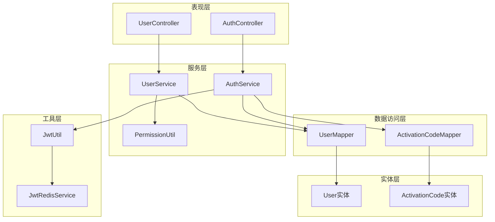

**图表来源**
- [UserController.java](file://src/main/java/com/redmoon2333/controller/UserController.java#L1-L140)
- [UserService.java](file://src/main/java/com/redmoon2333/service/UserService.java#L1-L250)
- [AuthService.java](file://src/main/java/com/redmoon2333/service/AuthService.java#L1-L199)

## 核心组件分析

### 用户服务类（UserService）

UserService是用户管理的核心服务类，提供了完整的用户信息处理功能。该类采用了Spring的@Service注解，表明其作为Spring容器中的服务组件。

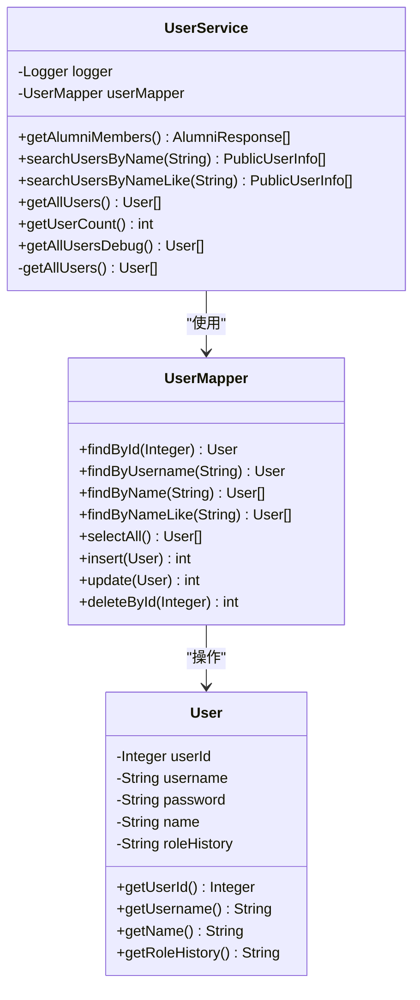

**图表来源**
- [UserService.java](file://src/main/java/com/redmoon2333/service/UserService.java#L20-L250)
- [UserMapper.java](file://src/main/java/com/redmoon2333/mapper/UserMapper.java#L1-L78)
- [User.java](file://src/main/java/com/redmoon2333/entity/User.java#L1-L99)

**章节来源**
- [UserService.java](file://src/main/java/com/redmoon2333/service/UserService.java#L1-L250)

### 控制器层设计

UserController负责处理HTTP请求，将前端的用户请求转发给相应的服务层方法。该控制器采用了RESTful API设计原则，提供了清晰的URL路径和HTTP方法映射。

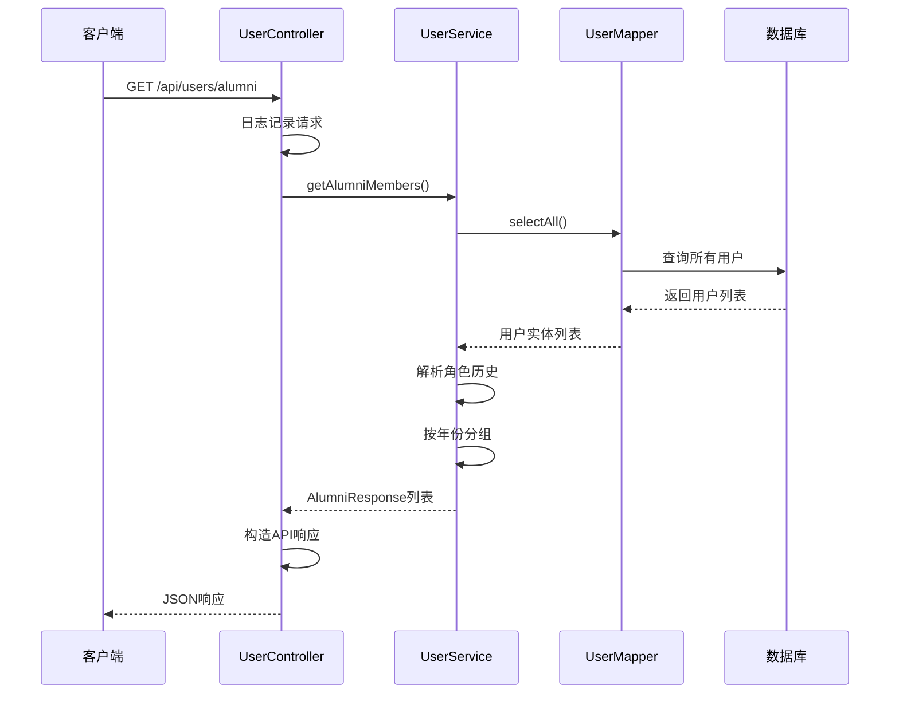

**图表来源**
- [UserController.java](file://src/main/java/com/redmoon2333/controller/UserController.java#L50-L70)
- [UserService.java](file://src/main/java/com/redmoon2333/service/UserService.java#L30-L120)

**章节来源**
- [UserController.java](file://src/main/java/com/redmoon2333/controller/UserController.java#L1-L140)

## 用户信息服务详细分析

### 往届部员信息获取功能

UserService的`getAlumniMembers()`方法是系统的核心功能之一，它实现了复杂的角色历史解析和数据分组逻辑。

该方法的工作流程如下：

1. **数据获取阶段**：首先调用`getAllUsers()`方法获取系统中的所有用户信息
2. **正则表达式解析**：使用预定义的正则表达式`(\\d{4})级(.+)`解析用户的角色历史字符串
3. **数据分组**：将解析后的部员信息按照年份进行分组
4. **结果构建**：将分组后的数据构建成标准化的AlumniResponse对象

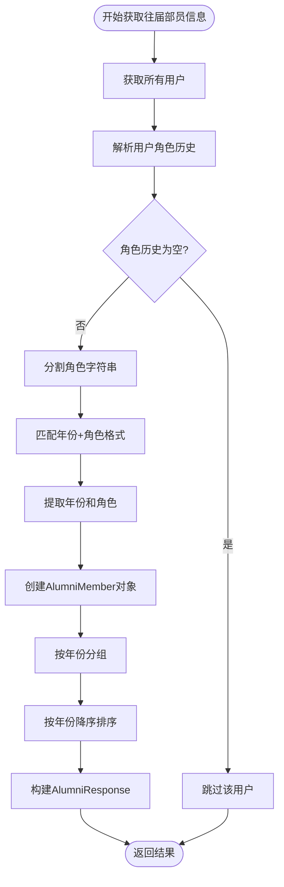

**图表来源**
- [UserService.java](file://src/main/java/com/redmoon2333/service/UserService.java#L30-L120)

### 用户搜索功能

系统提供了两种用户搜索功能：精确搜索和模糊搜索。

#### 精确搜索（searchUsersByName）
- 接收完整的用户名作为搜索条件
- 使用精确匹配算法查找用户
- 返回包含姓名和角色历史的公共用户信息

#### 模糊搜索（searchUsersByNameLike）
- 支持部分匹配，允许用户输入关键词进行搜索
- 使用SQL的LIKE语句实现模糊匹配
- 同样返回经过脱敏处理的公共信息

**章节来源**
- [UserService.java](file://src/main/java/com/redmoon2333/service/UserService.java#L120-L170)

### 数据脱敏机制

为了保护用户隐私，系统在返回用户信息时采用了数据脱敏机制：

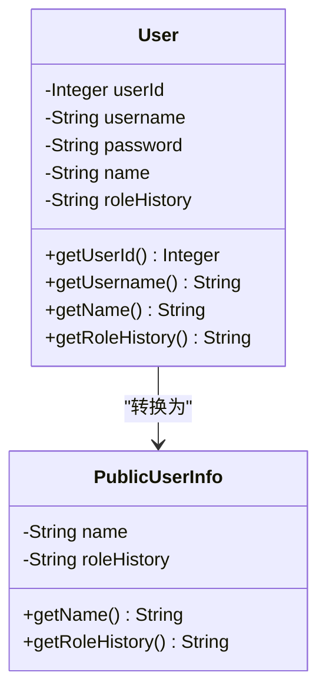

**图表来源**
- [PublicUserInfo.java](file://src/main/java/com/redmoon2333/dto/PublicUserInfo.java#L1-L29)
- [User.java](file://src/main/java/com/redmoon2333/entity/User.java#L1-L99)

**章节来源**
- [UserService.java](file://src/main/java/com/redmoon2333/service/UserService.java#L120-L170)

## 权限验证机制

### PermissionUtil工具类

PermissionUtil是系统权限控制的核心工具类，提供了完整的权限验证功能。该类通过拦截器或过滤器将用户的身份信息注入到HTTP请求属性中，然后在服务层进行权限检查。

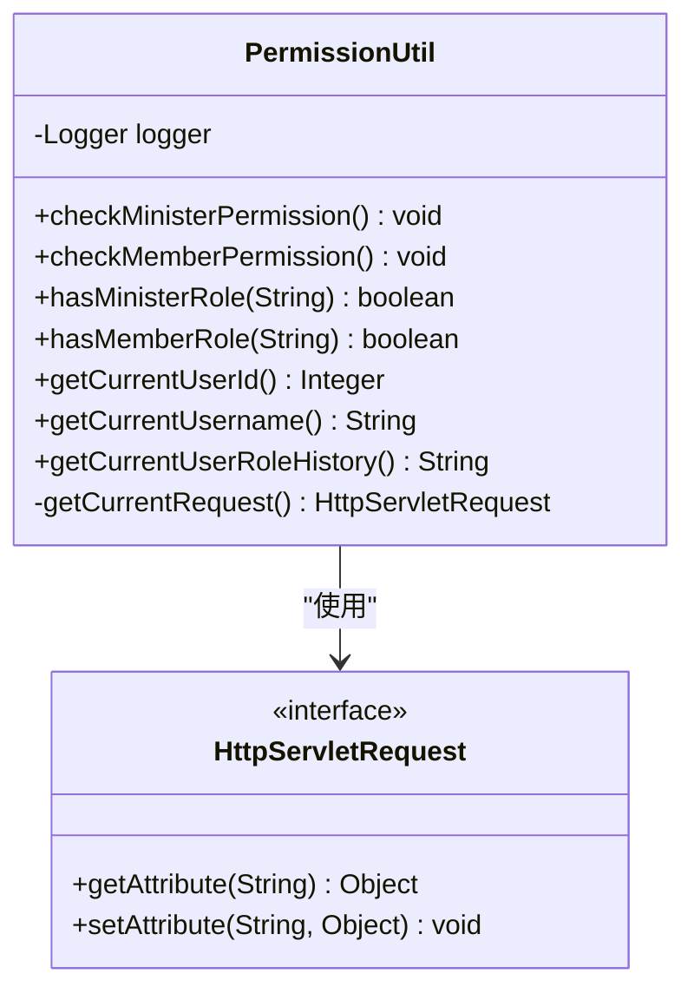

**图表来源**
- [PermissionUtil.java](file://src/main/java/com/redmoon2333/util/PermissionUtil.java#L1-L163)

### 权限级别定义

系统定义了两个主要的权限级别：

1. **部长权限（Minister Permission）**：
   - 检查用户是否包含"部长"或"副部长"身份
   - 适用于需要高级别管理权限的操作

2. **部员权限（Member Permission）**：
   - 检查用户是否包含"部员"、"副部长"或"部长"身份
   - 适用于一般性的用户操作

### 权限验证流程

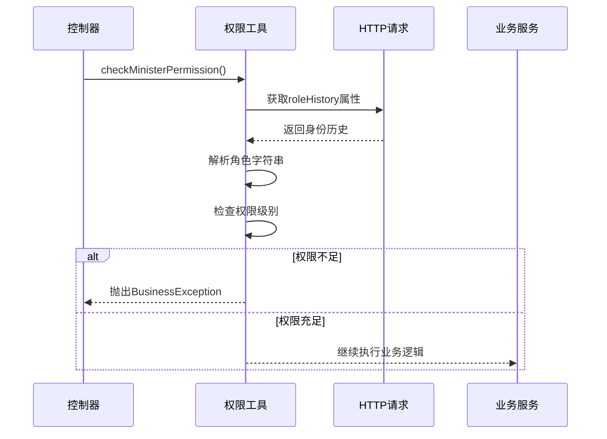

**图表来源**
- [PermissionUtil.java](file://src/main/java/com/redmoon2333/util/PermissionUtil.java#L25-L55)

**章节来源**
- [PermissionUtil.java](file://src/main/java/com/redmoon2333/util/PermissionUtil.java#L1-L163)

## 用户身份管理

### JWT令牌集成

系统采用JWT（JSON Web Token）技术进行用户身份验证和会话管理。JwtUtil类负责处理JWT令牌的生成、解析和验证。

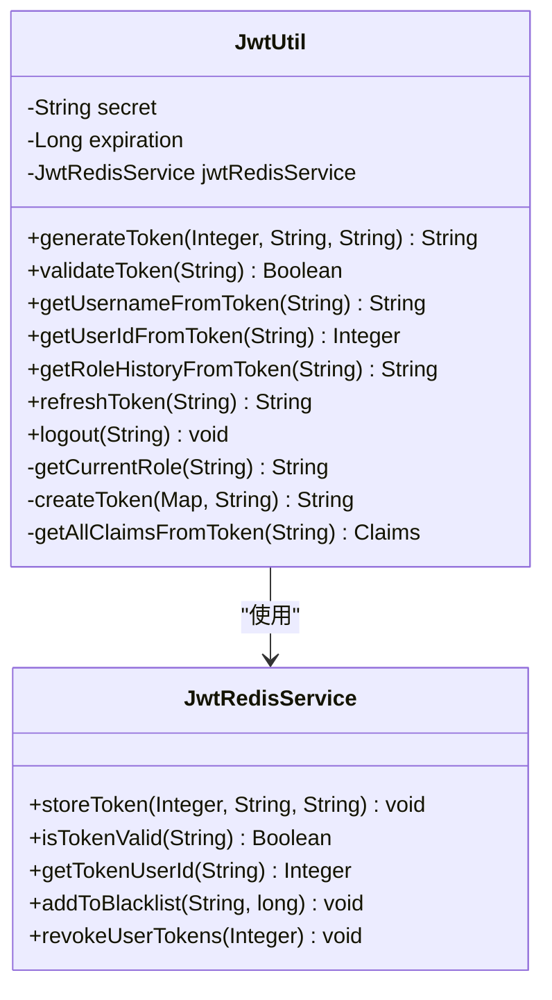

**图表来源**
- [JwtUtil.java](file://src/main/java/com/redmoon2333/util/JwtUtil.java#L1-L309)
- [AuthService.java](file://src/main/java/com/redmoon2333/service/AuthService.java#L1-L199)

### 身份历史管理

用户的身份历史（roleHistory）是一个重要的业务属性，采用特殊的格式存储：

- **格式规范**：`YYYY级角色&YYYY级角色`
- **示例**：`2024级部长&2023级部员`
- **解析逻辑**：系统使用正则表达式和字符串分割技术解析身份历史

### 令牌生命周期管理

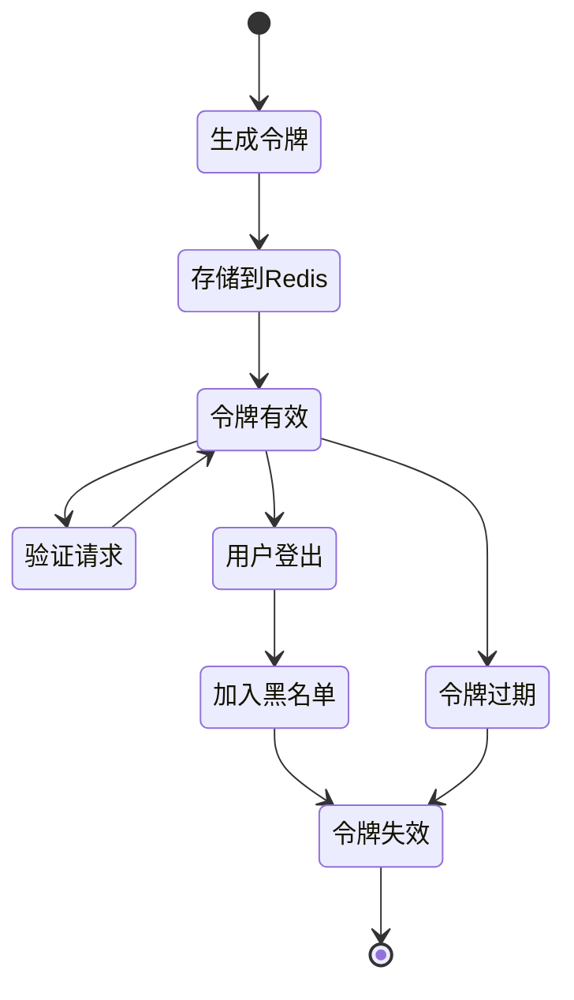

**章节来源**
- [JwtUtil.java](file://src/main/java/com/redmoon2333/util/JwtUtil.java#L1-L309)
- [AuthService.java](file://src/main/java/com/redmoon2333/service/AuthService.java#L40-L80)

## 数据访问层分析

### UserMapper接口设计

UserMapper采用了MyBatis的注解方式定义数据访问方法，提供了完整的CRUD操作：

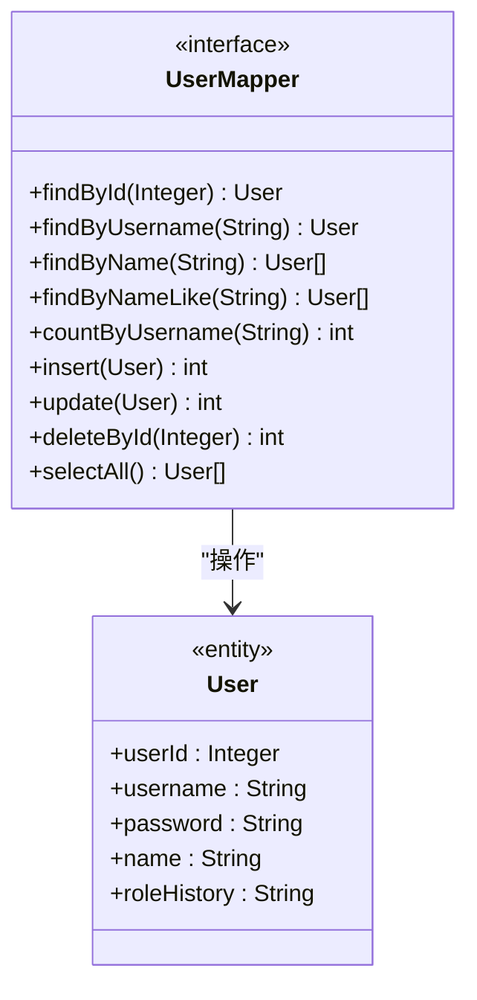

**图表来源**
- [UserMapper.java](file://src/main/java/com/redmoon2333/mapper/UserMapper.java#L1-L78)

### 数据库交互优化

系统在数据访问层面采用了多种优化策略：

1. **批量查询**：`selectAll()`方法支持一次性获取所有用户信息
2. **条件查询**：提供精确和模糊两种查询方式
3. **事务管理**：AuthService中的注册操作使用@Transactional注解确保数据一致性
4. **索引优化**：对常用查询字段（如username）建立数据库索引

**章节来源**
- [UserMapper.java](file://src/main/java/com/redmoon2333/mapper/UserMapper.java#L1-L78)

## API接口设计

### RESTful API架构

系统采用RESTful API设计原则，提供了清晰的URL路径和HTTP方法映射：

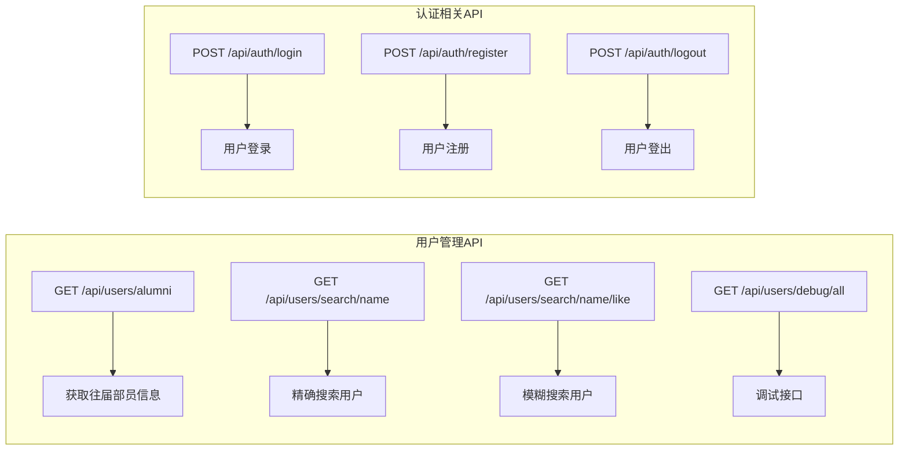

### API响应格式

系统统一使用ApiResponse作为所有API的响应格式，包含以下标准字段：

- **status**：操作状态（success/failure）
- **data**：返回的数据内容
- **message**：操作结果的描述信息
- **code**：HTTP状态码或业务错误码

### 错误处理机制

系统实现了完善的错误处理机制：

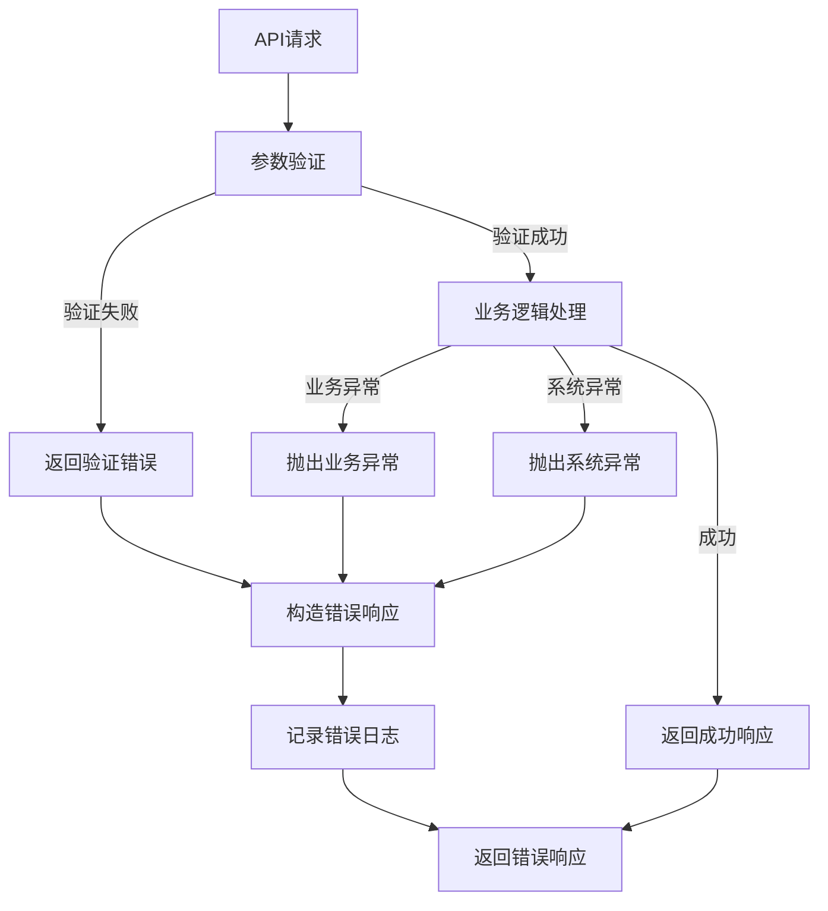

**章节来源**
- [UserController.java](file://src/main/java/com/redmoon2333/controller/UserController.java#L1-L140)

## 性能考虑

### 缓存策略

系统在多个层面实现了缓存策略以提升性能：

1. **Redis缓存**：JWT令牌存储在Redis中，支持快速验证和黑名单管理
2. **数据库缓存**：MyBatis的二级缓存配置可以减少数据库访问
3. **内存缓存**：频繁访问的用户信息可以在内存中缓存

### 查询优化

1. **索引优化**：对username、roleHistory等常用查询字段建立索引
2. **分页查询**：对于大量数据的查询，实现分页机制
3. **延迟加载**：非关键字段采用延迟加载策略

### 并发控制

系统通过以下机制保证并发安全性：

1. **事务管理**：关键业务操作使用@Transactional注解
2. **乐观锁**：在更新操作中使用版本号控制并发
3. **请求限流**：防止恶意请求导致系统过载

## 故障排除指南

### 常见问题及解决方案

#### 1. 用户权限验证失败
**症状**：用户无法访问需要特定权限的功能
**原因**：身份历史解析错误或权限检查逻辑异常
**解决方案**：
- 检查用户的角色历史格式是否正确
- 验证PermissionUtil的权限检查逻辑
- 查看系统日志中的详细错误信息

#### 2. JWT令牌验证失败
**症状**：用户登录后无法正常访问受保护的资源
**原因**：JWT令牌过期、签名验证失败或Redis连接异常
**解决方案**：
- 检查JWT配置参数（secret、expiration）
- 验证Redis服务的可用性
- 清除用户的无效令牌

#### 3. 用户搜索结果为空
**症状**：搜索用户时没有返回任何结果
**原因**：搜索条件过于严格或数据库中没有匹配的用户
**解决方案**：
- 检查搜索关键词的拼写
- 验证数据库中是否存在相关用户记录
- 考虑使用模糊搜索替代精确搜索

### 调试工具

系统提供了专门的调试接口：

```java
// 获取所有用户详细信息（调试模式）
@GetMapping("/debug/all")
public ApiResponse<?> getAllUsersDebug()

// 获取用户总数
public int getUserCount()

// 获取所有用户（调试模式）
public List<User> getAllUsersDebug()
```

这些接口可以帮助开发者诊断系统问题，但应该仅在开发和测试环境中使用。

**章节来源**
- [UserService.java](file://src/main/java/com/redmoon2333/service/UserService.java#L170-L250)
- [UserController.java](file://src/main/java/com/redmoon2333/controller/UserController.java#L30-L50)

## 总结

人力资源管理系统的用户管理服务展现了现代企业级应用的设计精髓。通过精心设计的服务架构、完善的权限控制机制和高效的性能优化策略，该系统能够满足复杂的人力资源管理需求。

### 关键特性总结

1. **完整的用户生命周期管理**：从用户注册、身份验证到权限控制的全流程覆盖
2. **灵活的角色管理**：支持多层级、多角色的用户身份体系
3. **强大的数据处理能力**：能够高效处理大规模用户数据和复杂查询
4. **完善的安全机制**：基于JWT的令牌管理和基于Redis的黑名单机制
5. **优秀的扩展性**：模块化设计便于功能扩展和维护

### 最佳实践建议

1. **持续监控**：定期监控系统性能指标和错误率
2. **安全审计**：定期审查权限设置和访问日志
3. **容量规划**：根据用户增长趋势进行合理的容量规划
4. **备份策略**：建立完善的数据备份和恢复机制
5. **文档维护**：及时更新系统文档和技术规范

该用户管理服务为整个HR系统奠定了坚实的基础，通过其可靠性和可扩展性，能够支持企业不断发展的业务需求。