# 认证服务

<cite>
**本文档引用的文件**
- [AuthService.java](file://src/main/java/com/redmoon2333/service/AuthService.java)
- [AuthController.java](file://src/main/java/com/redmoon2333/controller/AuthController.java)
- [JwtUtil.java](file://src/main/java/com/redmoon2333/util/JwtUtil.java)
- [UserMapper.java](file://src/main/java/com/redmoon2333/mapper/UserMapper.java)
- [ActivationCodeMapper.java](file://src/main/java/com/redmoon2333/mapper/ActivationCodeMapper.java)
- [User.java](file://src/main/java/com/redmoon2333/entity/User.java)
- [ActivationCode.java](file://src/main/java/com/redmoon2333/entity/ActivationCode.java)
- [LoginRequest.java](file://src/main/java/com/redmoon2333/dto/LoginRequest.java)
- [RegisterRequest.java](file://src/main/java/com/redmoon2333/dto/RegisterRequest.java)
- [BusinessException.java](file://src/main/java/com/redmoon2333/exception/BusinessException.java)
- [ErrorCode.java](file://src/main/java/com/redmoon2333/exception/ErrorCode.java)
- [ActivationStatus.java](file://src/main/java/com/redmoon2333/enums/ActivationStatus.java)
- [application.yml](file://src/main/resources/application.yml)
</cite>

## 目录
1. [简介](#简介)
2. [项目结构](#项目结构)
3. [核心组件](#核心组件)
4. [架构概览](#架构概览)
5. [详细组件分析](#详细组件分析)
6. [依赖关系分析](#依赖关系分析)
7. [性能考虑](#性能考虑)
8. [故障排除指南](#故障排除指南)
9. [结论](#结论)

## 简介

认证服务是人力资源管理系统的核心模块，负责处理用户身份验证、授权管理和会话控制。该服务实现了完整的认证流程，包括用户登录、注册、令牌管理和激活码生成等功能。通过Spring Boot框架和MyBatis持久层，提供了高效、安全的用户认证解决方案。

## 项目结构

认证服务采用分层架构设计，清晰地分离了表现层、业务逻辑层和数据访问层：

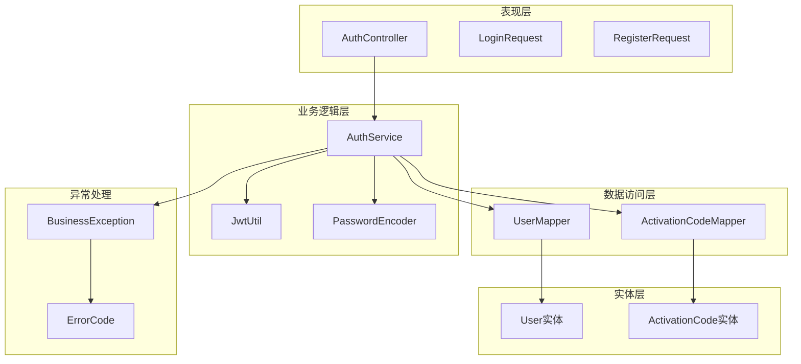

**图表来源**
- [AuthService.java](file://src/main/java/com/redmoon2333/service/AuthService.java#L1-L199)
- [AuthController.java](file://src/main/java/com/redmoon2333/controller/AuthController.java#L1-L236)

## 核心组件

认证服务的核心组件包括：

### AuthService - 主要业务逻辑处理器
- **登录功能**：验证用户凭证并生成JWT令牌
- **注册功能**：处理用户注册流程，包括激活码校验
- **令牌解析**：从JWT中提取用户信息
- **激活码生成**：为管理员生成用户注册激活码

### JwtUtil - JWT令牌管理工具
- **令牌生成**：基于用户信息生成JWT令牌
- **令牌验证**：验证令牌的有效性和安全性
- **权限检查**：检查用户是否具有特定角色权限
- **令牌刷新**：支持令牌续期功能

### 数据访问层组件
- **UserMapper**：用户数据的CRUD操作
- **ActivationCodeMapper**：激活码数据的查询和更新

**章节来源**
- [AuthService.java](file://src/main/java/com/redmoon2333/service/AuthService.java#L25-L199)
- [JwtUtil.java](file://src/main/java/com/redmoon2333/util/JwtUtil.java#L1-L309)

## 架构概览

认证服务采用经典的三层架构模式，确保了代码的可维护性和扩展性：

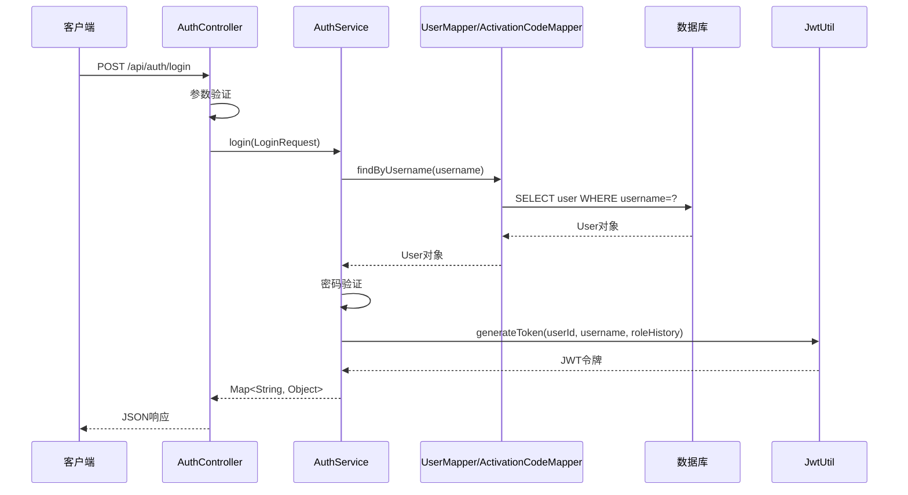

**图表来源**
- [AuthController.java](file://src/main/java/com/redmoon2333/controller/AuthController.java#L35-L55)
- [AuthService.java](file://src/main/java/com/redmoon2333/service/AuthService.java#L40-L65)

## 详细组件分析

### AuthService核心方法分析

#### 登录方法 (login)

登录方法是认证服务的核心入口点，实现了完整的用户身份验证流程：

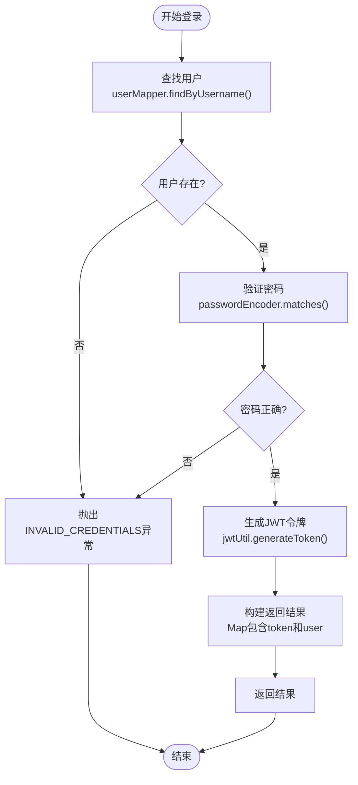

**图表来源**
- [AuthService.java](file://src/main/java/com/redmoon2333/service/AuthService.java#L40-L65)

登录方法的关键特性：
- **用户验证**：首先检查用户是否存在
- **密码安全**：使用PasswordEncoder进行安全的密码比较
- **令牌生成**：生成包含用户信息的JWT令牌
- **异常处理**：统一的业务异常处理机制

#### 注册方法 (register)

注册方法实现了完整的用户注册流程，包括激活码验证和事务管理：

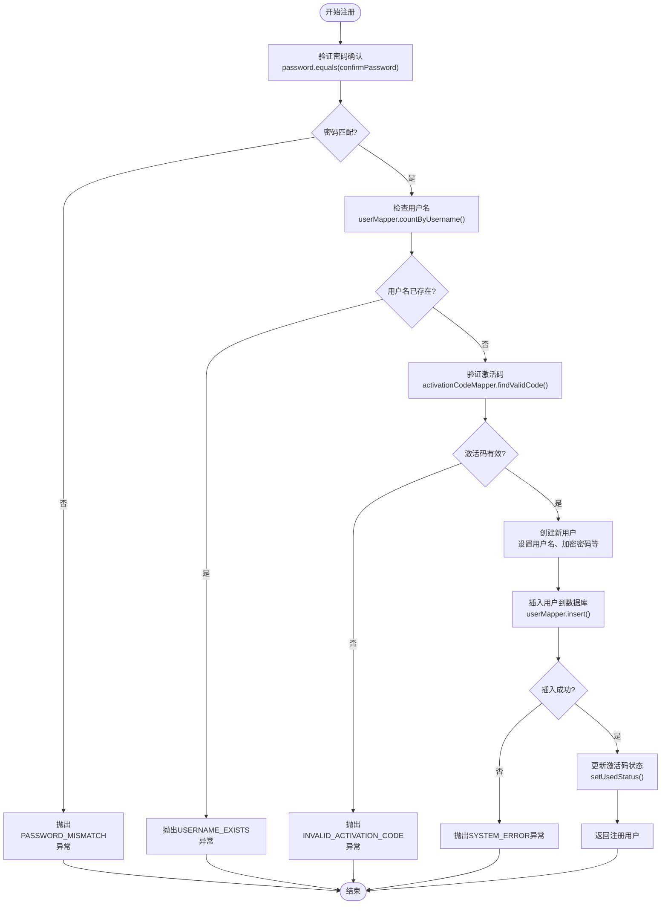

**图表来源**
- [AuthService.java](file://src/main/java/com/redmoon2333/service/AuthService.java#L67-L110)

注册方法的安全特性：
- **密码双重验证**：确保用户输入的密码一致性
- **激活码验证**：防止未经授权的用户注册
- **密码加密**：使用PasswordEncoder对密码进行哈希处理
- **事务管理**：通过@Transactional注解确保数据一致性

#### 令牌解析方法 (getUserFromToken)

该方法负责从JWT令牌中提取用户信息，是实现无状态认证的关键：

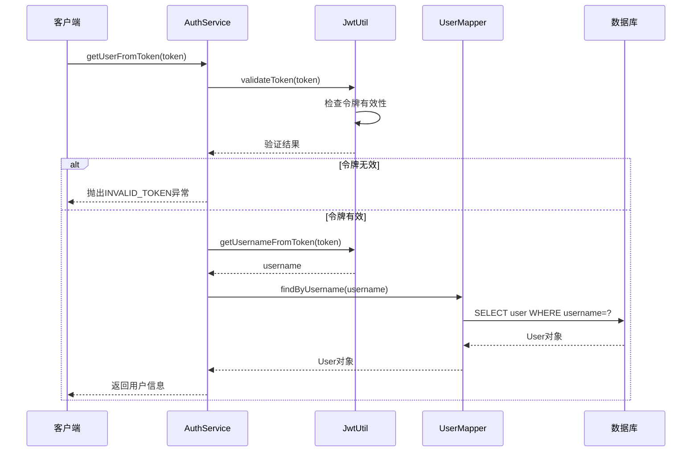

**图表来源**
- [AuthService.java](file://src/main/java/com/redmoon2333/service/AuthService.java#L112-L125)
- [JwtUtil.java](file://src/main/java/com/redmoon2333/util/JwtUtil.java#L150-L165)

#### 激活码生成方法 (generateActivationCode)

该方法为管理员提供生成用户注册激活码的功能：

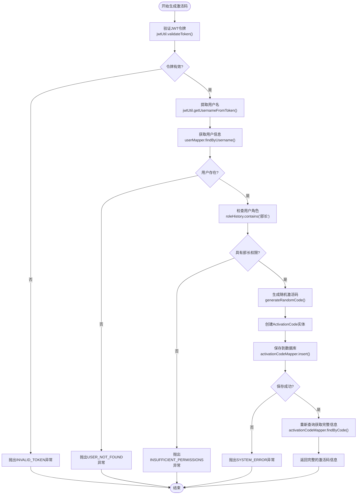

**图表来源**
- [AuthService.java](file://src/main/java/com/redmoon2333/service/AuthService.java#L127-L175)

**章节来源**
- [AuthService.java](file://src/main/java/com/redmoon2333/service/AuthService.java#L40-L175)

### JwtUtil工具类分析

JwtUtil是JWT令牌管理的核心工具类，提供了完整的令牌生命周期管理：

#### 令牌生成机制

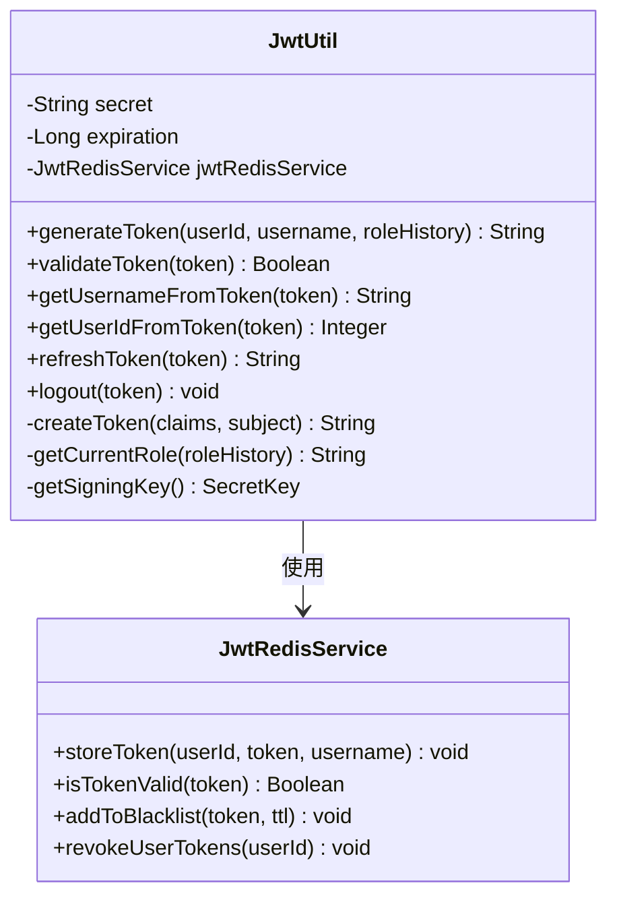

**图表来源**
- [JwtUtil.java](file://src/main/java/com/redmoon2333/util/JwtUtil.java#L20-L50)

#### 令牌验证流程

JwtUtil实现了多层验证机制，确保令牌的安全性：

1. **签名验证**：使用HMAC-SHA256算法验证令牌签名
2. **过期时间检查**：验证令牌是否已过期
3. **黑名单检查**：检查令牌是否已被强制注销
4. **Redis状态验证**：验证令牌在Redis中的状态

**章节来源**
- [JwtUtil.java](file://src/main/java/com/redmoon2333/util/JwtUtil.java#L150-L180)

### 数据模型分析

#### User实体设计

User实体包含了用户的基本信息和身份历史：

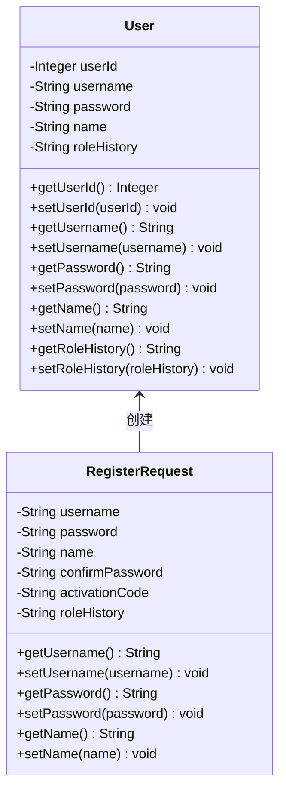

**图表来源**
- [User.java](file://src/main/java/com/redmoon2333/entity/User.java#L10-L98)
- [RegisterRequest.java](file://src/main/java/com/redmoon2333/dto/RegisterRequest.java#L10-L97)

#### ActivationCode实体设计

ActivationCode实体管理用户注册激活码的状态和生命周期：

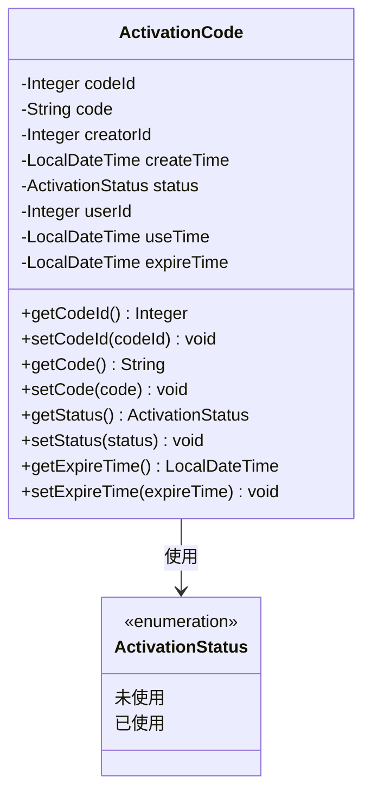

**图表来源**
- [ActivationCode.java](file://src/main/java/com/redmoon2333/entity/ActivationCode.java#L10-L127)
- [ActivationStatus.java](file://src/main/java/com/redmoon2333/enums/ActivationStatus.java#L6-L23)

**章节来源**
- [User.java](file://src/main/java/com/redmoon2333/entity/User.java#L1-L99)
- [ActivationCode.java](file://src/main/java/com/redmoon2333/entity/ActivationCode.java#L1-L128)

### 异常处理机制

认证服务采用了统一的异常处理机制，通过BusinessException提供详细的错误信息：

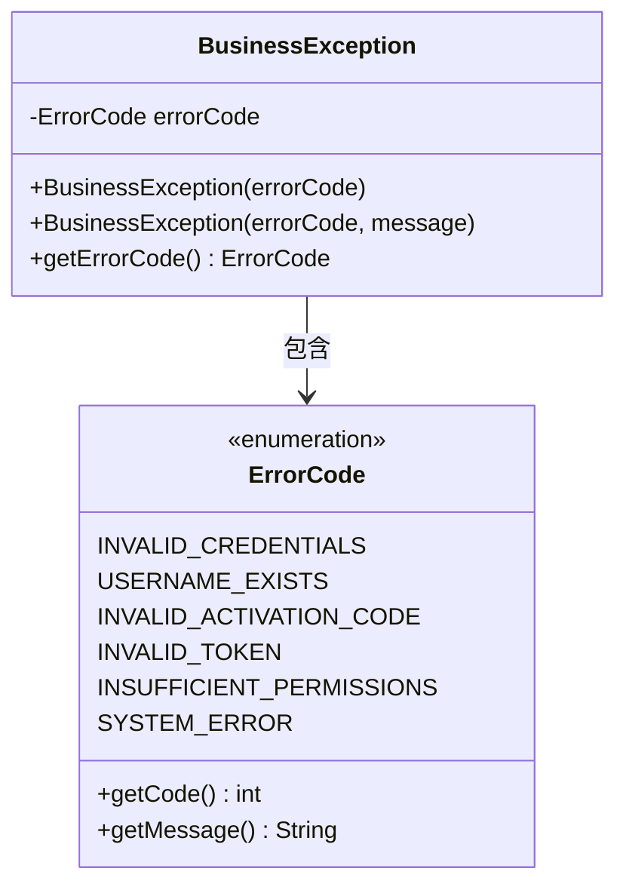

**图表来源**
- [BusinessException.java](file://src/main/java/com/redmoon2333/exception/BusinessException.java#L3-L23)
- [ErrorCode.java](file://src/main/java/com/redmoon2333/exception/ErrorCode.java#L3-L76)

**章节来源**
- [BusinessException.java](file://src/main/java/com/redmoon2333/exception/BusinessException.java#L1-L24)
- [ErrorCode.java](file://src/main/java/com/redmoon2333/exception/ErrorCode.java#L1-L77)

## 依赖关系分析

认证服务的依赖关系体现了良好的分层架构设计：

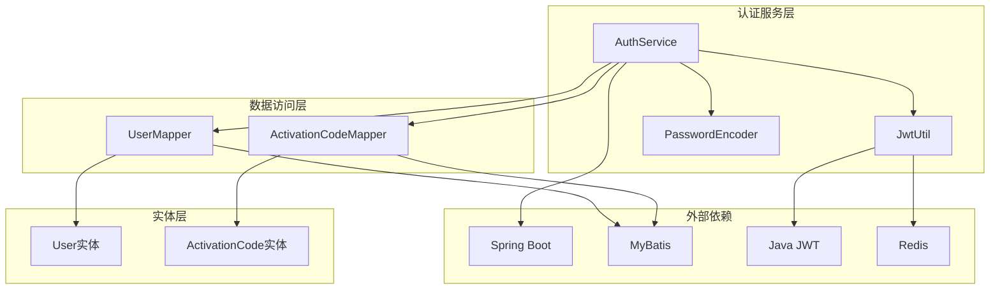

**图表来源**
- [AuthService.java](file://src/main/java/com/redmoon2333/service/AuthService.java#L1-L20)
- [JwtUtil.java](file://src/main/java/com/redmoon2333/util/JwtUtil.java#L1-L15)

**章节来源**
- [AuthService.java](file://src/main/java/com/redmoon2333/service/AuthService.java#L1-L20)
- [application.yml](file://src/main/resources/application.yml#L1-L62)

## 性能考虑

### 缓存策略

认证服务通过Redis实现了多层次的缓存策略：

1. **令牌缓存**：JWT令牌存储在Redis中，支持快速验证
2. **黑名单缓存**：已注销的令牌会被加入黑名单，避免重复验证
3. **用户信息缓存**：频繁访问的用户信息可以缓存以提高性能

### 数据库优化

1. **索引优化**：在用户名字段上建立唯一索引，提高查询效率
2. **激活码查询优化**：通过复合索引优化激活码的有效性检查
3. **事务管理**：使用@Transactional注解确保注册流程的原子性

### 密码安全

1. **哈希算法**：使用BCrypt算法对密码进行安全哈希
2. **盐值处理**：自动添加随机盐值，防止彩虹表攻击
3. **迭代次数**：合理设置哈希迭代次数，在安全性和性能间平衡

## 故障排除指南

### 常见问题及解决方案

#### 登录失败问题

**问题现象**：用户无法登录，提示"用户名或密码错误"

**可能原因**：
1. 用户名不存在
2. 密码验证失败
3. 数据库连接问题

**排查步骤**：
1. 检查用户是否存在于数据库中
2. 验证密码哈希是否正确
3. 确认数据库连接配置

#### 注册失败问题

**问题现象**：用户注册时提示"激活码无效或已过期"

**可能原因**：
1. 激活码不存在
2. 激活码已使用
3. 激活码已过期

**排查步骤**：
1. 检查激活码状态是否为"未使用"
2. 验证激活码是否在有效期内
3. 确认激活码与用户角色匹配

#### 令牌验证失败

**问题现象**：用户登录后无法正常访问受保护的资源

**可能原因**：
1. JWT配置错误
2. Redis连接问题
3. 令牌被强制注销

**排查步骤**：
1. 检查JWT密钥配置
2. 验证Redis连接状态
3. 确认令牌不在黑名单中

**章节来源**
- [AuthService.java](file://src/main/java/com/redmoon2333/service/AuthService.java#L40-L175)
- [JwtUtil.java](file://src/main/java/com/redmoon2333/util/JwtUtil.java#L150-L180)

## 结论

认证服务作为人力资源管理系统的核心组件，实现了完整的用户身份验证和授权管理功能。通过Spring Boot框架的依赖注入、MyBatis的数据持久化、JWT的无状态认证和Redis的高性能缓存，构建了一个安全、高效、可扩展的认证系统。

### 主要优势

1. **安全性**：采用多层安全机制，包括密码哈希、令牌验证、权限检查等
2. **可扩展性**：清晰的分层架构便于功能扩展和维护
3. **高性能**：Redis缓存和数据库优化确保系统响应速度
4. **易维护**：统一的异常处理和日志记录机制

### 改进建议

1. **监控机制**：增加认证成功率和异常类型的监控指标
2. **审计日志**：记录关键认证操作的日志信息
3. **多因素认证**：考虑引入短信验证码等额外验证方式
4. **速率限制**：对登录和注册接口实施速率限制，防止暴力破解

该认证服务为整个系统提供了坚实的身份验证基础，确保了用户数据的安全性和系统的可靠性。