# 认证服务

<cite>
**本文档引用的文件**
- [AuthService.java](file://src/main/java/com/redmoon2333/service/AuthService.java)
- [UserMapper.java](file://src/main/java/com/redmoon2333/mapper/UserMapper.java)
- [ActivationCodeMapper.java](file://src/main/java/com/redmoon2333/mapper/ActivationCodeMapper.java)
- [JwtUtil.java](file://src/main/java/com/redmoon2333/util/JwtUtil.java)
- [LoginRequest.java](file://src/main/java/com/redmoon2333/dto/LoginRequest.java)
- [RegisterRequest.java](file://src/main/java/com/redmoon2333/dto/RegisterRequest.java)
- [User.java](file://src/main/java/com/redmoon2333/entity/User.java)
- [ActivationCode.java](file://src/main/java/com/redmoon2333/entity/ActivationCode.java)
- [AuthController.java](file://src/main/java/com/redmoon2333/controller/AuthController.java)
- [BusinessException.java](file://src/main/java/com/redmoon2333/exception/BusinessException.java)
- [ErrorCode.java](file://src/main/java/com/redmoon2333/exception/ErrorCode.java)
- [application.yml](file://src/main/resources/application.yml)
</cite>

## 目录
1. [简介](#简介)
2. [项目架构概览](#项目架构概览)
3. [核心组件分析](#核心组件分析)
4. [认证服务详细分析](#认证服务详细分析)
5. [JWT令牌系统](#jwt令牌系统)
6. [异常处理机制](#异常处理机制)
7. [数据流分析](#数据流分析)
8. [性能考虑](#性能考虑)
9. [故障排除指南](#故障排除指南)
10. [总结](#总结)

## 简介

本认证服务是人力资源管理系统的核心模块，负责处理用户的身份验证、授权和会话管理。该服务实现了完整的用户生命周期管理，包括登录、注册、令牌生成和权限验证等功能。系统采用Spring Boot框架，结合MyBatis进行数据持久化，使用JWT技术实现无状态认证。

## 项目架构概览

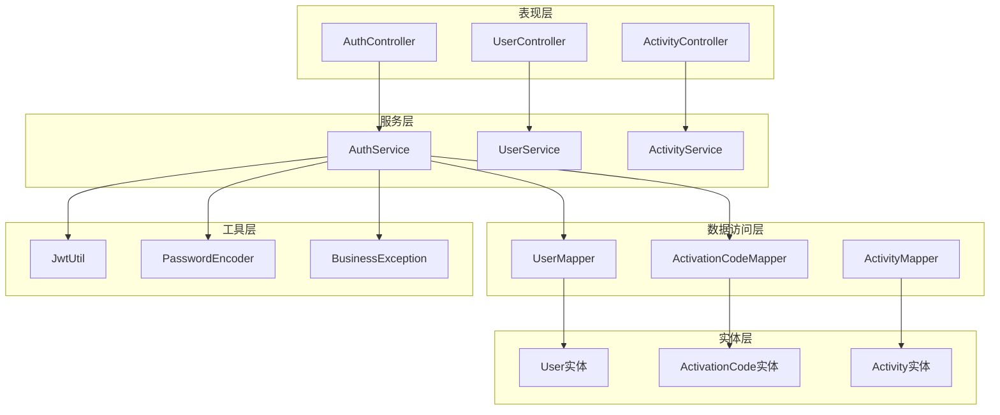

**图表来源**
- [AuthController.java](file://src/main/java/com/redmoon2333/controller/AuthController.java#L1-L153)
- [AuthService.java](file://src/main/java/com/redmoon2333/service/AuthService.java#L1-L199)

## 核心组件分析

### AuthService - 认证服务核心类

AuthService是整个认证系统的核心服务类，承担以下主要职责：

- **用户认证**：处理用户登录验证
- **用户注册**：管理用户注册流程
- **令牌管理**：生成和解析JWT令牌
- **激活码管理**：生成和验证激活码

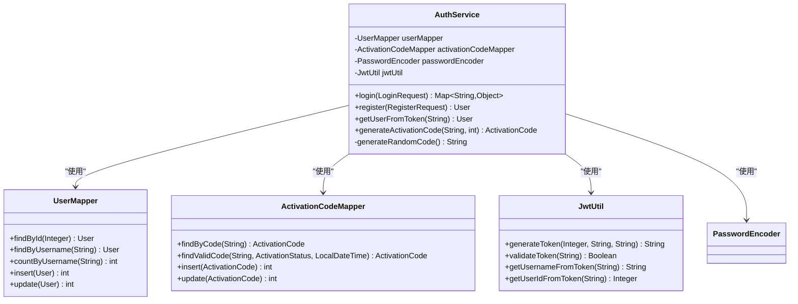

**图表来源**
- [AuthService.java](file://src/main/java/com/redmoon2333/service/AuthService.java#L25-L199)
- [UserMapper.java](file://src/main/java/com/redmoon2333/mapper/UserMapper.java#L1-L78)
- [ActivationCodeMapper.java](file://src/main/java/com/redmoon2333/mapper/ActivationCodeMapper.java#L1-L48)

**章节来源**
- [AuthService.java](file://src/main/java/com/redmoon2333/service/AuthService.java#L1-L199)

## 认证服务详细分析

### 登录功能 (login方法)

登录功能是认证服务的第一个核心入口点，其实现包含了完整的密码验证和令牌生成流程。

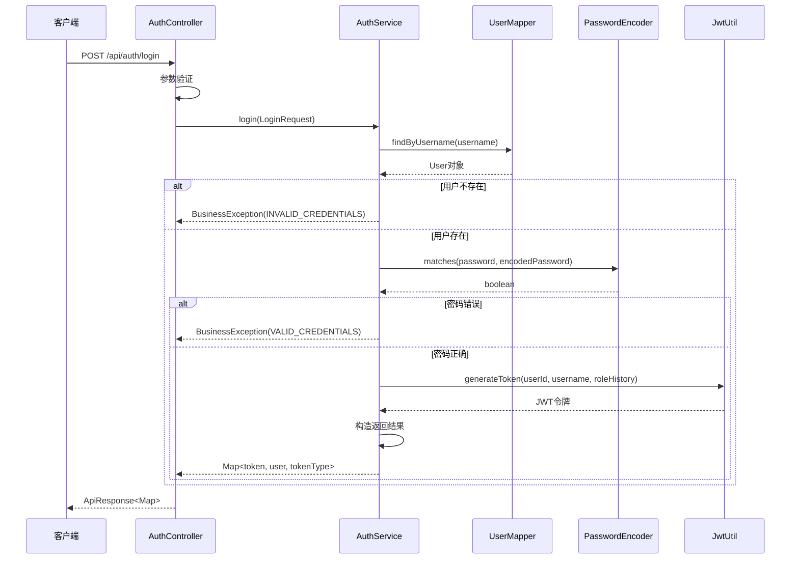

**图表来源**
- [AuthService.java](file://src/main/java/com/redmoon2333/service/AuthService.java#L40-L65)
- [AuthController.java](file://src/main/java/com/redmoon2333/controller/AuthController.java#L30-L50)

#### 密码验证逻辑

登录方法中的密码验证采用了Spring Security推荐的安全实践：

1. **用户查找**：首先通过用户名查找用户
2. **空值检查**：如果用户不存在，立即抛出业务异常
3. **密码匹配**：使用BCryptPasswordEncoder进行安全比较
4. **异常处理**：统一的业务异常处理机制

#### 令牌生成流程

令牌生成过程包含以下关键步骤：

1. **声明构建**：创建包含用户ID、用户名和角色历史的声明
2. **当前角色提取**：从完整角色历史中提取当前身份
3. **令牌创建**：使用HMAC-SHA256算法签名生成JWT
4. **响应构造**：返回包含令牌、用户信息和类型的数据结构

**章节来源**
- [AuthService.java](file://src/main/java/com/redmoon2333/service/AuthService.java#L40-L65)

### 用户注册功能 (register方法)

注册功能是一个复杂的事务性操作，涉及多个数据表的协调更新。

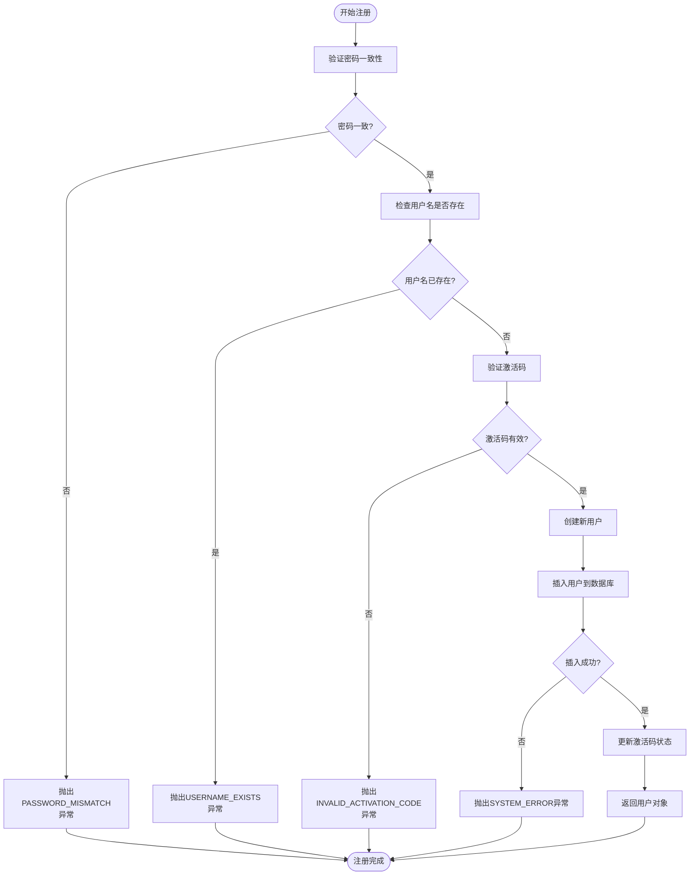

**图表来源**
- [AuthService.java](file://src/main/java/com/redmoon2333/service/AuthService.java#L67-L110)

#### 事务边界管理

注册方法使用了`@Transactional`注解，确保以下操作的原子性：

1. **用户创建**：插入新用户记录
2. **激活码更新**：标记激活码为已使用并关联用户ID

这种设计保证了要么全部成功，要么全部回滚，维护了数据的一致性。

#### 激活码验证机制

激活码验证包含多层检查：

1. **格式验证**：检查激活码字符串
2. **状态检查**：确保激活码未被使用
3. **时效性检查**：验证激活码是否过期
4. **业务规则检查**：确保激活码仍在有效期内

**章节来源**
- [AuthService.java](file://src/main/java/com/redmoon2333/service/AuthService.java#L67-L110)

### 令牌解析功能 (getUserFromToken方法)

该方法负责从JWT令牌中提取用户信息，是实现无状态认证的关键组件。

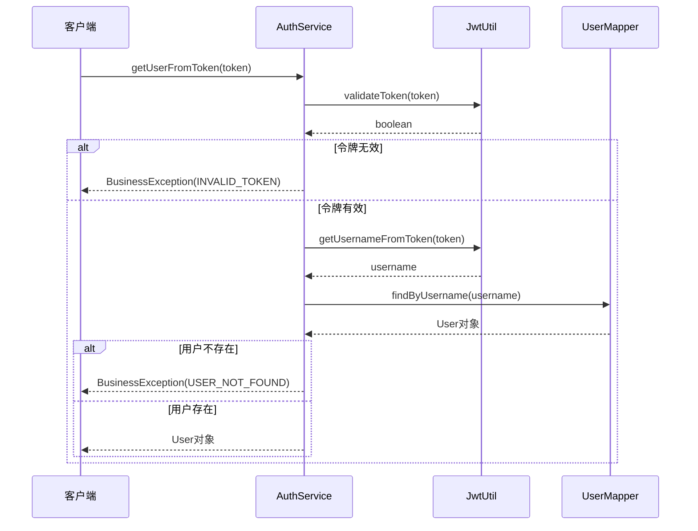

**图表来源**
- [AuthService.java](file://src/main/java/com/redmoon2333/service/AuthService.java#L112-L125)

#### 令牌验证策略

令牌解析采用了双重验证机制：

1. **语法验证**：检查JWT格式是否正确
2. **语义验证**：验证签名完整性
3. **时效验证**：检查令牌是否过期

这种方法确保了令牌的安全性和有效性。

**章节来源**
- [AuthService.java](file://src/main/java/com/redmoon2333/service/AuthService.java#L112-L125)

### 激活码生成功能 (generateActivationCode方法)

激活码生成功能是管理员权限控制的重要体现，展示了复杂的权限验证和随机码生成逻辑。

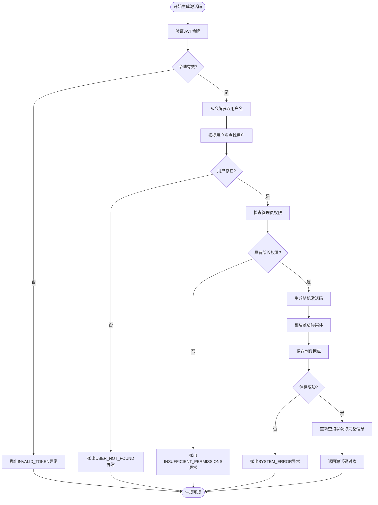

**图表来源**
- [AuthService.java](file://src/main/java/com/redmoon2333/service/AuthService.java#L127-L175)

#### 权限校验机制

权限验证采用了基于角色历史的复杂逻辑：

1. **令牌解析**：从JWT中提取用户名
2. **用户查找**：根据用户名获取用户信息
3. **角色历史解析**：分析用户的完整角色历史
4. **权限判断**：检查是否包含"部长"关键词（包括副部长）

这种设计允许灵活的角色管理，支持多层级的组织结构。

#### 随机码生成算法

激活码生成使用了自定义的随机字符生成算法：

```java
private String generateRandomCode() {
    String chars = "ABCDEFGHIJKLMNOPQRSTUVWXYZabcdefghijklmnopqrstuvwxyz0123456789";
    StringBuilder code = new StringBuilder();
    for (int i = 0; i < 16; i++) {
        int index = (int) (Math.random() * chars.length());
        code.append(chars.charAt(index));
    }
    return code.toString();
}
```

该算法生成16位的字母数字组合，提供了足够的熵值确保安全性。

**章节来源**
- [AuthService.java](file://src/main/java/com/redmoon2333/service/AuthService.java#L127-L175)

## JWT令牌系统

### 令牌结构设计

JWT令牌包含了丰富的用户信息，支持无状态认证：

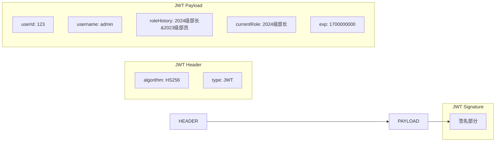

**图表来源**
- [JwtUtil.java](file://src/main/java/com/redmoon2333/util/JtUtil.java#L40-L55)

### 令牌生命周期管理

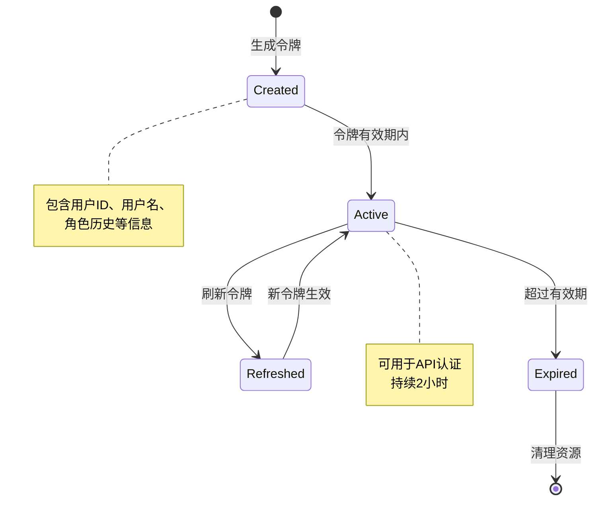

**图表来源**
- [JwtUtil.java](file://src/main/java/com/redmoon2333/util/JwtUtil.java#L20-L30)

**章节来源**
- [JwtUtil.java](file://src/main/java/com/redmoon2333/util/JwtUtil.java#L1-L229)

## 异常处理机制

### BusinessException统一异常处理

系统采用了统一的业务异常处理机制，通过ErrorCode枚举提供标准化的错误码和消息：

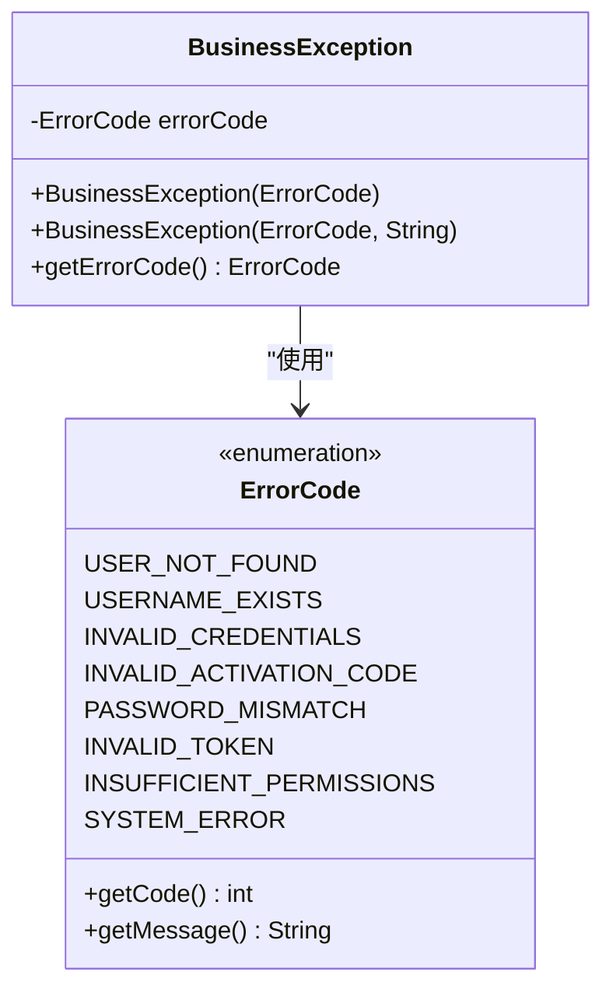

**图表来源**
- [BusinessException.java](file://src/main/java/com/redmoon2333/exception/BusinessException.java#L1-L24)
- [ErrorCode.java](file://src/main/java/com/redmoon2333/exception/ErrorCode.java#L1-L55)

### 错误码分类体系

系统按照功能域对错误码进行了分类：

1. **用户相关错误** (1000-1999)：用户名、密码、激活码验证
2. **Token相关错误** (2000-2999)：令牌验证、过期、格式错误
3. **权限相关错误** (3000-3999)：权限不足、角色验证
4. **系统错误** (5000-5999)：通用系统异常

这种分类方式便于前端理解和处理不同类型的错误。

**章节来源**
- [BusinessException.java](file://src/main/java/com/redmoon2333/exception/BusinessException.java#L1-L24)
- [ErrorCode.java](file://src/main/java/com/redmoon2333/exception/ErrorCode.java#L1-L55)

## 数据流分析

### 用户注册数据流

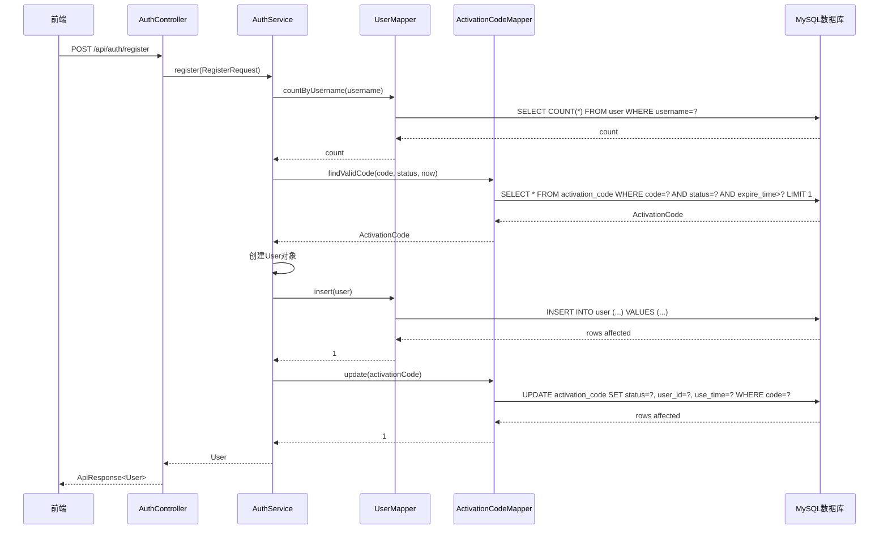

**图表来源**
- [AuthService.java](file://src/main/java/com/redmoon2333/service/AuthService.java#L67-L110)
- [AuthController.java](file://src/main/java/com/redmoon2333/controller/AuthController.java#L52-L80)

### 登录认证数据流

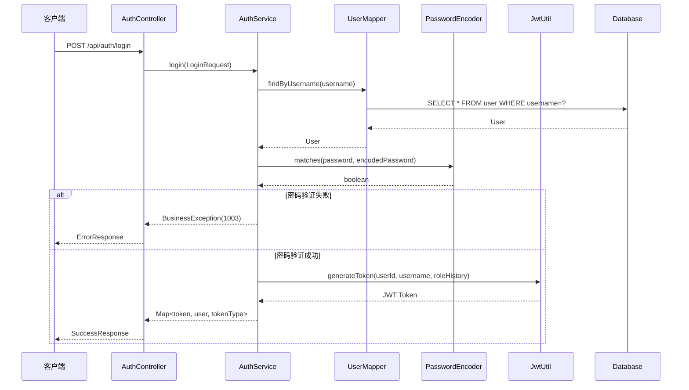

**图表来源**
- [AuthService.java](file://src/main/java/com/redmoon2333/service/AuthService.java#L40-L65)
- [AuthController.java](file://src/main/java/com/redmoon2333/controller/AuthController.java#L30-L50)

## 性能考虑

### 缓存策略建议

虽然当前实现没有显式的缓存机制，但可以考虑以下优化：

1. **用户信息缓存**：缓存频繁访问的用户信息
2. **令牌验证缓存**：缓存已验证的令牌信息
3. **激活码缓存**：缓存有效的激活码信息

### 数据库优化

1. **索引优化**：
   - 在`user.username`上建立唯一索引
   - 在`activation_code.code`上建立唯一索引
   - 在`activation_code.status`和`expire_time`上建立复合索引

2. **查询优化**：
   - 使用预编译语句防止SQL注入
   - 实现连接池管理数据库连接

### 并发处理

系统通过以下机制处理并发问题：

1. **事务隔离**：使用数据库事务确保数据一致性
2. **乐观锁**：在更新操作中使用版本号控制
3. **幂等性**：确保重复请求不会产生副作用

## 故障排除指南

### 常见问题及解决方案

#### 1. 登录失败 (INVALID_CREDENTIALS)

**可能原因**：
- 用户名不存在
- 密码错误
- 数据库连接问题

**排查步骤**：
1. 检查用户名是否正确
2. 验证密码是否经过BCrypt加密
3. 确认数据库连接正常

#### 2. 注册失败 (USERNAME_EXISTS)

**可能原因**：
- 用户名已被占用
- 数据库约束冲突

**解决方案**：
1. 使用不同的用户名
2. 检查数据库唯一约束

#### 3. 令牌验证失败 (INVALID_TOKEN)

**可能原因**：
- 令牌格式错误
- 签名验证失败
- 令牌已过期

**解决方法**：
1. 检查令牌格式是否为Bearer Token
2. 验证JWT密钥配置
3. 确认系统时间同步

#### 4. 权限不足 (INSUFFICIENT_PERMISSIONS)

**可能原因**：
- 用户角色不符合要求
- 角色历史格式错误

**修复方案**：
1. 确保用户具有正确的角色历史
2. 检查角色历史格式：`年份级角色&年份级角色`

**章节来源**
- [AuthService.java](file://src/main/java/com/redmoon2333/service/AuthService.java#L40-L175)
- [ErrorCode.java](file://src/main/java/com/redmoon2333/exception/ErrorCode.java#L1-L55)

## 总结

本认证服务展现了现代Web应用认证系统的设计精髓：

### 技术亮点

1. **安全设计**：采用BCrypt密码加密、JWT令牌认证、事务管理等安全措施
2. **架构清晰**：遵循分层架构原则，职责分离明确
3. **异常统一**：通过BusinessException提供标准化的错误处理
4. **扩展性强**：支持角色历史、多层级权限管理

### 功能完整性

- **用户认证**：完整的登录验证流程
- **用户注册**：带激活码的注册机制
- **令牌管理**：JWT令牌的生成、验证和刷新
- **权限控制**：基于角色的历史权限管理

### 最佳实践

1. **事务边界**：合理使用@Transactional注解
2. **异常处理**：统一的业务异常处理机制
3. **数据验证**：DTO层面的参数验证
4. **日志记录**：适当的调试信息输出

该认证服务为整个HR系统提供了坚实的安全基础，支持未来的功能扩展和性能优化需求。