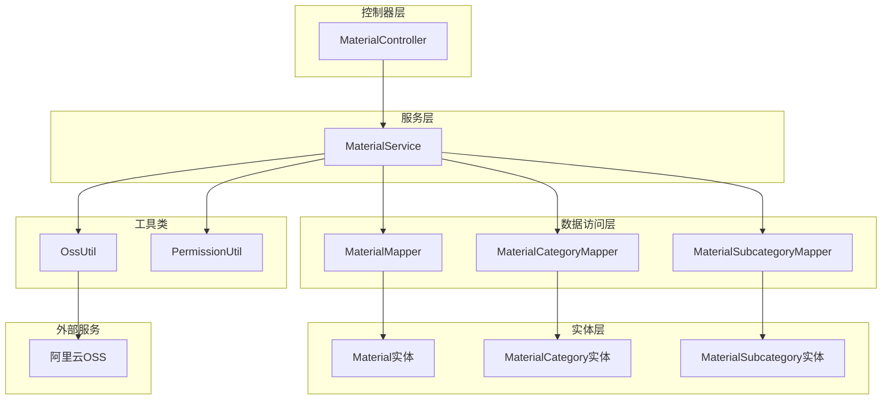
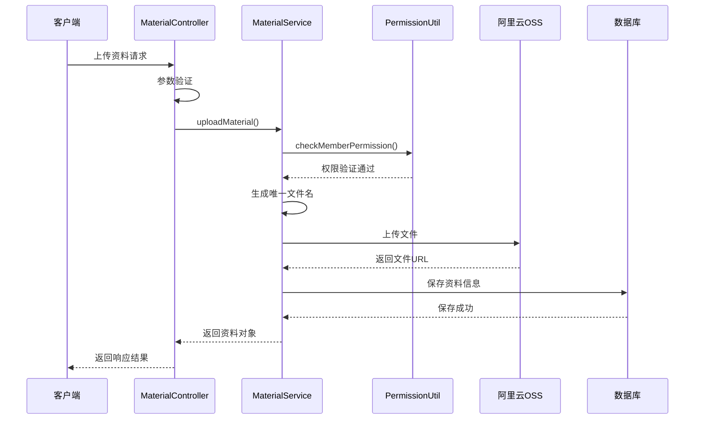
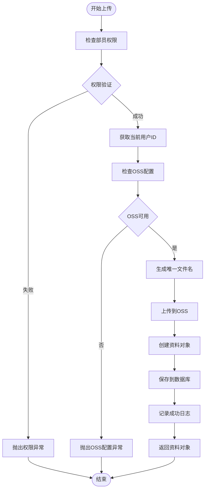
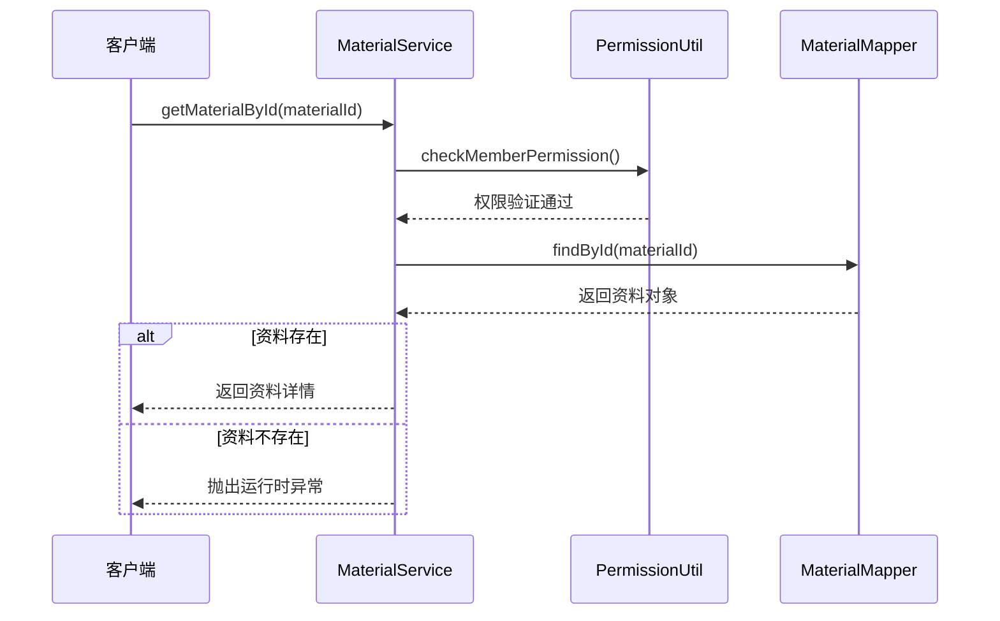
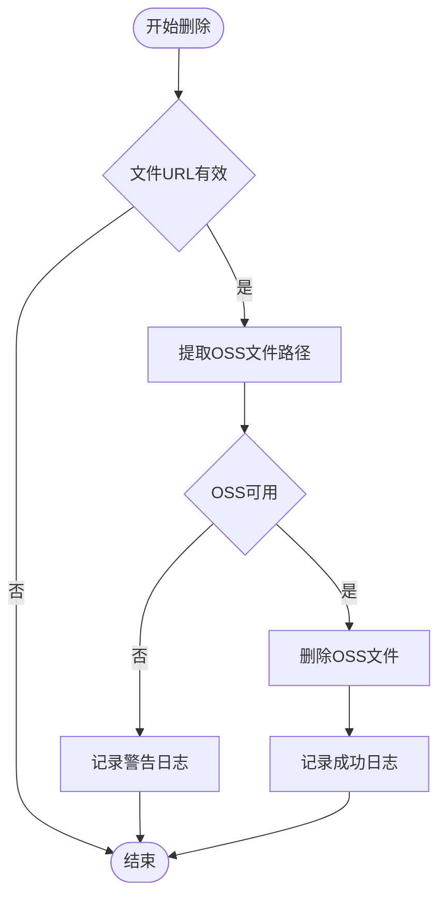
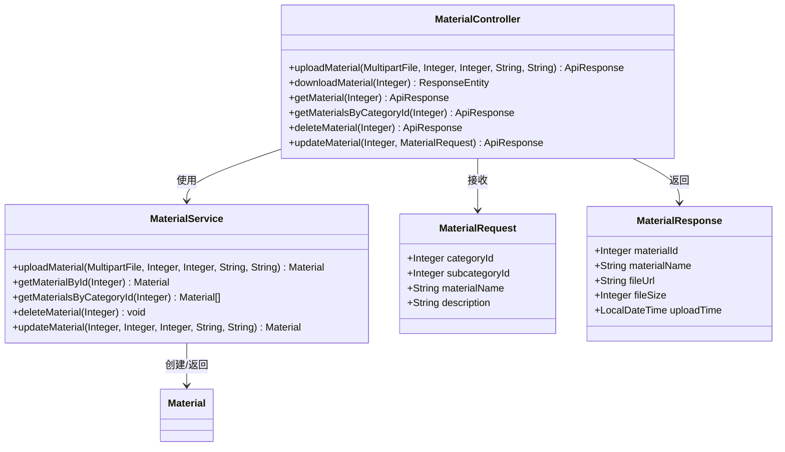
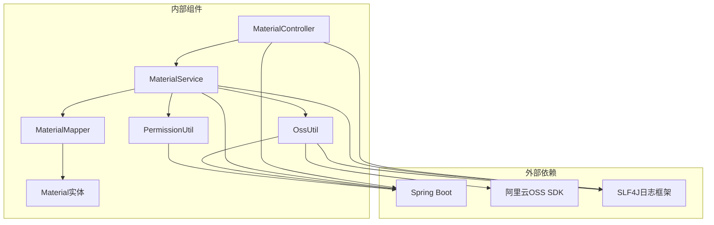

# 资料管理服务

<cite>
**本文档引用的文件**
- [MaterialService.java](file://src/main/java/com/redmoon2333/service/MaterialService.java)
- [MaterialController.java](file://src/main/java/com/redmoon2333/controller/MaterialController.java)
- [OssUtil.java](file://src/main/java/com/redmoon2333/util/OssUtil.java)
- [PermissionUtil.java](file://src/main/java/com/redmoon2333/util/PermissionUtil.java)
- [Material.java](file://src/main/java/com/redmoon2333/entity/Material.java)
- [MaterialRequest.java](file://src/main/java/com/redmoon2333/dto/MaterialRequest.java)
- [MaterialResponse.java](file://src/main/java/com/redmoon2333/dto/MaterialResponse.java)
</cite>

## 目录
1. [简介](#简介)
2. [项目结构](#项目结构)
3. [核心组件](#核心组件)
4. [架构概览](#架构概览)
5. [详细组件分析](#详细组件分析)
6. [依赖关系分析](#依赖关系分析)
7. [性能考虑](#性能考虑)
8. [故障排除指南](#故障排除指南)
9. [结论](#结论)

## 简介

资料管理服务是人力资源管理系统中的核心模块，负责处理内部资料的全生命周期管理。该服务提供了完整的资料上传、查询、更新、删除功能，支持分类管理和权限控制，采用Spring Boot框架构建，集成了阿里云OSS存储服务。

主要功能包括：
- 资料文件上传与存储
- 资料信息查询与检索
- 分类体系管理
- 细粒度权限控制
- 数据库与OSS的双重存储
- 事务一致性保障

## 项目结构

资料管理服务采用分层架构设计，遵循Spring Boot最佳实践：



**图表来源**
- [MaterialController.java](file://src/main/java/com/redmoon2333/controller/MaterialController.java#L1-L328)
- [MaterialService.java](file://src/main/java/com/redmoon2333/service/MaterialService.java#L1-L459)

## 核心组件

### MaterialService - 主要业务逻辑处理器

MaterialService是资料管理的核心服务类，提供完整的资料管理功能。该类使用Spring的@Service注解标记为服务组件，并通过@Autowired注入所需的依赖。

主要特性：
- **事务管理**：关键操作使用@Transactional注解确保数据一致性
- **权限控制**：集成PermissionUtil实现细粒度权限验证
- **OSS集成**：通过OssUtil与阿里云OSS无缝对接
- **异常处理**：统一的业务异常处理机制

### OssUtil - 对象存储工具类

OssUtil封装了阿里云OSS的所有操作，提供文件上传、删除等核心功能。该类具有以下特点：

- **配置管理**：通过Spring的@Value注解读取OSS配置
- **客户端管理**：支持自动注入和手动创建OSS客户端
- **安全性**：敏感信息遮蔽显示，防止泄露
- **扩展性**：支持多种文件类型的处理

### PermissionUtil - 权限验证工具

PermissionUtil实现了基于角色的历史权限验证机制，支持多层次的权限控制：

- **角色识别**：解析用户的身份历史字符串
- **权限分级**：区分部员、副部长、部长三个级别
- **请求上下文**：通过ThreadLocal获取当前请求信息
- **异常处理**：统一的权限异常处理

**章节来源**
- [MaterialService.java](file://src/main/java/com/redmoon2333/service/MaterialService.java#L1-L459)
- [OssUtil.java](file://src/main/java/com/redmoon2333/util/OssUtil.java#L1-L211)
- [PermissionUtil.java](file://src/main/java/com/redmoon2333/util/PermissionUtil.java#L1-L163)

## 架构概览

资料管理服务采用经典的三层架构模式，结合Spring Boot的依赖注入和AOP特性：



**图表来源**
- [MaterialController.java](file://src/main/java/com/redmoon2333/controller/MaterialController.java#L40-L60)
- [MaterialService.java](file://src/main/java/com/redmoon2333/service/MaterialService.java#L45-L85)

## 详细组件分析

### uploadMaterial 方法详解

uploadMaterial方法是资料上传的核心流程，实现了完整的文件处理和数据持久化过程：



**图表来源**
- [MaterialService.java](file://src/main/java/com/redmoon2333/service/MaterialService.java#L45-L85)

#### 权限校验机制

权限校验通过PermissionUtil的checkMemberPermission方法实现，确保只有部员及以上级别的用户才能上传资料：

```java
// 权限检查示例
permissionUtil.checkMemberPermission();
Integer uploaderId = permissionUtil.getCurrentUserId();
```

权限验证流程：
1. 从HTTP请求中提取用户身份历史
2. 解析身份历史字符串，判断是否包含部员及以上身份
3. 如果权限不足，抛出BusinessException异常
4. 记录详细的权限验证日志

#### 文件上传至OSS

文件上传过程分为多个步骤：

1. **文件扩展名提取**：从原始文件名中提取扩展名
2. **唯一文件名生成**：使用UUID确保文件名唯一性
3. **OSS上传**：调用OssUtil.uploadFile方法完成上传
4. **URL构建**：生成可访问的文件URL

```java
// 文件上传核心代码
String originalFilename = file.getOriginalFilename();
String extension = originalFilename != null ? 
    originalFilename.substring(originalFilename.lastIndexOf(".")) : "";
String uniqueFilename = UUID.randomUUID().toString() + extension;
String fileUrl = ossUtil.uploadFile(file);
```

#### 元数据存储

资料对象包含丰富的元数据信息：

```java
Material material = new Material();
material.setCategoryId(categoryId);
material.setSubcategoryId(subcategoryId);
material.setMaterialName(materialName);
material.setDescription(description);
material.setFileUrl(fileUrl);
material.setFileSize((int) file.getSize());
material.setFileType(extension);
material.setUploadTime(LocalDateTime.now());
material.setUploaderId(uploaderId);
```

### 查询功能分析

#### getMaterialById 方法

该方法提供单个资料的详细查询功能：



**图表来源**
- [MaterialService.java](file://src/main/java/com/redmoon2333/service/MaterialService.java#L150-L165)

#### getMaterialsByCategoryId 方法

该方法支持按分类ID批量查询资料：

```java
public List<Material> getMaterialsByCategoryId(Integer categoryId) {
    logger.info("根据分类ID获取资料列表: categoryId={}", categoryId);
    
    // 检查权限（部员及以上）
    permissionUtil.checkMemberPermission();

    List<Material> materials = materialMapper.findByCategoryId(categoryId);
    logger.info("成功获取资料列表: categoryId={}, 数量={}", categoryId, materials.size());
    return materials;
}
```

### 删除功能分析

#### deleteMaterialFile 方法

安全的文件删除机制：



**图表来源**
- [MaterialService.java](file://src/main/java/com/redmoon2333/service/MaterialService.java#L100-L120)

#### 路径解析机制

extractOssFilePath方法智能解析不同格式的OSS文件URL：

```java
private String extractOssFilePath(String fileUrl) {
    if (fileUrl == null || fileUrl.isEmpty()) {
        return null;
    }

    // 处理自定义域名的情况
    String domain = System.getProperty("aliyun.oss.domain");
    if (domain != null && !domain.isEmpty() && fileUrl.startsWith(domain)) {
        return fileUrl.substring(domain.length() + 1);
    }

    // 处理默认OSS域名的情况
    int thirdSlashIndex = fileUrl.indexOf("/", 8);
    if (thirdSlashIndex != -1) {
        return fileUrl.substring(thirdSlashIndex + 1);
    }

    return null;
}
```

**章节来源**
- [MaterialService.java](file://src/main/java/com/redmoon2333/service/MaterialService.java#L45-L165)
- [MaterialService.java](file://src/main/java/com/redmoon2333/service/MaterialService.java#L100-L120)

### API设计与映射

MaterialController提供了RESTful API接口，与MaterialService形成清晰的映射关系：



**图表来源**
- [MaterialController.java](file://src/main/java/com/redmoon2333/controller/MaterialController.java#L40-L327)
- [MaterialService.java](file://src/main/java/com/redmoon2333/service/MaterialService.java#L45-L85)

**章节来源**
- [MaterialController.java](file://src/main/java/com/redmoon2333/controller/MaterialController.java#L40-L327)

## 依赖关系分析

资料管理服务的依赖关系体现了良好的分层架构设计：



**图表来源**
- [MaterialService.java](file://src/main/java/com/redmoon2333/service/MaterialService.java#L1-L30)
- [MaterialController.java](file://src/main/java/com/redmoon2333/controller/MaterialController.java#L1-L30)

**章节来源**
- [MaterialService.java](file://src/main/java/com/redmoon2333/service/MaterialService.java#L1-L30)

## 性能考虑

### 事务管理策略

MaterialService中的关键操作都使用@Transactional注解，确保数据的一致性：

- **原子性**：上传操作要么完全成功，要么完全回滚
- **一致性**：数据库记录与OSS文件保持同步
- **隔离性**：并发操作不会相互影响
- **持久性**：提交后的更改永久保存

### 缓存策略

虽然当前实现没有显式的缓存机制，但可以通过以下方式优化：

1. **分类信息缓存**：频繁访问的分类信息可以缓存
2. **用户权限缓存**：减少重复的权限验证开销
3. **文件URL缓存**：对于静态文件URL可以设置适当的缓存策略

### 异步处理

对于大文件上传，可以考虑异步处理：

- **异步上传**：使用消息队列处理文件上传任务
- **进度通知**：实时反馈上传进度给前端
- **错误恢复**：支持断点续传和错误重试

## 故障排除指南

### 常见问题及解决方案

#### OSS配置问题

**问题症状**：文件上传失败，提示OSS配置不可用

**解决方案**：
1. 检查application.yml中的OSS配置项
2. 验证AccessKey和Bucket配置
3. 确认网络连接正常
4. 查看OSS控制台权限设置

#### 权限验证失败

**问题症状**：用户无法执行资料相关操作

**解决方案**：
1. 检查JWT令牌的有效性
2. 验证用户的身份历史信息
3. 确认角色权限配置
4. 查看权限验证日志

#### 文件大小限制

**问题症状**：上传大文件失败

**解决方案**：
1. 检查MaxUploadSizeExceededException异常
2. 调整Spring Boot的文件上传大小限制
3. 提供友好的错误提示信息

**章节来源**
- [MaterialService.java](file://src/main/java/com/redmoon2333/service/MaterialService.java#L55-L65)
- [MaterialController.java](file://src/main/java/com/redmoon2333/controller/MaterialController.java#L50-L60)

## 结论

资料管理服务是一个设计良好、功能完整的资料管理解决方案。它成功地整合了Spring Boot的企业级特性、阿里云OSS的高可靠性存储，以及细粒度的权限控制系统。

### 主要优势

1. **架构清晰**：分层架构设计，职责分离明确
2. **权限完善**：基于角色的历史权限验证机制
3. **数据一致**：事务管理确保操作的原子性
4. **扩展性强**：模块化设计便于功能扩展
5. **日志丰富**：详细的日志记录便于问题排查

### 改进建议

1. **缓存优化**：引入适当的缓存机制提升性能
2. **监控告警**：添加系统监控和异常告警
3. **测试覆盖**：增加单元测试和集成测试覆盖率
4. **文档完善**：补充详细的API文档和使用指南

该服务为人力资源管理系统提供了坚实的资料管理基础，能够满足企业内部资料的安全存储、高效检索和便捷管理需求。