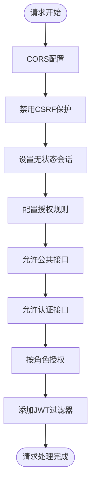

# 安全架构

<cite>
**本文档引用的文件**
- [SecurityConfig.java](file://src/main/java/com/redmoon2333/config/SecurityConfig.java)
- [JwtAuthenticationFilter.java](file://src/main/java/com/redmoon2333/config/JwtAuthenticationFilter.java)
- [JwtUtil.java](file://src/main/java/com/redmoon2333/util/JwtUtil.java)
- [PermissionAspect.java](file://src/main/java/com/redmoon2333/aspect/PermissionAspect.java)
- [PermissionUtil.java](file://src/main/java/com/redmoon2333/util/PermissionUtil.java)
- [RequireMinisterRole.java](file://src/main/java/com/redmoon2333/annotation/RequireMinisterRole.java)
- [AuthController.java](file://src/main/java/com/redmoon2333/controller/AuthController.java)
- [AuthService.java](file://src/main/java/com/redmoon2333/service/AuthService.java)
- [application.yml](file://src/main/resources/application.yml)
</cite>

## 目录
1. [简介](#简介)
2. [项目结构概览](#项目结构概览)
3. [核心安全组件](#核心安全组件)
4. [架构概览](#架构概览)
5. [详细组件分析](#详细组件分析)
6. [安全威胁模型与防护](#安全威胁模型与防护)
7. [最佳实践与扩展建议](#最佳实践与扩展建议)
8. [故障排除指南](#故障排除指南)
9. [总结](#总结)

## 简介

本系统采用基于Spring Security框架构建的现代化安全架构，实现了完整的基于JWT的认证机制和基于角色的访问控制（RBAC）体系。该架构设计旨在为人力资源管理系统提供多层次的安全防护，确保用户数据的机密性、完整性和可用性。

系统的核心安全特性包括：
- 基于JWT的无状态认证机制
- 细粒度的基于角色的访问控制
- 方法级别的权限验证
- 完整的CORS配置支持
- 多层次的安全过滤链

## 项目结构概览

系统安全相关的代码主要分布在以下几个关键包中：


**图表来源**
- [SecurityConfig.java](file://src/main/java/com/redmoon2333/config/SecurityConfig.java#L1-L112)
- [JwtAuthenticationFilter.java](file://src/main/java/com/redmoon2333/config/JwtAuthenticationFilter.java#L1-L132)
- [JwtUtil.java](file://src/main/java/com/redmoon2333/util/JwtUtil.java#L1-L229)

## 核心安全组件

### 1. SecurityConfig - 安全配置中心

SecurityConfig是整个安全架构的核心配置类，负责定义全局安全策略和过滤器链。

**主要功能：**
- CORS跨域资源共享配置
- CSRF保护禁用（适用于JWT无状态认证）
- 会话管理策略设置
- 请求授权规则配置
- JWT认证过滤器集成

### 2. JwtAuthenticationFilter - JWT认证过滤器

这是一个自定义的过滤器，继承自OncePerRequestFilter，负责拦截所有HTTP请求并验证JWT令牌。

**核心职责：**
- 提取并验证Authorization头中的JWT令牌
- 解析用户身份信息和角色历史
- 构建Spring Security的认证上下文
- 设置用户属性到请求上下文中

### 3. JwtUtil - JWT工具类

提供完整的JWT操作功能，包括令牌生成、解析、验证和刷新。

**主要方法：**
- `generateToken()` - 生成包含用户信息的JWT令牌
- `validateToken()` - 验证令牌的有效性
- `getUsernameFromToken()` - 从令牌中提取用户名
- `refreshToken()` - 刷新过期的JWT令牌

**章节来源**
- [SecurityConfig.java](file://src/main/java/com/redmoon2333/config/SecurityConfig.java#L1-L112)
- [JwtAuthenticationFilter.java](file://src/main/java/com/redmoon2333/config/JwtAuthenticationFilter.java#L1-L132)
- [JwtUtil.java](file://src/main/java/com/redmoon2333/util/JwtUtil.java#L1-L229)

## 架构概览

系统采用分层的安全架构设计，通过多层过滤器和拦截器实现全面的安全防护：


**图表来源**
- [JwtAuthenticationFilter.java](file://src/main/java/com/redmoon2333/config/JwtAuthenticationFilter.java#L30-L131)
- [PermissionAspect.java](file://src/main/java/com/redmoon2333/aspect/PermissionAspect.java#L1-L40)

## 详细组件分析

### SecurityConfig 安全配置详解

SecurityConfig类通过Spring Security的Java配置方式，定义了完整的安全策略：



**图表来源**
- [SecurityConfig.java](file://src/main/java/com/redmoon2333/config/SecurityConfig.java#L70-L111)

**关键配置要点：**

1. **CORS策略配置**：支持多个开发环境的跨域访问
2. **无状态认证**：禁用CSRF保护，设置STATELESS会话策略
3. **细粒度授权**：针对不同接口路径设置不同的访问权限
4. **JWT过滤器集成**：在认证过滤器之前添加JWT验证

### JwtAuthenticationFilter 过滤器分析

JwtAuthenticationFilter是整个认证流程的核心组件：


**图表来源**
- [JwtAuthenticationFilter.java](file://src/main/java/com/redmoon2333/config/JwtAuthenticationFilter.java#L25-L131)
- [JwtUtil.java](file://src/main/java/com/redmoon2333/util/JwtUtil.java#L15-L229)

**过滤器工作流程：**

1. **令牌提取**：从Authorization头中提取Bearer令牌
2. **用户名解析**：使用JwtUtil解析令牌获取用户名
3. **权限构建**：根据角色历史构建用户权限列表
4. **上下文设置**：将认证信息设置到Spring Security上下文中
5. **请求属性注入**：将用户信息添加到请求属性中

### JwtUtil 工具类深度分析

JwtUtil提供了完整的JWT生命周期管理：


**图表来源**
- [JwtUtil.java](file://src/main/java/com/redmoon2333/util/JwtUtil.java#L30-L229)

**核心功能实现：**

1. **密钥管理**：使用HMAC-SHA256算法生成签名密钥
2. **声明构建**：包含用户ID、用户名、角色历史等信息
3. **过期时间控制**：默认2小时有效期，可配置
4. **权限检查**：支持基于角色历史的权限验证

### PermissionAspect 权限切面

PermissionAspect通过AOP技术实现方法级别的权限控制：


**图表来源**
- [PermissionAspect.java](file://src/main/java/com/redmoon2333/aspect/PermissionAspect.java#L20-L39)
- [PermissionUtil.java](file://src/main/java/com/redmoon2333/util/PermissionUtil.java#L20-L50)

**章节来源**
- [PermissionAspect.java](file://src/main/java/com/redmoon2333/aspect/PermissionAspect.java#L1-L40)
- [PermissionUtil.java](file://src/main/java/com/redmoon2333/util/PermissionUtil.java#L1-L117)

## 安全威胁模型与防护

### 常见安全威胁及防护措施

1. **JWT令牌泄露防护**
   - **威胁**：令牌在网络传输中被窃取
   - **防护**：HTTPS传输，短令牌有效期，定期刷新机制

2. **权限提升攻击**
   - **威胁**：恶意用户伪造高权限角色
   - **防护**：服务器端严格验证角色历史，避免客户端信任

3. **重放攻击**
   - **威胁**：攻击者重复使用有效的旧令牌
   - **防护**：令牌包含时间戳，服务器端验证过期时间

4. **CSRF攻击**
   - **威胁**：跨站请求伪造
   - **防护**：禁用CSRF保护，依赖JWT令牌验证

### 安全配置最佳实践

1. **密钥管理**
   ```yaml
   jwt:
     secret: ${JWT_SECRET:hr-official-jwt-secret-key-2024-redmoon2333-human-resource-system}
     expiration: 7200000
   ```

2. **CORS配置**
   - 仅允许可信的前端域名
   - 限制允许的HTTP方法
   - 控制凭据发送

3. **请求过滤**
   - 明确区分公共接口和受保护接口
   - 实施细粒度的路径匹配
   - 支持动态权限检查

## 最佳实践与扩展建议

### 安全配置优化建议

1. **密钥轮换机制**
   - 定期更新JWT密钥
   - 实现密钥版本管理
   - 渐进式密钥切换

2. **令牌黑名单**
   - 实现已注销令牌的黑名单
   - 支持主动撤销令牌
   - 定期清理过期令牌记录

3. **监控与审计**
   - 记录所有认证和授权事件
   - 监控异常访问模式
   - 实现安全告警机制

### RBAC系统扩展

1. **角色层次化**
   - 支持角色继承关系
   - 实现角色优先级机制
   - 动态角色分配

2. **资源细化**
   - 基于资源类型的权限控制
   - 实现细粒度的操作权限
   - 支持条件权限表达式

3. **审计追踪**
   - 记录所有权限变更
   - 跟踪权限使用情况
   - 生成合规报告

## 故障排除指南

### 常见问题诊断

1. **JWT令牌验证失败**
   - 检查令牌格式是否正确
   - 验证密钥配置是否一致
   - 确认时间同步问题

2. **权限验证异常**
   - 检查角色历史格式
   - 验证注解使用是否正确
   - 确认请求属性是否正确设置

3. **CORS配置问题**
   - 检查允许的源域名配置
   - 验证预检请求处理
   - 确认凭据发送设置

### 调试技巧

1. **启用详细日志**
   ```yaml
   logging:
     level:
       com.redmoon2333.config: DEBUG
       org.springframework.security: DEBUG
   ```

2. **令牌解析测试**
   - 使用在线JWT解析工具
   - 手动验证令牌内容
   - 检查声明字段完整性

3. **权限验证测试**
   - 单独测试权限工具类
   - 验证切面拦截效果
   - 模拟不同角色场景

**章节来源**
- [application.yml](file://src/main/resources/application.yml#L1-L30)

## 总结

本系统构建了一个完整且灵活的安全架构，通过以下关键特性确保系统的安全性：

1. **基于JWT的无状态认证**：提供高效的用户身份验证机制
2. **细粒度的RBAC访问控制**：支持复杂的角色权限管理
3. **多层次的安全防护**：从网络层到应用层的全方位保护
4. **灵活的权限验证机制**：支持运行时权限检查和编译时权限控制
5. **完善的配置管理**：支持环境变量和动态配置

该安全架构不仅满足了当前的人力资源管理系统的安全需求，还具备良好的扩展性和维护性，为未来的功能扩展和安全加固提供了坚实的基础。通过持续的监控、审计和优化，可以进一步提升系统的整体安全水平。