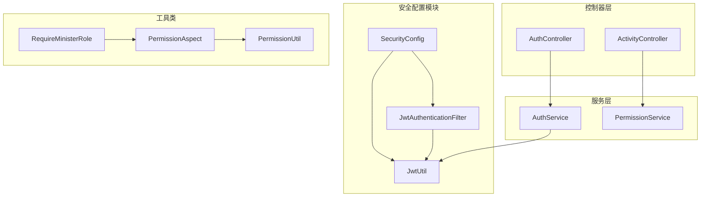
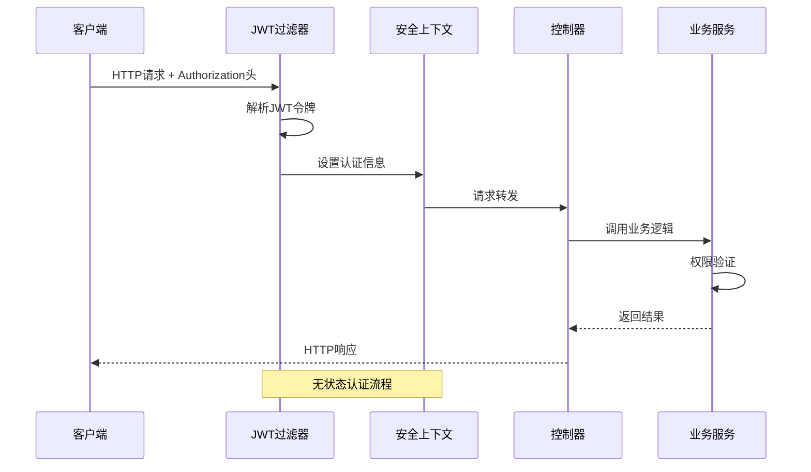
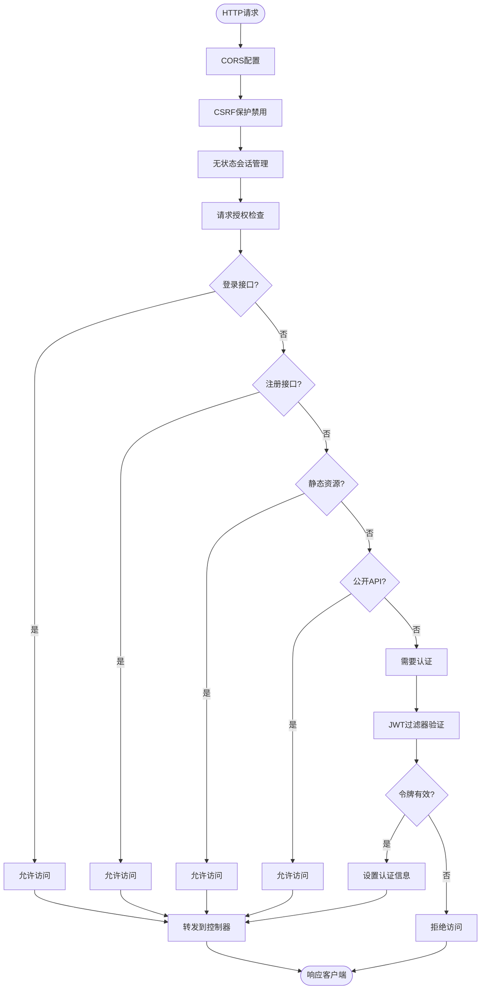
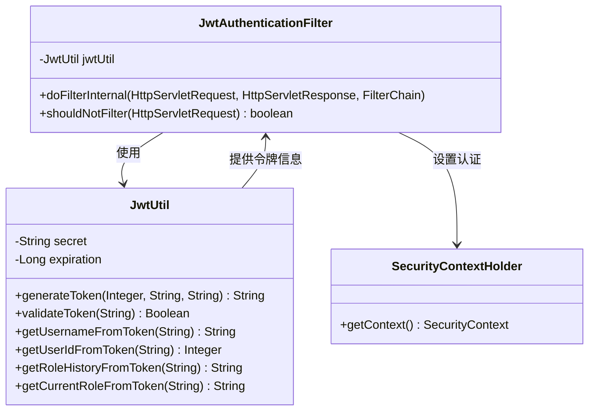
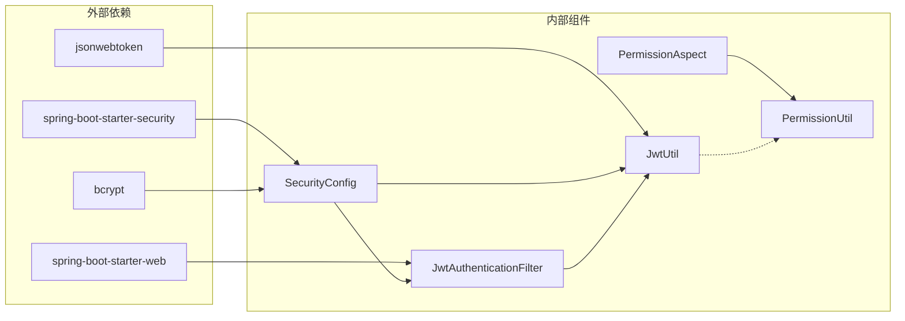

# 安全配置

<cite>
**本文档引用的文件**
- [SecurityConfig.java](file://src/main/java/com/redmoon2333/config/SecurityConfig.java)
- [JwtAuthenticationFilter.java](file://src/main/java/com/redmoon2333/config/JwtAuthenticationFilter.java)
- [JwtUtil.java](file://src/main/java/com/redmoon2333/util/JwtUtil.java)
- [application.yml](file://src/main/resources/application.yml)
- [AuthController.java](file://src/main/java/com/redmoon2333/controller/AuthController.java)
- [AuthService.java](file://src/main/java/com/redmoon2333/service/AuthService.java)
- [PermissionAspect.java](file://src/main/java/com/redmoon2333/aspect/PermissionAspect.java)
- [PermissionUtil.java](file://src/main/java/com/redmoon2333/util/PermissionUtil.java)
- [RequireMinisterRole.java](file://src/main/java/com/redmoon2333/annotation/RequireMinisterRole.java)
- [ActivityController.java](file://src/main/java/com/redmoon2333/controller/ActivityController.java)
</cite>

## 目录
1. [简介](#简介)
2. [项目结构概览](#项目结构概览)
3. [核心安全配置组件](#核心安全配置组件)
4. [架构概览](#架构概览)
5. [详细组件分析](#详细组件分析)
6. [依赖关系分析](#依赖关系分析)
7. [性能考虑](#性能考虑)
8. [故障排除指南](#故障排除指南)
9. [结论](#结论)

## 简介

本文档全面解析了Human Resource Official系统中的安全配置机制。该系统采用Spring Security框架结合JWT（JSON Web Token）技术实现了一套完整的身份验证和授权体系。通过@EnableWebSecurity和@EnableMethodSecurity注解的配置，系统实现了方法级别的细粒度权限控制，并通过自定义的JWT过滤器链确保了RESTful API的安全访问。

系统的核心安全特性包括：
- 基于JWT的身份验证机制
- 方法级别的权限控制（@EnableMethodSecurity）
- CORS跨域资源共享配置
- 无状态会话管理
- 细粒度的请求授权规则
- 自定义权限验证切面

## 项目结构概览



**图表来源**
- [SecurityConfig.java](file://src/main/java/com/redmoon2333/config/SecurityConfig.java#L1-L112)
- [JwtAuthenticationFilter.java](file://src/main/java/com/redmoon2333/config/JwtAuthenticationFilter.java#L1-L132)

**章节来源**
- [SecurityConfig.java](file://src/main/java/com/redmoon2333/config/SecurityConfig.java#L1-L112)
- [application.yml](file://src/main/resources/application.yml#L1-L30)

## 核心安全配置组件

### Spring Security注解配置

系统通过两个关键注解启用了Spring Security的核心功能：

```java
@Configuration
@EnableWebSecurity
@EnableMethodSecurity(prePostEnabled = true)
public class SecurityConfig {
    // 配置内容
}
```

**@EnableWebSecurity注解作用：**
- 启用Spring Security的Web应用程序安全配置
- 提供HTTP安全配置的基础框架
- 允许自定义SecurityFilterChain配置

**@EnableMethodSecurity注解作用：**
- 启用方法级别的安全控制
- 支持prePostEnabled = true，允许使用@PreAuthorize和@PostAuthorize注解
- 实现基于表达式的访问控制
- 提供细粒度的权限控制能力

### 密码编码器配置

```java
@Bean
public PasswordEncoder passwordEncoder() {
    return new BCryptPasswordEncoder();
}
```

**BCryptPasswordEncoder特点：**
- 使用bcrypt算法对密码进行哈希处理
- 自带盐值生成，防止彩虹表攻击
- 支持可配置的工作因子，平衡安全性和性能
- 是Spring Security推荐的密码编码器

**章节来源**
- [SecurityConfig.java](file://src/main/java/com/redmoon2333/config/SecurityConfig.java#L18-L20)
- [AuthService.java](file://src/main/java/com/redmoon2333/service/AuthService.java#L35-L37)

## 架构概览



**图表来源**
- [JwtAuthenticationFilter.java](file://src/main/java/com/redmoon2333/config/JwtAuthenticationFilter.java#L30-L80)
- [SecurityConfig.java](file://src/main/java/com/redmoon2333/config/SecurityConfig.java#L75-L95)

## 详细组件分析

### CORS配置详解

```java
@Bean
public CorsConfigurationSource corsConfigurationSource() {
    CorsConfiguration configuration = new CorsConfiguration();
    
    // 设置允许的域名
    configuration.setAllowedOriginPatterns(Arrays.asList(
        "http://localhost:3000",
        "http://localhost:8081",
        "http://127.0.0.1:3000",
        "http://127.0.0.1:8081"
    ));
    
    // 设置允许的HTTP方法
    configuration.setAllowedMethods(Arrays.asList(
        "GET", "POST", "PUT", "DELETE", "OPTIONS", "HEAD"
    ));
    
    // 设置允许的请求头
    configuration.setAllowedHeaders(Arrays.asList("*"));
    
    // 允许发送Cookie等凭据信息
    configuration.setAllowCredentials(true);
    
    // 设置预检请求的缓存时间
    configuration.setMaxAge(3600L);
    
    UrlBasedCorsConfigurationSource source = new UrlBasedCorsConfigurationSource();
    source.registerCorsConfiguration("/**", configuration);
    return source;
}
```

**CORS配置要点：**
- 使用allowedOriginPatterns替代deprecated的allowedOrigins
- 支持多个开发环境域名
- 允许所有HTTP方法
- 支持所有请求头
- 启用凭据传输（cookies、authorization头）
- 设置1小时的预检请求缓存

### SecurityFilterChain配置



**图表来源**
- [SecurityConfig.java](file://src/main/java/com/redmoon2333/config/SecurityConfig.java#L75-L95)

### JWT认证过滤器分析



**图表来源**
- [JwtAuthenticationFilter.java](file://src/main/java/com/redmoon2333/config/JwtAuthenticationFilter.java#L25-L132)
- [JwtUtil.java](file://src/main/java/com/redmoon2333/util/JwtUtil.java#L15-L229)

**JWT过滤器核心逻辑：**

1. **令牌提取**：从Authorization头中提取Bearer令牌
2. **用户名解析**：从令牌中提取用户名
3. **令牌验证**：验证JWT令牌的有效性
4. **权限构建**：根据身份历史构建用户权限
5. **安全上下文设置**：将认证信息设置到Spring Security上下文中
6. **请求属性设置**：将用户信息添加到请求属性中

### 权限验证切面

```java
@Before("@annotation(requireMinisterRole)")
public void checkMinisterPermission(JoinPoint joinPoint, RequireMinisterRole requireMinisterRole) {
    // 权限检查逻辑
    permissionUtil.checkMinisterPermission();
}
```

**权限验证流程：**
1. 检查用户是否具有部长或副部长身份
2. 从请求属性中获取身份历史信息
3. 验证是否包含"部长"或"副部长"关键词
4. 抛出业务异常如果权限不足

**章节来源**
- [SecurityConfig.java](file://src/main/java/com/redmoon2333/config/SecurityConfig.java#L22-L70)
- [JwtAuthenticationFilter.java](file://src/main/java/com/redmoon2333/config/JwtAuthenticationFilter.java#L30-L132)
- [PermissionAspect.java](file://src/main/java/com/redmoon2333/aspect/PermissionAspect.java#L25-L35)

## 依赖关系分析



**图表来源**
- [SecurityConfig.java](file://src/main/java/com/redmoon2333/config/SecurityConfig.java#L1-L15)
- [pom.xml](file://pom.xml#L1-L50)

**章节来源**
- [SecurityConfig.java](file://src/main/java/com/redmoon2333/config/SecurityConfig.java#L1-L112)
- [JwtAuthenticationFilter.java](file://src/main/java/com/redmoon2333/config/JwtAuthenticationFilter.java#L1-L15)

## 性能考虑

### JWT令牌性能优化

1. **令牌大小控制**：仅包含必要的声明信息
2. **签名算法选择**：使用HS256算法平衡安全性和性能
3. **过期时间设置**：2小时有效期，避免频繁刷新
4. **内存缓存**：利用Spring Security的无状态特性减少内存占用

### 过滤器链性能

1. **OncePerRequestFilter**：确保每个请求只处理一次
2. **条件过滤**：通过shouldNotFilter方法跳过不需要验证的路径
3. **早期退出**：在验证失败时尽早返回，减少不必要的处理

### 数据库查询优化

1. **令牌验证**：仅解析令牌头部信息，不查询数据库
2. **权限检查**：在内存中完成权限验证
3. **批量操作**：支持批量处理用户权限

## 故障排除指南

### 常见安全问题及解决方案

**1. JWT令牌验证失败**
- 检查令牌格式是否正确（Bearer prefix）
- 验证密钥配置是否一致
- 确认令牌未过期
- 检查签名算法配置

**2. 权限验证异常**
- 确认用户身份历史信息完整
- 检查权限注解使用是否正确
- 验证切面配置是否生效
- 确认请求属性中包含正确的用户信息

**3. CORS配置问题**
- 检查allowedOriginPatterns配置
- 确认预检请求处理
- 验证凭据传输设置
- 检查浏览器控制台错误信息

**4. CSRF保护问题**
- 理解JWT场景下CSRF保护的必要性
- 确认CSRF禁用配置正确
- 检查前端请求头设置

**章节来源**
- [JwtAuthenticationFilter.java](file://src/main/java/com/redmoon2333/config/JwtAuthenticationFilter.java#L40-L80)
- [PermissionUtil.java](file://src/main/java/com/redmoon2333/util/PermissionUtil.java#L20-L50)

## 结论

Human Resource Official系统的安全配置展现了现代Web应用安全架构的最佳实践。通过Spring Security框架与JWT技术的有机结合，系统实现了：

1. **完整的身份验证体系**：基于JWT的无状态认证机制
2. **细粒度的权限控制**：方法级别和请求级别的双重保护
3. **灵活的跨域支持**：完善的CORS配置
4. **高性能的过滤器链**：优化的请求处理流程
5. **可扩展的权限模型**：基于角色的历史记录系统

这套安全配置不仅满足了当前的功能需求，还为未来的扩展和维护奠定了坚实的基础。通过合理的架构设计和最佳实践的应用，系统能够在保证安全性的同时维持良好的性能表现。