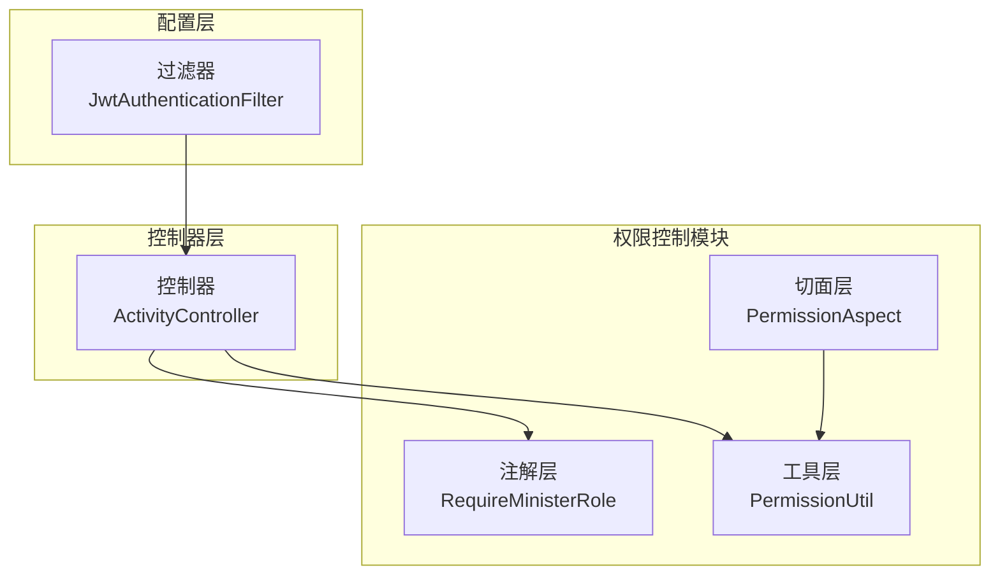
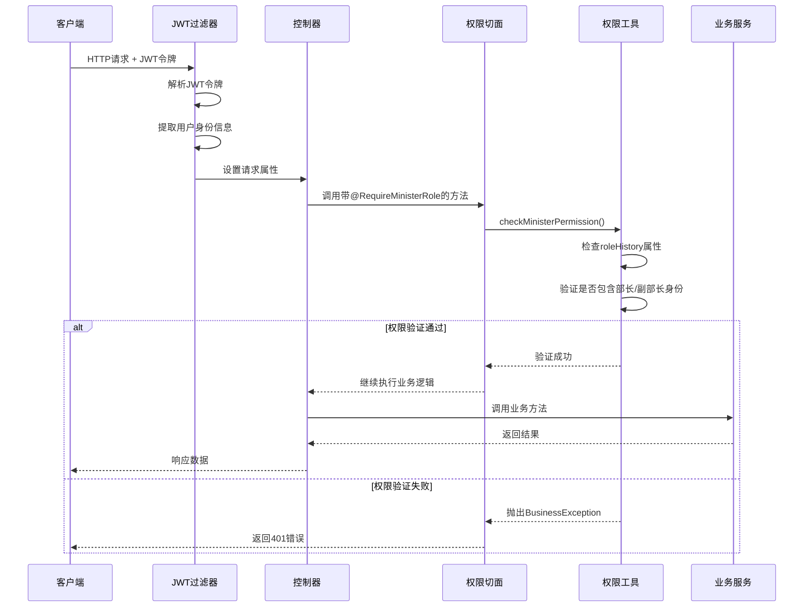
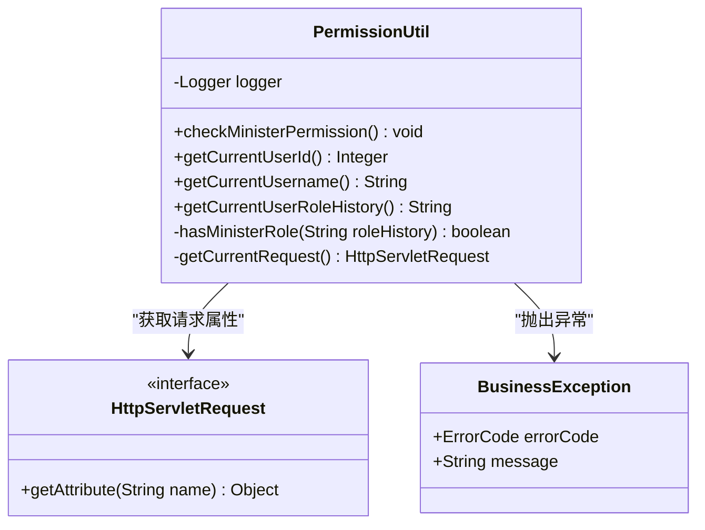
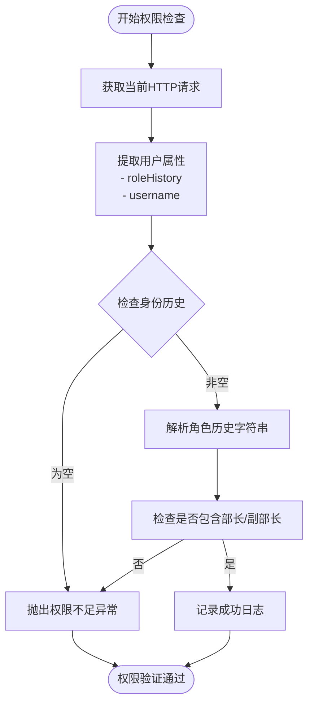
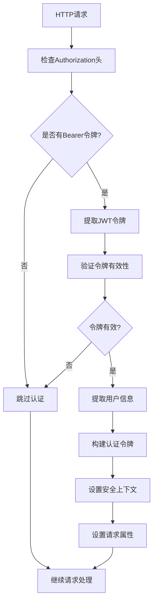
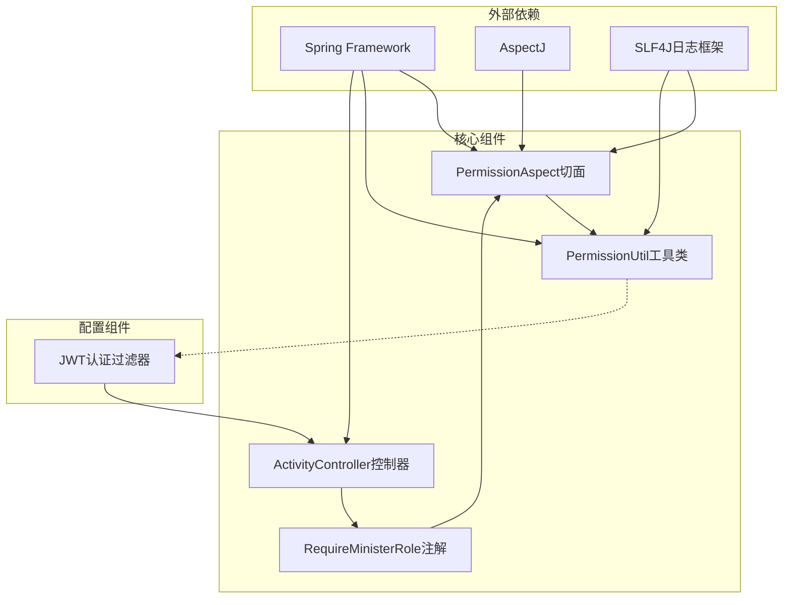

# 方法级权限控制

<cite>
**本文档引用的文件**
- [RequireMinisterRole.java](file://src/main/java/com/redmoon2333/annotation/RequireMinisterRole.java)
- [PermissionAspect.java](file://src/main/java/com/redmoon2333/aspect/PermissionAspect.java)
- [PermissionUtil.java](file://src/main/java/com/redmoon2333/util/PermissionUtil.java)
- [ActivityController.java](file://src/main/java/com/redmoon2333/controller/ActivityController.java)
- [JwtAuthenticationFilter.java](file://src/main/java/com/redmoon2333/config/JwtAuthenticationFilter.java)
- [ActivityRequest.java](file://src/main/java/com/redmoon2333/dto/ActivityRequest.java)
</cite>

## 目录
1. [简介](#简介)
2. [项目结构概览](#项目结构概览)
3. [核心组件分析](#核心组件分析)
4. [架构概览](#架构概览)
5. [详细组件分析](#详细组件分析)
6. [依赖关系分析](#依赖关系分析)
7. [性能考虑](#性能考虑)
8. [故障排除指南](#故障排除指南)
9. [结论](#结论)

## 简介

本系统采用基于AOP（面向切面编程）的方法级权限控制机制，通过自定义注解和切面拦截技术实现细粒度的权限管理。该设计模式允许开发者在业务方法上直接标注权限要求，而无需在每个方法内部重复编写权限检查代码，从而提高了代码的可维护性和安全性。

系统的核心是`@RequireMinisterRole`注解配合`PermissionAspect`切面，实现了对部长和副部长权限的精确控制。这种设计不仅简化了权限管理逻辑，还提供了清晰的权限边界定义，使得权限控制更加直观和易于理解。

## 项目结构概览

系统采用标准的Spring Boot项目结构，权限控制相关的组件分布在以下关键目录中：



**图表来源**
- [RequireMinisterRole.java](file://src/main/java/com/redmoon2333/annotation/RequireMinisterRole.java#L1-L19)
- [PermissionAspect.java](file://src/main/java/com/redmoon2333/aspect/PermissionAspect.java#L1-L40)
- [PermissionUtil.java](file://src/main/java/com/redmoon2333/util/PermissionUtil.java#L1-L117)

## 核心组件分析

### RequireMinisterRole 注解

`RequireMinisterRole`注解是整个权限控制系统的核心标记器，它定义了哪些方法需要部长或副部长级别的权限才能访问。

```java
@Target(ElementType.METHOD)
@Retention(RetentionPolicy.RUNTIME)
public @interface RequireMinisterRole {
    String value() default "需要部长或副部长权限";
}
```

**注解特性：**
- **@Target(METHOD)**：限制注解只能应用于方法级别，确保权限控制作用于具体的操作行为
- **@Retention(RUNTIME)**：保证注解在运行时可用，使切面能够通过反射机制检测到该注解的存在
- **默认权限描述**：提供人性化的权限说明，默认值为"需要部长或副部长权限"

### PermissionAspect 切面

`PermissionAspect`是权限验证的核心切面，负责拦截所有标记了`@RequireMinisterRole`注解的方法调用。

```java
@Before("@annotation(requireMinisterRole)")
public void checkMinisterPermission(JoinPoint joinPoint, RequireMinisterRole requireMinisterRole) {
    String methodName = joinPoint.getSignature().getName();
    String className = joinPoint.getTarget().getClass().getSimpleName();
    
    logger.info("权限验证开始 - {}#{}, 要求: {}", className, methodName, requireMinisterRole.value());
    
    // 执行权限检查
    permissionUtil.checkMinisterPermission();
    
    logger.info("权限验证通过 - {}#{}", className, methodName);
}
```

**切面工作原理：**
- 使用`@Before`通知在方法执行前进行权限检查
- 通过`JoinPoint`获取目标方法的完整信息
- 调用`PermissionUtil`执行具体的权限验证逻辑
- 提供详细的日志记录以便审计和调试

**章节来源**
- [RequireMinisterRole.java](file://src/main/java/com/redmoon2333/annotation/RequireMinisterRole.java#L1-L19)
- [PermissionAspect.java](file://src/main/java/com/redmoon2333/aspect/PermissionAspect.java#L1-L40)

## 架构概览

系统采用分层架构设计，权限控制贯穿整个请求处理流程：



**图表来源**
- [JwtAuthenticationFilter.java](file://src/main/java/com/redmoon2333/config/JwtAuthenticationFilter.java#L30-L100)
- [PermissionAspect.java](file://src/main/java/com/redmoon2333/aspect/PermissionAspect.java#L25-L35)
- [PermissionUtil.java](file://src/main/java/com/redmoon2333/util/PermissionUtil.java#L25-L50)

## 详细组件分析

### PermissionUtil 工具类

`PermissionUtil`是权限验证的核心工具类，负责具体的权限检查逻辑：



**图表来源**
- [PermissionUtil.java](file://src/main/java/com/redmoon2333/util/PermissionUtil.java#L15-L117)

**权限验证流程：**



**图表来源**
- [PermissionUtil.java](file://src/main/java/com/redmoon2333/util/PermissionUtil.java#L25-L50)

### ActivityController 示例

`ActivityController`展示了如何在实际业务方法上使用权限注解：

```java
@PostMapping
@RequireMinisterRole("创建活动")
public ResponseEntity<ApiResponse<ActivityResponse>> createActivity(@Valid @RequestBody ActivityRequest activityRequest) {
    // 方法体...
}

@PutMapping("/{activityId}")
@RequireMinisterRole("更新活动")
public ResponseEntity<ApiResponse<ActivityResponse>> updateActivity(
        @PathVariable Integer activityId, 
        @Valid @RequestBody ActivityRequest activityRequest) {
    // 方法体...
}

@DeleteMapping("/{activityId}")
@RequireMinisterRole("删除活动")
public ResponseEntity<ApiResponse<Void>> deleteActivity(@PathVariable Integer activityId) {
    // 方法体...
}
```

**使用特点：**
- 每个方法都明确标注了权限要求
- 权限描述提供了清晰的操作语义
- 与业务逻辑分离，保持代码整洁
- 支持细粒度的权限控制

**章节来源**
- [PermissionUtil.java](file://src/main/java/com/redmoon2333/util/PermissionUtil.java#L1-L117)
- [ActivityController.java](file://src/main/java/com/redmoon2333/controller/ActivityController.java#L40-L200)

### JWT认证过滤器集成

JWT过滤器负责在请求到达控制器之前提取和验证用户的身份信息：



**图表来源**
- [JwtAuthenticationFilter.java](file://src/main/java/com/redmoon2333/config/JwtAuthenticationFilter.java#L30-L100)

**章节来源**
- [ActivityController.java](file://src/main/java/com/redmoon2333/controller/ActivityController.java#L28-L200)
- [JwtAuthenticationFilter.java](file://src/main/java/com/redmoon2333/config/JwtAuthenticationFilter.java#L1-L132)

## 依赖关系分析

系统的权限控制组件之间存在清晰的依赖关系：



**图表来源**
- [PermissionAspect.java](file://src/main/java/com/redmoon2333/aspect/PermissionAspect.java#L1-L20)
- [PermissionUtil.java](file://src/main/java/com/redmoon2333/util/PermissionUtil.java#L1-L20)

**依赖特点：**
- 切面依赖于工具类进行实际的权限验证
- 控制器通过注解声明权限要求
- 过滤器负责在请求早期阶段提取用户信息
- 所有组件都遵循Spring的依赖注入原则

**章节来源**
- [PermissionAspect.java](file://src/main/java/com/redmoon2333/aspect/PermissionAspect.java#L1-L40)
- [PermissionUtil.java](file://src/main/java/com/redmoon2333/util/PermissionUtil.java#L1-L117)

## 性能考虑

### AOP代理机制

系统使用Spring AOP的动态代理机制实现权限控制：

**代理类型：**
- **JDK动态代理**：适用于接口实现类
- **CGLIB代理**：适用于普通类（如控制器）

**性能影响：**
- 每次方法调用都会增加一次代理层的开销
- 权限检查逻辑相对轻量，主要涉及字符串操作和属性访问
- 对于高频访问的公共接口（如活动查询），系统通过过滤器配置避免了不必要的权限检查

### 缓存策略

虽然当前实现没有显式的缓存机制，但可以考虑以下优化：

```java
// 可选的缓存优化方案
@Cacheable(value = "userPermissions", key = "#userId")
public boolean hasMinisterRole(String roleHistory) {
    // 缓存计算结果
}
```

### 异常处理性能

权限验证失败会立即抛出异常，避免后续业务逻辑的执行：

```java
if (!hasMinisterRole) {
    logger.warn("用户 {} 权限不足，当前身份: {}，尝试执行需要部长权限的操作", username, roleHistory);
    throw new BusinessException(ErrorCode.UNAUTHORIZED_ACTIVITY_OPERATION);
}
```

## 故障排除指南

### 常见问题及解决方案

**1. 权限验证失败**
- **症状**：返回401未授权错误
- **原因**：用户身份信息缺失或不包含部长/副部长身份
- **解决**：检查JWT令牌的有效性和内容，确认身份历史字段

**2. 注解未生效**
- **症状**：标记了`@RequireMinisterRole`的方法仍然可以被访问
- **原因**：AOP代理配置问题或注解扫描范围不正确
- **解决**：确认Spring AOP配置和组件扫描路径

**3. 日志信息不完整**
- **症状**：权限验证日志缺失或不准确
- **原因**：日志级别设置过高或切面配置错误
- **解决**：调整日志级别为INFO或DEBUG，检查切面配置

### 调试技巧

**启用详细日志：**
```yaml
logging:
  level:
    com.redmoon2333.aspect: DEBUG
    com.redmoon2333.util: DEBUG
```

**检查请求属性：**
```java
// 在控制器中添加调试代码
System.out.println("Role history: " + request.getAttribute("roleHistory"));
System.out.println("Username: " + request.getAttribute("username"));
```

**章节来源**
- [PermissionUtil.java](file://src/main/java/com/redmoon2333/util/PermissionUtil.java#L25-L50)
- [PermissionAspect.java](file://src/main/java/com/redmoon2333/aspect/PermissionAspect.java#L25-L35)

## 结论

基于AOP的方法级权限控制实现为系统提供了强大而灵活的安全保障机制。通过`@RequireMinisterRole`注解和`PermissionAspect`切面的组合，系统实现了以下优势：

### 主要优势

1. **代码简洁性**：权限控制逻辑与业务逻辑分离，减少了重复代码
2. **可维护性**：权限要求一目了然，便于理解和修改
3. **扩展性**：新的权限类型可以通过类似的方式轻松添加
4. **安全性**：自动化的权限检查避免了人为疏忽

### 设计亮点

- **声明式权限控制**：通过注解声明权限要求，符合现代开发实践
- **细粒度控制**：支持针对不同操作设置不同的权限级别
- **透明的日志记录**：完整的权限验证过程跟踪
- **优雅的异常处理**：统一的业务异常处理机制

### 应用建议

1. **合理使用注解**：仅对真正需要权限保护的操作使用`@RequireMinisterRole`
2. **完善日志配置**：确保生产环境中有足够的权限验证日志
3. **定期审查权限**：随着业务发展，定期评估和调整权限要求
4. **性能监控**：关注权限检查对系统性能的影响，必要时进行优化

这种基于AOP的方法级权限控制设计为构建安全可靠的企业级应用提供了坚实的基础，同时保持了代码的清晰性和可维护性。