# JWT认证机制

<cite>
**本文档引用的文件**
- [SecurityConfig.java](file://src/main/java/com/redmoon2333/config/SecurityConfig.java)
- [JwtAuthenticationFilter.java](file://src/main/java/com/redmoon2333/config/JwtAuthenticationFilter.java)
- [JwtUtil.java](file://src/main/java/com/redmoon2333/util/JwtUtil.java)
- [AuthService.java](file://src/main/java/com/redmoon2333/service/AuthService.java)
- [AuthController.java](file://src/main/java/com/redmoon2333/controller/AuthController.java)
- [JwtRedisService.java](file://src/main/java/com/redmoon2333/service/JwtRedisService.java)
- [application.yml](file://src/main/resources/application.yml)
</cite>

## 目录
1. [简介](#简介)
2. [项目架构概览](#项目架构概览)
3. [核心组件分析](#核心组件分析)
4. [认证流程详解](#认证流程详解)
5. [JWT工具类深度分析](#jwt工具类深度分析)
6. [安全配置详解](#安全配置详解)
7. [Redis集成机制](#redis集成机制)
8. [安全最佳实践](#安全最佳实践)
9. [故障排除指南](#故障排除指南)
10. [总结](#总结)

## 简介

本项目采用基于JWT（JSON Web Token）的无状态认证机制，结合Spring Security框架实现完整的用户身份验证和授权体系。该认证系统支持令牌生成、验证、刷新和注销功能，同时集成了Redis用于令牌管理和黑名单控制，提供了高可用性和安全性保障。

## 项目架构概览

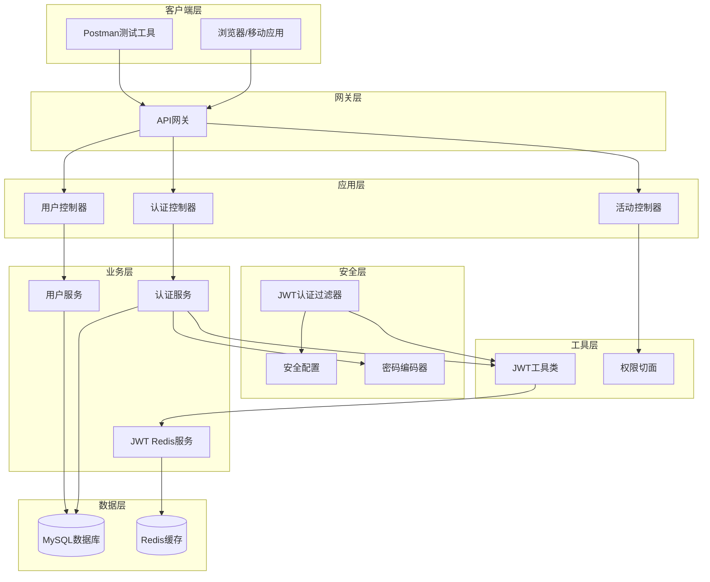

**图表来源**
- [SecurityConfig.java](file://src/main/java/com/redmoon2333/config/SecurityConfig.java#L1-L131)
- [JwtAuthenticationFilter.java](file://src/main/java/com/redmoon2333/config/JwtAuthenticationFilter.java#L1-L140)
- [AuthService.java](file://src/main/java/com/redmoon2333/service/AuthService.java#L1-L199)

## 核心组件分析

### SecurityConfig - 安全配置中心

SecurityConfig是整个认证系统的配置中心，负责定义安全策略、CORS配置和过滤器链。

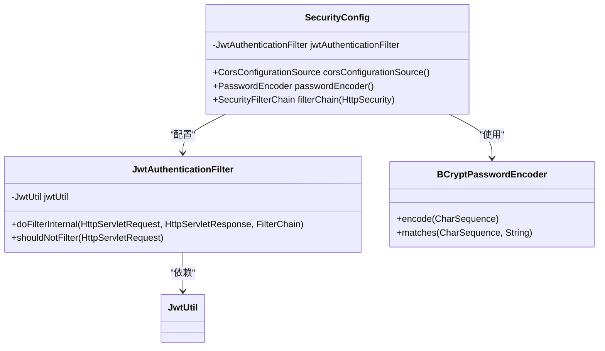

**图表来源**
- [SecurityConfig.java](file://src/main/java/com/redmoon2333/config/SecurityConfig.java#L25-L131)
- [JwtAuthenticationFilter.java](file://src/main/java/com/redmoon2333/config/JwtAuthenticationFilter.java#L25-L140)

### JwtAuthenticationFilter - JWT认证过滤器

JwtAuthenticationFilter是认证流程的核心组件，拦截所有请求并验证JWT令牌。

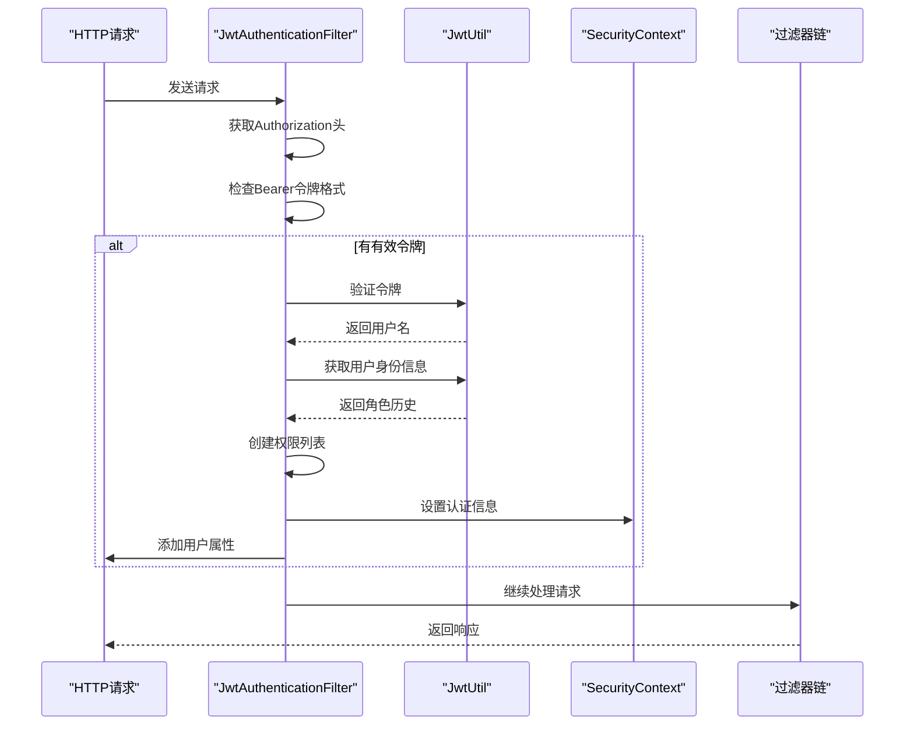

**图表来源**
- [JwtAuthenticationFilter.java](file://src/main/java/com/redmoon2333/config/JwtAuthenticationFilter.java#L30-L100)

**章节来源**
- [SecurityConfig.java](file://src/main/java/com/redmoon2333/config/SecurityConfig.java#L25-L131)
- [JwtAuthenticationFilter.java](file://src/main/java/com/redmoon2333/config/JwtAuthenticationFilter.java#L25-L140)

## 认证流程详解

### 用户登录流程

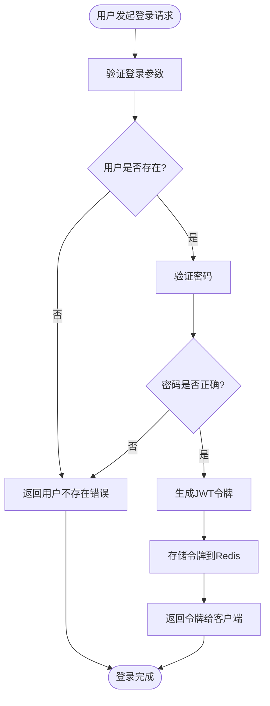

**图表来源**
- [AuthService.java](file://src/main/java/com/redmoon2333/service/AuthService.java#L40-L65)
- [AuthController.java](file://src/main/java/com/redmoon2333/controller/AuthController.java#L35-L55)

### 请求验证流程

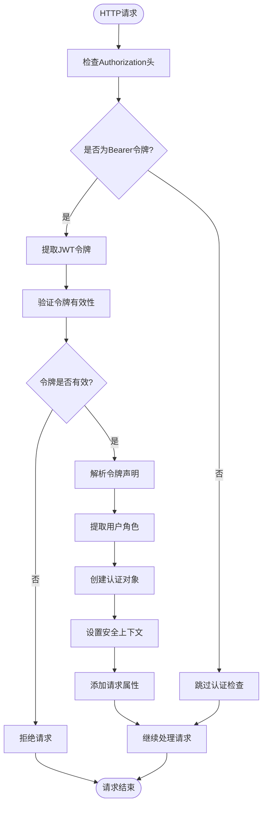

**图表来源**
- [JwtAuthenticationFilter.java](file://src/main/java/com/redmoon2333/config/JwtAuthenticationFilter.java#L30-L100)

**章节来源**
- [AuthService.java](file://src/main/java/com/redmoon2333/service/AuthService.java#L40-L65)
- [AuthController.java](file://src/main/java/com/redmoon2333/controller/AuthController.java#L35-L55)

## JWT工具类深度分析

### JwtUtil - JWT核心工具类

JwtUtil类提供了完整的JWT令牌生成功能，包括令牌创建、解析、验证和刷新机制。

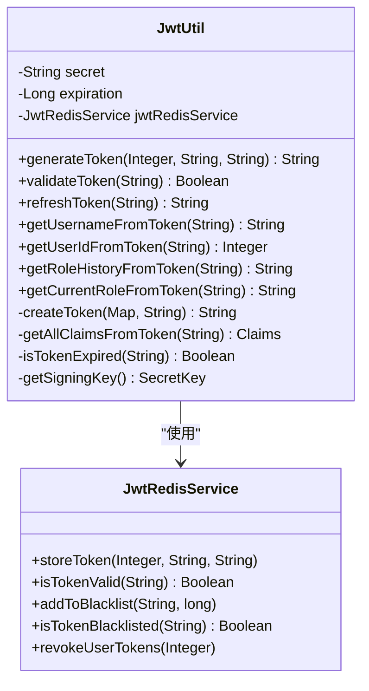

**图表来源**
- [JwtUtil.java](file://src/main/java/com/redmoon2333/util/JwtUtil.java#L15-L309)
- [JwtRedisService.java](file://src/main/java/com/redmoon2333/service/JwtRedisService.java#L15-L209)

### 令牌生成机制

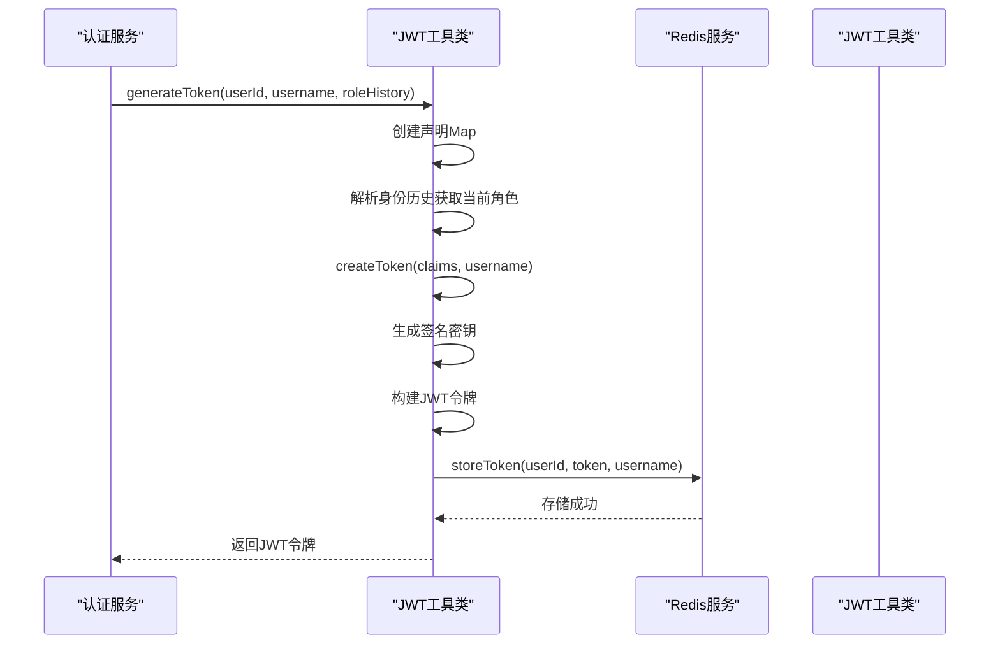

**图表来源**
- [JwtUtil.java](file://src/main/java/com/redmoon2333/util/JwtUtil.java#L40-L60)
- [JwtRedisService.java](file://src/main/java/com/redmoon2333/service/JwtRedisService.java#L30-L45)

### 令牌验证机制

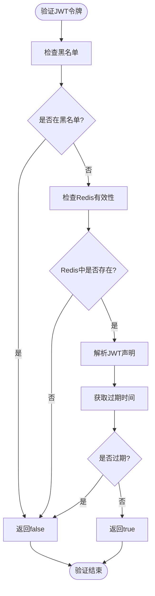

**图表来源**
- [JwtUtil.java](file://src/main/java/com/redmoon2333/util/JwtUtil.java#L180-L210)

**章节来源**
- [JwtUtil.java](file://src/main/java/com/redmoon2333/util/JwtUtil.java#L15-L309)
- [JwtRedisService.java](file://src/main/java/com/redmoon2333/service/JwtRedisService.java#L15-L209)

## 安全配置详解

### Spring Security配置

SecurityConfig类通过Spring Security框架实现了完整的安全配置，包括CORS支持、CSRF禁用和无状态会话管理。

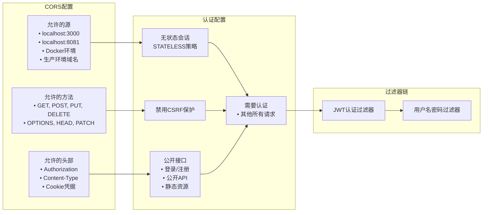

**图表来源**
- [SecurityConfig.java](file://src/main/java/com/redmoon2333/config/SecurityConfig.java#L40-L120)

### 排除规则配置

JwtAuthenticationFilter实现了智能的排除规则，确保某些公开接口无需认证即可访问。

```mermaid
flowchart TD
Request([HTTP请求]) --> GetPath["获取请求路径"]
GetPath --> GetMethod["获取HTTP方法"]
MethodPath["路径: " + path + "<br/>方法: " + method]
MethodPath --> CheckRules["检查排除规则"]
CheckRules --> LoginPath{"是否为登录接口?"}
LoginPath --> |是| SkipAuth["跳过认证"]
LoginPath --> |否| RegisterPath{"是否为注册接口?"}
RegisterPath --> |是| SkipAuth
RegisterPath --> |否| PublicAPI{"是否为公开API?"}
PublicAPI --> |是| SkipAuth
PublicAPI --> |否| StaticResource{"是否为静态资源?"}
StaticResource --> |是| SkipAuth
StaticResource --> |否| ActivitiesAPI{"是否为活动查询接口?"}
ActivitiesAPI --> |是| SkipAuth
ActivitiesAPI --> |否| AlumniAPI{"是否为校友查询接口?"}
AlumniAPI --> |是| SkipAuth
AlumniAPI --> |否| NeedAuth["需要认证"]
SkipAuth --> End([继续处理])
NeedAuth --> End
```

**图表来源**
- [JwtAuthenticationFilter.java](file://src/main/java/com/redmoon2333/config/JwtAuthenticationFilter.java#L105-L130)

**章节来源**
- [SecurityConfig.java](file://src/main/java/com/redmoon2333/config/SecurityConfig.java#L25-L131)
- [JwtAuthenticationFilter.java](file://src/main/java/com/redmoon2333/config/JwtAuthenticationFilter.java#L105-L140)

## Redis集成机制

### Redis存储结构设计

JwtRedisService将JWT令牌与用户信息存储在Redis中，支持令牌验证、黑名单管理和用户令牌管理。

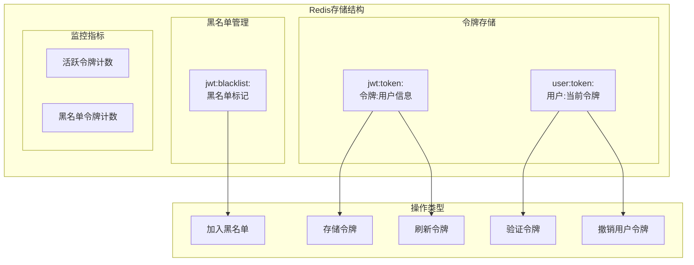

**图表来源**
- [JwtRedisService.java](file://src/main/java/com/redmoon2333/service/JwtRedisService.java#L20-L30)

### 令牌生命周期管理

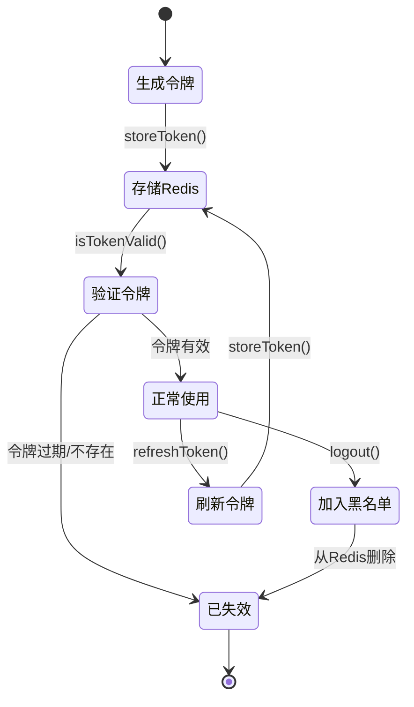

**图表来源**
- [JwtRedisService.java](file://src/main/java/com/redmoon2333/service/JwtRedisService.java#L30-L120)

**章节来源**
- [JwtRedisService.java](file://src/main/java/com/redmoon2333/service/JwtRedisService.java#L15-L209)

## 安全最佳实践

### 密码安全

系统使用BCryptPasswordEncoder对用户密码进行加密存储，确保即使数据库泄露也无法直接获取明文密码。

```java
// 密码编码器配置
@Bean
public PasswordEncoder passwordEncoder() {
    return new BCryptPasswordEncoder();
}

// 密码验证
if (!passwordEncoder.matches(loginRequest.getPassword(), user.getPassword())) {
    throw new BusinessException(ErrorCode.INVALID_CREDENTIALS);
}
```

### 令牌安全配置

```yaml
# JWT配置
jwt:
  secret: hr-official-jwt-secret-key-2024-redmoon2333-human-resource-system
  expiration: 7200000  # 2小时，单位毫秒
```

### 安全措施清单

1. **密钥管理**
   - 使用强随机密钥
   - 定期更换密钥
   - 不在代码中硬编码密钥

2. **令牌管理**
   - 设置合理的过期时间
   - 实现令牌刷新机制
   - 支持主动注销

3. **网络传输安全**
   - 使用HTTPS协议
   - 禁用CSRF保护
   - 实现CORS白名单

4. **访问控制**
   - 实现细粒度权限控制
   - 支持角色继承
   - 提供权限注解

**章节来源**
- [SecurityConfig.java](file://src/main/java/com/redmoon2333/config/SecurityConfig.java#L75-L85)
- [application.yml](file://src/main/resources/application.yml#L45-L50)

## 故障排除指南

### 常见问题及解决方案

#### 1. 令牌验证失败

**症状**: 用户登录后无法访问受保护的接口
**原因**: JWT令牌过期或被加入黑名单
**解决方案**:
```java
// 检查令牌是否在黑名单中
if (jwtRedisService.isTokenBlacklisted(token)) {
    // 令牌已被注销，需要重新登录
    return ApiResponse.error("令牌已注销，请重新登录");
}
```

#### 2. CORS跨域问题

**症状**: 前端无法访问后端API
**原因**: CORS配置不正确
**解决方案**:
```java
// 检查CORS配置
configuration.setAllowedOriginPatterns(Arrays.asList(
    "http://localhost:3000",
    "http://localhost:8081",
    "https://yourdomain.com"
));
```

#### 3. 密码加密问题

**症状**: 用户无法登录，提示密码错误
**原因**: 密码编码器不匹配
**解决方案**:
```java
// 确保使用相同的密码编码器
@Autowired
private PasswordEncoder passwordEncoder;

// 验证密码时使用matches方法
if (!passwordEncoder.matches(rawPassword, encodedPassword)) {
    // 密码不匹配
}
```

### 监控和调试

#### Redis连接监控

```java
// 获取活跃令牌数量
long activeTokens = jwtRedisService.getActiveTokenCount();

// 获取黑名单令牌数量
long blacklistedTokens = jwtRedisService.getBlacklistedTokenCount();
```

#### 日志记录

系统在关键节点记录详细日志：
- 令牌生成和验证
- 用户登录和注销
- 权限检查失败
- Redis操作异常

**章节来源**
- [JwtUtil.java](file://src/main/java/com/redmoon2333/util/JwtUtil.java#L180-L210)
- [JwtRedisService.java](file://src/main/java/com/redmoon2333/service/JwtRedisService.java#L180-L209)

## 总结

本项目的JWT认证机制是一个完整、安全、高性能的身份验证解决方案。通过Spring Security框架、JWT令牌技术和Redis缓存的有机结合，实现了以下核心功能：

### 主要特性

1. **无状态认证**: 基于JWT的无状态设计，支持水平扩展
2. **安全可靠**: 集成Redis实现令牌黑名单管理，支持主动注销
3. **灵活配置**: 支持多种权限级别和角色管理
4. **性能优化**: Redis缓存提升令牌验证性能
5. **易于维护**: 清晰的代码结构和完善的异常处理

### 技术亮点

- **多层安全防护**: 从网络层到应用层的全方位安全保护
- **智能排除规则**: 自动识别公开接口，避免不必要的认证检查
- **实时权限管理**: 支持动态权限分配和角色变更
- **监控完善**: 提供完整的监控指标和日志记录

### 应用场景

该认证机制适用于：
- 企业内部管理系统
- 多租户SaaS平台
- 移动应用后端服务
- 微服务架构中的服务间认证

通过合理配置和持续优化，这套JWT认证机制能够满足大多数现代Web应用的安全需求，为用户提供安全、便捷的身份验证体验。