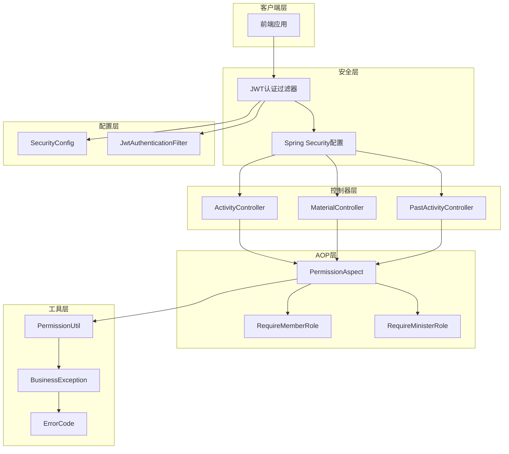
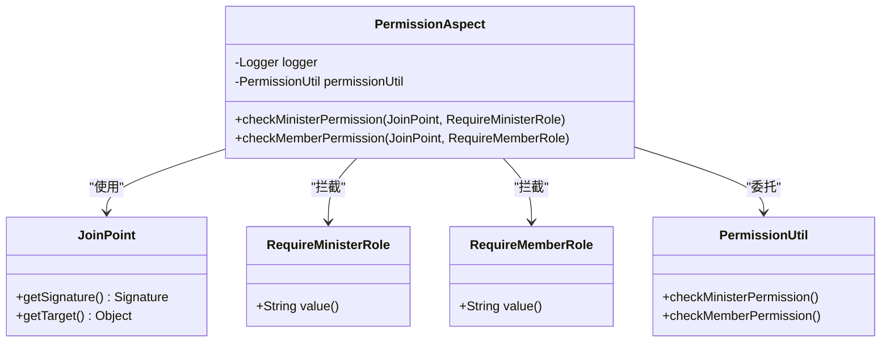
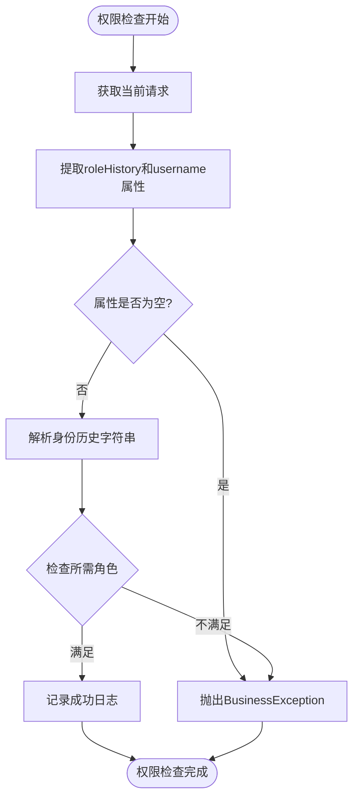
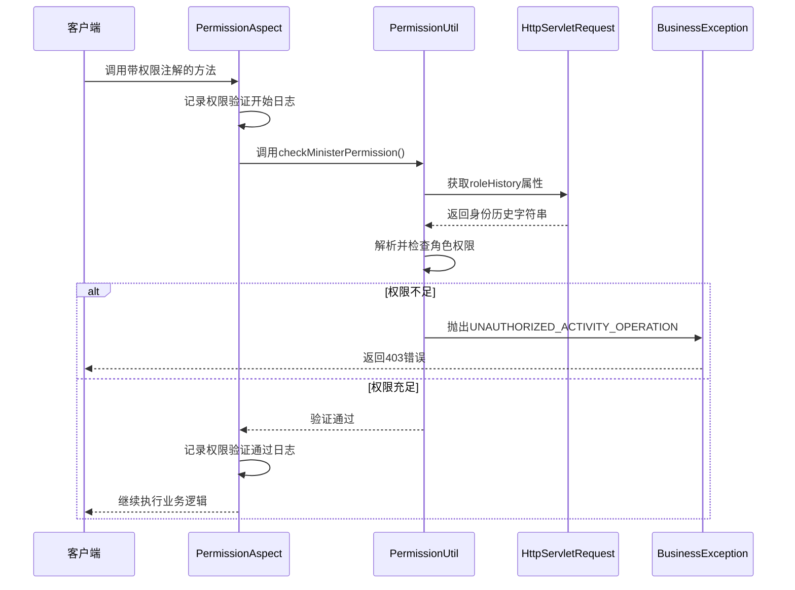
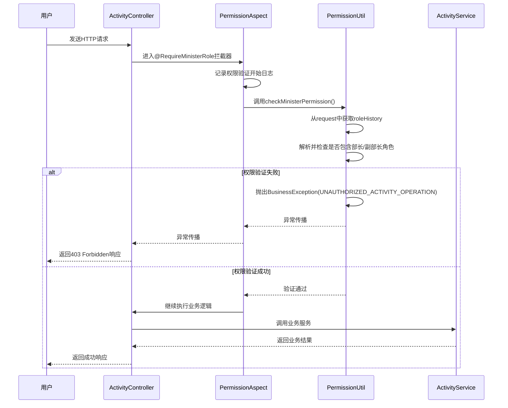
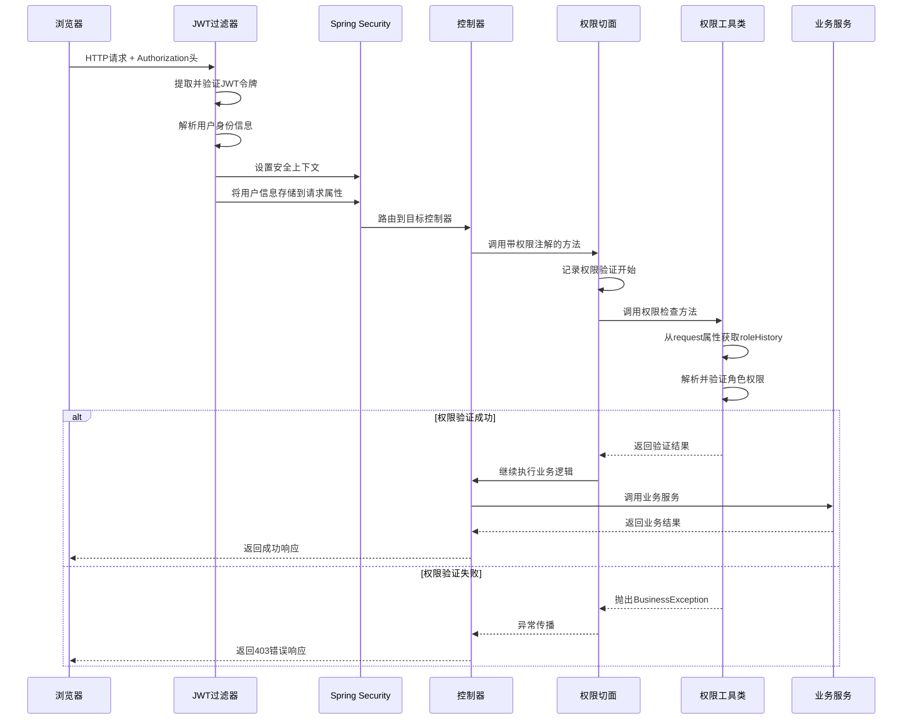

# 基于角色的权限控制实现

<cite>
**本文档引用的文件**
- [RequireMemberRole.java](file://src/main/java/com/redmoon2333/annotation/RequireMemberRole.java)
- [RequireMinisterRole.java](file://src/main/java/com/redmoon2333/annotation/RequireMinisterRole.java)
- [PermissionAspect.java](file://src/main/java/com/redmoon2333/aspect/PermissionAspect.java)
- [PermissionUtil.java](file://src/main/java/com/redmoon2333/util/PermissionUtil.java)
- [ActivityController.java](file://src/main/java/com/redmoon2333/controller/ActivityController.java)
- [BusinessException.java](file://src/main/java/com/redmoon2333/exception/BusinessException.java)
- [ErrorCode.java](file://src/main/java/com/redmoon2333/exception/ErrorCode.java)
- [SecurityConfig.java](file://src/main/java/com/redmoon2333/config/SecurityConfig.java)
- [JwtAuthenticationFilter.java](file://src/main/java/com/redmoon2333/config/JwtAuthenticationFilter.java)
</cite>

## 目录
1. [简介](#简介)
2. [项目架构概览](#项目架构概览)
3. [自定义注解设计](#自定义注解设计)
4. [AOP切面实现](#aop切面实现)
5. [权限工具类分析](#权限工具类分析)
6. [控制器集成示例](#控制器集成示例)
7. [安全配置与JWT过滤器](#安全配置与jwt过滤器)
8. [权限验证流程](#权限验证流程)
9. [错误处理机制](#错误处理机制)
10. [性能优化建议](#性能优化建议)
11. [总结](#总结)

## 简介

本文档深入分析了一个基于AOP（面向切面编程）的细粒度权限控制系统。该系统通过自定义注解、AOP切面和工具类实现了声明式的权限控制，能够精确控制不同角色对系统功能的访问权限。

系统的核心设计理念是将权限逻辑从业务代码中分离出来，通过AOP技术实现横切关注点的统一管理。这种设计不仅提高了代码的可维护性和可读性，还支持灵活的角色权限扩展。

## 项目架构概览



**图表来源**
- [ActivityController.java](file://src/main/java/com/redmoon2333/controller/ActivityController.java#L1-L322)
- [PermissionAspect.java](file://src/main/java/com/redmoon2333/aspect/PermissionAspect.java#L1-L57)
- [PermissionUtil.java](file://src/main/java/com/redmoon2333/util/PermissionUtil.java#L1-L163)

## 自定义注解设计

### RequireMemberRole注解

`RequireMemberRole`注解专门用于标记需要部员及以上权限才能访问的方法。该注解采用运行时保留策略，确保在程序运行期间可以反射获取注解信息。

```java
@Target(ElementType.METHOD)
@Retention(RetentionPolicy.RUNTIME)
public @interface RequireMemberRole {
    String value() default "需要部员及以上权限";
}
```

**设计特点：**
- **Target策略**：限制只能应用于方法级别，确保权限控制作用于具体的功能操作
- **Retention策略**：RUNTIME级别保证注解信息在运行时可用
- **默认值**：提供人性化的权限描述，默认为"需要部员及以上权限"

### RequireMinisterRole注解

`RequireMinisterRole`注解用于标记需要部长或副部长权限才能访问的方法，提供了更高级别的权限控制。

```java
@Target(ElementType.METHOD)
@Retention(RetentionPolicy.RUNTIME)
public @interface RequireMinisterRole {
    String value() default "需要部长或副部长权限";
}
```

**设计特点：**
- **Target策略**：同样限制在方法级别，保持与`RequireMemberRole`的一致性
- **Retention策略**：RUNTIME级别确保运行时权限检查的可行性
- **默认值**：提供明确的权限要求描述，默认为"需要部长或副部长权限"

**章节来源**
- [RequireMemberRole.java](file://src/main/java/com/redmoon2333/annotation/RequireMemberRole.java#L1-L19)
- [RequireMinisterRole.java](file://src/main/java/com/redmoon2333/annotation/RequireMinisterRole.java#L1-L19)

## AOP切面实现

### PermissionAspect切面类

`PermissionAspect`是整个权限控制系统的核心组件，它通过AOP技术实现了对带有权限注解方法的拦截和权限验证。



**图表来源**
- [PermissionAspect.java](file://src/main/java/com/redmoon2333/aspect/PermissionAspect.java#L1-L57)
- [PermissionUtil.java](file://src/main/java/com/redmoon2333/util/PermissionUtil.java#L1-L163)

### 切点表达式分析

切面使用了精心设计的切点表达式来匹配特定的注解：

```java
@Before("@annotation(requireMinisterRole)")
public void checkMinisterPermission(JoinPoint joinPoint, RequireMinisterRole requireMinisterRole)

@Before("@annotation(requireMemberRole)")
public void checkMemberPermission(JoinPoint joinPoint, RequireMemberRole requireMemberRole)
```

**切点表达式解析：**
- `@annotation(requireMinisterRole)`：匹配所有带有`RequireMinisterRole`注解的方法
- `@annotation(requireMemberRole)`：匹配所有带有`RequireMemberRole`注解的方法
- 参数绑定：自动将注解实例注入到方法参数中

### JoinPoint上下文获取

切面通过`JoinPoint`对象获取方法执行的上下文信息：

```java
String methodName = joinPoint.getSignature().getName();
String className = joinPoint.getTarget().getClass().getSimpleName();
```

这使得权限验证过程中能够记录详细的日志信息，便于问题追踪和审计。

**章节来源**
- [PermissionAspect.java](file://src/main/java/com/redmoon2333/aspect/PermissionAspect.java#L1-L57)

## 权限工具类分析

### PermissionUtil核心功能

`PermissionUtil`类是权限验证的具体实现，负责从HTTP请求中提取用户身份信息并进行权限判断。



**图表来源**
- [PermissionUtil.java](file://src/main/java/com/redmoon2333/util/PermissionUtil.java#L25-L163)

### 身份历史解析算法

系统采用字符串解析的方式处理用户的身份历史信息：

```java
public boolean hasMinisterRole(String roleHistory) {
    if (roleHistory == null || roleHistory.trim().isEmpty()) {
        return false;
    }
    
    String[] roles = roleHistory.split("&");
    for (String role : roles) {
        role = role.trim();
        if (role.contains("部长") || role.contains("副部长")) {
            return true;
        }
    }
    return false;
}
```

**解析逻辑特点：**
- **分隔符**：使用"&"作为多个身份的分隔符
- **模糊匹配**：通过`contains()`方法进行角色名称的模糊匹配
- **空值处理**：严格检查null和空字符串情况
- **大小写敏感**：依赖系统提供的字符串比较机制

### 权限验证方法对比



**图表来源**
- [PermissionAspect.java](file://src/main/java/com/redmoon2333/aspect/PermissionAspect.java#L25-L50)
- [PermissionUtil.java](file://src/main/java/com/redmoon2333/util/PermissionUtil.java#L25-L60)

**章节来源**
- [PermissionUtil.java](file://src/main/java/com/redmoon2333/util/PermissionUtil.java#L1-L163)

## 控制器集成示例

### ActivityController中的权限注解使用

`ActivityController`展示了如何在实际业务控制器中使用权限注解：

```java
@PostMapping
@RequireMinisterRole("创建活动")
public ResponseEntity<ApiResponse<ActivityResponse>> createActivity(@Valid @RequestBody ActivityRequest activityRequest) {
    // 方法体实现
}

@PutMapping("/{activityId}")
@RequireMinisterRole("更新活动")
public ResponseEntity<ApiResponse<ActivityResponse>> updateActivity(...) {
    // 方法体实现
}

@DeleteMapping("/{activityId}")
@RequireMinisterRole("删除活动")
public ResponseEntity<ApiResponse<Void>> deleteActivity(...) {
    // 方法体实现
}
```

**集成特点：**
- **注解位置**：直接标注在方法级别，精确控制每个操作的权限要求
- **权限描述**：提供具体的权限描述，便于理解和维护
- **业务无关**：权限逻辑与业务逻辑完全分离，保持控制器的简洁性

### 权限验证流程图



**图表来源**
- [ActivityController.java](file://src/main/java/com/redmoon2333/controller/ActivityController.java#L40-L50)
- [PermissionAspect.java](file://src/main/java/com/redmoon2333/aspect/PermissionAspect.java#L25-L35)

**章节来源**
- [ActivityController.java](file://src/main/java/com/redmoon2333/controller/ActivityController.java#L1-L322)

## 安全配置与JWT过滤器

### JWT认证过滤器设计

`JwtAuthenticationFilter`负责在请求到达控制器之前验证JWT令牌的有效性，并将用户身份信息存储到请求属性中：

```java
// 提取JWT令牌
String authHeader = request.getHeader("Authorization");
if (authHeader != null && authHeader.startsWith("Bearer ")) {
    token = authHeader.substring(7);
    username = jwtUtil.getUsernameFromToken(token);
}

// 验证令牌并设置安全上下文
if (jwtUtil.validateToken(token)) {
    String roleHistory = jwtUtil.getRoleHistoryFromToken(token);
    // 将身份信息添加到请求属性
    request.setAttribute("userId", jwtUtil.getUserIdFromToken(token));
    request.setAttribute("username", username);
    request.setAttribute("roleHistory", roleHistory);
}
```

**过滤器特点：**
- **令牌提取**：从Authorization头中提取Bearer令牌
- **身份信息存储**：将解析后的用户信息存储到请求属性中
- **权限映射**：将身份历史转换为Spring Security的权限体系
- **条件放行**：对公开接口和特定路径进行放行处理

### Spring Security配置

系统使用Spring Security进行全局的安全配置，结合JWT认证过滤器实现无状态认证：

```java
@Bean
public SecurityFilterChain filterChain(HttpSecurity http) throws Exception {
    http
        .cors(cors -> cors.configurationSource(corsConfigurationSource()))
        .csrf(csrf -> csrf.disable())
        .sessionManagement(session -> session.sessionCreationPolicy(SessionCreationPolicy.STATELESS))
        .authorizeHttpRequests(auth -> auth
            .requestMatchers("/api/auth/login", "/api/auth/register").permitAll()
            .requestMatchers(HttpMethod.GET, "/api/activities/**").permitAll()
            .anyRequest().authenticated()
        )
        .addFilterBefore(jwtAuthenticationFilter, UsernamePasswordAuthenticationFilter.class);
}
```

**配置要点：**
- **无状态会话**：禁用会话管理，使用STATELESS策略
- **CORS配置**：支持跨域请求，适应前后端分离架构
- **公开接口**：对活动查询等接口进行公开访问配置
- **JWT集成**：将JWT过滤器集成到Spring Security过滤链中

**章节来源**
- [JwtAuthenticationFilter.java](file://src/main/java/com/redmoon2333/config/JwtAuthenticationFilter.java#L1-L140)
- [SecurityConfig.java](file://src/main/java/com/redmoon2333/config/SecurityConfig.java#L1-L131)

## 权限验证流程

### 完整的权限验证时序



**图表来源**
- [JwtAuthenticationFilter.java](file://src/main/java/com/redmoon2333/config/JwtAuthenticationFilter.java#L35-L95)
- [PermissionAspect.java](file://src/main/java/com/redmoon2333/aspect/PermissionAspect.java#L25-L50)

### 身份历史字符串格式

系统采用特定格式存储用户的身份历史信息：

```
"2024级部长&2023级部员&2022级副部长"
```

**格式特点：**
- **年级标识**：每个身份都包含年级信息（如2024级）
- **角色类型**：支持多种角色类型（部长、副部长、部员）
- **分隔符**：使用"&"连接多个身份
- **顺序无关**：解析算法不依赖身份出现的顺序

## 错误处理机制

### BusinessException统一异常处理

系统使用自定义的`BusinessException`来处理权限相关的业务异常：

```java
public class BusinessException extends RuntimeException {
    private final ErrorCode errorCode;
    
    public BusinessException(ErrorCode errorCode) {
        super(errorCode.getMessage());
        this.errorCode = errorCode;
    }
    
    public ErrorCode getErrorCode() {
        return errorCode;
    }
}
```

### ErrorCode枚举定义

权限相关的错误码定义在`ErrorCode`枚举中：

```java
public enum ErrorCode {
    INSUFFICIENT_PERMISSIONS(3001, "权限不足"),
    UNAUTHORIZED_ACTIVITY_OPERATION(3002, "只有部长或副部长才能执行此操作");
}
```

**错误处理流程：**
1. **权限验证失败**：`PermissionUtil`检测到权限不足时抛出异常
2. **异常捕获**：AOP切面捕获异常并记录详细日志
3. **错误响应**：系统返回标准化的错误响应给客户端
4. **日志记录**：详细的错误日志便于问题排查

**章节来源**
- [BusinessException.java](file://src/main/java/com/redmoon2333/exception/BusinessException.java#L1-L24)
- [ErrorCode.java](file://src/main/java/com/redmoon2333/exception/ErrorCode.java#L1-L77)

## 性能优化建议

### 缓存策略建议

在高并发场景下，建议实施以下性能优化措施：

1. **权限信息缓存**
```java
// 在PermissionUtil中添加缓存逻辑
private final Cache<String, Boolean> permissionCache = CacheBuilder.newBuilder()
    .maximumSize(1000)
    .expireAfterWrite(5, TimeUnit.MINUTES)
    .build();

public boolean hasMinisterRole(String roleHistory) {
    String cacheKey = "minister:" + roleHistory;
    return permissionCache.get(cacheKey, () -> {
        // 实际的权限检查逻辑
        return checkMinisterRoleInternal(roleHistory);
    });
}
```

2. **身份信息缓存**
```java
// 缓存用户的身份历史信息
public String getUserRoleHistory(Integer userId) {
    return userRoleCache.get(userId, () -> {
        // 从数据库或其他持久化存储获取
        return loadRoleHistoryFromDatabase(userId);
    });
}
```

3. **批量权限检查**
```java
// 支持批量检查多个权限
public Map<String, Boolean> checkMultiplePermissions(List<String> permissions) {
    return permissions.parallelStream()
        .collect(Collectors.toMap(
            p -> p,
            p -> checkSinglePermission(p)
        ));
}
```

### 性能监控指标

建议监控以下关键性能指标：
- **权限验证延迟**：单次权限检查的平均耗时
- **缓存命中率**：权限信息缓存的命中比例
- **并发请求数**：同时进行权限验证的请求数量
- **异常率**：权限验证失败的比例

### 调试复杂性解决方案

为了降低调试复杂性，建议：

1. **详细日志记录**：在关键节点记录详细的执行日志
2. **权限验证仪表板**：提供可视化的权限验证状态监控
3. **单元测试覆盖**：为每个权限检查方法编写全面的单元测试
4. **集成测试**：定期进行端到端的权限验证测试

## 总结

基于AOP的细粒度权限控制系统展现了现代Java企业应用开发的最佳实践。该系统通过以下特性实现了高效、可维护的权限控制：

### 设计优势

1. **解耦性**：权限逻辑与业务代码完全分离，保持控制器的简洁性
2. **声明式编程**：通过注解方式声明权限要求，提高代码可读性
3. **灵活性**：支持不同级别的权限控制（部员、部长、副部长）
4. **可扩展性**：新的权限类型可以通过添加新的注解轻松扩展
5. **统一处理**：通过AOP切面实现统一的权限验证和错误处理

### 技术亮点

1. **AOP技术应用**：充分利用Spring AOP实现横切关注点的统一管理
2. **注解驱动**：通过自定义注解实现声明式的权限控制
3. **字符串解析**：灵活的身份历史解析算法支持复杂的角色组合
4. **JWT集成**：与JWT认证系统无缝集成，实现无状态认证
5. **异常处理**：统一的异常处理机制提供清晰的错误信息

### 应用价值

该权限控制系统特别适用于：
- **组织管理系统**：如学生社团、企业内部管理等
- **多角色协作平台**：需要区分不同角色权限的应用
- **内容管理系统**：需要精细化权限控制的内容发布平台
- **教育信息化系统**：支持多层次角色的教育管理应用

通过合理的性能优化和监控机制，该系统能够在保证安全性的同时，满足高并发场景下的性能需求。这种基于AOP的权限控制模式为类似系统的设计提供了优秀的参考范例。