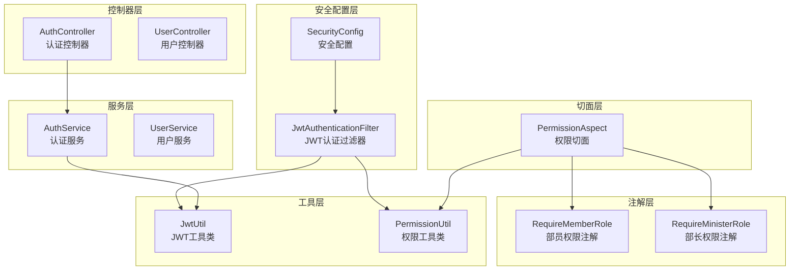
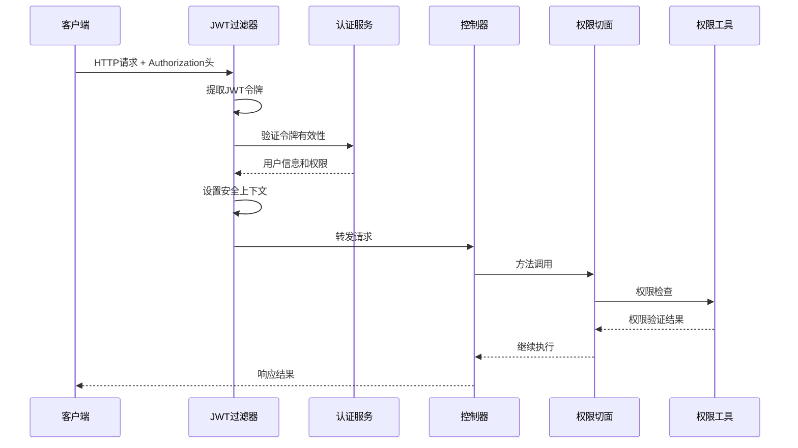
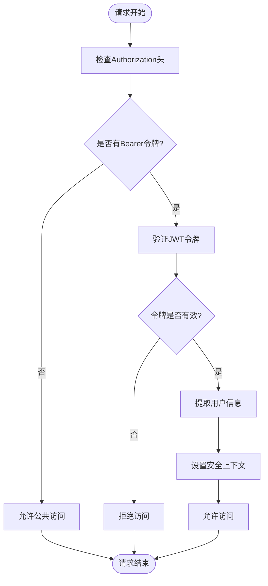
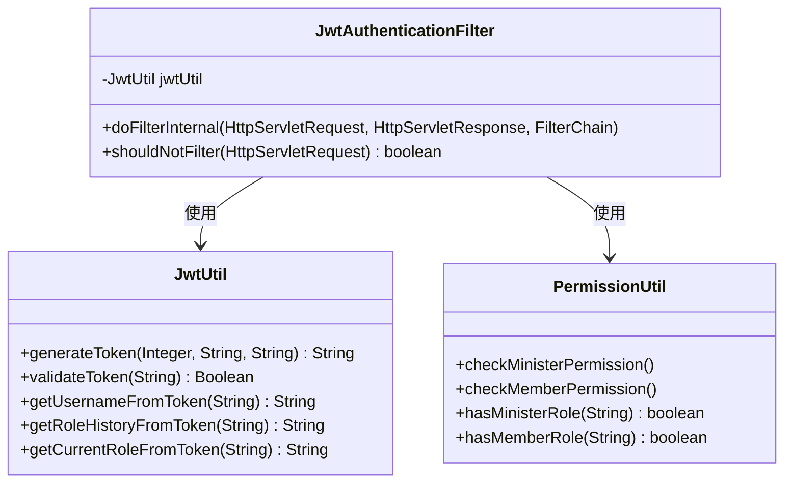
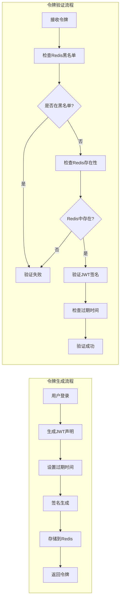
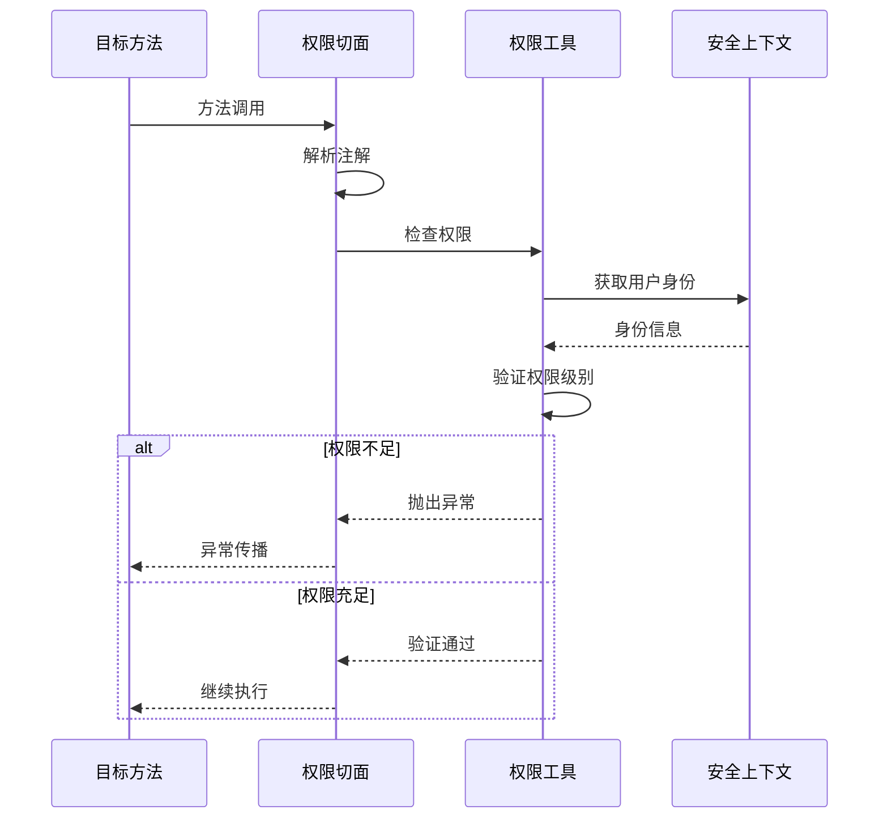
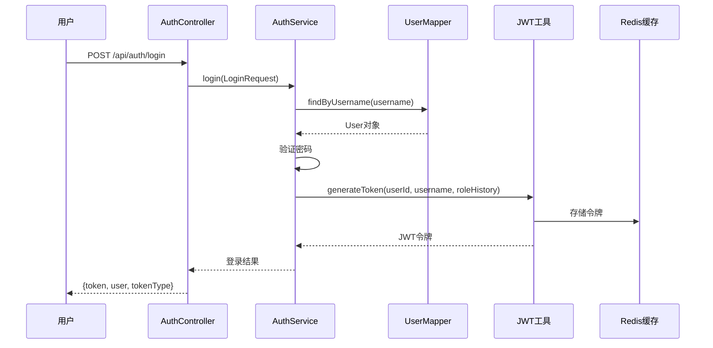
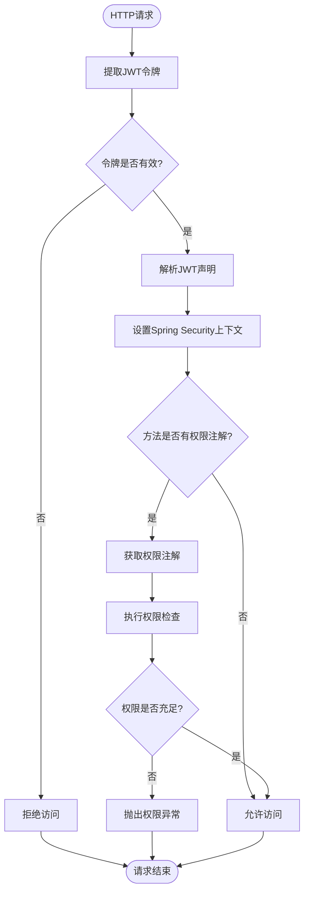

# 安全架构与权限控制系统

<cite>
**本文档引用的文件**
- [SecurityConfig.java](file://src/main/java/com/redmoon2333/config/SecurityConfig.java)
- [JwtAuthenticationFilter.java](file://src/main/java/com/redmoon2333/config/JwtAuthenticationFilter.java)
- [JwtUtil.java](file://src/main/java/com/redmoon2333/util/JwtUtil.java)
- [RequireMemberRole.java](file://src/main/java/com/redmoon2333/annotation/RequireMemberRole.java)
- [RequireMinisterRole.java](file://src/main/java/com/redmoon2333/annotation/RequireMinisterRole.java)
- [PermissionAspect.java](file://src/main/java/com/redmoon2333/aspect/PermissionAspect.java)
- [PermissionUtil.java](file://src/main/java/com/redmoon2333/util/PermissionUtil.java)
- [AuthService.java](file://src/main/java/com/redmoon2333/service/AuthService.java)
- [AuthController.java](file://src/main/java/com/redmoon2333/controller/AuthController.java)
- [application.yml](file://src/main/resources/application.yml)
</cite>

## 目录
1. [简介](#简介)
2. [项目结构概览](#项目结构概览)
3. [核心安全组件](#核心安全组件)
4. [架构概览](#架构概览)
5. [详细组件分析](#详细组件分析)
6. [认证与授权流程](#认证与授权流程)
7. [安全最佳实践](#安全最佳实践)
8. [故障排除指南](#故障排除指南)
9. [结论](#结论)

## 简介

本系统采用基于JWT（JSON Web Token）的身份验证和基于角色的权限控制系统（RBAC）。该安全架构设计用于保护人力资源管理系统中的敏感数据和操作，确保只有经过授权的用户才能访问相应的功能模块。

系统的核心安全特性包括：
- 基于Spring Security的无状态认证
- JWT令牌生成、验证和刷新机制
- 多层次权限控制（角色级别）
- AOP切面权限验证
- Redis分布式令牌管理
- CORS跨域资源共享配置

## 项目结构概览



**图表来源**
- [SecurityConfig.java](file://src/main/java/com/redmoon2333/config/SecurityConfig.java#L1-L131)
- [JwtAuthenticationFilter.java](file://src/main/java/com/redmoon2333/config/JwtAuthenticationFilter.java#L1-L140)
- [JwtUtil.java](file://src/main/java/com/redmoon2333/util/JwtUtil.java#L1-L309)

## 核心安全组件

系统包含以下核心安全组件：

### 1. Spring Security配置
- **无状态会话管理**：禁用Session，使用STATELESS策略
- **CORS配置**：支持多环境跨域访问
- **CSRF保护**：禁用CSRF保护（适用于JWT认证）

### 2. JWT认证过滤器
- **请求拦截**：拦截所有HTTP请求
- **令牌验证**：验证JWT令牌的有效性
- **权限注入**：将用户权限注入到Spring Security上下文中

### 3. 权限控制系统
- **角色层次**：部员、副部长、部长三级权限
- **动态权限**：基于用户身份历史的动态权限分配
- **AOP验证**：运行时权限检查

**章节来源**
- [SecurityConfig.java](file://src/main/java/com/redmoon2333/config/SecurityConfig.java#L1-L131)
- [JwtAuthenticationFilter.java](file://src/main/java/com/redmoon2333/config/JwtAuthenticationFilter.java#L1-L140)

## 架构概览



**图表来源**
- [JwtAuthenticationFilter.java](file://src/main/java/com/redmoon2333/config/JwtAuthenticationFilter.java#L30-L100)
- [PermissionAspect.java](file://src/main/java/com/redmoon2333/aspect/PermissionAspect.java#L20-L50)

## 详细组件分析

### SecurityConfig - 安全配置中心

SecurityConfig是整个安全架构的核心配置类，负责：

```java
@Configuration
@EnableWebSecurity
@EnableMethodSecurity(prePostEnabled = true)
public class SecurityConfig {
    // CORS配置
    // 密码编码器配置
    // 安全过滤链配置
}
```

**主要功能**：
- **CORS配置**：支持开发、测试和生产环境的跨域访问
- **无状态认证**：禁用CSRF和Session管理
- **请求授权规则**：细粒度的URL访问控制
- **过滤器链集成**：将JWT过滤器集成到Spring Security管道



**图表来源**
- [SecurityConfig.java](file://src/main/java/com/redmoon2333/config/SecurityConfig.java#L80-L130)

**章节来源**
- [SecurityConfig.java](file://src/main/java/com/redmoon2333/config/SecurityConfig.java#L1-L131)

### JwtAuthenticationFilter - JWT认证过滤器

JwtAuthenticationFilter是系统的核心安全组件，负责：

```java
@Component
public class JwtAuthenticationFilter extends OncePerRequestFilter {
    @Override
    protected void doFilterInternal(HttpServletRequest request, 
                                  HttpServletResponse response, 
                                  FilterChain filterChain) {
        // 令牌提取和验证
        // 权限注入到Spring Security上下文
        // 请求属性设置
    }
}
```

**工作流程**：
1. **令牌提取**：从Authorization头中提取JWT令牌
2. **用户信息提取**：从令牌中提取用户名和身份历史
3. **权限验证**：验证令牌有效性并解析权限
4. **上下文设置**：将用户信息和权限注入到Spring Security上下文
5. **请求转发**：继续处理后续的过滤器链



**图表来源**
- [JwtAuthenticationFilter.java](file://src/main/java/com/redmoon2333/config/JwtAuthenticationFilter.java#L20-L140)
- [JwtUtil.java](file://src/main/java/com/redmoon2333/util/JwtUtil.java#L20-L100)

**章节来源**
- [JwtAuthenticationFilter.java](file://src/main/java/com/redmoon2333/config/JwtAuthenticationFilter.java#L1-L140)

### JwtUtil - JWT工具类

JwtUtil提供了完整的JWT生命周期管理：

```java
@Component
public class JwtUtil {
    // 令牌生成
    public String generateToken(Integer userId, String username, String roleHistory);
    
    // 令牌验证
    public Boolean validateToken(String token);
    
    // 声明提取
    public String getUsernameFromToken(String token);
    public Integer getUserIdFromToken(String token);
    public String getRoleHistoryFromToken(String token);
    public String getCurrentRoleFromToken(String token);
}
```

**关键特性**：
- **Redis集成**：令牌存储和黑名单管理
- **动态过期**：支持令牌延期机制
- **声明扩展**：支持自定义声明字段
- **安全性**：HMAC-SHA256签名算法



**图表来源**
- [JwtUtil.java](file://src/main/java/com/redmoon2333/util/JwtUtil.java#L40-L80)

**章节来源**
- [JwtUtil.java](file://src/main/java/com/redmoon2333/util/JwtUtil.java#L1-L309)

### 自定义注解系统

系统提供了两个自定义注解来实现方法级别的权限控制：

#### RequireMemberRole - 部员权限注解

```java
@Target(ElementType.METHOD)
@Retention(RetentionPolicy.RUNTIME)
public @interface RequireMemberRole {
    String value() default "需要部员及以上权限";
}
```

#### RequireMinisterRole - 部长权限注解

```java
@Target(ElementType.METHOD)
@Retention(RetentionPolicy.RUNTIME)
public @interface RequireMinisterRole {
    String value() default "需要部长或副部长权限";
}
```

**章节来源**
- [RequireMemberRole.java](file://src/main/java/com/redmoon2333/annotation/RequireMemberRole.java#L1-L19)
- [RequireMinisterRole.java](file://src/main/java/com/redmoon2333/annotation/RequireMinisterRole.java#L1-L19)

### PermissionAspect - 权限切面

PermissionAspect使用AOP技术实现运行时权限检查：

```java
@Aspect
@Component
public class PermissionAspect {
    @Before("@annotation(requireMinisterRole)")
    public void checkMinisterPermission(JoinPoint joinPoint, RequireMinisterRole requireMinisterRole) {
        // 执行部长权限检查
    }
    
    @Before("@annotation(requireMemberRole)")
    public void checkMemberPermission(JoinPoint joinPoint, RequireMemberRole requireMemberRole) {
        // 执行部员权限检查
    }
}
```

**工作原理**：
1. **切点匹配**：匹配带有权限注解的方法
2. **参数解析**：获取注解的描述信息
3. **权限检查**：调用PermissionUtil进行权限验证
4. **异常处理**：权限不足时抛出业务异常



**图表来源**
- [PermissionAspect.java](file://src/main/java/com/redmoon2333/aspect/PermissionAspect.java#L20-L50)

**章节来源**
- [PermissionAspect.java](file://src/main/java/com/redmoon2333/aspect/PermissionAspect.java#L1-L57)

### PermissionUtil - 权限验证工具

PermissionUtil提供了核心的权限验证逻辑：

```java
@Component
public class PermissionUtil {
    public void checkMinisterPermission();
    public void checkMemberPermission();
    public boolean hasMinisterRole(String roleHistory);
    public boolean hasMemberRole(String roleHistory);
    public Integer getCurrentUserId();
    public String getCurrentUsername();
    public String getCurrentUserRoleHistory();
}
```

**权限验证逻辑**：
- **部长权限**：检查是否包含"部长"或"副部长"身份
- **部员权限**：检查是否包含"部员"、"副部长"或"部长"身份
- **身份历史**：支持多身份历史记录的解析

**章节来源**
- [PermissionUtil.java](file://src/main/java/com/redmoon2333/util/PermissionUtil.java#L1-L163)

## 认证与授权流程

### 用户登录流程



**图表来源**
- [AuthService.java](file://src/main/java/com/redmoon2333/service/AuthService.java#L35-L55)
- [AuthController.java](file://src/main/java/com/redmoon2333/controller/AuthController.java#L30-L50)

### 权限验证流程



**图表来源**
- [JwtAuthenticationFilter.java](file://src/main/java/com/redmoon2333/config/JwtAuthenticationFilter.java#L30-L100)
- [PermissionAspect.java](file://src/main/java/com/redmoon2333/aspect/PermissionAspect.java#L20-L50)

**章节来源**
- [AuthService.java](file://src/main/java/com/redmoon2333/service/AuthService.java#L35-L55)
- [AuthController.java](file://src/main/java/com/redmoon2333/controller/AuthController.java#L30-L50)

## 安全最佳实践

### 1. JWT配置优化

**密钥管理**：
```yaml
jwt:
  secret: hr-official-jwt-secret-key-2024-redmoon2333-human-resource-system
  expiration: 7200000  # 2小时
```

**最佳实践**：
- 使用足够长度的随机密钥
- 定期轮换密钥
- 设置合理的过期时间
- 使用HTTPS传输令牌

### 2. Redis集成安全

**Redis配置**：
```yaml
spring:
  data:
    redis:
      host: localhost
      port: 6379
      password: 
      timeout: 10000ms
      database: 0
```

**安全措施**：
- Redis访问限制
- 令牌黑名单机制
- 分布式令牌同步

### 3. CORS配置

**多环境支持**：
- 开发环境：localhost:3000, localhost:8081
- Docker环境：hrofficial-backend:8080
- 生产环境：实际域名

### 4. 权限设计原则

**角色层次**：
- **ROLE_USER**：默认用户权限
- **ROLE_MEMBER**：部员权限
- **ROLE_MINISTER**：部长权限
- **ROLE_2024/2023/2022/2021**：年级权限

**章节来源**
- [application.yml](file://src/main/resources/application.yml#L40-L50)

## 故障排除指南

### 常见问题及解决方案

#### 1. 令牌验证失败

**症状**：用户无法访问受保护资源
**原因**：
- 令牌过期
- 令牌被标记为黑名单
- 密钥不匹配

**解决方案**：
```java
// 检查令牌状态
if (jwtRedisService.isTokenBlacklisted(token)) {
    // 令牌已被注销
}

if (!jwtRedisService.isTokenValid(token)) {
    // 令牌不在Redis中
}
```

#### 2. 权限不足异常

**症状**：业务异常代码403
**原因**：
- 用户身份不符合要求
- 身份历史为空
- 角色权限不匹配

**解决方案**：
```java
// 检查用户身份历史
String roleHistory = permissionUtil.getCurrentUserRoleHistory();
if (roleHistory == null || roleHistory.trim().isEmpty()) {
    throw new BusinessException(ErrorCode.INSUFFICIENT_PERMISSIONS);
}
```

#### 3. CORS跨域问题

**症状**：浏览器控制台出现跨域错误
**解决方案**：
- 检查CORS配置中的allowedOrigins
- 确认前端请求的Origin头
- 验证预检请求的OPTIONS方法

**章节来源**
- [JwtUtil.java](file://src/main/java/com/redmoon2333/util/JwtUtil.java#L180-L200)
- [PermissionUtil.java](file://src/main/java/com/redmoon2333/util/PermissionUtil.java#L25-L50)

## 结论

本系统构建了一个完整的企业级安全架构，具有以下特点：

### 技术优势

1. **多层次安全防护**：从网络层到应用层的全方位保护
2. **灵活的权限模型**：支持多角色、多层级的权限控制
3. **高性能设计**：基于Redis的分布式令牌管理
4. **易于维护**：清晰的代码结构和完善的日志记录

### 安全特性

1. **无状态认证**：基于JWT的无状态会话管理
2. **动态权限验证**：运行时权限检查和AOP切面
3. **令牌生命周期管理**：生成、验证、刷新、注销全流程
4. **CORS跨域支持**：多环境兼容的跨域配置

### 扩展性

系统设计充分考虑了未来的扩展需求：
- 新角色类型的轻松添加
- 新权限控制点的快速集成
- 第三方认证服务的无缝对接
- 监控和审计功能的完善

通过这套安全架构，系统能够有效保护人力资源管理数据的安全性，同时为用户提供流畅的使用体验。开发者可以基于这套架构快速构建其他需要权限控制的应用系统。