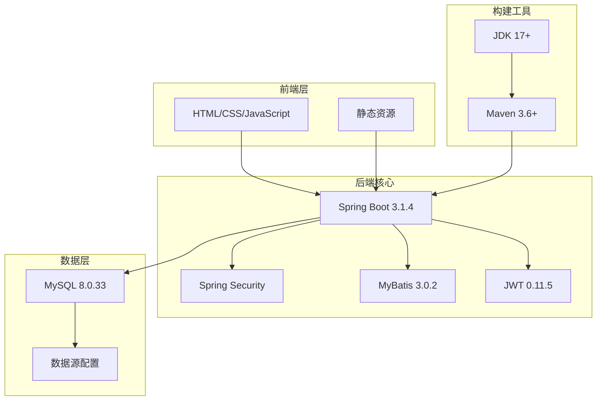
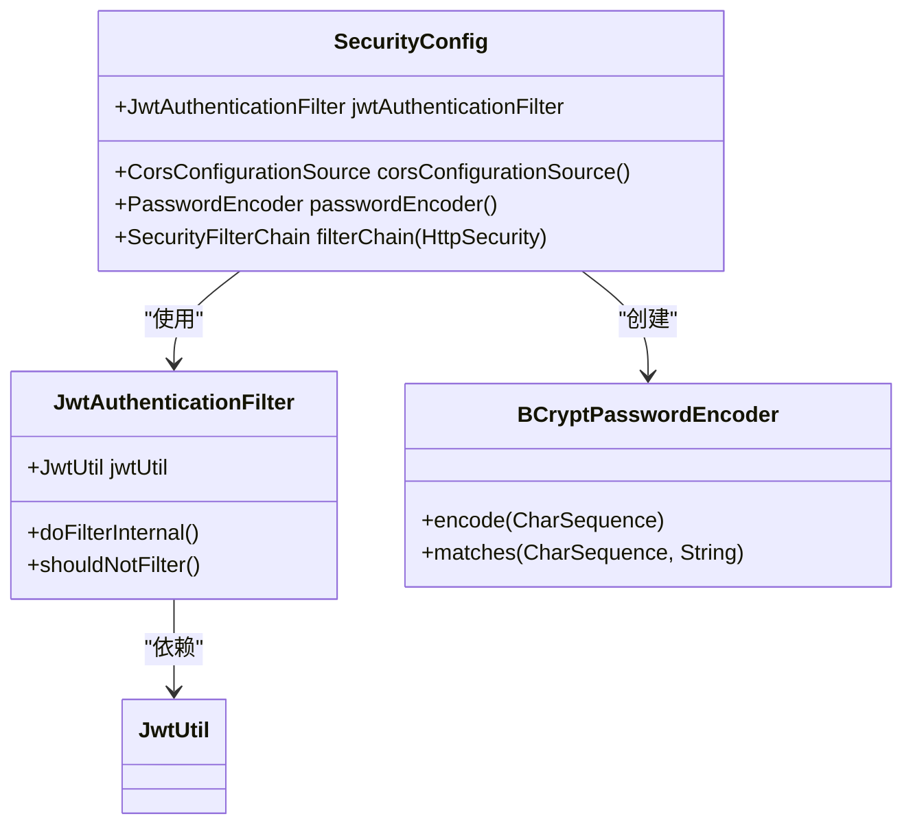
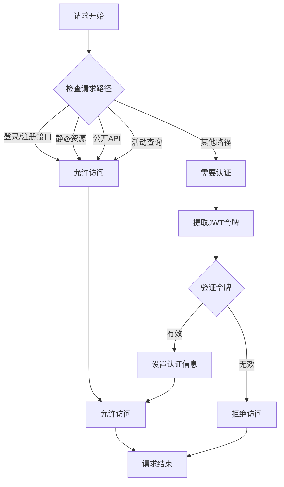
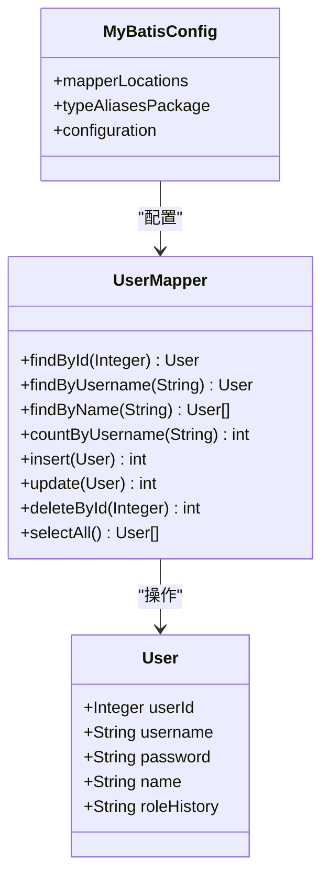
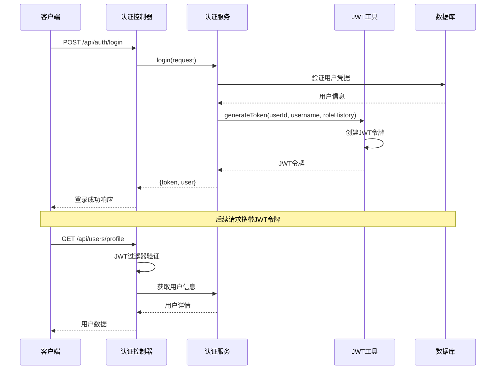
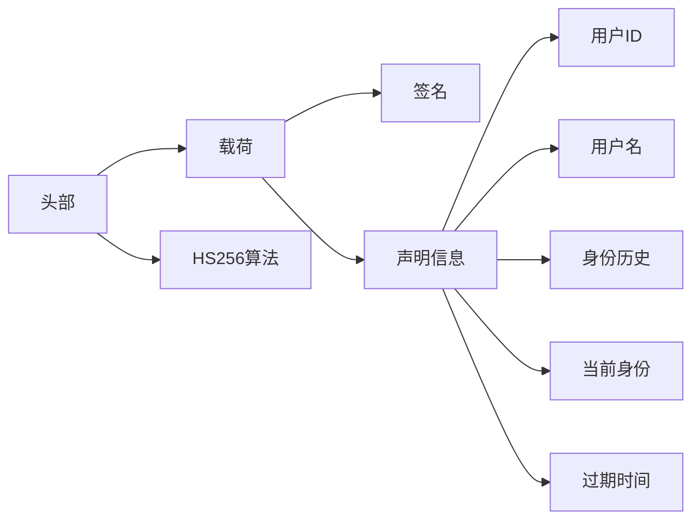
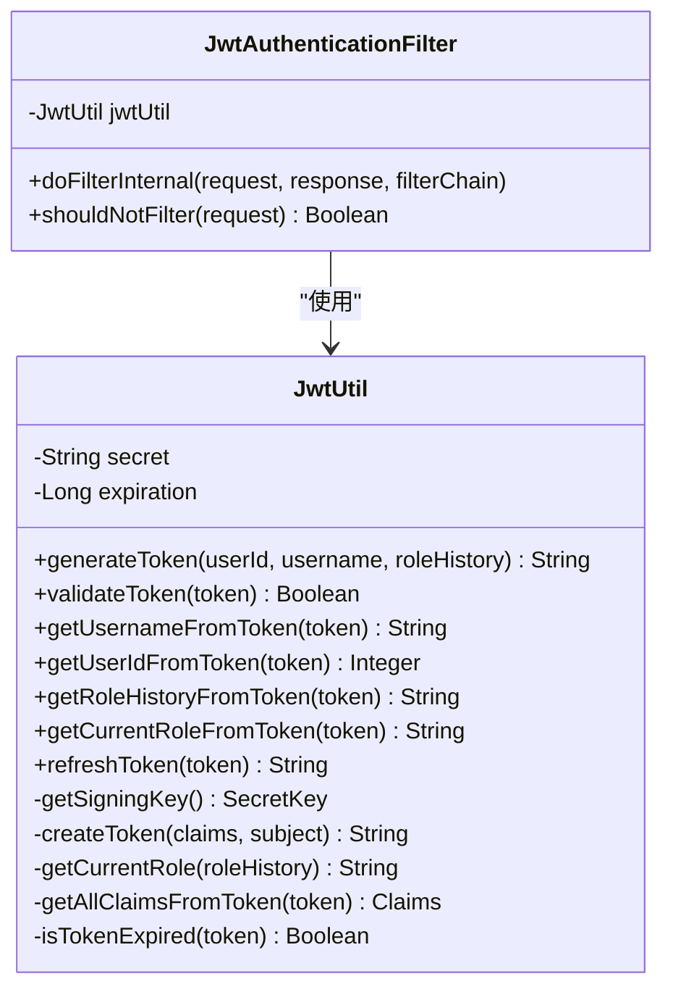
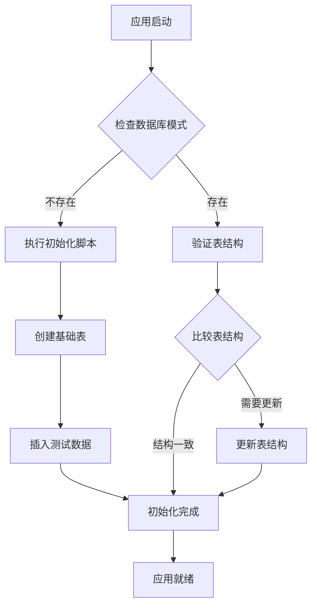
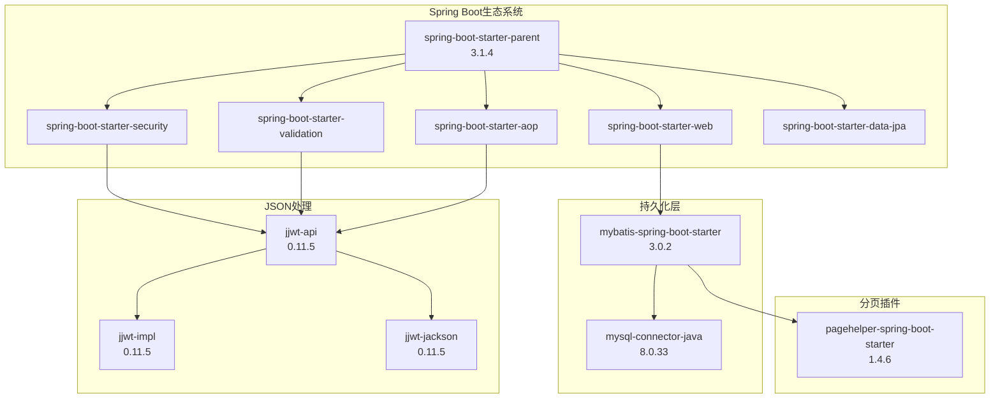
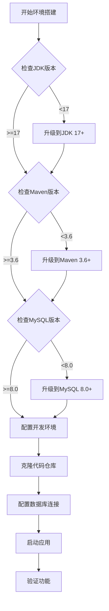

# 技术栈与依赖配置详解

<cite>
**本文档引用的文件**
- [pom.xml](file://pom.xml)
- [application.yml](file://src/main/resources/application.yml)
- [SecurityConfig.java](file://src/main/java/com/redmoon2333/config/SecurityConfig.java)
- [JwtAuthenticationFilter.java](file://src/main/java/com/redmoon2333/config/JwtAuthenticationFilter.java)
- [JwtUtil.java](file://src/main/java/com/redmoon2333/util/JwtUtil.java)
- [AuthService.java](file://src/main/java/com/redmoon2333/service/AuthService.java)
- [User.java](file://src/main/java/com/redmoon2333/entity/User.java)
- [UserMapper.java](file://src/main/java/com/redmoon2333/mapper/UserMapper.java)
- [README.md](file://README.md)
</cite>

## 目录
1. [项目概述](#项目概述)
2. [核心技术栈](#核心技术栈)
3. [Spring Boot 3.1.4 核心框架](#spring-boot-314-核心框架)
4. [Spring Security 安全架构](#spring-security-安全架构)
5. [MyBatis ORM 持久化层](#mybatis-orm-持久化层)
6. [JWT 令牌认证系统](#jwt-令牌认证系统)
7. [MySQL 数据库连接](#mysql-数据库连接)
8. [依赖版本兼容性](#依赖版本兼容性)
9. [环境搭建指南](#环境搭建指南)
10. [最佳实践建议](#最佳实践建议)

## 项目概述

本项目是一个基于Spring Boot 3.1.4构建的学生会部门官方网站，实现了完整的用户认证注册功能。项目采用现代化的微服务架构设计，集成了多种主流技术栈，为企业级应用提供了坚实的技术基础。

## 核心技术栈



**图表来源**
- [pom.xml](file://pom.xml#L1-L88)
- [application.yml](file://src/main/resources/application.yml#L1-L30)

## Spring Boot 3.1.4 核心框架

### 版本选择原因

Spring Boot 3.1.4是基于Jakarta EE 9+的新版本，相比之前的Spring Boot 2.x系列，它具有以下优势：

1. **Jakarta EE 9+ 支持**: 移除了对javax包的支持，完全迁移到jakarta包
2. **性能优化**: 更好的内存管理和启动速度
3. **安全性增强**: 内置更强大的安全特性
4. **云原生支持**: 更好的容器化和微服务支持

### 核心配置

```xml
<parent>
    <groupId>org.springframework.boot</groupId>
    <artifactId>spring-boot-starter-parent</artifactId>
    <version>3.1.4</version>
    <relativePath/>
</parent>

<properties>
    <maven.compiler.source>17</maven.compiler.source>
    <maven.compiler.target>17</maven.compiler.target>
    <project.build.sourceEncoding>UTF-8</project.build.sourceEncoding>
</properties>
```

### 关键特性

- **自动配置**: 减少样板代码，快速启动应用
- **嵌入式服务器**: 内置Tomcat，无需外部部署
- **Actuator监控**: 提供应用健康检查和监控指标
- **外部化配置**: 支持多环境配置管理

**章节来源**
- [pom.xml](file://pom.xml#L10-L18)
- [application.yml](file://src/main/resources/application.yml#L1-L30)

## Spring Security 安全架构

### 安全配置详解



**图表来源**
- [SecurityConfig.java](file://src/main/java/com/redmoon2333/config/SecurityConfig.java#L20-L112)
- [JwtAuthenticationFilter.java](file://src/main/java/com/redmoon2333/config/JwtAuthenticationFilter.java#L20-L132)

### CORS配置策略

项目采用了灵活的CORS配置，支持多个前端开发环境：

```java
// 允许的域名配置
configuration.setAllowedOriginPatterns(Arrays.asList(
    "http://localhost:3000",
    "http://localhost:8081",
    "http://127.0.0.1:3000",
    "http://127.0.0.1:8081"
));
```

### 请求授权规则



**图表来源**
- [SecurityConfig.java](file://src/main/java/com/redmoon2333/config/SecurityConfig.java#L60-L95)
- [JwtAuthenticationFilter.java](file://src/main/java/com/redmoon2333/config/JwtAuthenticationFilter.java#L80-L132)

### 密码加密策略

项目使用BCryptPasswordEncoder进行密码加密：

```java
@Bean
public PasswordEncoder passwordEncoder() {
    return new BCryptPasswordEncoder();
}
```

BCrypt的优势：
- **不可逆加密**: 无法通过算法还原原始密码
- **加盐处理**: 每次加密使用不同盐值
- **自适应成本因子**: 可根据硬件性能调整计算复杂度

**章节来源**
- [SecurityConfig.java](file://src/main/java/com/redmoon2333/config/SecurityConfig.java#L20-L112)
- [AuthService.java](file://src/main/java/com/redmoon2333/service/AuthService.java#L30-L40)

## MyBatis ORM 持久化层

### MyBatis集成配置



**图表来源**
- [UserMapper.java](file://src/main/java/com/redmoon2333/mapper/UserMapper.java#L15-L78)
- [User.java](file://src/main/java/com/redmoon2333/entity/User.java#L8-L99)

### 数据库映射配置

项目使用MyBatis作为ORM框架，配置如下：

```yaml
mybatis:
  mapper-locations: classpath:mapper/*.xml
  type-aliases-package: com.redmoon2333.entity
```

### 分页插件配置

```yaml
pagehelper:
  helper-dialect: mysql
  reasonable: true
  support-methods-arguments: true
  params: count=countSql
```

PageHelper插件特性：
- **自动分页**: 无需手动编写分页SQL
- **多数据库支持**: 自动识别数据库类型
- **合理化分页**: 防止负数页码和过大页码
- **参数传递**: 支持方法参数传递分页参数

### 实体类设计

```java
@Entity
@Table(name = "user")
public class User {
    @Id
    @GeneratedValue(strategy = GenerationType.IDENTITY)
    @Column(name = "user_id")
    private Integer userId;
    
    @NotBlank(message = "用户名不能为空")
    @Size(min = 3, max = 20, message = "用户名长度必须在3-20之间")
    @Column(name = "username")
    private String username;
    
    @NotBlank(message = "密码不能为空")
    @Size(min = 6, message = "密码长度不能少于6位")
    @Column(name = "password")
    private String password;
    
    @Size(max = 50, message = "姓名长度不能超过50个字符")
    @Column(name = "name")
    private String name;
    
    @Column(name = "role_history")
    private String roleHistory;
}
```

**章节来源**
- [User.java](file://src/main/java/com/redmoon2333/entity/User.java#L8-L99)
- [UserMapper.java](file://src/main/java/com/redmoon2333/mapper/UserMapper.java#L15-L78)
- [application.yml](file://src/main/resources/application.yml#L15-L20)

## JWT 令牌认证系统

### JWT架构设计



**图表来源**
- [AuthService.java](file://src/main/java/com/redmoon2333/service/AuthService.java#L40-L60)
- [JwtUtil.java](file://src/main/java/com/redmoon2333/util/JwtUtil.java#L35-L50)
- [JwtAuthenticationFilter.java](file://src/main/java/com/redmoon2333/config/JwtAuthenticationFilter.java#L30-L80)

### JWT配置参数

```yaml
jwt:
  secret: hr-official-jwt-secret-key-2024-redmoon2333-human-resource-system
  expiration: 7200000  # 2小时，单位毫秒
```

### JWT令牌结构



### 权限管理系统

JWT令牌中包含了丰富的权限信息：

```java
// 从身份历史中提取权限
List<SimpleGrantedAuthority> authorities = new ArrayList<>();
if (roleHistory != null && !roleHistory.trim().isEmpty()) {
    String[] roles = roleHistory.split("&");
    for (String role : roles) {
        role = role.trim();
        if (role.contains("部长")) {
            authorities.add(new SimpleGrantedAuthority("ROLE_MINISTER"));
        }
        if (role.contains("部员")) {
            authorities.add(new SimpleGrantedAuthority("ROLE_MEMBER"));
        }
        // 年级权限
        if (role.contains("2024级")) {
            authorities.add(new SimpleGrantedAuthority("ROLE_2024"));
        }
        // ... 其他年级权限
    }
}
authorities.add(new SimpleGrantedAuthority("ROLE_USER"));
```

### JWT工具类功能



**图表来源**
- [JwtUtil.java](file://src/main/java/com/redmoon2333/util/JwtUtil.java#L15-L229)
- [JwtAuthenticationFilter.java](file://src/main/java/com/redmoon2333/config/JwtAuthenticationFilter.java#L20-L132)

**章节来源**
- [JwtUtil.java](file://src/main/java/com/redmoon2333/util/JwtUtil.java#L15-L229)
- [JwtAuthenticationFilter.java](file://src/main/java/com/redmoon2333/config/JwtAuthenticationFilter.java#L20-L132)
- [application.yml](file://src/main/resources/application.yml#L22-L25)

## MySQL 数据库连接

### 数据库配置详解

```yaml
spring:
  datasource:
    url: jdbc:mysql://localhost:3306/hrofficial?useUnicode=true&characterEncoding=utf8&useSSL=false&serverTimezone=GMT%2B8
    username: root
    password: root
    driver-class-name: com.mysql.cj.jdbc.Driver
```

### 连接参数说明

- **useUnicode=true**: 启用Unicode支持，确保中文字符正确存储
- **characterEncoding=utf8**: 设置字符编码为UTF-8
- **useSSL=false**: 禁用SSL连接（开发环境）
- **serverTimezone=GMT%2B8**: 设置服务器时区为中国标准时间

### 数据库连接池配置

项目使用Spring Boot默认的数据源配置，支持以下特性：

1. **HikariCP**: 高性能连接池，默认启用
2. **自动配置**: 无需额外配置即可使用
3. **连接监控**: 内置连接池监控功能
4. **故障恢复**: 自动故障检测和恢复

### 数据库初始化策略



**章节来源**
- [application.yml](file://src/main/resources/application.yml#L2-L6)

## 依赖版本兼容性

### 核心依赖关系图



**图表来源**
- [pom.xml](file://pom.xml#L20-L50)

### 版本兼容性矩阵

| 组件 | 版本 | 兼容性 | 备注 |
|------|------|--------|------|
| Spring Boot | 3.1.4 | ✅ 完全兼容 | 基础框架 |
| Spring Security | 6.1.4 | ✅ 完全兼容 | 安全框架 |
| MyBatis | 3.0.2 | ✅ 完全兼容 | ORM框架 |
| MySQL Connector | 8.0.33 | ✅ 完全兼容 | 数据库驱动 |
| JWT | 0.11.5 | ✅ 完全兼容 | 令牌处理 |
| PageHelper | 1.4.6 | ✅ 完全兼容 | 分页插件 |

### 依赖冲突解决方案

1. **Jakarta EE迁移**: Spring Boot 3.x完全迁移到Jakarta EE命名空间
2. **自动配置**: Spring Boot自动处理大多数依赖版本冲突
3. **版本锁定**: 使用BOM（Bill of Materials）锁定版本
4. **排除冲突**: 显式排除冲突的传递依赖

### 最佳实践配置

```xml
<!-- 排除冲突的传递依赖 -->
<dependency>
    <groupId>org.springframework.boot</groupId>
    <artifactId>spring-boot-starter-security</artifactId>
    <exclusions>
        <exclusion>
            <groupId>org.springframework.security</groupId>
            <artifactId>spring-security-crypto</artifactId>
        </exclusion>
    </exclusions>
</dependency>
```

**章节来源**
- [pom.xml](file://pom.xml#L20-L50)

## 环境搭建指南

### 系统要求



### 详细安装步骤

#### 1. JDK 17+ 安装

```bash
# 检查JDK版本
java -version

# 下载并安装JDK 17+
# Windows: https://adoptium.net/
# macOS: brew install openjdk@17
# Linux: sudo apt install openjdk-17-jdk
```

#### 2. Maven 3.6+ 安装

```bash
# 检查Maven版本
mvn -v

# 下载并安装Maven 3.6+
# Windows: https://maven.apache.org/download.cgi
# macOS: brew install maven
# Linux: sudo apt install maven
```

#### 3. MySQL 8.0+ 安装

```bash
# 检查MySQL版本
mysql --version

# 下载并安装MySQL 8.0+
# Windows: https://dev.mysql.com/downloads/installer/
# macOS: brew install mysql
# Linux: sudo apt install mysql-server
```

#### 4. 数据库初始化

```bash
# 启动MySQL服务
sudo systemctl start mysql

# 创建数据库
mysql -u root -p
CREATE DATABASE hrofficial CHARACTER SET utf8mb4 COLLATE utf8mb4_unicode_ci;

# 执行初始化脚本
mysql -u root -p hrofficial < database/init.sql
```

#### 5. 项目构建和运行

```bash
# 克隆项目
git clone https://github.com/your-repo/HumanResourceOfficial.git
cd HumanResourceOfficial

# 更新Maven依赖
mvn clean install

# 启动应用
mvn spring-boot:run

# 或者打包后运行
mvn package
java -jar target/HumanResourceOfficial-1.0-SNAPSHOT.jar
```

### 配置文件说明

#### application.yml 主要配置项

```yaml
# 数据库连接配置
spring:
  datasource:
    url: jdbc:mysql://localhost:3306/hrofficial?useUnicode=true&characterEncoding=utf8&useSSL=false&serverTimezone=GMT%2B8
    username: root
    password: root
    driver-class-name: com.mysql.cj.jdbc.Driver

# 服务器配置
server:
  port: 8080

# MyBatis配置
mybatis:
  mapper-locations: classpath:mapper/*.xml
  type-aliases-package: com.redmoon2333.entity

# 分页插件配置
pagehelper:
  helper-dialect: mysql
  reasonable: true
  support-methods-arguments: true
  params: count=countSql

# JWT配置
jwt:
  secret: hr-official-jwt-secret-key-2024-redmoon2333-human-resource-system
  expiration: 7200000
```

**章节来源**
- [README.md](file://README.md#L20-L50)
- [application.yml](file://src/main/resources/application.yml#L1-L30)

## 最佳实践建议

### 1. 安全配置最佳实践

#### CSRF保护
```java
// 生产环境应启用CSRF保护
http.csrf(csrf -> csrf.enable());

// 开发环境可以临时禁用
http.csrf(csrf -> csrf.disable());
```

#### HTTPS配置
```yaml
# application.yml
server:
  ssl:
    enabled: true
    key-store: classpath:keystore.p12
    key-store-password: changeit
    key-store-type: PKCS12
    key-alias: tomcat
```

### 2. 性能优化建议

#### 数据库连接池优化
```yaml
spring:
  datasource:
    hikari:
      maximum-pool-size: 10
      minimum-idle: 5
      idle-timeout: 30000
      max-lifetime: 1800000
      connection-timeout: 20000
      leak-detection-threshold: 60000
```

#### 缓存策略
```java
// 使用Redis缓存用户信息
@Cacheable(value = "users", key = "#userId")
public User getUserById(Integer userId) {
    return userRepository.findById(userId);
}
```

### 3. 监控和日志

#### Actuator配置
```yaml
management:
  endpoints:
    web:
      exposure:
        include: health,info,metrics,prometheus
  endpoint:
    health:
      show-details: always
```

#### 日志级别配置
```yaml
logging:
  level:
    com.redmoon2333: DEBUG
    org.springframework.security: INFO
    org.hibernate.SQL: DEBUG
    org.hibernate.type.descriptor.sql.BasicBinder: TRACE
```

### 4. 错误处理最佳实践

```java
@RestControllerAdvice
public class GlobalExceptionHandler {
    
    @ExceptionHandler(BusinessException.class)
    public ResponseEntity<ApiResponse> handleBusinessException(BusinessException ex) {
        return ResponseEntity.status(ex.getHttpStatus())
                .body(ApiResponse.error(ex.getErrorCode(), ex.getMessage()));
    }
    
    @ExceptionHandler(Exception.class)
    public ResponseEntity<ApiResponse> handleException(Exception ex) {
        log.error("Unexpected error occurred", ex);
        return ResponseEntity.internalServerError()
                .body(ApiResponse.error(ErrorCode.SYSTEM_ERROR, "系统错误"));
    }
}
```

### 5. 单元测试配置

```xml
<dependency>
    <groupId>org.springframework.boot</groupId>
    <artifactId>spring-boot-starter-test</artifactId>
    <scope>test</scope>
</dependency>

<dependency>
    <groupId>org.mockito</groupId>
    <artifactId>mockito-core</artifactId>
    <scope>test</scope>
</dependency>
```

### 6. 部署建议

#### Docker容器化
```dockerfile
FROM openjdk:17-jre-slim
COPY target/HumanResourceOfficial-1.0-SNAPSHOT.jar app.jar
EXPOSE 8080
ENTRYPOINT ["java", "-jar", "/app.jar"]
```

#### Kubernetes部署
```yaml
apiVersion: apps/v1
kind: Deployment
metadata:
  name: human-resource-official
spec:
  replicas: 2
  selector:
    matchLabels:
      app: human-resource-official
  template:
    metadata:
      labels:
        app: human-resource-official
    spec:
      containers:
      - name: app
        image: human-resource-official:latest
        ports:
        - containerPort: 8080
        env:
        - name: SPRING_PROFILES_ACTIVE
          value: "prod"
```

### 7. 持续集成配置

#### GitHub Actions示例
```yaml
name: CI/CD Pipeline

on:
  push:
    branches: [ main, develop ]
  pull_request:
    branches: [ main ]

jobs:
  build:
    runs-on: ubuntu-latest
    
    steps:
    - uses: actions/checkout@v3
    
    - name: Set up JDK 17
      uses: actions/setup-java@v3
      with:
        java-version: '17'
        distribution: 'temurin'
    
    - name: Cache Maven dependencies
      uses: actions/cache@v3
      with:
        path: ~/.m2
        key: ${{ runner.os }}-m2-${{ hashFiles('**/pom.xml') }}
    
    - name: Build with Maven
      run: mvn clean package -DskipTests
    
    - name: Run Tests
      run: mvn test
    
    - name: Deploy to Production
      if: github.ref == 'refs/heads/main'
      run: |
        # 部署到生产环境的命令
        echo "Deploying to production..."
```

通过遵循这些最佳实践，您可以构建一个稳定、安全、高性能的企业级应用程序。记住定期更新依赖版本，关注安全漏洞，并持续优化应用性能。