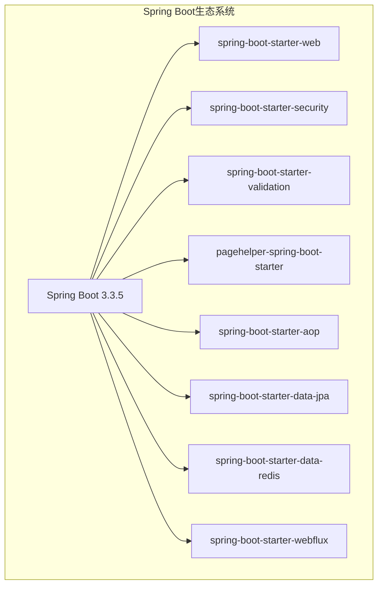
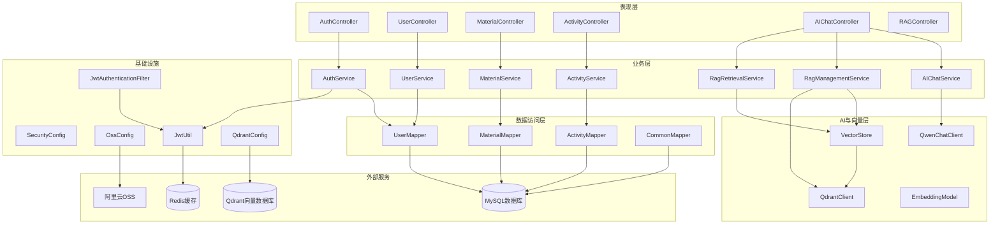

# 技术栈与依赖

<cite>
**本文档引用的文件**
- [pom.xml](file://pom.xml)
- [application.yml](file://src\main\resources\application.yml)
- [SecurityConfig.java](file://src\main\java\com\redmoon2333\config\SecurityConfig.java)
- [JwtAuthenticationFilter.java](file://src\main\java\com\redmoon2333\config\JwtAuthenticationFilter.java)
- [OssConfig.java](file://src\main\java\com\redmoon2333\config\OssConfig.java)
- [JwtUtil.java](file://src\main\java\com\redmoon2333\util\JwtUtil.java)
- [AuthService.java](file://src\main\java\com\redmoon2333\service\AuthService.java)
- [AuthController.java](file://src\main\java\com\redmoon2333\controller\AuthController.java)
- [User.java](file://src\main\java\com\redmoon2333\entity\User.java)
- [UserMapper.java](file://src\main\java\com\redmoon2333\mapper\UserMapper.java)
- [UserMapper.xml](file://src\main\resources\mapper\UserMapper.xml)
- [WebConfig.java](file://src\main\java\com\redmoon2333\config\WebConfig.java)
- [QdrantConfig.java](file://src\main\java\com\redmoon2333\config\QdrantConfig.java)
- [AIChatService.java](file://src\main\java\com\redmoon2333\service\AIChatService.java)
- [RagManagementService.java](file://src\main\java\com\redmoon2333\service\RagManagementService.java)
- [Qdrant向量数据库使用文档.md](file://Qdrant向量数据库使用文档.md)
- [SpringAI-Alibaba技术集成文档.md](file://SpringAI-Alibaba技术集成文档.md)
</cite>

## 更新摘要
**变更内容**
- 在核心技术栈中新增Qdrant向量数据库和AI流式对话技术
- 在依赖分析中添加Qdrant、gRPC、Spring AI等新依赖项
- 新增"向量数据库架构"和"AI流式对话架构"两个技术架构章节
- 新增"Qdrant配置"和"AI流式对话配置"两个配置章节
- 更新技术架构概览图，包含新的AI和向量数据库组件
- 新增"向量数据库性能优化"章节

## 目录
1. [项目概述](#项目概述)
2. [核心技术栈](#核心技术栈)
3. [依赖分析](#依赖分析)
4. [技术架构概览](#技术架构概览)
5. [配置详解](#配置详解)
6. [安全架构](#安全架构)
7. [数据持久化](#数据持久化)
8. [文件存储](#文件存储)
9. [性能优化](#性能优化)
10. [部署考虑](#部署考虑)

## 项目概述

HumanResourceOfficial是一个基于Spring Boot构建的人力资源管理系统，采用现代化的企业级Java技术栈。该项目专为高校校友会组织设计，提供了完整的用户认证、权限管理、活动管理和文件存储功能。

项目采用微服务化的架构思想，通过模块化设计实现了高内聚低耦合的代码结构。系统支持多角色权限控制，具备完善的用户生命周期管理，以及高效的文件上传和存储功能。最新版本集成了Qdrant向量数据库和AI流式对话技术，实现了智能问答和检索增强生成（RAG）功能，为用户提供更智能的服务体验。

## 核心技术栈

### Spring Boot 3.3.5

Spring Boot作为项目的核心框架，提供了快速开发和自动配置的能力：



**图表来源**
- [pom.xml](file://pom.xml#L10-L205)

### Java 21运行环境

项目选择Java 21作为基础运行环境，充分利用了现代JDK的新特性：

- **性能提升**：Java 21带来了显著的性能改进
- **安全性增强**：长期支持版本确保安全更新
- **语言特性**：支持模式匹配、密封类等现代Java特性
- **容器友好**：优化的容器化支持
- **虚拟线程**：支持Project Loom的虚拟线程，提升并发性能

### MyBatis 3.0.3

MyBatis作为ORM框架，提供了灵活的数据访问层：

- **SQL灵活性**：支持复杂的SQL查询
- **XML映射**：清晰的SQL语句分离
- **动态SQL**：强大的条件判断能力
- **缓存机制**：一级和二级缓存优化

**章节来源**
- [pom.xml](file://pom.xml#L70-L73)
- [UserMapper.java](file://src\main\java\com\redmoon2333\mapper\UserMapper.java#L1-L78)
- [UserMapper.xml](file://src\main\resources\mapper\UserMapper.xml#L1-L106)

### Qdrant向量数据库

Qdrant作为向量数据库，为系统提供语义搜索和检索增强生成（RAG）能力：

- **高性能**：基于HNSW算法，实现快速向量相似性搜索
- **可扩展**：支持分布式部署和大规模数据处理
- **持久化**：数据自动持久化到磁盘，确保可靠性
- **实时更新**：支持动态增删改查操作
- **过滤查询**：支持复杂的元数据过滤条件

**章节来源**
- [Qdrant向量数据库使用文档.md](file://Qdrant向量数据库使用文档.md#L1-L683)
- [QdrantConfig.java](file://src\main\java\com\redmoon2333\config\QdrantConfig.java#L14-L72)

### AI流式对话技术

系统采用AI流式对话技术，提供实时、流畅的交互体验：

- **响应式流**：基于Reactor的Flux流式响应
- **实时输出**：逐字输出AI生成内容，提升用户体验
- **内存优化**：限制缓冲区大小，防止内存溢出
- **错误处理**：优雅处理客户端断开连接等异常情况

**章节来源**
- [AIChatService.java](file://src\main\java\com\redmoon2333\service\AIChatService.java#L25-L436)
- [SpringAI-Alibaba技术集成文档.md](file://SpringAI-Alibaba技术集成文档.md#L1-L971)

## 依赖分析

### Spring生态组件

#### spring-boot-starter-web
- **版本**：3.3.5
- **用途**：提供Web应用的基础功能，包括嵌入式Tomcat服务器
- **特点**：自动配置、开箱即用、RESTful支持

#### spring-boot-starter-webflux
- **版本**：3.3.5
- **用途**：提供响应式编程支持，实现流式输出
- **特点**：非阻塞IO、高并发、流式响应

#### spring-boot-starter-security
- **版本**：3.3.5
- **用途**：提供企业级安全解决方案
- **功能**：认证、授权、CSRF防护、会话管理

#### spring-boot-starter-validation
- **版本**：3.3.5
- **用途**：提供Bean Validation支持
- **特点**：JSR-380规范、注解驱动验证

#### spring-boot-starter-data-jpa
- **版本**：3.3.5
- **用途**：简化JPA数据访问
- **功能**：实体管理、事务管理、查询DSL

#### spring-boot-starter-aop
- **版本**：3.3.5
- **用途**：面向切面编程支持
- **应用**：权限校验、日志记录、异常处理

### 第三方库

#### MyBatis Spring Boot Starter 3.0.3
- **用途**：MyBatis与Spring Boot的集成
- **优势**：自动配置、类型转换、事务管理

#### JWT处理库 0.11.5
- **用途**：JSON Web Token处理
- **组件**：
  - jjwt-api：核心API定义
  - jjwt-impl：实现库
  - jjwt-jackson：Jackson序列化支持

#### PageHelper 1.4.6
- **用途**：分页插件
- **特点**：无侵入式、支持多种数据库
- **配置**：MySQL方言、合理分页、方法参数支持

#### 阿里云OSS SDK 3.17.2
- **用途**：对象存储服务SDK
- **功能**：文件上传、下载、删除、管理
- **优势**：高可用、分布式存储、CDN加速

#### Redis支持
- **spring-boot-starter-data-redis**：Redis客户端支持
- **commons-pool2**：连接池管理
- **用途**：缓存、会话存储、分布式锁

### AI与向量数据库组件

#### Qdrant Java客户端 1.9.1
- **用途**：Qdrant向量数据库的Java客户端
- **特点**：gRPC协议、高性能、支持异步操作
- **功能**：向量存储、相似性搜索、元数据过滤

#### gRPC依赖
- **grpc-netty-shaded**：gRPC Netty传输层
- **grpc-protobuf**：Protocol Buffers支持
- **grpc-stub**：gRPC存根生成
- **用途**：与Qdrant服务进行高性能通信

#### Spring AI Qdrant Store
- **版本**：1.0.0
- **用途**：Spring AI对Qdrant的抽象封装
- **特点**：自动创建Collection、简化向量操作
- **功能**：向量存储、相似性搜索、RAG支持

#### Apache POI和PDFBox
- **poi-ooxml 5.2.5**：Word文档解析
- **pdfbox 2.0.30**：PDF文档解析
- **用途**：知识库文件解析，支持多种文档格式

#### Spring AI Alibaba Starter
- **版本**：1.0.0.2
- **用途**：阿里云通义千问大模型集成
- **功能**：对话生成、流式输出、提示词工程

**章节来源**
- [pom.xml](file://pom.xml#L25-L173)

## 技术架构概览



**图表来源**
- [AuthController.java](file://src\main\java\com\redmoon2333\controller\AuthController.java#L1-L153)
- [AuthService.java](file://src\main\java\com\redmoon2333\service\AuthService.java#L1-L199)
- [SecurityConfig.java](file://src\main\java\com\redmoon2333\config\SecurityConfig.java#L1-L131)
- [AIChatService.java](file://src\main\java\com\redmoon2333\service\AIChatService.java#L25-L436)
- [RagManagementService.java](file://src\main\java\com\redmoon2333\service\RagManagementService.java#L32-L317)

## 配置详解

### 数据源配置

项目使用MySQL作为主数据库，配置了详细的连接参数：

```yaml
spring:
  datasource:
    url: jdbc:mysql://localhost:3306/hrofficial?useUnicode=true&characterEncoding=utf8&useSSL=false&serverTimezone=GMT%2B8&allowPublicKeyRetrieval=true
    username: root
    password: root
    driver-class-name: com.mysql.cj.jdbc.Driver
```

**配置要点**：
- **字符集设置**：UTF-8确保中文支持
- **时区配置**：GMT+8适应中国时区
- **SSL禁用**：简化开发环境配置
- **公钥检索**：解决MySQL 8.0的兼容性问题

### MyBatis配置

```yaml
mybatis:
  mapper-locations: classpath:mapper/*.xml
  type-aliases-package: com.redmoon2333.entity
```

**配置说明**：
- **映射文件位置**：classpath:mapper/*.xml
- **类型别名**：自动扫描实体包
- **XML映射**：分离SQL语句，提高可维护性

### 分页配置

```yaml
pagehelper:
  helper-dialect: mysql
  reasonable: true
  support-methods-arguments: true
  params: count=countSql
```

**配置特点**：
- **MySQL方言**：针对MySQL优化
- **合理分页**：防止越界访问
- **方法参数**：支持复杂查询参数
- **计数优化**：独立的COUNT SQL

### Redis配置

```yaml
spring:
  data:
    redis:
      host: localhost
      port: 6379
      password: 
      timeout: 10000ms
      database: 0
      lettuce:
        pool:
          max-active: 8
          max-wait: -1ms
          max-idle: 8
          min-idle: 0
```

**配置要点**：
- **连接池**：Lettuce连接池优化
- **超时设置**：10秒超时保证响应性
- **数据库隔离**：使用独立数据库避免冲突

### Qdrant配置

```yaml
qdrant:
  host: localhost
  port: 6334
  api-key: 
  collection-name: campus_knowledge
  use-tls: false
```

**配置说明**：
- **host**：Qdrant服务地址，默认localhost
- **port**：gRPC端口，默认6334
- **api-key**：API认证密钥，可选
- **collection-name**：向量集合名称
- **use-tls**：是否使用TLS加密

**章节来源**
- [application.yml](file://src\main\resources\application.yml#L1-L154)
- [QdrantConfig.java](file://src\main\java\com\redmoon2333\config\QdrantConfig.java#L20-L33)

### AI流式对话配置

```yaml
ai:
  chat:
    memory:
      ttl: 168  # 对话记忆过期时间（小时）
```

**配置说明**：
- **ttl**：AI对话记忆的过期时间，单位为小时
- **默认值**：168小时（7天）
- **作用**：控制用户对话历史在Redis中的存储时间

**章节来源**
- [application.yml](file://src\main\resources\application.yml#L127-L131)
- [AIChatService.java](file://src\main\java\com\redmoon2333\service\AIChatService.java#L78-L102)

## 安全架构

### Spring Security集成

系统采用Spring Security提供全面的安全保障：


**图表来源**
- [JwtAuthenticationFilter.java](file://src\main\java\com\redmoon2333\config\JwtAuthenticationFilter.java#L1-L137)
- [SecurityConfig.java](file://src\main\java\com\redmoon2333\config\SecurityConfig.java#L1-L131)

### JWT认证流程

JWT认证是系统的核心安全机制：


**图表来源**
- [AuthService.java](file://src\main\java\com\redmoon2333\service\AuthService.java#L35-L50)
- [JwtUtil.java](file://src\main\java\com\redmoon2333\util\JwtUtil.java#L40-L60)

### 权限控制机制

系统实现了基于角色的历史权限控制：

```java
// 权限解析示例
List<SimpleGrantedAuthority> authorities = new ArrayList<>();
if (roleHistory != null && !roleHistory.trim().isEmpty()) {
    String[] roles = roleHistory.split("&");
    for (String role : roles) {
        role = role.trim();
        if (role.contains("部长")) {
            authorities.add(new SimpleGrantedAuthority("ROLE_MINISTER"));
        }
        if (role.contains("部员")) {
            authorities.add(new SimpleGrantedAuthority("ROLE_MEMBER"));
        }
        // 年级权限
        if (role.contains("2024级")) {
            authorities.add(new SimpleGrantedAuthority("ROLE_2024"));
        }
    }
}
```

**权限层次**：
- **ROLE_USER**：默认用户权限
- **ROLE_MINISTER**：部长权限
- **ROLE_MEMBER**：部员权限
- **年级权限**：2021级至2024级

### CORS配置

系统配置了灵活的跨域资源共享策略：

```java
configuration.setAllowedOriginPatterns(Arrays.asList(
    "http://localhost:3000",
    "http://localhost:8081", 
    "http://127.0.0.1:3000",
    "http://127.0.0.1:8081",
    "http://localhost:8080",
    "http://127.0.0.1:8080",
    // Docker环境支持
    "http://hrofficial-backend:8080",
    "http://backend:8080",
    // 生产环境域名
    "https://yourdomain.com",
    "https://www.yourdomain.com",
    // 允许任何https协议的域名
    "https://*"
));
```

**章节来源**
- [SecurityConfig.java](file://src\main\java\com\redmoon2333\config\SecurityConfig.java#L25-L60)
- [JwtAuthenticationFilter.java](file://src\main\java\com\redmoon2333\config\JwtAuthenticationFilter.java#L45-L85)

## 数据持久化

### MyBatis映射设计

系统采用MyBatis作为ORM框架，实现了清晰的数据访问层：


**图表来源**
- [UserMapper.java](file://src\main\java\com\redmoon2333\mapper\UserMapper.java#L1-L78)
- [User.java](file://src\main\java\com\redmoon2333\entity\User.java#L1-L99)
- [UserMapper.xml](file://src\main\resources\mapper\UserMapper.xml#L1-L106)

### 数据库表设计

系统使用MySQL数据库，主要实体包括：

```sql
CREATE TABLE user (
    user_id INT AUTO_INCREMENT PRIMARY KEY,
    username VARCHAR(20) NOT NULL UNIQUE,
    password VARCHAR(255) NOT NULL,
    name VARCHAR(50),
    role_history LONGTEXT
);

CREATE TABLE activation_code (
    code_id INT AUTO_INCREMENT PRIMARY KEY,
    code VARCHAR(16) NOT NULL UNIQUE,
    creator_id INT NOT NULL,
    expire_time DATETIME NOT NULL,
    create_time DATETIME NOT NULL,
    status ENUM('未使用', '已使用') NOT NULL,
    user_id INT DEFAULT NULL,
    use_time DATETIME DEFAULT NULL
);
```

### 分页查询

系统使用PageHelper实现高效的分页查询：

```java
// 分页查询示例
PageHelper.startPage(pageNum, pageSize);
List<User> userList = userMapper.selectAll();
PageInfo<User> pageInfo = new PageInfo<>(userList);
```

**分页特性**：
- **无侵入性**：无需修改现有SQL
- **多数据库支持**：自动适配不同数据库
- **性能优化**：独立的COUNT查询

**章节来源**
- [UserMapper.java](file://src\main\java\com\redmoon2333\mapper\UserMapper.java#L1-L78)
- [UserMapper.xml](file://src\main\resources\mapper\UserMapper.xml#L1-L106)

## 文件存储

### 阿里云OSS集成

系统集成了阿里云OSS作为文件存储解决方案：


**图表来源**
- [OssConfig.java](file://src\main\java\com\redmoon2333\config\OssConfig.java#L1-L71)

### OSS配置管理

```java
@Configuration
@ConditionalOnExpression("'${aliyun.oss.accessKeyId:}' != '' && '${aliyun.oss.accessKeySecret:}' != ''")
public class OssConfig {
    
    @Value("${aliyun.oss.endpoint:oss-cn-hangzhou.aliyuncs.com}")
    private String endpoint;
    
    @Value("${aliyun.oss.accessKeyId:}")
    private String accessKeyId;
    
    @Value("${aliyun.oss.accessKeySecret:}")
    private String accessKeySecret;
    
    @Value("${aliyun.oss.bucketName:}")
    private String bucketName;
}
```

**配置特点**：
- **条件加载**：只有在配置完整时才创建客户端
- **默认值**：提供合理的默认配置
- **环境变量**：支持通过环境变量配置
- **资源管理**：实现DisposableBean接口确保资源释放

### 文件上传流程


**章节来源**
- [OssConfig.java](file://src\main\java\com\redmoon2333\config\OssConfig.java#L1-L71)

## 性能优化

### Redis缓存策略

系统使用Redis作为缓存层，提升性能：

```yaml
# Redis连接池配置
spring:
  data:
    redis:
      lettuce:
        pool:
          max-active: 8
          max-wait: -1ms
          max-idle: 8
          min-idle: 0
```

**缓存应用场景**：
- **JWT令牌存储**：防止重复验证
- **用户信息缓存**：减少数据库查询
- **权限缓存**：快速权限检查
- **热点数据**：活跃用户信息

### 数据库优化

```yaml
# MySQL连接池优化
spring:
  datasource:
    hikari:
      maximum-pool-size: 10
      minimum-idle: 5
      connection-timeout: 30000
      idle-timeout: 600000
      max-lifetime: 1800000
```

### 分页优化

PageHelper配置优化了分页性能：

```yaml
pagehelper:
  helper-dialect: mysql
  reasonable: true
  support-methods-arguments: true
  params: count=countSql
```

**优化效果**：
- **合理分页**：防止越界访问
- **方法参数**：支持复杂查询
- **独立计数**：优化COUNT查询性能

### 向量数据库性能优化

Qdrant向量数据库通过多种机制优化性能：

```yaml
# Qdrant配置优化
qdrant:
  host: localhost
  port: 6334
  collection-name: campus_knowledge
  use-tls: false
```

**优化策略**：
- **HNSW索引**：基于分层可导航小世界图算法，实现快速相似性搜索
- **批量操作**：使用VectorStore批量添加向量，减少网络开销
- **内存管理**：合理设置向量维度和分块大小，避免内存溢出
- **去重机制**：基于文件内容MD5哈希值，避免重复数据存储

**章节来源**
- [RagManagementService.java](file://src\main\java\com\redmoon2333\service\RagManagementService.java#L53-L170)
- [Qdrant向量数据库使用文档.md](file://Qdrant向量数据库使用文档.md#L1-L683)

## 部署考虑

### Docker支持

项目提供了完整的Docker部署方案：

```dockerfile
FROM openjdk:21-jdk-slim
COPY target/HumanResourceOfficial-1.0-SNAPSHOT.jar app.jar
EXPOSE 8080
ENTRYPOINT ["java","-jar","/app.jar"]
```

### 部署脚本

项目包含多个部署脚本：

- **deploy.sh**：Linux环境部署脚本
- **deploy.bat**：Windows环境部署脚本  
- **docker-compose.yml**：容器编排配置
- **nginx.conf**：反向代理配置

### 环境配置

系统支持多环境配置：

```bash
# 开发环境
export SPRING_PROFILES_ACTIVE=dev
export ALIYUN_OSS_ENDPOINT=oss-cn-hangzhou.aliyuncs.com

# 生产环境
export SPRING_PROFILES_ACTIVE=prod
export ALIYUN_OSS_ENDPOINT=oss-cn-hangzhou.aliyuncs.com
export DATABASE_URL=jdbc:mysql://prod-db:3306/hrofficial
```

### 监控配置

```yaml
logging:
  level:
    com.redmoon2333.service.UserService: DEBUG
    com.redmoon2333.service.PastActivityService: INFO
    com.redmoon2333.controller.PastActivityController: INFO
    root: INFO
```

**监控要点**：
- **服务级别**：不同服务设置不同日志级别
- **调试信息**：关键服务启用DEBUG级别
- **性能监控**：INFO级别记录重要操作
- **根级别**：统一的日志级别控制

**章节来源**
- [application.yml](file://src\main\resources\application.yml#L55-L62)

## 总结

HumanResourceOfficial项目采用了现代化的企业级Java技术栈，通过精心的技术选型和架构设计，实现了高性能、高可靠性的HR管理系统。项目的主要技术亮点包括：

1. **Spring Boot生态**：完整的Spring生态系统，提供开箱即用的功能
2. **安全架构**：基于JWT的无状态认证，配合Spring Security实现细粒度权限控制
3. **数据持久化**：MyBatis + MySQL组合，兼顾灵活性和性能
4. **文件存储**：阿里云OSS提供高可用的文件存储服务
5. **性能优化**：Redis缓存、分页优化、连接池配置等全方位性能提升
6. **部署友好**：Docker支持、多环境配置、自动化部署脚本
7. **智能增强**：集成Qdrant向量数据库和AI流式对话技术，实现智能问答和RAG功能

这套技术栈不仅满足了当前的功能需求，也为未来的扩展和维护奠定了坚实的基础。通过模块化的设计和清晰的职责分离，系统具备了良好的可维护性和可扩展性。