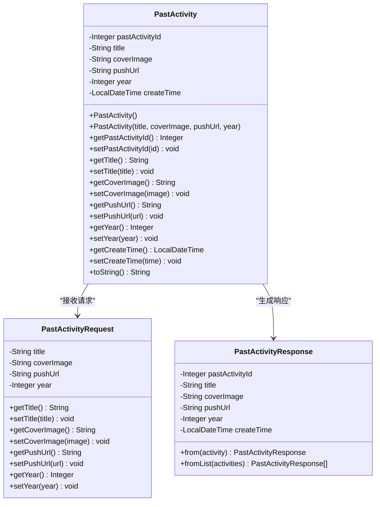
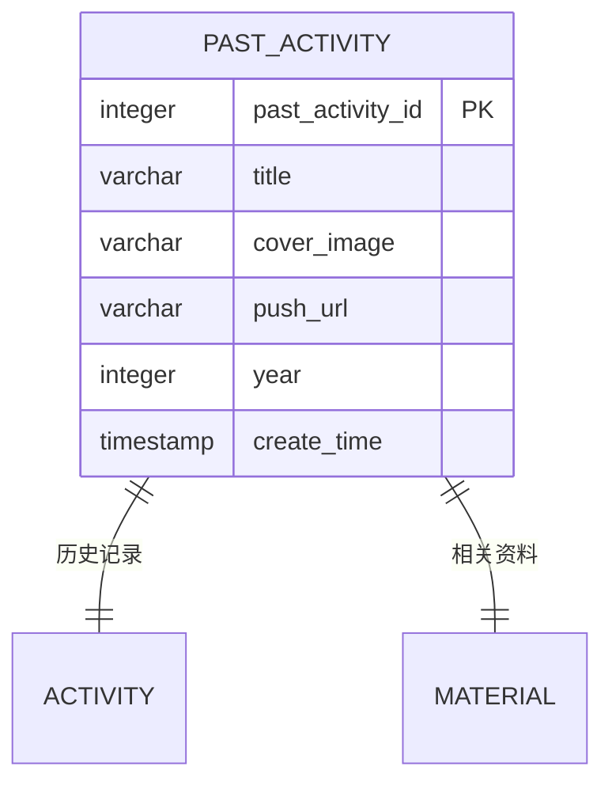
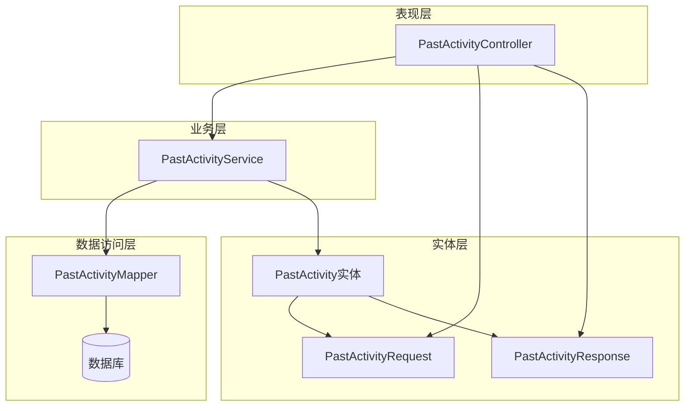
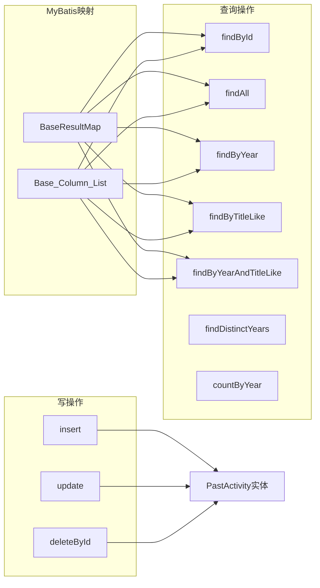
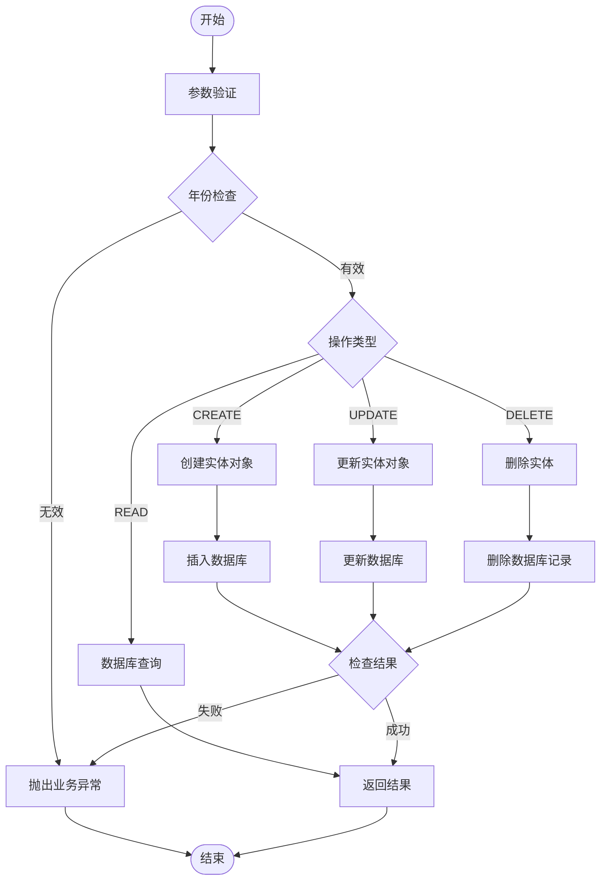
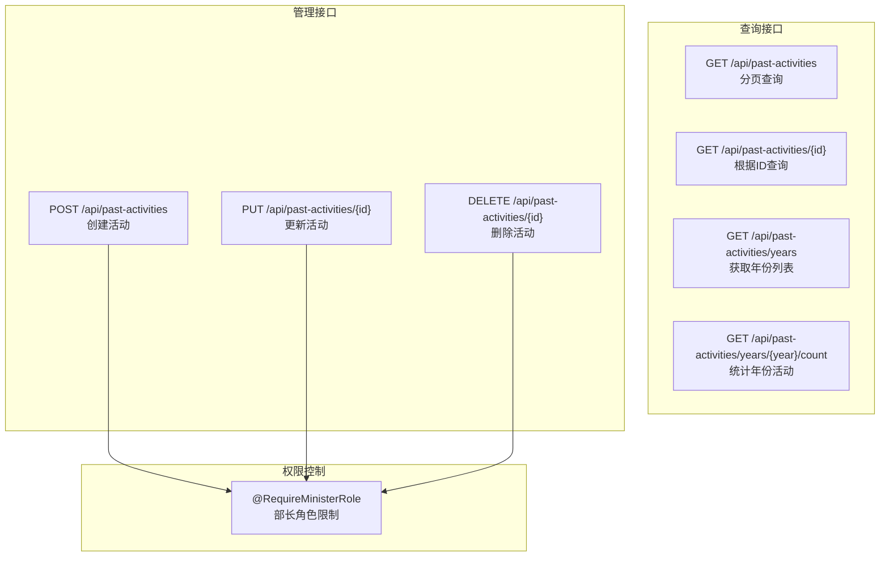
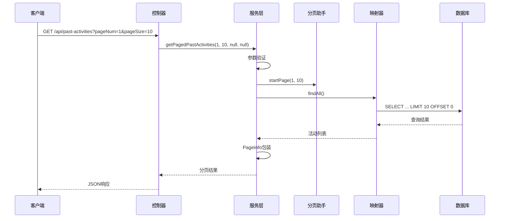
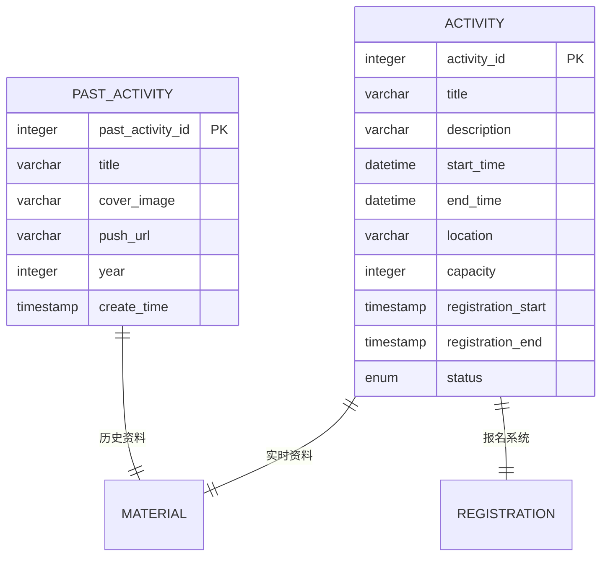

# 往届活动实体 (PastActivity) 详细文档

<cite>
**本文档中引用的文件**
- [PastActivity.java](file://src/main/java/com/redmoon2333/entity/PastActivity.java)
- [PastActivityMapper.xml](file://src/main/resources/mapper/PastActivityMapper.xml)
- [PastActivityController.java](file://src/main/java/com/redmoon2333/controller/PastActivityController.java)
- [PastActivityService.java](file://src/main/java/com/redmoon2333/service/PastActivityService.java)
- [PastActivityRequest.java](file://src/main/java/com/redmoon2333/dto/PastActivityRequest.java)
- [PastActivityResponse.java](file://src/main/java/com/redmoon2333/dto/PastActivityResponse.java)
</cite>

## 目录
1. [简介](#简介)
2. [实体设计概述](#实体设计概述)
3. [核心字段分析](#核心字段分析)
4. [架构设计](#架构设计)
5. [数据持久化层分析](#数据持久化层分析)
6. [服务层实现](#服务层实现)
7. [控制器层分析](#控制器层分析)
8. [分页查询与性能优化](#分页查询与性能优化)
9. [与当前活动的对比](#与当前活动的对比)
10. [使用示例](#使用示例)
11. [总结](#总结)

## 简介

PastActivity实体是人力资源管理系统中专门用于存储和管理历史活动信息的核心组件。该实体设计用于支持往届活动的浏览、检索和管理功能，为用户提供一个完整的活动历史记录系统。

该实体采用现代化的Java EE架构，结合JPA注解、MyBatis映射器和Spring Boot框架，提供了完整的CRUD操作支持和高级查询功能。

## 实体设计概述

PastActivity实体是一个标准的JPA实体类，具有以下核心特性：



**图表来源**
- [PastActivity.java](file://src/main/java/com/redmoon2333/entity/PastActivity.java#L1-L96)
- [PastActivityRequest.java](file://src/main/java/com/redmoon2333/dto/PastActivityRequest.java#L1-L73)
- [PastActivityResponse.java](file://src/main/java/com/redmoon2333/dto/PastActivityResponse.java#L1-L102)

**章节来源**
- [PastActivity.java](file://src/main/java/com/redmoon2333/entity/PastActivity.java#L1-L96)

## 核心字段分析

PastActivity实体包含六个核心字段，每个字段都有特定的用途和约束：

### 主键字段
- **pastActivityId**: 自增主键，使用`GenerationType.IDENTITY`策略生成
- 数据类型：`Integer`
- 约束：非空，自动增长

### 基础信息字段
- **title**: 活动标题，必填字段，最大长度未明确限制
- **year**: 活动年份，必填整数，用于分类和排序
- 数据类型：`String` 和 `Integer`

### 资源链接字段
- **coverImage**: 封面图片URL，可选字段
- **pushUrl**: 推送链接，可选字段，指向外部资源
- 数据类型：`String`

### 时间戳字段
- **createTime**: 创建时间，自动设置为当前时间
- 数据类型：`LocalDateTime`
- 默认值：`LocalDateTime.now()`

### 字段关系图



**图表来源**
- [PastActivity.java](file://src/main/java/com/redmoon2333/entity/PastActivity.java#L10-L25)

**章节来源**
- [PastActivity.java](file://src/main/java/com/redmoon2333/entity/PastActivity.java#L10-L25)

## 架构设计

PastActivity实体采用了典型的三层架构模式，结合DTO模式实现数据传输：



**图表来源**
- [PastActivityController.java](file://src/main/java/com/redmoon2333/controller/PastActivityController.java#L1-L134)
- [PastActivityService.java](file://src/main/java/com/redmoon2333/service/PastActivityService.java#L1-L305)

### 设计原则

1. **单一职责原则**: 每个组件专注于特定的功能领域
2. **依赖倒置原则**: 通过接口和抽象类实现松耦合
3. **数据传输对象模式**: 使用独立的DTO类处理请求和响应
4. **事务边界控制**: 在服务层统一管理事务边界

**章节来源**
- [PastActivityController.java](file://src/main/java/com/redmoon2333/controller/PastActivityController.java#L1-L134)
- [PastActivityService.java](file://src/main/java/com/redmoon2333/service/PastActivityService.java#L1-L305)

## 数据持久化层分析

PastActivityMapper.xml文件定义了完整的数据持久化操作，包括CRUD和高级查询功能：

### 映射配置



**图表来源**
- [PastActivityMapper.xml](file://src/main/resources/mapper/PastActivityMapper.xml#L1-L116)

### 查询操作详解

#### 基础查询
- **findById**: 根据ID精确查询单个活动
- **findAll**: 按年份降序和创建时间降序返回所有活动
- **findByYear**: 根据年份筛选活动

#### 高级查询
- **findByTitleLike**: 支持模糊匹配活动标题
- **findByYearAndTitleLike**: 组合条件查询，年份+标题模糊匹配
- **findDistinctYears**: 获取所有不重复的年份列表

#### 统计查询
- **findDistinctYears**: 返回年份列表，用于前端年份筛选
- **countByYear**: 统计指定年份的活动数量

### SQL优化策略

1. **索引优化**: 建议在`year`和`create_time`字段上建立复合索引
2. **查询缓存**: 对于频繁查询的年份列表可以考虑缓存
3. **分页查询**: 使用LIMIT和OFFSET实现高效分页

**章节来源**
- [PastActivityMapper.xml](file://src/main/resources/mapper/PastActivityMapper.xml#L1-L116)

## 服务层实现

PastActivityService提供了完整的业务逻辑处理，包括参数验证、业务规则检查和异常处理：

### 核心业务流程



**图表来源**
- [PastActivityService.java](file://src/main/java/com/redmoon2333/service/PastActivityService.java#L1-L305)

### 业务规则

1. **年份验证**: 新建或更新时检查年份不能大于当前年份
2. **参数校验**: 所有输入参数都进行有效性检查
3. **数据完整性**: 确保查询和操作的对象存在
4. **事务管理**: 使用Spring声明式事务确保数据一致性

### 异常处理机制

服务层实现了完善的异常处理机制：

- **BusinessException**: 业务异常，包含错误代码和消息
- **DataAccessException**: 数据访问异常，封装数据库操作错误
- **通用异常处理**: 捕获所有未预期的异常并转换为系统错误

**章节来源**
- [PastActivityService.java](file://src/main/java/com/redmoon2333/service/PastActivityService.java#L1-L305)

## 控制器层分析

PastActivityController提供了RESTful API接口，支持完整的CRUD操作和高级查询功能：

### API端点设计



**图表来源**
- [PastActivityController.java](file://src/main/java/com/redmoon2333/controller/PastActivityController.java#L1-L134)

### 分页查询功能

控制器支持灵活的分页查询，参数包括：
- **pageNum**: 页码，默认值1
- **pageSize**: 每页大小，默认值10，最大限制100
- **year**: 年份筛选条件（可选）
- **title**: 活动名称模糊搜索（可选）

### 响应格式

所有API都返回标准化的响应格式：

```json
{
  "code": 200,
  "message": "成功消息",
  "data": {...}
}
```

**章节来源**
- [PastActivityController.java](file://src/main/java/com/redmoon2333/controller/PastActivityController.java#L1-L134)

## 分页查询与性能优化

PastActivityService集成了PageHelper分页插件，提供了高效的分页查询功能：

### 分页实现细节



**图表来源**
- [PastActivityService.java](file://src/main/java/com/redmoon2333/service/PastActivityService.java#L35-L70)

### 性能优化建议

1. **索引策略**:
   - 在`year`字段上建立索引以加速年份查询
   - 在`create_time`字段上建立索引以支持时间排序
   - 考虑在`(year, create_time)`上建立复合索引

2. **缓存策略**:
   - 缓存年份列表减少数据库查询
   - 缓存热门年份的活动统计信息
   - 使用Redis缓存频繁查询的活动详情

3. **查询优化**:
   - 使用LIMIT和OFFSET实现高效分页
   - 避免SELECT *，只查询必要字段
   - 对于大表使用覆盖索引

4. **连接池优化**:
   - 合理配置数据库连接池大小
   - 设置合适的连接超时时间
   - 监控连接池使用情况

**章节来源**
- [PastActivityService.java](file://src/main/java/com/redmoon2333/service/PastActivityService.java#L35-L70)

## 与当前活动的对比

PastActivity实体与当前活动(Activity)实体存在显著差异，主要体现在以下几个方面：

### 功能定位差异

| 特性 | PastActivity(往届活动) | Activity(当前活动) |
|------|---------------------|-------------------|
| 数据用途 | 历史记录存储 | 当前活动管理 |
| 更新频率 | 低频更新 | 高频更新 |
| 查询重点 | 历史检索 | 即时信息 |
| 存储策略 | 长期保存 | 短期保存 |

### 数据模型差异



### 使用场景差异

1. **PastActivity**:
   - 活动历史回顾
   - 年度活动统计
   - 历史数据分析
   - 用户活动记录

2. **Activity**:
   - 即时活动发布
   - 报名管理
   - 实时状态监控
   - 当前可用活动展示

**章节来源**
- [PastActivity.java](file://src/main/java/com/redmoon2333/entity/PastActivity.java#L1-L96)

## 使用示例

### 创建往届活动

```java
// 创建请求对象
PastActivityRequest request = new PastActivityRequest();
request.setTitle("年度技术大会");
request.setCoverImage("https://example.com/images/conference.jpg");
request.setPushUrl("https://example.com/events/2023-tech-conference");
request.setYear(2023);

// 调用服务创建
PastActivityResponse response = pastActivityService.createPastActivity(request);
```

### 分页查询示例

```java
// 分页查询参数
int pageNum = 1;
int pageSize = 10;
Integer year = 2023; // 可选
String title = "技术"; // 可选

// 执行查询
PageResponse<PastActivityResponse> result = pastActivityService.getPagedPastActivities(
    pageNum, pageSize, year, title
);
```

### 年份统计示例

```java
// 获取所有年份
List<Integer> years = pastActivityService.getAllYears();

// 统计某年活动数量
int count = pastActivityService.countByYear(2023);
```

### 数据库查询示例

```sql
-- 基础查询
SELECT * FROM past_activity WHERE past_activity_id = 1;

-- 年份查询
SELECT * FROM past_activity WHERE year = 2023 ORDER BY create_time DESC;

-- 模糊搜索
SELECT * FROM past_activity WHERE title LIKE '%技术%' ORDER BY year DESC, create_time DESC;

-- 分页查询
SELECT * FROM past_activity ORDER BY year DESC, create_time DESC LIMIT 10 OFFSET 0;
```

**章节来源**
- [PastActivityService.java](file://src/main/java/com/redmoon2333/service/PastActivityService.java#L100-L150)
- [PastActivityMapper.xml](file://src/main/resources/mapper/PastActivityMapper.xml#L25-L60)

## 总结

PastActivity实体是一个设计精良的历史活动管理组件，具有以下核心优势：

### 技术优势

1. **完整的数据生命周期管理**: 从创建到查询再到删除的全流程支持
2. **灵活的查询能力**: 支持多种组合查询条件，满足不同业务需求
3. **高性能的分页查询**: 集成PageHelper实现高效的分页功能
4. **完善的异常处理**: 全面的错误处理和业务规则验证

### 架构优势

1. **清晰的分层架构**: 表现层、业务层、数据访问层职责分明
2. **DTO模式应用**: 有效隔离实体和外部接口
3. **事务管理**: Spring声明式事务确保数据一致性
4. **RESTful API设计**: 符合现代Web服务最佳实践

### 扩展性考虑

1. **模块化设计**: 易于扩展新的查询功能和业务逻辑
2. **配置化管理**: MyBatis映射器支持灵活的SQL配置
3. **缓存友好**: 支持多级缓存提升查询性能
4. **监控友好**: 提供完整的日志记录和异常追踪

PastActivity实体为人力资源管理系统提供了强大的历史活动管理能力，是系统架构中的重要组成部分。通过合理的数据库设计、完善的业务逻辑和高效的查询机制，该实体能够满足各种复杂的业务需求，为用户提供优质的活动管理体验。