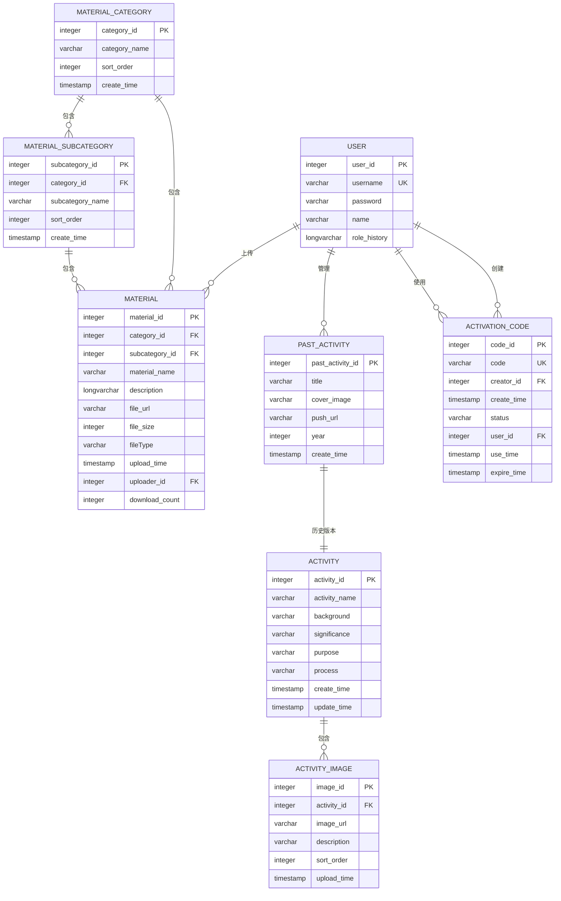

# 数据模型与ORM映射

<cite>
**本文档引用的文件**  
- [User.java](file://src/main/java/com/redmoon2333/entity/User.java)
- [Activity.java](file://src/main/java/com/redmoon2333/entity/Activity.java)
- [Material.java](file://src/main/java/com/redmoon2333/entity/Material.java)
- [PastActivity.java](file://src/main/java/com/redmoon2333/entity/PastActivity.java)
- [ActivationCode.java](file://src/main/java/com/redmoon2333/entity/ActivationCode.java)
- [ActivityImage.java](file://src/main/java/com/redmoon2333/entity/ActivityImage.java)
- [MaterialCategory.java](file://src/main/java/com/redmoon2333/entity/MaterialCategory.java)
- [MaterialSubcategory.java](file://src/main/java/com/redmoon2333/entity/MaterialSubcategory.java)
- [UserMapper.xml](file://src/main/resources/mapper/UserMapper.xml)
- [ActivityMapper.xml](file://src/main/resources/mapper/ActivityMapper.xml)
- [MaterialMapper.xml](file://src/main/resources/mapper/MaterialMapper.xml)
- [PastActivityMapper.xml](file://src/main/resources/mapper/PastActivityMapper.xml)
- [ActivationCodeMapper.xml](file://src/main/resources/mapper/ActivationCodeMapper.xml)
- [UserService.java](file://src/main/java/com/redmoon2333/service/UserService.java)
- [MaterialService.java](file://src/main/java/com/redmoon2333/service/MaterialService.java)
</cite>

## 目录
1. [引言](#引言)
2. [核心实体模型](#核心实体模型)
3. [实体关系与ER图](#实体关系与er图)
4. [MyBatis ORM映射机制](#mybatis-orm映射机制)
5. [数据库操作与动态SQL](#数据库操作与动态sql)
6. [分页查询实现](#分页查询实现)
7. [时间戳与软删除机制](#时间戳与软删除机制)
8. [数据访问模式与性能优化](#数据访问模式与性能优化)
9. [结论](#结论)

## 引言
本项目是一个人力资源管理系统，其核心数据模型围绕用户、活动、资料和往届活动等实体构建。系统采用Spring Boot框架，结合JPA注解和MyBatis实现数据持久化。数据模型设计注重业务逻辑的完整性，通过外键约束和枚举类型确保数据一致性。ORM映射层使用MyBatis XML配置文件，实现了数据库记录与Java对象的精确映射。系统还集成了PageHelper分页插件，支持高效的数据分页查询。

## 核心实体模型

### 用户实体 (User)
用户实体是系统的核心身份标识，包含用户的基本信息和角色历史。主要字段包括：
- **用户ID** (`user_id`): 主键，自增整数
- **用户名** (`username`): 唯一标识，长度3-20字符，非空
- **密码** (`password`): 加密存储，长度不少于6位，非空
- **姓名** (`name`): 用户真实姓名，最大50字符
- **角色历史** (`role_history`): 记录用户在不同年份的职位信息，格式为"年份级角色"，如"2024级部长"

**业务含义**：用户实体不仅用于身份认证，还通过`role_history`字段支持往届部员信息的提取和展示，满足组织历史追溯的需求。

**Section sources**
- [User.java](file://src/main/java/com/redmoon2333/entity/User.java#L1-L98)

### 活动实体 (Activity)
活动实体用于管理当前的组织活动，包含活动的详细描述信息。主要字段包括：
- **活动ID** (`activity_id`): 主键，自增整数
- **活动名称** (`activity_name`): 活动的标题
- **背景** (`background`): 活动的背景介绍
- **意义** (`significance`): 活动的重要性和价值
- **目的** (`purpose`): 活动的具体目标
- **流程** (`process`): 活动的执行步骤
- **创建时间** (`create_time`): 记录活动创建时间
- **更新时间** (`update_time`): 记录活动最后更新时间

**业务含义**：该实体用于记录和展示组织的活动策划，支持活动的全生命周期管理。

**Section sources**
- [Activity.java](file://src/main/java/com/redmoon2333/entity/Activity.java#L1-L126)

### 资料实体 (Material)
资料实体用于管理组织共享的文件资料，支持分类和下载统计。主要字段包括：
- **资料ID** (`material_id`): 主键，自增整数
- **分类ID** (`category_id`): 外键，关联资料分类
- **子分类ID** (`subcategory_id`): 外键，关联资料子分类
- **资料名称** (`material_name`): 文件的显示名称
- **描述** (`description`): 文件的详细说明
- **文件URL** (`file_url`): 文件在OSS上的存储路径
- **文件大小** (`file_size`): 文件大小（字节）
- **文件类型** (`file_type`): 文件扩展名
- **上传时间** (`upload_time`): 文件上传时间
- **上传者ID** (`uploader_id`): 外键，关联上传用户
- **下载次数** (`download_count`): 下载计数器，默认为0

**业务含义**：该实体实现了资料的分类管理，支持按分类和子分类进行资料检索，并通过下载计数器跟踪资料的使用情况。

**Section sources**
- [Material.java](file://src/main/java/com/redmoon2333/entity/Material.java#L1-L163)

### 往届活动实体 (PastActivity)
往届活动实体用于记录历史活动，支持按年份归档。主要字段包括：
- **往届活动ID** (`past_activity_id`): 主键，自增整数
- **标题** (`title`): 活动的标题
- **封面图片** (`cover_image`): 活动封面图的URL
- **推送链接** (`push_url`): 活动详情页的外部链接
- **年份** (`year`): 活动举办的年份
- **创建时间** (`create_time`): 记录创建时间

**业务含义**：该实体专门用于存储已结束的活动，通过年份字段实现时间维度的组织，便于用户按年份浏览历史活动。

**Section sources**
- [PastActivity.java](file://src/main/java/com/redmoon2333/entity/PastActivity.java#L1-L95)

### 激活码实体 (ActivationCode)
激活码实体用于管理用户注册的邀请机制，确保注册的安全性。主要字段包括：
- **码ID** (`code_id`): 主键，自增整数
- **码** (`code`): 激活码字符串
- **创建者ID** (`creator_id`): 外键，关联创建该码的用户
- **创建时间** (`create_time`): 码的生成时间
- **状态** (`status`): 枚举类型，表示码的状态（未使用、已使用、已过期）
- **用户ID** (`user_id`): 外键，关联使用该码注册的用户
- **使用时间** (`use_time`): 码被使用的时间
- **过期时间** (`expire_time`): 码的有效截止时间

**业务含义**：该实体实现了邀请注册机制，通过状态机管理激活码的生命周期，防止未授权注册。

**Section sources**
- [ActivationCode.java](file://src/main/java/com/redmoon2333/entity/ActivationCode.java#L1-L127)

### 活动图片实体 (ActivityImage)
活动图片实体用于管理活动相关的图片素材，支持排序。主要字段包括：
- **图片ID** (`image_id`): 主键，自增整数
- **活动ID** (`activity_id`): 外键，关联活动实体
- **图片URL** (`image_url`): 图片在OSS上的存储路径
- **描述** (`description`): 图片的说明文字
- **排序序号** (`sort_order`): 图片的显示顺序，默认为0
- **上传时间** (`upload_time`): 图片上传时间

**业务含义**：该实体支持为活动添加多张图片，并通过`sort_order`字段控制图片的展示顺序。

**Section sources**
- [ActivityImage.java](file://src/main/java/com/redmoon2333/entity/ActivityImage.java#L1-L100)

### 资料分类与子分类实体
资料分类实体 (`MaterialCategory`) 和子分类实体 (`MaterialSubcategory`) 用于构建资料的分类体系。
- **分类ID** (`category_id`): 主键
- **分类名称** (`category_name`): 分类的名称
- **排序序号** (`sort_order`): 分类的显示顺序
- **创建时间** (`create_time`): 分类创建时间

子分类实体还包含`category_id`外键，形成分类层级结构。

**业务含义**：这两个实体实现了资料的树状分类管理，支持灵活的资料组织和检索。

**Section sources**
- [MaterialCategory.java](file://src/main/java/com/redmoon2333/entity/MaterialCategory.java#L1-L79)
- [MaterialSubcategory.java](file://src/main/java/com/redmoon2333/entity/MaterialSubcategory.java)

## 实体关系与ER图



**Diagram sources**
- [User.java](file://src/main/java/com/redmoon2333/entity/User.java)
- [Activity.java](file://src/main/java/com/redmoon2333/entity/Activity.java)
- [ActivityImage.java](file://src/main/java/com/redmoon2333/entity/ActivityImage.java)
- [Material.java](file://src/main/java/com/redmoon2333/entity/Material.java)
- [MaterialCategory.java](file://src/main/java/com/redmoon2333/entity/MaterialCategory.java)
- [MaterialSubcategory.java](file://src/main/java/com/redmoon2333/entity/MaterialSubcategory.java)
- [PastActivity.java](file://src/main/java/com/redmoon2333/entity/PastActivity.java)
- [ActivationCode.java](file://src/main/java/com/redmoon2333/entity/ActivationCode.java)

## MyBatis ORM映射机制

### 结果映射 (ResultMap)
MyBatis通过`<resultMap>`元素定义数据库列与Java对象属性的映射关系。以用户实体为例：

```xml
<resultMap id="BaseResultMap" type="com.redmoon2333.entity.User">
    <id column="user_id" property="userId" jdbcType="INTEGER"/>
    <result column="username" property="username" jdbcType="VARCHAR"/>
    <result column="password" property="password" jdbcType="VARCHAR"/>
    <result column="name" property="name" jdbcType="VARCHAR"/>
    <result column="role_history" property="roleHistory" jdbcType="LONGVARCHAR"/>
</resultMap>
```

**映射规则**：
- `<id>` 元素映射主键字段，用于MyBatis的缓存和标识
- `<result>` 元素映射普通字段
- `column` 属性指定数据库列名
- `property` 属性指定Java对象的属性名
- `jdbcType` 属性指定JDBC类型，用于处理NULL值

**Section sources**
- [UserMapper.xml](file://src/main/resources/mapper/UserMapper.xml#L6-L12)

### SQL片段复用
系统使用`<sql>`元素定义可复用的SQL片段，提高代码复用性：

```xml
<sql id="Base_Column_List">
    user_id, username, password, name, role_history
</sql>
```

在查询语句中通过`<include refid="Base_Column_List"/>`引用，避免重复编写列名列表。

**Section sources**
- [UserMapper.xml](file://src/main/resources/mapper/UserMapper.xml#L14-L16)

### 对象关系映射
虽然系统主要使用单表映射，但通过服务层的组合查询实现对象关联。例如，在`MaterialService`中，查询资料时会同时查询其分类和子分类信息，然后在Java代码中组装成完整的响应对象。

**Section sources**
- [MaterialService.java](file://src/main/java/com/redmoon2333/service/MaterialService.java)

## 数据库操作与动态SQL

### 基本CRUD操作
系统实现了标准的增删改查操作，以用户实体为例：

**查询操作**：
```xml
<select id="findById" parameterType="java.lang.Integer" resultMap="BaseResultMap">
    SELECT
    <include refid="Base_Column_List"/>
    FROM user
    WHERE user_id = #{userId}
</select>
```

**插入操作**：
```xml
<insert id="insert" parameterType="com.redmoon2333.entity.User" useGeneratedKeys="true" keyProperty="userId">
    INSERT INTO user (
        username,
        password,
        name,
        role_history
    ) VALUES (
        #{username},
        #{password},
        #{name},
        #{roleHistory}
    )
</insert>
```

**更新操作**：
```xml
<update id="update" parameterType="com.redmoon2333.entity.User">
    UPDATE user
    <set>
        <if test="username != null">
            username = #{username},
        </if>
        <if test="password != null">
            password = #{password},
        </if>
        <if test="name != null">
            name = #{name},
        </if>
        <if test="roleHistory != null">
            role_history = #{roleHistory},
        </if>
    </set>
    WHERE user_id = #{userId}
</update>
```

**删除操作**：
```xml
<delete id="deleteById" parameterType="java.lang.Integer">
    DELETE FROM user
    WHERE user_id = #{userId}
</delete>
</mapper>
```

**Section sources**
- [UserMapper.xml](file://src/main/resources/mapper/UserMapper.xml#L18-L105)

### 动态SQL应用
系统广泛使用MyBatis的动态SQL功能，实现灵活的查询条件：

**条件更新**：`<set>`标签结合`<if>`标签，只更新非空字段，避免覆盖现有数据。
**模糊查询**：使用`LIKE CONCAT('%', #{name}, '%')`实现姓名模糊匹配。
**条件查询**：根据参数动态构建WHERE子句，如`findByYearAndTitleLike`方法。

**实际SQL示例**：
```sql
-- 根据姓名模糊查找用户
SELECT user_id, username, password, name, role_history 
FROM user 
WHERE name LIKE CONCAT('%', '张', '%')

-- 根据年份和标题查找往届活动
SELECT past_activity_id, title, cover_image, push_url, year, create_time 
FROM past_activity 
WHERE year = 2024 
AND title LIKE CONCAT('%', '迎新', '%') 
ORDER BY create_time DESC
```

**Section sources**
- [UserMapper.xml](file://src/main/resources/mapper/UserMapper.xml#L50-L57)
- [PastActivityMapper.xml](file://src/main/resources/mapper/PastActivityMapper.xml#L65-L75)

## 分页查询实现

### PageHelper集成
系统使用PageHelper插件实现分页功能。在服务层方法中，通过`PageHelper.startPage(page, size)`开启分页：

```java
public PageResponse<PastActivityResponse> getPagedPastActivities(int page, int size, Integer year, String title) {
    PageHelper.startPage(page, size);
    List<PastActivity> activities = pastActivityMapper.findByYearAndTitleLike(year, title);
    PageInfo<PastActivity> pageInfo = new PageInfo<>(activities);
    
    List<PastActivityResponse> responses = activities.stream()
        .map(PastActivityResponse::from)
        .collect(Collectors.toList());
    
    return new PageResponse<>(responses, pageInfo.getTotal(), pageInfo.getPages());
}
```

### 分页工作流程
1. **前端请求**：传递`page`（页码）和`size`（每页数量）参数
2. **服务层处理**：调用`PageHelper.startPage()`，该方法会修改后续的SQL执行
3. **MyBatis执行**：PageHelper自动在原SQL前后添加分页相关的子查询和LIMIT子句
4. **结果封装**：使用`PageInfo`对象获取分页元数据（总记录数、总页数等）
5. **响应返回**：将分页数据和元数据封装到`PageResponse`中返回

**性能优化**：PageHelper会自动优化分页查询，对于简单查询使用`LIMIT offset, size`，对于复杂查询可能使用子查询优化。

**Section sources**
- [PastActivityService.java](file://src/main/java/com/redmoon2333/service/PastActivityService.java)
- [PastActivityMapper.xml](file://src/main/resources/mapper/PastActivityMapper.xml)

## 时间戳与软删除机制

### 时间戳实现
系统在多个实体中实现了创建时间和更新时间的自动管理：

```java
public class Activity {
    @Column(name = "create_time")
    private LocalDateTime createTime;
    
    @Column(name = "update_time")
    private LocalDateTime updateTime;
    
    public Activity() {
        this.createTime = LocalDateTime.now();
        this.updateTime = LocalDateTime.now();
    }
    
    // 在更新操作时，服务层会调用setUpdateTime(LocalDateTime.now())
}
```

**业务价值**：时间戳字段用于记录数据的生命周期，支持按时间排序和审计追踪。

**Section sources**
- [Activity.java](file://src/main/java/com/redmoon2333/entity/Activity.java#L15-L16)

### 软删除机制
本系统目前未实现软删除，而是使用物理删除。所有删除操作都直接从数据库中移除记录：

```xml
<delete id="deleteById" parameterType="java.lang.Integer">
    DELETE FROM user
    WHERE user_id = #{userId}
</delete>
```

**设计考量**：考虑到系统数据量不大且对数据恢复需求不高，采用了简单的物理删除策略。如果未来需要恢复数据，可以通过数据库备份实现。

**替代方案**：若需实现软删除，可添加`is_deleted`布尔字段，默认为`false`，删除时更新为`true`，并在所有查询中添加`WHERE is_deleted = false`条件。

**Section sources**
- [UserMapper.xml](file://src/main/resources/mapper/UserMapper.xml#L103-L105)

## 数据访问模式与性能优化

### 服务层数据处理
服务层不仅是简单的DAO调用，还包含复杂的业务逻辑处理。以`getAlumniMembers`方法为例：

```java
public List<AlumniResponse> getAlumniMembers() {
    List<User> allUsers = getAllUsers();
    Map<Integer, List<AlumniMember>> alumniMap = new HashMap<>();
    
    Pattern rolePattern = Pattern.compile("(\\d{4})级(.+)");
    for (User user : allUsers) {
        String roleHistory = user.getRoleHistory();
        if (roleHistory != null) {
            String[] roles = roleHistory.split("&");
            for (String role : roles) {
                Matcher matcher = rolePattern.matcher(role);
                if (matcher.matches()) {
                    Integer year = Integer.valueOf(matcher.group(1));
                    String roleName = matcher.group(2);
                    alumniMap.computeIfAbsent(year, k -> new ArrayList<>())
                             .add(new AlumniMember(user.getName(), roleName));
                }
            }
        }
    }
    // ... 排序和转换
}
```

**性能分析**：此方法一次性加载所有用户，适合用户量不大的场景。如果用户量增长，应考虑分页加载或缓存机制。

**Section sources**
- [UserService.java](file://src/main/java/com/redmoon2333/service/UserService.java#L30-L200)

### 查询优化策略
1. **索引优化**：在频繁查询的字段（如`username`、`year`、`category_id`）上应创建数据库索引
2. **批量操作**：对于分类删除，提供了`deleteByCategoryId`方法，避免逐条删除
3. **计数器优化**：`download_count`字段通过`UPDATE material SET download_count = download_count + 1`实现原子递增，避免读-改-写竞争
4. **连接查询优化**：虽然目前使用多次查询组装数据，但对于高频访问的关联数据，可考虑在MyBatis中使用`<association>`或`<collection>`进行连接查询

### 缓存建议
目前系统未集成缓存机制。对于以下高频读取、低频更新的数据，建议添加缓存：
- 资料分类和子分类列表
- 往届活动列表
- 部员信息

可使用Redis作为缓存层，设置合理的过期时间，显著提升系统性能。

## 结论
本系统构建了一个完整的人力资源管理数据模型，涵盖了用户、活动、资料和历史记录等核心实体。通过JPA注解和MyBatis XML配置，实现了数据库与Java对象的精确映射。系统采用动态SQL和PageHelper插件，支持灵活的查询和分页功能。数据模型设计合理，关系清晰，业务逻辑完整。未来可考虑引入软删除机制和缓存层，进一步提升系统的数据安全性和性能表现。