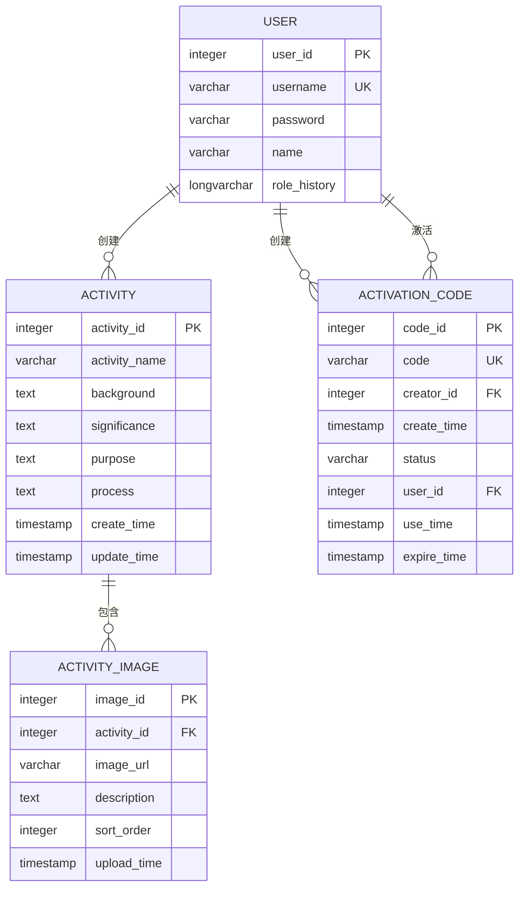
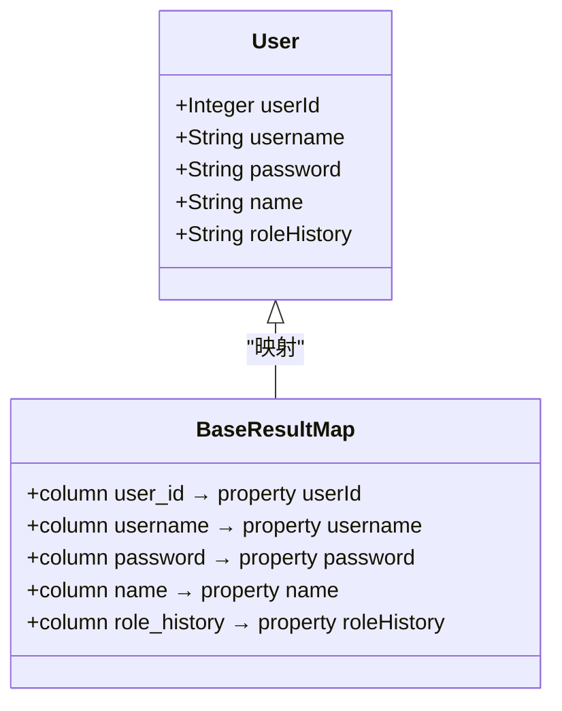
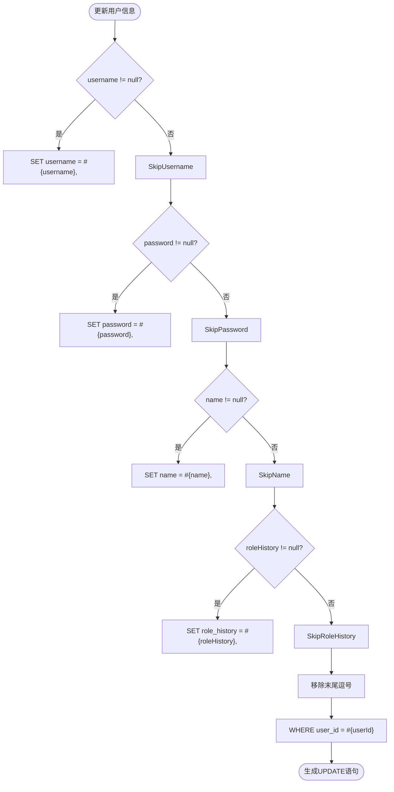
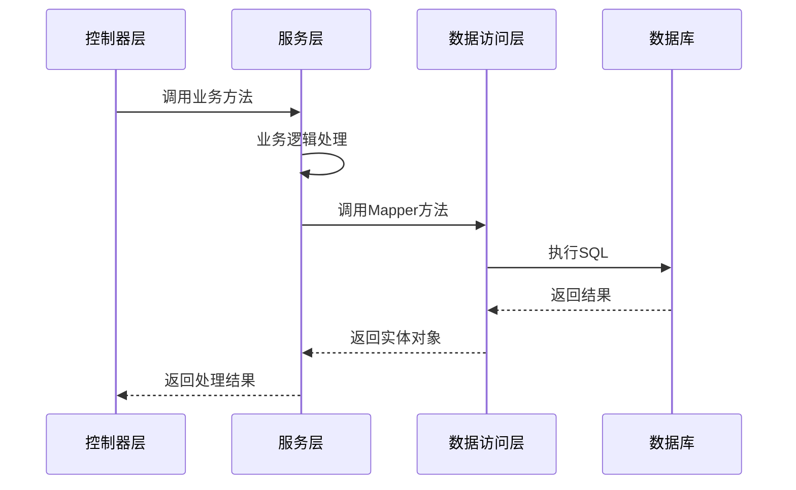
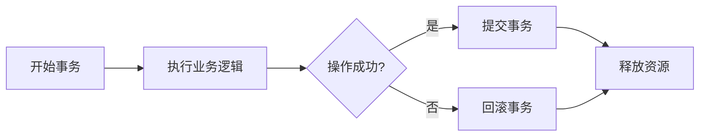

# 数据模型与ORM映射

<cite>
**本文档引用的文件**  
- [User.java](file://src/main/java/com/redmoon2333/entity/User.java)
- [Activity.java](file://src/main/java/com/redmoon2333/entity/Activity.java)
- [ActivityImage.java](file://src/main/java/com/redmoon2333/entity/ActivityImage.java)
- [ActivationCode.java](file://src/main/java/com/redmoon2333/entity/ActivationCode.java)
- [UserMapper.xml](file://src/main/resources/mapper/UserMapper.xml)
- [ActivityImageMapper.xml](file://src/main/resources/mapper/ActivityImageMapper.xml)
- [ActivationCodeMapper.xml](file://src/main/resources/mapper/ActivationCodeMapper.xml)
- [ActivityService.java](file://src/main/java/com/redmoon2333/service/ActivityService.java)
- [ActivationStatus.java](file://src/main/java/com/redmoon2333/enums/ActivationStatus.java)
</cite>

## 目录
1. [引言](#引言)
2. [核心实体类分析](#核心实体类分析)
   1. [用户实体（User）](#用户实体user)
   2. [活动实体（Activity）](#活动实体activity)
   3. [活动图片实体（ActivityImage）](#活动图片实体activityimage)
   4. [激活码实体（ActivationCode）](#激活码实体activationcode)
3. [实体关系与数据库设计](#实体关系与数据库设计)
4. [MyBatis ORM映射机制](#mybatis-orm映射机制)
   1. [resultMap配置详解](#resultmap配置详解)
   2. [动态SQL与条件更新](#动态sql与条件更新)
   3. [SQL片段复用机制](#sql片段复用机制)
5. [数据访问模式与性能优化](#数据访问模式与性能优化)
6. [事务管理与异常处理](#事务管理与异常处理)
7. [总结](#总结)

## 引言
本文档旨在全面描述人力资源管理系统中的核心数据模型及其ORM映射机制。系统采用Spring Boot + MyBatis技术栈，通过JPA注解定义实体类，并结合MyBatis XML映射文件实现灵活的SQL操作。文档将深入分析User、Activity、ActivityImage和ActivationCode等关键实体的结构、字段约束、业务规则以及它们之间的关系。同时，详细说明MyBatis如何通过resultMap、动态SQL等特性实现Java对象与数据库记录的精确映射，涵盖数据访问模式、性能优化策略和事务管理注意事项。

## 核心实体类分析

### 用户实体（User）
`User`实体对应数据库中的`user`表，是系统的核心身份主体。

**字段说明：**
- `userId`：用户ID，主键，自增，对应数据库列`user_id`
- `username`：用户名，非空，长度3-20字符，唯一约束，对应`username`列
- `password`：密码，非空，长度不少于6位，对应`password`列
- `name`：真实姓名，最大长度50字符，对应`name`列
- `roleHistory`：角色历史记录，用于存储用户权限变更轨迹，对应`role_history`列

**业务规则：**
- 用户名和密码在注册时必须提供且满足长度校验
- 用户名具有唯一性，通过`UserMapper.xml`中的`countByUsername`查询确保
- 实体使用Jakarta Bean Validation注解进行字段级校验

**Section sources**
- [User.java](file://src/main/java/com/redmoon2333/entity/User.java#L1-L98)

### 活动实体（Activity）
`Activity`实体对应`activity`表，用于存储组织活动的详细信息。

**字段说明：**
- `activityId`：活动ID，主键，自增，对应`activity_id`列
- `activityName`：活动名称，对应`activity_name`列
- `background`：活动背景介绍
- `significance`：活动意义说明
- `purpose`：活动目的描述
- `process`：活动流程安排
- `createTime`：创建时间，插入时自动设置为当前时间
- `updateTime`：最后更新时间，每次更新时刷新

**业务规则：**
- 活动创建时自动设置`createTime`和`updateTime`
- 活动更新时仅刷新`updateTime`，不修改`createTime`
- 所有文本字段均支持长文本存储

**Section sources**
- [Activity.java](file://src/main/java/com/redmoon2333/entity/Activity.java#L1-L126)

### 活动图片实体（ActivityImage）
`ActivityImage`实体对应`activity_image`表，实现活动与图片的一对多关系。

**字段说明：**
- `imageId`：图片ID，主键，自增，对应`image_id`列
- `activityId`：关联的活动ID，外键，对应`activity_id`列
- `imageUrl`：图片存储路径或URL
- `description`：图片描述信息
- `sortOrder`：排序序号，默认为0，用于控制图片显示顺序
- `uploadTime`：上传时间，插入时自动设置为当前时间

**业务规则：**
- 一个活动可关联多张图片，通过`activityId`建立关联
- 图片按`sortOrder`升序、`uploadTime`升序排列
- 删除活动时级联删除所有关联图片，由`ActivityService`在`deleteActivity`方法中实现

**Section sources**
- [ActivityImage.java](file://src/main/java/com/redmoon2333/entity/ActivityImage.java#L1-L100)

### 激活码实体（ActivationCode）
`ActivationCode`实体对应`activation_code`表，用于管理用户注册的激活机制。

**字段说明：**
- `codeId`：激活码ID，主键，自增，对应`code_id`列
- `code`：激活码字符串，唯一标识，对应`code`列
- `creatorId`：创建者用户ID，对应`creator_id`列
- `createTime`：创建时间，构造时自动设置
- `status`：状态，枚举类型`ActivationStatus`，对应`status`列
- `userId`：绑定的用户ID，激活后填充
- `useTime`：使用时间，激活时记录
- `expireTime`：过期时间，用于控制激活码有效期

**业务规则：**
- 状态使用`ActivationStatus`枚举，包含"未使用"和"已使用"两种状态
- 通过`findValidCode`查询确保激活码未过期且处于"未使用"状态
- 激活成功后更新`status`为"已使用"，设置`userId`和`useTime`

**Section sources**
- [ActivationCode.java](file://src/main/java/com/redmoon2333/entity/ActivationCode.java#L1-L127)
- [ActivationStatus.java](file://src/main/java/com/redmoon2333/enums/ActivationStatus.java#L1-L23)

## 实体关系与数据库设计
系统核心实体间存在明确的关系模型：



**Diagram sources**
- [User.java](file://src/main/java/com/redmoon2333/entity/User.java#L1-L98)
- [Activity.java](file://src/main/java/com/redmoon2333/entity/Activity.java#L1-L126)
- [ActivityImage.java](file://src/main/java/com/redmoon2333/entity/ActivityImage.java#L1-L100)
- [ActivationCode.java](file://src/main/java/com/redmoon2333/entity/ActivationCode.java#L1-L127)

**关键设计说明：**
1. **主键设计**：所有表均采用自增整数主键，确保唯一性和性能
2. **外键约束**：
   - `activity_image.activity_id` → `activity.activity_id`
   - `activation_code.creator_id` → `user.user_id`
   - `activation_code.user_id` → `user.user_id`
3. **索引设计**：
   - `user.username`：唯一索引，确保用户名唯一
   - `activation_code.code`：唯一索引，确保激活码唯一
   - `activity_image.activity_id`：普通索引，优化按活动查询图片
4. **数据类型选择**：
   - 文本字段根据内容长度选择`VARCHAR`或`TEXT`
   - 时间字段统一使用`LocalDateTime`和数据库`TIMESTAMP`
   - 枚举类型存储为`VARCHAR`，通过`EnumTypeHandler`转换

## MyBatis ORM映射机制

### resultMap配置详解
MyBatis通过`resultMap`实现数据库列与Java属性的精确映射，解决列名与属性名不一致的问题。



**Diagram sources**
- [UserMapper.xml](file://src/main/resources/mapper/UserMapper.xml#L1-L105)

以`UserMapper.xml`为例，`BaseResultMap`定义了完整的映射关系：
- `<id column="user_id" property="userId"/>`：主键映射
- `<result column="username" property="username"/>`：普通字段映射
- `jdbcType`属性明确指定数据库类型，避免类型推断错误
- `typeHandler`用于特殊类型转换，如`ActivationCode`中的枚举类型

### 动态SQL与条件更新
MyBatis的动态SQL特性允许构建灵活的查询语句，特别适用于部分字段更新场景。



**Diagram sources**
- [UserMapper.xml](file://src/main/resources/mapper/UserMapper.xml#L75-L85)

`<set>`标签结合`<if>`条件判断，实现智能的SET子句生成：
- 仅包含非null字段的更新
- 自动处理末尾逗号问题
- 避免更新未修改的字段，提高性能和数据一致性

### SQL片段复用机制
通过`<sql>`标签定义可重用的SQL片段，提高代码复用性和维护性。

```xml
<sql id="Base_Column_List">
    user_id, username, password, name, role_history
</sql>

<select id="findById" resultMap="BaseResultMap">
    SELECT
    <include refid="Base_Column_List"/>
    FROM user
    WHERE user_id = #{userId}
</select>
```

这种机制确保：
- 所有查询使用相同的列列表，避免遗漏或错误
- 修改列名时只需更新一处
- 提高SQL语句的可读性和一致性

**Section sources**
- [UserMapper.xml](file://src/main/resources/mapper/UserMapper.xml#L1-L105)
- [ActivityImageMapper.xml](file://src/main/resources/mapper/ActivityImageMapper.xml#L1-L85)
- [ActivationCodeMapper.xml](file://src/main/resources/mapper/ActivationCodeMapper.xml#L1-L83)

## 数据访问模式与性能优化
系统采用分层架构，数据访问遵循以下模式：



**Diagram sources**
- [ActivityService.java](file://src/main/java/com/redmoon2333/service/ActivityService.java#L1-L199)

**性能优化策略：**
1. **懒加载替代**：系统未使用Hibernate懒加载，而是通过服务层按需查询
2. **批量操作**：删除活动时先删除关联图片，再删除活动主记录
3. **索引优化**：关键查询字段建立适当索引
4. **连接池**：通过Spring Boot自动配置HikariCP连接池
5. **缓存考虑**：高频查询可引入Redis缓存，当前系统未实现

**数据访问最佳实践：**
- 服务层负责事务管理和业务逻辑
- Mapper层仅负责数据存取，保持简单
- 使用`useGeneratedKeys="true"`获取自增主键
- 参数校验在控制器层完成，确保数据完整性

## 事务管理与异常处理
系统通过Spring声明式事务管理确保数据一致性：



**关键事务场景：**
- **用户注册**：生成激活码并保存用户信息，需保证原子性
- **活动删除**：删除活动及其所有图片，必须全部成功或全部失败
- **激活码使用**：验证、更新状态、绑定用户，需在单个事务中完成

**异常处理机制：**
- 自定义`BusinessException`区分业务异常和系统异常
- 全局异常处理器`GlobalExceptionHandler`统一处理异常响应
- 日志记录使用SLF4J，便于问题追踪和审计

**Section sources**
- [ActivityService.java](file://src/main/java/com/redmoon2333/service/ActivityService.java#L1-L199)
- [GlobalExceptionHandler.java](file://src/main/java/com/redmoon2333/exception/GlobalExceptionHandler.java)

## 总结
本系统通过清晰的实体设计和高效的ORM映射，构建了稳定可靠的数据访问层。核心实体`User`、`Activity`、`ActivityImage`和`ActivationCode`准确反映了业务需求，关系模型合理。MyBatis的`resultMap`、动态SQL和SQL片段机制提供了灵活而强大的映射能力。数据访问模式遵循分层原则，服务层协调多个Mapper操作，确保事务完整性。未来可考虑引入二级缓存、查询优化和更精细的索引策略来进一步提升性能。