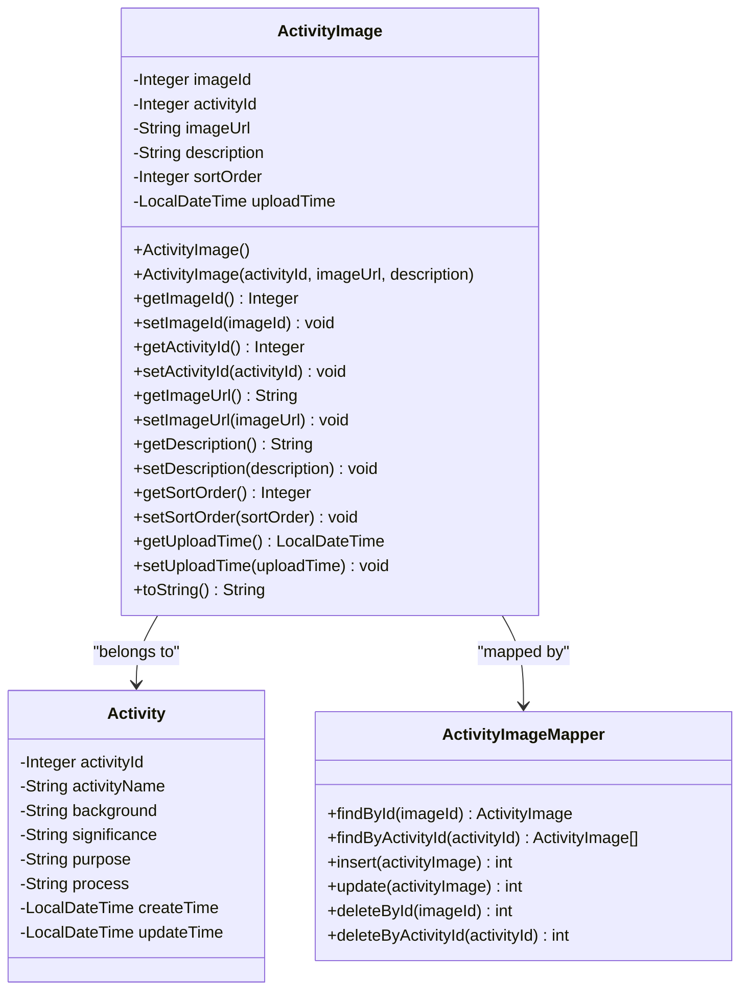
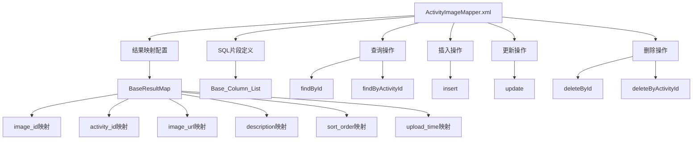
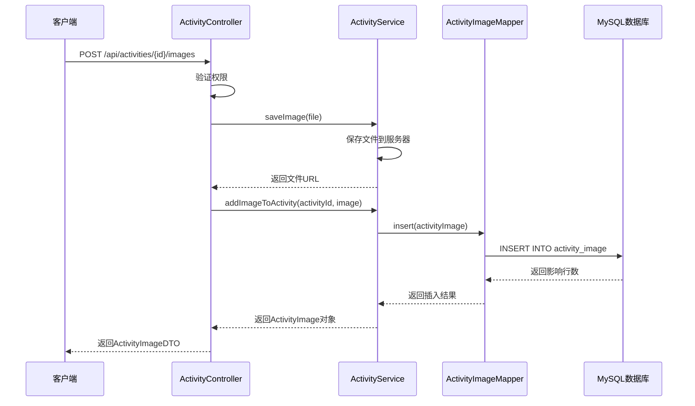
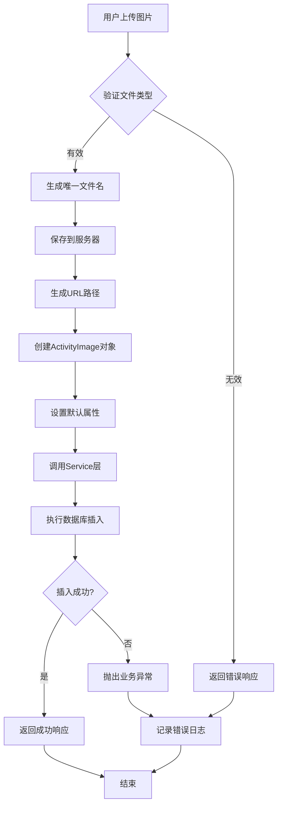
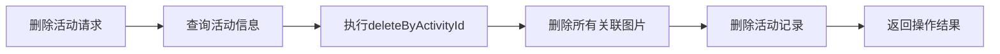

# 活动图片实体（ActivityImage）

<cite>
**本文档中引用的文件**
- [ActivityImage.java](file://src/main/java/com/redmoon2333/entity/ActivityImage.java)
- [ActivityImageMapper.xml](file://src/main/resources/mapper/ActivityImageMapper.xml)
- [ActivityImageMapper.java](file://src/main/java/com/redmoon2333/mapper/ActivityImageMapper.java)
- [ActivityController.java](file://src/main/java/com/redmoon2333/controller/ActivityController.java)
- [ActivityService.java](file://src/main/java/com/redmoon2333/service/ActivityService.java)
- [Activity.java](file://src/main/java/com/redmoon2333/entity/Activity.java)
- [ActivityImageDTO.java](file://src/main/java/com/redmoon2333/dto/ActivityImageDTO.java)
</cite>

## 目录
1. [简介](#简介)
2. [实体设计架构](#实体设计架构)
3. [核心字段详解](#核心字段详解)
4. [数据库映射配置](#数据库映射配置)
5. [查询与操作方法](#查询与操作方法)
6. [业务流程分析](#业务流程分析)
7. [性能优化策略](#性能优化策略)
8. [最佳实践指南](#最佳实践指南)
9. [扩展方案建议](#扩展方案建议)
10. [总结](#总结)

## 简介

ActivityImage实体是人力资源管理系统中负责管理活动相关图片的核心数据模型。该实体通过精心设计的字段结构和数据库映射，实现了对活动图片的完整生命周期管理，包括图片上传、存储、排序展示以及批量删除等功能。

该实体采用JPA注解进行ORM映射，与MySQL数据库中的`activity_image`表建立了一对多的关系，每个活动可以关联多张图片，每张图片都有独立的排序权重和上传时间记录。

## 实体设计架构

ActivityImage实体采用了标准的Java Bean模式，结合JPA注解实现持久化映射：



**图表来源**
- [ActivityImage.java](file://src/main/java/com/redmoon2333/entity/ActivityImage.java#L7-L100)
- [Activity.java](file://src/main/java/com/redmoon2333/entity/Activity.java#L8-L126)
- [ActivityImageMapper.java](file://src/main/java/com/redmoon2333/mapper/ActivityImageMapper.java#L8-L40)

**章节来源**
- [ActivityImage.java](file://src/main/java/com/redmoon2333/entity/ActivityImage.java#L1-L101)
- [ActivityImageMapper.java](file://src/main/java/com/redmoon2333/mapper/ActivityImageMapper.java#L1-L40)

## 核心字段详解

### 主键标识字段

**imageId**: 自增主键，使用`GenerationType.IDENTITY`策略生成，确保每张图片都有唯一的标识符。

```java
@Id
@GeneratedValue(strategy = GenerationType.IDENTITY)
@Column(name = "image_id")
private Integer imageId;
```

### 外键关联字段

**activityId**: 关联到Activity实体的外键，建立一对多关系：
- 数据类型：Integer
- 约束：允许为空但通常不为空
- 业务意义：标识图片所属的活动

```java
@Column(name = "activity_id")
private Integer activityId;
```

### 内容存储字段

**imageUrl**: 存储图片文件的URL路径：
- 数据类型：String
- 长度限制：根据实际需求设置
- 存储规范：支持本地文件路径或CDN URL
- SEO优化：建议包含有意义的文件名

```java
@Column(name = "image_url")
private String imageUrl;
```

**description**: 图片描述信息：
- 数据类型：String
- 长度：LONGVARCHAR类型，支持大文本
- SEO价值：用于图片alt属性和搜索引擎优化
- 用户体验：提供图片内容说明

```java
@Column(name = "description")
private String description;
```

### 排序控制字段

**sortOrder**: 图片排序权重，默认值为0：
- 数据类型：Integer
- 默认值：0
- 排序优先级：主要排序依据
- 用户界面：决定图片在活动页面的显示顺序

```java
@Column(name = "sort_order")
private Integer sortOrder = 0;
```

### 时间戳字段

**uploadTime**: 图片上传时间戳：
- 数据类型：LocalDateTime
- 自动生成：构造函数中自动设置当前时间
- 副排序依据：当sort_order相同时按上传时间排序
- 审计追踪：记录图片创建的时间点

```java
@Column(name = "upload_time")
private LocalDateTime uploadTime;
```

**章节来源**
- [ActivityImage.java](file://src/main/java/com/redmoon2333/entity/ActivityImage.java#L10-L25)

## 数据库映射配置

### MyBatis映射配置

ActivityImageMapper.xml提供了完整的SQL映射配置，支持所有基本的CRUD操作：



**图表来源**
- [ActivityImageMapper.xml](file://src/main/resources/mapper/ActivityImageMapper.xml#L1-L86)

### 查询排序逻辑

`findByActivityId`查询实现了复合排序逻辑：

```sql
SELECT * FROM activity_image
WHERE activity_id = #{activityId}
ORDER BY sort_order ASC, upload_time ASC
```

这种排序策略的优势：
1. **主要排序**：按sort_order升序排列，确保用户自定义的显示顺序
2. **副排序**：当sort_order相同时，按上传时间升序排列
3. **一致性**：相同排序权重的图片保持稳定的显示顺序

### 批量删除操作

`deleteByActivityId`实现了级联删除功能：

```sql
DELETE FROM activity_image
WHERE activity_id = #{activityId}
```

这种设计确保了当活动被删除时，其关联的所有图片也会被自动清理，维护了数据的一致性。

**章节来源**
- [ActivityImageMapper.xml](file://src/main/resources/mapper/ActivityImageMapper.xml#L25-L85)

## 查询与操作方法

### 控制器层接口

ActivityController提供了完整的REST API接口：



**图表来源**
- [ActivityController.java](file://src/main/java/com/redmoon2333/controller/ActivityController.java#L170-L200)
- [ActivityService.java](file://src/main/java/com/redmoon2333/service/ActivityService.java#L160-L190)

### 服务层业务逻辑

ActivityService实现了完整的业务逻辑处理：

1. **图片验证**：检查活动是否存在
2. **文件处理**：生成唯一文件名，保存到指定目录
3. **数据持久化**：自动设置上传时间和活动ID
4. **异常处理**：统一的业务异常处理机制

### DTO转换层

ActivityImageDTO作为数据传输对象，提供了与前端交互的标准化格式：

```java
public class ActivityImageDTO {
    private Integer imageId;
    private Integer activityId;
    private String imageUrl;
    private String description;
    private Integer sortOrder;
    private LocalDateTime uploadTime;
}
```

**章节来源**
- [ActivityController.java](file://src/main/java/com/redmoon2333/controller/ActivityController.java#L170-L250)
- [ActivityService.java](file://src/main/java/com/redmoon2333/service/ActivityService.java#L160-L220)
- [ActivityImageDTO.java](file://src/main/java/com/redmoon2333/dto/ActivityImageDTO.java#L1-L62)

## 业务流程分析

### 图片上传流程



### 图片排序机制

系统通过两个维度控制图片显示顺序：

1. **用户自定义排序**：通过sortOrder字段实现
2. **时间顺序**：当sortOrder相同时按upload_time排序

这种设计允许管理员灵活调整图片展示顺序，同时保持相同排序权重的图片显示稳定性。

### 级联删除策略

当活动被删除时，系统会自动执行以下操作：



**图表来源**
- [ActivityService.java](file://src/main/java/com/redmoon2333/service/ActivityService.java#L85-L95)

**章节来源**
- [ActivityService.java](file://src/main/java/com/redmoon2333/service/ActivityService.java#L160-L271)

## 性能优化策略

### 查询优化

1. **索引设计**：
   - 在`activity_id`字段上建立索引，加速按活动查询
   - 在`sort_order`和`upload_time`字段上建立复合索引，优化排序查询

2. **分页查询**：
   对于大量图片的活动，建议实现分页查询功能，避免一次性加载过多数据。

3. **缓存策略**：
   - 缓存热门活动的图片列表
   - 使用Redis缓存图片元数据

### 存储优化

1. **文件压缩**：
   - 在保存图片前进行适当的压缩处理
   - 支持多种图片格式（JPEG、PNG、WebP）

2. **CDN集成**：
   - 将图片存储在CDN上，提高访问速度
   - 实现图片懒加载机制

### 并发处理

1. **事务管理**：
   - 确保图片上传和数据库操作的原子性
   - 使用适当的隔离级别防止并发问题

2. **锁机制**：
   - 在批量操作时使用乐观锁
   - 避免长时间持有数据库连接

## 最佳实践指南

### URL存储规范

1. **命名规范**：
   ```java
   // 推荐的文件名生成方式
   String uniqueFilename = UUID.randomUUID().toString() + extension;
   ```

2. **路径组织**：
   ```
   uploads/
   ├── 2024/
   │   ├── 01/
   │   │   ├── a1b2c3d4-e5f6-7890-abcd-efghijklmnop.jpg
   │   │   └── ...
   │   └── 02/
   └── thumbnails/
   ```

3. **安全考虑**：
   - 验证文件类型和大小
   - 防止恶意文件上传
   - 实现访问权限控制

### 描述信息的SEO优化

1. **关键词策略**：
   - 在description字段中包含相关关键词
   - 提供准确的图片内容描述
   - 避免堆砌关键词

2. **语义化设计**：
   ```java
   // 示例描述信息
   String description = "2024年新年联欢晚会现场照片 - 团队合影";
   ```

3. **多语言支持**：
   - 考虑国际化需求
   - 提供多语言描述选项

### 错误处理最佳实践

1. **异常分类**：
   - 区分业务异常和系统异常
   - 提供详细的错误信息

2. **日志记录**：
   ```java
   logger.info("用户 {} 成功为活动添加图片: 活动ID={}, 图片ID={}", 
               currentUser, activityId, savedImage.getImageId());
   ```

3. **用户体验**：
   - 提供友好的错误提示
   - 记录详细的错误日志便于排查

**章节来源**
- [ActivityService.java](file://src/main/java/com/redmoon2333/service/ActivityService.java#L120-L160)

## 扩展方案建议

### 大规模图片存储扩展

1. **分表策略**：
   - 按时间分表：每月创建新的表
   - 按活动ID范围分表：将不同范围的活动图片存储在不同表中

2. **对象存储集成**：
   - 集成阿里云OSS、AWS S3等对象存储服务
   - 实现自动化的图片备份和恢复机制

3. **分布式存储**：
   - 使用分布式文件系统
   - 实现跨地域的数据同步

### 功能扩展建议

1. **图片预览功能**：
   - 生成缩略图
   - 实现图片预览弹窗

2. **批量操作**：
   - 支持批量上传图片
   - 实现批量排序和编辑

3. **图片质量检测**：
   - 自动检测图片质量
   - 提供图片优化建议

4. **版本控制**：
   - 支持图片版本管理
   - 记录图片修改历史

### 性能监控

1. **监控指标**：
   - 图片上传成功率
   - 查询响应时间
   - 存储空间使用情况

2. **告警机制**：
   - 存储空间告警
   - 异常操作监控

3. **数据分析**：
   - 图片访问统计
   - 用户行为分析

## 总结

ActivityImage实体通过精心设计的字段结构和完善的业务逻辑，为人力资源管理系统提供了强大的活动图片管理能力。该实体不仅支持基本的图片存储和展示功能，还具备灵活的排序机制、完整的生命周期管理和优雅的异常处理。

通过合理的数据库设计、MyBatis映射配置和Spring服务层封装，系统实现了高性能的图片管理功能。同时，通过推荐的最佳实践和扩展方案，为未来的功能扩展和性能优化奠定了坚实的基础。

该设计充分体现了现代软件开发中的关注点分离原则，将数据模型、业务逻辑和表现层清晰地分离，既保证了系统的可维护性，也为后续的功能扩展提供了良好的架构基础。