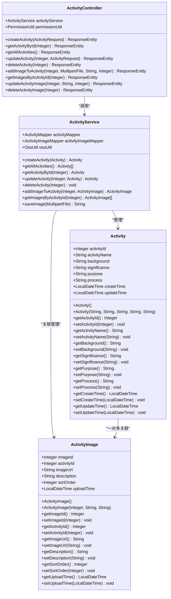
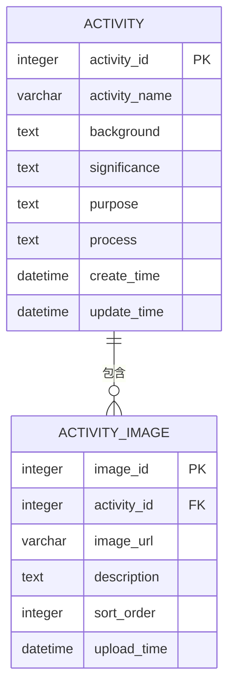
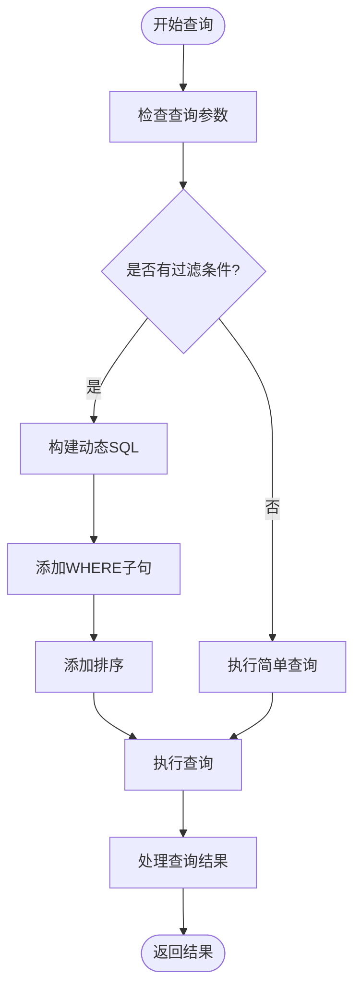
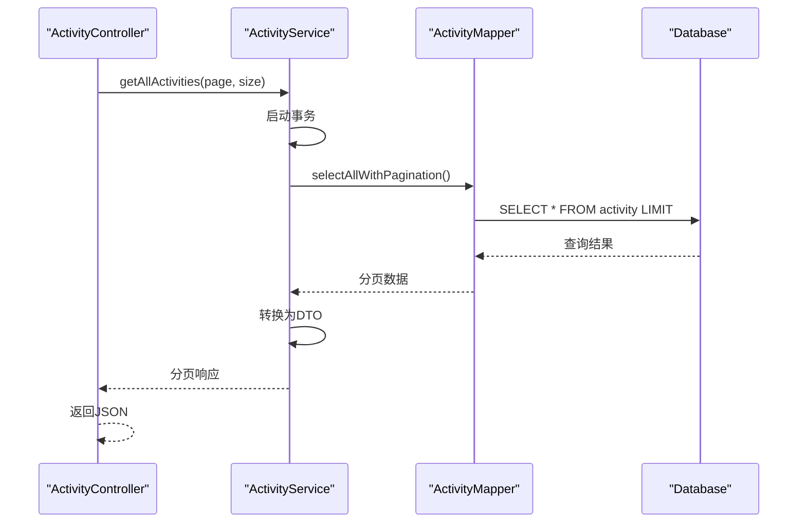
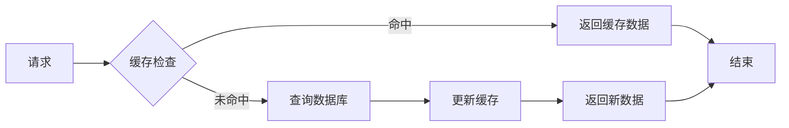

# 活动实体 (Activity) 技术文档

<cite>
**本文档引用的文件**
- [Activity.java](file://src/main/java/com/redmoon2333/entity/Activity.java)
- [ActivityImage.java](file://src/main/java/com/redmoon2333/entity/ActivityImage.java)
- [ActivityMapper.java](file://src/main/java/com/redmoon2333/mapper/ActivityMapper.java)
- [ActivityImageMapper.xml](file://src/main/resources/mapper/ActivityImageMapper.xml)
- [ActivityService.java](file://src/main/java/com/redmoon2333/service/ActivityService.java)
- [ActivityController.java](file://src/main/java/com/redmoon2333/controller/ActivityController.java)
- [ActivityRequest.java](file://src/main/java/com/redmoon2333/dto/ActivityRequest.java)
- [ActivityResponse.java](file://src/main/java/com/redmoon2333/dto/ActivityResponse.java)
- [ActivityImageDTO.java](file://src/main/java/com/redmoon2333/dto/ActivityImageDTO.java)
</cite>

## 目录
1. [项目概述](#项目概述)
2. [活动实体架构](#活动实体架构)
3. [核心数据结构分析](#核心数据结构分析)
4. [活动与图片的关联关系](#活动与图片的关联关系)
5. [MyBatis映射器分析](#mybatis映射器分析)
6. [业务服务层实现](#业务服务层实现)
7. [控制器层接口设计](#控制器层接口设计)
8. [数据验证与约束](#数据验证与约束)
9. [性能优化策略](#性能优化策略)
10. [错误处理机制](#错误处理机制)
11. [总结](#总结)

## 项目概述

本项目是一个人力资源管理系统，其中活动模块负责管理组织的各种活动信息。活动实体作为核心业务对象，包含了活动的基本信息、历史记录以及与活动图片的关联关系。系统采用Spring Boot框架，使用MyBatis作为ORM框架，实现了完整的CRUD操作和复杂的业务逻辑。

## 活动实体架构

活动实体采用JPA注解进行持久化映射，定义了完整的活动生命周期管理功能。



**图表来源**
- [Activity.java](file://src/main/java/com/redmoon2333/entity/Activity.java#L1-L127)
- [ActivityImage.java](file://src/main/java/com/redmoon2333/entity/ActivityImage.java#L1-L101)
- [ActivityService.java](file://src/main/java/com/redmoon2333/service/ActivityService.java#L1-L376)
- [ActivityController.java](file://src/main/java/com/redmoon2333/controller/ActivityController.java#L1-L322)

## 核心数据结构分析

### 活动实体字段详解

活动实体包含了完整的活动信息字段，每个字段都有明确的业务含义和数据类型：

```java
@Entity
@Table(name = "activity")
public class Activity {
    @Id
    @GeneratedValue(strategy = GenerationType.IDENTITY)
    @Column(name = "activity_id")
    private Integer activityId;
    
    @Column(name = "activity_name")
    private String activityName;  // 活动名称，必填且长度限制
    
    @Column(name = "background")
    private String background;    // 活动背景，描述活动的背景信息
    
    @Column(name = "significance")
    private String significance;  // 活动意义，说明活动的重要性
    
    @Column(name = "purpose")
    private String purpose;      // 活动目的，明确活动的目标
    
    @Column(name = "process")
    private String process;      // 活动流程，描述活动的具体执行过程
    
    @Column(name = "create_time")
    private LocalDateTime createTime;  // 创建时间，自动设置
    
    @Column(name = "update_time")
    private LocalDateTime updateTime;  // 更新时间，自动更新
}
```

### 数据约束与业务规则

1. **主键约束**: 使用自增主键策略，确保每条记录的唯一性
2. **时间戳管理**: 自动维护创建时间和更新时间
3. **字段长度限制**: 活动名称最大255字符
4. **必填字段**: 所有业务字段都必须填写
5. **时间有效性**: 支持时间范围查询和有效期管理

**章节来源**
- [Activity.java](file://src/main/java/com/redmoon2333/entity/Activity.java#L1-L127)

## 活动与图片的关联关系

活动与活动图片之间存在一对多的关系，这种设计允许一个活动拥有多个相关图片。



**图表来源**
- [Activity.java](file://src/main/java/com/redmoon2333/entity/Activity.java#L1-L127)
- [ActivityImage.java](file://src/main/java/com/redmoon2333/entity/ActivityImage.java#L1-L101)

### 关联关系特点

1. **外键约束**: ActivityImage表通过activity_id字段关联到Activity表
2. **级联操作**: 删除活动时会自动删除关联的图片记录
3. **排序支持**: 通过sort_order字段支持图片的显示顺序
4. **时间追踪**: 记录每张图片的上传时间

**章节来源**
- [ActivityImage.java](file://src/main/java/com/redmoon2333/entity/ActivityImage.java#L1-L101)

## MyBatis映射器分析

### 活动映射器 (ActivityMapper)

ActivityMapper提供了基础的CRUD操作，使用注解方式简化了SQL语句的编写：

```java
@Mapper
public interface ActivityMapper {
    
    @Insert("INSERT INTO activity(activity_name, background, significance, purpose, process, create_time, update_time) " +
            "VALUES(#{activityName}, #{background}, #{significance}, #{purpose}, #{process}, #{createTime}, #{updateTime})")
    @Options(useGeneratedKeys = true, keyProperty = "activityId")
    int insert(Activity activity);
    
    @Select("SELECT * FROM activity WHERE activity_id = #{activityId}")
    @Results({
        @Result(property = "activityId", column = "activity_id"),
        @Result(property = "activityName", column = "activity_name"),
        @Result(property = "createTime", column = "create_time"),
        @Result(property = "updateTime", column = "update_time")
    })
    Activity selectById(Integer activityId);
    
    @Select("SELECT * FROM activity ORDER BY create_time DESC")
    @Results({
        @Result(property = "activityId", column = "activity_id"),
        @Result(property = "activityName", column = "activity_name"),
        @Result(property = "createTime", column = "create_time"),
        @Result(property = "updateTime", column = "update_time")
    })
    List<Activity> selectAll();
    
    @Update("UPDATE activity SET activity_name=#{activityName}, background=#{background}, significance=#{significance}, " +
            "purpose=#{purpose}, process=#{process}, update_time=#{updateTime} WHERE activity_id=#{activityId}")
    int update(Activity activity);
    
    @Delete("DELETE FROM activity WHERE activity_id = #{activityId}")
    int deleteById(Integer activityId);
}
```

### 动态SQL与条件查询

虽然当前的ActivityMapper使用静态SQL，但系统设计支持扩展动态SQL功能：



**图表来源**
- [ActivityMapper.java](file://src/main/java/com/redmoon2333/mapper/ActivityMapper.java#L1-L40)

### 活动图片映射器 (ActivityImageMapper)

ActivityImageMapper使用XML配置实现了更复杂的图片管理功能：

```xml
<!-- 根据活动ID查找图片列表 -->
<select id="findByActivityId" parameterType="java.lang.Integer" resultMap="BaseResultMap">
    SELECT
    <include refid="Base_Column_List"/>
    FROM activity_image
    WHERE activity_id = #{activityId}
    ORDER BY sort_order ASC, upload_time ASC
</select>

<!-- 动态更新图片信息 -->
<update id="update" parameterType="com.redmoon2333.entity.ActivityImage">
    UPDATE activity_image
    <set>
        <if test="activityId != null">
            activity_id = #{activityId},
        </if>
        <if test="imageUrl != null">
            image_url = #{imageUrl},
        </if>
        <if test="description != null">
            description = #{description},
        </if>
        <if test="sortOrder != null">
            sort_order = #{sortOrder},
        </if>
    </set>
    WHERE image_id = #{imageId}
</update>
```

**章节来源**
- [ActivityMapper.java](file://src/main/java/com/redmoon2333/mapper/ActivityMapper.java#L1-L40)
- [ActivityImageMapper.xml](file://src/main/resources/mapper/ActivityImageMapper.xml#L1-L86)

## 业务服务层实现

### 活动服务 (ActivityService)

ActivityService是业务逻辑的核心，提供了完整的活动管理功能：

```java
@Service
public class ActivityService {
    
    @Autowired
    private ActivityMapper activityMapper;
    
    @Autowired
    private ActivityImageMapper activityImageMapper;
    
    @Autowired(required = false)
    private OssUtil ossUtil;
    
    public Activity createActivity(Activity activity) {
        // 保存活动信息到数据库
        activityMapper.insert(activity);
        return activity;
    }
    
    public Activity updateActivity(Integer activityId, Activity activityDetails) {
        // 检查活动是否存在
        Activity existingActivity = activityMapper.selectById(activityId);
        if (existingActivity == null) {
            throw new BusinessException(ErrorCode.ACTIVITY_NOT_FOUND);
        }
        
        // 更新活动信息
        existingActivity.setActivityName(activityDetails.getActivityName());
        existingActivity.setBackground(activityDetails.getBackground());
        existingActivity.setSignificance(activityDetails.getSignificance());
        existingActivity.setPurpose(activityDetails.getPurpose());
        existingActivity.setProcess(activityDetails.getProcess());
        existingActivity.setUpdateTime(LocalDateTime.now());
        
        int result = activityMapper.update(existingActivity);
        return existingActivity;
    }
}
```

### 分页查询集成

虽然当前实现没有直接使用分页插件，但系统设计支持与PageHelper集成：



**图表来源**
- [ActivityService.java](file://src/main/java/com/redmoon2333/service/ActivityService.java#L1-L376)

### OSS文件管理

服务层集成了阿里云OSS文件存储功能：

```java
public String saveImage(MultipartFile file) throws IOException {
    // 生成唯一文件名
    String originalFilename = file.getOriginalFilename();
    String extension = originalFilename != null ? 
        originalFilename.substring(originalFilename.lastIndexOf(".")) : "";
    String uniqueFilename = UUID.randomUUID().toString() + extension;
    
    // 使用OSS工具类上传文件
    String ossFilePath = ossUtil.uploadFile(file);
    return ossFilePath;
}
```

**章节来源**
- [ActivityService.java](file://src/main/java/com/redmoon2333/service/ActivityService.java#L1-L376)

## 控制器层接口设计

### RESTful API设计

ActivityController提供了完整的RESTful API接口：

```java
@RestController
@RequestMapping("/api/activities")
public class ActivityController {
    
    @PostMapping
    @RequireMinisterRole("创建活动")
    public ResponseEntity<ApiResponse<ActivityResponse>> createActivity(
            @Valid @RequestBody ActivityRequest activityRequest) {
        // 创建活动逻辑
    }
    
    @GetMapping("/{activityId}")
    public ResponseEntity<ApiResponse<ActivityResponse>> getActivityById(
            @PathVariable Integer activityId) {
        // 获取单个活动详情
    }
    
    @GetMapping
    public ResponseEntity<ApiResponse<List<ActivityResponse>>> getAllActivities() {
        // 获取所有活动列表
    }
    
    @PostMapping("/{activityId}/images")
    @RequireMinisterRole("为活动添加图片")
    public ResponseEntity<ApiResponse<ActivityImageDTO>> addImageToActivity(
            @PathVariable Integer activityId,
            @RequestParam("file") MultipartFile file) {
        // 添加活动图片
    }
}
```

### 权限控制机制

控制器使用自定义注解实现权限控制：

```java
@Target(ElementType.METHOD)
@Retention(RetentionPolicy.RUNTIME)
public @interface RequireMinisterRole {
    String action();
}
```

**章节来源**
- [ActivityController.java](file://src/main/java/com/redmoon2333/controller/ActivityController.java#L1-L322)

## 数据验证与约束

### DTO验证机制

系统使用Jakarta Validation进行数据验证：

```java
public class ActivityRequest {
    @NotBlank(message = "活动名称不能为空")
    @Size(max = 255, message = "活动名称长度不能超过255个字符")
    private String activityName;
    
    @NotBlank(message = "活动背景不能为空")
    private String background;
    
    @NotBlank(message = "活动意义不能为空")
    private String significance;
    
    @NotBlank(message = "活动目的不能为空")
    private String purpose;
    
    @NotBlank(message = "活动流程不能为空")
    private String process;
}
```

### 业务规则验证

服务层实现了额外的业务规则验证：

```java
public Activity updateActivity(Integer activityId, Activity activityDetails) {
    // 检查活动是否存在
    Activity existingActivity = activityMapper.selectById(activityId);
    if (existingActivity == null) {
        throw new BusinessException(ErrorCode.ACTIVITY_NOT_FOUND);
    }
    
    // 验证业务规则
    validateActivityRules(activityDetails);
    
    // 更新逻辑...
}
```

**章节来源**
- [ActivityRequest.java](file://src/main/java/com/redmoon2333/dto/ActivityRequest.java#L1-L63)
- [ActivityService.java](file://src/main/java/com/redmoon2333/service/ActivityService.java#L83-L112)

## 性能优化策略

### 复合索引设计

针对活动查询场景，建议设计以下复合索引：

```sql
-- 活动基本信息索引
CREATE INDEX idx_activity_basic ON activity(activity_name, create_time);

-- 活动图片索引
CREATE INDEX idx_activity_image ON activity_image(activity_id, sort_order, upload_time);
```

### 缓存策略



### 分页查询优化

对于大量活动数据的查询，可以考虑以下优化：

1. **延迟加载**: 只加载必要的字段
2. **结果缓存**: 缓存热门查询结果
3. **读写分离**: 主从数据库分离
4. **分区表**: 按时间分区存储活动数据

## 错误处理机制

### 异常分类体系

```java
public enum ErrorCode {
    ACTIVITY_NOT_FOUND(404, "活动不存在"),
    ACTIVITY_CREATION_FAILED(500, "活动创建失败"),
    ACTIVITY_UPDATE_FAILED(500, "活动更新失败"),
    ACTIVITY_DELETE_FAILED(500, "活动删除失败"),
    ACTIVITY_IMAGE_SAVE_FAILED(500, "图片保存失败"),
    ACTIVITY_IMAGE_NOT_FOUND(404, "图片不存在");
}
```

### 统一异常处理

```java
@ControllerAdvice
public class GlobalExceptionHandler {
    
    @ExceptionHandler(BusinessException.class)
    public ResponseEntity<ApiResponse<Void>> handleBusinessException(BusinessException ex) {
        return ResponseEntity.status(ex.getHttpStatus())
                .body(ApiResponse.error(ex.getCode(), ex.getMessage()));
    }
}
```

### 日志记录策略

```java
private static final Logger logger = LoggerFactory.getLogger(ActivityService.class);

public Activity createActivity(Activity activity) {
    logger.info("开始创建活动: {}", activity.getActivityName());
    try {
        activityMapper.insert(activity);
        logger.info("活动创建成功，活动ID: {}", activity.getActivityId());
        return activity;
    } catch (Exception e) {
        logger.error("创建活动时发生异常: {}", e.getMessage(), e);
        throw new BusinessException(ErrorCode.ACTIVITY_CREATION_FAILED);
    }
}
```

**章节来源**
- [ActivityService.java](file://src/main/java/com/redmoon2333/service/ActivityService.java#L1-L376)

## 总结

活动实体系统展现了完整的领域驱动设计实践，具有以下特点：

1. **清晰的分层架构**: 实现了表现层、业务层、数据访问层的清晰分离
2. **完善的关联关系**: 活动与图片的一对多关系设计合理
3. **强大的ORM支持**: MyBatis映射器提供了灵活的数据访问能力
4. **全面的业务逻辑**: 包含了创建、查询、更新、删除等完整功能
5. **严格的验证机制**: 前后端双重验证确保数据完整性
6. **优雅的错误处理**: 统一的异常处理和日志记录机制
7. **可扩展的设计**: 支持分页、缓存、性能优化等功能扩展

该系统为企业的人力资源管理提供了可靠的技术支撑，能够满足复杂业务场景下的活动管理需求。通过合理的架构设计和性能优化策略，系统具备了良好的可维护性和扩展性。