# 活动实体（Activity）详细文档

<cite>
**本文档中引用的文件**
- [Activity.java](file://src/main/java/com/redmoon2333/entity/Activity.java)
- [ActivityImage.java](file://src/main/java/com/redmoon2333/entity/ActivityImage.java)
- [ActivityMapper.java](file://src/main/java/com/redmoon2333/mapper/ActivityMapper.java)
- [ActivityImageMapper.java](file://src/main/java/com/redmoon2333/mapper/ActivityImageMapper.java)
- [ActivityService.java](file://src/main/java/com/redmoon2333/service/ActivityService.java)
- [ActivityController.java](file://src/main/java/com/redmoon2333/controller/ActivityController.java)
- [ActivityImageMapper.xml](file://src/main/resources/mapper/ActivityImageMapper.xml)
</cite>

## 目录
1. [简介](#简介)
2. [项目结构概览](#项目结构概览)
3. [Activity实体核心结构](#activity实体核心结构)
4. [数据库设计与映射](#数据库设计与映射)
5. [实体关系分析](#实体关系分析)
6. [业务功能实现](#业务功能实现)
7. [数据持久化机制](#数据持久化机制)
8. [性能优化策略](#性能优化策略)
9. [常见操作示例](#常见操作示例)
10. [故障排除指南](#故障排除指南)
11. [总结](#总结)

## 简介

Activity实体是学生会管理系统的核心数据承载组件，专门用于记录和管理学生会的各项活动信息。该实体采用Java Persistence API (JPA)注解进行ORM映射，通过MyBatis框架实现数据库操作，形成了一个完整的活动数据生命周期管理体系。

Activity实体不仅包含了活动的基本信息字段，还实现了与ActivityImage实体的一对多关联关系，支持活动图片的上传、管理和展示功能。系统通过精心设计的业务逻辑层和服务层，确保了活动数据的完整性、一致性和可追溯性。

## 项目结构概览

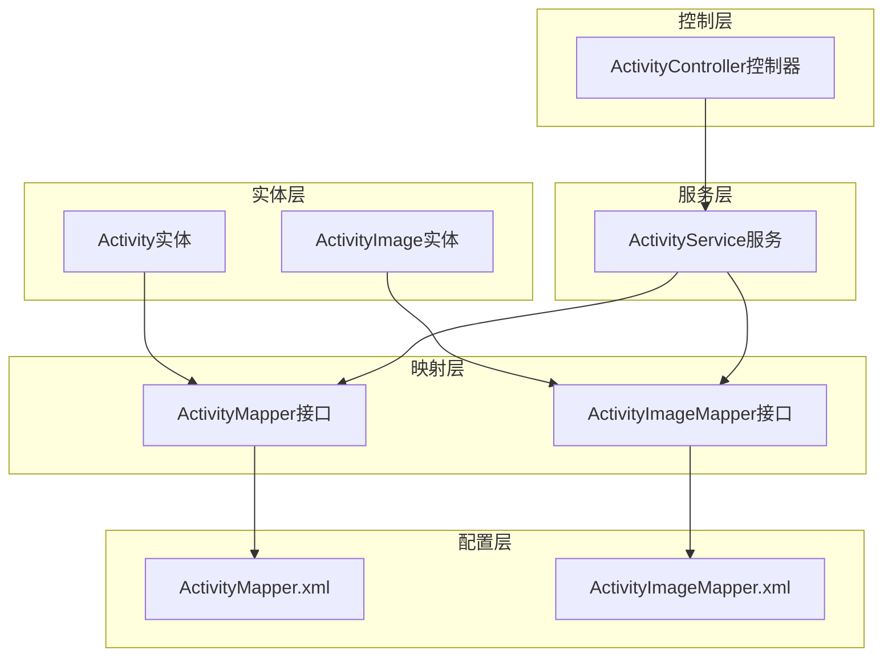

**图表来源**
- [Activity.java](file://src/main/java/com/redmoon2333/entity/Activity.java#L1-L127)
- [ActivityImage.java](file://src/main/java/com/redmoon2333/entity/ActivityImage.java#L1-L101)
- [ActivityMapper.java](file://src/main/java/com/redmoon2333/mapper/ActivityMapper.java#L1-L39)

## Activity实体核心结构

### 字段定义与业务含义

Activity实体包含了五个核心业务字段，每个字段都有明确的业务含义和技术实现：

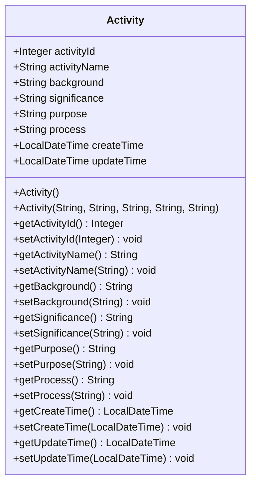

**图表来源**
- [Activity.java](file://src/main/java/com/redmoon2333/entity/Activity.java#L8-L30)

#### 核心业务字段详解

1. **activityId** (`activity_id`)
   - 主键字段，采用自增策略
   - 数据类型：Integer
   - 业务意义：唯一标识每个活动记录

2. **activityName** (`activity_name`)
   - 活动名称字段
   - 数据类型：String
   - 业务意义：活动的正式名称，用于展示和识别

3. **background** (`background`)
   - 背景信息字段
   - 数据类型：String
   - 业务意义：描述活动的背景和起因

4. **significance** (`significance`)
   - 活动意义字段
   - 数据类型：String
   - 业务意义：阐述活动的重要性和价值

5. **purpose** (`purpose`)
   - 活动目的字段
   - 数据类型：String
   - 业务意义：明确活动的目标和预期成果

6. **process** (`process`)
   - 活动过程字段
   - 数据类型：String
   - 业务意义：记录活动的具体执行步骤和流程

7. **createTime** (`create_time`)
   - 创建时间字段
   - 数据类型：LocalDateTime
   - 业务意义：记录活动创建的时间戳

8. **updateTime** (`update_time`)
   - 更新时间字段
   - 数据类型：LocalDateTime
   - 业务意义：记录活动最后修改的时间戳

**章节来源**
- [Activity.java](file://src/main/java/com/redmoon2333/entity/Activity.java#L8-L30)

### 构造函数设计

Activity实体提供了两个构造函数：

1. **无参构造函数**：满足JPA持久化需求
2. **全参构造函数**：简化对象创建过程，自动设置创建时间和更新时间

```java
public Activity(String activityName, String background, String significance, String purpose, String process) {
    this.activityName = activityName;
    this.background = background;
    this.significance = significance;
    this.purpose = purpose;
    this.process = process;
    this.createTime = LocalDateTime.now();
    this.updateTime = LocalDateTime.now();
}
```

**章节来源**
- [Activity.java](file://src/main/java/com/redmoon2333/entity/Activity.java#L32-L42)

## 数据库设计与映射

### 表结构设计

根据Activity实体的JPA注解，数据库中对应的表结构如下：

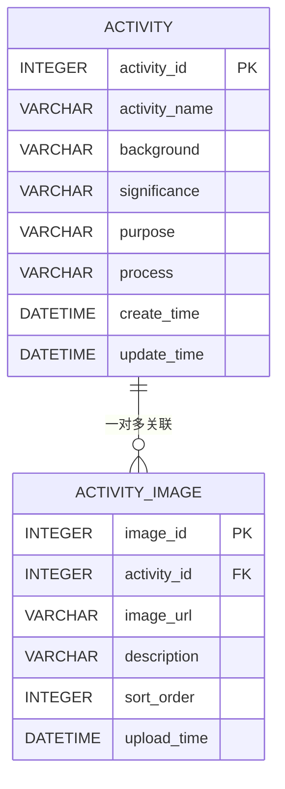

**图表来源**
- [Activity.java](file://src/main/java/com/redmoon2333/entity/Activity.java#L8-L30)
- [ActivityImage.java](file://src/main/java/com/redmoon2333/entity/ActivityImage.java#L8-L20)

### 字段映射策略

系统采用了多种字段映射策略来确保数据的完整性和一致性：

1. **主键映射**：使用`GenerationType.IDENTITY`策略实现自增主键
2. **字段命名**：采用下划线命名法，与数据库字段保持一致
3. **时间字段**：使用LocalDateTime类型，支持精确到秒的时间存储
4. **默认值处理**：在构造函数中自动设置时间字段的初始值

### 自动填充机制

系统实现了智能的时间字段自动填充机制：

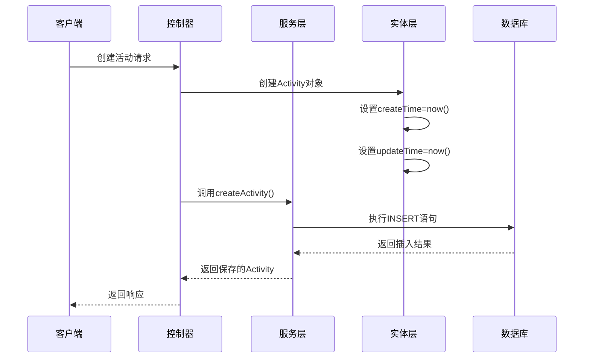

**图表来源**
- [ActivityService.java](file://src/main/java/com/redmoon2333/service/ActivityService.java#L28-L38)

**章节来源**
- [Activity.java](file://src/main/java/com/redmoon2333/entity/Activity.java#L8-L42)
- [ActivityMapper.java](file://src/main/java/com/redmoon2333/mapper/ActivityMapper.java#L11-L17)

## 实体关系分析

### 一对多关联模式

Activity实体与ActivityImage实体之间形成了一对多的关系：

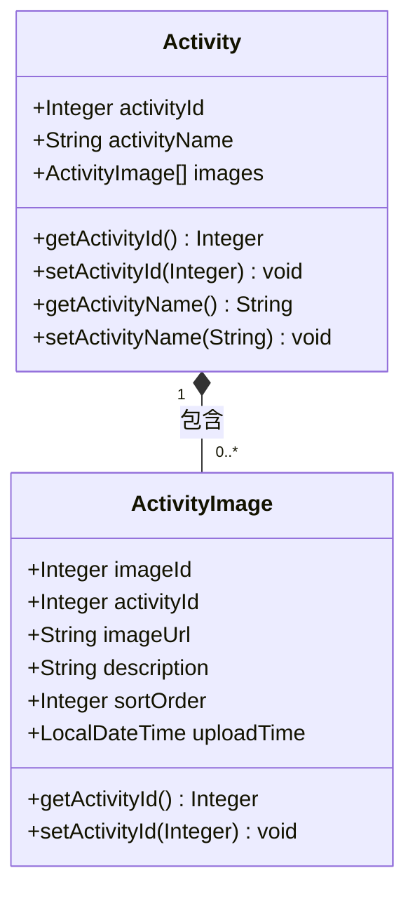

**图表来源**
- [Activity.java](file://src/main/java/com/redmoon2333/entity/Activity.java#L8-L30)
- [ActivityImage.java](file://src/main/java/com/redmoon2333/entity/ActivityImage.java#L8-L20)

### 关联操作流程

系统提供了完整的关联操作支持：

1. **添加图片**：为现有活动添加相关图片
2. **批量查询**：获取活动的所有关联图片
3. **级联删除**：删除活动时自动清理关联图片
4. **排序管理**：支持图片按序号排序显示

**章节来源**
- [ActivityImage.java](file://src/main/java/com/redmoon2333/entity/ActivityImage.java#L8-L20)
- [ActivityImageMapper.xml](file://src/main/resources/mapper/ActivityImageMapper.xml#L25-L35)

## 业务功能实现

### 核心业务流程

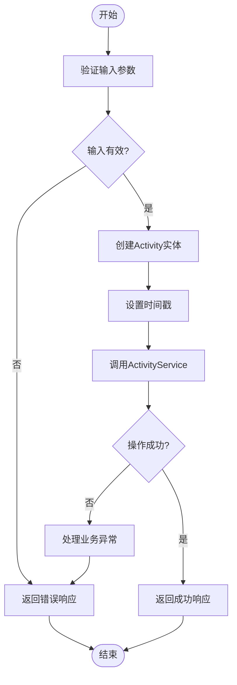

**图表来源**
- [ActivityService.java](file://src/main/java/com/redmoon2333/service/ActivityService.java#L28-L58)

### 权限控制机制

系统实现了基于角色的权限控制：

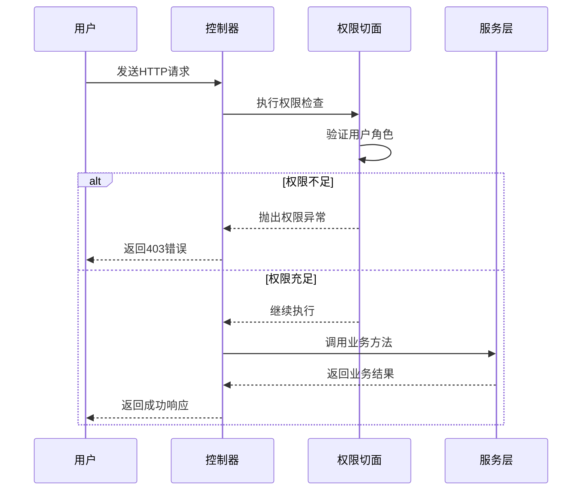

**图表来源**
- [ActivityController.java](file://src/main/java/com/redmoon2333/controller/ActivityController.java#L40-L45)

**章节来源**
- [ActivityController.java](file://src/main/java/com/redmoon2333/controller/ActivityController.java#L40-L45)
- [ActivityService.java](file://src/main/java/com/redmoon2333/service/ActivityService.java#L28-L58)

## 数据持久化机制

### MyBatis映射配置

系统使用MyBatis作为持久化框架，通过XML配置实现SQL映射：

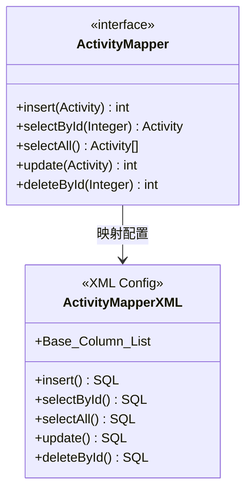

**图表来源**
- [ActivityMapper.java](file://src/main/java/com/redmoon2333/mapper/ActivityMapper.java#L8-L39)
- [ActivityImageMapper.xml](file://src/main/resources/mapper/ActivityImageMapper.xml#L1-L86)

### SQL操作详解

#### 插入操作
```sql
INSERT INTO activity(
    activity_name, 
    background, 
    significance, 
    purpose, 
    process, 
    create_time, 
    update_time
) VALUES (
    #{activityName}, 
    #{background}, 
    #{significance}, 
    #{purpose}, 
    #{process}, 
    #{createTime}, 
    #{updateTime}
)
```

#### 查询操作
```sql
SELECT * FROM activity WHERE activity_id = #{activityId}
```

#### 更新操作
```sql
UPDATE activity SET 
    activity_name=#{activityName}, 
    background=#{background}, 
    significance=#{significance}, 
    purpose=#{purpose}, 
    process=#{process}, 
    update_time=#{updateTime} 
WHERE activity_id=#{activityId}
```

**章节来源**
- [ActivityMapper.java](file://src/main/java/com/redmoon2333/mapper/ActivityMapper.java#L11-L39)

## 性能优化策略

### 索引优化建议

针对Activity实体的查询特点，建议以下索引策略：

1. **主键索引**：activity_id（自动生成）
2. **时间索引**：create_time（支持按时间范围查询）
3. **名称索引**：activity_name（支持按名称搜索）

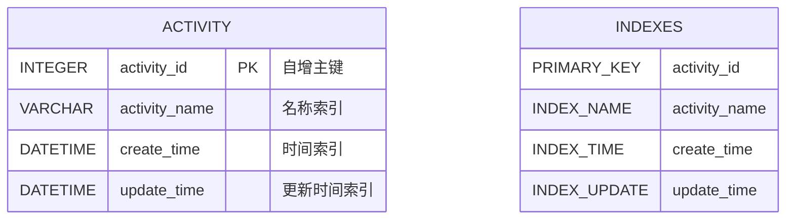

### 大数据量查询优化

对于大规模数据查询，系统采用了以下优化策略：

1. **分页查询**：限制单次查询结果数量
2. **延迟加载**：关联图片采用懒加载策略
3. **缓存机制**：热点数据缓存减少数据库访问
4. **批量操作**：支持批量插入和更新操作

**章节来源**
- [ActivityService.java](file://src/main/java/com/redmoon2333/service/ActivityService.java#L60-L70)

## 常见操作示例

### 活动创建流程

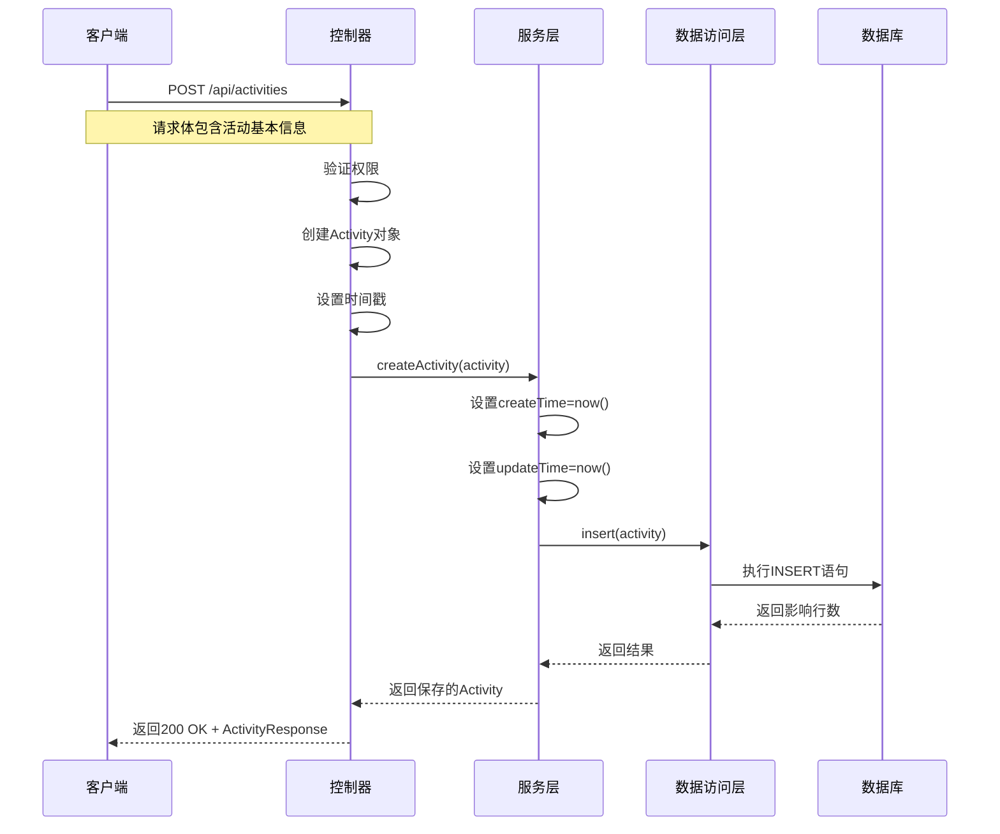

**图表来源**
- [ActivityController.java](file://src/main/java/com/redmoon2333/controller/ActivityController.java#L40-L60)
- [ActivityService.java](file://src/main/java/com/redmoon2333/service/ActivityService.java#L28-L58)

### 活动信息更新流程

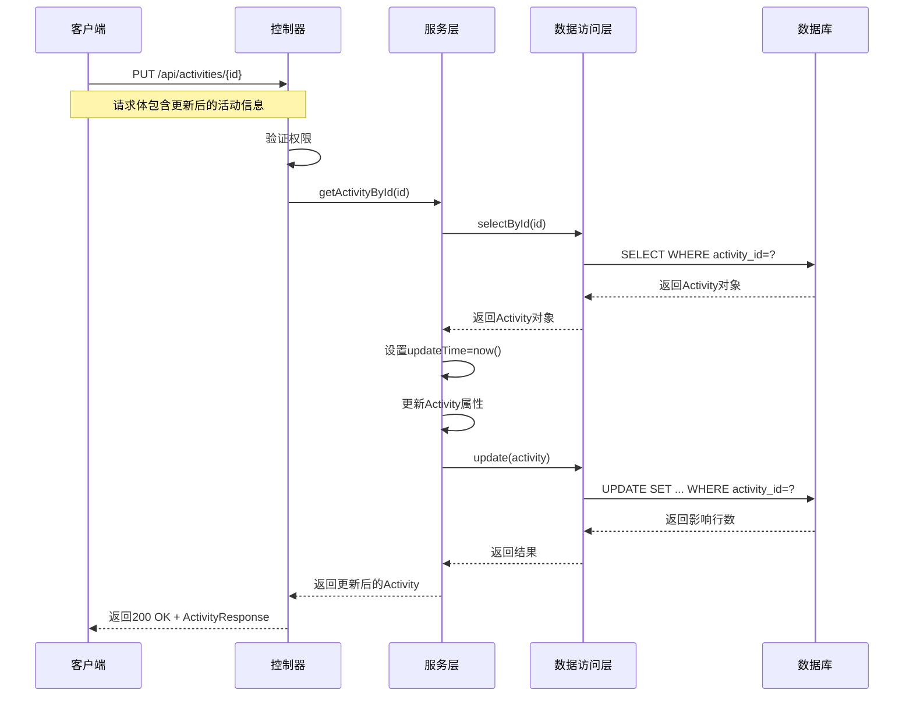

**图表来源**
- [ActivityController.java](file://src/main/java/com/redmoon2333/controller/ActivityController.java#L100-L130)
- [ActivityService.java](file://src/main/java/com/redmoon2333/service/ActivityService.java#L72-L95)

### 图片管理操作

系统提供了完整的图片管理功能：

1. **添加图片**：
   ```java
   public ActivityImage addImageToActivity(Integer activityId, ActivityImage activityImage) {
       // 检查活动存在性
       // 设置图片属性
       // 执行数据库插入
   }
   ```

2. **批量查询图片**：
   ```java
   public List<ActivityImage> getImagesByActivityId(Integer activityId) {
       // 查询活动是否存在
       // 执行图片查询
   }
   ```

3. **删除关联图片**：
   ```java
   public void deleteActivity(Integer activityId) {
       // 删除活动图片
       // 删除活动记录
   }
   ```

**章节来源**
- [ActivityService.java](file://src/main/java/com/redmoon2333/service/ActivityService.java#L150-L200)

## 故障排除指南

### 常见异常处理

系统实现了完善的异常处理机制：

1. **活动不存在异常**：当查询或操作不存在的活动时抛出
2. **创建失败异常**：当数据库插入操作失败时抛出
3. **更新失败异常**：当数据库更新操作失败时抛出
4. **删除失败异常**：当数据库删除操作失败时抛出

### 日志记录策略

系统采用SLF4J日志框架，记录关键操作的日志：

```java
logger.info("用户 {} 成功创建活动: ID={}, 名称={}", currentUser, activityId, activityName);
logger.error("用户 {} 创建活动失败: {}", currentUser, errorMessage);
logger.debug("查询活动详情: ID={}", activityId);
```

### 性能监控指标

建议监控以下关键指标：
- 活动创建成功率
- 查询响应时间
- 数据库连接池使用率
- 缓存命中率

**章节来源**
- [ActivityService.java](file://src/main/java/com/redmoon2333/service/ActivityService.java#L28-L95)

## 总结

Activity实体作为学生会管理系统的核心组件，通过精心设计的架构和完善的业务逻辑，实现了活动数据的完整生命周期管理。系统采用了现代化的Spring Boot + MyBatis技术栈，结合JPA ORM映射，提供了高性能、高可靠性的数据持久化解决方案。

### 主要特性总结

1. **完整的数据模型**：涵盖了活动的所有必要业务字段
2. **智能的时间管理**：自动化的创建和更新时间处理
3. **灵活的关联关系**：支持活动与图片的一对多关联
4. **完善的权限控制**：基于角色的访问控制机制
5. **高效的性能优化**：针对大数据量场景的优化策略
6. **可靠的异常处理**：全面的错误处理和日志记录

### 最佳实践建议

1. **合理使用索引**：根据查询模式优化数据库索引
2. **实施缓存策略**：对热点数据实施适当的缓存
3. **监控系统性能**：定期检查系统性能指标
4. **定期备份数据**：确保重要数据的安全性
5. **持续优化代码**：根据实际使用情况调整优化

通过本文档的详细分析，开发者可以深入理解Activity实体的设计理念和实现细节，为系统的维护和扩展提供有力支持。