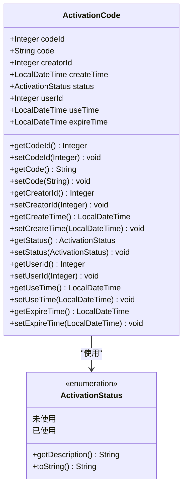
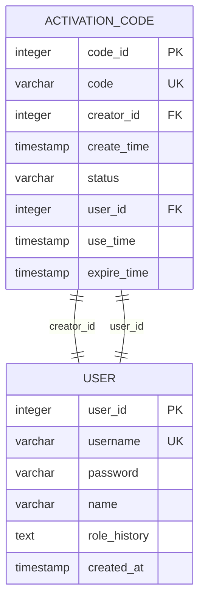
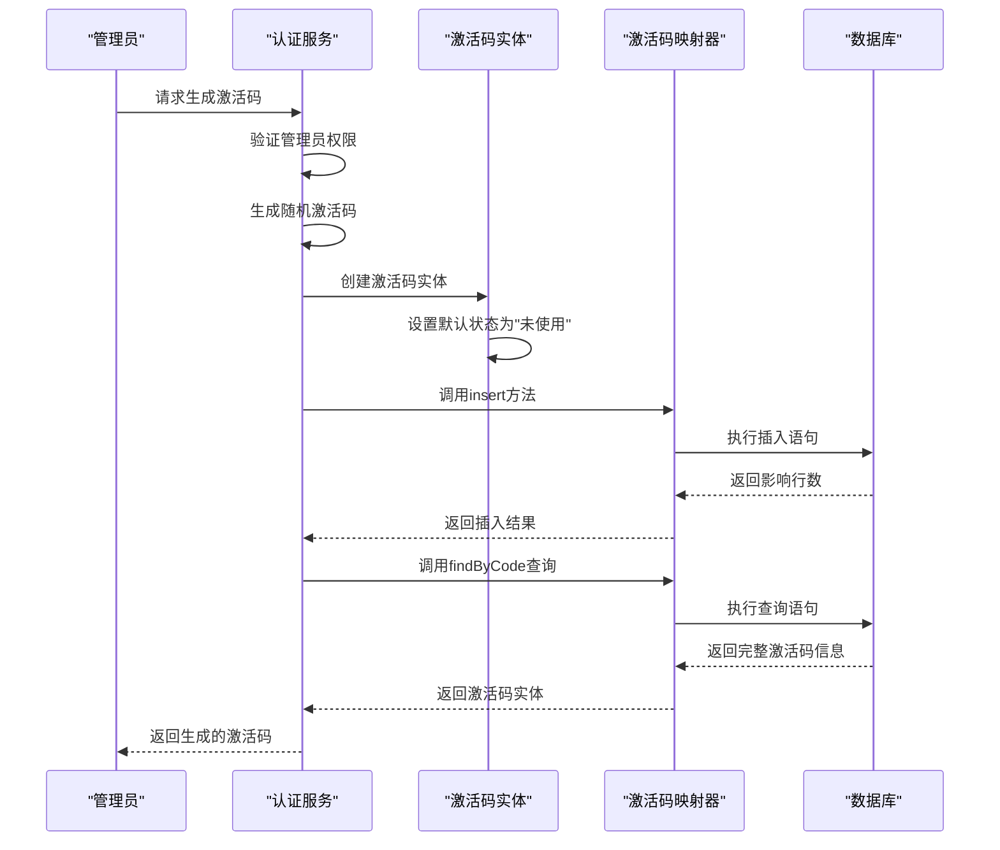
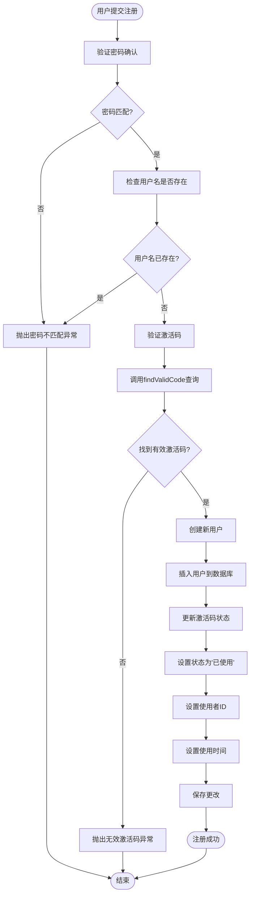
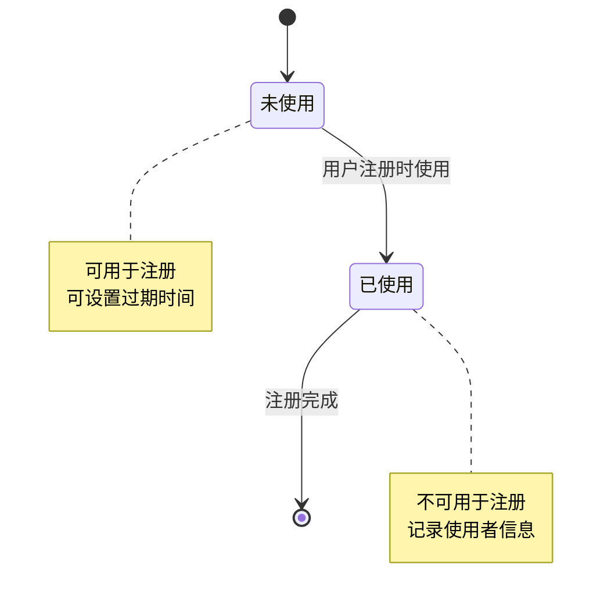

# 激活码实体 (ActivationCode) 技术文档

<cite>
**本文档引用的文件**
- [ActivationCode.java](file://src/main/java/com/redmoon2333/entity/ActivationCode.java)
- [ActivationStatus.java](file://src/main/java/com/redmoon2333/enums/ActivationStatus.java)
- [ActivationCodeMapper.java](file://src/main/java/com/redmoon2333/mapper/ActivationCodeMapper.java)
- [ActivationCodeMapper.xml](file://src/main/resources/mapper/ActivationCodeMapper.xml)
- [AuthService.java](file://src/main/java/com/redmoon2333/service/AuthService.java)
</cite>

## 目录
1. [简介](#简介)
2. [实体结构分析](#实体结构分析)
3. [数据库设计](#数据库设计)
4. [MyBatis映射配置](#mybatis映射配置)
5. [业务逻辑实现](#业务逻辑实现)
6. [安全控制机制](#安全控制机制)
7. [性能优化建议](#性能优化建议)
8. [故障排除指南](#故障排除指南)
9. [总结](#总结)

## 简介

ActivationCode实体是人力资源管理系统中实现邀请制注册的核心组件。它负责管理激活码的生命周期，包括生成、验证、状态跟踪和过期处理。该实体通过严格的数据库约束和业务逻辑确保系统安全，防止未授权用户的注册行为。

激活码机制为系统提供了分层访问控制，只有持有有效激活码的用户才能完成注册流程。这种设计特别适用于需要严格权限管理的企业级应用，如人力资源管理系统。

## 实体结构分析

### 字段定义与用途

ActivationCode实体包含以下核心字段：



**图表来源**
- [ActivationCode.java](file://src/main/java/com/redmoon2333/entity/ActivationCode.java#L10-L40)
- [ActivationStatus.java](file://src/main/java/com/redmoon2333/enums/ActivationStatus.java#L6-L12)

### 字段详细说明

| 字段名 | 类型 | 描述 | 约束 |
|--------|------|------|------|
| codeId | Integer | 主键ID，自增 | PRIMARY KEY, AUTO_INCREMENT |
| code | String | 激活码字符串，长度16位 | UNIQUE, NOT NULL |
| creatorId | Integer | 创建者用户ID | FOREIGN KEY to user.user_id |
| createTime | LocalDateTime | 创建时间 | DEFAULT CURRENT_TIMESTAMP |
| status | ActivationStatus | 激活码状态 | ENUM('未使用', '已使用') |
| userId | Integer | 使用者用户ID | FOREIGN KEY to user.user_id |
| useTime | LocalDateTime | 使用时间 | NULLABLE |
| expireTime | LocalDateTime | 过期时间 | NOT NULL |

**章节来源**
- [ActivationCode.java](file://src/main/java/com/redmoon2333/entity/ActivationCode.java#L10-L40)

## 数据库设计

### 表结构设计

激活码表的设计遵循数据库规范化原则，同时考虑查询性能和数据完整性：



**图表来源**
- [ActivationCode.java](file://src/main/java/com/redmoon2333/entity/ActivationCode.java#L7-L8)
- [ActivationCodeMapper.xml](file://src/main/resources/mapper/ActivationCodeMapper.xml#L8-L15)

### 数据库约束

1. **主键约束**: code_id作为主键，确保每条记录的唯一性
2. **唯一约束**: code字段设置唯一索引，防止重复激活码
3. **外键约束**: creator_id和user_id分别关联到用户表
4. **非空约束**: code、creator_id、expire_time字段不能为空
5. **默认值**: status字段默认为"未使用"

**章节来源**
- [ActivationCode.java](file://src/main/java/com/redmoon2333/entity/ActivationCode.java#L10-L40)

## MyBatis映射配置

### 结果映射配置

MyBatis映射文件定义了Java对象与数据库表之间的映射关系：

```xml
<resultMap id="BaseResultMap" type="com.redmoon2333.entity.ActivationCode">
    <id column="code_id" property="codeId" jdbcType="INTEGER"/>
    <result column="code" property="code" jdbcType="VARCHAR"/>
    <result column="creator_id" property="creatorId" jdbcType="INTEGER"/>
    <result column="create_time" property="createTime" jdbcType="TIMESTAMP"/>
    <result column="status" property="status" jdbcType="VARCHAR" typeHandler="org.apache.ibatis.type.EnumTypeHandler"/>
    <result column="user_id" property="userId" jdbcType="INTEGER"/>
    <result column="use_time" property="useTime" jdbcType="TIMESTAMP"/>
    <result column="expire_time" property="expireTime" jdbcType="TIMESTAMP"/>
</resultMap>
```

### SQL操作语句

#### 查询有效激活码

```xml
<select id="findValidCode" resultMap="BaseResultMap">
    SELECT
    <include refid="Base_Column_List"/>
    FROM activation_code
    WHERE code = #{code}
      AND status = #{status}
      AND expire_time > #{now}
</select>
```

这个查询语句实现了三个关键条件：
1. 激活码匹配
2. 状态为"未使用"
3. 未超过有效期

#### 插入新激活码

```xml
<insert id="insert" parameterType="com.redmoon2333.entity.ActivationCode" useGeneratedKeys="true" keyProperty="codeId">
    INSERT INTO activation_code (
        code,
        creator_id,
        create_time,
        status,
        user_id,
        use_time,
        expire_time
    ) VALUES (
        #{code},
        #{creatorId},
        #{createTime},
        #{status},
        #{userId},
        #{useTime},
        #{expireTime}
    )
</insert>
```

#### 更新激活码状态

```xml
<update id="update" parameterType="com.redmoon2333.entity.ActivationCode">
    UPDATE activation_code
    <set>
        <if test="code != null">
            code = #{code},
        </if>
        <if test="status != null">
            status = #{status},
        </if>
        <if test="userId != null">
            user_id = #{userId},
        </if>
        <if test="useTime != null">
            use_time = #{useTime},
        </if>
        <if test="expireTime != null">
            expire_time = #{expireTime},
        </if>
    </set>
    WHERE code_id = #{codeId}
</update>
```

**章节来源**
- [ActivationCodeMapper.xml](file://src/main/resources/mapper/ActivationCodeMapper.xml#L8-L83)

## 业务逻辑实现

### 激活码生成流程



**图表来源**
- [AuthService.java](file://src/main/java/com/redmoon2333/service/AuthService.java#L142-L198)

### 激活码验证流程



**图表来源**
- [AuthService.java](file://src/main/java/com/redmoon2333/service/AuthService.java#L75-L120)

**章节来源**
- [AuthService.java](file://src/main/java/com/redmoon2333/service/AuthService.java#L75-L120)
- [AuthService.java](file://src/main/java/com/redmoon2333/service/AuthService.java#L142-L198)

## 安全控制机制

### 权限验证

系统通过多层次的权限验证确保安全性：

1. **JWT令牌验证**: 所有管理员操作都需要有效的JWT令牌
2. **角色检查**: 只有包含"部长"关键词的角色才能生成激活码
3. **状态验证**: 只能使用未使用的激活码进行注册

```java
// 角色权限检查示例
String roleHistory = user.getRoleHistory();
if (roleHistory == null || !roleHistory.contains("部长")) {
    throw new BusinessException(ErrorCode.INSUFFICIENT_PERMISSIONS);
}
```

### 激活码状态管理

激活码的状态转换遵循严格的规则：



**图表来源**
- [ActivationStatus.java](file://src/main/java/com/redmoon2333/enums/ActivationStatus.java#L6-L12)

### 密码保护

系统采用Spring Security的PasswordEncoder对密码进行加密存储，确保即使数据库泄露，密码也不会暴露。

**章节来源**
- [AuthService.java](file://src/main/java/com/redmoon2333/service/AuthService.java#L155-L165)

## 性能优化建议

### 索引策略

为了提高查询性能，建议在以下字段上添加索引：

1. **code字段**: 唯一索引，支持快速激活码查找
2. **status字段**: 普通索引，加速状态过滤查询
3. **expire_time字段**: 普通索引，支持过期时间范围查询
4. **creator_id字段**: 外键索引，支持创建者统计查询

### 查询优化

当前的findValidCode查询已经针对性能进行了优化：

```sql
SELECT * FROM activation_code
WHERE code = ?
  AND status = ?
  AND expire_time > ?
```

这个查询利用了复合索引，能够高效地筛选出有效的激活码。

### 缓存策略

对于频繁查询的激活码，可以考虑使用Redis缓存：

1. 将激活码作为缓存键
2. 设置适当的TTL（生存时间）
3. 在激活码使用后立即删除缓存

### 批量操作

对于大量激活码的管理，可以考虑批量插入和更新操作，减少数据库交互次数。

## 故障排除指南

### 常见问题及解决方案

#### 1. 激活码生成失败

**症状**: 调用generateActivationCode方法时抛出SystemError异常

**可能原因**:
- 数据库连接问题
- 外键约束违反
- 唯一索引冲突

**解决方案**:
```java
try {
    ActivationCode code = authService.generateActivationCode(token, 30);
} catch (BusinessException e) {
    if (e.getErrorCode() == ErrorCode.SYSTEM_ERROR) {
        // 检查数据库连接和约束
        logger.error("激活码生成失败", e);
    }
}
```

#### 2. 无效激活码错误

**症状**: 注册时收到INVALID_ACTIVATION_CODE错误

**可能原因**:
- 激活码不存在
- 激活码已被使用
- 激活码已过期

**解决方案**:
```java
// 在注册前验证激活码
ActivationCode code = activationCodeMapper.findValidCode(
    activationCode, 
    ActivationStatus.未使用, 
    LocalDateTime.now()
);
if (code == null) {
    // 提示用户激活码无效
}
```

#### 3. 权限不足错误

**症状**: 管理员无法生成激活码

**可能原因**:
- 用户角色不包含"部长"关键词
- JWT令牌无效或过期

**解决方案**:
```java
// 检查用户角色
String roleHistory = user.getRoleHistory();
if (roleHistory == null || !roleHistory.contains("部长")) {
    throw new BusinessException(ErrorCode.INSUFFICIENT_PERMISSIONS);
}
```

**章节来源**
- [AuthService.java](file://src/main/java/com/redmoon2333/service/AuthService.java#L75-L120)
- [AuthService.java](file://src/main/java/com/redmoon2333/service/AuthService.java#L155-L165)

## 总结

ActivationCode实体是人力资源管理系统中实现安全邀请制注册的关键组件。通过精心设计的实体结构、数据库约束和业务逻辑，系统能够有效地控制用户注册权限，防止未授权访问。

### 主要特性

1. **安全性**: 多层次权限验证和状态管理
2. **可靠性**: 数据库约束确保数据完整性
3. **性能**: 合理的索引策略和查询优化
4. **可维护性**: 清晰的代码结构和完善的异常处理

### 最佳实践

1. 定期清理过期的激活码
2. 监控激活码的使用情况
3. 实施适当的日志记录
4. 考虑使用缓存提高性能

通过合理使用ActivationCode实体，系统能够实现安全、可控的用户注册流程，为企业级应用提供可靠的访问控制机制。