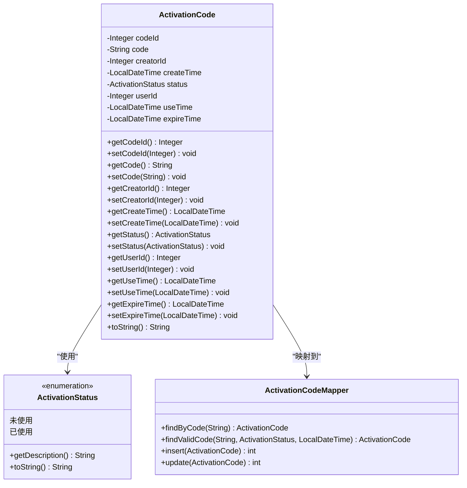
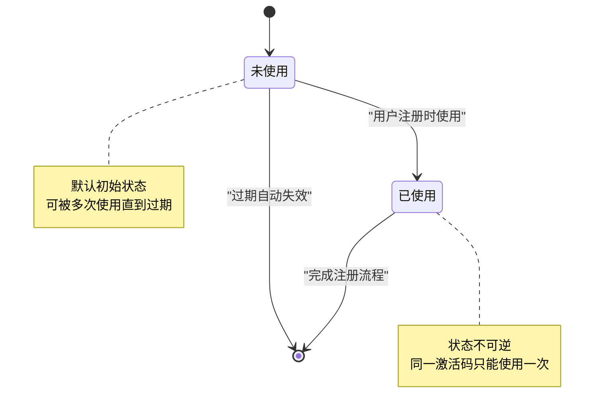
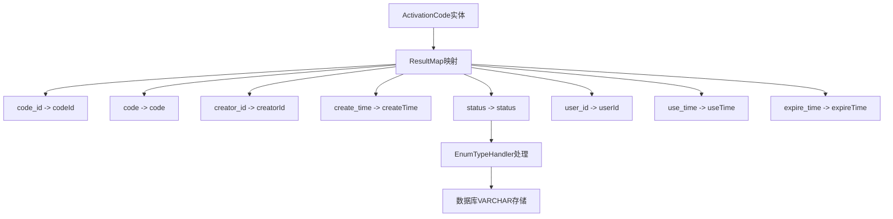
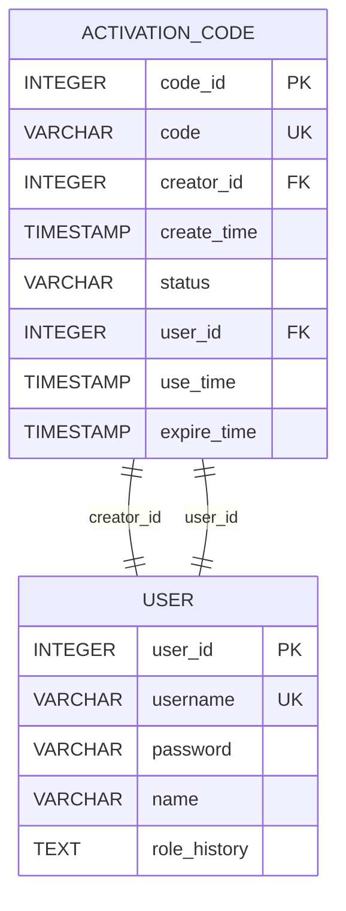
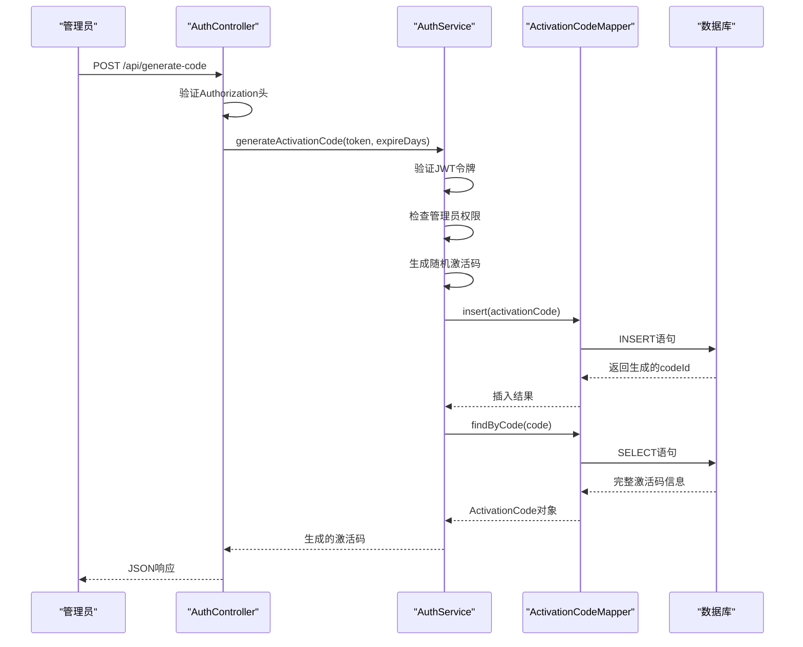
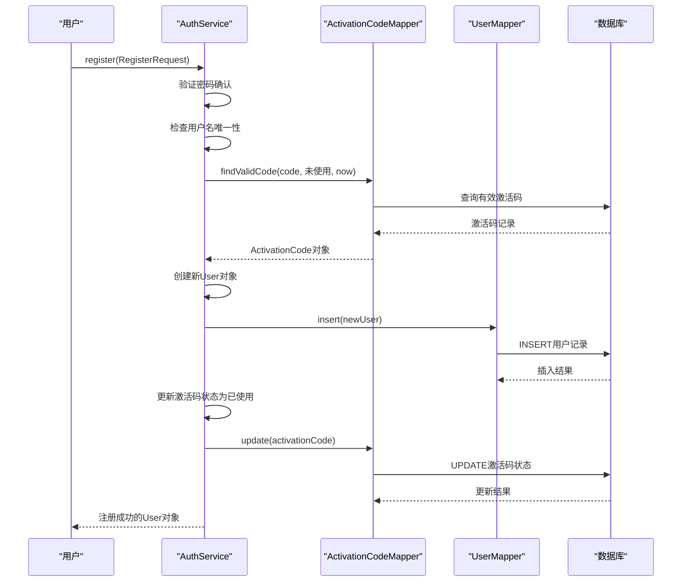
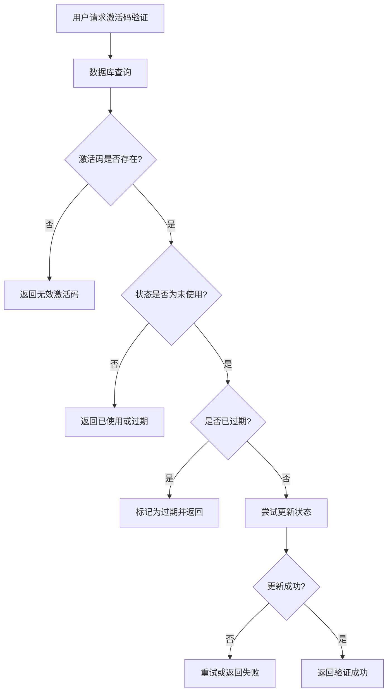

# 激活码实体（ActivationCode）

<cite>
**本文档引用的文件**
- [ActivationCode.java](file://src/main/java/com/redmoon2333/entity/ActivationCode.java)
- [ActivationStatus.java](file://src/main/java/com/redmoon2333/enums/ActivationStatus.java)
- [ActivationCodeMapper.java](file://src/main/java/com/redmoon2333/mapper/ActivationCodeMapper.java)
- [ActivationCodeMapper.xml](file://src/main/resources/mapper/ActivationCodeMapper.xml)
- [AuthService.java](file://src/main/java/com/redmoon2333/service/AuthService.java)
- [AuthController.java](file://src/main/java/com/redmoon2333/controller/AuthController.java)
</cite>

## 目录
1. [简介](#简介)
2. [实体结构分析](#实体结构分析)
3. [核心属性详解](#核心属性详解)
4. [状态管理机制](#状态管理机制)
5. [数据库映射与查询](#数据库映射与查询)
6. [使用场景与流程](#使用场景与流程)
7. [并发处理与安全考虑](#并发处理与安全考虑)
8. [最佳实践建议](#最佳实践建议)
9. [总结](#总结)

## 简介

ActivationCode实体是人力资源管理系统中用户注册邀请机制的核心组件，负责管理激活码的生命周期。该实体通过严格的业务规则确保只有经过授权的用户才能生成和使用激活码，为系统的安全性和可追溯性提供了重要保障。

激活码系统采用基于状态的管理模式，通过ActivationStatus枚举控制激活码的状态流转，支持未使用、已使用两种基本状态，并通过过期时间机制确保激活码的时效性。

## 实体结构分析

ActivationCode实体采用了标准的JPA注解设计，实现了完整的数据持久化功能：



**图表来源**
- [ActivationCode.java](file://src/main/java/com/redmoon2333/entity/ActivationCode.java#L1-L128)
- [ActivationStatus.java](file://src/main/java/com/redmoon2333/enums/ActivationStatus.java#L1-L24)
- [ActivationCodeMapper.java](file://src/main/java/com/redmoon2333/mapper/ActivationCodeMapper.java#L1-L48)

**章节来源**
- [ActivationCode.java](file://src/main/java/com/redmoon2333/entity/ActivationCode.java#L1-L128)

## 核心属性详解

### 基础标识属性

#### codeId
- **类型**: Integer
- **描述**: 主键标识符，采用数据库自增策略
- **用途**: 唯一标识每个激活码记录，在数据库中作为主键使用

#### code
- **类型**: String
- **描述**: 激活码字符串，长度固定为16位
- **生成规则**: 使用字母数字混合随机生成算法
- **特点**: 具有高熵值，确保唯一性

### 关联关系属性

#### creatorId
- **类型**: Integer
- **描述**: 创建者ID，关联到User表的userId
- **用途**: 追踪激活码的创建者，便于审计和责任归属

#### userId
- **类型**: Integer
- **描述**: 使用者ID，关联到User表的userId
- **用途**: 记录激活码的实际使用者，建立激活码与用户的直接关联

### 时间戳属性

#### createTime
- **类型**: LocalDateTime
- **描述**: 激活码创建时间
- **默认值**: 构造函数中自动设置为当前时间
- **用途**: 记录激活码的创建时间，用于审计和统计分析

#### useTime
- **类型**: LocalDateTime
- **描述**: 激活码使用时间
- **触发时机**: 当激活码被成功使用时自动更新
- **用途**: 记录激活码的使用时间点，便于追踪使用行为

#### expireTime
- **类型**: LocalDateTime
- **描述**: 激活码过期时间
- **设置方式**: 创建时根据expireDays参数计算得出
- **验证逻辑**: 在查询时通过数据库条件判断是否过期

**章节来源**
- [ActivationCode.java](file://src/main/java/com/redmoon2333/entity/ActivationCode.java#L10-L35)

## 状态管理机制

ActivationCode实体通过ActivationStatus枚举实现状态管理，支持以下状态：



**图表来源**
- [ActivationStatus.java](file://src/main/java/com/redmoon2333/enums/ActivationStatus.java#L6-L8)

### 状态特性分析

#### 未使用状态
- **默认值**: ActivationStatus.未使用
- **特征**: 可被多次验证但只能使用一次
- **有效期**: 依赖expireTime字段判断
- **安全性**: 支持并发验证，但需要数据库层面的约束

#### 已使用状态
- **特征**: 状态不可逆，同一激活码只能使用一次
- **触发条件**: 用户成功注册后自动更新
- **审计价值**: 完整的使用轨迹记录

**章节来源**
- [ActivationStatus.java](file://src/main/java/com/redmoon2333/enums/ActivationStatus.java#L1-L24)

## 数据库映射与查询

### MyBatis映射配置

ActivationCode实体通过XML配置文件实现完整的数据库映射：



**图表来源**
- [ActivationCodeMapper.xml](file://src/main/resources/mapper/ActivationCodeMapper.xml#L8-L16)

### 查询方法详解

#### findByCode方法
- **功能**: 根据激活码字符串精确查找
- **SQL**: 基本的WHERE code = #{code}查询
- **适用场景**: 激活码验证、状态查询
- **性能**: O(1)复杂度，依赖数据库索引

#### findValidCode方法
- **功能**: 查找有效的激活码（未使用且未过期）
- **SQL**: 
```sql
SELECT * FROM activation_code 
WHERE code = #{code} 
  AND status = #{status} 
  AND expire_time > #{now}
```
- **安全性**: 联合条件确保查询结果的有效性
- **性能**: 复合索引优化，避免无效查询

### 数据库约束与索引



**图表来源**
- [ActivationCodeMapper.xml](file://src/main/resources/mapper/ActivationCodeMapper.xml#L18-L28)

**章节来源**
- [ActivationCodeMapper.xml](file://src/main/resources/mapper/ActivationCodeMapper.xml#L1-L84)
- [ActivationCodeMapper.java](file://src/main/java/com/redmoon2333/mapper/ActivationCodeMapper.java#L1-L48)

## 使用场景与流程

### 管理员生成激活码流程



**图表来源**
- [AuthService.java](file://src/main/java/com/redmoon2333/service/AuthService.java#L142-L198)
- [AuthController.java](file://src/main/java/com/redmoon2333/controller/AuthController.java#L129-L152)

### 用户注册流程



**图表来源**
- [AuthService.java](file://src/main/java/com/redmoon2333/service/AuthService.java#L85-L125)

### 激活码生成算法

激活码生成采用高质量的随机算法：

```java
private String generateRandomCode() {
    String chars = "ABCDEFGHIJKLMNOPQRSTUVWXYZabcdefghijklmnopqrstuvwxyz0123456789";
    StringBuilder code = new StringBuilder();
    for (int i = 0; i < 16; i++) {
        int index = (int) (Math.random() * chars.length());
        code.append(chars.charAt(index));
    }
    return code.toString();
}
```

**特点**:
- 长度：16位字符
- 字符集：大小写字母+数字
- 随机性：基于Math.random()的伪随机数生成
- 唯一性：高熵值确保重复概率极低

**章节来源**
- [AuthService.java](file://src/main/java/com/redmoon2333/service/AuthService.java#L171-L198)
- [AuthService.java](file://src/main/java/com/redmoon2333/service/AuthService.java#L85-L125)

## 并发处理与安全考虑

### 并发使用风险

在高并发场景下，激活码可能面临以下风险：

1. **重复使用**: 多个用户同时验证同一个激活码
2. **状态不一致**: 数据库状态与内存状态不同步
3. **竞态条件**: 激活码在验证和使用之间的状态变化

### 数据库层面的防护措施

#### 原子性操作
```sql
-- 更新激活码状态的原子性操作
UPDATE activation_code 
SET status = '已使用', 
    user_id = #{userId}, 
    use_time = #{useTime} 
WHERE code = #{code} 
  AND status = '未使用' 
  AND expire_time > #{now}
```

#### 索引优化
- **code字段**: 唯一索引，防止重复创建
- **复合索引**: (code, status, expire_time)，优化findValidCode查询
- **性能**: 确保查询效率，减少锁竞争

### 应用层面的同步机制



### 错误处理策略

系统通过多层次的错误处理确保数据一致性：

1. **业务异常**: BusinessException封装具体错误信息
2. **事务回滚**: Spring事务管理自动回滚失败操作
3. **幂等性**: 设计确保重复操作不会产生副作用

**章节来源**
- [AuthService.java](file://src/main/java/com/redmoon2333/service/AuthService.java#L85-L125)

## 最佳实践建议

### 激活码设计原则

1. **安全性优先**
   - 使用强随机算法生成激活码
   - 设置合理的过期时间（建议30-90天）
   - 实施严格的权限验证

2. **性能优化**
   - 合理使用索引提高查询效率
   - 避免频繁的全表扫描
   - 考虑缓存热点激活码

3. **可维护性**
   - 清晰的状态定义和转换逻辑
   - 完善的日志记录机制
   - 详细的错误信息反馈

### 监控与运维

#### 关键指标监控
- 激活码生成成功率
- 激活码使用率
- 并发验证冲突次数
- 数据库查询响应时间

#### 日志记录建议
```java
// 推荐的日志记录格式
logger.info("Activation code validation: code={}, status={}, result={}", 
           activationCode.getCode(), 
           activationCode.getStatus(), 
           validationResult);
```

### 扩展性考虑

#### 支持更多状态
当前版本只支持"未使用"和"已使用"两种状态，未来可以扩展：
- "已过期"状态
- "已禁用"状态
- "部分使用"状态（针对特殊场景）

#### 多维度验证
除了基本的时间和状态验证，可以增加：
- IP地址限制
- 设备指纹验证
- 频率限制机制

## 总结

ActivationCode实体作为人力资源管理系统的核心组件，通过精心设计的数据模型和业务逻辑，为用户注册邀请机制提供了可靠的技术支撑。其主要优势包括：

### 技术优势
- **完整性**: 完整的生命周期管理，涵盖创建、使用、过期等阶段
- **安全性**: 多层次的安全防护，包括权限验证、状态约束、并发控制
- **可扩展性**: 清晰的架构设计，便于功能扩展和维护

### 业务价值
- **权限控制**: 严格的管理员权限验证，确保系统安全
- **审计追踪**: 完整的操作日志和状态变更记录
- **用户体验**: 简单易用的API接口，支持快速集成

### 改进建议
1. **增强并发控制**: 引入乐观锁机制进一步提升并发性能
2. **完善监控体系**: 增加实时监控和告警机制
3. **扩展验证维度**: 支持更多维度的激活码验证规则

ActivationCode实体的设计充分体现了现代软件开发的最佳实践，既保证了系统的稳定性和安全性，又为未来的功能扩展预留了充足的空间。通过合理的架构设计和严格的质量控制，该实体能够有效支撑整个系统的业务需求，为用户提供安全、可靠的注册体验。