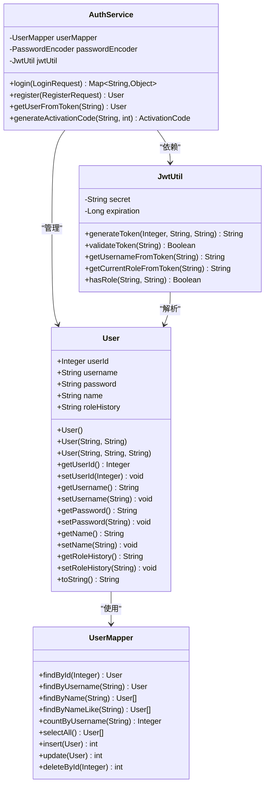
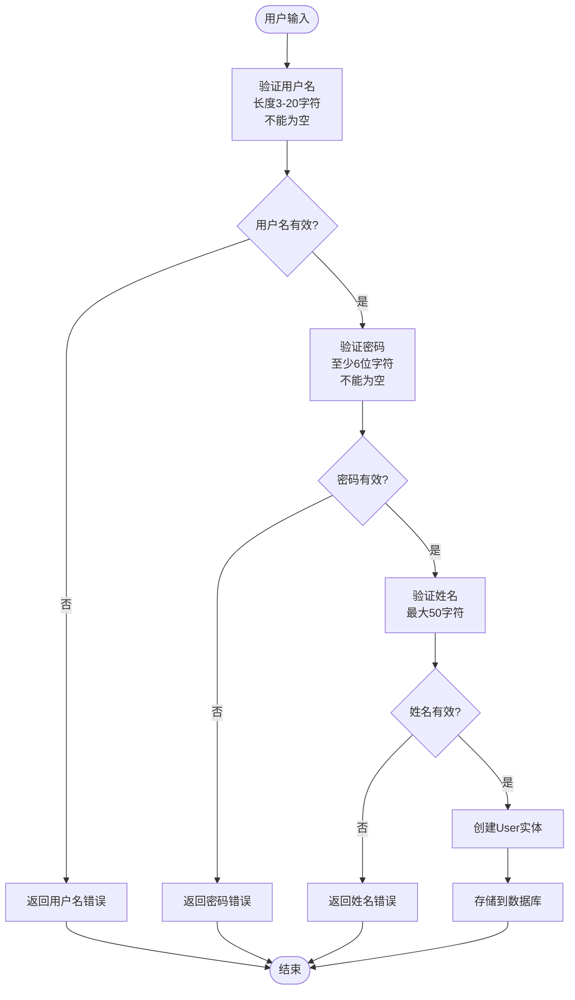
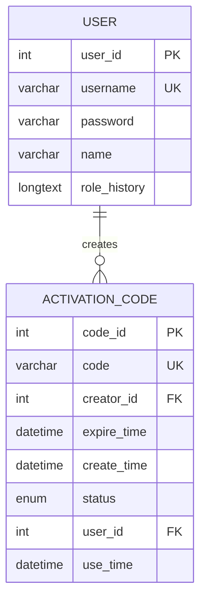
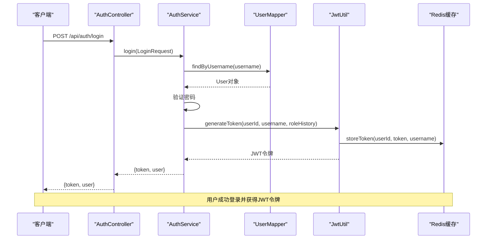
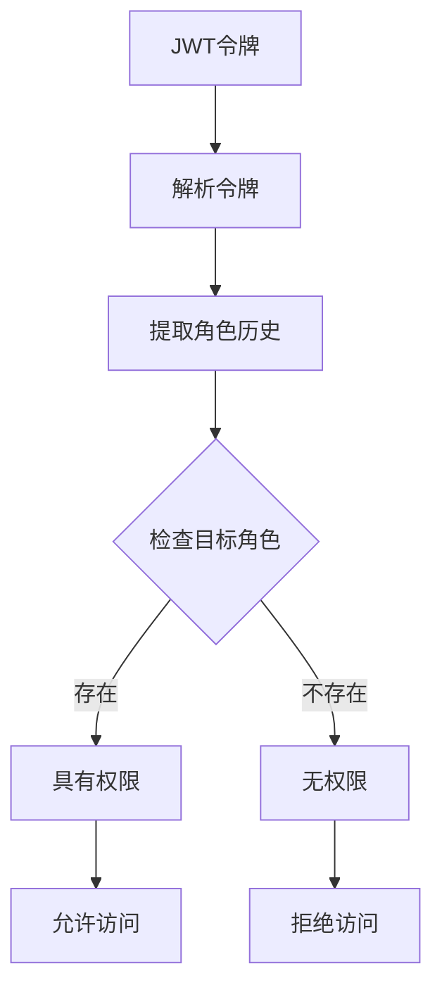
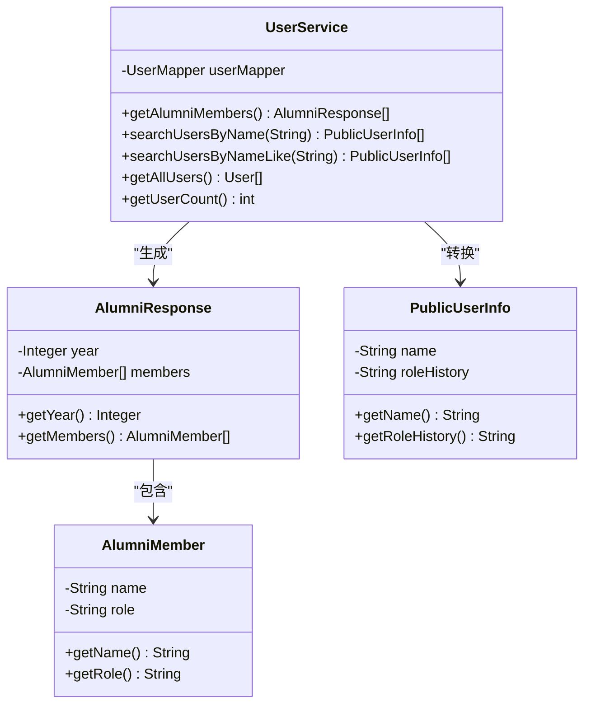
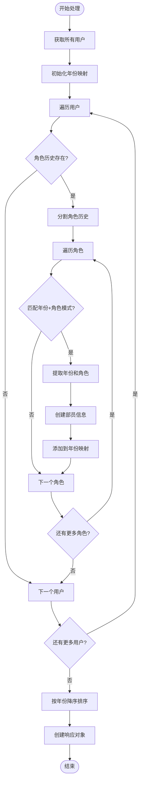
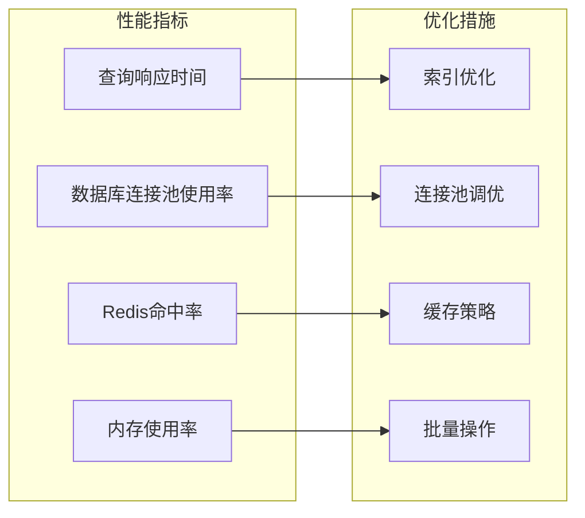

# 用户实体 (User) 数据模型文档

<cite>
**本文档引用的文件**
- [User.java](file://src/main/java/com/redmoon23333/entity/User.java)
- [UserMapper.xml](file://src/main/resources/mapper/UserMapper.xml)
- [AuthService.java](file://src/main/java/com/redmoon23333/service/AuthService.java)
- [JwtUtil.java](file://src/main/java/com/redmoon23333/util/JwtUtil.java)
- [UserController.java](file://src/main/java/com/redmoon23333/controller/UserController.java)
- [UserService.java](file://src/main/java/com/redmoon23333/service/UserService.java)
- [PublicUserInfo.java](file://src/main/java/com/redmoon23333/dto/PublicUserInfo.java)
- [AlumniResponse.java](file://src/main/java/com/redmoon23333/dto/AlumniResponse.java)
- [AlumniMember.java](file://src/main/java/com/redmoon23333/dto/AlumniMember.java)
- [application.yml](file://src/main/resources/application.yml)
</cite>

## 目录
1. [简介](#简介)
2. [用户实体结构](#用户实体结构)
3. [字段定义详解](#字段定义详解)
4. [MyBatis映射配置](#mybatis映射配置)
5. [身份认证与权限管理](#身份认证与权限管理)
6. [用户查询与操作](#用户查询与操作)
7. [性能优化建议](#性能优化建议)
8. [故障排除指南](#故障排除指南)
9. [总结](#总结)

## 简介

用户实体(User)是人力资源管理系统的核心数据模型，负责存储和管理系统的用户信息。该实体不仅包含了基本的用户标识信息，还支持复杂的身份历史管理和多角色权限控制。通过MyBatis框架，用户实体实现了与MySQL数据库的高效交互，并通过JWT技术提供了安全的身份认证机制。

## 用户实体结构



**图表来源**
- [User.java](file://src/main/java/com/redmoon23333/entity/User.java#L1-L99)
- [UserMapper.xml](file://src/main/resources/mapper/UserMapper.xml#L1-L106)
- [AuthService.java](file://src/main/java/com/redmoon23333/service/AuthService.java#L1-L199)
- [JwtUtil.java](file://src/main/java/com/redmoon23333/util/JwtUtil.java#L1-L309)

## 字段定义详解

### 核心字段

#### userId (用户ID)
- **数据类型**: `Integer`
- **注解**: `@Id @GeneratedValue(strategy = GenerationType.IDENTITY)`
- **约束**: 主键，自增
- **业务含义**: 系统中用户的唯一标识符，用于数据库记录的唯一性保证

#### username (用户名)
- **数据类型**: `String`
- **注解**: `@NotBlank @Size(min = 3, max = 20)`
- **约束**: 不为空，长度3-20字符
- **业务含义**: 用户登录系统时使用的唯一标识，用于身份验证

#### password (密码)
- **数据类型**: `String`
- **注解**: `@NotBlank @Size(min = 6)`
- **约束**: 不为空，至少6位字符
- **业务含义**: 用户的加密密码，经过Spring Security的PasswordEncoder处理

#### name (姓名)
- **数据类型**: `String`
- **注解**: `@Size(max = 50)`
- **约束**: 最大50字符
- **业务含义**: 用户的真实姓名，用于显示和识别

#### roleHistory (角色历史)
- **数据类型**: `String`
- **注解**: 无
- **约束**: 可为空
- **业务含义**: 存储用户的历史角色信息，格式为"年份+角色"的组合，如"2024级部长&2023级部员"

### 字段约束与验证



**图表来源**
- [User.java](file://src/main/java/com/redmoon23333/entity/User.java#L15-L35)

**章节来源**
- [User.java](file://src/main/java/com/redmoon23333/entity/User.java#L1-L99)

## MyBatis映射配置

### 结果映射配置

UserMapper.xml定义了完整的数据库表映射关系：

```xml
<resultMap id="BaseResultMap" type="com.redmoon23333.entity.User">
    <id column="user_id" property="userId" jdbcType="INTEGER"/>
    <result column="username" property="username" jdbcType="VARCHAR"/>
    <result column="password" property="password" jdbcType="VARCHAR"/>
    <result column="name" property="name" jdbcType="VARCHAR"/>
    <result column="role_history" property="roleHistory" jdbcType="LONGVARCHAR"/>
</resultMap>
```

### SQL操作详解

#### 查询操作

1. **根据ID查询用户**
```xml
<select id="findById" parameterType="java.lang.Integer" resultMap="BaseResultMap">
    SELECT user_id, username, password, name, role_history
    FROM user
    WHERE user_id = #{userId}
</select>
```

2. **根据用户名查询用户**
```xml
<select id="findByUsername" parameterType="java.lang.String" resultMap="BaseResultMap">
    SELECT user_id, username, password, name, role_history
    FROM user
    WHERE username = #{username}
</select>
```

3. **根据姓名查询用户**
```xml
<select id="findByName" parameterType="java.lang.String" resultMap="BaseResultMap">
    SELECT user_id, username, password, name, role_history
    FROM user
    WHERE name = #{name}
</select>
```

4. **模糊查询用户**
```xml
<select id="findByNameLike" parameterType="java.lang.String" resultMap="BaseResultMap">
    SELECT user_id, username, password, name, role_history
    FROM user
    WHERE name LIKE CONCAT('%', #{name}, '%')
</select>
```

#### 动态更新操作

```xml
<update id="update" parameterType="com.redmoon23333.entity.User">
    UPDATE user
    <set>
        <if test="username != null">
            username = #{username},
        </if>
        <if test="password != null">
            password = #{password},
        </if>
        <if test="name != null">
            name = #{name},
        </if>
        <if test="roleHistory != null">
            role_history = #{roleHistory},
        </if>
    </set>
    WHERE user_id = #{userId}
</update>
```

### 数据库表结构



**图表来源**
- [UserMapper.xml](file://src/main/resources/mapper/UserMapper.xml#L6-L12)

**章节来源**
- [UserMapper.xml](file://src/main/resources/mapper/UserMapper.xml#L1-L106)

## 身份认证与权限管理

### JWT令牌生成与验证



**图表来源**
- [AuthService.java](file://src/main/java/com/redmoon23333/service/AuthService.java#L35-L55)
- [JwtUtil.java](file://src/main/java/com/redmoon23333/util/JwtUtil.java#L40-L60)

### 角色历史解析

JwtUtil提供了强大的角色历史解析功能：

```java
private String getCurrentRole(String roleHistory) {
    if (roleHistory == null || roleHistory.trim().isEmpty()) {
        return "";
    }
    
    String[] roles = roleHistory.split("&");
    if (roles.length > 0) {
        return roles[0].trim(); // 返回第一个身份作为当前身份
    }
    
    return roleHistory.trim();
}
```

### 权限检查机制



**图表来源**
- [JwtUtil.java](file://src/main/java/com/redmoon23333/util/JwtUtil.java#L250-L270)

**章节来源**
- [AuthService.java](file://src/main/java/com/redmoon23333/service/AuthService.java#L1-L199)
- [JwtUtil.java](file://src/main/java/com/redmoon23333/util/JwtUtil.java#L1-L309)

## 用户查询与操作

### 用户信息服务架构



**图表来源**
- [UserService.java](file://src/main/java/com/redmoon23333/service/UserService.java#L1-L250)
- [AlumniResponse.java](file://src/main/java/com/redmoon23333/dto/AlumniResponse.java#L1-L31)
- [AlumniMember.java](file://src/main/java/com/redmoon23333/dto/AlumniMember.java#L1-L29)
- [PublicUserInfo.java](file://src/main/java/com/redmoon23333/dto/PublicUserInfo.java#L1-L29)

### 往届部员信息处理流程

UserService的getAlumniMembers方法展示了复杂的角色历史解析逻辑：



**图表来源**
- [UserService.java](file://src/main/java/com/redmoon23333/service/UserService.java#L35-L130)

### 用户搜索功能

系统提供了多种用户搜索方式：

1. **精确姓名搜索**
```java
public List<PublicUserInfo> searchUsersByName(String name) {
    List<User> users = userMapper.findByName(name);
    return users.stream()
        .map(user -> new PublicUserInfo(user.getName(), user.getRoleHistory()))
        .collect(Collectors.toList());
}
```

2. **模糊姓名搜索**
```java
public List<PublicUserInfo> searchUsersByNameLike(String name) {
    List<User> users = userMapper.findByNameLike(name);
    return users.stream()
        .map(user -> new PublicUserInfo(user.getName(), user.getRoleHistory()))
        .collect(Collectors.toList());
}
```

**章节来源**
- [UserService.java](file://src/main/java/com/redmoon23333/service/UserService.java#L1-L250)
- [UserController.java](file://src/main/java/com/redmoon23333/controller/UserController.java#L1-L140)

## 性能优化建议

### 数据库索引优化

1. **主键索引**: userId自动创建
2. **用户名唯一索引**: username字段
3. **姓名索引**: name字段（用于搜索）

### MyBatis查询优化

1. **结果映射复用**: 使用BaseResultMap避免重复定义
2. **SQL片段复用**: Base_Column_List提高维护性
3. **动态SQL**: update语句只更新非空字段

### 缓存策略

1. **Redis缓存**: JWT令牌存储和黑名单管理
2. **查询结果缓存**: 对于不经常变化的用户信息
3. **会话缓存**: 减少数据库查询次数

### 性能监控指标



**章节来源**
- [application.yml](file://src/main/resources/application.yml#L1-L62)

## 故障排除指南

### 常见问题与解决方案

1. **用户登录失败**
   - 检查用户名密码是否正确
   - 验证密码编码器配置
   - 确认用户账户状态

2. **JWT令牌验证失败**
   - 检查令牌是否过期
   - 验证密钥配置
   - 确认Redis连接状态

3. **角色历史解析错误**
   - 检查角色历史格式
   - 验证正则表达式匹配
   - 确认字符串编码

### 调试接口使用

系统提供了专门的调试接口：

```java
@GetMapping("/debug/all")
public ApiResponse<?> getAllUsersDebug() {
    // 获取用户总数和详细信息
    int userCount = userService.getUserCount();
    List<User> allUsers = userService.getAllUsersDebug();
    
    // 输出调试信息
    for (User user : allUsers) {
        logger.info("用户详情 - ID: {}, 用户名: {}, 姓名: {}, 角色历史: '{}'", 
            user.getUserId(), user.getUsername(), user.getName(), user.getRoleHistory());
    }
}
```

**章节来源**
- [UserController.java](file://src/main/java/com/redmoon23333/controller/UserController.java#L30-L60)

## 总结

用户实体(User)作为人力资源管理系统的核心组件，通过精心设计的数据模型和完善的权限管理体系，为整个系统提供了坚实的基础。其主要特点包括：

1. **完整的数据模型**: 包含用户基本信息和历史记录
2. **灵活的权限控制**: 支持多角色历史和动态权限检查
3. **高效的数据库交互**: 通过MyBatis实现ORM映射
4. **安全的身份认证**: 基于JWT的令牌机制
5. **丰富的查询功能**: 支持精确和模糊搜索

该设计不仅满足了当前的功能需求，还具备良好的扩展性和维护性，为未来系统的发展奠定了坚实的基础。