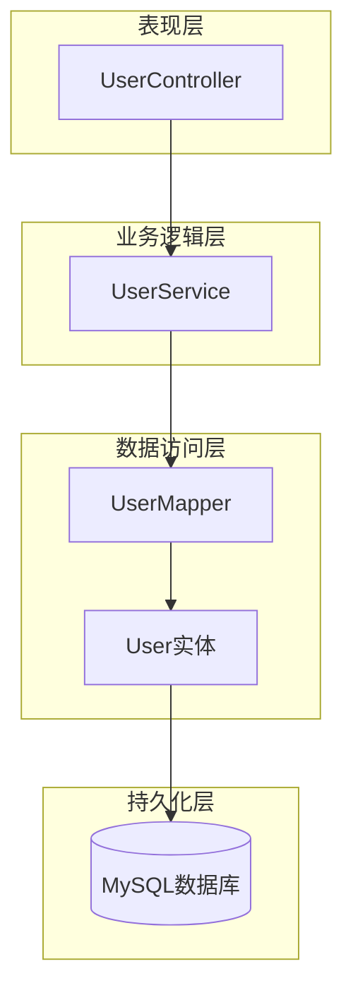
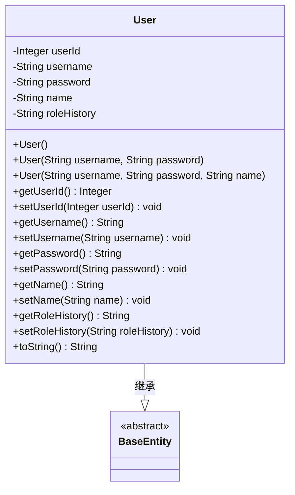
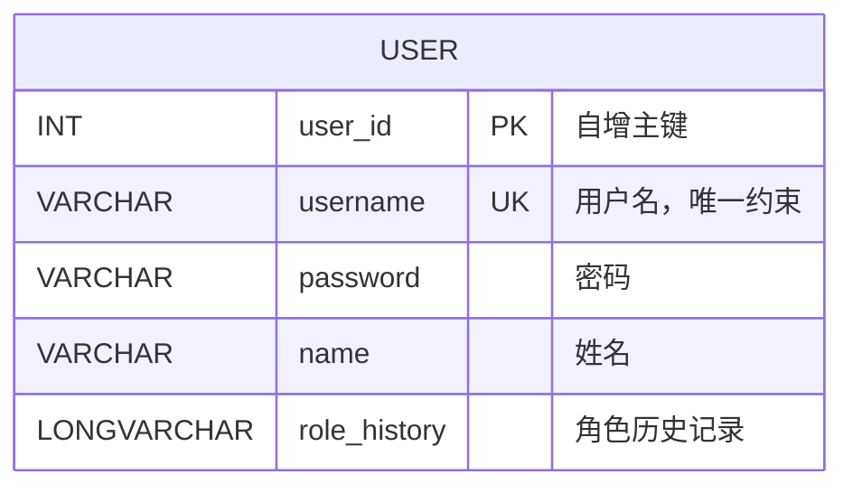
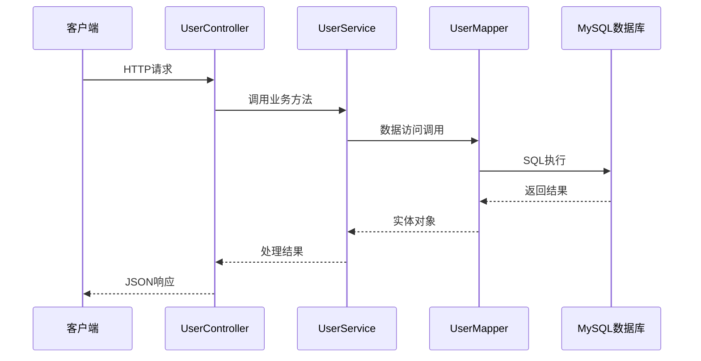
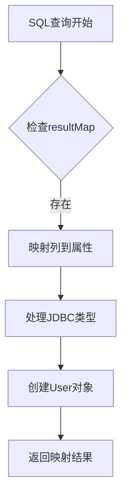
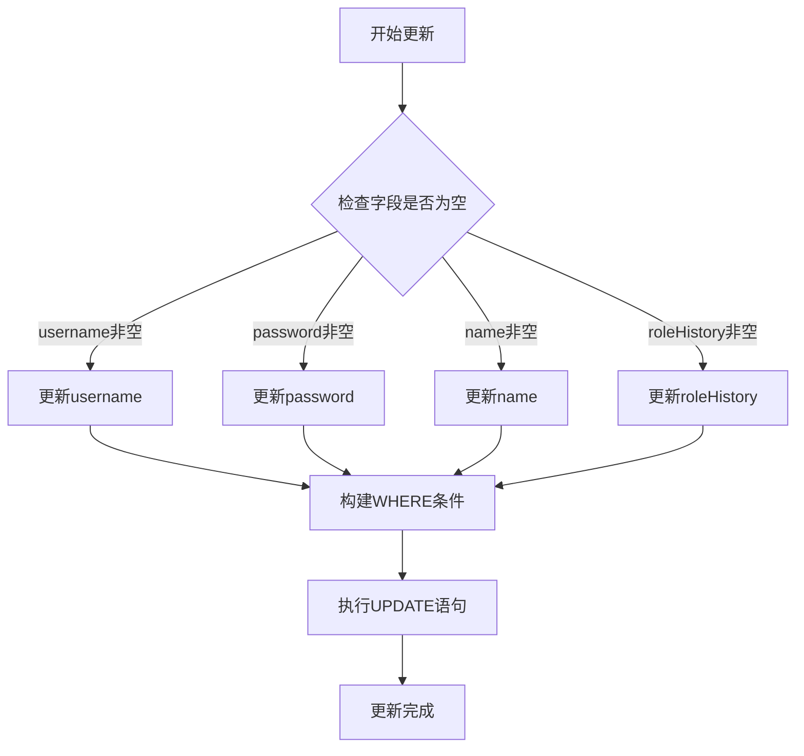
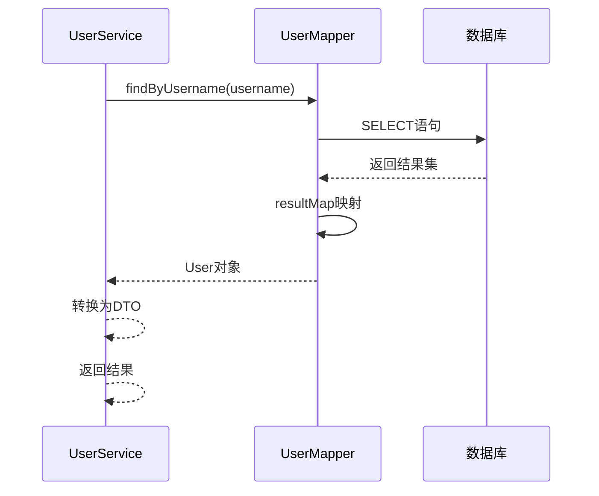
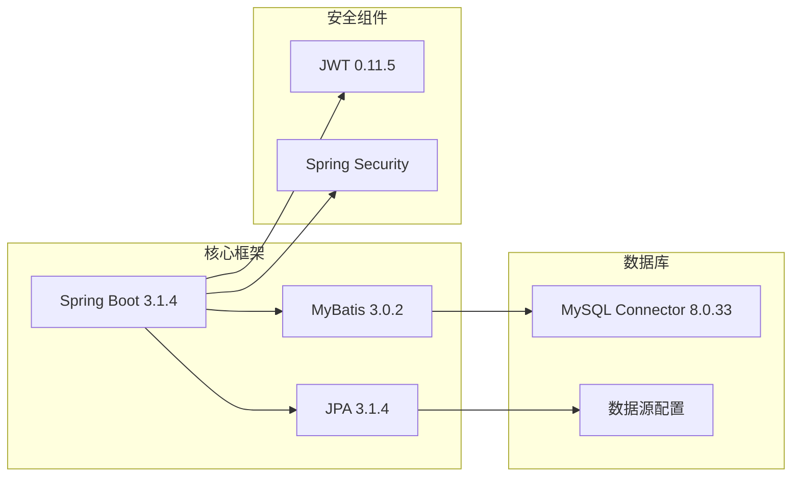

# 用户实体（User）

<cite>
**本文档引用的文件**
- [User.java](file://src/main/java/com/redmoon2333/entity/User.java)
- [UserMapper.xml](file://src/main/resources/mapper/UserMapper.xml)
- [UserService.java](file://src/main/java/com/redmoon2333/service/UserService.java)
- [UserController.java](file://src/main/java/com/redmoon2333/controller/UserController.java)
- [PublicUserInfo.java](file://src/main/java/com/redmoon2333/dto/PublicUserInfo.java)
- [pom.xml](file://pom.xml)
</cite>

## 目录
1. [简介](#简介)
2. [项目结构概览](#项目结构概览)
3. [核心组件分析](#核心组件分析)
4. [架构概览](#架构概览)
5. [详细组件分析](#详细组件分析)
6. [依赖关系分析](#依赖关系分析)
7. [性能考虑](#性能考虑)
8. [故障排除指南](#故障排除指南)
9. [结论](#结论)

## 简介

用户实体（User）是人力资源管理系统的核心数据模型，负责管理系统的用户身份认证、权限管理和个人信息存储。该实体采用JPA注解进行ORM映射，配合MyBatis实现数据库操作，为整个系统提供了完整的用户管理功能。

## 项目结构概览

本项目采用Spring Boot框架构建，遵循分层架构设计原则：

**图表来源**
- [UserController.java](file://src/main/java/com/redmoon2333/controller/UserController.java#L1-L140)
- [UserService.java](file://src/main/java/com/redmoon2333/service/UserService.java#L1-L250)
- [UserMapper.xml](file://src/main/resources/mapper/UserMapper.xml#L1-L106)

**章节来源**
- [pom.xml](file://pom.xml#L1-L88)

## 核心组件分析

### User实体类结构

User实体类定义了用户的基本属性和行为，采用了标准的Java Bean规范：

**图表来源**
- [User.java](file://src/main/java/com/redmoon2333/entity/User.java#L8-L98)

### 数据库表结构

用户实体对应的数据库表具有以下结构特征：

**图表来源**
- [User.java](file://src/main/java/com/redmoon2333/entity/User.java#L10-L20)
- [UserMapper.xml](file://src/main/resources/mapper/UserMapper.xml#L6-L10)

**章节来源**
- [User.java](file://src/main/java/com/redmoon2333/entity/User.java#L1-L99)
- [UserMapper.xml](file://src/main/resources/mapper/UserMapper.xml#L1-L106)

## 架构概览

系统采用经典的三层架构模式，实现了清晰的职责分离：

**图表来源**
- [UserController.java](file://src/main/java/com/redmoon2333/controller/UserController.java#L25-L140)
- [UserService.java](file://src/main/java/com/redmoon2333/service/UserService.java#L25-L250)
- [UserMapper.xml](file://src/main/resources/mapper/UserMapper.xml#L15-L80)

## 详细组件分析

### User实体字段详解

#### userId字段
- **数据类型**: Integer
- **约束条件**: 主键，自增
- **业务规则**: 系统自动分配，唯一标识用户
- **用途**: 作为数据库表的主键，确保每条记录的唯一性

#### username字段
- **数据类型**: String
- **约束条件**: 不为空，长度3-20字符
- **业务规则**: 唯一标识用户账户，支持登录
- **验证机制**: 使用Jakarta Validation注解进行输入校验

#### password字段
- **数据类型**: String
- **约束条件**: 不为空，长度至少6位
- **安全考虑**: 存储明文密码（需改进）
- **业务规则**: 用户登录凭证

#### name字段
- **数据类型**: String
- **约束条件**: 最大长度50字符
- **业务规则**: 用户真实姓名显示
- **用途**: 个人基本信息展示

#### roleHistory字段
- **数据类型**: String
- **约束条件**: 可为空
- **业务规则**: 记录用户的历史角色信息
- **格式**: 使用"&"连接多个角色，如"2023级部长&2024级副部长"

### MyBatis映射机制

#### resultMap配置

**图表来源**
- [UserMapper.xml](file://src/main/resources/mapper/UserMapper.xml#L6-L10)

#### 动态更新语句

MyBatis的动态更新语句展示了灵活的数据更新机制：

**图表来源**
- [UserMapper.xml](file://src/main/resources/mapper/UserMapper.xml#L70-L80)

### 数据访问模式

#### 查询操作流程

**图表来源**
- [UserService.java](file://src/main/java/com/redmoon2333/service/UserService.java#L150-L170)
- [UserMapper.xml](file://src/main/resources/mapper/UserMapper.xml#L25-L35)

**章节来源**
- [User.java](file://src/main/java/com/redmoon2333/entity/User.java#L1-L99)
- [UserMapper.xml](file://src/main/resources/mapper/UserMapper.xml#L1-L106)
- [UserService.java](file://src/main/java/com/redmoon2333/service/UserService.java#L1-L250)

## 依赖关系分析

### 技术栈依赖

**图表来源**
- [pom.xml](file://pom.xml#L20-L50)

### 组件间耦合度

系统采用松耦合设计，各组件通过接口进行交互：

- **Controller层**: 通过@Autowired注入UserService
- **Service层**: 通过@Autowired注入UserMapper
- **Mapper层**: 通过XML配置与数据库交互

**章节来源**
- [pom.xml](file://pom.xml#L1-L88)

## 性能考虑

### 数据库索引优化

建议对以下字段建立索引：
- `username`: 唯一索引，支持快速查找
- `name`: 普通索引，支持模糊查询
- `user_id`: 主键索引，自动维护

### 缓存策略

对于频繁查询的用户信息，可以考虑：
- Redis缓存常用用户数据
- 缓存用户角色信息以减少数据库查询
- 实现分布式会话管理

### 密码安全改进

当前实现存在的安全隐患：
- 密码明文存储
- 缺乏密码强度验证
- 无密码加密机制

建议改进方案：
- 使用BCrypt或Argon2进行密码哈希
- 实现密码复杂度验证
- 添加密码过期机制

## 故障排除指南

### 常见问题诊断

#### 用户名重复错误
**症状**: 注册时出现用户名已存在提示
**原因**: 数据库唯一约束冲突
**解决方案**: 
1. 检查数据库中是否存在相同用户名
2. 实现前端实时用户名验证
3. 添加更友好的错误提示

#### 角色历史解析失败
**症状**: getAlumniMembers方法抛出异常
**原因**: roleHistory格式不符合预期
**解决方案**:
1. 添加格式验证逻辑
2. 实现默认值处理
3. 记录详细的日志信息

#### 数据库连接问题
**症状**: SQL执行失败
**原因**: 数据库连接池耗尽或网络问题
**解决方案**:
1. 检查数据库连接配置
2. 监控连接池使用情况
3. 实现重试机制

**章节来源**
- [UserService.java](file://src/main/java/com/redmoon2333/service/UserService.java#L25-L250)
- [UserController.java](file://src/main/java/com/redmoon2333/controller/UserController.java#L25-L140)

## 结论

用户实体（User）作为人力资源管理系统的核心组件，承担着用户身份认证、权限管理和个人信息存储的重要职责。通过JPA和MyBatis的结合使用，系统实现了高效的数据持久化和灵活的查询功能。

### 主要优势

1. **清晰的架构设计**: 采用分层架构，职责分离明确
2. **完善的验证机制**: 使用Jakarta Validation确保数据完整性
3. **灵活的查询支持**: MyBatis动态SQL满足多样化查询需求
4. **扩展性强**: 支持角色历史记录和多维度查询

### 改进建议

1. **安全性增强**: 实现密码加密存储
2. **性能优化**: 添加缓存机制和索引优化
3. **监控完善**: 增加详细的日志记录和性能监控
4. **错误处理**: 实现更健壮的异常处理机制

该用户实体设计为系统提供了坚实的基础，通过持续的优化和改进，能够更好地支撑人力资源管理的各项业务需求。