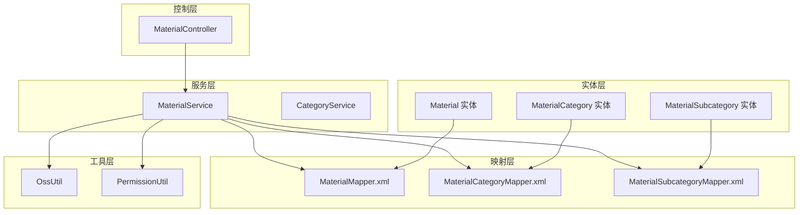
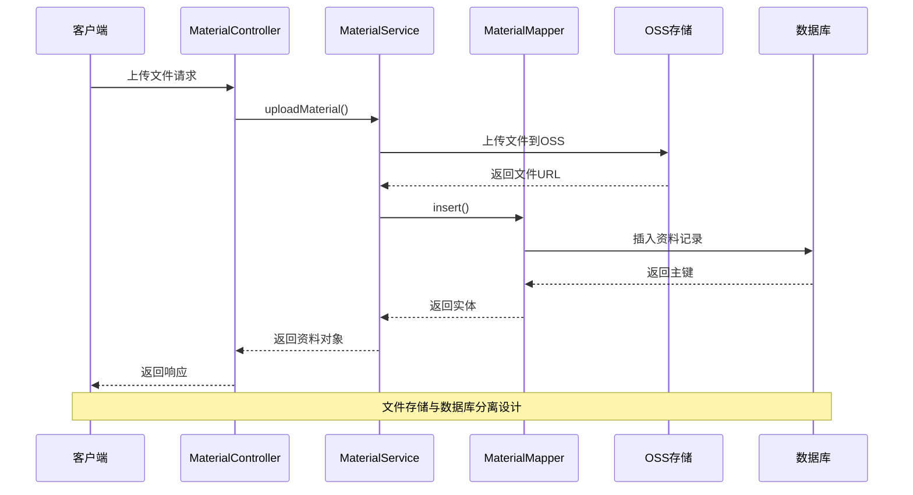
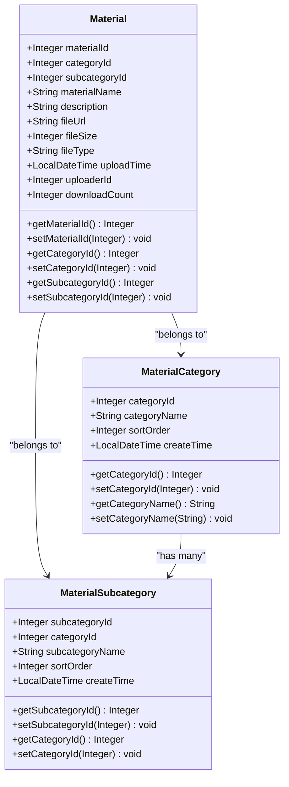
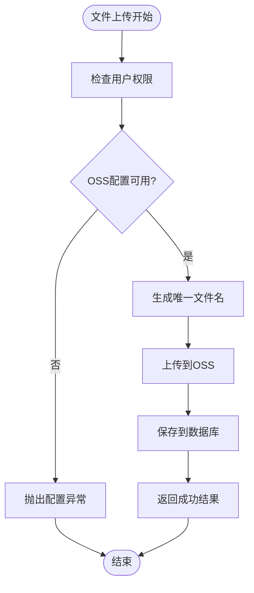
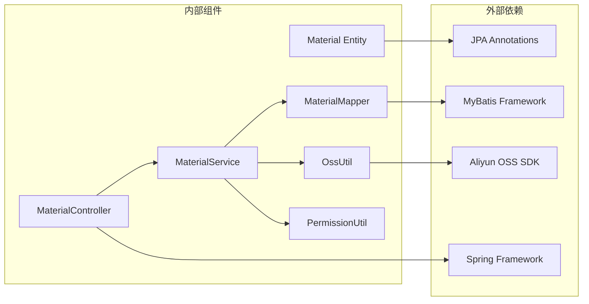

# 资料实体 (Material)

<cite>
**本文档引用的文件**
- [Material.java](file://src/main/java/com/redmoon2333/entity/Material.java)
- [MaterialMapper.xml](file://src/main/resources/mapper/MaterialMapper.xml)
- [MaterialCategory.java](file://src/main/java/com/redmoon2333/entity/MaterialCategory.java)
- [MaterialSubcategory.java](file://src/main/java/com/redmoon2333/entity/MaterialSubcategory.java)
- [MaterialController.java](file://src/main/java/com/redmoon2333/controller/MaterialController.java)
- [MaterialService.java](file://src/main/java/com/redmoon2333/service/MaterialService.java)
- [OssUtil.java](file://src/main/java/com/redmoon2333/util/OssUtil.java)
</cite>

## 目录
1. [简介](#简介)
2. [项目结构](#项目结构)
3. [核心组件](#核心组件)
4. [架构概览](#架构概览)
5. [详细组件分析](#详细组件分析)
6. [依赖关系分析](#依赖关系分析)
7. [性能考虑](#性能考虑)
8. [故障排除指南](#故障排除指南)
9. [结论](#结论)

## 简介

资料实体(Material)是内部资料管理系统的核心数据模型，负责存储和管理组织内部的各种文档资料。该实体采用分层架构设计，实现了资料名称、文件路径、分类信息、上传者、上传时间等关键属性的统一管理。通过与分类(MaterialCategory)和子分类(MaterialSubcategory)的关联关系，形成了完整的资料分类体系。

资料实体的设计遵循了现代企业级应用的最佳实践，采用了JPA注解进行ORM映射，结合MyBatis进行复杂查询操作。系统支持OSS(Object Storage Service)文件存储，实现了数据库元数据与文件存储的分离设计，提高了系统的可扩展性和性能。

## 项目结构

资料实体系统采用标准的Spring Boot项目结构，主要包含以下核心模块：



**图表来源**
- [Material.java](file://src/main/java/com/redmoon2333/entity/Material.java#L1-L164)
- [MaterialMapper.xml](file://src/main/resources/mapper/MaterialMapper.xml#L1-L156)
- [MaterialService.java](file://src/main/java/com/redmoon2333/service/MaterialService.java#L1-L459)

**章节来源**
- [Material.java](file://src/main/java/com/redmoon2333/entity/Material.java#L1-L164)
- [MaterialMapper.xml](file://src/main/resources/mapper/MaterialMapper.xml#L1-L156)

## 核心组件

### Material实体类

Material实体类是整个资料管理系统的核心，使用JPA注解进行持久化映射：

```java
@Entity
@Table(name = "material")
public class Material {
    @Id
    @GeneratedValue(strategy = GenerationType.IDENTITY)
    @Column(name = "material_id")
    private Integer materialId;
    
    @Column(name = "category_id")
    private Integer categoryId;
    
    @Column(name = "subcategory_id")
    private Integer subcategoryId;
    
    @Column(name = "material_name")
    private String materialName;
    
    @Column(name = "description")
    private String description;
    
    @Column(name = "file_url")
    private String fileUrl;
    
    @Column(name = "file_size")
    private Integer fileSize;
    
    @Column(name = "file_type")
    private String fileType;
    
    @Column(name = "upload_time")
    private LocalDateTime uploadTime;
    
    @Column(name = "uploader_id")
    private Integer uploaderId;
    
    @Column(name = "download_count")
    private Integer downloadCount = 0;
}
```

### 关键字段说明

1. **material_id**: 主键，自增ID
2. **category_id**: 外键，关联到资料分类表
3. **subcategory_id**: 外键，关联到子分类表  
4. **material_name**: 资料名称，用于用户界面显示
5. **description**: 资料描述，提供额外信息
6. **file_url**: 文件存储路径，指向OSS存储的文件URL
7. **file_size**: 文件大小，以字节为单位
8. **file_type**: 文件类型，如PDF、DOCX等
9. **upload_time**: 上传时间，默认为当前时间
10. **uploader_id**: 上传者ID，关联到用户表
11. **download_count**: 下载计数器，默认为0

**章节来源**
- [Material.java](file://src/main/java/com/redmoon2333/entity/Material.java#L8-L40)

## 架构概览

资料实体系统采用分层架构设计，实现了清晰的职责分离：



**图表来源**
- [MaterialController.java](file://src/main/java/com/redmoon2333/controller/MaterialController.java#L40-L70)
- [MaterialService.java](file://src/main/java/com/redmoon2333/service/MaterialService.java#L45-L85)
- [OssUtil.java](file://src/main/java/com/redmoon2333/util/OssUtil.java#L65-L95)

## 详细组件分析

### 资料实体字段分析

#### 基础信息字段
- **material_name**: 资料名称字段，支持任意长度字符串，用于用户界面显示和搜索
- **description**: 资料描述字段，使用LONGVARCHAR类型支持长文本存储
- **file_url**: 文件URL字段，存储OSS文件的访问地址，支持跨域访问

#### 元数据字段
- **file_size**: 文件大小字段，以整数形式存储字节数，便于计算和比较
- **file_type**: 文件类型字段，存储文件扩展名，用于内容类型判断
- **upload_time**: 上传时间字段，使用LocalDateTime类型精确到秒
- **uploader_id**: 上传者ID字段，建立与用户表的关联关系

#### 统计字段
- **download_count**: 下载计数器字段，默认值为0，在每次下载时递增

### MyBatis映射分析

MaterialMapper.xml提供了完整的CRUD操作和复杂查询功能：

```xml
<!-- 动态条件更新 -->
<update id="update" parameterType="com.redmoon2333.entity.Material">
    UPDATE material
    <set>
        <if test="categoryId != null">
            category_id = #{categoryId},
        </if>
        <if test="subcategoryId != null">
            subcategory_id = #{subcategoryId},
        </if>
        <if test="materialName != null">
            material_name = #{materialName},
        </if>
        <if test="description != null">
            description = #{description},
        </if>
        <if test="fileUrl != null">
            file_url = #{fileUrl},
        </if>
        <if test="fileSize != null">
            file_size = #{fileSize},
        </if>
        <if test="fileType != null">
            file_type = #{fileType},
        </if>
        <if test="downloadCount != null">
            download_count = #{downloadCount},
        </if>
    </set>
    WHERE material_id = #{materialId}
</update>
```

#### 动态条件构建特点
1. **条件判断**: 使用`<if>`标签实现动态SQL构建
2. **字段选择性更新**: 只更新非空字段，避免覆盖已有数据
3. **性能优化**: 减少不必要的字段更新操作

### 分类关联关系



**图表来源**
- [Material.java](file://src/main/java/com/redmoon2333/entity/Material.java#L8-L40)
- [MaterialCategory.java](file://src/main/java/com/redmoon2333/entity/MaterialCategory.java#L8-L30)
- [MaterialSubcategory.java](file://src/main/java/com/redmoon2333/entity/MaterialSubcategory.java#L8-L30)

### OSS集成设计

系统采用OSS(Object Storage Service)作为文件存储解决方案，实现了数据库元数据与文件存储的分离：



**图表来源**
- [MaterialService.java](file://src/main/java/com/redmoon2333/service/MaterialService.java#L45-L85)
- [OssUtil.java](file://src/main/java/com/redmoon2333/util/OssUtil.java#L65-L95)

**章节来源**
- [MaterialMapper.xml](file://src/main/resources/mapper/MaterialMapper.xml#L75-L95)
- [MaterialService.java](file://src/main/java/com/redmoon2333/service/MaterialService.java#L45-L85)
- [OssUtil.java](file://src/main/java/com/redmoon2333/util/OssUtil.java#L65-L95)

## 依赖关系分析

### 组件依赖图



**图表来源**
- [Material.java](file://src/main/java/com/redmoon2333/entity/Material.java#L1-L10)
- [MaterialMapper.xml](file://src/main/resources/mapper/MaterialMapper.xml#L1-L10)
- [MaterialService.java](file://src/main/java/com/redmoon2333/service/MaterialService.java#L1-L25)

### 外键约束关系

系统通过外键约束确保数据完整性：

1. **category_id**: 引用MaterialCategory表的category_id
2. **subcategory_id**: 引用MaterialSubcategory表的subcategory_id  
3. **uploader_id**: 引用User表的user_id（隐式关联）

**章节来源**
- [Material.java](file://src/main/java/com/redmoon2333/entity/Material.java#L15-L20)
- [MaterialCategory.java](file://src/main/java/com/redmoon2333/entity/MaterialCategory.java#L15-L20)
- [MaterialSubcategory.java](file://src/main/java/com/redmoon2333/entity/MaterialSubcategory.java#L15-L20)

## 性能考虑

### 索引优化策略

针对Material表的关键字段，建议实施以下索引优化：

1. **category_id索引**: 支持按分类查询
2. **subcategory_id索引**: 支持按子分类查询
3. **uploader_id索引**: 支持按上传者查询
4. **upload_time索引**: 支持时间范围查询和排序

### 查询性能优化

```xml
<!-- 建议添加的索引SQL -->
CREATE INDEX idx_material_category ON material(category_id);
CREATE INDEX idx_material_subcategory ON material(subcategory_id);
CREATE INDEX idx_material_uploader ON material(uploader_id);
CREATE INDEX idx_material_uploadtime ON material(upload_time);
```

### 缓存策略

1. **分类缓存**: MaterialCategory和MaterialSubcategory信息可以缓存
2. **文件URL缓存**: 避免重复的OSS URL构建操作
3. **权限缓存**: 用户权限信息可以适当缓存

## 故障排除指南

### 常见问题及解决方案

#### 1. OSS配置问题
**症状**: 文件上传失败，提示"OSS客户端未配置"
**解决方案**: 
- 检查application.yml中的OSS配置项
- 确认阿里云账号权限设置
- 验证网络连接和防火墙设置

#### 2. 权限验证失败
**症状**: 403 Forbidden错误
**解决方案**:
- 检查用户角色权限
- 验证JWT令牌有效性
- 确认权限注解配置

#### 3. 文件大小限制
**症状**: 上传大文件失败
**解决方案**:
- 修改spring.servlet.multipart.max-file-size配置
- 调整spring.servlet.multipart.max-request-size参数
- 优化OSS上传策略

**章节来源**
- [MaterialService.java](file://src/main/java/com/redmoon2333/service/MaterialService.java#L50-L60)
- [OssUtil.java](file://src/main/java/com/redmoon2333/util/OssUtil.java#L40-L50)

## 结论

资料实体(Material)作为内部资料管理系统的核心组件，通过精心设计的分层架构和完善的关联关系，实现了高效、可扩展的资料管理功能。系统采用OSS存储方案，有效分离了文件存储和数据库管理，提升了系统的性能和可维护性。

通过MyBatis的动态SQL构建和JPA的ORM映射，系统提供了灵活的数据操作能力。权限控制机制确保了资料的安全访问，而统计功能则为系统运营提供了有价值的数据支持。

未来可以考虑的改进方向：
1. 实施更细粒度的权限控制
2. 添加资料版本管理功能
3. 优化大数据量场景下的查询性能
4. 增强文件预览和在线编辑功能