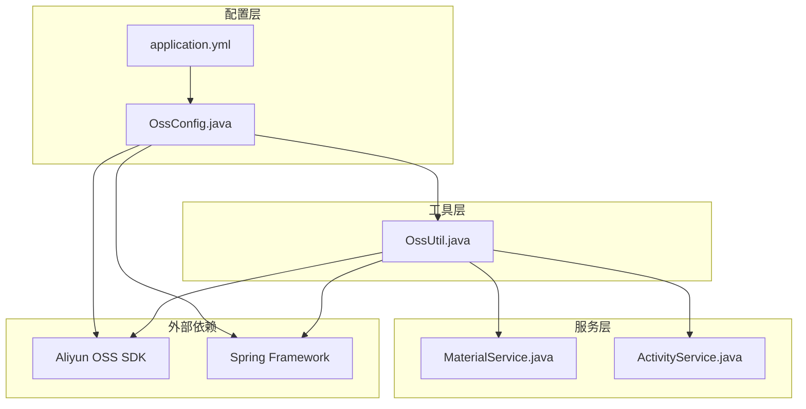
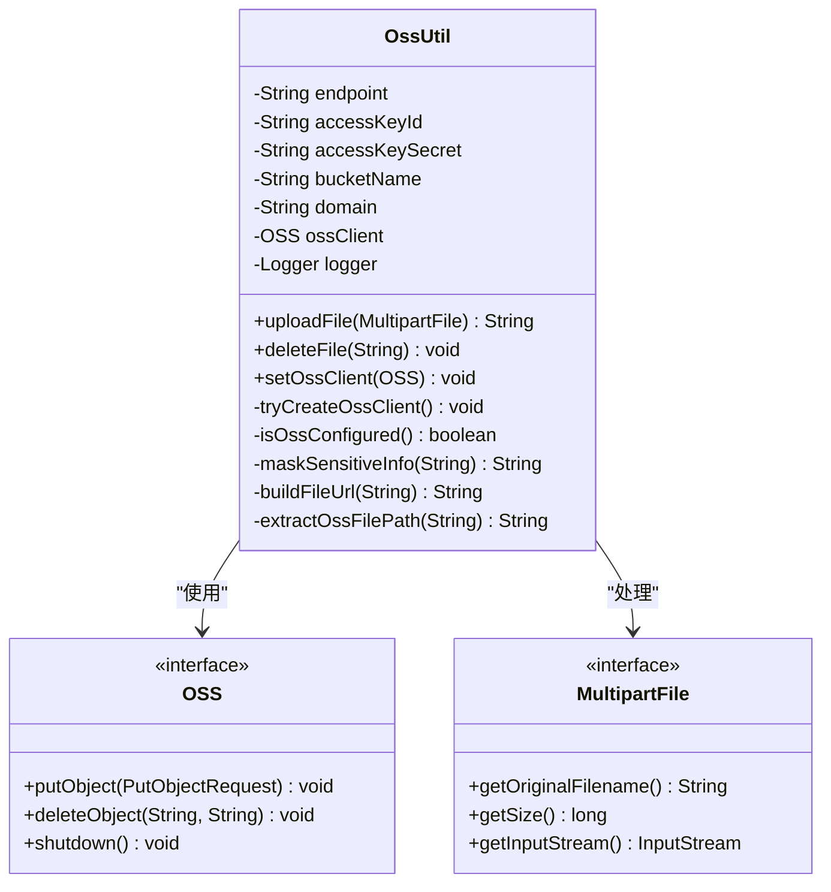
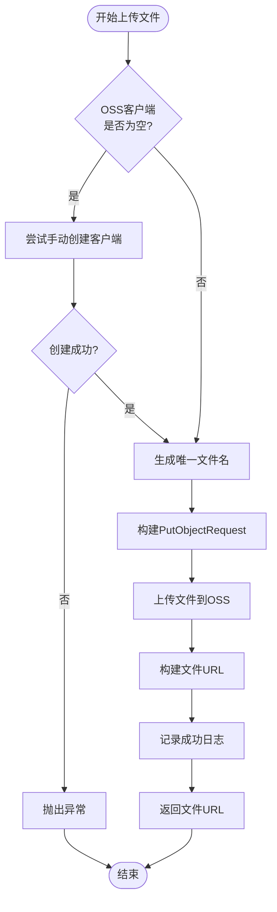
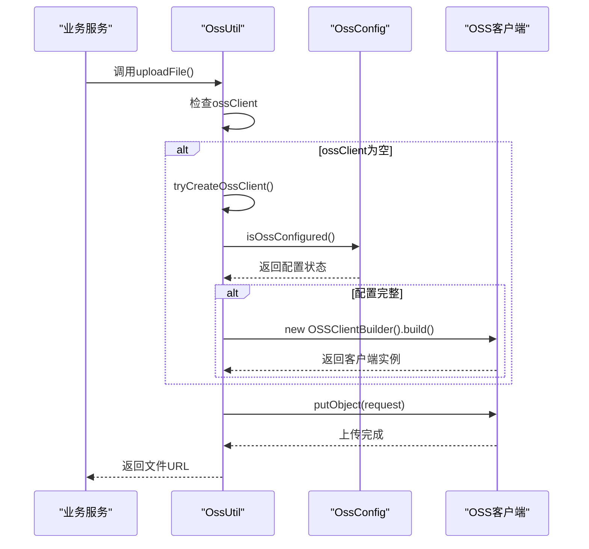
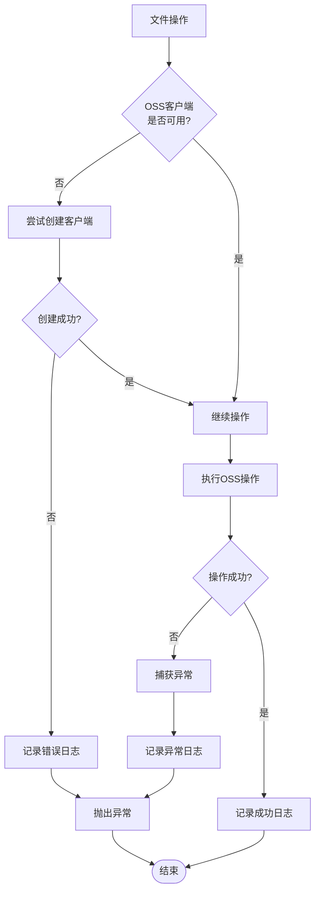

# OSS配置与工具类

<cite>
**本文档引用的文件**
- [OssConfig.java](file://src/main/java/com/redmoon2333/config/OssConfig.java)
- [OssUtil.java](file://src/main/java/com/redmoon2333/util/OssUtil.java)
- [application.yml](file://src/main/resources/application.yml)
- [MaterialService.java](file://src/main/java/com/redmoon2333/service/MaterialService.java)
- [ActivityService.java](file://src/main/java/com/redmoon2333/service/ActivityService.java)
- [docker-compose.yml](file://docker-compose.yml)
</cite>

## 目录
1. [简介](#简介)
2. [项目结构概览](#项目结构概览)
3. [OSS配置机制](#oss配置机制)
4. [OSS工具类实现](#oss工具类实现)
5. [架构设计分析](#架构设计分析)
6. [安全与容错机制](#安全与容错机制)
7. [配置最佳实践](#配置最佳实践)
8. [故障排除指南](#故障排除指南)
9. [总结](#总结)

## 简介

本文档详细分析了人力资源系统中OSS（对象存储服务）的配置机制和工具类实现。该系统采用Spring Boot框架，集成了阿里云OSS服务，提供了完整的文件上传、下载和管理功能。通过条件化配置和安全降级策略，确保系统在不同环境下都能稳定运行。

## 项目结构概览

系统采用标准的Spring Boot项目结构，OSS相关组件主要分布在以下位置：



**图表来源**
- [OssConfig.java](file://src/main/java/com/redmoon2333/config/OssConfig.java#L1-L71)
- [OssUtil.java](file://src/main/java/com/redmoon2333/util/OssUtil.java#L1-L211)

## OSS配置机制

### 条件化配置实现

OssConfig类通过`@ConditionalOnExpression`注解实现了智能的条件化配置：

```java
@Configuration
@ConditionalOnExpression("'${aliyun.oss.accessKeyId:}' != '' && '${aliyun.oss.accessKeySecret:}' != ''")
public class OssConfig {
    // 配置类实现
}
```

这种设计确保只有在正确配置了访问密钥的情况下才会创建OSS客户端，避免了不必要的资源消耗和潜在的安全风险。

### 环境变量注入机制

配置参数通过Spring的`@Value`注解从环境变量中注入：

```java
@Value("${aliyun.oss.endpoint:oss-cn-hangzhou.aliyuncs.com}")
private String endpoint;

@Value("${aliyun.oss.accessKeyId:}")
private String accessKeyId;

@Value("${aliyun.oss.accessKeySecret:}")
private String accessKeySecret;

@Value("${aliyun.oss.bucketName:}")
private String bucketName;
```

这种设计提供了灵活的配置方式：
- 支持默认值设置（如endpoint的默认值为`oss-cn-hangzhou.aliyuncs.com`）
- 支持环境变量覆盖（`${ALIYUN_OSS_ENDPOINT:}`）
- 提供了优雅的降级策略

### 安全降级策略

配置类实现了完善的凭证验证和降级机制：

```java
// 检查是否配置了必要的凭证
if (accessKeyId == null || accessKeyId.isEmpty() || 
    accessKeySecret == null || accessKeySecret.isEmpty()) {
    logger.warn("OSS凭证未正确配置，将返回null客户端");
    return null;
}
```

当凭证不完整时，系统不会抛出异常，而是返回null客户端，确保应用能够正常启动。

**章节来源**
- [OssConfig.java](file://src/main/java/com/redmoon2333/config/OssConfig.java#L1-L71)
- [application.yml](file://src/main/resources/application.yml#L47-L52)

## OSS工具类实现

### 核心功能架构

OssUtil作为核心工具类，提供了完整的OSS操作功能：



**图表来源**
- [OssUtil.java](file://src/main/java/com/redmoon2333/util/OssUtil.java#L15-L211)

### 文件上传实现

uploadFile方法展示了完整的文件上传流程：



**图表来源**
- [OssUtil.java](file://src/main/java/com/redmoon2333/util/OssUtil.java#L75-L115)

### UUID文件命名机制

系统采用UUID算法生成唯一文件名，确保文件名的唯一性和安全性：

```java
String originalFilename = file.getOriginalFilename();
String extension = originalFilename != null ? 
    originalFilename.substring(originalFilename.lastIndexOf(".")) : "";
String uniqueFilename = UUID.randomUUID().toString() + extension;
```

这种设计的优势：
- 避免文件名冲突
- 防止路径遍历攻击
- 保持原始文件扩展名

### MIME类型检测

OssUtil实现了基本的MIME类型检测功能：

```java
private String getContentType(String filename) {
    String ext = filename.substring(filename.lastIndexOf(".") + 1).toLowerCase();
    switch (ext) {
        case "jpg": case "jpeg": return "image/jpeg";
        case "png": return "image/png";
        case "pdf": return "application/pdf";
        // ... 更多类型
        default: return "application/octet-stream";
    }
}
```

虽然当前实现较为简单，但为未来的扩展预留了空间。

### 敏感信息遮蔽

系统实现了智能的敏感信息遮蔽功能：

```java
private String maskSensitiveInfo(String sensitiveInfo) {
    if (sensitiveInfo == null || sensitiveInfo.isEmpty()) {
        return "未配置";
    }
    
    if (sensitiveInfo.length() <= 8) {
        return sensitiveInfo.charAt(0) + "******" + 
               sensitiveInfo.charAt(sensitiveInfo.length()-1);
    } else {
        return sensitiveInfo.substring(0, 3) + "******" + 
               sensitiveInfo.substring(sensitiveInfo.length()-3);
    }
}
```

这种设计确保了日志中的敏感信息得到适当保护，同时便于运维人员识别配置状态。

**章节来源**
- [OssUtil.java](file://src/main/java/com/redmoon2333/util/OssUtil.java#L75-L211)

## 架构设计分析

### 双重客户端管理策略

系统采用了双重客户端管理策略：



**图表来源**
- [OssUtil.java](file://src/main/java/com/redmoon2333/util/OssUtil.java#L54-L85)
- [OssConfig.java](file://src/main/java/com/redmoon2333/config/OssConfig.java#L28-L50)

### 服务集成模式

多个服务类都集成了OssUtil，但采用了不同的集成策略：

```java
// MaterialService - 必需依赖
@Autowired(required = false)
private OssUtil ossUtil;

// ActivityService - 可选依赖
@Autowired(required = false)
private OssUtil ossUtil;
```

这种设计体现了不同的业务需求：
- MaterialService：文件上传功能为核心功能
- ActivityService：图片处理为辅助功能

### URL构建策略

OssUtil支持两种URL构建策略：

```java
private String buildFileUrl(String filePath) {
    String fileUrl;
    if (domain != null && !domain.isEmpty()) {
        fileUrl = domain + "/" + filePath;
    } else {
        fileUrl = "https://" + bucketName + "." + endpoint + "/" + filePath;
    }
    return fileUrl;
}
```

这种设计提供了灵活性：
- 自定义域名支持（domain配置）
- 默认OSS地址回退机制
- 适应不同的部署环境

**章节来源**
- [OssUtil.java](file://src/main/java/com/redmoon2333/util/OssUtil.java#L180-L211)
- [MaterialService.java](file://src/main/java/com/redmoon2333/service/MaterialService.java#L35-L40)
- [ActivityService.java](file://src/main/java/com/redmoon2333/service/ActivityService.java#L28-L33)

## 安全与容错机制

### 手动重试创建客户端

OssUtil实现了手动重试创建客户端的容错机制：

```java
private void tryCreateOssClient() {
    if (ossClient == null && isOssConfigured()) {
        try {
            logger.info("尝试手动创建OSS客户端");
            ossClient = new OSSClientBuilder().build(endpoint, accessKeyId, accessKeySecret);
            logger.info("手动创建OSS客户端成功");
        } catch (Exception e) {
            logger.error("手动创建OSS客户端失败", e);
        }
    }
}
```

这种设计确保了：
- 在客户端意外关闭后能够恢复
- 提供详细的错误日志
- 不影响主业务流程

### 异常处理流程

系统实现了多层次的异常处理：



**图表来源**
- [OssUtil.java](file://src/main/java/com/redmoon2333/util/OssUtil.java#L75-L115)
- [OssUtil.java](file://src/main/java/com/redmoon2333/util/OssUtil.java#L120-L150)

### 日志记录策略

系统采用了全面的日志记录策略：

```java
// 配置信息记录（不记录密钥）
logger.info("OSS配置信息: endpoint={}, bucketName={}, accessKeyIdConfigured={}, accessKeySecretConfigured={}", 
           endpoint, bucketName, 
           accessKeyId != null && !accessKeyId.isEmpty(),
           accessKeySecret != null && !accessKeySecret.isEmpty());

// 敏感信息遮蔽记录
logger.error("OSS客户端未配置或创建失败。配置检查: endpoint={}, accessKeyId={}, accessKeySecret={}, bucketName={}", 
            endpoint != null ? endpoint : "未配置",
            accessKeyId != null ? maskSensitiveInfo(accessKeyId) : "未配置",
            accessKeySecret != null ? maskSensitiveInfo(accessKeySecret) : "未配置",
            bucketName != null ? bucketName : "未配置");
```

这种设计确保了：
- 配置信息的透明性
- 敏感信息的安全保护
- 详细的故障诊断信息

**章节来源**
- [OssConfig.java](file://src/main/java/com/redmoon2333/config/OssConfig.java#L32-L45)
- [OssUtil.java](file://src/main/java/com/redmoon2333/util/OssUtil.java#L90-L115)

## 配置最佳实践

### 环境变量管理

推荐的环境变量配置方式：

```yaml
# 生产环境配置
ALIYUN_OSS_ENDPOINT: oss-cn-hangzhou.aliyuncs.com
ALIYUN_OSS_ACCESS_KEY_ID: LTAI5xxxxxxxxxxxxxxx
ALIYUN_OSS_ACCESS_KEY_SECRET: xxxxxxxxxxxxxxxxxx
ALIYUN_OSS_BUCKET_NAME: hr-official-prod
ALIYUN_OSS_DOMAIN: https://cdn.example.com

# 开发环境配置
ALIYUN_OSS_ENDPOINT: oss-cn-beijing.aliyuncs.com
ALIYUN_OSS_ACCESS_KEY_ID: LTAI4xxxxxxxxxxxxxxx
ALIYUN_OSS_ACCESS_KEY_SECRET: xxxxxxxxxxxxxxxxxx
ALIYUN_OSS_BUCKET_NAME: hr-official-dev
```

### Docker容器化配置

在Docker环境中，建议使用环境变量传递配置：

```yaml
environment:
  - ALIYUN_OSS_ENDPOINT=${ALIYUN_OSS_ENDPOINT:-}
  - ALIYUN_OSS_ACCESS_KEY_ID=${ALIYUN_OSS_ACCESS_KEY_ID:-}
  - ALIYUN_OSS_ACCESS_KEY_SECRET=${ALIYUN_OSS_ACCESS_KEY_SECRET:-}
  - ALIYUN_OSS_BUCKET_NAME=${ALIYUN_OSS_BUCKET_NAME:-}
  - ALIYUN_OSS_DOMAIN=${ALIYUN_OSS_DOMAIN:-}
```

### 安全配置建议

1. **密钥轮换**：定期更换AccessKey
2. **权限最小化**：为OSS配置设置最小必要权限
3. **网络隔离**：考虑使用VPC内网访问
4. **监控告警**：设置OSS访问监控和告警

### 性能优化建议

1. **CDN加速**：使用自定义域名配合CDN
2. **分片上传**：对于大文件考虑分片上传
3. **缓存策略**：合理设置文件缓存策略
4. **连接池**：优化OSS客户端连接池配置

**章节来源**
- [application.yml](file://src/main/resources/application.yml#L47-L52)
- [docker-compose.yml](file://docker-compose.yml#L42-L47)

## 故障排除指南

### 常见问题及解决方案

#### 1. OSS客户端创建失败

**症状**：日志显示"OSS客户端创建失败"

**可能原因**：
- 网络连接问题
- 凭证配置错误
- Endpoint配置错误

**解决方案**：
```bash
# 检查网络连通性
ping oss-cn-hangzhou.aliyuncs.com

# 验证环境变量
echo $ALIYUN_OSS_ACCESS_KEY_ID
echo $ALIYUN_OSS_ACCESS_KEY_SECRET

# 测试Endpoint
curl -I https://your-bucket.oss-cn-hangzhou.aliyuncs.com/
```

#### 2. 文件上传失败

**症状**：uploadFile方法抛出IllegalStateException

**可能原因**：
- OSS配置不完整
- Bucket权限不足
- 网络超时

**解决方案**：
```java
// 检查配置完整性
if (!ossUtil.isOssConfigured()) {
    logger.error("OSS配置不完整，请检查配置项");
}

// 手动测试客户端创建
ossUtil.tryCreateOssClient();
```

#### 3. URL构建错误

**症状**：生成的文件URL无法访问

**可能原因**：
- 自定义域名配置错误
- Bucket权限设置问题

**解决方案**：
```java
// 使用默认URL格式
String defaultUrl = "https://" + bucketName + "." + endpoint + "/" + filePath;

// 或检查自定义域名配置
if (domain != null && !domain.isEmpty()) {
    String customUrl = domain + "/" + filePath;
}
```

### 监控和诊断

#### 关键指标监控

1. **客户端创建成功率**
2. **文件上传成功率**
3. **网络延迟**
4. **错误率统计**

#### 日志分析

重点关注以下日志级别：
- ERROR：客户端创建失败、文件操作异常
- WARN：凭证配置不完整、手动创建客户端
- INFO：配置信息、操作成功记录
- DEBUG：详细的操作流程

**章节来源**
- [OssUtil.java](file://src/main/java/com/redmoon2333/util/OssUtil.java#L54-L85)
- [OssConfig.java](file://src/main/java/com/redmoon2333/config/OssConfig.java#L32-L50)

## 总结

本系统通过精心设计的OSS配置与工具类，实现了安全、可靠、高性能的对象存储服务集成。主要特点包括：

### 技术亮点

1. **智能条件化配置**：通过`@ConditionalOnExpression`实现按需创建OSS客户端
2. **多重容错机制**：支持自动和手动客户端重建
3. **安全信息保护**：智能遮蔽敏感信息，防止泄露
4. **灵活URL构建**：支持自定义域名和默认OSS地址
5. **完善的日志记录**：提供全面的操作审计和故障诊断

### 设计优势

- **高可用性**：通过双重客户端管理确保服务连续性
- **安全性**：严格的凭证验证和信息保护机制
- **可维护性**：清晰的代码结构和完善的异常处理
- **可扩展性**：模块化设计便于功能扩展

### 应用价值

该实现不仅满足了当前的人力资源系统需求，还为其他类似项目提供了可参考的最佳实践。通过合理的架构设计和完善的容错机制，确保了系统在各种环境下的稳定运行。